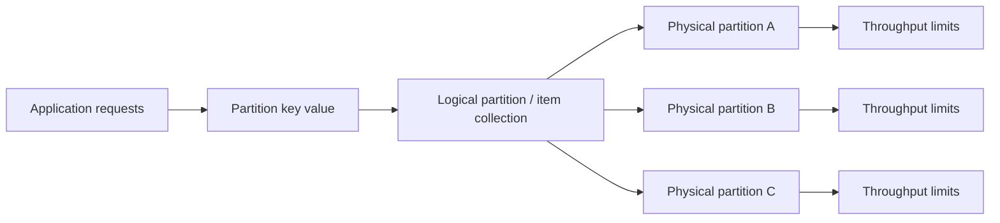
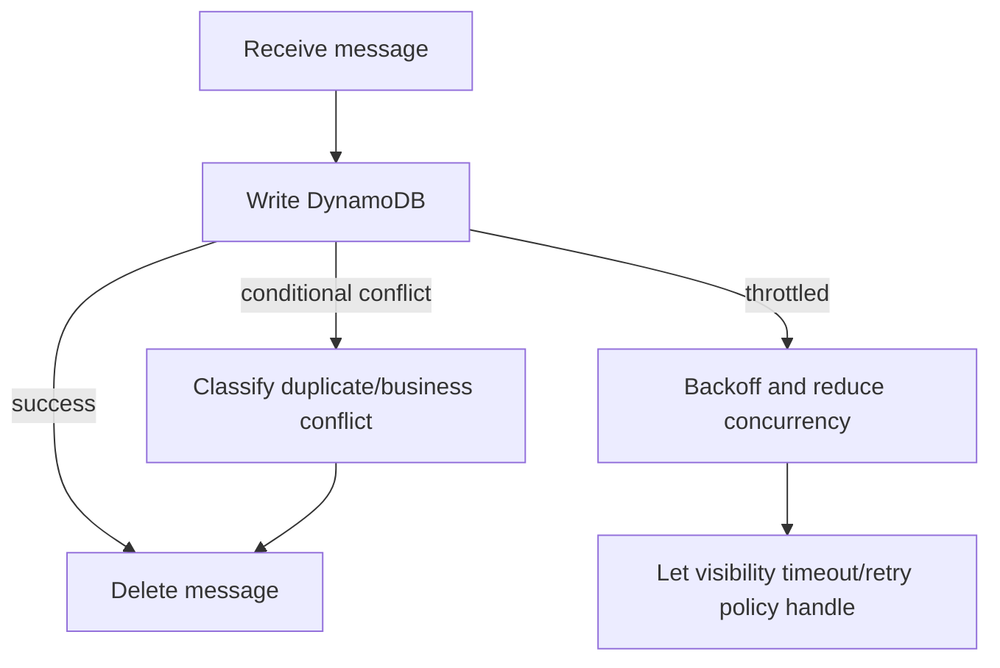

# Part 074 — Partition Key Design: Hot Key, Cardinality, Write Distribution, Adaptive Capacity

DynamoDB performance problem sering terlihat seperti “throttling”, “latency spike”, atau “on-demand mahal”. Akar masalahnya sering lebih sederhana: partition key tidak mendistribusikan workload.

Partition key bukan hanya field ID. Partition key adalah load distribution plan.

AWS documentation menyebut bahwa partition key portion dari primary key menentukan logical partition tempat data disimpan, dan design yang tidak mendistribusikan I/O secara efektif bisa membuat hot partition yang menyebabkan throttling dan penggunaan capacity tidak efisien. AWS juga menjelaskan setiap physical partition dirancang untuk batas throughput tertentu, misalnya 3,000 read capacity units per second dan 1,000 write capacity units per second untuk item size standar; adaptive capacity membantu, tetapi tidak menghapus kebutuhan key design yang benar.

---

## 1. Mental Model

DynamoDB table bukan satu mesin besar. Ia adalah distributed storage system yang membagi data berdasarkan key.

Simplified model:



Yang harus kamu desain:

1. apakah key punya cardinality cukup tinggi?
2. apakah request tersebar ke banyak key?
3. apakah beberapa key akan menjadi sangat panas?
4. apakah item collection tumbuh tanpa batas?
5. apakah GSI partition key juga aman?
6. apakah workload berubah berdasarkan waktu, tenant, status, atau event burst?

---

## 2. Partition Key Is a Workload Shape

Partition key yang baik bukan sekadar unique.

Contoh:

```txt
PK = CASE#<caseId>
```

Bagus jika operasi tersebar di banyak case.

Buruk jika ada beberapa mega-case yang menerima ribuan writes per second.

Contoh lain:

```txt
PK = TENANT#<tenantId>
```

Bagus jika tenant kecil dan query tenant-level bounded.

Buruk jika satu tenant enterprise mendominasi traffic.

Contoh status key:

```txt
GSI1PK = STATUS#OPEN
```

Biasanya buruk karena semua open item masuk satu partition key.

Lebih baik:

```txt
GSI1PK = TENANT#<tenantId>#STATUS#OPEN#BUCKET#<bucket>
```

atau query per owner/team/date depending access pattern.

---

## 3. Cardinality Is Necessary but Not Sufficient

High cardinality artinya banyak distinct partition key values.

| Candidate PK | Cardinality | Problem |
|---|---:|---|
| `COUNTRY#ID` | Low | hot country |
| `STATUS#OPEN` | Very low | hot status |
| `TENANT#tenantId` | Medium | tenant skew |
| `USER#userId` | High | celebrity/hot user risk |
| `CASE#caseId` | High | hot case possible |
| `EVENT#eventId` | Very high | good distribution, bad locality |

High cardinality tidak cukup jika traffic tidak uniform.

Example:

```txt
PK = USER#<userId>
```

Jika satu user adalah system integration account yang menulis 80% events, key itu tetap hot.

Rule:

> Measure cardinality, then model request distribution.

---

## 4. Distribution Questions

Untuk setiap candidate partition key, tanyakan:

1. Berapa distinct key per tenant?
2. Berapa writes/sec per hottest key?
3. Berapa reads/sec per hottest key?
4. Apakah traffic bursty?
5. Apakah semua write terjadi pada time window yang sama?
6. Apakah key yang sama juga dipakai oleh GSI?
7. Apakah operation butuh read locality?
8. Apakah item collection bisa melewati ukuran yang tidak sehat?
9. Apakah adaptive capacity cukup untuk spike yang realistis?
10. Apakah write sharding akan merusak query pattern?

---

## 5. Access Locality vs Load Distribution

Ada trade-off utama:

| Goal | Key example | Benefit | Risk |
|---|---|---|---|
| Locality by case | `CASE#c123` | Query case detail mudah | hot mega-case |
| Distribution by event | `EVENT#evt999` | Writes tersebar | sulit query timeline |
| Locality by tenant | `TENANT#t1` | tenant dashboard mudah | hot tenant |
| Distribution by tenant+case | `TENANT#t1#CASE#c123` | scoped and distributed | key lebih panjang |
| Time bucket | `TENANT#t1#DAY#2026-07-07` | bounded time query | hot current day |
| Sharded bucket | `TENANT#t1#DAY#2026-07-07#SHARD#03` | distributed writes | read fanout |

Tidak ada key gratis. Kamu memilih biaya mana yang paling bisa dikendalikan.

---

## 6. Hot Key Taxonomy

### 6.1 Hot Partition Key

Satu partition key value menerima request berlebihan.

Example:

```txt
PK = TENANT#mega-bank
```

Semua case/task/deadline tenant besar masuk key yang sama.

### 6.2 Hot GSI Key

Base table aman, tapi GSI hot.

Example:

```txt
GSI1PK = TASK_STATUS#OPEN
```

Semua open task masuk satu key.

### 6.3 Hot Time Bucket

```txt
PK = DAY#2026-07-07
```

Current day menerima semua writes.

### 6.4 Hot Counter

```txt
PK = COUNTER#caseCreatedToday
SK = 2026-07-07
```

Every create increments one item.

### 6.5 Hot Leaderboard

```txt
PK = LEADERBOARD#global
```

All writes update same leaderboard item/collection.

### 6.6 Hot Aggregate

```txt
PK = CASE#high-profile-case
```

High-profile case with massive evidence/event ingestion.

---

## 7. Symptoms of Bad Partition Key Design

Operational symptoms:

1. `KeyRangeThroughputExceeded` throttling;
2. p99 latency spikes while table-level capacity seems available;
3. one tenant/user/case causing system-wide issue;
4. GSI throttled while base table is fine;
5. retries amplify traffic;
6. on-demand mode still throttles under skew;
7. write-heavy current time bucket bottlenecks;
8. CloudWatch consumed capacity lower than provisioned but throttling occurs;
9. DLQ grows because DynamoDB writes fail intermittently;
10. API returns 429/500 during bursts around same key.

Design smell:

```txt
The dashboard says table has enough capacity, but writes are throttled.
```

Likely explanation: capacity is not where your hot key needs it.

---

## 8. DynamoDB Capacity Reality

Simplified capacity model:

| Unit | Meaning |
|---|---|
| RCU | Read capacity unit; cost depends item size and consistency |
| WCU | Write capacity unit; cost depends item size |
| On-demand | Pay per request, scales automatically but still subject to partition/key behavior |
| Provisioned | You set capacity; autoscaling can adjust table/index capacity |
| Physical partition | Underlying distribution unit with throughput limits |
| Adaptive capacity | DynamoDB mechanism to help uneven workloads automatically |

Important implication:

> On-demand capacity mode does not make a single hot key infinitely scalable.

You still need key distribution.

---

## 9. Adaptive Capacity: Useful, Not Magical

Adaptive capacity helps DynamoDB handle uneven access patterns automatically. It can route more capacity to hot partitions when possible.

But adaptive capacity has boundaries:

1. it cannot turn one logical key into infinite write throughput;
2. it cannot fix a single item being updated thousands of times per second;
3. it does not remove GSI hot key risk;
4. it does not replace write sharding for extreme skew;
5. it is reactive/managed behavior, not your explicit correctness model;
6. it cannot solve poor query locality if your key plan requires scans.

Treat adaptive capacity as safety margin, not primary architecture.

---

## 10. Good Partition Key Candidates

Good candidate qualities:

1. high cardinality;
2. traffic naturally distributed;
3. aligns with query locality;
4. bounded item collection growth;
5. not dominated by current status/time bucket;
6. works for both read and write distribution;
7. avoids one customer/tenant creating hot key;
8. stable over item lifetime.

Examples:

| Workload | Better PK | Notes |
|---|---|---|
| Case detail | `CASE#<caseId>` | good if case traffic distributed |
| User profile | `USER#<userId>` | watch celebrity/system users |
| Device latest state | `DEVICE#<deviceId>` | good if devices distributed |
| Order aggregate | `ORDER#<orderId>` | good transactional locality |
| Task by assignee | GSI `ASSIGNEE#<id>#STATUS#OPEN` | watch large teams/users |
| Tenant case list | GSI `TENANT#<id>#CASE_STATUS#<status>#BUCKET#<bucket>` | maybe shard/bucket for huge tenants |

---

## 11. Bad Partition Key Candidates

| Key | Why risky |
|---|---|
| `STATUS#OPEN` | low cardinality, hot status |
| `DATE#2026-07-07` | hot current date |
| `TENANT#bigTenant` | tenant skew |
| `REGION#ap-southeast-3` | low cardinality |
| `TYPE#Case` | all cases same key |
| `QUEUE#default` | one hot queue key |
| `COUNTER#global` | single hot item/key |
| `ORG#root` | hierarchy root hot spot |

---

## 12. Write Sharding

Write sharding spreads writes that would otherwise hit one key.

### 12.1 Random Suffix Sharding

```txt
PK = TENANT#t1#DAY#2026-07-07#SHARD#07
SK = EVENT#2026-07-07T10:00:01Z#evt123
```

Write chooses random shard `0..N-1`.

Pros:

1. simple;
2. good distribution;
3. effective for write-heavy ingestion.

Cons:

1. read requires fanout across all shards;
2. ordering is no longer global without merge;
3. shard count migration must be planned;
4. query cost increases.

### 12.2 Calculated Suffix Sharding

Shard based on hash of stable ID:

```txt
shard = hash(caseId) % 16
PK = TENANT#t1#STATUS#OPEN#SHARD#<shard>
```

Pros:

1. deterministic lookup;
2. better cacheability;
3. easier dedupe.

Cons:

1. if hashed field itself skewed, distribution may still be uneven;
2. changing shard count is harder.

### 12.3 Time-Bucket + Shard

For event ingestion:

```txt
PK = TENANT#t1#HOUR#2026-07-07T10#SHARD#03
SK = EVENT#2026-07-07T10:15:22Z#evt999
```

Good for:

1. high-volume append;
2. time-bounded queries;
3. TTL/retention;
4. backfill per bucket.

Risk:

1. current hour/day hot;
2. read fanout across shards;
3. late-arriving events need correct bucket policy.

---

## 13. Read Fanout Cost

Write sharding moves complexity from write path to read path.

Example: open tasks sharded across 16 keys.

```txt
GSI1PK = TENANT#t1#TASK_STATUS#OPEN#SHARD#00
...
GSI1PK = TENANT#t1#TASK_STATUS#OPEN#SHARD#15
```

To list all open tasks:

1. issue 16 parallel `Query` requests;
2. merge by `GSI1SK` due date;
3. apply page limit;
4. keep pagination token per shard;
5. handle partial failure/retry.

This is not free.

Use write sharding only when write distribution problem is real enough to justify read complexity.

---

## 14. Pagination with Sharded Reads

Naive pagination breaks with fanout.

You need composite cursor:

```json
{
  "query": "tenant-open-tasks",
  "limit": 50,
  "shards": {
    "00": {"lastEvaluatedKey": "..."},
    "01": {"lastEvaluatedKey": "..."},
    "02": null,
    "03": {"lastEvaluatedKey": "..."}
  },
  "mergeAfter": "2026-07-07T10:00:00Z#TASK#abc"
}
```

If this is too complex for UI, consider maintaining a separate projection optimized for that query.

---

## 15. Partition Key for Multi-Tenancy

Tenant ID is mandatory for authorization/audit, but not always good as partition key.

### Pattern A — Tenant in Every Item, Not Base PK

```txt
PK = CASE#<caseId>
SK = META
tenantId = t1
```

Pros:

1. case operations distributed;
2. hot tenant does not collapse into one key;
3. case item collection local.

Cons:

1. tenant-level list needs GSI;
2. authorization must be enforced in service layer.

### Pattern B — Tenant + Aggregate

```txt
PK = TENANT#t1#CASE#c123
SK = META
```

Pros:

1. explicit tenant scope in key;
2. distributed per case;
3. easier IAM leading keys only in some designs.

Cons:

1. longer keys;
2. moving tenant ownership is hard;
3. public key leakage risk.

### Pattern C — Tenant as PK

```txt
PK = TENANT#t1
SK = CASE#c123
```

Use only when tenant item collection is bounded and low throughput. Dangerous for enterprise tenants.

---

## 16. Partition Key for Time-Series Workload

Bad:

```txt
PK = DATE#2026-07-07
SK = EVENT#timestamp#eventId
```

All current date writes hit same logical key.

Better:

```txt
PK = DEVICE#deviceId#DAY#2026-07-07
SK = TS#timestamp
```

Or for tenant-wide event ingestion:

```txt
PK = TENANT#t1#HOUR#2026-07-07T10#SHARD#05
SK = EVENT#timestamp#eventId
```

Decision:

| Query | PK strategy |
|---|---|
| Get latest state per device | `DEVICE#id` item |
| Query device events by time | `DEVICE#id#DAY#date` |
| Query tenant events by time | time bucket + shard |
| Aggregate dashboard | precomputed summary/projection |

Do not query raw time-series table for every dashboard if dashboard needs aggregate views. Build projection/counter with sharded counters.

---

## 17. Partition Key for Counters

Single counter item is a hot item.

Bad:

```txt
PK = COUNTER#cases-created-today
SK = 2026-07-07
count = 123456
```

Better: sharded counter.

```txt
PK = COUNTER#cases-created#2026-07-07#SHARD#00
SK = VALUE
count = 123
```

Write increments one shard.

Read sums all shards.

Trade-off:

| Dimension | Single counter | Sharded counter |
|---|---|---|
| Write scalability | Poor | Good |
| Read simplicity | Simple | Fanout/sum |
| Exactness | Easy | Exact after sum, eventual if read replicas/projection |
| Cost | low at low traffic | higher but scalable |

If exact real-time counter is not required, use eventual aggregation via Streams/EventBridge/Lambda.

---

## 18. Partition Key for Queues and Work Claims

DynamoDB is sometimes used for custom work queues, but be careful.

Bad:

```txt
PK = QUEUE#default
SK = READY#timestamp#jobId
```

All workers query the same key.

Better:

```txt
PK = QUEUE#default#SHARD#03
SK = READY#timestamp#jobId
```

Workers poll assigned shards.

But question the premise:

- If you need queue semantics, SQS is usually simpler.
- If you need workflow, Step Functions may be clearer.
- If you need exactly controlled item state with custom claims, DynamoDB can work with conditional update and lease fields.

Work claim pattern:

```txt
Update item
SET leaseOwner = :workerId,
    leaseUntil = :future,
    attempts = attempts + 1
WHERE attribute_not_exists(leaseUntil) OR leaseUntil < :now
```

---

## 19. GSI Partition Key Design

Every GSI is another distributed keyspace. Bad key design can move hot partition from base table to GSI.

Example:

```txt
Base PK = CASE#<caseId>         // good
GSI1PK = STATUS#OPEN           // bad
```

Better:

```txt
GSI1PK = TENANT#<tenantId>#STATUS#OPEN#BUCKET#<bucket>
GSI1SK = <updatedAt>#CASE#<caseId>
```

Or if query is assignee-specific:

```txt
GSI1PK = ASSIGNEE#<userId>#TASK_STATUS#OPEN
GSI1SK = <dueAt>#CASE#<caseId>#TASK#<taskId>
```

GSI hot key checklist:

1. How many distinct GSI PK values?
2. What is hottest GSI PK write/sec?
3. Is status value low-cardinality?
4. Is current date/time bucket hot?
5. Does one tenant dominate?
6. Does sparse index concentrate active items?
7. Can query be split by team/assignee/bucket?
8. Is read fanout acceptable?

---

## 20. Composite GSI Keys

Composite GSI key should encode query dimension in selectivity order.

Need:

```txt
List open tasks for assignee by due date
```

Good:

```txt
GSI1PK = ASSIGNEE#u77#TASK_STATUS#OPEN
GSI1SK = 2026-07-12T17:00:00Z#CASE#c123#TASK#task456
```

Bad:

```txt
GSI1PK = TASK_STATUS#OPEN
GSI1SK = ASSIGNEE#u77#2026-07-12T17:00:00Z
```

Why bad?

- open status is low-cardinality;
- assignee filtering happens after reading many open tasks;
- hot key likely.

Rule:

> Put the highest-selectivity equality dimension in partition key. Put range/sort dimension in sort key.

---

## 21. Handling Large Tenants

For B2B multi-tenant apps, average tenant is irrelevant. Hottest tenant defines reliability.

Strategies:

### 21.1 Per-Aggregate Base PK

```txt
PK = TENANT#t1#CASE#c123
```

Tenant is in key but distribution is per case.

### 21.2 Tenant GSI with Buckets

```txt
GSI_TENANT_PK = TENANT#t1#CASE_STATUS#OPEN#BUCKET#07
GSI_TENANT_SK = <updatedAt>#CASE#c123
```

### 21.3 Tenant Tier-Specific Model

Small tenants:

```txt
GSI PK = TENANT#t1#STATUS#OPEN
```

Large tenants:

```txt
GSI PK = TENANT#t1#STATUS#OPEN#SHARD#nn
```

Caution: tier-specific schema increases code complexity. Use only when justified.

### 21.4 Dedicated Table for Huge Tenant

For extreme isolation:

- dedicated table per largest tenant;
- separate account/environment;
- separate capacity/cost alarm;
- routing table from tenant to table.

This breaks pure single-table simplicity but can be correct for isolation and blast radius.

---

## 22. Item Collection Growth

Item collection grows when many items share one partition key.

Examples:

```txt
PK = CASE#c123      // many events/evidence/tasks
PK = DEVICE#d1      // many telemetry points
PK = TENANT#t1      // many cases/users/tasks
```

Problems:

1. query page count grows;
2. hot aggregate grows;
3. old events slow operational reads if key prefix not isolated;
4. LSI constraints become relevant if used;
5. backfill/replay may hit same key repeatedly.

Mitigations:

| Problem | Mitigation |
|---|---|
| Too many timeline events | time-bucket event items or archive old events |
| Operational read mixed with audit trail | separate prefixes and query only needed prefix |
| Mega-case hot writes | shard event/evidence writes per case |
| Tenant-wide list too large | GSI bucket/status/time windows |
| Unbounded history | TTL/archive/export strategy |

---

## 23. Key Design for Case Timeline

Simple case timeline:

```txt
PK = CASE#c123
SK = EVENT#2026-07-07T10:15:00Z#evt999
```

Works if event volume per case is moderate.

Mega-case timeline:

```txt
PK = CASE#c123#EVENT_BUCKET#2026-07
SK = EVENT#2026-07-07T10:15:00Z#evt999
```

Or:

```txt
PK = CASE#c123#EVENT_SHARD#03
SK = EVENT#2026-07-07T10:15:00Z#evt999
```

Trade-off:

- original: simple query, hot aggregate risk;
- bucketed: bounded query by month/day, more complex timeline merge;
- sharded: write distribution, read fanout.

Choose based on measured event volume and query UX.

---

## 24. Key Design for Evidence Metadata

Binary evidence belongs in S3, not DynamoDB item body.

DynamoDB evidence metadata:

```txt
PK = CASE#c123
SK = EVIDENCE#2026-07-07T11:00:00Z#evidenceId
s3Bucket = ...
s3Key = ...
checksum = ...
classification = CONFIDENTIAL
```

If evidence ingestion is high-volume for one case:

```txt
PK = CASE#c123#EVIDENCE_BUCKET#2026-07#SHARD#03
SK = EVIDENCE#timestamp#evidenceId
```

Access pattern decides.

---

## 25. Hot Key Mitigation Matrix

| Hot key source | Symptom | Mitigation |
|---|---|---|
| Tenant as PK | large tenant throttles | use aggregate-level PK; tenant GSI with buckets |
| Status as GSI PK | open status hot | add tenant/owner/bucket/shard |
| Current day bucket | write spike | add finer bucket + shard |
| Global counter | conditional update throttles | sharded counter/eventual aggregation |
| Popular case | hot case events | case event buckets/shards |
| Leaderboard | writes conflict | precompute partitioned leaderboard |
| System user | user key hot | split by source/workload/time bucket |
| Outbox pending key | publisher hot | shard pending outbox index |

---

## 26. Outbox Partition Key Design

Bad:

```txt
GSI_OUTBOX_PK = OUTBOX#PENDING
GSI_OUTBOX_SK = createdAt#eventId
```

All pending events share one key.

Better:

```txt
GSI_OUTBOX_PK = OUTBOX#PENDING#SHARD#03
GSI_OUTBOX_SK = createdAt#eventId
```

Shard choice:

```txt
shard = hash(eventId) % 16
```

Publisher:

1. poll shards fairly;
2. limit per shard;
3. use idempotent publish;
4. mark published with condition;
5. monitor per-shard lag.

---

## 27. TTL and Partition Key Design

TTL deletes are asynchronous. Do not depend on TTL for exact deletion time.

TTL use cases:

1. idempotency records;
2. deduplication records;
3. temporary sessions;
4. ephemeral locks;
5. short-lived projections;
6. old operational cache items.

Key risk:

```txt
PK = EXPIRES#2026-07-07
```

All expiring items share same hot key if writes grouped by expiry date.

Better:

```txt
PK = IDEMPOTENCY#<idempotencyKey>
SK = COMMAND
expiresAt = epochSeconds
```

TTL should be attribute, not necessarily partition key.

---

## 28. Global Tables and Key Design

Global Tables replicate writes across Regions. Partition key design still matters.

Risks:

1. same hot key replicated globally;
2. active-active writes to same item cause conflict semantics;
3. tenant routing can create cross-region skew;
4. write sharding must be deterministic across Regions;
5. idempotency keys must be globally stable.

Active-active safer pattern:

```txt
PK = REGION_HOME#ap-southeast-3#CASE#c123
```

or:

```txt
PK = CASE#c123
homeRegion = ap-southeast-3
```

Application routes writes for same aggregate to home Region where possible.

---

## 29. Observability for Partition Key Health

You need visibility beyond table-level consumed capacity.

Signals:

1. throttled requests by operation;
2. `KeyRangeThroughputExceeded` reason if available;
3. p95/p99 latency per operation;
4. retry count per operation;
5. consumed capacity per request in logs;
6. partition-key hash or redacted key prefix in structured logs;
7. top tenant/user/case by request count;
8. GSI-specific throttling;
9. DLQ messages caused by DynamoDB throttling;
10. hot shard imbalance.

Structured log example:

```json
{
  "operation": "CompleteTask",
  "table": "EnforcementCore",
  "index": null,
  "pkShape": "CASE#<caseId>",
  "tenantId": "t1",
  "entityType": "Task",
  "ddbRequestId": "...",
  "consumedCapacity": 2.0,
  "attempt": 1,
  "latencyMs": 18,
  "throttled": false
}
```

Do not log raw sensitive keys if they include customer identifiers or regulated references.

---

## 30. Load Test Design

A DynamoDB load test must include skew.

Bad test:

```txt
1 million writes uniformly distributed across random IDs.
```

Good test:

```txt
70% normal tenants
20% large tenants
9% enterprise tenants
1% pathological hot tenant/case
```

Test scenarios:

1. all users open same high-profile case;
2. bulk evidence upload to one case;
3. daily deadline scheduler writes many due items;
4. outbox publisher backlog catch-up;
5. GSI for open tasks receives status churn;
6. tenant dashboard queried every 5 seconds;
7. replay old events into projections;
8. Lambda concurrency spike writing to same keys;
9. global table active-active duplicate command;
10. backfill adding new GSI attribute.

---

## 31. Retry Strategy Under Hot Key

Retries can worsen hot partition.

Bad:

```txt
retry immediately 3 times for ProvisionedThroughputExceededException
```

Better:

1. exponential backoff with jitter;
2. classify conditional failure vs throttling;
3. cap retry budget;
4. return backpressure to API/queue;
5. reduce worker concurrency;
6. pause hot tenant if necessary;
7. use DLQ for async workloads;
8. trigger operational alert if throttling is sustained.

For SQS worker:



---

## 32. Partition Key Decision Framework

For every access pattern, produce this table:

| Question | Answer |
|---|---|
| Operation | Query open tasks by assignee |
| Required equality dimension | assigneeId + status |
| Required range dimension | dueAt |
| Candidate PK | `ASSIGNEE#<id>#TASK_STATUS#OPEN` |
| Candidate SK | `<dueAt>#CASE#<caseId>#TASK#<taskId>` |
| Cardinality | number of active assignees |
| Hot key risk | high for shared queues/system assignee |
| Mitigation | add team/bucket/shard or avoid shared assignee |
| Consistency | eventual acceptable |
| GSI required | yes |
| Read fanout | no unless sharded |
| Write amplification | each task status change updates GSI |
| Observability | top assignee by query/write count |

---

## 33. Example: Open Task Index Evolution

### Version 1 — Simple

```txt
GSI1PK = ASSIGNEE#u77#TASK_STATUS#OPEN
GSI1SK = dueAt#caseId#taskId
```

Works for most users.

### Problem

Team uses shared assignee `TEAM_TRIAGE`, causing hot key.

```txt
GSI1PK = ASSIGNEE#TEAM_TRIAGE#TASK_STATUS#OPEN
```

### Version 2 — Add Priority Bucket

```txt
GSI1PK = ASSIGNEE#TEAM_TRIAGE#TASK_STATUS#OPEN#PRIORITY#HIGH
```

Only helps if queries are priority-specific.

### Version 3 — Shard Shared Assignee

```txt
GSI1PK = ASSIGNEE#TEAM_TRIAGE#TASK_STATUS#OPEN#SHARD#07
GSI1SK = dueAt#caseId#taskId
```

Reads fan out across shards.

### Version 4 — Re-model Assignment

Instead of one shared assignee, assign tasks to real officer/queue partition:

```txt
GSI1PK = WORK_QUEUE#triage#BUCKET#03#TASK_STATUS#OPEN
```

The best fix may be business/process modeling, not only database key trick.

---

## 34. Example: Case Timeline Evolution

### Version 1

```txt
PK = CASE#c123
SK = EVENT#timestamp#eventId
```

### Problem

One case receives 5,000 evidence/event writes per second during bulk import.

### Option A — Bulk import writes to S3 + async projection

Raw evidence metadata is staged and processed gradually.

### Option B — Event bucket by day/hour

```txt
PK = CASE#c123#EVENT_DAY#2026-07-07
SK = EVENT#timestamp#eventId
```

### Option C — Event shard

```txt
PK = CASE#c123#EVENT_SHARD#03
SK = EVENT#timestamp#eventId
```

### Decision

If UI mostly reads recent timeline by date, bucket by day/hour.

If write rate is extreme and reads can merge, shard.

If evidence import does not need immediate timeline visibility, decouple via S3 + SQS + projection.

---

## 35. Common Design Reviews

### Review 1 — “We use tenantId as PK everywhere.”

Challenge:

- What happens when one tenant is 100x larger?
- Can one tenant throttle others?
- How many writes/sec for largest tenant?
- Are tenant dashboards queryable via GSI instead?

### Review 2 — “We use status as GSI PK.”

Challenge:

- How many statuses exist?
- Is `OPEN` dominant?
- Can status be combined with tenant/owner/bucket?
- Is query really global or scoped?

### Review 3 — “We need global sorted list.”

Challenge:

- Is it operational or analytical?
- Is exact real-time global ordering required?
- Can it be projected to OpenSearch/Redshift/S3?
- Can it be segmented by tenant/region/time?

### Review 4 — “We can rely on on-demand mode.”

Challenge:

- What is hottest key request rate?
- What is hottest GSI key request rate?
- What happens during replay/backfill?
- Does on-demand solve one logical key bottleneck? No.

---

## 36. Production Checklist

Before approving partition key design:

- [ ] Every table and GSI partition key has cardinality estimate.
- [ ] Hottest key read/write estimate exists.
- [ ] Tenant skew model exists.
- [ ] Time bucket hotness model exists.
- [ ] Status/low-cardinality key risk reviewed.
- [ ] GSI hot partition risk reviewed.
- [ ] Item collection growth estimated.
- [ ] Write sharding considered for hot write paths.
- [ ] Read fanout cost accepted if sharding is used.
- [ ] Pagination design exists for sharded queries.
- [ ] Retry strategy includes backoff/jitter/budget.
- [ ] Worker concurrency can be reduced under throttling.
- [ ] Logs include operation, key shape, index name, tenant, consumed capacity, retry count.
- [ ] Alarms distinguish table vs GSI throttling.
- [ ] Backfill/replay path has rate limits.
- [ ] Operational runbook exists for hot key incidents.

---

## 37. Hot Key Incident Runbook

When DynamoDB throttling occurs:

1. identify operation and table/index;
2. determine whether throttling is table-level or key-range/hot-key style;
3. check top callers, tenants, entity types, and key shapes;
4. reduce async worker concurrency;
5. increase backoff and retry jitter;
6. temporarily disable non-critical writers/backfill/replay;
7. route hot tenant/workload to degraded mode if possible;
8. evaluate emergency sharding/projection if sustained;
9. after incident, update data model ADR and load test.

Do not blindly increase table capacity before proving the bottleneck is table-level. If key distribution is the problem, more table capacity may not fix it.

---

## 38. Key Takeaways

1. Partition key design is capacity architecture.
2. High cardinality helps, but traffic distribution matters more.
3. Hot keys appear in base tables and GSIs.
4. On-demand capacity and adaptive capacity do not remove the need for good keys.
5. Write sharding solves write hot spots by adding read complexity.
6. Tenant ID is an authorization/audit dimension, not automatically a safe partition key.
7. Low-cardinality fields like status/date/type are dangerous as naked partition keys.
8. The right key is the one that satisfies access locality and distributes real workload.
9. Test with skew, not just average throughput.
10. Observability must expose key shape and index-level throttling.

---

## References

- AWS DynamoDB Developer Guide — Best practices for designing and using partition keys effectively: https://docs.aws.amazon.com/amazondynamodb/latest/developerguide/bp-partition-key-design.html
- AWS DynamoDB Developer Guide — Designing partition keys to distribute your workload: https://docs.aws.amazon.com/amazondynamodb/latest/developerguide/bp-partition-key-uniform-load.html
- AWS DynamoDB Developer Guide — Burst and adaptive capacity: https://docs.aws.amazon.com/amazondynamodb/latest/developerguide/burst-adaptive-capacity.html
- AWS DynamoDB Developer Guide — Key range throughput exceeded mitigation: https://docs.aws.amazon.com/amazondynamodb/latest/developerguide/throttling-key-range-limit-exceeded-mitigation.html
- AWS DynamoDB Developer Guide — Write sharding: https://docs.aws.amazon.com/amazondynamodb/latest/developerguide/bp-partition-key-sharding.html
- AWS DynamoDB Developer Guide — Best practices for table design: https://docs.aws.amazon.com/amazondynamodb/latest/developerguide/bp-table-design.html
