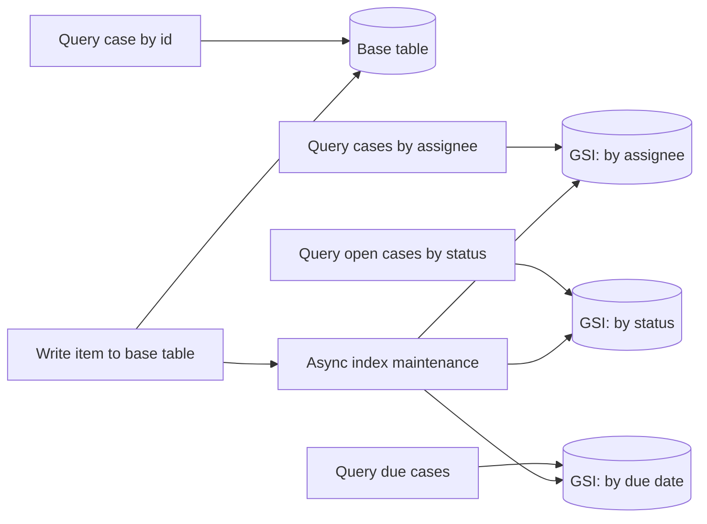
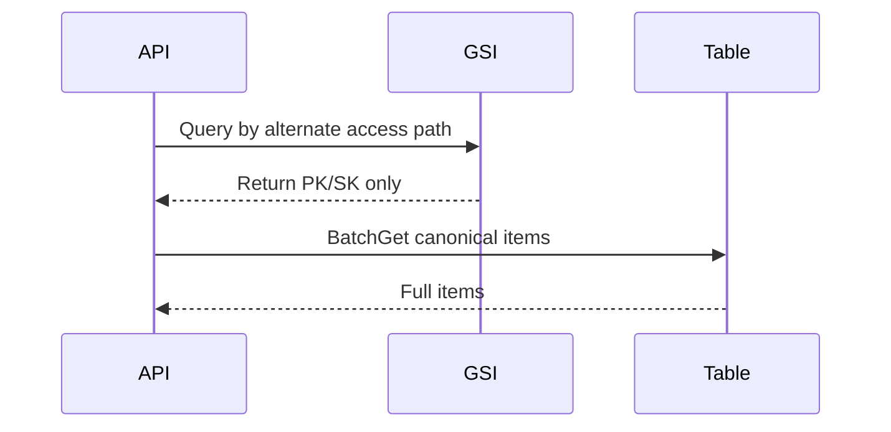
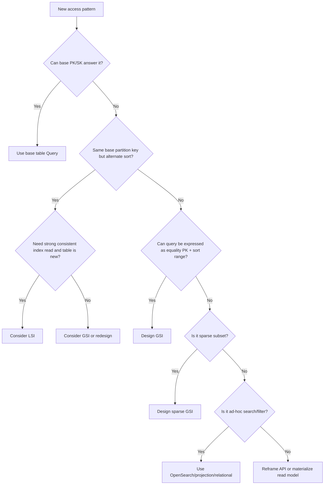

# Part 075 — GSI and LSI Strategy: Query Shape, Projection, Sparse Index, Overloading

DynamoDB index design bukan aktivitas tambahan setelah table dibuat. Di DynamoDB, index adalah bagian dari data model.

Di database relasional, kamu sering mulai dari entity, lalu menambahkan index untuk mempercepat query. Di DynamoDB, kamu mulai dari access pattern, lalu mendesain primary key dan secondary indexes sebagai jalan akses yang sah.

Kalau access pattern tidak punya key path, DynamoDB tidak akan “menemukan” data secara ajaib. Ia akan `Scan`. Dan `Scan` pada jalur request production biasanya adalah tanda model belum selesai.

AWS documentation menjelaskan bahwa Global Secondary Index digunakan untuk query alternatif dari base table, dan write ke base table juga meng-update GSI yang relevan. AWS juga menyebut quota default 20 GSI dan 5 LSI per table. LSI memiliki batas penting: untuk table dengan LSI, total item untuk satu partition key value dibatasi 10 GB.

Part ini membahas bukan hanya “apa itu GSI/LSI”, tetapi bagaimana mendesain index agar tetap benar saat traffic naik, schema berevolusi, projection berubah, dan incident terjadi.

---

## 1. Mental Model: Index Is a Materialized Access Path

Index bukan “view gratis”. Index adalah struktur data terpisah yang dikelola DynamoDB untuk menjawab query tertentu.



Key consequence:

```txt
Each index is an access path with its own key design, capacity behavior, projection choice, hot key risk, and observability surface.
```

Jangan berpikir:

```txt
"Kita tambahkan index supaya query fleksibel."
```

Berpikir seperti ini:

```txt
"Kita materialize access path X karena request Y membutuhkan ordered lookup dengan bounded cardinality dan latency target Z."
```

---

## 2. GSI vs LSI: Perbedaan yang Benar-Benar Penting

| Dimension | GSI | LSI |
|---|---|---|
| Partition key | Boleh berbeda dari base table | Sama dengan base table partition key |
| Sort key | Boleh berbeda | Berbeda dari base table sort key |
| Creation time | Bisa dibuat setelah table ada | Harus dibuat saat table creation |
| Consistency | Eventually consistent reads | Bisa strongly consistent read |
| Capacity | Terpisah pada provisioned mode | Berbagi dengan base table |
| Item collection limit | Tidak membawa 10 GB per base PK seperti LSI | Ada 10 GB limit per partition key value |
| Use case utama | Alternate access pattern lintas partition | Alternate ordering dalam aggregate/item collection yang sama |
| Operational risk | Backfill, write amplification, GSI hot partition | Irreversible after creation, item collection limit |

Rule sederhana:

```txt
Gunakan GSI untuk access pattern yang membutuhkan partitioning berbeda.
Gunakan LSI hanya jika kamu perlu alternate sort order dalam partition key yang sama dan benar-benar butuh strong consistency pada index read.
```

Dalam banyak sistem production, GSI jauh lebih sering dipakai daripada LSI. LSI harus diputuskan saat table dibuat, tidak bisa ditambahkan nanti, dan punya constraint item collection 10 GB per partition key. Itu membuat LSI cocok untuk model yang sangat stabil, bukan eksperimen.

---

## 3. Query Shape First, Index Second

Sebelum membuat index, tulis access pattern dalam bentuk query shape.

Contoh domain regulatory case management:

| Access pattern | Cardinality | Sort/order | Freshness | Candidate index |
|---|---:|---|---|---|
| Get case by `caseId` | 1 | none | strong preferred | base table |
| List cases assigned to officer | many | newest first | eventual ok | `GSI1PK=OFFICER#<id>` `GSI1SK=UPDATED_AT#...#CASE#...` |
| List open enforcement cases by region | many | priority/due date | eventual ok | `GSI2PK=REGION#<id>#STATUS#OPEN` `GSI2SK=DUE#...#CASE#...` |
| Find escalation by escalation id | 1 | none | eventual ok | sparse GSI |
| List case timeline | many per case | chronological | strong optional | base table item collection or LSI |
| List overdue tasks | many | due date ascending | eventual ok | sparse GSI |

Query shape minimal:

```txt
Name: ListOpenCasesByRegion
Caller: supervisor dashboard
PK equality: region + status
Sort: dueAt ascending, priority tie-breaker
Filter: none required after query, optional display-only filters allowed
Limit: 50
Pagination: opaque cursor
Freshness: <= 30 seconds stale acceptable
Cardinality: thousands per region/status
Hot risk: high during morning dashboard load
Index: GSI_REGION_STATUS_DUE
```

Kalau kamu tidak bisa mengisi query shape seperti ini, kamu belum siap membuat index.

---

## 4. DynamoDB Query Constraint: Equality on Partition Key

DynamoDB `Query` membutuhkan equality pada partition key. Sort key dapat memakai condition seperti prefix, range, between, greater-than, less-than.

Bentuk natural:

```txt
PK = exact value
SK = optional range / prefix / ordering
```

Contoh:

```txt
GSI1PK = OFFICER#u-123
GSI1SK = UPDATED_AT#2026-07-07T10:15:00Z#CASE#case-456
```

Query:

```txt
PK = OFFICER#u-123
SK begins_with UPDATED_AT#2026-07
```

Atau:

```txt
PK = REGION#JKT#STATUS#OPEN
SK between DUE#2026-07-01 and DUE#2026-07-31
```

Kalau request membutuhkan:

```txt
WHERE region IN (...)
AND status IN (...)
AND category IN (...)
AND dueDate between ...
AND assignee is null
ORDER BY priority desc
```

maka jangan memaksa satu GSI menjadi search engine. Pilih salah satu:

1. ubah UX/API agar query bounded;
2. buat projection/search index seperti OpenSearch;
3. precompute dashboard/read model;
4. pakai relational database jika workload sebenarnya ad-hoc query-heavy;
5. materialize beberapa access path eksplisit.

---

## 5. Index Key Design Patterns

### 5.1 Direct Lookup GSI

Untuk lookup berdasarkan alternate unique identifier.

```txt
Base:
PK = CASE#case-123
SK = META

GSI1:
GSI1PK = EXTERNAL_REF#EXT-99881
GSI1SK = CASE#case-123
```

Use case:

```txt
Find case by external regulatory reference.
```

Consumer flow:

```txt
Query GSI1 by EXTERNAL_REF#EXT-99881
Then use returned caseId for canonical access
```

Invariants:

1. external reference harus unique;
2. uniqueness harus dijaga dengan conditional write atau sentinel item;
3. GSI eventual consistency berarti immediate lookup setelah write bisa belum terlihat;
4. command path yang butuh immediate correctness harus tidak bergantung pada GSI eventual read.

### 5.2 List by Owner / Assignee

```txt
GSI_ASSIGNEE_PK = ASSIGNEE#officer-123
GSI_ASSIGNEE_SK = UPDATED_AT#2026-07-07T10:15:00Z#CASE#case-456
```

Mendukung:

```txt
List my assigned cases newest first.
```

Variasi sort key:

```txt
DUE#<dueAt>#CASE#<caseId>
PRIORITY#<priority>#DUE#<dueAt>#CASE#<caseId>
STATUS#<status>#UPDATED_AT#<timestamp>#CASE#<caseId>
```

Hati-hati: memasukkan terlalu banyak dimension ke sort key bisa membuat key grammar sulit dievolusi.

### 5.3 Status Queue GSI

Untuk worker/dashboard yang memproses item berdasarkan status.

```txt
GSI_STATUS_PK = STATUS#READY_FOR_REVIEW
GSI_STATUS_SK = CREATED_AT#2026-07-07T09:00:00Z#CASE#case-456
```

Masalah: satu status populer bisa menjadi hot key.

Mitigasi:

```txt
GSI_STATUS_PK = STATUS#READY_FOR_REVIEW#SHARD#03
GSI_STATUS_SK = CREATED_AT#...#CASE#...
```

Trade-off: reader harus query beberapa shard lalu merge result.

### 5.4 Sparse GSI

Sparse index hanya berisi item yang punya attribute key index tersebut. Ini sangat berguna untuk query subset kecil.

Contoh: hanya case overdue yang masuk index.

```txt
Base item case:
PK = CASE#case-123
SK = META
status = OPEN
dueAt = 2026-07-10T00:00:00Z

Jika overdue:
GSI_OVERDUE_PK = OVERDUE#REGION#JKT
GSI_OVERDUE_SK = DUE#2026-07-01T00:00:00Z#CASE#case-123
```

Jika tidak overdue, jangan isi attribute GSI.

Benefit:

1. index lebih kecil;
2. write amplification hanya untuk subset relevan;
3. query lebih murah;
4. dashboard lebih cepat.

Risiko:

1. logic membership index harus benar;
2. item yang keluar dari subset harus menghapus attribute index;
3. TTL/scheduled update bisa terlambat;
4. stale sparse membership bisa menyesatkan dashboard.

### 5.5 Inverted Index

Pattern untuk lookup relationship dari arah berlawanan.

```txt
Base relationship item:
PK = CASE#case-123
SK = SUBJECT#person-777

GSI_SUBJECT_PK = SUBJECT#person-777
GSI_SUBJECT_SK = CASE#case-123
```

Mendukung:

```txt
Find all cases related to a subject.
```

Cocok untuk relationship sederhana. Jika traversal multi-hop, relationship-heavy, dan query graph kompleks, pertimbangkan Neptune, bukan memaksa DynamoDB menjadi graph engine.

---

## 6. Projection Strategy

Projection menentukan attribute apa yang disalin ke index.

Pilihan umum:

```txt
KEYS_ONLY
INCLUDE selected attributes
ALL
```

Mental model:

```txt
Projection = storage + write amplification + read convenience trade-off.
```

### 6.1 KEYS_ONLY

Gunakan jika index hanya dipakai untuk menemukan key canonical lalu fetch base item.

Flow:



Pros:

1. index kecil;
2. write amplification rendah;
3. projection tidak mudah stale untuk display field.

Cons:

1. butuh second read;
2. pagination + BatchGet bisa tricky;
3. base item hot read risk meningkat.

### 6.2 INCLUDE

Gunakan jika list page hanya butuh beberapa display fields.

Contoh:

```txt
Projected attributes:
caseId, title, status, priority, dueAt, assignedOfficerName, updatedAt
```

Pros:

1. list query cukup dari index;
2. lebih murah daripada `ALL`;
3. cocok untuk dashboard/list page.

Cons:

1. field projection bisa drift dari kebutuhan UI;
2. update display field ikut update index;
3. over time index bisa gemuk.

### 6.3 ALL

Gunakan hati-hati.

Cocok jika:

1. item kecil;
2. index benar-benar menjadi read model utama;
3. write rate rendah;
4. operational simplicity lebih penting daripada storage/write cost.

Buruk jika:

1. item besar;
2. ada banyak mutable attributes;
3. banyak GSI `ALL`;
4. update kecil ke base item menimbulkan banyak index write/storage overhead.

---

## 7. Index Overloading

Index overloading berarti satu GSI dipakai untuk beberapa access pattern dengan key prefix berbeda.

Contoh:

```txt
GSI1PK = ASSIGNEE#<officerId>
GSI1SK = UPDATED#<timestamp>#CASE#<caseId>

GSI1PK = REGION#<region>#STATUS#<status>
GSI1SK = DUE#<dueAt>#CASE#<caseId>

GSI1PK = SUBJECT#<subjectId>
GSI1SK = CASE#<caseId>
```

Semua masuk GSI yang sama, tetapi partition key namespace berbeda.

Benefit:

1. menghemat quota index;
2. mengurangi jumlah index yang harus dikelola;
3. cocok untuk single-table design.

Risiko:

1. key grammar kompleks;
2. capacity/cost attribution sulit;
3. satu access pattern panas bisa mengganggu access pattern lain di index yang sama;
4. perubahan projection harus melayani semua pattern;
5. debugging lebih sulit.

Rule:

```txt
Overload index hanya jika access patterns punya projection kebutuhan mirip, cardinality sehat, dan ownership schema jelas.
```

Jangan overload karena quota 20 GSI sudah habis tanpa memahami kenapa.

---

## 8. Sparse Index as Workflow Queue

Sparse GSI sering digunakan sebagai lightweight workflow queue.

Contoh: case yang perlu review.

```txt
Item:
PK = CASE#case-123
SK = META
status = READY_FOR_REVIEW
reviewRegion = JKT

GSI_REVIEW_PK = REVIEW#REGION#JKT
GSI_REVIEW_SK = PRIORITY#90#CREATED#2026-07-07T09:00:00Z#CASE#case-123
```

Saat case tidak lagi butuh review:

```txt
REMOVE GSI_REVIEW_PK, GSI_REVIEW_SK
SET status = IN_REVIEW
```

Worker query:

```txt
Query GSI_REVIEW_PK = REVIEW#REGION#JKT
Limit 25
ScanIndexForward = false or true depending sort
```

But this is not SQS.

Perbedaan dengan SQS:

| Concern | Sparse GSI queue | SQS |
|---|---|---|
| Lease/visibility timeout | Harus dibuat sendiri | Native visibility timeout |
| Retry/DLQ | Harus dibuat sendiri | Native DLQ/redrive |
| Ordering | Berdasarkan sort key | Standard best-effort, FIFO strict by group |
| Worker concurrency | Harus dikontrol via conditional update | Native polling pattern |
| State visibility | Bagus karena item adalah state | Bagus untuk message backlog |
| Use case | Work item is the domain state | Work item is a message/task |

Gunakan sparse GSI queue jika:

1. queue membership adalah state domain;
2. worker harus melihat/update item yang sama;
3. ordering sederhana;
4. retry/lease bisa dimodelkan di item.

Gunakan SQS jika:

1. task adalah message yang perlu durable buffering;
2. retry/DLQ/visibility timeout native penting;
3. consumer bisa idempotent terhadap duplicate delivery;
4. fanout/backpressure lebih penting daripada domain list query.

---

## 9. LSI Strategy

LSI berguna saat kamu punya item collection dengan partition key yang sama, tetapi butuh alternate sort key.

Contoh base table:

```txt
PK = CASE#case-123
SK = TIMELINE#2026-07-07T10:00:00Z#EVENT#evt-1
```

Kamu ingin query timeline per severity:

```txt
LSI1SK = SEVERITY#HIGH#TIME#2026-07-07T10:00:00Z#EVENT#evt-1
```

Karena LSI partition key sama dengan table PK, query tetap berada dalam item collection `CASE#case-123`.

Kapan LSI layak:

1. access pattern selalu scoped ke partition key yang sama;
2. butuh alternate ordering dalam aggregate;
3. strong consistent read dari index penting;
4. item collection akan tetap jauh di bawah 10 GB;
5. kamu yakin sejak awal karena LSI harus dibuat saat table creation.

Kapan jangan pakai LSI:

1. access pattern butuh partition key berbeda;
2. aggregate bisa tumbuh besar tanpa batas;
3. model masih berubah cepat;
4. kamu hanya mencoba menghemat GSI quota;
5. kamu butuh menambahkan index setelah production berjalan.

---

## 10. GSI Consistency Trap

GSI read bersifat eventually consistent. Artinya command path yang baru saja menulis item tidak boleh mengandalkan GSI untuk immediate correctness.

Anti-pattern:

```txt
1. Create user with email = a@example.com
2. Query GSI_EMAIL to check uniqueness
3. If empty, write user
```

Race condition:

```txt
Request A query empty
Request B query empty
A writes
B writes
Duplicate email
```

Correct pattern: sentinel item dengan conditional write.

```txt
PK = UNIQUE#EMAIL#a@example.com
SK = UNIQUE
ownerUserId = user-123
```

Transaction:

```txt
TransactWriteItems:
- Put sentinel if attribute_not_exists(PK)
- Put user item
```

GSI boleh dipakai untuk lookup/read path, bukan sebagai satu-satunya uniqueness gate.

---

## 11. GSI Write Amplification

Setiap item write bisa memperbarui nol, satu, atau banyak GSI.

Contoh item punya 4 GSI attribute:

```txt
GSI1PK/GSI1SK
GSI2PK/GSI2SK
GSI3PK/GSI3SK
GSI4PK/GSI4SK
```

Update field status dari `OPEN` ke `CLOSED` mungkin memicu:

1. remove old GSI_STATUS entry;
2. add new GSI_STATUS entry;
3. update projected attributes di beberapa GSI;
4. consume write capacity/storage di indexes.

Index design buruk sering terlihat sebagai:

```txt
Base table write rate normal, tetapi GSI throttled.
```

Atau:

```txt
Write latency naik setelah menambah GSI baru.
```

Atau:

```txt
On-demand cost melonjak karena setiap update kecil memperbarui banyak projected attributes.
```

Design question:

```txt
Apakah field ini harus projected ke index, atau bisa di-fetch dari base table?
```

---

## 12. Hot GSI Partition

GSI punya partition key sendiri. Base table key yang sehat tidak menjamin GSI sehat.

Contoh base table:

```txt
PK = CASE#<caseId>         // high cardinality
SK = META
```

GSI buruk:

```txt
GSI1PK = STATUS#OPEN      // one hot key
GSI1SK = UPDATED#...
```

Jika jutaan case open dan dashboard/worker sering query/write status open, GSI partition ini panas.

Mitigasi:

### 12.1 Add Dimension

```txt
GSI1PK = REGION#<region>#STATUS#OPEN
```

### 12.2 Shard

```txt
GSI1PK = STATUS#OPEN#SHARD#<00-31>
```

Reader query all shards and merge.

### 12.3 Bucket by Time

```txt
GSI1PK = STATUS#OPEN#MONTH#2026-07
```

Cocok jika access pattern natural time-bounded.

### 12.4 Precompute Aggregates

Untuk dashboard count, jangan query jutaan item.

```txt
PK = METRIC#REGION#JKT#STATUS#OPEN
SK = COUNTER
count = 18231
```

### 12.5 Use OpenSearch / Analytical Projection

Jika requirement sebenarnya filtering/sorting ad-hoc, jangan paksa satu hot GSI.

---

## 13. FilterExpression Is Not Indexing

DynamoDB `FilterExpression` diterapkan setelah items dibaca oleh query. Ia tidak mengurangi read capacity untuk item yang sudah dibaca sebelum filter.

Anti-pattern:

```txt
Query GSI1PK = TENANT#abc
Filter status = OPEN and priority = HIGH
```

Jika tenant punya 1 juta item dan hasil filter 10 item, kamu tetap membaca banyak data untuk membuang sebagian besar.

Better:

```txt
GSI1PK = TENANT#abc#STATUS#OPEN#PRIORITY#HIGH
GSI1SK = UPDATED#...
```

Atau:

```txt
GSI1PK = TENANT#abc#STATUS#OPEN
GSI1SK = PRIORITY#HIGH#UPDATED#...
```

Gunakan `FilterExpression` untuk:

1. display-level optional filter;
2. post-filter kecil pada result bounded;
3. safety filter, bukan access path utama.

---

## 14. Pagination and Sort Key Stability

Index list query harus punya sort key stabil.

Buruk:

```txt
GSI1SK = DISPLAY_NAME#<mutable name>
```

Jika user rename saat pagination, item bisa lompat halaman.

Lebih baik:

```txt
GSI1SK = UPDATED_AT#<timestamp>#CASE#<caseId>
```

Tie-breaker wajib:

```txt
DUE#2026-07-10T00:00:00Z#CASE#case-123
```

Tanpa tie-breaker unik, ordering item dengan due date sama menjadi tidak deterministik untuk UX dan reconciliation.

Pagination rule:

```txt
Do not expose LastEvaluatedKey raw as business object.
Expose opaque cursor.
```

---

## 15. Index Backfill and Online Change

Menambahkan GSI ke table existing memicu backfill. Ini operasi production change, bukan sekadar schema edit.

Risiko:

1. backfill memakan waktu;
2. index creation bisa mempengaruhi write path/capacity;
3. data lama mungkin tidak punya attribute index;
4. application bisa membaca index sebelum siap;
5. projection salah berarti harus recreate/change index strategy;
6. hot partition baru bisa muncul setelah traffic diarahkan.

Safe rollout:

```txt
1. Add nullable index attributes in code, but do not use index yet.
2. Deploy write path that populates index attributes for new writes.
3. Backfill old items in controlled batches.
4. Create GSI or wait until GSI ACTIVE if created before backfill strategy.
5. Validate counts and sampled query results.
6. Enable read path behind feature flag.
7. Monitor GSI throttling, latency, returned item count, error rate.
8. Remove old path only after reconciliation passes.
```

Backfill worker pattern:

```txt
Scan segment N/M with low rate limit
For each item:
  compute new GSI attributes
  UpdateItem with condition schemaVersion < target
  sleep/jitter based on throttling
Record checkpoint
```

Do not run unlimited parallel scan on production table because it looks convenient.

---

## 16. Index Naming Convention

Bad names:

```txt
GSI1
GSI2
my-index
status-index
```

Better names encode purpose:

```txt
GSI_Assignee_UpdatedAt
GSI_RegionStatus_DueAt
GSI_Subject_CaseId
GSI_OverdueRegion_DueAt
```

In single-table design, physical index names may remain generic (`GSI1`) for code portability, but documentation must map logical access paths.

Example index catalog:

| Physical index | Logical pattern | PK grammar | SK grammar | Owner | Freshness | Risk |
|---|---|---|---|---|---|---|
| GSI1 | Assigned cases | `ASSIGNEE#<id>` | `UPDATED#<ts>#CASE#<id>` | Case service | eventual | officer hot key |
| GSI1 | Subject lookup | `SUBJECT#<id>` | `CASE#<id>` | Case service | eventual | subject celebrity risk |
| GSI2 | Overdue cases | `OVERDUE#REGION#<id>` | `DUE#<ts>#CASE#<id>` | Escalation service | eventual | sparse stale membership |

---

## 17. Case Management Example

Domain:

```txt
Case
Investigation
Task
Escalation
Subject
Officer
Region
```

Base table:

```txt
PK = CASE#<caseId>
SK = META

PK = CASE#<caseId>
SK = TASK#<taskId>

PK = CASE#<caseId>
SK = EVENT#<occurredAt>#<eventId>

PK = CASE#<caseId>
SK = SUBJECT#<subjectId>
```

Access patterns:

| Pattern | Index |
|---|---|
| Get case | Base table |
| List case timeline | Base table `PK=CASE#id`, `SK begins_with EVENT#` |
| List tasks for case | Base table `SK begins_with TASK#` |
| List officer workload | `GSI_Assignee_UpdatedAt` |
| List overdue tasks by region | sparse `GSI_OverdueRegion_DueAt` |
| Find cases by subject | `GSI_Subject_Case` |
| Find case by external reference | `GSI_ExternalRef_Case` plus uniqueness sentinel |
| Dashboard counts | aggregate items, not GSI query over millions |

Example item:

```json
{
  "PK": "CASE#case-123",
  "SK": "TASK#task-456",
  "entityType": "Task",
  "taskId": "task-456",
  "caseId": "case-123",
  "assignedOfficerId": "officer-99",
  "region": "JKT",
  "status": "OPEN",
  "dueAt": "2026-07-10T00:00:00Z",
  "GSI1PK": "ASSIGNEE#officer-99",
  "GSI1SK": "DUE#2026-07-10T00:00:00Z#TASK#task-456",
  "GSI2PK": "OVERDUE#REGION#JKT",
  "GSI2SK": "DUE#2026-07-10T00:00:00Z#TASK#task-456"
}
```

But only set `GSI2PK/GSI2SK` if task is actually overdue or in the relevant queue. Otherwise the sparse index is polluted.

---

## 18. Index as Contract

Every index needs a contract.

Template:

```mdx
## Index Contract: GSI_Assignee_UpdatedAt

Purpose:
- List work items assigned to an officer.

Owner:
- Case service.

PK grammar:
- ASSIGNEE#<officerId>

SK grammar:
- UPDATED#<updatedAt>#CASE#<caseId>

Projection:
- caseId, title, status, priority, dueAt, updatedAt, assignedOfficerId

Consistency:
- Eventually consistent. UI may show stale assignment up to staleness budget.

Writers:
- CaseCommandHandler only.

Delete/update behavior:
- Reassignment must update GSI key attributes atomically with case state.

Hot key risk:
- High for shared queue officer. Mitigation: assign to team shard or region/team dimension.

Migration:
- Backfill from base table with checkpointed scanner.

Alarms:
- GSI throttled requests, latency, consumed WCU/RCU, returned item count anomaly.
```

Tanpa contract, index akan berubah menjadi undocumented shared API.

---

## 19. Java SDK Query Shape Example

Illustrative Java-style query for assigned work:

```java
QueryRequest request = QueryRequest.builder()
    .tableName("case-table")
    .indexName("GSI_Assignee_UpdatedAt")
    .keyConditionExpression("GSI1PK = :pk AND begins_with(GSI1SK, :prefix)")
    .expressionAttributeValues(Map.of(
        ":pk", AttributeValue.fromS("ASSIGNEE#officer-99"),
        ":prefix", AttributeValue.fromS("UPDATED#2026-07")
    ))
    .limit(50)
    .scanIndexForward(false)
    .build();
```

Important:

1. no `Scan`;
2. partition key equality present;
3. sort key condition bounded;
4. result limit explicit;
5. pagination cursor handled;
6. no business-critical filter after query.

---

## 20. Decision Tree



---

## 21. Anti-Patterns

### 21.1 GSI per UI Filter

```txt
GSI_status
GSI_region
GSI_priority
GSI_dueDate
GSI_assignee
```

This is relational thinking transplanted into DynamoDB badly.

Instead, model actual query combinations.

### 21.2 FilterExpression as Main Predicate

If you read thousands to return ten, your index is wrong.

### 21.3 All Attributes Projected Everywhere

`ProjectionType=ALL` on many indexes can make every write expensive.

### 21.4 GSI for Uniqueness

Eventually consistent GSI cannot enforce uniqueness alone. Use conditional write / transaction sentinel.

### 21.5 Status Hot Key

`PK=STATUS#OPEN` looks elegant until the whole company queries and writes to the same partition.

### 21.6 Undocumented Overloading

One GSI with ten different key grammars and no catalog becomes tribal knowledge.

### 21.7 LSI as Future-Proofing

LSI must be created up front, but creating LSI “just in case” adds permanent constraints.

---

## 22. Observability

Monitor per table and per GSI.

Important signals:

```txt
ConsumedReadCapacityUnits
ConsumedWriteCapacityUnits
ReadThrottleEvents
WriteThrottleEvents
SuccessfulRequestLatency
ReturnedItemCount
UserErrors
SystemErrors
OnlineIndexConsumedWriteCapacity
OnlineIndexPercentageProgress
OnlineIndexThrottleEvents
```

Operational questions:

1. Which index is throttling?
2. Which access pattern owns that index?
3. Is throttling on base table or GSI?
4. Is hot key visible from request logs?
5. Did a deployment add projected field updates?
6. Did a backfill create burst writes?
7. Did a dashboard start querying a high-cardinality list without cache?
8. Is returned item count unexpectedly high or low?

Log query-level metadata:

```json
{
  "operation": "ListAssignedCases",
  "table": "case-table",
  "index": "GSI_Assignee_UpdatedAt",
  "pkPrefix": "ASSIGNEE",
  "limit": 50,
  "consistentRead": false,
  "returnedCount": 50,
  "scannedCount": 50,
  "hasNextPage": true,
  "latencyMs": 18
}
```

Do not log full keys if they contain sensitive identifiers without redaction policy.

---

## 23. Testing Index Design

### 23.1 Access Pattern Tests

For every access pattern:

```txt
Given seed data
When query by documented PK/SK
Then returned set and order match contract
And no Scan is used
And limit/pagination works
```

### 23.2 Hot Key Simulation

Generate skew:

```txt
80% traffic to top 1% assignees
10x burst on STATUS#OPEN
Backfill plus live writes
Dashboard parallel refresh
```

### 23.3 Migration Test

```txt
Old item without GSI attributes
New writer populates GSI attributes
Backfill populates old item
Reader feature flag switched on
Reconciliation detects missing/extra index membership
```

### 23.4 Staleness Test

```txt
Write item
Immediately query GSI
Assert application handles not found / stale gracefully
```

---

## 24. Production Checklist

Before creating or using a GSI/LSI:

- [ ] Access pattern documented.
- [ ] Partition key equality known.
- [ ] Sort key grammar documented.
- [ ] Cardinality and hot key risk reviewed.
- [ ] Projection choice justified.
- [ ] Consistency expectation documented.
- [ ] GSI eventual consistency does not violate correctness.
- [ ] Uniqueness does not rely on GSI query.
- [ ] Sparse membership update path tested.
- [ ] Backfill plan exists.
- [ ] Alarms include table and index-level metrics.
- [ ] Feature flag for new read path exists.
- [ ] Reconciliation query/process exists.
- [ ] Cost impact estimated.
- [ ] Index ownership recorded.

---

## 25. Summary

DynamoDB index strategy is data modeling strategy.

A good index:

1. maps directly to an access pattern;
2. has equality partition key and bounded sort condition;
3. has known cardinality and hot-key behavior;
4. projects only what the read path needs;
5. is safe under eventual consistency;
6. is observable independently;
7. has a migration/backfill plan;
8. is documented as a contract.

The mature engineer does not ask, “Can DynamoDB query this?”

The mature engineer asks:

```txt
What access path am I materializing, what invariant depends on it, and how will it fail under skew, replay, backfill, and stale reads?
```

---

## References

- AWS Documentation — Using Global Secondary Indexes in DynamoDB: https://docs.aws.amazon.com/amazondynamodb/latest/developerguide/GSI.html
- AWS Documentation — Local Secondary Indexes in DynamoDB: https://docs.aws.amazon.com/amazondynamodb/latest/developerguide/LSI.html
- AWS Documentation — General Guidelines for Secondary Indexes: https://docs.aws.amazon.com/amazondynamodb/latest/developerguide/bp-indexes-general.html
- AWS Documentation — Sparse Indexes: https://docs.aws.amazon.com/amazondynamodb/latest/developerguide/bp-indexes-general-sparse-indexes.html
- AWS Documentation — Managing Global Secondary Indexes: https://docs.aws.amazon.com/amazondynamodb/latest/developerguide/GSI.OnlineOps.html
- AWS Documentation — Query Operations in DynamoDB: https://docs.aws.amazon.com/amazondynamodb/latest/developerguide/Query.html
