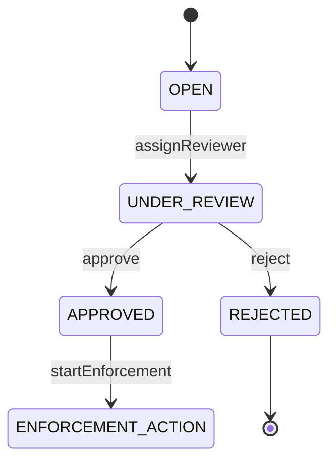
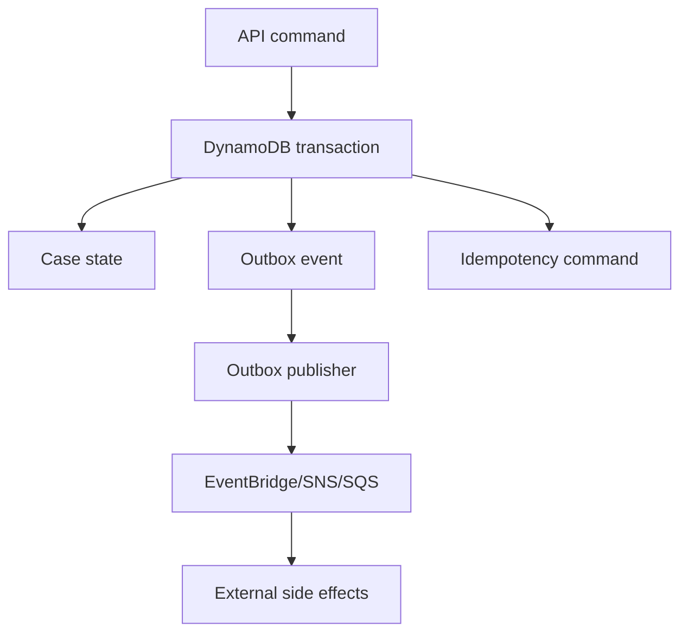

# Part 076 — Transactions and Condition Writes: Optimistic Concurrency, Uniqueness, Counters

DynamoDB correctness bukan berasal dari lock panjang atau database trigger. Correctness berasal dari key design, conditional write, transaction boundary, idempotency, dan retry discipline.

Di DynamoDB, banyak invariant production dapat dijaga dengan primitive sederhana:

```txt
PutItem / UpdateItem / DeleteItem + ConditionExpression
```

Untuk invariant yang melibatkan beberapa item, gunakan:

```txt
TransactWriteItems
TransactGetItems
```

AWS documentation menyebut `TransactWriteItems` sebagai synchronous, idempotent write operation yang mengelompokkan sampai 100 action dalam operasi all-or-nothing, pada item berbeda dalam satu atau lebih table, tetapi dalam AWS account dan Region yang sama, dengan aggregate item size transaction maksimum 4 MB. Condition expressions tersedia untuk write operation agar operasi hanya terjadi jika kondisi item terpenuhi.

Part ini membahas DynamoDB sebagai state machine store: bukan sekadar simpan JSON, tetapi menjaga invariant bisnis di bawah concurrency, retry, duplicate request, partial failure, dan replay.

---

## 1. Mental Model: Write as State Transition

Jangan memandang `UpdateItem` sebagai “ubah field”. Pandang sebagai state transition.



Setiap transition punya precondition.

```txt
approve(caseId):
  allowed only if status = UNDER_REVIEW
  allowed only if reviewerId = currentUser
  increments version
  writes audit event
  maybe writes outbox event
```

Di DynamoDB, precondition menjadi `ConditionExpression`.

Transaction boundary menjadi kumpulan item yang harus berubah atomically.

---

## 2. ConditionExpression: Small Primitive, Large Power

Conditional write mengeksekusi write hanya jika condition benar.

Contoh create-if-not-exists:

```json
{
  "TableName": "case-table",
  "Item": {
    "PK": { "S": "CASE#case-123" },
    "SK": { "S": "META" },
    "status": { "S": "OPEN" },
    "version": { "N": "1" }
  },
  "ConditionExpression": "attribute_not_exists(PK)"
}
```

Contoh transition:

```txt
SET status = :next,
    version = version + :one,
    updatedAt = :now

ConditionExpression:
  status = :expectedStatus AND version = :expectedVersion
```

The condition is the invariant gate.

Kalau condition gagal, itu bukan selalu error teknis. Bisa jadi business conflict.

---

## 3. Optimistic Concurrency Control

Optimistic concurrency cocok saat conflict relatif jarang.

Item:

```json
{
  "PK": "CASE#case-123",
  "SK": "META",
  "status": "OPEN",
  "priority": "HIGH",
  "version": 7
}
```

Update request membawa expected version:

```txt
Approve case-123 if version = 7 and status = UNDER_REVIEW
```

DynamoDB update:

```txt
UpdateExpression:
  SET #status = :approved,
      version = version + :one,
      approvedAt = :now

ConditionExpression:
  #status = :underReview AND version = :expectedVersion
```

If condition fails:

1. read latest item;
2. decide whether command is obsolete, duplicate, or should be retried;
3. return `409 Conflict` for API command when caller's expected version is stale;
4. do not blindly retry semantic conflict.

---

## 4. Version Is Not Always Enough

Version check protects lost update, but not all invariants.

Example:

```txt
Only one active enforcement action per case.
```

If enforcement action is separate item:

```txt
PK = CASE#case-123
SK = ENFORCEMENT#action-001
```

Version on case item alone may not prevent two concurrent transactions creating two action items unless both also update/check the same guard item.

Better guard:

```txt
PK = CASE#case-123
SK = ACTIVE_ENFORCEMENT_GUARD
```

Transaction:

```txt
- Put guard if attribute_not_exists(PK)
- Put enforcement action item
- Update case status if status = APPROVED
```

Invariant must map to item(s) touched by the write boundary.

---

## 5. Uniqueness with Sentinel Items

DynamoDB has no global unique secondary index. GSI eventual consistency cannot safely enforce uniqueness.

Use sentinel item.

Example unique email:

```txt
PK = UNIQUE#EMAIL#alice@example.com
SK = UNIQUE
ownerType = USER
ownerId = user-123
```

Transaction:

```txt
TransactWriteItems:
  1. Put sentinel item if attribute_not_exists(PK)
  2. Put user item if attribute_not_exists(PK)
```

Example unique external case reference:

```txt
PK = UNIQUE#EXTERNAL_REF#REG-2026-0001
SK = UNIQUE
caseId = case-123
```

This design gives deterministic uniqueness because all competing writers target the same sentinel key.

Important details:

1. normalize value before key construction;
2. make normalization versioned if rules can change;
3. store original value for display;
4. handle delete/rename carefully;
5. do not reuse sentinel after soft delete unless business allows it.

---

## 6. Idempotency with Command Records

Idempotency prevents duplicate requests from applying side effects twice.

Command record:

```txt
PK = IDEMPOTENCY#<tenantId>#<idempotencyKey>
SK = COMMAND
status = IN_PROGRESS | COMPLETED | FAILED_RETRYABLE | FAILED_FINAL
requestHash = sha256(canonicalRequest)
responseHash = sha256(canonicalResponse)
resultRef = CASE#case-123
expiresAt = epochSeconds
```

Create command record conditionally:

```txt
PutItem command record
ConditionExpression: attribute_not_exists(PK)
```

If it already exists:

1. same request hash + completed → return stored result;
2. same request hash + in progress → return 409/202 depending API contract;
3. different request hash → return idempotency key reuse error;
4. failed retryable → allow controlled resume if workflow supports it.

For multi-item command, command record should be part of transaction where possible.

---

## 7. TransactWriteItems

`TransactWriteItems` supports actions:

```txt
Put
Update
Delete
ConditionCheck
```

Use when invariant spans multiple items.

Example create case:

```txt
TransactWriteItems:
  - Put idempotency command record if not exists
  - Put unique external reference sentinel if not exists
  - Put case META item if not exists
  - Put initial audit event
  - Put outbox event
```

All succeed or none succeed.

Constraints to remember:

1. up to 100 actions;
2. aggregate item size limit 4 MB;
3. no two actions can target same item in same transaction;
4. same account and same Region;
5. transaction conflicts can happen under concurrent writes;
6. design for retry with idempotency token.

---

## 8. Transaction Boundary Design

Do not put everything in one transaction.

A transaction should protect a correctness invariant, not your entire business process.

Good transaction:

```txt
Create case + uniqueness sentinel + audit + outbox
```

Bad transaction:

```txt
Create case + assign investigator + call external registry + generate PDF + send email + update dashboard
```

External calls cannot be part of DynamoDB transaction. Use outbox/workflow.

Correct split:



---

## 9. ConditionCheck vs Update Condition

If you update an item and check condition on the same item, use condition in that `Update` action.

Use `ConditionCheck` when you need to validate an item but not modify it.

Example:

```txt
Transfer ownership:
- ConditionCheck officer is active
- Update case assignee if version matches
- Put audit event
- Put outbox event
```

Remember: in a single transaction, no two actions can target the same item. You cannot `ConditionCheck` and `Update` the same item separately in the same `TransactWriteItems`.

---

## 10. State Transition Pattern

Item:

```json
{
  "PK": "CASE#case-123",
  "SK": "META",
  "status": "OPEN",
  "version": 3,
  "assignedOfficerId": "officer-99"
}
```

Transition `submitForReview`:

```txt
UpdateExpression:
  SET #status = :review,
      submittedAt = :now,
      version = version + :one

ConditionExpression:
  #status = :open
  AND assignedOfficerId = :caller
  AND version = :expected
```

Audit item:

```txt
PK = CASE#case-123
SK = EVENT#2026-07-07T10:15:00Z#evt-abc
```

Outbox item:

```txt
PK = OUTBOX#2026-07-07
SK = EVENT#evt-abc
```

Transaction:

```txt
- Update case with state condition
- Put audit event if not exists
- Put outbox event if not exists
```

Invariant:

```txt
No emitted event without committed state transition.
No committed state transition without audit record.
```

---

## 11. Counter Patterns

Counters look simple but fail easily under concurrency and hot key.

### 11.1 Atomic Counter

```txt
UpdateExpression:
  ADD openCaseCount :one
```

Good for moderate write rate single counter.

Risk:

1. hot item under high write rate;
2. no natural history;
3. rollback/repair difficult without event log.

### 11.2 Conditional Counter

```txt
ADD availableSlots :minusOne
ConditionExpression: availableSlots > :zero
```

Use for bounded resources.

Example:

```txt
Assign case to officer only if activeLoad < maxLoad
```

Transaction:

```txt
- Update officer workload ADD activeLoad +1 if activeLoad < maxLoad
- Update case assignee if status = OPEN
- Put audit event
```

### 11.3 Sharded Counter

For high write rate:

```txt
PK = COUNTER#OPEN_CASES#REGION#JKT
SK = SHARD#00
...
SK = SHARD#31
```

Writers pick shard.
Readers sum shards.

Trade-off:

1. read becomes more expensive;
2. eventual aggregation possible;
3. exact real-time count is harder.

### 11.4 Event-Sourced Counter Projection

For auditable regulatory systems, prefer event log + projection for important counts.

```txt
CaseOpened event -> increment projection
CaseClosed event -> decrement projection
Nightly reconciliation verifies projection against source of truth
```

---

## 12. Locking and Leases

DynamoDB conditional writes can implement lease-like ownership.

Item:

```txt
PK = WORK#case-123
SK = PROCESSING_LOCK
owner = worker-7
leaseUntil = 2026-07-07T10:20:00Z
version = 12
```

Acquire if absent or expired:

```txt
ConditionExpression:
  attribute_not_exists(PK) OR leaseUntil < :now
```

Renew:

```txt
ConditionExpression:
  owner = :workerId AND version = :expectedVersion
```

Release:

```txt
ConditionExpression:
  owner = :workerId
```

Warning:

```txt
DynamoDB lease is application-level. Clock skew, worker pause, retry, and partial failure must be handled.
```

For queue-like work, SQS visibility timeout is often better. Use DynamoDB lease when the work item is domain state and needs stateful ownership.

---

## 13. Idempotent External Side Effects

DynamoDB transaction cannot include external side effects like email, payment, PDF generation, registry submission, or webhook.

Correct pattern:

```txt
1. Commit state + outbox event in DynamoDB transaction.
2. Publisher reads outbox.
3. Consumer performs external call with idempotency key.
4. Consumer records side-effect result.
5. Retry safely.
```

Side-effect ledger:

```txt
PK = SIDE_EFFECT#<provider>#<operationId>
SK = RESULT
status = SENT | CONFIRMED | FAILED_RETRYABLE | FAILED_FINAL
providerRequestId = ...
providerResponseHash = ...
```

Condition:

```txt
Put ledger if attribute_not_exists(PK)
```

This prevents duplicate side effects when message redelivers or workflow retries.

---

## 14. Error Classification

Not all failures are retryable.

| Error class | Meaning | Retry? | Response |
|---|---|---|---|
| Conditional check failed | Business precondition failed or concurrency conflict | No blind retry | 409/422/domain error |
| Transaction conflict | Concurrent transaction touched same item | Yes with jitter, bounded | retry internal if idempotent |
| Provisioned throughput exceeded / throttling | Capacity/backpressure | Yes with exponential backoff + jitter | maybe 429/503 if API |
| Validation error | Request/schema bug | No | 400/500 depending source |
| Internal service error | transient AWS/service failure | Yes bounded | retry / fail gracefully |
| Ambiguous timeout | write may have committed | Retry only with idempotency/read-after | recover by command record |

Important distinction:

```txt
Retryable technical failure != retryable business command.
```

If approval failed because status is already `REJECTED`, retrying will not help.

---

## 15. Ambiguous Commit Problem

Client sends write request. Network timeout occurs. Did write commit?

You do not know.

Bad handling:

```txt
Timeout -> retry raw write with new id -> duplicate side effects
```

Good handling:

```txt
Timeout -> retry same idempotency key / same transaction client token
       -> read command record / canonical item
       -> return deterministic result
```

For command handling, always create stable identifiers before write:

```txt
commandId
caseId
eventId
outboxEventId
idempotencyKey
```

Then retries converge to the same state.

---

## 16. Transaction Idempotency

DynamoDB transactions support client request token semantics in SDK/API for idempotency. Application-level idempotency is still needed for business behavior and response replay.

Why both?

| Layer | Purpose |
|---|---|
| DynamoDB transaction idempotency token | Prevent duplicate transaction application for retry at API level |
| Application command record | Preserve business command state, request hash, response, expiry, auditability |
| External side-effect idempotency | Prevent duplicate email/payment/webhook/provider call |

Do not confuse infrastructure idempotency with business idempotency.

---

## 17. Transactional Outbox with DynamoDB

Outbox item in same transaction:

```json
{
  "PK": "OUTBOX#2026-07-07",
  "SK": "EVENT#case-123#version-8",
  "eventId": "evt-abc",
  "aggregateType": "Case",
  "aggregateId": "case-123",
  "aggregateVersion": 8,
  "eventType": "CaseSubmittedForReview",
  "payload": { "caseId": "case-123" },
  "status": "NEW",
  "createdAt": "2026-07-07T10:15:00Z"
}
```

Publisher pattern:

```txt
Query OUTBOX partition(s)
Acquire item by conditional update status NEW -> PUBLISHING
Publish to EventBridge/SNS/SQS
Update status PUBLISHED with provider message id
Retry PUBLISHING if lease expired
```

Alternative: DynamoDB Streams.

Streams can publish changes, but outbox gives explicit event contract and retry state. Streams are useful; outbox is more controllable for business event publishing.

---

## 18. DynamoDB Streams and Transaction Ordering

When using DynamoDB Streams:

1. stream records reflect item-level changes;
2. transaction changes generate multiple records;
3. downstream consumer must be idempotent;
4. do not infer high-level business event solely from raw item changes unless contract is explicit;
5. record order is shard-scoped, not global business order.

For important domain events, prefer explicit outbox event item with stable event type and payload.

---

## 19. Write Skew and Multi-Item Invariants

Example invariant:

```txt
A case may have at most 3 active investigators.
```

Naive approach:

```txt
Query active investigators
If count < 3, Put assignment
```

Race:

```txt
A reads count 2
B reads count 2
A puts assignment -> 3
B puts assignment -> 4
```

Correct approach: guard/counter item updated conditionally in transaction.

```txt
PK = CASE#case-123
SK = INVESTIGATOR_GUARD
activeCount = 2
```

Transaction:

```txt
- Update guard ADD activeCount +1 if activeCount < 3
- Put assignment item if not exists
- Put audit event
```

The invariant lives on the guard item.

---

## 20. Set-Based Uniqueness and Membership

DynamoDB supports sets, but large mutable sets can become hot and hit item size limit.

Avoid:

```json
{
  "PK": "CASE#case-123",
  "SK": "META",
  "investigatorIds": ["u1", "u2", "u3", ... thousands]
}
```

Better:

```txt
PK = CASE#case-123
SK = INVESTIGATOR#u1
```

Guard item for count:

```txt
PK = CASE#case-123
SK = INVESTIGATOR_GUARD
activeCount = 3
```

Uniqueness of membership:

```txt
Put membership item if attribute_not_exists(PK)
```

This scales better and supports item-level conditions.

---

## 21. Conditional Delete

Delete should also preserve invariants.

Example close task only if open:

```txt
Update task:
  SET status = CLOSED
  REMOVE GSI_OPEN_PK, GSI_OPEN_SK
ConditionExpression:
  status = OPEN
```

Hard delete only if not locked:

```txt
DeleteItem
ConditionExpression:
  attribute_not_exists(legalHold) OR legalHold = :false
```

For regulatory systems, hard delete is often wrong. Prefer lifecycle state, retention policy, redaction, or tombstone depending compliance requirement.

---

## 22. UpdateExpression Discipline

Avoid full item replacement unless intended.

Prefer explicit update:

```txt
SET #status = :next,
    updatedAt = :now,
    version = version + :one
REMOVE GSI_OPEN_PK, GSI_OPEN_SK
```

Why:

1. preserves unknown future attributes;
2. minimizes accidental data loss;
3. supports schema evolution;
4. makes transition auditable;
5. avoids writing giant item for small change.

But be careful with nested documents. Complex document mutations can make condition expressions hard to reason about. If a nested array is frequently mutated concurrently, model it as separate items.

---

## 23. API Mapping

HTTP response mapping:

| DynamoDB outcome | API outcome |
|---|---|
| Create condition `attribute_not_exists` failed | 409 Conflict |
| Expected version mismatch | 409 Conflict |
| Invalid state transition | 422 Unprocessable Entity / 409 depending API style |
| Idempotency key reused with different body | 400 Bad Request or 409 Conflict |
| Throttling | 429/503 with retry-after if possible |
| Ambiguous timeout recovered completed | 200/201 with stored response |
| Ambiguous timeout unresolved | 202 Accepted / 500 with reconciliation depending contract |

Do not expose raw DynamoDB exception names as public API contract.

---

## 24. Java SDK Pseudo-Code: Conditional Update

```java
public Case approveCase(String caseId, long expectedVersion, String reviewerId) {
    try {
        UpdateItemRequest request = UpdateItemRequest.builder()
            .tableName(tableName)
            .key(key("CASE#" + caseId, "META"))
            .updateExpression("SET #status = :approved, approvedAt = :now, version = version + :one")
            .conditionExpression("#status = :underReview AND reviewerId = :reviewerId AND version = :expectedVersion")
            .expressionAttributeNames(Map.of("#status", "status"))
            .expressionAttributeValues(Map.of(
                ":approved", s("APPROVED"),
                ":underReview", s("UNDER_REVIEW"),
                ":reviewerId", s(reviewerId),
                ":expectedVersion", n(expectedVersion),
                ":one", n(1),
                ":now", s(nowIso())
            ))
            .returnValues(ReturnValue.ALL_NEW)
            .build();

        return mapCase(client.updateItem(request).attributes());
    } catch (ConditionalCheckFailedException e) {
        throw new ConflictException("Case changed or transition is not allowed");
    }
}
```

The code should treat conditional failure as domain conflict, not service outage.

---

## 25. Java SDK Pseudo-Code: Transaction

```java
TransactWriteItemsRequest request = TransactWriteItemsRequest.builder()
    .clientRequestToken(commandId)
    .transactItems(
        putIdempotencyCommand(commandId, requestHash),
        putUniqueExternalRef(externalRef, caseId),
        putCaseMeta(caseId, payload),
        putAuditEvent(caseId, eventId, "CaseCreated"),
        putOutboxEvent(eventId, "CaseCreated", payload)
    )
    .build();

try {
    dynamo.transactWriteItems(request);
} catch (TransactionCanceledException e) {
    // Inspect cancellation reasons if available.
    // Map uniqueness failure / conditional failure to domain conflict.
    // Map transaction conflict/throttling to bounded retry if idempotent.
}
```

Implementation detail:

1. use stable `commandId`/client request token;
2. generate deterministic `caseId` before transaction;
3. write command record;
4. never call external side effect inside transaction;
5. map cancellation reasons carefully.

---

## 26. Retry Strategy

Pseudo-policy:

```txt
If ConditionalCheckFailed:
  Do not blind retry.
  Read latest state if needed.
  Return conflict/domain error.

If TransactionConflict:
  Retry whole transaction with same command id.
  Exponential backoff + jitter.
  Small bounded attempts.

If Throttling:
  Retry with backoff if async worker.
  For API, respect timeout budget and return 429/503 if budget exhausted.

If Timeout/Unknown:
  Recover using idempotency command record and canonical item.
```

Whole transaction retry means rebuild the same intended transaction, not partially continue after unknown state.

---

## 27. Testing Matrix

| Test | Expected result |
|---|---|
| Two concurrent create same external ref | one succeeds, one conflict |
| Duplicate idempotency key same payload | same result returned |
| Duplicate idempotency key different payload | rejected |
| Approve stale version | conflict |
| Invalid transition OPEN → APPROVED | rejected |
| Transaction conflict burst | bounded retry, no duplicate event |
| Timeout after commit | recovered via command record |
| Outbox publisher retry | event published once effectively, consumers idempotent |
| Counter concurrent decrement below zero | prevented by condition |
| Lease expired worker takeover | only one owner after conditional acquire |
| Backfill concurrent live write | version condition prevents overwrite |

---

## 28. Failure Modes

### 28.1 Condition Too Weak

Invariant not actually protected.

Example:

```txt
Condition: attribute_exists(PK)
```

But transition needed:

```txt
status = UNDER_REVIEW AND reviewerId = :caller AND version = :expected
```

### 28.2 Condition Too Strong

False conflicts from irrelevant fields.

Example: requiring whole item hash to match when only status matters.

### 28.3 Guard Item Hotspot

Central counter/guard can become hot.

Mitigate with sharding, different invariant boundary, or service-level queue.

### 28.4 Transaction Too Large

Large transaction hits action/size limits or increases conflict probability.

Split business process into local transactions and workflow.

### 28.5 GSI-Based Correctness

GSI eventual consistency causes stale uniqueness or stale state decisions.

### 28.6 Blind Retry of Semantic Conflict

Retries amplify conflict and hide domain bugs.

### 28.7 External Side Effect Inside Request Without Ledger

Timeout/retry sends duplicate email/webhook/payment/submission.

---

## 29. Production Observability

Log every command outcome:

```json
{
  "operation": "ApproveCase",
  "commandId": "cmd-123",
  "caseId": "case-123",
  "expectedVersion": 7,
  "outcome": "CONFLICT",
  "conflictReason": "VERSION_MISMATCH_OR_INVALID_STATE",
  "dynamoOperation": "UpdateItem",
  "conditionFailed": true,
  "latencyMs": 14
}
```

Metrics:

```txt
command.success.count
command.conflict.count
command.idempotency.hit.count
command.idempotency.reuse_mismatch.count
command.transaction_conflict.count
command.throttled.count
command.retry.count
command.ambiguous_timeout.count
outbox.pending.count
outbox.publish_failed.count
```

Alarms:

1. sudden spike in conditional failures after deploy;
2. transaction conflicts above baseline;
3. throttling on table or GSI;
4. idempotency mismatch above zero;
5. outbox pending age increasing;
6. command record stuck `IN_PROGRESS` beyond threshold.

---

## 30. Design Checklist

Before implementing a DynamoDB command:

- [ ] The aggregate/state item is identified.
- [ ] The exact invariant is written in English.
- [ ] The invariant maps to condition expression or guard item.
- [ ] Idempotency key behavior is defined.
- [ ] Expected version or state precondition is included when needed.
- [ ] Multi-item writes use transaction only when invariant requires it.
- [ ] Transaction action count and item size are below limits.
- [ ] No external side effect occurs inside transaction.
- [ ] Outbox/audit item is written atomically if required.
- [ ] Conditional failure maps to domain response.
- [ ] Retry policy distinguishes conflict vs technical failure.
- [ ] Observability captures command id, aggregate id, outcome, conflict class.
- [ ] Concurrency tests exist.
- [ ] Ambiguous commit recovery is defined.

---

## 31. Summary

DynamoDB gives you powerful correctness primitives, but it does not design invariants for you.

Use conditional writes for:

1. create-if-not-exists;
2. optimistic concurrency;
3. state transition guard;
4. bounded counters;
5. lease acquisition;
6. membership uniqueness.

Use transactions for:

1. uniqueness sentinel + entity create;
2. state transition + audit + outbox;
3. guard item + membership item;
4. multi-item invariant that truly needs all-or-nothing.

Do not use transactions to hide poor aggregate boundaries or long-running workflows.

The mature DynamoDB design question is:

```txt
Which item owns this invariant, what condition protects it, and how does the command behave under duplicate request, concurrent writer, timeout, retry, and replay?
```

---

## References

- AWS Documentation — Amazon DynamoDB Transactions: https://docs.aws.amazon.com/amazondynamodb/latest/developerguide/transaction-apis.html
- AWS API Reference — TransactWriteItems: https://docs.aws.amazon.com/amazondynamodb/latest/APIReference/API_TransactWriteItems.html
- AWS Documentation — Condition Expressions: https://docs.aws.amazon.com/amazondynamodb/latest/developerguide/Expressions.ConditionExpressions.html
- AWS Documentation — Update Expressions: https://docs.aws.amazon.com/amazondynamodb/latest/developerguide/Expressions.UpdateExpressions.html
- AWS Documentation — DynamoDB Read Consistency: https://docs.aws.amazon.com/amazondynamodb/latest/developerguide/HowItWorks.ReadConsistency.html
- AWS Documentation — Error Handling with DynamoDB: https://docs.aws.amazon.com/amazondynamodb/latest/developerguide/Programming.Errors.html
