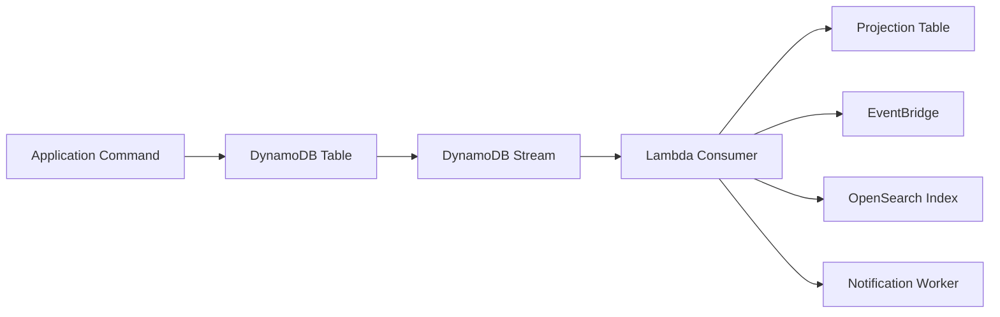
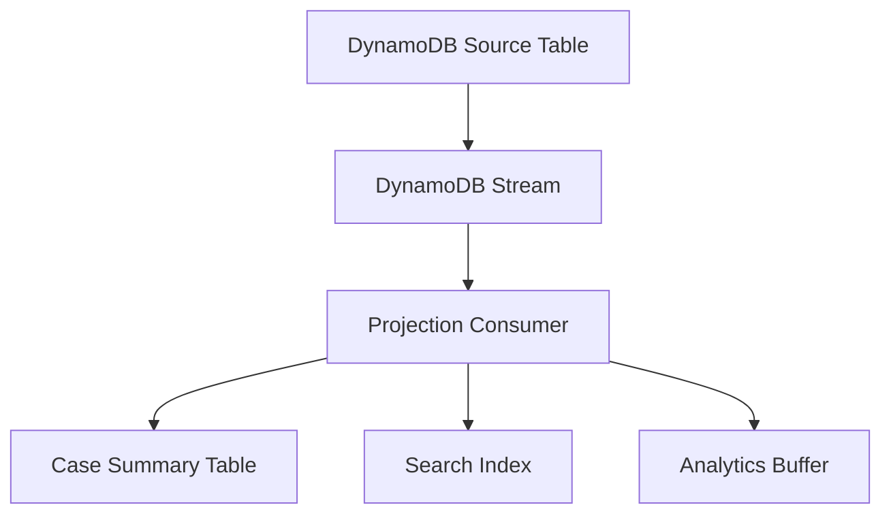
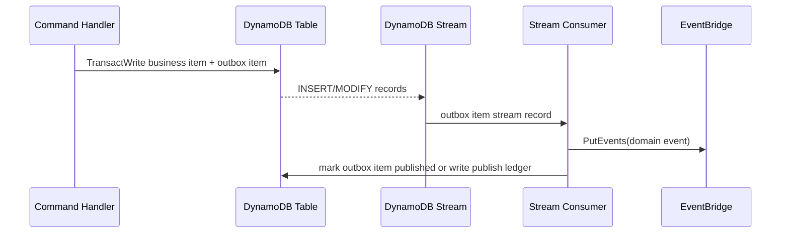
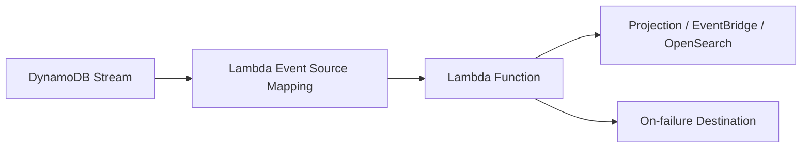
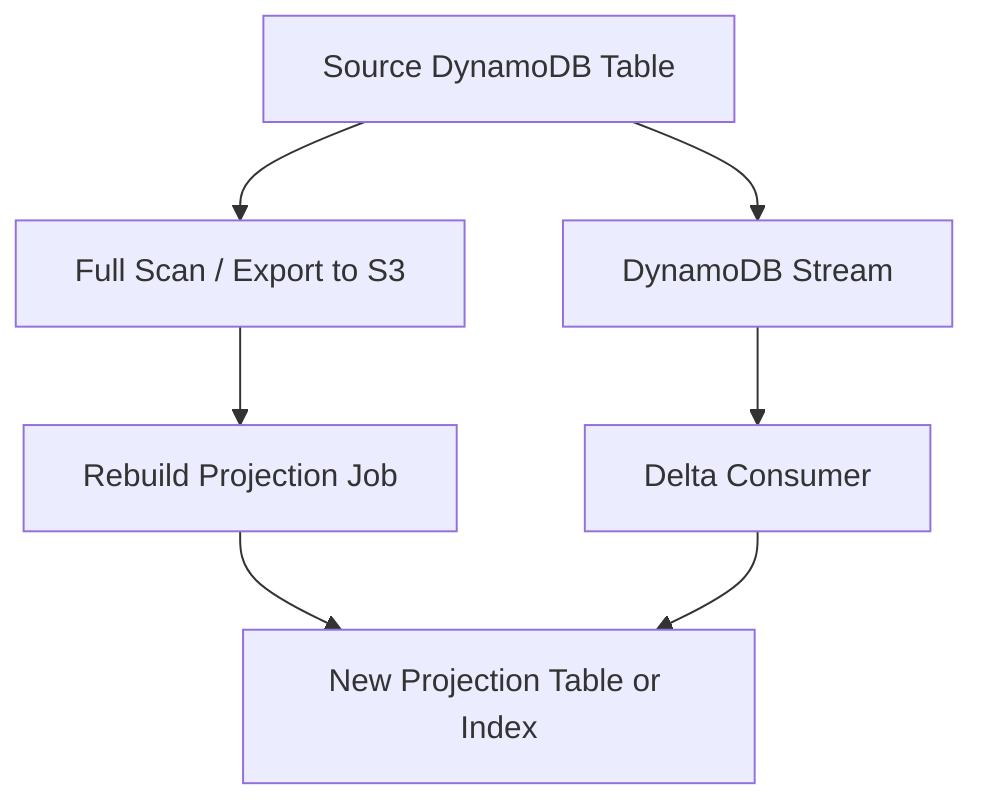
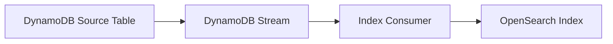
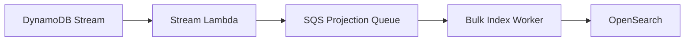
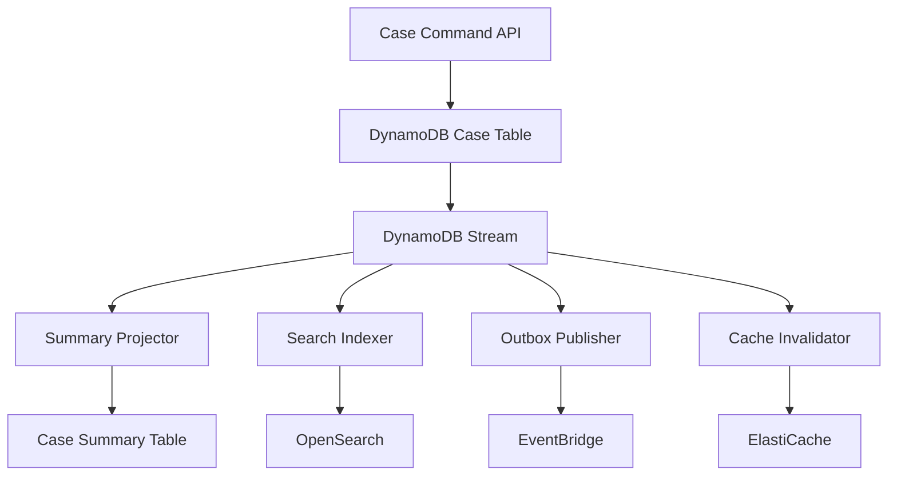

# Part 077 — DynamoDB Streams: Outbox, Projection, Event Sourcing Adjacent Pattern

DynamoDB Streams adalah change log untuk item-level modification pada table DynamoDB. Ia sangat berguna untuk membangun projection, cache invalidation, search indexing, audit processing, notification, dan event-driven integration.

Tetapi ada jebakan penting: **DynamoDB Streams bukan event store domain yang lengkap**.

Ia menangkap perubahan item. Domain event adalah fakta bisnis yang sengaja didesain. Kadang keduanya beririsan, tetapi tidak sama.

```txt
DynamoDB item change: status changed from UNDER_REVIEW to APPROVED
Domain event: CaseApprovedBySupervisor
Integration event: enforcement.case.approved.v1
Projection update: case_summary.status = APPROVED
```

Part ini membahas cara memakai DynamoDB Streams dengan disiplin production: ordering, idempotency, Lambda trigger, partial batch failure, consumer lag, projection rebuild, outbox-adjacent design, dan batasannya untuk event sourcing.

AWS documentation menyatakan DynamoDB Streams menangkap sequence perubahan item dalam log sampai 24 jam, setiap stream record muncul exactly once di stream, dan untuk item yang sama record muncul dalam urutan yang sama seperti modifikasi aktual. Dokumentasi CDC DynamoDB juga membandingkan DynamoDB Streams dengan Kinesis Data Streams for DynamoDB: DynamoDB Streams punya retention 24 jam dan sampai 2 simultaneous consumers per shard, sedangkan Kinesis Data Streams for DynamoDB dapat menyimpan data sampai 1 tahun dan mendukung lebih banyak consumer model.

---

## 1. Mental Model: Stream Is a Change Log, Not a Queue

Queue membawa unit pekerjaan.

Stream membawa urutan perubahan.



Perbedaan operasionalnya besar.

| Aspek | Queue | DynamoDB Stream |
|---|---|---|
| Unit utama | Work item | Item change record |
| Retention | Bisa lebih panjang sesuai queue config | 24 jam untuk DynamoDB Streams |
| Ordering | Bergantung queue type | Per item modification order dijaga |
| Retry | Message visibility / DLQ | Event source mapping retry / record age / destination |
| Consumer scaling | Worker concurrency | Shard-based processing |
| Replay | Queue redrive atau re-enqueue | Terbatas retention; untuk replay panjang butuh archive/projection rebuild |

Implikasi desain:

```txt
Jangan treat DynamoDB Streams sebagai durable business log jangka panjang.
Treat sebagai near-real-time CDC lane.
```

---

## 2. StreamViewType: Pilih Bentuk Record Sesuai Use Case

Ketika mengaktifkan stream, pilih `StreamViewType`.

| StreamViewType | Isi record | Cocok untuk |
|---|---|---|
| `KEYS_ONLY` | Primary key item | Cache eviction, lightweight invalidation |
| `NEW_IMAGE` | Item setelah perubahan | Projection, indexing, notification |
| `OLD_IMAGE` | Item sebelum perubahan | Audit diff sederhana, cleanup |
| `NEW_AND_OLD_IMAGES` | Before + after | Change classifier, transition detection, audit processing |

Decision rule:

```txt
Jika consumer perlu tahu field berubah dari apa ke apa, pilih NEW_AND_OLD_IMAGES.
Jika consumer hanya butuh state terbaru, pilih NEW_IMAGE.
Jika consumer hanya butuh invalidasi cache, pilih KEYS_ONLY.
```

Untuk sistem regulatory/case management, `NEW_AND_OLD_IMAGES` sering lebih aman karena consumer dapat membedakan:

```txt
case created
case status changed
case assignee changed
case severity escalated
case metadata updated tanpa domain transition
```

Tetapi jangan lupa: semakin besar image, semakin besar payload, memory, Lambda duration, dan downstream cost.

---

## 3. Record Anatomy

Contoh record konseptual:

```json
{
  "eventID": "...",
  "eventName": "MODIFY",
  "eventVersion": "1.1",
  "eventSource": "aws:dynamodb",
  "awsRegion": "ap-southeast-1",
  "dynamodb": {
    "Keys": {
      "PK": { "S": "CASE#C-1001" },
      "SK": { "S": "META" }
    },
    "NewImage": {
      "PK": { "S": "CASE#C-1001" },
      "SK": { "S": "META" },
      "status": { "S": "APPROVED" },
      "version": { "N": "12" }
    },
    "OldImage": {
      "PK": { "S": "CASE#C-1001" },
      "SK": { "S": "META" },
      "status": { "S": "UNDER_REVIEW" },
      "version": { "N": "11" }
    },
    "SequenceNumber": "...",
    "StreamViewType": "NEW_AND_OLD_IMAGES"
  }
}
```

Consumer jangan mengambil keputusan hanya dari `eventName`. `MODIFY` bisa berarti update minor, transition penting, audit append, idempotency record update, atau TTL delete.

Buat classifier eksplisit:

```txt
record -> itemType -> eventName -> old/new diff -> domain transition -> action
```

Contoh:

```java
boolean isCaseApproval(StreamRecord r) {
    return itemType(r).equals("CASE")
        && r.eventName().equals("MODIFY")
        && oldStatus(r).equals("UNDER_REVIEW")
        && newStatus(r).equals("APPROVED");
}
```

---

## 4. Ordering: Correct but Narrow

DynamoDB Streams membantu menjaga ordering untuk perubahan item yang sama. Ini bukan berarti semua record dalam table punya global ordering yang cocok untuk business process.

```txt
Guaranteed useful model:
  updates for same item are ordered

Dangerous assumption:
  updates across multiple partition keys are globally ordered
```

Misalnya:

```txt
CASE#1001 status approved
ORG#77 risk score updated
CASE#1001 enforcement action generated
```

Stream consumer tidak boleh mengasumsikan urutan lintas aggregate sama dengan urutan bisnis. Jika business invariant butuh urutan lintas aggregate, invariant itu harus berada di write path command, bukan stream consumer.

---

## 5. Stream Consumer as Projection Worker

Projection adalah derived state.



Projection consumer harus memenuhi invariant:

```txt
At-least-once safe
Idempotent
Can skip irrelevant records
Can handle stale/out-of-order derived updates
Can rebuild from source-of-truth table
```

Untuk projection ke DynamoDB table, gunakan conditional write berdasarkan source version.

```json
{
  "TableName": "case-summary",
  "Key": {
    "PK": { "S": "CASE#C-1001" }
  },
  "UpdateExpression": "SET #status = :status, sourceVersion = :v, updatedAt = :t",
  "ConditionExpression": "attribute_not_exists(sourceVersion) OR sourceVersion < :v",
  "ExpressionAttributeNames": {
    "#status": "status"
  },
  "ExpressionAttributeValues": {
    ":status": { "S": "APPROVED" },
    ":v": { "N": "12" },
    ":t": { "S": "2026-07-07T10:15:00Z" }
  }
}
```

Ini membuat projection tolerant terhadap duplicate invocation dan stale retry.

---

## 6. Idempotency for Stream Consumers

DynamoDB Streams record muncul exactly once dalam stream, tetapi Lambda invocation dan downstream side effects tetap harus dianggap at-least-once. Consumer bisa dipanggil ulang karena function error, timeout, throttling, deployment interruption, atau retry event source mapping.

Gunakan idempotency per side effect.

| Side effect | Idempotency key |
|---|---|
| Projection table update | `sourcePk + sourceSk + sourceVersion` |
| EventBridge publish | `domainEventId` atau `sourceTable + sequenceNumber` |
| Email/notification | `notificationType + caseId + sourceVersion` |
| OpenSearch index | deterministic document id + source version |
| Audit append | immutable event id with conditional put |

Pattern inbox table:

```txt
PK = CONSUMER#case-search-indexer
SK = STREAM#<eventSourceArn>#SEQ#<sequenceNumber>
```

Write before effect:

```txt
1. conditional put inbox record status=PROCESSING
2. perform side effect
3. mark inbox record status=SUCCEEDED
```

Untuk side effect yang tidak bisa dibuat idempotent, gunakan ledger:

```txt
external_effect_ledger
- effectId
- sourceRecordId
- status
- requestHash
- externalReference
- createdAt
- completedAt
```

---

## 7. Outbox-Adjacent Pattern with Streams

Classic transactional outbox:

```txt
same transaction:
  write business entity
  write outbox row/item
separate publisher:
  publish outbox event
  mark published
```

DynamoDB Streams memungkinkan variasi:



Kuncinya: stream consumer sebaiknya mempublikasikan **outbox item**, bukan menebak semua domain event dari diff item utama.

Kenapa?

Karena outbox item adalah contract sengaja:

```json
{
  "PK": "OUTBOX#2026-07-07",
  "SK": "EVENT#case.approved#C-1001#12",
  "eventId": "evt_01J...",
  "eventType": "case.approved.v1",
  "aggregateId": "C-1001",
  "aggregateVersion": 12,
  "payload": {
    "caseId": "C-1001",
    "approvedBy": "user-77",
    "approvedAt": "2026-07-07T10:15:00Z"
  },
  "publishStatus": "PENDING"
}
```

Stream record untuk outbox item menjadi publish trigger.

Benefits:

- event contract tidak tergantung bentuk internal item utama;
- producer bisa memilih event mana yang public;
- migration schema lebih aman;
- replay bisa dari outbox table, bukan hanya stream 24 jam;
- auditability lebih kuat.

---

## 8. Why Stream Diff Alone Is Usually Not Enough

Diff-based event generation terlihat menarik:

```txt
if old.status != new.status:
  publish case.statusChanged
```

Masalahnya:

1. Tidak semua perubahan status adalah domain event yang sama.
2. Metadata command hilang, misalnya actor, reason, requestId, source channel.
3. Backfill dan migration bisa memicu event palsu.
4. Internal refactor item bisa bocor menjadi external contract.
5. Consumer tidak tahu apakah event harus dipublikasi ke luar domain.

Gunakan diff untuk projection dan cache invalidation. Gunakan outbox untuk domain/integration events yang penting.

---

## 9. Event Sourcing Adjacent, Not Full Event Sourcing

DynamoDB Streams sering disalahpahami sebagai event sourcing.

Full event sourcing:

```txt
source of truth = append-only domain events
state = projection dari events
```

DynamoDB Streams:

```txt
source of truth = DynamoDB table items
stream = CDC dari item changes
```

| Aspek | Event Sourcing | DynamoDB Streams |
|---|---|---|
| Source of truth | Domain events | Table item state |
| Retention | Long-term business log | 24 hours for DynamoDB Streams |
| Event design | Intentional domain facts | Item mutation records |
| Replay | First-class | Limited unless archived elsewhere |
| Audit semantics | Domain-level | Storage-level unless enriched |

DynamoDB Streams bisa menjadi komponen event-sourcing-adjacent:

- trigger projection;
- publish outbox;
- feed audit log;
- feed analytics;
- detect state transitions.

Tetapi untuk full event sourcing, simpan immutable event item sebagai source of truth.

Contoh event-store-in-DynamoDB:

```txt
PK = CASE#C-1001
SK = EVENT#000000000001
SK = EVENT#000000000002
SK = EVENT#000000000003
```

Lalu stream hanya memicu projection dari event item yang baru.

---

## 10. Lambda Event Source Mapping

Pattern umum:



Key settings:

| Setting | Mengontrol |
|---|---|
| `BatchSize` | jumlah record per invocation |
| `MaximumBatchingWindowInSeconds` | buffering window |
| `StartingPosition` | `LATEST` atau `TRIM_HORIZON` saat mapping dibuat |
| `ParallelizationFactor` | concurrent batches per shard |
| `MaximumRetryAttempts` | batas retry function error |
| `MaximumRecordAgeInSeconds` | umur maksimal record diproses |
| `BisectBatchOnFunctionError` | split batch saat error |
| `ReportBatchItemFailures` | partial failure reporting |
| `DestinationConfig.OnFailure` | retain discarded invocation metadata/record |

Baseline production:

```yaml
BatchSize: 100
MaximumBatchingWindowInSeconds: 1
BisectBatchOnFunctionError: true
FunctionResponseTypes:
  - ReportBatchItemFailures
MaximumRetryAttempts: 5
MaximumRecordAgeInSeconds: 3600
DestinationConfig:
  OnFailure:
    Destination: arn:aws:sqs:ap-southeast-1:123456789012:ddb-stream-failures
```

Default infinite-ish retry until record expiry dapat membuat bad record memblokir shard terlalu lama. Untuk production, pilih failure policy eksplisit.

---

## 11. Partial Batch Failure

Tanpa partial batch response, satu record gagal membuat batch diproses ulang. Ini bisa mengulang side effect untuk record yang sebenarnya sukses.

Dengan `ReportBatchItemFailures`, function mengembalikan sequence number record gagal.

```json
{
  "batchItemFailures": [
    { "itemIdentifier": "49662000000000000000000000000000000000000000000000002" }
  ]
}
```

Untuk stream source, Lambda memakai sequence number. Jika beberapa item gagal, checkpoint dimulai dari lowest failed sequence number. Artinya record setelahnya akan diproses ulang.

Consumer tetap harus idempotent.

Pseudo-code:

```java
public StreamsEventResponse handle(DynamodbEvent event) {
    List<BatchItemFailure> failures = new ArrayList<>();

    for (DynamodbStreamRecord record : event.getRecords()) {
        try {
            processOne(record);
        } catch (RetryableException e) {
            failures.add(new BatchItemFailure(record.getDynamodb().getSequenceNumber()));
            break; // preserve order discipline in this shard batch
        } catch (PoisonRecordException e) {
            quarantine(record, e);
            // do not fail if quarantine succeeded and processing should advance
        }
    }

    return new StreamsEventResponse(failures);
}
```

Decision rule:

```txt
Retryable downstream outage -> fail batch/record
Permanent schema/poison issue -> quarantine and advance, after alert
Business duplicate/stale -> treat as success
```

---

## 12. Poison Record Handling

Poison record adalah record yang selalu gagal karena data/schema tidak valid atau logic bug.

Jika poison record selalu di-retry sampai expiry, shard lag naik dan semua perubahan berikutnya di shard tersebut tertahan.

Runbook:

```txt
1. Detect: IteratorAge / stream lag rising, same sequence failing.
2. Inspect: failed invocation destination payload.
3. Classify: transient downstream, poison schema, bug, oversized payload, missing reference.
4. If transient: fix dependency and retry.
5. If poison but safe to skip: quarantine record, mark skipped with reason, advance checkpoint.
6. If bug: deploy fix, reprocess if still within retention or rebuild projection.
7. Reconcile: compare source table and projection.
```

Quarantine item example:

```json
{
  "PK": "QUARANTINE#case-search-indexer",
  "SK": "STREAM#<sequenceNumber>",
  "sourceArn": "arn:aws:dynamodb:...:stream/...",
  "reason": "unknown-case-type",
  "recordKey": "CASE#C-1001|META",
  "firstSeenAt": "2026-07-07T10:30:00Z",
  "status": "OPEN"
}
```

---

## 13. Projection Rebuild Strategy

Karena DynamoDB Streams retention hanya 24 jam, production projection harus punya rebuild path.



Two-phase rebuild:

```txt
1. Start new projection table/index version.
2. Record cutover timestamp or source version watermark.
3. Backfill current source table into new projection.
4. Consume stream deltas from cutover point where possible.
5. Validate counts/checksums/sample records.
6. Switch read traffic to new projection.
7. Keep old projection for rollback window.
```

Jika rebuild lebih lama dari stream retention, jangan mengandalkan stream saja. Gunakan source table scan/export plus version-aware upsert.

Projection write harus idempotent:

```txt
apply if sourceVersion >= existingSourceVersion
```

---

## 14. OpenSearch Indexing Pattern

OpenSearch index biasanya projection, bukan source of truth.



Design rules:

- document id deterministic: `caseId` atau `aggregateId`;
- include `sourceVersion`;
- include `indexedAt`;
- do not derive authorization solely from stale index field;
- provide rebuild job;
- monitor index lag;
- support delete/tombstone event.

Index update pseudo-payload:

```json
{
  "docId": "CASE#C-1001",
  "sourceVersion": 12,
  "status": "APPROVED",
  "severity": "HIGH",
  "assignedTeam": "ENFORCEMENT-A",
  "indexedAt": "2026-07-07T10:20:00Z"
}
```

Search result must be revalidated when correctness matters:

```txt
search -> candidate ids -> batch get from source/projection with auth check
```

---

## 15. Cache Invalidation Pattern

DynamoDB Streams can drive cache invalidation.

```txt
Table update -> stream -> invalidation consumer -> delete cache key
```

Safer than writing cache synchronously in command handler because cache failure should not fail durable domain write.

But invalidation is eventually consistent.

Design:

```txt
cache key = case:<caseId>:v<version>
```

For mutable cache key:

```txt
case:<caseId>:current
```

Use invalidation from stream:

```txt
delete case:<caseId>:current
```

If stale reads are unacceptable, use versioned reads or source read.

---

## 16. Stream to EventBridge Pattern

Publishing all stream records to EventBridge is usually noisy.

Better:

```txt
stream consumer filters outbox/domain records -> maps to clean integration event -> EventBridge PutEvents
```

EventBridge event envelope:

```json
{
  "Source": "regulatory.case-service",
  "DetailType": "case.approved.v1",
  "EventBusName": "regulatory-domain-events",
  "Detail": "{\"eventId\":\"evt_...\",\"caseId\":\"C-1001\",\"version\":12}"
}
```

Use deterministic `eventId` in `Detail`; EventBridge delivery to targets can retry, and consumers must still be idempotent.

---

## 17. TTL and Streams

DynamoDB TTL delete can appear in streams. Treat TTL-driven deletion carefully.

Use cases:

- cleanup projection;
- expire idempotency records;
- revoke temporary token;
- remove session.

Pitfall:

```txt
TTL delete is not equivalent to a domain delete command.
```

A TTL expiration can mean lifecycle expiry, cleanup, privacy purge, or temporary data expiration. Consumer must inspect item type and fields.

Recommendation:

```txt
For business-visible deletion, write explicit deletion/tombstone event.
Use TTL for physical cleanup.
```

---

## 18. Shards, Lag, and Throughput

DynamoDB Stream consists of shards. Consumers process records by shard lineage. More than two readers per shard can cause throttling. Lambda abstracts much of this, but operationally you still watch lag and failure patterns.

Metrics/alarms to track:

| Signal | Meaning |
|---|---|
| `IteratorAge` / stream lag | consumer falling behind |
| Lambda errors | processing failures |
| Lambda throttles | insufficient concurrency/reserved concurrency too low |
| duration p95/p99 | downstream latency or batch inefficiency |
| failed destination count | discarded batches/records |
| projection freshness | application-visible lag |
| quarantine count | poison record rate |

Lag budget example:

```txt
Search projection freshness SLO: p95 < 30 seconds, p99 < 2 minutes
Cache invalidation freshness SLO: p99 < 10 seconds
Notification freshness SLO: p95 < 60 seconds
```

---

## 19. Backpressure and Downstream Protection

Stream consumers can overwhelm downstream systems.

Example: stream updates 10,000 records/sec; OpenSearch can index 2,000 docs/sec safely.

Controls:

- Lambda reserved concurrency;
- batch size;
- maximum batching window;
- downstream bulk API;
- internal SQS buffer after stream;
- circuit breaker/quarantine;
- projection-specific throttling;
- drop/coalesce strategy for non-critical projection.

Pattern with SQS buffer:



This separates stream checkpointing from slow downstream indexing. But the queue message must contain enough source identity/version to be idempotent.

---

## 20. Security and Least Privilege

Stream consumer role should not have broad database write access.

Minimum shape:

```txt
Consumer A: read stream + write projection table
Consumer B: read stream + PutEvents to event bus
Consumer C: read stream + write OpenSearch index
```

Avoid one mega-consumer with permissions to everything.

IAM sketch:

```yaml
Statement:
  - Effect: Allow
    Action:
      - dynamodb:DescribeStream
      - dynamodb:GetRecords
      - dynamodb:GetShardIterator
      - dynamodb:ListStreams
    Resource: arn:aws:dynamodb:ap-southeast-1:123456789012:table/case/stream/*
  - Effect: Allow
    Action:
      - events:PutEvents
    Resource: arn:aws:events:ap-southeast-1:123456789012:event-bus/regulatory-domain-events
```

---

## 21. Case Study: Enforcement Case Projection

Source table:

```txt
PK = CASE#<caseId>
SK = META
SK = PARTY#<partyId>
SK = ALLEGATION#<allegationId>
SK = ACTION#<actionId>
SK = OUTBOX#<eventId>
```

Consumers:

```txt
case-summary-projector
  builds read model by caseId

case-search-indexer
  updates search documents

case-event-publisher
  publishes OUTBOX items to EventBridge

case-cache-invalidator
  evicts mutable cache keys
```

Architecture:



Invariant table:

| Invariant | Enforced where |
|---|---|
| only valid status transition | command handler conditional write |
| one approval event per version | outbox item deterministic id |
| search eventually catches up | stream consumer + rebuild job |
| duplicate stream invocation safe | sourceVersion conditional update |
| notification not duplicated | notification ledger |
| audit cannot be reconstructed from projection only | immutable audit/outbox/event item |

---

## 22. Testing Matrix

| Test | Expected result |
|---|---|
| Duplicate Lambda invocation | no duplicate projection/event/notification |
| Consumer timeout after side effect | retry does not duplicate side effect |
| Poison record | quarantined or sent to failure destination; shard advances after decision |
| Downstream outage | retries within budget; lag alarm fires |
| Backfill update | does not emit external domain event accidentally |
| Stream retention exceeded | projection rebuild path works |
| Out-of-order stale projection write | rejected by sourceVersion condition |
| Consumer deploy rollback | checkpoint/idempotency protects effects |
| TTL delete | handled according to item type, not blindly as domain deletion |

---

## 23. Anti-Patterns

### Anti-Pattern 1: Stream Diff as Public Domain Event Contract

Internal item shape leaks to external consumers.

Better:

```txt
write explicit OUTBOX item with stable event contract
```

### Anti-Pattern 2: No Rebuild Path

Projection can only be recovered from a 24-hour stream.

Better:

```txt
source table scan/export + version-aware projection rebuild
```

### Anti-Pattern 3: Consumer Without Idempotency

Lambda retries produce duplicate notifications or duplicate index writes.

Better:

```txt
deterministic effect id + conditional write / ledger
```

### Anti-Pattern 4: One Consumer Does Everything

Search indexing, notification, event publish, and audit live in one Lambda.

Better:

```txt
separate consumers or separate downstream lanes by failure domain
```

### Anti-Pattern 5: Treating Stream Lag as Only a Technical Metric

Lag affects user-visible freshness and compliance timelines.

Better:

```txt
projection freshness SLO per business capability
```

---

## 24. Production Checklist

Before using DynamoDB Streams in production:

- [ ] `StreamViewType` matches use case.
- [ ] consumer has idempotency boundary.
- [ ] projection write uses source version/sequence guard.
- [ ] external side effects use deterministic ledger.
- [ ] event publishing uses explicit outbox item, not blind diff.
- [ ] Lambda event source mapping has retry, max age, partial failure, and on-failure destination policy.
- [ ] poison record runbook exists.
- [ ] projection rebuild path exists.
- [ ] stream lag dashboard exists.
- [ ] stream lag alarms map to user/business freshness SLO.
- [ ] cache/search/projection are labeled as derived state.
- [ ] IAM is least-privilege per consumer.
- [ ] backfill/migration does not accidentally emit external events.
- [ ] replay and reconciliation are tested.

---

## 25. References

- AWS DynamoDB Developer Guide — Change data capture for DynamoDB Streams: `https://docs.aws.amazon.com/amazondynamodb/latest/developerguide/Streams.html`
- AWS DynamoDB Developer Guide — Change data capture with Amazon DynamoDB: `https://docs.aws.amazon.com/amazondynamodb/latest/developerguide/streamsmain.html`
- AWS Lambda Developer Guide — Configuring partial batch response with DynamoDB and Lambda: `https://docs.aws.amazon.com/lambda/latest/dg/services-ddb-batchfailurereporting.html`
- AWS Lambda Developer Guide — Retain discarded records for a DynamoDB event source in Lambda: `https://docs.aws.amazon.com/lambda/latest/dg/services-dynamodb-errors.html`
- AWS DynamoDB Developer Guide — DynamoDB Streams and AWS Lambda triggers: `https://docs.aws.amazon.com/amazondynamodb/latest/developerguide/Streams.Lambda.html`

---

## 26. What You Should Retain

DynamoDB Streams is best understood as a **near-real-time CDC lane**.

Use it to react to state changes, build projections, invalidate cache, publish outbox events, and feed downstream systems. But do not confuse it with a durable long-term event store or a queue with infinite replay.

The production-grade pattern is:

```txt
Command handler protects source-of-truth invariant.
DynamoDB table stores authoritative state.
Outbox item stores intentional event.
DynamoDB Stream triggers publication/projection.
Consumers are idempotent.
Derived state can be rebuilt.
Lag is observable.
Failure has a runbook.
```
