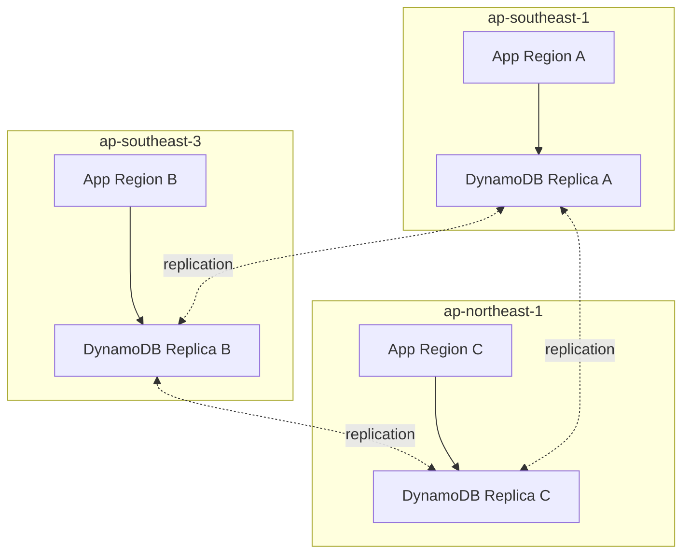
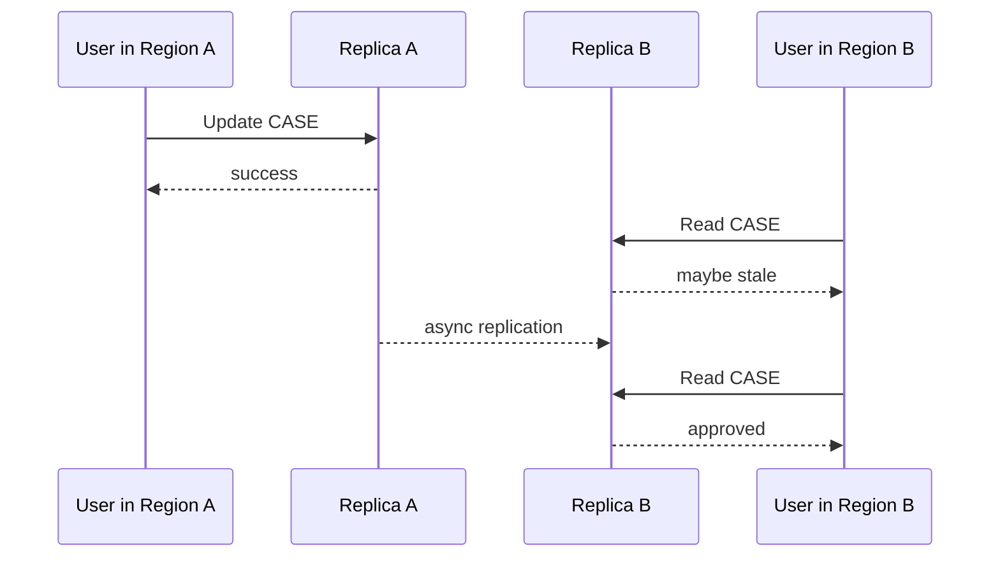
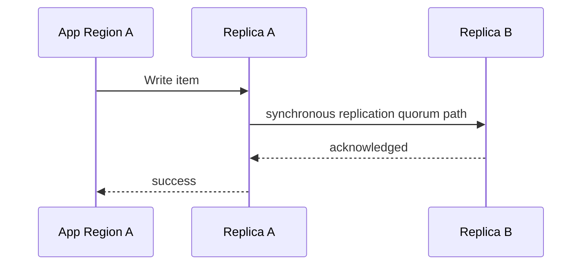
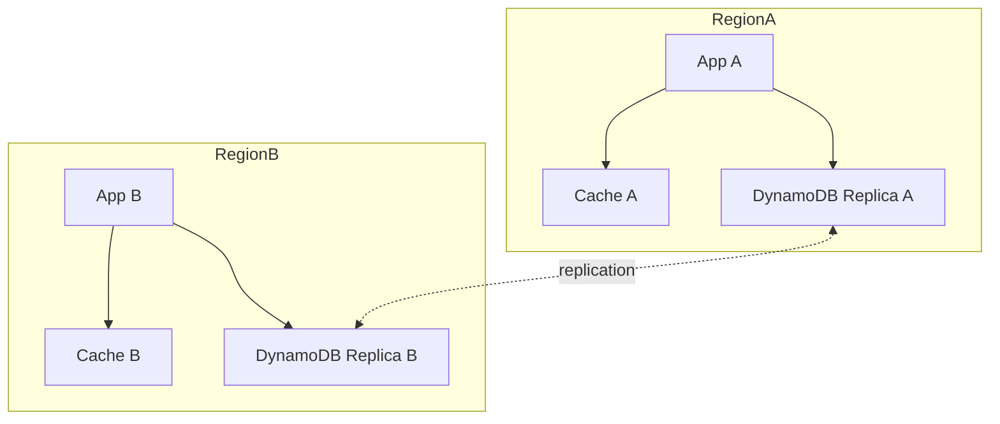
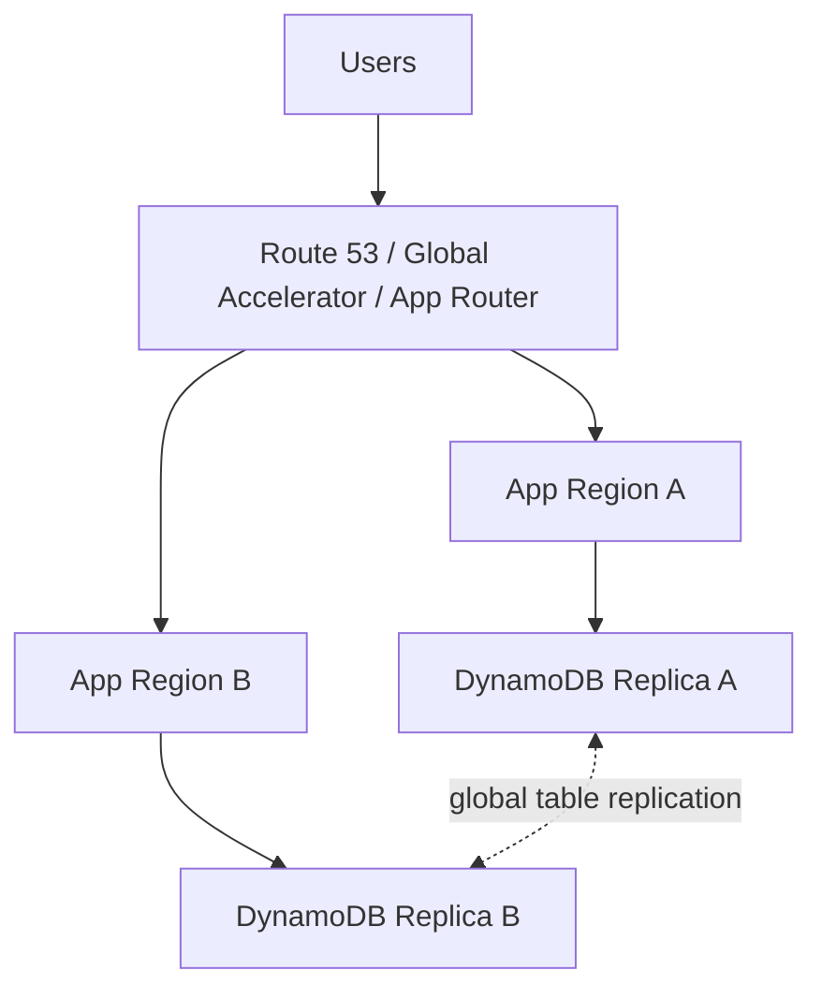
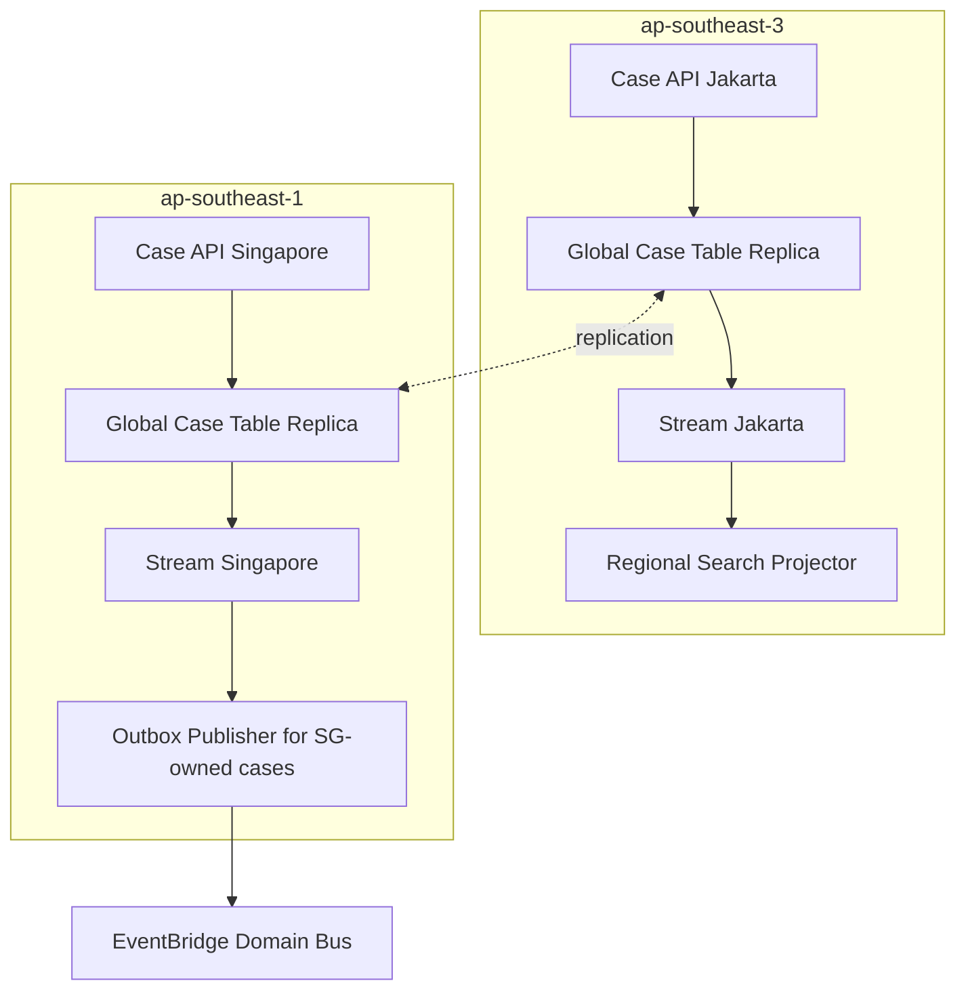

# Part 078 — Global Tables: Multi-Region Replication, Conflict Semantics, Locality

DynamoDB Global Tables membuat table DynamoDB dapat direplikasi lintas Region. Ini bukan sekadar fitur DR. Ini mengubah model konsistensi, routing, conflict, operability, cost, dan application semantics.

Mental model paling penting:

```txt
Global Table memberi multi-Region data plane.
Ia tidak otomatis memberi multi-Region application correctness.
```

Aplikasi tetap harus menentukan:

- Region mana yang menerima write untuk aggregate tertentu;
- apakah conflict boleh terjadi;
- bagaimana stale read ditoleransi;
- apakah workload butuh MREC atau MRSC;
- bagaimana failover/evacuation dilakukan;
- bagaimana event, cache, queue, dan side effect ikut aman lintas Region.

AWS documentation terbaru menyatakan global tables mendukung dua consistency mode: **multi-Region eventual consistency (MREC)** dan **multi-Region strong consistency (MRSC)**. Jika mode tidak dispesifikasikan, global table default ke MREC. Global table tidak bisa berisi replica dengan consistency mode berbeda dan consistency mode tidak bisa diubah setelah creation. Dokumentasi AWS juga menyatakan global tables dirancang untuk 99.999% availability, sedangkan single-Region table 99.99%.

---

## 1. Mental Model: Local Endpoint, Shared Logical Dataset

Global table terdiri dari replica table di beberapa Region. Aplikasi melakukan request ke endpoint DynamoDB Regional, bukan global endpoint tunggal.



Best practice dari AWS global table design guide: aplikasi yang homed ke satu Region sebaiknya mengakses endpoint DynamoDB lokal untuk Region tersebut; jika Region bermasalah, user traffic dipindahkan ke application endpoint di Region lain.

Implikasi:

```txt
Do not call DynamoDB cross-Region on every request.
Run application stack near local table replica.
Shift traffic at application layer when Region is unhealthy.
```

---

## 2. MREC vs MRSC

DynamoDB Global Tables sekarang punya dua mode besar.

| Mode | Arti | Write behavior | Read behavior | Trade-off |
|---|---|---|---|---|
| MREC | Multi-Region Eventual Consistency | write diterima lokal, replication asynchronous | remote Region bisa stale | low latency, conflict possible |
| MRSC | Multi-Region Strong Consistency | write direplikasi synchronously ke at least one other Region sebelum sukses | strongly consistent read dari replica mana pun melihat latest version | higher write/read latency, stricter deployment constraints |

Decision rule:

```txt
Use MREC when low-latency local writes matter and conflicts can be avoided by routing.
Use MRSC when zero-RPO / cross-Region strong consistency matters more than write latency and service constraints are acceptable.
```

Jangan pilih MRSC hanya karena “lebih kuat”. Strong consistency memiliki biaya latency, compatibility, dan operational trade-off.

---

## 3. MREC: Multi-Active Eventually Consistent Replication

Pada MREC, setiap replica dapat menerima read/write. Perubahan direplikasi asynchronous ke Region lain.



Useful for:

- low-latency reads close to users;
- low-latency local writes when write ownership is controlled;
- active-active application availability;
- Region migration;
- DR with RPO measured around replication delay.

Risk:

```txt
same item written concurrently in two Regions -> conflict
```

AWS docs state MREC resolves same-item concurrent conflict with last-writer-wins based on internal timestamp. Conflicts are not recorded in CloudWatch or CloudTrail.

That means losing writes can be silent from application perspective.

---

## 4. MRSC: Multi-Region Strong Consistency

MRSC aims to provide stronger consistency across participating Regions.

AWS docs state item changes in an MRSC replica are synchronously replicated to at least one other Region before write success, strongly consistent reads on any MRSC replica return latest item version, and conditional writes evaluate against latest version. MRSC can return `ReplicatedWriteConflictException` when attempting to modify an item already being modified in another Region.



Useful for:

- strict cross-Region consistency requirement;
- zero-RPO target;
- conditional writes that must evaluate globally;
- workloads that can tolerate extra latency.

But be careful:

```txt
MRSC is not a magic replacement for domain modeling.
It reduces some consistency hazards but does not remove idempotency, conflict retry, routing, side-effect, and failover design.
```

---

## 5. Last-Writer-Wins: The Dangerous Default Assumption

MREC last-writer-wins is simple at storage layer and dangerous at business layer.

Example:

```txt
Region A: officer approves enforcement case with evidence packet A
Region B: supervisor requests more information with evidence packet B
Both update CASE#1001 near the same time
Later timestamp wins
Losing write disappears from final item state
```

From a regulatory defensibility perspective, silent overwrite is unacceptable for many state transitions.

Mitigations:

| Strategy | Description |
|---|---|
| Region pinning | each aggregate has home Region for writes |
| command routing | write request routed to aggregate home Region |
| conditional version | reject stale local write where possible |
| append-only event items | avoid destructive overwrite for audit-critical facts |
| conflict item ledger | record conflict candidates at application layer |
| MRSC | use strong consistency mode if workload requires it and constraints fit |

LWW is acceptable for some data:

```txt
last seen timestamp
user preference theme
device heartbeat
cache-like denormalized field
```

It is risky for:

```txt
case state transition
payment state
legal/regulatory decision
quota/counter invariant
ownership transfer
approval/rejection outcome
```

---

## 6. Write Ownership Models

Global table design starts with write ownership.

### Model A — Single Writer Region

```txt
All writes go to Region A.
Region B/C are read replicas and failover targets.
```

Pros:

- simplest correctness;
- no concurrent write conflict under normal operation;
- easier auditing.

Cons:

- remote write latency;
- failover needs routing switch;
- Region A dependency for writes.

### Model B — Aggregate Home Region

Each aggregate has a home Region.

```txt
CASE#1001 -> ap-southeast-1
CASE#1002 -> ap-southeast-3
CASE#1003 -> ap-northeast-1
```

Use routing table or deterministic hash:

```txt
homeRegion = regionByTenant(tenantId)
homeRegion = regionByCasePrefix(caseId)
homeRegion = explicit attribute on aggregate root
```

Pros:

- low local writes for most users;
- conflict avoidance;
- scalable regional ownership.

Cons:

- command routing complexity;
- evacuation needs ownership reassignment;
- cross-aggregate workflows need careful orchestration.

### Model C — Any Region Writes Any Item

```txt
Nearest Region accepts all writes to all items.
```

Pros:

- lowest user-perceived write latency;
- easiest routing.

Cons:

- highest conflict risk;
- LWW can lose business facts;
- difficult auditability.

Recommended only for data where LWW is semantically acceptable or when MRSC constraints are deliberately accepted.

---

## 7. Region Pinning Pattern

Region pinning means each item/aggregate has an owning Region for writes.

Item example:

```json
{
  "PK": "CASE#C-1001",
  "SK": "META",
  "homeRegion": "ap-southeast-1",
  "status": "UNDER_REVIEW",
  "version": 7
}
```

Command handler:

```java
if (!request.region().equals(caseRecord.homeRegion())) {
    return redirectToHomeRegion(caseRecord.homeRegion());
}

updateCaseWithCondition(caseId, expectedVersion, transition);
```

Routing decision:

```txt
1. Read local replica.
2. Determine homeRegion.
3. If local != homeRegion, route command to home application endpoint.
4. Home Region writes local DynamoDB endpoint.
5. Replication propagates to other Regions.
```

Use local reads for view/query, but route commands to owner.

---

## 8. Conditional Writes in Global Tables

Conditional writes behave differently depending on consistency mode and locality.

For MREC:

```txt
condition evaluates against local Region replica
remote concurrent write may not be visible yet
```

So this is not enough to prevent cross-Region race:

```txt
ConditionExpression: version = :expectedVersion
```

Two Regions can both read version 7 and both write version 8 before replication.

In MREC, conditional writes protect local concurrency; they do not guarantee global serialization.

In MRSC, AWS docs state conditional writes evaluate against the latest version of an item. That changes what you can rely on, but still requires retry handling for conflict exceptions.

---

## 9. Global Tables and Transactions

Do not assume multi-item transactions replicate as a single globally atomic bundle.

AWS global table best practices state items are replicated individually, and items updated within a single transaction might not be replicated together. For MRSC, AWS docs currently state global tables using MRSC do not support transaction APIs.

Implication:

```txt
A remote Region can temporarily observe item A updated but item B not yet updated.
```

Design guidelines:

- keep invariant within one item when possible;
- use aggregate home Region for transactional command;
- do not expose cross-item partially replicated state as final truth;
- use versioned projection/read model;
- use workflow status that tolerates intermediate replication state;
- reconcile derived state.

---

## 10. Read Locality and Staleness

MREC local read can be stale relative to another Region.

Read strategy:

| Read type | Strategy |
|---|---|
| user dashboard | local eventual read acceptable with freshness indicator |
| command precondition | route to home Region or use MRSC if globally strong needed |
| after local write | read local Region where write was accepted |
| after remote write | redirect/read from home Region or wait for replication |
| audit/legal final state | read authoritative/home Region or strongly consistent model |

UX pattern:

```txt
Command accepted in home Region.
Remote dashboard shows “updating…” until observedVersion >= commandVersion.
```

API response can include:

```json
{
  "caseId": "C-1001",
  "acceptedVersion": 12,
  "homeRegion": "ap-southeast-1",
  "readConsistency": "eventual-global",
  "projectionFreshnessHint": "may-lag-cross-region"
}
```

---

## 11. Eventing with Global Tables

DynamoDB Streams exist per replica table. A write replicated into a Region can also appear as a stream record in that Region depending on stream configuration and replication behavior.

Do not let every Region publish the same integration event.

Bad pattern:

```txt
Global table in 3 Regions
Each replica stream has event publisher
One business write replicated to 3 streams
3 duplicate EventBridge events emitted
```

Safer options:

### Option A — Publish Only from Home Region

```txt
if localRegion == item.homeRegion: publish
else: ignore for publish, maybe update projection
```

### Option B — Outbox Publisher Ownership

Outbox item contains `publishRegion`.

```json
{
  "PK": "OUTBOX#2026-07-07",
  "SK": "EVENT#evt-123",
  "eventId": "evt-123",
  "publishRegion": "ap-southeast-1",
  "published": false
}
```

Publisher condition:

```txt
publish only when currentRegion == publishRegion
```

### Option C — Multi-Region Idempotent Publisher

Every Region may attempt publish, but shared idempotency ledger prevents duplicate external effect.

This is harder and still must consider replication delay.

---

## 12. Outbox with Global Tables

Global table outbox needs explicit semantics.

Problem:

```txt
outbox item replicated to all Regions
all stream consumers see it
all publish
```

Recommended outbox shape:

```json
{
  "PK": "OUTBOX#2026-07-07",
  "SK": "EVENT#evt-01J...",
  "eventId": "evt-01J...",
  "aggregateId": "C-1001",
  "aggregateVersion": 12,
  "homeRegion": "ap-southeast-1",
  "publishRegion": "ap-southeast-1",
  "eventType": "case.approved.v1",
  "payload": { "caseId": "C-1001" },
  "createdAt": "2026-07-07T10:15:00Z"
}
```

Publisher guard:

```java
if (!currentRegion.equals(outbox.publishRegion())) {
    return; // projection-only replica observed the outbox
}

publishEvent(outbox);
markPublishedWithCondition(outbox.eventId);
```

For external systems that cannot handle duplicates, add an external side-effect ledger in the publish Region.

---

## 13. Cache and Projection with Global Tables

Cache is regional.



Cache invalidation driven by local stream in each Region is fine for local reads, but global staleness remains.

Rules:

- cache key should include source version when correctness matters;
- local cache invalidation only means local replica observed change;
- after failover, cold/warm cache may contain stale entries;
- use TTL and version guard;
- do not store authorization-critical mutable state only in cache.

Projection tables can also be global tables, but then you have two replication systems: source and projection. Prefer derived projections per Region unless the projection itself requires global replication.

---

## 14. Failover and Evacuation

Global tables do not perform application traffic failover. You need routing.



Evacuation runbook:

```txt
1. Detect Region unhealthy.
2. Freeze or redirect writes for affected homeRegion if using Region pinning.
3. Shift user traffic away from unhealthy Region.
4. Ensure target Region app has capacity.
5. Validate DynamoDB replica health and replication latency.
6. Disable duplicate regional publishers if needed.
7. Monitor conflict/error metrics.
8. Reconcile after source Region recovers.
9. Decide whether to rehome aggregates back or keep migrated ownership.
```

For MREC, RPO is bounded by replication delay, not zero. For MRSC, zero-RPO target is possible, but failure semantics and Region-set constraints still need testing.

---

## 15. Global Tables and Counters

Counters are hard in multi-Region active-active MREC.

Bad idea:

```txt
Region A increments count from 10 to 11
Region B increments count from 10 to 11
LWW final count = 11, but two increments happened
```

Safer patterns:

### Per-Region Counter Shards

```txt
PK = COUNTER#case-open
SK = REGION#ap-southeast-1
SK = REGION#ap-southeast-3
SK = REGION#ap-northeast-1
```

Global count = sum all region shards.

### Event-Derived Count

Append immutable events and project count.

### Home-Region Counter

Route all increments for one logical counter to owner Region.

### MRSC

Consider if strongly consistent writes are required and constraints fit.

---

## 16. Global Tables and Uniqueness

Global uniqueness under MREC is non-trivial.

Example:

```txt
same email registered in Region A and Region B before replication
both conditional put succeed locally
replication conflict resolves at item level, but business process already emitted two welcomes
```

Approaches:

| Requirement | Pattern |
|---|---|
| uniqueness only within home tenant | route tenant writes to home Region |
| global uniqueness strict | single writer Region or MRSC if supported/appropriate |
| eventual uniqueness acceptable | detect conflict asynchronously and resolve |
| reservation flow | central reservation service or home-region uniqueness item |

MREC conditional put alone does not guarantee global uniqueness across concurrent Regions.

---

## 17. Multi-Region Workflow Boundary

Step Functions executions are Regional. If a workflow writes a global table, define ownership.

Bad:

```txt
Same command retried in Region A and Region B starts two workflows.
Both workflows update same global table item.
```

Better:

```txt
command idempotency record includes homeRegion and workflowExecutionArn
only home Region starts workflow for aggregate
failover explicitly rehomes or resumes with idempotency guard
```

Command record:

```json
{
  "PK": "COMMAND#cmd-123",
  "SK": "META",
  "aggregateId": "C-1001",
  "homeRegion": "ap-southeast-1",
  "workflowArn": "arn:aws:states:ap-southeast-1:...:execution:case-saga:cmd-123",
  "status": "STARTED"
}
```

---

## 18. Cost Model

Global tables multiply writes. Each write must be replicated to other Regions and stored in each replica.

Cost drivers:

- write request units / replicated write units;
- storage per replica;
- stream processing per Region;
- backup/export per Region;
- data transfer/replication cost where applicable;
- global secondary indexes replicated per Region;
- TTL/delete replication effects;
- on-demand vs provisioned capacity mode;
- MRSC latency/architecture trade-offs.

Cost review questions:

```txt
Do all tables need global replication?
Do all attributes need to live in globally replicated item?
Can large payloads stay in S3 with regional strategy?
Do all GSIs need to exist in every Region?
Can derived projections be regional instead of global?
```

---

## 19. Observability

Global table observability must be regional and cross-regional.

Track:

| Signal | Meaning |
|---|---|
| `ReplicationLatency` | lag between Region pairs for MREC |
| throttled requests per replica | local capacity issue |
| user errors / conditional failures | conflict or stale command behavior |
| `ReplicatedWriteConflictException` | MRSC concurrent write conflict |
| stream lag per Region | event/projection freshness |
| publisher duplicate/drop count | eventing correctness |
| route distribution | unexpected writes to wrong Region |
| homeRegion mismatch count | routing bug |
| reconciliation diff count | convergence/correctness issue |

Dashboard should answer:

```txt
Which Region is serving writes?
Which Region owns which aggregate/tenant?
Is replication healthy?
Are conflicts occurring?
Are derived systems duplicated across Regions?
Can we evacuate now?
```

---

## 20. Reconciliation

Even with global tables, build reconciliation.

For MREC:

```txt
source facts may conflict silently by LWW
```

For MRSC:

```txt
some conflicts surface as exceptions, but application side effects still need verification
```

Reconciliation jobs:

- compare aggregate version across Regions;
- compare business ledger vs current state;
- detect duplicate command processing;
- validate projection freshness;
- validate outbox published exactly once logically;
- detect item homeRegion mismatch;
- identify unexpected writes from non-home Region.

Example reconciliation query item:

```txt
PK = RECON#2026-07-07
SK = CASE#C-1001
sourceVersionRegionA = 12
sourceVersionRegionB = 12
projectionVersionRegionA = 12
projectionVersionRegionB = 11
status = PROJECTION_LAG
```

---

## 21. Case Study: Regulatory Case Platform

Requirements:

```txt
- users in Jakarta and Tokyo need low-latency reads
- case write ownership follows regulator jurisdiction
- enforcement decision cannot be silently overwritten
- search can be eventually consistent
- notification must not duplicate
- Region evacuation must preserve audit trail
```

Architecture:



Policy:

```txt
case.homeRegion = jurisdiction.homeRegion
commands route to homeRegion
read APIs use local replica with freshness/version indicator
outbox publish only from homeRegion
search projection regional
notifications use eventId ledger
critical counters use per-region shards or home-region writes
```

This gives low-latency reads and controlled writes without pretending MREC is serializable globally.

---

## 22. Testing Matrix

| Test | Expected result |
|---|---|
| concurrent same-item write in two MREC Regions | conflict behavior understood; no silent business loss for critical aggregate because routing prevents it |
| command sent to non-home Region | redirect/reject, not local write |
| Region evacuation | traffic shifts; write ownership policy remains explicit |
| stream publisher active in all Regions | no duplicate external event because publishRegion guard/ledger works |
| replication lag spike | dashboard/alarm fires; UI freshness indicator correct |
| GSI hot key in one Region | local throttling visible and isolated |
| duplicate command after failover | idempotency record prevents second workflow/effect |
| MRSC write conflict | retry handles `ReplicatedWriteConflictException` safely |
| projection stale after failover | read path handles staleness/rebuild |
| reconciliation after outage | diff report generated and resolved |

---

## 23. Anti-Patterns

### Anti-Pattern 1: “Global Table Means Global Serializability”

MREC is eventually consistent with LWW conflict resolution.

Better:

```txt
Choose MREC/MRSC explicitly and design write ownership accordingly.
```

### Anti-Pattern 2: Any Region Writes Any Critical Item

This invites silent conflict for business-critical state.

Better:

```txt
Aggregate home Region or single writer for critical aggregates.
```

### Anti-Pattern 3: Every Replica Stream Publishes External Events

Replication can cause duplicate publishes.

Better:

```txt
publishRegion guard + event ledger + consumer idempotency.
```

### Anti-Pattern 4: No Regional Routing Metadata

Without `homeRegion`, debugging write ownership is guesswork.

Better:

```txt
store homeRegion/ownerRegion on aggregate root and command records.
```

### Anti-Pattern 5: Treating Conflict Metrics as Complete

MREC LWW conflicts may not be surfaced in CloudWatch/CloudTrail.

Better:

```txt
avoid conflicts by design; reconcile business ledger and state.
```

---

## 24. ADR Template

```mdx
# ADR: DynamoDB Global Table for <domain>

## Context
- Workload:
- Regions:
- Read latency target:
- Write latency target:
- RPO/RTO:
- Data residency constraint:

## Consistency Mode
- Chosen: MREC / MRSC
- Reason:
- Rejected alternative:

## Write Ownership
- Single writer / aggregate home / any-region:
- Routing mechanism:
- Failover ownership process:

## Conflict Strategy
- Conflict types possible:
- Prevented by:
- Detected by:
- Reconciled by:

## Eventing Strategy
- Stream enabled per Region:
- Publish Region:
- Idempotency ledger:
- Duplicate prevention:

## Observability
- Replication latency:
- Conflict/error metrics:
- Routing mismatch:
- Reconciliation:

## Cost
- replica count:
- GSI count:
- stream consumers:
- backup/export:

## Rollback / Exit
- remove replica:
- migrate Region:
- convert ownership:
```

---

## 25. Production Checklist

Before using DynamoDB Global Tables:

- [ ] consistency mode selected intentionally: MREC or MRSC.
- [ ] mode immutability understood.
- [ ] write ownership model documented.
- [ ] every aggregate has `homeRegion` or equivalent routing rule.
- [ ] critical commands cannot write from arbitrary Region.
- [ ] MREC LWW implications accepted only for safe data.
- [ ] MRSC latency/constraints tested if used.
- [ ] global uniqueness strategy defined.
- [ ] counters are region-sharded, home-routed, or strongly coordinated.
- [ ] event publisher does not duplicate across replicas.
- [ ] stream consumers are Region-aware.
- [ ] failover/evacuation runbook tested.
- [ ] replication lag dashboard exists.
- [ ] reconciliation job exists.
- [ ] cost model includes replicas, GSIs, streams, backup, and write replication.
- [ ] data residency and KMS/IAM boundaries reviewed.

---

## 26. References

- AWS DynamoDB Developer Guide — Global tables multi-active, multi-Region replication: `https://docs.aws.amazon.com/amazondynamodb/latest/developerguide/GlobalTables.html`
- AWS DynamoDB Developer Guide — How DynamoDB global tables work: `https://docs.aws.amazon.com/amazondynamodb/latest/developerguide/V2globaltables_HowItWorks.html`
- AWS DynamoDB Developer Guide — Using DynamoDB global tables: `https://docs.aws.amazon.com/amazondynamodb/latest/developerguide/bp-global-table-design.html`
- AWS DynamoDB Developer Guide — Global tables core concepts: `https://docs.aws.amazon.com/amazondynamodb/latest/developerguide/globaltables-CoreConcepts.html`
- AWS DynamoDB Developer Guide — DynamoDB read consistency: `https://docs.aws.amazon.com/amazondynamodb/latest/developerguide/HowItWorks.ReadConsistency.html`

---

## 27. What You Should Retain

Global Tables solve **multi-Region data replication**. They do not by themselves solve **multi-Region business correctness**.

The safe mental model:

```txt
MREC = local low-latency writes + asynchronous replication + LWW conflict risk.
MRSC = stronger cross-Region consistency + higher latency/constraints + explicit conflict exceptions.
```

For production systems:

```txt
Choose consistency mode deliberately.
Define write ownership.
Route commands to the owner.
Make events region-aware.
Guard external side effects.
Observe replication and conflicts.
Reconcile after failure.
```

For compliance-heavy systems, the most defensible pattern is usually not “write anywhere”. It is:

```txt
read local, write owned, publish once, reconcile continuously.
```
