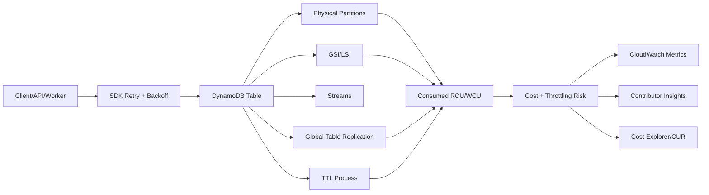
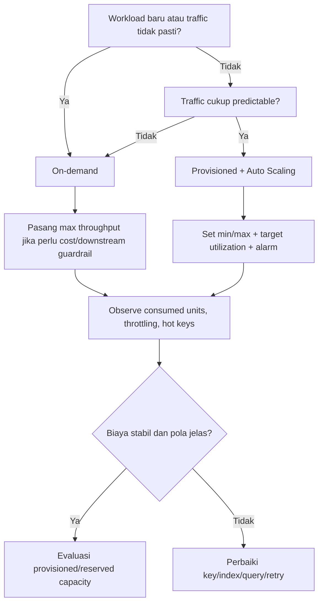
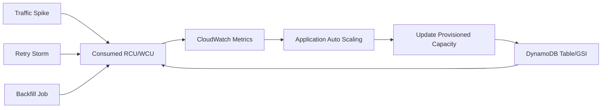
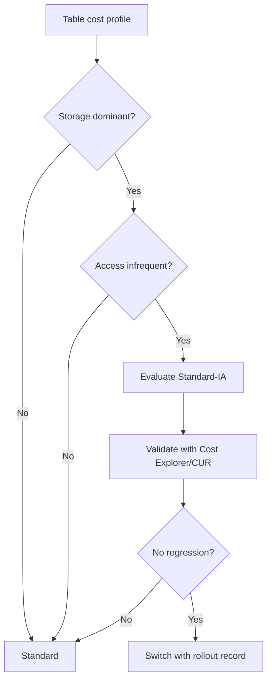
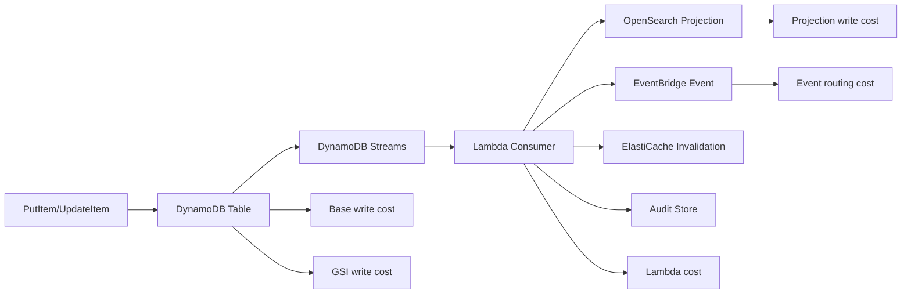

# Part 079 — DynamoDB Capacity and Cost

DynamoDB capacity bukan sekadar memilih **on-demand** atau **provisioned**. Itu adalah desain control system.

Jika API traffic naik, DynamoDB bisa scale. Tetapi sistem kamu belum tentu aman. Worker bisa flood downstream. GSI bisa menjadi bottleneck. Global table bisa menggandakan write cost. Backfill bisa memakan throughput yang seharusnya untuk user traffic. TTL bisa mengurangi storage, tetapi replicated TTL delete tetap bisa punya biaya di replica Region. Retry yang salah bisa membuat biaya naik ketika sistem sedang sakit.

Part ini membahas DynamoDB dari sudut pandang engineer production: **berapa besar workload yang bisa ditahan, berapa biaya yang muncul, di mana amplification terjadi, dan guardrail apa yang wajib dipasang**.

Referensi utama:

- DynamoDB throughput capacity modes: https://docs.aws.amazon.com/amazondynamodb/latest/developerguide/capacity-mode.html
- On-demand capacity mode: https://docs.aws.amazon.com/amazondynamodb/latest/developerguide/on-demand-capacity-mode.html
- Maximum throughput for on-demand tables: https://docs.aws.amazon.com/amazondynamodb/latest/developerguide/on-demand-capacity-mode-max-throughput.html
- Provisioned capacity mode: https://docs.aws.amazon.com/amazondynamodb/latest/developerguide/provisioned-capacity-mode.html
- Read/write capacity units: https://docs.aws.amazon.com/amazondynamodb/latest/developerguide/read-write-operations.html
- Warm throughput: https://docs.aws.amazon.com/amazondynamodb/latest/developerguide/warm-throughput.html
- Burst and adaptive capacity: https://docs.aws.amazon.com/amazondynamodb/latest/developerguide/burst-adaptive-capacity.html
- TTL: https://docs.aws.amazon.com/amazondynamodb/latest/developerguide/TTL.html
- Table classes: https://docs.aws.amazon.com/amazondynamodb/latest/developerguide/WorkingWithTables.tableclasses.html
- Cost optimization best practices: https://docs.aws.amazon.com/amazondynamodb/latest/developerguide/bp-cost-optimization.html

---

## 1. Mental Model: Capacity adalah Contract antara Workload dan Partitioned Storage

DynamoDB menyembunyikan banyak detail distribusi fisik, tetapi tidak menghapus hukum dasarnya:

1. Semua request tetap memakai kapasitas.
2. Semua kapasitas tetap berujung pada partition, index, dan item size.
3. Semua index menambah read/write surface.
4. Semua retry mengulang konsumsi kapasitas.
5. Semua projection dan global replication menambah amplification.
6. Semua hot key adalah masalah desain akses, bukan hanya masalah quota.

Gambarnya seperti ini:



Kapasitas bukan hanya “bisa handle berapa request”. Kapasitas adalah kombinasi dari:

| Dimensi | Pertanyaan desain |
|---|---|
| Throughput | Berapa read/write per detik yang diharapkan? |
| Item size | Berapa KB per item yang dibaca/ditulis? |
| Consistency | Eventually consistent, strongly consistent, atau transactional? |
| Index amplification | Berapa GSI/LSI yang ikut berubah saat write? |
| Partition distribution | Apakah request tersebar atau menumpuk pada key tertentu? |
| Traffic shape | Stabil, bursty, seasonal, launch spike, atau backfill? |
| Global replication | Apakah setiap write direplikasi ke Region lain? |
| Retention | Berapa lama item disimpan? Apakah TTL cukup? |
| Replay/backfill | Apakah ada job bulk yang bisa mengganggu traffic utama? |
| Guardrail | Apakah ada max throughput, quota, alarm, budget, dan throttling runbook? |

Dalam sistem regulatory/case-management, kesalahan capacity design biasanya muncul sebagai:

- inbox notifikasi kasus telat diproses;
- SLA escalation salah karena worker lag;
- audit projection tertinggal;
- hot tenant membuat tenant lain ikut lambat;
- GSI write throttling membuat write ke base table ikut terhambat;
- backfill migration mengganggu traffic production;
- cost melonjak karena scan, index projection, atau global table replication.

---

## 2. Request Unit: Hitung dari Item Size dan Semantics

DynamoDB capacity dihitung dari request unit.

Aturan praktis:

| Operation | Unit dasar |
|---|---|
| Strongly consistent read | 1 read unit untuk item sampai 4 KB |
| Eventually consistent read | 0.5 read unit untuk item sampai 4 KB |
| Transactional read | 2 read units untuk item sampai 4 KB |
| Standard write | 1 write unit untuk item sampai 1 KB |
| Transactional write | 2 write units untuk item sampai 1 KB |

Ukuran item dibulatkan naik ke unit berikutnya.

Contoh:

| Item size | Eventually consistent read | Strongly consistent read | Standard write | Transactional write |
|---:|---:|---:|---:|---:|
| 0.8 KB | 0.5 RRU/RCU | 1 RRU/RCU | 1 WRU/WCU | 2 WRU/WCU |
| 3.2 KB | 0.5 | 1 | 4 | 8 |
| 5.1 KB | 1 | 2 | 6 | 12 |
| 12 KB | 1.5 | 3 | 12 | 24 |

Jangan tertipu oleh “1 request”. Satu request bisa mahal jika:

- item besar;
- transactional;
- menyentuh banyak item;
- memakai strongly consistent read;
- menulis item yang memproyeksikan banyak attribute ke GSI;
- menyebabkan replication ke beberapa Region.

### 2.1 Formula kasar konsumsi read

```txt
read_units = ceil(item_size_kb / 4) * consistency_multiplier * item_count

consistency_multiplier:
- eventually consistent = 0.5
- strongly consistent = 1
- transactional = 2
```

Contoh query:

```txt
Query returns 40 items
average item size = 2 KB
consistency = eventually consistent

read_units = ceil(2 / 4) * 0.5 * 40
           = 1 * 0.5 * 40
           = 20 read units
```

Jika read tersebut strong consistent:

```txt
read_units = 1 * 1 * 40
           = 40 read units
```

Jika transactional:

```txt
read_units = 1 * 2 * 40
           = 80 read units
```

### 2.2 Formula kasar konsumsi write

```txt
write_units = ceil(item_size_kb / 1) * write_multiplier * item_count

write_multiplier:
- standard = 1
- transactional = 2
```

Contoh write:

```txt
Update one case item
item size after update = 3.2 KB
standard write

write_units = ceil(3.2 / 1) * 1
            = 4 write units
```

Jika transactional write:

```txt
write_units = 4 * 2
            = 8 write units
```

### 2.3 Query filter tidak otomatis murah

Filter expression bukan index. Filter dilakukan setelah DynamoDB membaca item yang cocok dengan key condition. Karena itu filter bisa mengurangi payload response, tetapi tidak selalu mengurangi read capacity yang sudah dipakai untuk membaca item kandidat.

Anti-pattern:

```txt
PK = TENANT#42
SK begins_with CASE#
FilterExpression = status = 'OPEN'
```

Jika tenant punya 500.000 case dan hanya 100 yang OPEN, desain ini tetap membaca terlalu banyak kandidat. Solusi yang lebih baik biasanya:

```txt
GSI1PK = TENANT#42#STATUS#OPEN
GSI1SK = PRIORITY#HIGH#DUE#2026-07-07#CASE#123
```

atau materialized queue/read model khusus untuk workload tersebut.

---

## 3. Capacity Mode: On-Demand vs Provisioned

DynamoDB menyediakan dua mode capacity:

1. **On-demand**: bayar per request, lebih sederhana untuk workload unpredictable.
2. **Provisioned**: tentukan RCU/WCU, bisa auto scale, cocok untuk workload yang predictable dan ingin cost control lebih eksplisit.

Decision tree sederhana:



### 3.1 On-demand capacity mode

On-demand cocok ketika:

- workload belum diketahui;
- traffic bursty;
- tim ingin menghindari capacity planning awal;
- aplikasi baru diluncurkan;
- ada batch/replay yang tidak konsisten;
- biaya per request lebih diterima daripada risiko under-provisioning.

Namun on-demand bukan lisensi untuk mengabaikan desain.

Masalah yang tetap bisa terjadi:

| Masalah | Penyebab umum |
|---|---|
| Hot partition | Partition key rendah cardinality atau traffic sangat skewed |
| Cost spike | Bug loop, retry storm, scan, backfill, rogue consumer |
| GSI bottleneck | Base table write memicu GSI write yang lebih mahal atau hot |
| Downstream overload | On-demand table menyerap burst lalu stream/worker downstream kewalahan |
| Account quota | Workload melewati quota default/account-level limit |

DynamoDB juga punya konsep **warm throughput**: kapasitas read/write yang dapat didukung secara instan oleh table atau GSI berdasarkan scaling history. Untuk peak event yang direncanakan, AWS menyediakan mekanisme pre-warming agar table siap menerima traffic tinggi dari awal. Ini relevan untuk launch, campaign, migration cutover, atau ingestion spike.

### 3.2 Maximum throughput untuk on-demand

On-demand bisa diberi **maximum read/write throughput** per table atau per GSI. Ini penting untuk dua alasan:

1. **Cost guardrail** — mencegah runaway usage.
2. **Downstream guardrail** — mencegah serverless producer menghasilkan volume terlalu tinggi untuk consumer/stream/search projection/workflow.

Tetapi guardrail ini bukan hard real-time fuse sempurna. Dokumentasi AWS menyatakan maximum throughput pada on-demand diterapkan best-effort; burst capacity bisa membuat workload sementara melewati target tersebut.

Pola praktis:

```txt
on-demand table without max throughput
= flexible but dangerous during rogue loops

on-demand table with max throughput
= safer cost/downstream behavior, but must handle throttling explicitly
```

Gunakan maximum throughput ketika:

- table dipakai oleh job internal yang berisiko runaway;
- table punya stream consumer yang fixed-capacity;
- GSI mahal dan tidak boleh menjadi cost amplifier tanpa batas;
- tenant tertentu tidak boleh menghabiskan semua budget;
- migration/backfill butuh batas konsumsi.

### 3.3 Provisioned capacity mode

Provisioned cocok ketika:

- traffic predictable;
- cost harus lebih terkontrol;
- kamu punya historical metrics;
- workload steady-state tinggi;
- ada kapasitas minimum yang jelas;
- reserved capacity bisa dipertimbangkan untuk Standard table class.

Dengan provisioned mode, kamu menetapkan read/write capacity. Auto scaling bisa menaikkan/menurunkan capacity berdasarkan target utilization. Tetapi auto scaling bukan mekanisme instant untuk spike tajam. Ada delay evaluasi metric, alarm, scaling action, dan propagation.

Implikasi:

- Jangan set target utilization terlalu agresif untuk workload yang sensitif latency.
- Jangan set max terlalu rendah lalu berharap retry menyelamatkan semua request.
- Jangan lupa GSI punya capacity sendiri di provisioned mode.
- Jangan treat auto scaling sebagai pengganti desain partition key.

Diagram feedback loop:



Jika spike berlangsung 20 detik dan auto scaling butuh observasi beberapa menit, aplikasi tetap harus punya retry/backoff, queue buffer, atau graceful degradation.

---

## 4. Adaptive Capacity dan Hot Key: Jangan Salah Membaca “DynamoDB Auto Scales”

DynamoDB adaptive capacity membantu uneven traffic secara otomatis. Tetapi itu bukan jaminan bahwa satu key bisa menerima traffic tak terbatas.

AWS menjelaskan bahwa adaptive capacity dapat membantu hot partition dan bahkan mengisolasi frequently accessed item. Tetapi batas partition dan item tetap ada. Jika satu logical key menjadi pusat semua write, desain harus diubah.

Contoh buruk:

```txt
PK = TENANT#GLOBAL
SK = COUNTER#OPEN_CASES
```

Semua write update satu item. Adaptive capacity tidak menghapus konflik logis dan batas write satu item.

Solusi:

```txt
PK = TENANT#42#COUNTER#OPEN_CASES#SHARD#00
PK = TENANT#42#COUNTER#OPEN_CASES#SHARD#01
PK = TENANT#42#COUNTER#OPEN_CASES#SHARD#02
...
```

Lalu agregasi dilakukan async atau read-time dengan batas jelas.

### 4.1 Hot key taxonomy

| Hot pattern | Contoh | Solusi umum |
|---|---|---|
| Single hot item | counter global | write sharding, async aggregation |
| Hot tenant | tenant enterprise besar | tenant sharding, tenant-specific table, quota per tenant |
| Hot time bucket | all writes to `DATE#2026-07-07` | add random shard or finer bucket |
| Hot GSI key | `status=OPEN` untuk semua item | compound key, shard status, per-tenant status index |
| Monotonic key | timestamp-only sort or sequence | partition by entity + time bucket, avoid global monotonic partition |
| Backfill hot range | scanner writes same GSI partition | throttled segmented migration |

---

## 5. Index Amplification: Setiap GSI adalah Database Mini

DynamoDB table jarang mahal hanya karena base table. Biaya sering melonjak karena GSI.

Setiap GSI punya:

- key schema sendiri;
- projection sendiri;
- throughput/capacity sendiri;
- storage sendiri;
- hot key risk sendiri;
- backfill cost ketika dibuat;
- consistency semantics sendiri;
- alarm dan dashboard sendiri.

### 5.1 Write amplification

Misal write ke base table:

```txt
Base item size after write = 3 KB
GSI1 projected size = 1 KB
GSI2 projected size = 2 KB
GSI3 sparse, item not projected

Base write = 3 WCU
GSI1 write = 1 WCU
GSI2 write = 2 WCU
GSI3 write = 0 WCU

Total logical write cost = 6 WCU
```

Jika transactional write ke base item, base write cost naik. GSI maintenance tetap perlu diperhitungkan dalam write path. Dalam provisioned mode, GSI write throttling bisa memberi back-pressure ke write base table karena index tidak bisa diperbarui cukup cepat.

### 5.2 Projection strategy

Gunakan rule ini:

| Projection | Gunakan saat | Risiko |
|---|---|---|
| `KEYS_ONLY` | Query index hanya untuk menemukan primary key | Butuh fetch tambahan ke base table |
| `INCLUDE` | Read model kecil dan stabil | Schema drift jika attribute bertambah sembarangan |
| `ALL` | Jarang; hanya jika GSI memang read model penuh | Storage dan write amplification besar |

Untuk sistem case management, biasanya lebih baik punya projection eksplisit:

```txt
GSI1PK = TENANT#42#ASSIGNEE#u-123#STATUS#OPEN
GSI1SK = DUE#2026-07-07#PRIORITY#P1#CASE#c-999
projection = caseId, title, priority, dueAt, status, assigneeId, version
```

Jangan memproyeksikan seluruh case document hanya agar UI tidak perlu query kedua. Itu memindahkan biaya ke semua write.

---

## 6. Storage Growth dan Retention: Cost bukan Cuma Throughput

DynamoDB cost biasanya muncul dari beberapa vector:

| Vector | Contoh pemicu | Control |
|---|---|---|
| Read request | API query, worker lookup, validation | access pattern, cache, projection, consistency choice |
| Write request | command handler, outbox, stream projection | item size, index count, batch strategy |
| Storage | long retention, audit, old projections | TTL, archival, table class |
| GSI storage | projected attributes | minimal projection, sparse index |
| Streams | stream consumers, retention window | consumer lag monitoring, minimal stream view |
| Backups/PITR | continuous recovery | retention policy, restore drill |
| Global tables | replicated writes/storage per Region | Region count, ownership, conflict policy |
| TTL replication | replicated service deletes | retention design, Region cost model |
| Export/import | analytics/backfill | schedule, scope, lifecycle |
| Monitoring | Contributor Insights, logs | throttle-only mode, alarm discipline |

### 6.1 TTL bukan immediate delete

TTL berarti item eligible untuk dihapus setelah timestamp expiry. Penghapusan bisa terjadi dalam beberapa hari. Jadi TTL tidak boleh dipakai sebagai hard business timer.

Salah:

```txt
Escalation expires at 10:00, rely on TTL delete at exactly 10:00.
```

Benar:

```txt
Escalation state has expiresAt.
Worker/Scheduler checks expiresAt.
TTL only cleans old records later.
```

TTL cocok untuk:

- session item;
- idempotency record dengan retention tertentu;
- temporary reservation;
- ephemeral projection;
- event inbox/outbox dedup record;
- cache-like records;
- old workflow coordination state.

TTL kurang cocok untuk:

- legal retention;
- audit record yang harus defensible;
- precise business deadline;
- source-of-truth deletion tanpa audit trail.

### 6.2 TTL dan global tables

TTL delete awal tidak memakai write throughput di Region tempat expiry terjadi. Tetapi pada global tables, TTL delete direplikasi ke replica table dan replicated delete tersebut mengonsumsi replicated write unit/capacity di replica Region.

Artinya, TTL dapat mengurangi storage jangka panjang, tetapi tidak membuat deletion global menjadi gratis di semua Region.

---

## 7. Table Class: Standard vs Standard-IA

DynamoDB punya table class:

| Table class | Cocok untuk |
|---|---|
| Standard | Mayoritas workload, throughput dominant |
| Standard-IA | Storage dominant, infrequently accessed data |

Standard-IA bukan “lebih murah selalu”. Ia menurunkan storage cost tetapi throughput request cost berbeda. AWS menyarankan Standard-IA ketika storage menjadi komponen dominan; dokumentasi menyebut threshold praktis ketika storage melebihi sekitar 50% dari biaya throughput pada Standard table class.

Gunakan Standard-IA untuk:

- historical case archive yang jarang dibaca;
- old notification log;
- long-retention metadata;
- compliance snapshot yang mostly cold;
- audit-adjacent data yang masih perlu query occasional.

Jangan gunakan Standard-IA untuk:

- hot operational table;
- high-read dashboard;
- high-write command table;
- table dengan throughput dominant cost.

Decision:



---

## 8. Global Tables Cost Amplification

Global tables memberi multi-Region availability dan local read/write. Tetapi setiap Region menambah cost surface.

Cost vector:

```txt
write_cost_total ≈ local_write_cost + replicated_write_cost_per_replica
storage_total ≈ storage_per_region * number_of_regions
stream/consumer_cost ≈ per_region_consumer_cost
backup/monitoring/logging ≈ per_region_operability_cost
```

Jika table punya tiga Region, satu write bukan sekadar satu write. Ia harus dipikirkan sebagai multi-Region event.

### 8.1 Contoh

```txt
Regions = Jakarta-near region? Singapore + Tokyo + Sydney
Application writes = 1,000 writes/sec in Singapore
Average item write size = 1 KB
Replicas = 2

Base write units in origin region = 1,000/sec
Replicated write units = 2,000/sec
Total write unit surface ≈ 3,000/sec
```

Jika write juga update GSI di setiap Region, index amplification terjadi di setiap Region.

### 8.2 Region count adalah keputusan bisnis

Jangan tambah Region hanya karena “high availability”. Tanyakan:

- Apakah user benar-benar butuh local write di Region tersebut?
- Apakah regulatory boundary mengharuskan data locality?
- Apakah conflict semantics acceptable?
- Apakah semua stream consumer bisa multi-Region safe?
- Apakah incident team siap operasi multi-Region?
- Apakah cost multiplier diterima?

---

## 9. Streams, Outbox, dan Cost dari Derived State

DynamoDB Streams sering dipakai untuk:

- projection builder;
- cache invalidation;
- search indexing;
- event publishing;
- audit trail enrichment;
- asynchronous side effect.

Cost dan risk tidak berhenti di table write.



Pertanyaan yang wajib dijawab:

- Apakah stream view type minimal?
- Apakah consumer idempotent?
- Apakah projection rebuild punya lane terpisah?
- Apakah DLQ dan replay aman?
- Apakah backfill akan memicu stream side effect yang tidak diinginkan?
- Apakah external event diterbitkan dari stream atau explicit outbox item?

Untuk event yang memiliki konsekuensi bisnis, lebih aman memakai explicit outbox item daripada menganggap semua row update sebagai domain event.

---

## 10. Cost Controls yang Layak Ada di Production

### 10.1 Guardrail table/index

Untuk on-demand:

- set maximum read/write throughput pada table yang berisiko runaway;
- set maximum throughput pada GSI yang mahal;
- alarm ketika throttling karena max throughput terjadi;
- dokumentasikan bahwa throttling adalah expected protection, bukan selalu incident.

Untuk provisioned:

- set min/max capacity;
- set target utilization konservatif untuk latency-sensitive path;
- alarm saat consumed mendekati provisioned;
- alarm saat auto scaling max tercapai;
- reserve capacity hanya setelah pola stabil.

### 10.2 Guardrail aplikasi

- token bucket per tenant;
- per-operation timeout;
- bounded retry dengan jitter;
- circuit breaker untuk downstream projection;
- queue-based backfill;
- idempotency key;
- request budget per API operation;
- API response yang jelas saat throttled.

### 10.3 Guardrail data model

- no unbounded item collection untuk hot tenant;
- no global status key tanpa sharding;
- no `Scan` di request path;
- no `ALL` projection kecuali justified;
- no GSI tanpa access pattern owner;
- no table tanpa TTL/retention decision;
- no global table tanpa conflict and cost model.

### 10.4 Guardrail observability

Minimum dashboard:

| Panel | Metrics |
|---|---|
| Table demand | `ConsumedReadCapacityUnits`, `ConsumedWriteCapacityUnits` |
| Throttling | `ReadThrottleEvents`, `WriteThrottleEvents`, `ThrottledRequests` |
| Cause-specific throttling | key-range, provisioned, max-on-demand, account-level metrics |
| GSI health | per-index consumed/throttled metrics |
| Latency | successful request latency from client and service metrics |
| Errors | SDK error count by exception/reason/resourceArn |
| Contributor Insights | top accessed/throttled keys |
| Cost | Cost Explorer/CUR by table/tag/service/Region |
| Stream lag | iterator age / consumer failure |
| Backfill | records/sec, write units/sec, unprocessed items |

---

## 11. Capacity Planning Worksheet

Gunakan worksheet ini sebelum membuat table production.

### 11.1 Access pattern inventory

```txt
Operation: List open cases by assignee
Actor: Case officer UI
SLO: p95 < 150 ms backend read
Consistency: eventual acceptable, max staleness 2s
Expected traffic: 400 req/s peak
Items per request: 25
Average projected item size: 1.2 KB
Index: GSI1
Read type: eventually consistent
Estimated read units/sec: ceil(1.2/4) * 0.5 * 25 * 400 = 5,000 RRUs/sec
```

### 11.2 Write pattern inventory

```txt
Operation: Update case status
Actor: workflow service
SLO: p95 < 100 ms write
Consistency: conditional write required
Expected traffic: 100 writes/sec peak
Base item size: 3 KB
GSI1 projection: 1 KB
GSI2 projection: 1 KB
Transactional? no
Estimated write units/sec:
  base = 3 * 100 = 300
  GSI1 = 1 * 100 = 100
  GSI2 = 1 * 100 = 100
  total = 500 WRUs/sec
```

### 11.3 Backfill inventory

```txt
Backfill: add GSI2 attributes to 200M case items
Allowed window: 10 hours
Production write budget reserved: 70%
Backfill max write budget: 20%
Emergency headroom: 10%
Retry: exponential backoff with jitter
Stop condition: production throttling > threshold for 5 minutes
Resume: checkpoint by segment + LastEvaluatedKey
```

### 11.4 Global table inventory

```txt
Regions: 3
Local writes/sec: 500 in Region A, 200 in Region B, 100 in Region C
Average item write size: 1 KB
Replicated write multiplier: each write goes to other replicas
Base write surface approximate:
  total local writes = 800/sec
  replication surface = 800 * (3 - 1) = 1,600/sec
  total multi-region write surface ≈ 2,400/sec
```

Ini bukan billing estimator resmi. Ini mental model agar kamu tidak kaget ketika cost naik setelah menambah replica Region.

---

## 12. On-Demand vs Provisioned: Decision Matrix

| Constraint | Pilihan awal | Alasan |
|---|---|---|
| New product, unknown traffic | On-demand | Minim planning awal |
| Predictable high steady traffic | Provisioned | Bisa optimize cost |
| Traffic bursty tapi cost harus bounded | On-demand + max throughput | Simpler scale + guardrail |
| Strict per-tenant cost control | Either, but app quota required | Capacity mode tidak paham tenant fairness |
| Spiky scheduled campaign | On-demand + pre-warm atau provisioned scheduled planning | Hindari cold surprise |
| Heavy batch/backfill | Separate lane + max throughput/budget | Jangan campur dengan request path |
| GSI write-heavy | Provision/index-specific controls | GSI bisa throttle base writes |
| Global table | Model replication cost first | Region multiplier signifikan |
| Regulatory audit archive cold | Standard-IA candidate | Storage dominant, access infrequent |

---

## 13. Anti-Patterns

### 13.1 “On-demand berarti tidak perlu capacity planning”

Salah. On-demand mengurangi provisioning, bukan menghapus hot key, runaway loop, account quota, GSI bottleneck, atau downstream overload.

### 13.2 “Naikkan capacity kalau throttled”

Kadang benar, sering salah. Jika throttling reason adalah key-range/hot partition, menaikkan table capacity belum tentu menyelesaikan masalah. Perbaiki key distribution atau access pattern.

### 13.3 “FilterExpression untuk hemat read”

FilterExpression membantu response shape, bukan mengganti index. Capacity tetap dihitung dari item yang dibaca sebelum filter.

### 13.4 “GSI gratis karena managed”

GSI adalah cost dan failure domain. Ia butuh capacity, storage, alarm, owner, dan migration plan.

### 13.5 “TTL untuk business deadline”

TTL adalah cleanup mechanism, bukan scheduler presisi. Untuk deadline gunakan EventBridge Scheduler, Step Functions Wait, worker poller, atau explicit expiry check.

### 13.6 “Standard-IA selalu lebih murah”

Standard-IA cocok ketika storage dominant dan akses jarang. Untuk workload throughput-heavy, Standard bisa lebih ekonomis.

### 13.7 “Backfill tinggal parallel scan”

Parallel scan bisa menghabiskan read capacity dan mengganggu aplikasi utama. Backfill harus punya throttle, checkpoint, pause/resume, dan kill switch.

---

## 14. Production Readiness Checklist

Sebelum table dianggap production-ready:

- [ ] Semua access pattern sudah ditulis dengan request rate, item count, item size, dan consistency.
- [ ] Estimasi read/write unit sudah dibuat untuk normal, peak, dan backfill.
- [ ] Capacity mode dipilih dengan alasan eksplisit.
- [ ] On-demand maximum throughput dipertimbangkan untuk table/GSI kritis.
- [ ] Provisioned min/max/target utilization ditentukan jika memakai provisioned mode.
- [ ] GSI write/read amplification dihitung.
- [ ] Global table Region multiplier dihitung.
- [ ] TTL/retention policy ditentukan.
- [ ] Table class dipilih berdasarkan cost profile.
- [ ] Contributor Insights strategy ditentukan.
- [ ] Dashboard table dan GSI tersedia.
- [ ] Alarm untuk throttling, consumed capacity, account limit, dan GSI backpressure tersedia.
- [ ] Backfill lane punya throttle dan pause/resume.
- [ ] Retry memakai exponential backoff dengan jitter.
- [ ] Tenant fairness dikontrol di aplikasi, bukan diasumsikan dari DynamoDB.
- [ ] Cost tags dan budget alert tersedia.
- [ ] Runbook cost spike dan throttling tersedia.

---

## 15. Mini Case Study: Enforcement Case Inbox

### Requirement

Sistem enforcement punya inbox per officer:

- list open cases by officer;
- update case status;
- SLA escalation;
- audit event;
- projection ke search;
- multi-tenant;
- traffic tinggi pada beberapa tenant enterprise.

### Model awal

```txt
PK = CASE#<caseId>
SK = METADATA

GSI1PK = TENANT#<tenantId>#OFFICER#<officerId>#STATUS#<status>
GSI1SK = DUE#<dueAt>#PRIORITY#<priority>#CASE#<caseId>
```

### Capacity estimate

```txt
List inbox:
  800 req/sec peak
  20 items/request
  1 KB projected item
  eventually consistent
  RRU = 800 * 20 * 0.5 = 8,000/sec on GSI1

Update status:
  120 writes/sec peak
  base item 4 KB
  GSI projection old status removed + new status inserted
  approximate base = 480 WCU/sec
  GSI changes = 240 WCU/sec or more depending update shape
```

### Risks

| Risk | Mitigation |
|---|---|
| Officer with huge inbox | pagination + segmented status/sla key |
| Tenant enterprise hot | per-tenant quota + optional sharded key |
| Status OPEN GSI hot | include tenant/officer/status, not global status |
| SLA escalation spike | queue + worker budget |
| Projection cost spike | stream consumer throttle + DLQ |
| Migration backfill | segmented scan + write budget + kill switch |

### Decision

Start with on-demand for launch, but:

- set max throughput on GSI1 after load test;
- enable Contributor Insights throttled-keys mode;
- tag table by product/domain/team;
- define migration/backfill budget;
- review after 30 days of Cost Explorer/CUR data for possible provisioned/reserved optimization.

---

## 16. What Good Looks Like

Top-tier DynamoDB capacity design tidak terlihat seperti tabel besar dengan “on-demand enabled”. Ia terlihat seperti sistem dengan batas-batas eksplisit:

- setiap access pattern punya angka;
- setiap GSI punya owner dan budget;
- setiap backfill punya throttle;
- setiap tenant punya fairness control;
- setiap retry punya jitter dan cap;
- setiap hot key bisa ditemukan;
- setiap cost spike punya runbook;
- setiap table punya retention policy;
- setiap Region tambahan punya business justification.

DynamoDB memberi kamu managed scale. Ia tidak memberi kamu desain workload yang benar secara otomatis.

---

## 17. Ringkasan

- Capacity DynamoDB dihitung dari item size, operation type, consistency, transaction semantics, index, dan replication.
- On-demand menyederhanakan provisioning, tetapi tetap butuh guardrail, hot key design, dan cost monitoring.
- Provisioned cocok untuk workload predictable, tetapi auto scaling bukan instant shield terhadap spike.
- Warm throughput/pre-warming penting untuk planned peak event.
- Maximum throughput pada on-demand berguna sebagai cost/downstream guardrail, namun bersifat target best-effort.
- GSI adalah cost dan failure domain, bukan metadata gratis.
- TTL mengurangi storage, tetapi bukan scheduler presisi; replicated TTL delete tetap perlu dipahami di global tables.
- Standard-IA cocok untuk storage-dominant, infrequently accessed table.
- Global tables mengalikan write/storage/operability cost sesuai jumlah Region.
- Production readiness memerlukan dashboard, Contributor Insights, alarms, cost tags, backfill runbook, dan retry discipline.
