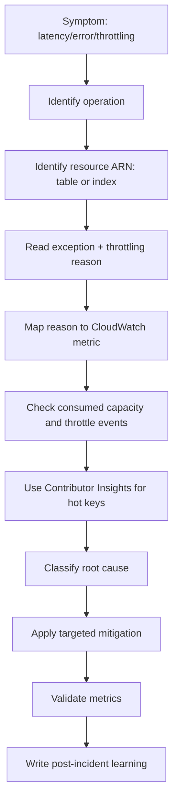
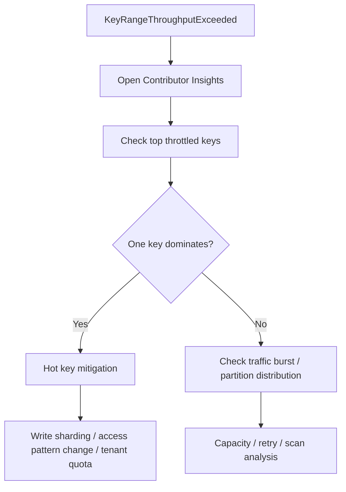
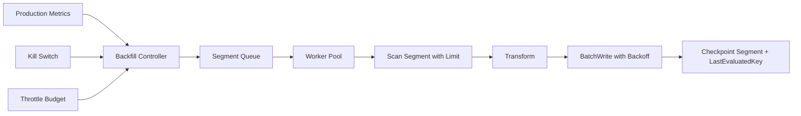

# Part 080 — DynamoDB Production Debugging

DynamoDB incident jarang muncul sebagai “database down”. Lebih sering bentuknya:

- API tiba-tiba banyak `ThrottlingException`;
- write base table gagal karena GSI write throttling;
- latency naik walau CPU database tidak ada konsepnya;
- worker backfill memakan kapasitas production;
- conditional write failure naik setelah deploy;
- stream consumer lag dan projection tertinggal;
- global table conflict atau replication lag membuat user melihat state berbeda;
- retry storm membuat biaya naik saat traffic sebenarnya tidak naik.

Part ini adalah playbook debugging production. Tujuannya bukan menghafal metric, tetapi membangun cara berpikir: **identifikasi symptom, pisahkan resource, baca reason, isolasi key, klasifikasikan failure, lalu lakukan mitigation yang sesuai**.

Referensi utama:

- Diagnosing throttling: https://docs.aws.amazon.com/amazondynamodb/latest/developerguide/throttling-diagnosing-workflow.html
- CloudWatch throttling metrics: https://docs.aws.amazon.com/amazondynamodb/latest/developerguide/TroubleshootingThrottling-cloudwatch.html
- Contributor Insights for DynamoDB: https://docs.aws.amazon.com/amazondynamodb/latest/developerguide/contributorinsights_HowItWorks.html
- Enhanced throttling observability: https://aws.amazon.com/blogs/database/enhanced-throttling-observability-in-amazon-dynamodb/
- Error handling with DynamoDB: https://docs.aws.amazon.com/amazondynamodb/latest/developerguide/Programming.Errors.html
- BatchWriteItem: https://docs.aws.amazon.com/amazondynamodb/latest/APIReference/API_BatchWriteItem.html
- Query and scan best practices: https://docs.aws.amazon.com/amazondynamodb/latest/developerguide/bp-query-scan.html
- Scan operation: https://docs.aws.amazon.com/amazondynamodb/latest/developerguide/Scan.html
- DynamoDB Streams and Lambda: https://docs.aws.amazon.com/lambda/latest/dg/with-ddb.html

---

## 1. Debugging Principle: Jangan Mulai dari Solusi

Saat DynamoDB throttling terjadi, respons natural adalah menaikkan capacity. Itu kadang benar, tetapi sering salah.

Jika penyebabnya hot partition, menaikkan table capacity bisa tidak menyelesaikan masalah. Jika penyebabnya GSI write bottleneck, menaikkan base table capacity salah target. Jika penyebabnya configured on-demand max throughput, “throttling” bisa jadi guardrail yang bekerja sesuai desain. Jika penyebabnya retry storm, menaikkan capacity hanya memperbesar kebakaran.

Urutan debugging yang benar:



Golden rule:

```txt
Do not mitigate DynamoDB throttling until you know:
- operation: read/write/query/scan/transaction/batch
- resource: table or which GSI
- cause: provisioned, key-range, max-on-demand, or account limit
- key: which partition key or access pattern
- caller: which service/job/tenant/deployment
```

---

## 2. Failure Taxonomy

| Symptom | Common root cause | First signal |
|---|---|---|
| `ThrottlingException` on on-demand table | max throughput, account limit, hot key | exception reason + CloudWatch cause metrics |
| `ProvisionedThroughputExceededException` | provisioned table/index exceeded | consumed vs provisioned metrics |
| Writes fail after adding GSI | GSI write backpressure | GSI write throttle metrics |
| Only one tenant affected | hot partition / tenant skew | Contributor Insights keys |
| All tenants affected | table/account limit, code regression, retry storm | aggregate throttling + deployment timeline |
| Conditional failures spike | concurrency, stale version, bad condition expression | app metrics + exception count |
| Transaction canceled | condition failure, conflict, idempotency mismatch | cancellation reasons |
| Stream lag grows | consumer errors, downstream slowness, hot shard | Lambda iterator age / errors |
| Backfill slows production | scan/write consumes production capacity | consumed capacity spike + job timeline |
| Cost spike without user spike | scan, retry loop, backfill, GSI projection, global replication | CUR/Cost Explorer + consumed units |

---

## 3. Read the Exception as a Structured Signal

DynamoDB errors carry more information than many teams log.

You want logs like this:

```json
{
  "event": "dynamodb_request_failed",
  "operation": "UpdateItem",
  "table": "case-command-prod",
  "index": null,
  "resourceArn": "arn:aws:dynamodb:ap-southeast-1:123456789012:table/case-command-prod",
  "exception": "ProvisionedThroughputExceededException",
  "throttlingReason": "TableWriteKeyRangeThroughputExceeded",
  "awsRequestId": "...",
  "tenantId": "tenant-42",
  "pkHashPrefix": "TENANT#42#CASE#...",
  "attempt": 2,
  "maxAttempts": 4,
  "elapsedMs": 143
}
```

Jangan log full primary key jika mengandung data sensitif. Gunakan hash, prefix aman, atau normalized route.

Minimal exception fields:

| Field | Kenapa penting |
|---|---|
| operation | Query vs UpdateItem vs BatchWrite punya mitigation berbeda |
| table/index/resourceArn | Table throttling dan GSI throttling beda solusi |
| exception type | Retryable vs non-retryable |
| throttling reason | Penyebab spesifik throttling |
| tenant/caller | Untuk isolasi blast radius |
| request id | Korelasi dengan AWS support/logs |
| retry attempt | Deteksi retry storm |
| item size estimate | Kapasitas sering naik karena item membesar |

---

## 4. Throttling Reasons: Baca Penyebab, Bukan Hanya Exception

DynamoDB throttling reason membantu membedakan kategori masalah.

Kategori penting:

| Category | Example reason | Makna |
|---|---|---|
| Provisioned capacity | `TableReadProvisionedThroughputExceeded` | Consumed read melebihi provisioned table |
| Provisioned capacity index | `IndexWriteProvisionedThroughputExceeded` | GSI write melebihi provisioned index |
| Partition/key range | `TableWriteKeyRangeThroughputExceeded` | Hot partition/key range |
| Partition/key range index | `IndexReadKeyRangeThroughputExceeded` | Hot key di GSI |
| On-demand max | `TableWriteMaxOnDemandThroughputExceeded` | Configured max throughput tercapai |
| Account limit | `TableReadAccountLimitExceeded` | Account-level quota tercapai |

Mapping mental:

```txt
ProvisionedThroughputExceeded
  -> capacity setting mungkin terlalu rendah atau autoscaling belum catch up

KeyRangeThroughputExceeded
  -> hot partition/key; bukan sekadar table capacity

MaxOnDemandThroughputExceeded
  -> guardrail on-demand aktif; mungkin expected

AccountLimitExceeded
  -> account quota atau traffic abnormal lintas table

IndexWrite...
  -> GSI adalah resource terdampak; base table mungkin hanya korban backpressure
```

---

## 5. CloudWatch Metrics: Mana yang Harus Dilihat

Jangan hanya melihat `ThrottledRequests`. Dokumentasi AWS menjelaskan bahwa `ThrottledRequests` bisa menghitung satu request sebagai satu walaupun ada beberapa event internal yang throttled, misalnya write base table plus write ke beberapa GSI. Karena itu bandingkan dengan event-level metrics.

### 5.1 Core metrics

| Metric | Arti |
|---|---|
| `ConsumedReadCapacityUnits` | Read capacity consumed |
| `ConsumedWriteCapacityUnits` | Write capacity consumed |
| `ReadThrottleEvents` | Read event throttled |
| `WriteThrottleEvents` | Write event throttled |
| `ThrottledRequests` | Request yang mengalami throttling |
| `SuccessfulRequestLatency` | Latency successful request |
| `SystemErrors` | Server-side errors |
| `UserErrors` | Client-side invalid request class |

### 5.2 Cause-specific throttling metrics

| Metric | Diagnosis |
|---|---|
| `ReadProvisionedThroughputThrottleEvents` | provisioned RCU exceeded |
| `WriteProvisionedThroughputThrottleEvents` | provisioned WCU exceeded |
| `ReadKeyRangeThroughputThrottleEvents` | partition/key range read hot |
| `WriteKeyRangeThroughputThrottleEvents` | partition/key range write hot |
| `ReadMaxOnDemandThroughputThrottleEvents` | on-demand max read guardrail hit |
| `WriteMaxOnDemandThroughputThrottleEvents` | on-demand max write guardrail hit |
| `ReadAccountLimitThrottleEvents` | account-level read limit |
| `WriteAccountLimitThrottleEvents` | account-level write limit |

Buat dashboard per table dan per GSI. GSI tidak boleh hilang dari observability.

---

## 6. Contributor Insights: Cari Key yang Membakar Partition

CloudWatch Contributor Insights for DynamoDB bisa menampilkan partition key dan sort key yang paling sering diakses atau throttled. Untuk incident throttling, gunakan mode yang fokus pada throttled keys jika tersedia di akun/Region kamu.

Use cases:

- mencari tenant hot;
- menemukan GSI key yang terlalu umum seperti `STATUS#OPEN`;
- membuktikan bahwa throttling adalah hot key, bukan table-wide capacity;
- memvalidasi hasil write sharding;
- menemukan rogue job yang membaca key tertentu berulang-ulang.

Debugging flow:



Jangan tunggu incident baru mengaktifkan observability. Untuk table production yang berisiko skew, Contributor Insights adalah bagian dari readiness.

---

## 7. Runbook: Throttling Incident

### 7.1 Triage dalam 5 menit pertama

1. Identify impacted service/API/job.
2. Identify table/index/resourceArn.
3. Check exception reason.
4. Check deployment/job timeline.
5. Check CloudWatch throttling metrics.
6. Check if issue is table-wide, index-specific, tenant-specific, or operation-specific.
7. Disable or throttle non-critical jobs.
8. Increase capacity only if reason supports it.
9. Communicate customer impact with exact scope.

### 7.2 Decision matrix

| Reason | Immediate mitigation | Long-term fix |
|---|---|---|
| `ProvisionedThroughputExceeded` table-wide | increase provisioned/max, reduce callers, queue traffic | capacity model + autoscaling tuning |
| `KeyRangeThroughputExceeded` | throttle hot caller, tenant quota, disable job | redesign partition key/write sharding |
| `IndexWriteProvisionedThroughputExceeded` | increase GSI WCU, pause write-heavy job | reduce projection, redesign GSI, sparse index |
| `MaxOnDemandThroughputExceeded` | decide: raise max or keep guardrail | better max setting + caller budget |
| `AccountLimitExceeded` | reduce traffic, request quota increase | account quota planning, shard accounts if needed |
| Retry storm | lower SDK max attempts, add jitter, queue requests | retry budget + circuit breaker |
| Backfill interference | pause/slow backfill | separate lane + budgeted scanner |

### 7.3 Verification

Incident belum selesai sampai:

- throttling metrics turun;
- client error rate normal;
- latency normal;
- backlog/stream lag tidak terus naik;
- cost spike berhenti;
- failed writes/retries sudah direkonsiliasi;
- post-incident action item dibuat.

---

## 8. Hot Partition Debugging

Hot partition terjadi ketika traffic tidak tersebar merata.

### 8.1 Symptoms

- table-level consumed capacity masih di bawah quota, tetapi throttling tetap terjadi;
- throttling reason mengandung `KeyRangeThroughputExceeded`;
- satu tenant/officer/status/date mendominasi Contributor Insights;
- latency/error hanya pada access pattern tertentu;
- retry tidak membantu banyak.

### 8.2 Common causes

| Bad key | Masalah |
|---|---|
| `PK = STATUS#OPEN` | semua open item masuk satu partition key |
| `PK = DATE#2026-07-07` | semua write hari ini ke satu key |
| `PK = TENANT#largeTenant` | tenant besar jadi hot |
| `GSI1PK = ASSIGNEE#u-123` | officer besar/hot menjadi bottleneck |
| `PK = COUNTER#GLOBAL` | single item write bottleneck |

### 8.3 Mitigation patterns

#### Write sharding

```txt
PK = TENANT#42#STATUS#OPEN#SHARD#00
PK = TENANT#42#STATUS#OPEN#SHARD#01
...
```

Read harus query beberapa shard dan merge. Ini menukar write scalability dengan read complexity.

#### Finer-grained key

```txt
Bad:
GSI1PK = STATUS#OPEN

Better:
GSI1PK = TENANT#42#OFFICER#u-123#STATUS#OPEN
```

#### Tenant-specific isolation

Untuk tenant enterprise yang sangat besar:

- table per high-volume tenant;
- write shard per tenant;
- quota per tenant;
- dedicated workflow lane;
- dedicated GSI prefix strategy.

#### Counter sharding

```txt
PK = COUNTER#OPEN_CASES#TENANT#42#SHARD#07
```

Lalu agregasi:

- read-time sum jika shard sedikit;
- async materialized aggregate jika UI sering membaca;
- approximate counter jika exact count tidak wajib.

---

## 9. GSI Backpressure Debugging

GSI throttling bisa membuat base table write bermasalah. Ini sering membingungkan karena engineer melihat error pada `UpdateItem` ke table, padahal resource yang sakit adalah index.

### 9.1 Symptoms

- write ke base table gagal/throttled;
- reason menyebut `IndexWrite...`;
- GSI consumed write mendekati limit;
- base table capacity masih cukup;
- issue muncul setelah menambah GSI atau attribute projection.

### 9.2 Diagnosis checklist

- GSI mana yang disebut pada `resourceArn`?
- Apakah GSI provisioned capacity lebih rendah dari base table write rate?
- Apakah GSI partition key hot?
- Apakah projection terlalu besar?
- Apakah update sering mengubah GSI key sehingga delete+put index entry terjadi?
- Apakah backfill GSI sedang berlangsung?
- Apakah sparse index berubah menjadi dense karena attribute baru selalu diisi?

### 9.3 Mitigation

Immediate:

- naikkan GSI capacity jika provisioned;
- kurangi write-heavy job;
- pause backfill;
- throttle caller;
- rollback deployment yang membuat index jadi dense.

Long-term:

- desain GSI key ulang;
- kecilkan projection;
- buat sparse index benar-benar sparse;
- pisahkan workload ke materialized table;
- gunakan event-driven projection ke table lain jika query path tidak cocok sebagai GSI.

---

## 10. ConditionalCheckFailedException: Bug atau Correctness Signal?

`ConditionalCheckFailedException` sering dianggap error. Dalam desain yang benar, ini bisa menjadi signal business/concurrency yang expected.

Contoh expected:

- optimistic lock version mismatch;
- duplicate idempotency key;
- state transition invalid;
- uniqueness sentinel sudah ada;
- lease sudah diambil worker lain;
- command sudah selesai.

Contoh bug:

- condition expression salah;
- update expression tidak menaikkan version;
- stale read path terlalu agresif;
- idempotency hash tidak konsisten;
- client retry membuat command berbeda memakai key sama;
- global table conflict policy tidak dipahami.

### 10.1 Jangan retry semua conditional failure

Conditional failure biasanya bukan transient infrastructure failure. Retry buta hanya menaikkan load.

Decision:

| Conditional failure type | Retry? | Response |
|---|---|---|
| Optimistic lock conflict | maybe, after reread/recompute | 409 Conflict atau app-level retry |
| Duplicate idempotency completed | no | return cached result |
| Duplicate in progress | maybe after delay | 202/409 depending contract |
| Invalid state transition | no | 409/422 |
| Lease lost | no or schedule later | worker skip |
| Uniqueness conflict | no | 409 |

### 10.2 Debugging conditional failure

Log:

```json
{
  "event": "ddb_conditional_failed",
  "operation": "UpdateItem",
  "condition": "version = :expected AND status = :from",
  "entityType": "Case",
  "tenantId": "tenant-42",
  "expectedVersion": 18,
  "commandId": "cmd-abc",
  "stateTransition": "UNDER_REVIEW -> APPROVED",
  "caller": "case-command-service"
}
```

Gunakan `ReturnValuesOnConditionCheckFailure` untuk single write operation ketika kamu perlu melihat item lama pada failure dan mengurangi read tambahan untuk debugging/retry logic.

---

## 11. TransactionCanceledException Debugging

DynamoDB transactions bisa gagal karena:

- condition check failed;
- transaction conflict;
- item size/transaction limit;
- provisioned throughput;
- validation error;
- duplicate operation pada item yang sama dalam transaction;
- idempotency token mismatch.

Pattern observability:

```json
{
  "event": "ddb_transaction_cancelled",
  "transactionName": "close_case",
  "entities": ["CASE", "OUTBOX", "IDEMPOTENCY"],
  "cancellationReasons": [
    {"op": "ConditionCheck", "code": "ConditionalCheckFailed"},
    {"op": "Put", "code": "None"},
    {"op": "Update", "code": "None"}
  ]
}
```

Jangan treat semua transaction cancellation sebagai 500. Banyak yang harus menjadi 409 Conflict atau duplicate-safe response.

---

## 12. Retry and Backoff Debugging

Retry adalah obat dan racun.

Retry membantu:

- transient throttling;
- internal server error;
- network ambiguity;
- batch unprocessed items;
- OCC conflict jika operation bisa direcompute.

Retry merusak:

- hot partition;
- invalid condition;
- validation error;
- rogue loop;
- overloaded downstream;
- global conflict tanpa conflict policy.

### 12.1 Retry budget

Setiap operation harus punya retry budget:

```txt
operation = UpdateCaseStatus
maxAttempts = 3
baseDelay = 25ms
maxDelay = 500ms
jitter = full
overallTimeout = 1.5s
idempotencyKey = required
retryable = throttling, 5xx, transaction conflict after reread
notRetryable = validation, uniqueness conflict, invalid transition
```

### 12.2 BatchWriteItem dan UnprocessedItems

`BatchWriteItem` bisa mengembalikan `UnprocessedItems`. Itu bukan sukses penuh. Kamu harus retry item yang belum diproses dengan exponential backoff. Retry langsung tanpa delay bisa tetap gagal karena throttling yang sama.

Pseudo-code:

```java
Map<String, List<WriteRequest>> remaining = initialBatch;
int attempt = 0;

while (!remaining.isEmpty() && attempt < maxAttempts) {
    BatchWriteItemResponse response = dynamo.batchWriteItem(req(remaining));
    remaining = response.unprocessedItems();

    if (!remaining.isEmpty()) {
        sleep(jitteredBackoff(attempt));
    }

    attempt++;
}

if (!remaining.isEmpty()) {
    publishToDlqOrCheckpoint(remaining);
}
```

For production backfill, never infinite-loop `UnprocessedItems`.

---

## 13. Scan and Backfill Debugging

`Scan` reads every item in a table or index. It is acceptable for controlled offline jobs. It is usually unacceptable in request path.

### 13.1 Symptoms of harmful scan

- consumed read capacity spike;
- `Scan` operation appears in logs/traces;
- latency rises for unrelated user traffic;
- throttling occurs during scheduled job;
- Cost Explorer shows read unit spike;
- table has parallel scan with too many workers.

### 13.2 Important scan facts

- ProjectionExpression reduces returned attributes, not necessarily capacity consumed.
- FilterExpression does not save capacity the way an index does.
- Strongly consistent scan consumes more read capacity than default eventually consistent scan.
- Parallel scan can consume throughput quickly and starve production traffic.
- `Limit` can help bound per-request impact, but does not turn scan into indexed query.

### 13.3 Safe backfill lane



Backfill rules:

- run outside peak hours if possible;
- use explicit concurrency limit;
- use `Limit`;
- checkpoint after each page;
- monitor production throttling;
- stop on error budget burn;
- separate shadow table if needed;
- do not trigger external side effects accidentally;
- make write idempotent;
- emit progress metrics.

---

## 14. Stream Lag and Projection Debugging

DynamoDB Streams adalah change log, bukan magic bus. Projection consumer bisa lag, fail, duplicate, atau poison.

### 14.1 Symptoms

- UI read model stale;
- OpenSearch index missing updates;
- cache stale after write;
- Lambda iterator age grows;
- DLQ receives stream events;
- batch repeatedly fails on same record;
- retry of stream consumer duplicates external side effect.

### 14.2 Diagnosis

Check:

- Lambda iterator age;
- Lambda errors/throttles/concurrency;
- batch size and bisect/partial failure config;
- downstream dependency latency;
- poison record content;
- stream view type;
- idempotency of projection write;
- whether event is TTL service delete;
- whether global table replication creates events in multiple Regions.

### 14.3 Mitigation

Immediate:

- increase consumer concurrency carefully;
- fix/downscale downstream dependency;
- send poison record to DLQ after bounded attempts;
- pause non-critical projection;
- replay from checkpoint if within stream retention.

Long-term:

- projection idempotency table;
- deterministic projection key;
- per-record failure handling;
- reindex/rebuild lane;
- separate critical and non-critical consumers;
- DLQ replay tooling;
- explicit outbox for domain events.

---

## 15. Debugging Latency Without CPU Metrics

DynamoDB is managed. You do not debug it with database CPU, buffer cache, or lock wait metrics like RDS.

You debug latency through:

- client-side timing;
- SDK retries;
- service latency metrics;
- throttling events;
- item size;
- network path;
- operation type;
- request fanout;
- hot partition;
- batch size;
- consistency mode;
- transaction complexity.

Latency questions:

| Question | Why it matters |
|---|---|
| Is latency before or after retry? | SDK retry can hide first-attempt failures |
| Is p99 high only for one operation? | Access pattern-specific issue |
| Is item size growing? | Larger items consume more units and latency |
| Is request querying too many items? | Query page too wide |
| Is GSI eventually consistent causing rereads? | App may perform extra reads |
| Is client connection path stable? | NAT/VPC endpoint/DNS issues can dominate |
| Is Lambda cold start involved? | Not DynamoDB latency |
| Is transaction touching many items? | More failure/conflict surface |

Log two timings:

```txt
client_total_ms = time including retries, marshalling, network, SDK
aws_attempt_ms = time for each SDK attempt if available
```

If only `client_total_ms` is logged, retry storms look like “DynamoDB slow” instead of “DynamoDB throttled and SDK retried”.

---

## 16. Debugging Cost Spikes

Cost spike is a production incident if it threatens budget, downstream capacity, or customer isolation.

### 16.1 First questions

- Which table/index/Region/tag drove cost?
- Did read units, write units, storage, stream, backup, or global replication increase?
- Did a deploy happen?
- Did a backfill/replay/import happen?
- Did retries increase?
- Did item size grow?
- Did a sparse GSI become dense?
- Did a table class change?
- Did global tables add Region replication?
- Did TTL cleanup create replicated deletes?

### 16.2 Cost spike patterns

| Pattern | Signal | Fix |
|---|---|---|
| Rogue scan | read units spike, Scan operation logs | remove request-path scan, create GSI/projection |
| Retry storm | attempts/request spike | retry budget, circuit breaker, fix root throttling |
| Backfill too fast | job timeline aligns | throttle/pause/checkpoint |
| GSI projection bloat | storage/write units rise after deploy | reduce projection, split projection table |
| Global table multiplier | replicated write units rise | review Region count/write locality |
| TTL wave | delete stream/replicated units | stagger expiry, review TTL pattern |
| Hot tenant | one tenant dominates | tenant quota/isolation/sharding |

---

## 17. Incident Playbooks

### 17.1 Playbook: Table-wide provisioned throttling

Symptoms:

- reason: `TableReadProvisionedThroughputExceeded` or `TableWriteProvisionedThroughputExceeded`;
- consumed capacity at or near provisioned;
- multiple tenants/callers affected.

Actions:

1. Confirm table or GSI resource.
2. Increase provisioned capacity or max auto scaling limit if safe.
3. Reduce non-critical callers/jobs.
4. Ensure clients use backoff with jitter.
5. Watch latency, error rate, consumed units.
6. After incident, tune target utilization and traffic forecast.

### 17.2 Playbook: Hot partition

Symptoms:

- reason: `KeyRangeThroughputExceeded`;
- table consumed capacity may be below total limit;
- Contributor Insights shows top key.

Actions:

1. Identify hot key and caller.
2. Apply tenant/caller throttle.
3. Stop backfill or rogue job if involved.
4. If key is business-hot, design write sharding or finer key.
5. If counter, shard counter.
6. If GSI status key hot, redesign index key.
7. Validate with Contributor Insights after rollout.

### 17.3 Playbook: GSI write backpressure

Symptoms:

- reason references `IndexWrite...`;
- base table write path fails;
- GSI consumed write high or throttled.

Actions:

1. Identify GSI and projection.
2. Increase GSI write capacity or on-demand max if appropriate.
3. Pause writer/backfill.
4. Check whether sparse index became dense.
5. Check update pattern: are GSI keys changing frequently?
6. Redesign projection/key if persistent.

### 17.4 Playbook: Conditional failures after deploy

Symptoms:

- `ConditionalCheckFailedException` spike;
- user sees conflicts or failed updates;
- no throttling spike.

Actions:

1. Compare deploy timestamp.
2. Inspect condition expression change.
3. Check version increment logic.
4. Check stale read path.
5. Check idempotency key/request hash changes.
6. Roll back if condition contract changed incorrectly.
7. Convert expected conflicts to proper 409 response.

### 17.5 Playbook: Stream projection lag

Symptoms:

- projection stale;
- Lambda iterator age grows;
- stream DLQ messages;
- downstream write throttling.

Actions:

1. Identify consumer and shard/partition pattern.
2. Check Lambda errors/throttles/concurrency.
3. Check downstream dependency health.
4. Isolate poison record.
5. Enable/adjust partial batch handling if supported.
6. Increase consumer capacity only if downstream can handle it.
7. Rebuild projection if stream retention window is exceeded.

### 17.6 Playbook: Backfill hurting production

Symptoms:

- user latency/throttling starts during job;
- consumed capacity rises;
- scan/batch write logs spike.

Actions:

1. Pause backfill.
2. Confirm production health returns.
3. Lower concurrency and page limit.
4. Reserve budget for production first.
5. Add kill switch based on throttling metric.
6. Resume from checkpoint.
7. Postmortem why job lacked guardrail.

---

## 18. Observability Contract for Every DynamoDB Caller

Every service calling DynamoDB should emit:

```txt
metric: dynamodb.operation.count{operation, table, index, outcome}
metric: dynamodb.operation.latency{operation, table, index}
metric: dynamodb.operation.attempts{operation, table, index}
metric: dynamodb.throttle.count{operation, table, index, reason}
metric: dynamodb.conditional_failed.count{operation, table, condition_class}
metric: dynamodb.transaction_cancelled.count{transaction_name, reason_class}
metric: dynamodb.unprocessed_items.count{batch_name, table}
metric: dynamodb.item_size.estimated{entity_type}
```

Structured log fields:

```txt
operation
table
index
resourceArn
requestId
exception
throttlingReason
tenantId/callerId safe identifier
attempt
elapsedMs
itemSizeBucket
accessPatternName
commandId/correlationId
```

This lets you answer the production question that matters:

> “Which access pattern, owned by which caller, against which table/index, is consuming or failing capacity, and what invariant is at risk?”

---

## 19. Testing DynamoDB Failure Modes

Do not wait for production to learn failure behavior.

### 19.1 Test matrix

| Test | Expected behavior |
|---|---|
| duplicate command | same result, no duplicate side effect |
| stale version update | 409 Conflict, no blind overwrite |
| hot key load | throttling detected, caller backoff, no retry storm |
| GSI throttling | alarms trigger, write path behavior understood |
| batch unprocessed items | retry with backoff, checkpoint remaining |
| stream poison record | bounded retry, DLQ, no shard starvation forever |
| backfill pause/resume | no duplicate writes, checkpoint works |
| projection rebuild | idempotent and isolated from live projection |
| TTL expired pending delete | app filters/handles expired state correctly |
| global table concurrent write | conflict semantics understood |

### 19.2 Load test dimensions

Do not load test only average traffic. Test:

- tenant skew;
- officer skew;
- status hotness;
- item size growth;
- GSI dense vs sparse;
- backfill plus live traffic;
- retry under throttling;
- stream consumer lag;
- global table Region failover;
- conditional conflict rate.

---

## 20. Production Debugging Example: Hot “OPEN” Queue

### Symptom

Case officer inbox latency rises. DynamoDB shows throttling. Table is on-demand. Team initially wants to request quota increase.

### Evidence

Exception:

```txt
ThrottlingException
reason = IndexReadKeyRangeThroughputExceeded
resourceArn = .../table/case-table/index/GSI1
```

Contributor Insights:

```txt
GSI1PK = STATUS#OPEN
```

### Diagnosis

This is not account quota. This is not table-wide capacity. This is a hot GSI partition caused by bad key design.

Bad model:

```txt
GSI1PK = STATUS#OPEN
GSI1SK = DUE#<date>#CASE#<id>
```

Every “open cases” read hits the same partition key.

### Fix

Redesign access pattern:

```txt
GSI1PK = TENANT#<tenantId>#OFFICER#<officerId>#STATUS#OPEN
GSI1SK = DUE#<date>#PRIORITY#<priority>#CASE#<id>
```

For tenant/officer with extreme traffic, add shard:

```txt
GSI1PK = TENANT#42#OFFICER#u-123#STATUS#OPEN#SHARD#03
```

### Migration

1. Add new GSI attributes to new writes.
2. Backfill old items with throttled segmented worker.
3. Dual-read or shadow compare.
4. Move read traffic gradually.
5. Remove old GSI after retention/migration window.

---

## 21. Production Debugging Example: Conditional Failure Storm

### Symptom

After release, `CloseCase` API returns many 500s. DynamoDB metrics show no throttling. Logs show `ConditionalCheckFailedException`.

### Evidence

Condition before deploy:

```txt
version = :expectedVersion AND status IN (:reviewed, :approved)
```

Condition after deploy:

```txt
version = :expectedVersion AND status = :approved
```

Many valid transitions from `REVIEWED` now fail.

### Diagnosis

This is not DynamoDB outage. This is a business invariant regression. The application mapped expected condition failures to 500 instead of 409/422.

### Fix

- Restore valid transition condition.
- Add state-transition contract tests.
- Map conditional failures to domain errors.
- Emit `condition_class` metric.
- Add dashboard for conditional failure rate per command.

---

## 22. What Good Looks Like

A mature DynamoDB production system has these properties:

- Every table and GSI has an owner.
- Every access pattern has a name and dashboard label.
- Every throttling exception logs reason and resource ARN.
- Contributor Insights can identify hot keys quickly.
- Backfills are controlled by budget, checkpoint, and kill switch.
- Conditional failures are classified, not treated as generic 500.
- Batch unprocessed items are retried with bounded backoff.
- Stream consumers are idempotent and have DLQ/replay procedure.
- Cost spikes can be traced to table/index/operation/tenant/job.
- Runbooks distinguish provisioned, key-range, on-demand max, account limit, and GSI throttling.

---

## 23. Ringkasan

- DynamoDB debugging harus dimulai dari operation, resource ARN, exception type, throttling reason, dan key distribution.
- `ThrottledRequests` saja tidak cukup; gunakan cause-specific metrics dan per-index metrics.
- `KeyRangeThroughputExceeded` berarti masalah hot key/partition; jangan otomatis menaikkan table capacity.
- GSI throttling adalah failure domain sendiri dan bisa memberi backpressure ke base table writes.
- Conditional failures sering merupakan correctness signal, bukan infrastructure error.
- Retry harus bounded, classified, dan memakai jitter; retry buta bisa memperburuk incident.
- Scan/backfill harus punya throttle, checkpoint, pause/resume, dan kill switch.
- Stream lag harus ditangani dengan idempotency, DLQ, partial failure handling, dan rebuild strategy.
- Cost spike debugging membutuhkan korelasi operation, table/index, tenant, job, retry, item size, GSI, TTL, dan global replication.

**Module 10 selesai.** Berikutnya kita masuk cache, session, dan low-latency data dengan ElastiCache/MemoryDB.
