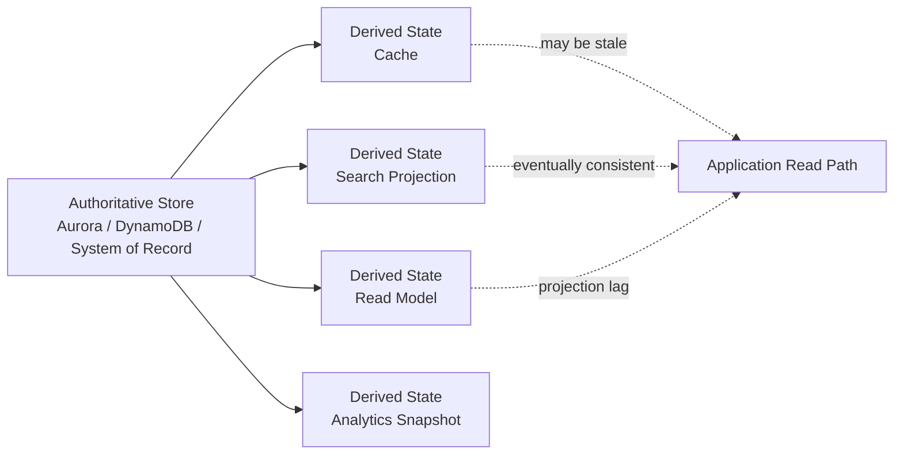
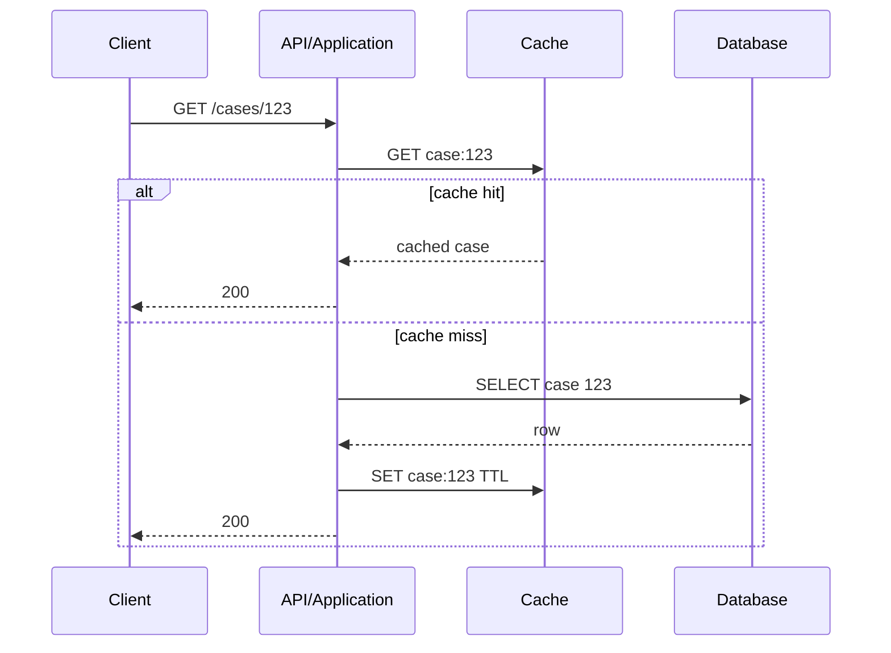
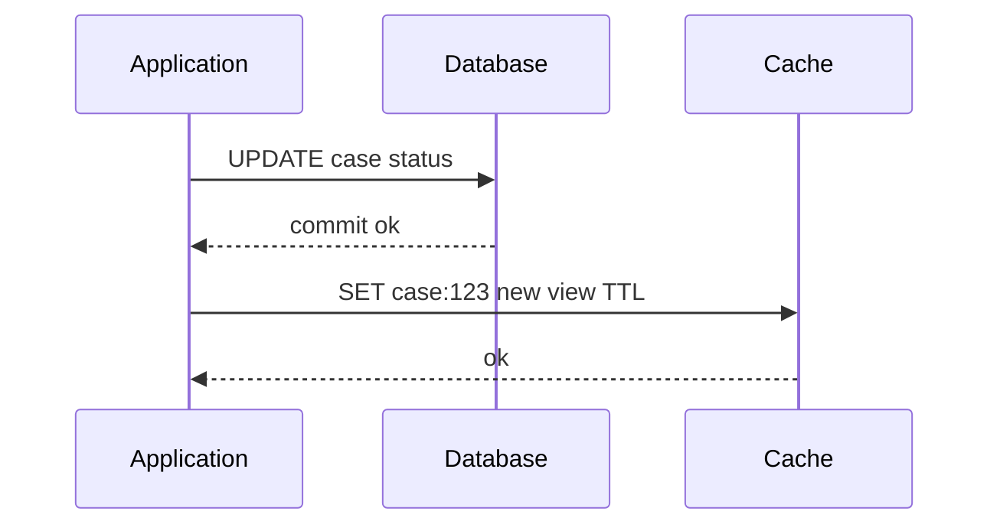
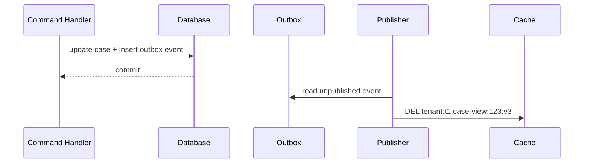
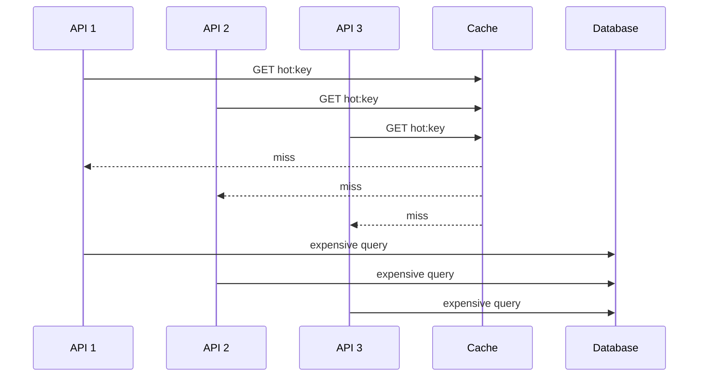
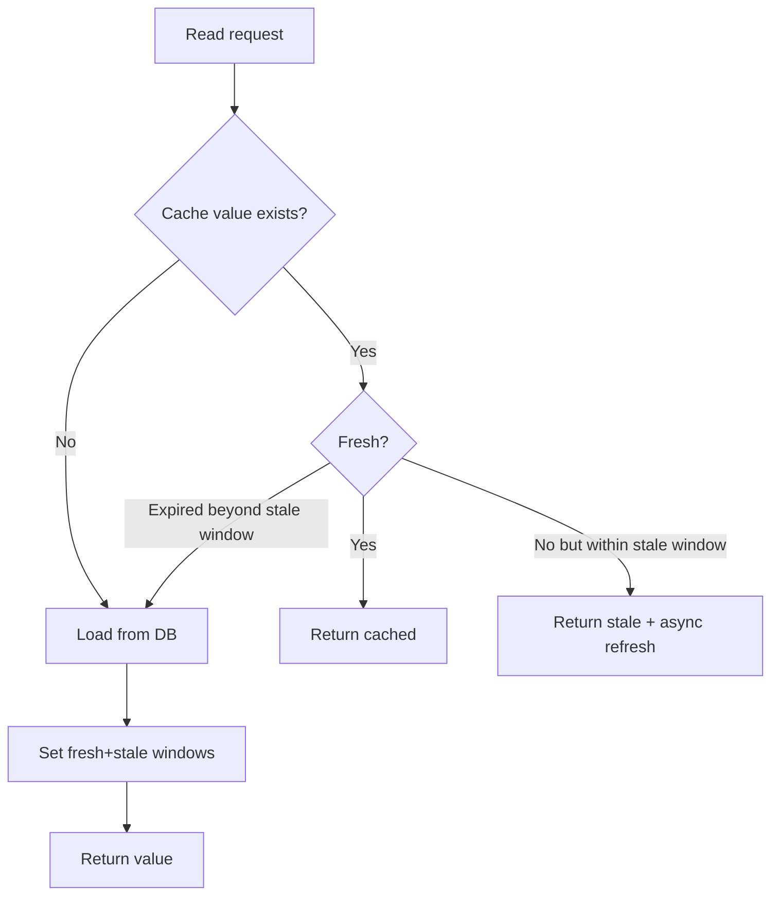
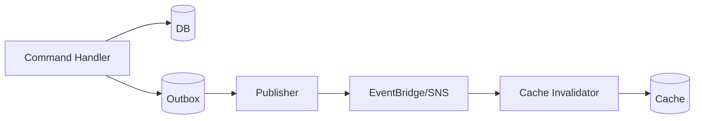
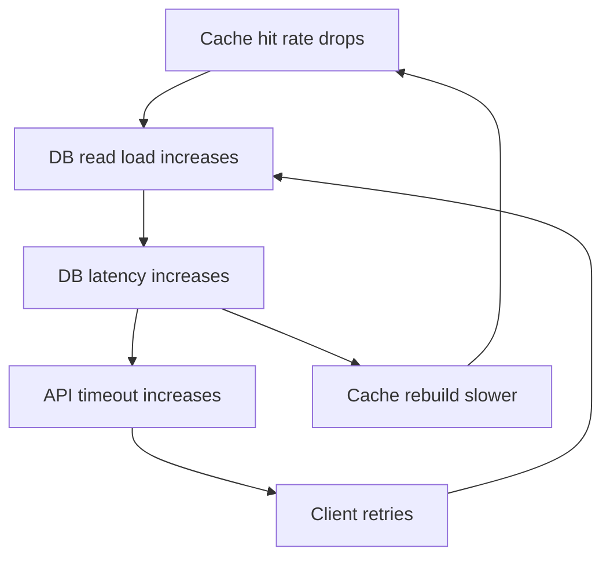
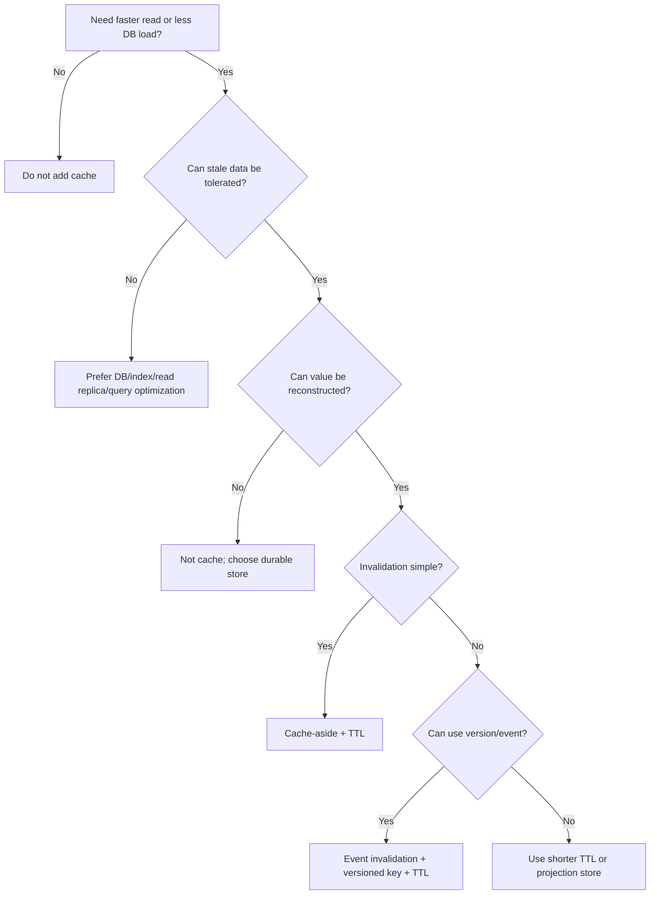

# Part 081 — Cache Mental Model

Cache sering terlihat sederhana: simpan data di memory supaya query lebih cepat. Di production, definisi itu terlalu dangkal.

Cache adalah **derived state** yang sengaja dibuat tidak sepenuhnya authoritative demi latency, throughput, dan availability. Begitu cache masuk sistem, kita menambah satu lapisan state baru yang bisa stale, hilang, overload, salah key, salah TTL, salah invalidation, salah serialization, bocor antar tenant, atau membuat database hancur ketika cache kosong.

Jadi mental model yang benar bukan:

```txt
Cache = faster database
```

Mental model yang benar:

```txt
Cache = derived, lossy, bounded, consistency-relaxed state used to protect latency and reduce load
```

Part ini membangun fondasi sebelum masuk ElastiCache, Redis/Valkey, MemoryDB, session state, rate limiting, distributed locking, dan cache operability.

Referensi utama:

- Amazon ElastiCache best practices: https://docs.aws.amazon.com/AmazonElastiCache/latest/dg/BestPractices.html
- What is Amazon ElastiCache: https://docs.aws.amazon.com/AmazonElastiCache/latest/dg/WhatIs.html
- Database caching strategies using Redis — caching patterns: https://docs.aws.amazon.com/whitepapers/latest/database-caching-strategies-using-redis/caching-patterns.html
- Database caching strategies using Redis — cache validity: https://docs.aws.amazon.com/whitepapers/latest/database-caching-strategies-using-redis/cache-validity.html
- ElastiCache Well-Architected Lens: https://docs.aws.amazon.com/AmazonElastiCache/latest/dg/WellArchitechtedLens.html
- ElastiCache use cases: https://docs.aws.amazon.com/AmazonElastiCache/latest/dg/elasticache-use-cases.html

---

## 1. Problem yang Diselesaikan Cache

Cache dipakai saat primary data store tidak cocok melayani semua request secara langsung.

Contoh symptom:

- endpoint detail case regulatory sering membaca row yang sama ratusan kali per detik;
- permission matrix kompleks dihitung dari banyak tabel dan jarang berubah;
- search/autocomplete butuh lookup sub-millisecond;
- dashboard membaca aggregate berulang;
- workflow worker sering membaca reference data yang sama;
- API perlu degrade gracefully ketika database sedang lambat;
- read replica masih terlalu lambat atau terlalu mahal untuk hot path tertentu.

Cache menyelesaikan beberapa problem berbeda:

| Problem | Cache membantu dengan | Risiko baru |
|---|---|---|
| Latency tinggi | data hot ada di memory | stale read |
| Database overload | read offload | stampede saat miss |
| Expensive computation | memoization | wrong invalidation |
| Repeated authorization lookup | cached decision/read model | policy drift |
| Session lookup | low-latency state | session loss/replication lag |
| Rate limit | atomic counter | false allow/false deny |
| Feature/config lookup | cached config | slow propagation |

Cache bukan solusi universal. Jika query lambat karena schema buruk, index salah, atau access pattern tidak jelas, cache sering hanya menunda masalah.

Prinsip:

```txt
Cache after you understand the source workload.
Not before.
```

---

## 2. Cache sebagai Derived State

Dalam sistem yang defensible, setiap state harus punya status ownership.



Cache harus menjawab pertanyaan berikut:

1. **Source of truth-nya apa?**
2. **Siapa yang boleh menulis cache?**
3. **Apa cache boleh kosong?**
4. **Apa cache boleh stale? Berapa lama?**
5. **Bagaimana cache dihapus atau diperbarui?**
6. **Apa yang terjadi saat cache unavailable?**
7. **Apakah data cache mengandung PII/secrets/tenant-sensitive state?**
8. **Bagaimana membuktikan cache tidak melanggar invariant bisnis?**

Jika cache tidak bisa dijelaskan sebagai derived state, kemungkinan ia diam-diam berubah menjadi database kedua.

Itu berbahaya.

---

## 3. Golden Rule: Cache Bukan Tempat Menyimpan Kebenaran

Cache boleh menyimpan state, tetapi tidak semua state boleh menjadi cache.

| State | Boleh cache? | Catatan |
|---|---:|---|
| product/category reference | Ya | TTL + invalidation cukup |
| user profile display data | Ya | pastikan tenant/security boundary |
| authorization decision | Ya, hati-hati | TTL pendek + policy version |
| payment status final | Bisa, read-only | source of truth tetap ledger/payment DB |
| legal enforcement case status | Bisa untuk read model | mutation tetap di authoritative store |
| audit event | Jangan hanya cache | harus durable |
| idempotency record | Jangan cache-only | butuh durable store |
| transaction lock | Hati-hati | cache lock bukan pengganti DB constraint |
| queue/job state | Hati-hati | gunakan SQS/Step Functions/DynamoDB sesuai semantics |

Kalimat yang harus dicurigai:

```txt
“Kalau Redis hilang, kita bisa kehilangan sedikit data saja.”
```

Tanyakan:

- data apa?
- siapa yang terdampak?
- apakah bisa direkonstruksi?
- dari source mana?
- berapa lama recovery?
- apakah ada audit trail?
- apakah kehilangan itu acceptable secara bisnis/regulasi?

Jika jawabannya kabur, itu bukan cache. Itu database yang dioperasikan dengan disiplin cache.

---

## 4. Cache Design Dimensions

Cache design harus diputuskan dari beberapa dimensi.

```txt
Cache decision = workload + correctness + invalidation + failure behavior + cost
```

### 4.1 Read policy

| Policy | Cara kerja | Cocok untuk |
|---|---|---|
| Cache-aside | app cek cache, jika miss baca DB, lalu populate cache | umum, simple, read-heavy |
| Read-through | cache layer bertanggung jawab load dari source | framework/cache provider tertentu |
| Refresh-ahead | cache diperbarui sebelum expire | hot keys predictable |
| Stale-while-revalidate | return stale sementara refresh async | latency-sensitive read path |

### 4.2 Write policy

| Policy | Cara kerja | Risiko |
|---|---|---|
| Invalidate-on-write | setelah DB write, hapus cache | cache miss setelah write |
| Update-on-write | setelah DB write, update cache | double-write inconsistency |
| Write-through | DB dan cache diperbarui bersama di application path | write latency naik |
| Write-behind | cache menerima write, DB update async | data loss/correctness risk |

Untuk application/database systems, default aman biasanya:

```txt
Authoritative write -> commit DB -> publish event/outbox -> invalidate or rebuild cache
```

Bukan:

```txt
Write cache first -> hope DB catches up
```

---

## 5. Cache-Aside Pattern

Cache-aside adalah pola paling umum.



Kelebihan:

- simple;
- cache hanya berisi data yang benar-benar dibaca;
- cocok untuk gradual adoption;
- failure cache bisa degrade ke DB jika database masih kuat.

Kelemahan:

- miss pertama lebih lambat;
- cache stampede bisa terjadi;
- data stale sampai TTL/invalidation;
- duplicate miss dari banyak request bisa memukul DB bersamaan.

Pseudo-code:

```java
public CaseView getCase(String tenantId, String caseId) {
    String key = "tenant:" + tenantId + ":case-view:" + caseId + ":v3";

    Optional<CaseView> cached = cache.getJson(key, CaseView.class);
    if (cached.isPresent()) {
        metrics.increment("case.cache.hit");
        return cached.get();
    }

    metrics.increment("case.cache.miss");

    CaseView loaded = caseRepository.loadCaseView(tenantId, caseId);

    Duration ttl = ttlWithJitter(Duration.ofMinutes(5), Duration.ofSeconds(45));
    cache.setJson(key, loaded, ttl);

    return loaded;
}
```

Yang penting bukan syntax-nya. Yang penting invariant-nya:

```txt
Cache miss must not change authoritative state.
Cache populate must be safe to repeat.
Cache value must be reconstructable from source of truth.
```

---

## 6. Write-Through Pattern

Write-through memperbarui cache setelah primary database update.



Kelebihan:

- hit rate lebih tinggi setelah write;
- read-after-write lebih mudah untuk key yang sama;
- cocok untuk state yang sering dibaca tepat setelah update.

Risiko:

- update DB sukses, update cache gagal;
- update cache sukses dengan representation yang ternyata berbeda dari canonical DB view;
- cache berisi data yang jarang dibaca;
- write path makin lambat.

Write-through aman hanya jika failure behavior eksplisit:

```txt
If DB commit succeeds and cache update fails:
  - request tetap sukses?
  - cache dihapus?
  - outbox event diterbitkan?
  - background repair ada?
```

Default yang sering lebih robust:

```txt
DB commit -> delete cache key -> next read rebuilds
```

Atau:

```txt
DB commit + outbox event -> async projection/cache updater
```

---

## 7. Invalidate-on-Write Pattern

Invalidate-on-write sering lebih aman daripada update-on-write.



Kenapa delete sering lebih aman daripada set?

Karena cache representation bisa berasal dari join, aggregate, authorization projection, atau calculated field. Command handler belum tentu punya semua data untuk membangun representation yang benar.

Invalidation harus diperlakukan sebagai **best-effort optimization**, bukan satu-satunya correctness mechanism. TTL tetap diperlukan sebagai safety net.

Rule:

```txt
Invalidation narrows staleness window.
TTL bounds stale data when invalidation fails.
```

---

## 8. TTL: Expiration sebagai Safety Boundary

TTL bukan angka random. TTL adalah keputusan consistency.

| Data | TTL yang masuk akal | Alasan |
|---|---:|---|
| static reference code | jam/hari | jarang berubah |
| dashboard summary | detik/menit | freshness penting tapi tidak transactional |
| case detail read model | detik/menit | tergantung SLA staleness |
| authorization decision | sangat pendek | policy/security sensitive |
| feature flag | pendek + push invalidation | propagation harus cepat |
| negative cache untuk not found | sangat pendek | mencegah ghost not-found lama |

TTL terlalu panjang membuat data stale. TTL terlalu pendek membuat cache tidak efektif dan bisa memicu stampede.

Gunakan TTL jitter:

```java
Duration ttlWithJitter(Duration base, Duration maxJitter) {
    long jitterMillis = ThreadLocalRandom.current().nextLong(maxJitter.toMillis() + 1);
    return base.plusMillis(jitterMillis);
}
```

Jitter mencegah banyak key expire bersamaan.

Tanpa jitter:

```txt
12:00 semua key dashboard expire
12:00 semua user refresh dashboard
12:00 database menerima ribuan query berat bersamaan
```

Dengan jitter:

```txt
key expire tersebar antara 12:00-12:01
load menyebar
DB lebih stabil
```

---

## 9. Cache Stampede

Cache stampede terjadi ketika banyak caller melihat miss untuk key yang sama lalu semuanya menghantam database.



Mitigation:

1. TTL jitter.
2. Request coalescing/single-flight per instance.
3. Distributed soft lock untuk rebuild, dengan TTL pendek.
4. Stale-while-revalidate.
5. Pre-warm hot keys.
6. Rate-limit cache rebuild.
7. Protect DB dengan timeout dan concurrency cap.

Single-flight lokal:

```java
private final ConcurrentHashMap<String, CompletableFuture<CaseView>> inFlight = new ConcurrentHashMap<>();

public CaseView getCaseWithSingleFlight(String key) {
    CaseView cached = cache.get(key);
    if (cached != null) return cached;

    CompletableFuture<CaseView> future = inFlight.computeIfAbsent(key, ignored ->
        CompletableFuture.supplyAsync(() -> {
            try {
                CaseView loaded = repository.load(key);
                cache.set(key, loaded, ttlWithJitter(Duration.ofMinutes(5), Duration.ofSeconds(30)));
                return loaded;
            } finally {
                inFlight.remove(key);
            }
        })
    );

    return future.join();
}
```

Distributed rebuild lock:

```txt
SET rebuild:case:123 requestId NX EX 10
```

Tetapi lock ini bukan correctness lock. Ini hanya stampede control.

---

## 10. Stale-While-Revalidate

Stale-while-revalidate cocok saat latency lebih penting daripada strict freshness.

Simpan dua waktu:

```json
{
  "value": { "caseId": "123", "status": "UNDER_REVIEW" },
  "freshUntil": "2026-07-07T10:00:00Z",
  "staleUntil": "2026-07-07T10:05:00Z",
  "version": 42
}
```

Behavior:

| Kondisi | Response | Background action |
|---|---|---|
| now < freshUntil | return cached | none |
| freshUntil < now < staleUntil | return stale | trigger refresh |
| now > staleUntil | block/rebuild or fallback | refresh required |

Flow:



Kelebihan:

- mengurangi tail latency;
- melindungi DB saat refresh lambat;
- cocok untuk dashboard/reference data.

Jangan pakai untuk:

- authorization revocation yang harus cepat;
- payment/legal status final yang harus tepat;
- workflow gate yang menentukan apakah aksi boleh lanjut;
- user-visible state dengan strict read-after-write expectation.

---

## 11. Negative Caching

Negative caching menyimpan hasil “tidak ditemukan” atau “tidak valid”.

Contoh:

```txt
key = case:t1:not-found:CASE-999
value = NOT_FOUND
TTL = 10 seconds
```

Kegunaan:

- mencegah brute-force lookup memukul database;
- melindungi expensive authorization/resource existence checks;
- mengurangi repeated miss untuk key invalid.

Risiko:

- resource dibuat setelah negative cache tersimpan;
- user melihat not found padahal data baru ada;
- cache poisoning jika key tidak scoped tenant/security.

Rule:

```txt
Negative cache TTL should usually be much shorter than positive cache TTL.
```

---

## 12. Cache Key Design

Key design adalah schema design untuk cache.

Key buruk:

```txt
case:123
user:456
permissions:789
```

Key lebih baik:

```txt
tenant:{tenantId}:case-view:{caseId}:v3
tenant:{tenantId}:user-summary:{userId}:v2
tenant:{tenantId}:authz-decision:{principalId}:{resourceType}:{resourceId}:{action}:policy:{policyVersion}
```

Dimensi key:

| Dimensi | Kenapa penting |
|---|---|
| tenant | mencegah data leak antar tenant |
| entity type | namespace jelas |
| entity id | lookup deterministik |
| representation version | schema cache bisa diganti tanpa mass delete |
| authorization/policy version | mencegah stale permission |
| locale/timezone/filter | hasil query bisa berbeda |
| projection version | cache invalid setelah read model berubah |

Rule:

```txt
Cache key must include every dimension that can change the value.
```

Jika response tergantung role user, role harus masuk key atau response tidak boleh di-cache di level itu.

---

## 13. Serialization and Schema Evolution

Cache menyimpan bytes. Application membaca bytes itu sebagai object. Ini berarti cache punya schema.

Masalah umum:

- deploy versi baru membaca cache versi lama;
- field required baru tidak ada;
- enum berubah;
- class name serialization Java berubah;
- cache menyimpan object framework-specific;
- rollback membaca value yang ditulis versi baru.

Gunakan envelope:

```json
{
  "schemaVersion": 3,
  "createdAt": "2026-07-07T09:50:00Z",
  "sourceVersion": 42,
  "payload": {
    "caseId": "CASE-123",
    "status": "UNDER_REVIEW"
  }
}
```

Strategy:

1. Gunakan JSON/CBOR/MessagePack/Protobuf dengan explicit version.
2. Jangan cache Java serialized object default.
3. Gunakan versioned key untuk breaking change.
4. Treat cache deserialization failure as cache miss.
5. Catat metric `cache.deserialize.failure`.

Pseudo-code:

```java
try {
    return cache.getJson(key, CaseViewEnvelope.class)
        .filter(envelope -> envelope.schemaVersion() == 3)
        .map(CaseViewEnvelope::payload);
} catch (DeserializationException e) {
    metrics.increment("cache.deserialize.failure");
    cache.delete(key); // safe best-effort cleanup
    return Optional.empty();
}
```

---

## 14. Consistency Models for Cache

Cache bisa menyediakan banyak jenis consistency. Jangan sebut “eventual consistency” tanpa detail.

| Model | Makna |
|---|---|
| TTL-bounded staleness | data bisa stale sampai TTL |
| event-bounded staleness | data stale sampai invalidation event diproses |
| version-bounded staleness | cache menyimpan source version dan caller bisa reject old version |
| session read-your-writes | user melihat update-nya sendiri setelah write |
| monotonic read | user tidak melihat versi lebih lama setelah melihat versi baru |

Untuk API read setelah command write, pilihan umum:

1. Return write result dari authoritative DB, jangan baca cache.
2. Delete cache saat write commit.
3. Include entity version di response.
4. Untuk read berikutnya, jika client membawa `minVersion`, fallback ke DB jika cache version lebih rendah.

Contoh:

```java
CaseView cached = cache.get(key);
if (cached != null && cached.version() >= request.minVersion()) {
    return cached;
}
return repository.loadFresh(caseId);
```

Ini lebih kuat daripada berharap invalidation selalu cepat.

---

## 15. Cache Invalidation Strategies

Invalidation adalah bagian paling sulit dari cache.

### 15.1 TTL-only

Paling simple.

```txt
SET key value EX 300
```

Cocok untuk:

- data non-critical;
- data berubah jarang;
- stale acceptable;
- tidak ada event source yang reliable.

Tidak cocok untuk:

- permission/security;
- case status penting;
- post-write read expectation kuat.

### 15.2 Delete-on-write

Command handler menghapus key setelah commit.

```txt
DB commit -> DEL cache key
```

Masalah: jika `DEL` gagal setelah commit, cache stale sampai TTL.

Mitigation: outbox invalidation event.

### 15.3 Event-driven invalidation



Kelebihan:

- cache update tidak memperlambat write path;
- retryable;
- bisa multi-consumer;
- bisa audit event.

Risiko:

- event lag;
- duplicate event;
- consumer down;
- replay storm;
- schema drift.

Consumer harus idempotent.

### 15.4 Versioned key

Alih-alih delete banyak key, ubah namespace version.

```txt
tenant:t1:policy:v17:decision:...
tenant:t1:policy:v18:decision:...
```

Kelebihan:

- invalidation massal murah;
- aman untuk deploy breaking schema;
- key lama expire via TTL.

Kelemahan:

- memory bisa naik sementara;
- caller harus tahu current version.

---

## 16. Cache Failure Behavior

Cache bisa gagal dengan berbagai cara:

- connection timeout;
- command timeout;
- node failover;
- memory pressure;
- high CPU;
- hot key;
- network partition;
- DNS/endpoint issue;
- auth/TLS misconfiguration;
- serialization failure;
- eviction;
- data corruption dari bug aplikasi;
- stampede setelah flush/eviction.

Setiap cache use case harus menentukan fail behavior.

| Use case | Fail open? | Fail closed? | Catatan |
|---|---:|---:|---|
| product cache | Ya | Tidak | fallback DB |
| dashboard cache | Ya | Tidak | degrade/serve partial |
| authorization allow decision | Tidak selalu | Sering ya | jangan allow karena cache down |
| rate limit | Tergantung | Tergantung | fail open bisa abuse; fail closed bisa outage |
| session state | Tergantung | Tergantung | user logout vs stale session |
| distributed lock | Jangan treat sebagai durable | Ya | gunakan DB invariant |

Rule:

```txt
Cache outage must not silently violate business invariants.
```

---

## 17. Cache as Backpressure Amplifier

Cache bisa melindungi database, tetapi juga bisa menghancurkannya.

Skenario:

1. cache cluster restart;
2. hit rate turun drastis;
3. semua API miss;
4. database menerima load 10x;
5. DB latency naik;
6. API timeout;
7. clients retry;
8. lebih banyak request masuk;
9. DB semakin overload.

Ini disebut cache failure cascade.

Mitigation:

- pre-warm key kritis;
- rate-limit rebuild;
- fallback stale local cache;
- circuit breaker ke DB;
- protect DB dengan connection pool limit;
- shed low-priority traffic;
- asynchronous refresh;
- cache warmup runbook;
- alert pada hit rate drop, bukan hanya cache CPU.

Diagram:



---

## 18. Local Cache vs Distributed Cache

Tidak semua cache harus ElastiCache.

| Type | Scope | Latency | Consistency | Use case |
|---|---|---:|---|---|
| in-process cache | per app instance | fastest | hardest to invalidate globally | reference data, config |
| sidecar/local agent | per host/pod | very low | moderate | service mesh/config-like |
| distributed cache | shared | network latency | centralized invalidation | hot shared data, sessions |
| CDN/edge cache | geographically distributed | near user | HTTP semantics | public content/API response |
| database buffer/cache | inside DB | implicit | DB-managed | storage/page optimization |

In-process cache risk:

```txt
10 app instances = 10 possibly different cached truths
```

Distributed cache risk:

```txt
network hop + centralized dependency + hot key concentration
```

Rule:

```txt
Use local cache when staleness is acceptable and invalidation is simple.
Use distributed cache when sharing state across instances matters.
```

---

## 19. Cache and Authorization

Authorization caching sangat menggoda dan sangat berbahaya.

Contoh key:

```txt
tenant:t1:authz:v42:principal:u123:resource:case:CASE-9:action:APPROVE
```

Key harus memasukkan:

- tenant;
- principal;
- resource type/id;
- action;
- policy version;
- relationship version jika model Zanzibar/OpenFGA-like;
- environment/region jika multi-region.

TTL harus pendek. Invalidation harus event-driven ketika:

- user role berubah;
- policy berubah;
- relationship berubah;
- case ownership berubah;
- legal hold/security flag berubah.

Untuk aksi high-risk, jangan hanya percaya cached allow.

Pattern:

```txt
Low-risk read -> cached authorization decision allowed
High-risk command -> fresh authorization or version-checked authorization
```

---

## 20. Cache and Regulatory Defensibility

Untuk sistem enforcement/case management, cache boleh mempercepat UI, tetapi audit harus tetap dapat menjelaskan apa yang terjadi.

Pertanyaan auditor:

- mengapa user melihat status X pada waktu Y?
- apakah keputusan action menggunakan permission terbaru?
- apakah stale dashboard menyebabkan escalation terlambat?
- apakah cache invalidation gagal?
- apakah data PII tersimpan di cache terenkripsi dan scoped tenant?
- apakah cache value bisa direkonstruksi dari source?

Design yang defensible:

1. Command decision memakai authoritative state atau version check.
2. Cache hanya mempercepat read model.
3. Cache entry menyimpan `sourceVersion` dan `generatedAt`.
4. UI menampilkan freshness untuk data aggregate jika perlu.
5. Critical workflow tidak bergantung pada cache-only state.
6. Cache invalidation/rebuild event punya log dan metric.

Contoh envelope:

```json
{
  "source": "case-read-model",
  "sourceVersion": 1842,
  "generatedAt": "2026-07-07T10:15:00Z",
  "freshnessSlaSeconds": 60,
  "payload": {
    "caseId": "CASE-9",
    "status": "ESCALATED"
  }
}
```

---

## 21. Cache Decision Tree



Checklist sebelum menambah cache:

```txt
- What exact read path is slow?
- What is the source of truth?
- What staleness is acceptable?
- What is the invalidation trigger?
- What is the max cache entry size?
- What key dimensions affect value?
- How does cache fail?
- How do we detect stale/wrong cache?
- How do we warm/rebuild after flush?
- What is the cost of a cold cache?
```

---

## 22. Observability

Metric minimum:

| Metric | Makna |
|---|---|
| cache hit rate | effectiveness |
| cache miss rate | DB pressure predictor |
| cache command latency | cache health/user latency |
| cache timeout/error | dependency failure |
| DB fallback rate | cache dependency impact |
| rebuild count | stampede/revalidation signal |
| rebuild concurrency | DB protection |
| evictions | memory pressure |
| stale served count | correctness visibility |
| invalidation lag | event-driven freshness |
| deserialize failures | deploy/schema issue |
| key cardinality growth | memory/cost leak |

Log cache miss sampling:

```json
{
  "event": "cache_miss",
  "cacheName": "case-view",
  "tenantId": "t1",
  "keyHash": "9a12...",
  "reason": "not_found",
  "dbFallbackMs": 42,
  "correlationId": "req-123"
}
```

Jangan log raw key jika mengandung PII.

---

## 23. Common Anti-Patterns

### 23.1 Cache as hidden database

Data hanya ada di cache dan tidak bisa direkonstruksi.

Perbaikan:

- pindah ke durable store;
- atau gunakan MemoryDB/DB sesuai durability requirement;
- definisikan recovery path.

### 23.2 TTL tanpa business meaning

`TTL = 1 hour` karena “sepertinya cukup”.

Perbaikan:

- definisikan staleness budget;
- hubungkan TTL ke SLA freshness;
- pakai jitter.

### 23.3 Cache key kurang dimensi

Role/user/tenant/filter tidak masuk key.

Akibat:

- data leak;
- response salah;
- security incident.

### 23.4 No cold-cache test

Sistem cepat saat cache warm, gagal saat cache kosong.

Perbaikan:

- load test cold cache;
- simulate flush/eviction;
- cap rebuild concurrency;
- warm hot keys.

### 23.5 Cache invalidation sync di hot write path

Write latency tergantung cache.

Perbaikan:

- delete best-effort;
- use outbox invalidation;
- TTL sebagai safety.

### 23.6 Distributed lock sebagai correctness guarantee

Redis lock dipakai menggantikan unique constraint/transaction.

Perbaikan:

- gunakan DB constraint/conditional write untuk correctness;
- cache lock hanya untuk efficiency/stampede control.

---

## 24. Implementation Skeleton: Cache-Aside with Safety

```java
public final class SafeCacheAside<K, V> {
    private final CacheClient cache;
    private final SourceLoader<K, V> loader;
    private final Metrics metrics;
    private final Duration baseTtl;
    private final Duration jitter;

    public V get(K input, CacheKey key, Class<V> type) {
        long start = System.nanoTime();

        try {
            Optional<CacheEnvelope<V>> cached = cache.getJson(key.value(), type);
            if (cached.isPresent() && cached.get().isUsable()) {
                metrics.increment("cache.hit", "cache", key.namespace());
                return cached.get().payload();
            }
        } catch (Exception e) {
            metrics.increment("cache.read.error", "cache", key.namespace());
            // Treat cache read failure as miss for non-critical read path.
        }

        metrics.increment("cache.miss", "cache", key.namespace());

        V value = loader.load(input);

        try {
            CacheEnvelope<V> envelope = CacheEnvelope.of(value);
            cache.setJson(key.value(), envelope, ttlWithJitter(baseTtl, jitter));
        } catch (Exception e) {
            metrics.increment("cache.write.error", "cache", key.namespace());
            // Never fail the read just because cache populate failed.
        }

        metrics.recordTimer("cacheaside.total.ms", elapsedMillis(start));
        return value;
    }
}
```

Invariant:

```txt
For non-critical read cache:
- cache read failure -> miss
- cache write failure -> ignore + metric
- deserialization failure -> delete + miss
- source load failure -> fail request or degrade explicitly
```

---

## 25. Production Readiness Checklist

### Correctness

```txt
- Source of truth defined
- Cache is reconstructable
- Staleness budget documented
- Key includes tenant/security/version dimensions
- Invalidation trigger documented
- TTL and jitter configured
- Negative cache TTL separately configured
- Deserialization failure handled as miss
- Read-after-write expectation documented
```

### Resilience

```txt
- Cache outage behavior defined
- DB fallback capacity tested
- Cold-cache load tested
- Stampede control implemented for hot keys
- Rebuild concurrency capped
- Circuit breaker/backpressure exists
- Warmup runbook exists
```

### Operability

```txt
- Hit/miss/error/latency metrics
- Eviction and memory metrics
- DB fallback metrics
- Invalidation lag metrics
- Stale served metrics
- Dashboard exists
- Alert on hit rate collapse
- Runbook for flush/failover/eviction storm
```

### Security

```txt
- No cross-tenant key collision
- No secrets stored unless explicitly approved
- PII retention follows policy
- Encryption/TLS/auth configured where applicable
- Raw keys/logs do not leak sensitive identifiers
```

---

## 26. What You Should Internalize

Cache is not a speed trick. Cache is a **state management decision**.

The professional version of caching is not “add Redis”. It is:

```txt
Define source of truth.
Define staleness.
Define invalidation.
Define failure behavior.
Define observability.
Then choose cache technology.
```

A strong engineer can explain why a cache is safe when it is stale, safe when it is empty, safe when it fails, safe when it is replayed, and safe when it is wrong.

That is the bar.

---

## 27. Latihan

1. Pilih satu endpoint read-heavy di sistem Anda.
2. Tulis source of truth, cache key, TTL, invalidation trigger, dan fail behavior.
3. Simulasikan cache flush saat traffic peak.
4. Hitung apakah database mampu menerima cold-cache fallback.
5. Tambahkan metric `db_fallback_rate` dan alert pada hit-rate collapse.
6. Tulis ADR: kenapa cache diperlukan, dan kenapa TTL tersebut defensible.

