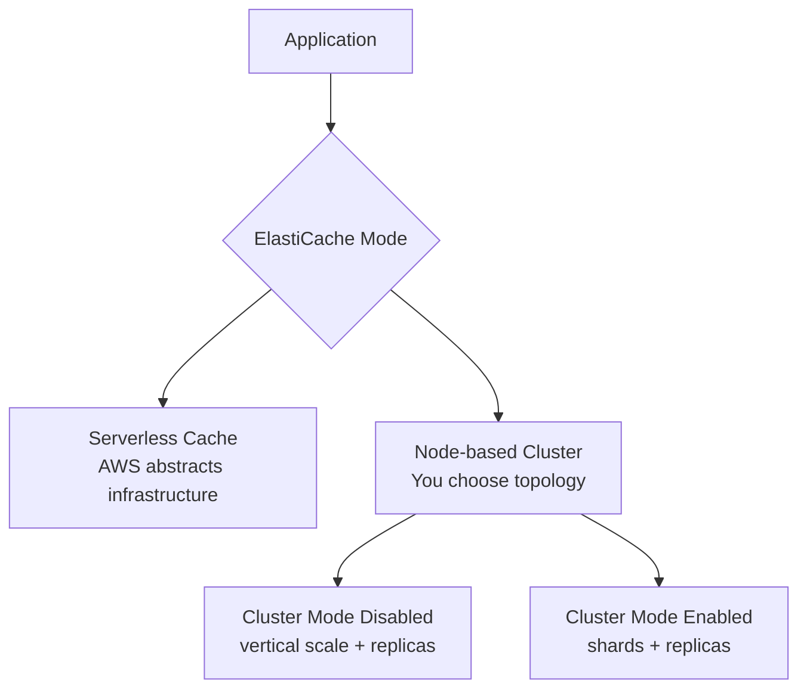
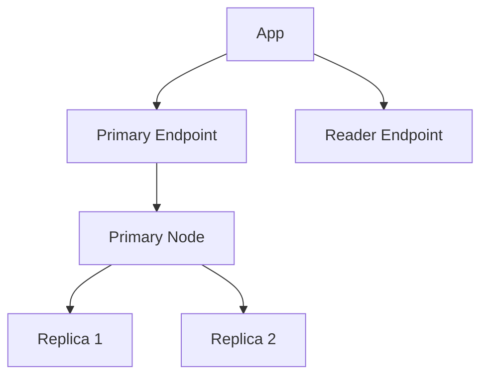
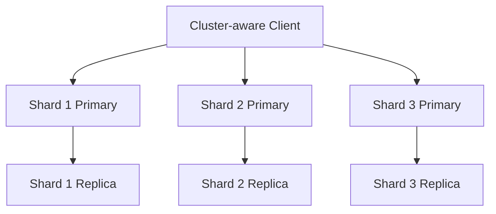
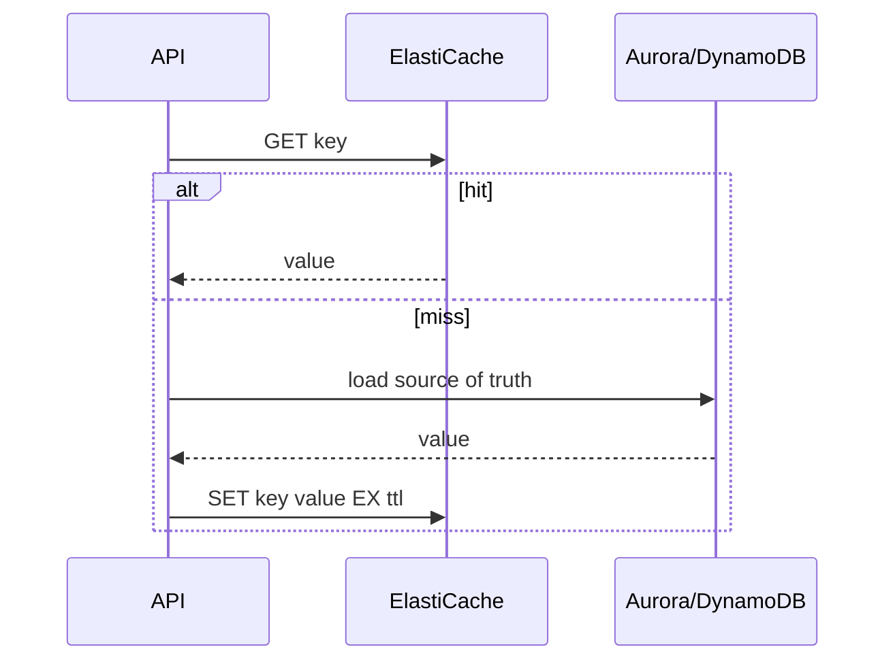
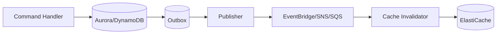
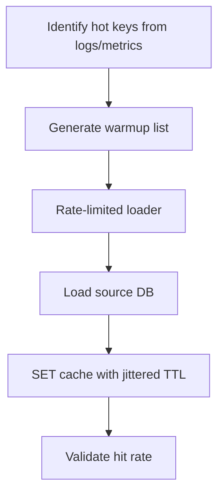
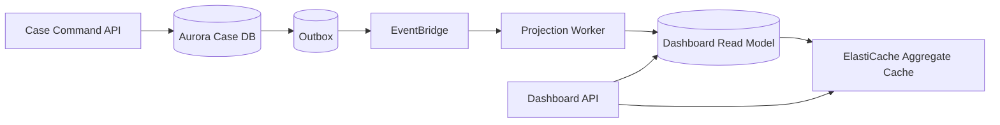

# Part 082 — ElastiCache Redis/Valkey Patterns

Amazon ElastiCache adalah managed in-memory cache/data store yang mendukung Valkey, Redis OSS, dan Memcached. Untuk sistem application/database, fokus kita adalah **ElastiCache for Valkey/Redis OSS** karena ia menyediakan struktur data kaya, TTL per key, atomic operations, scripting/functions, pub/sub, streams, clustering, replica, dan pola cache yang sering dipakai di production.

Namun ElastiCache bukan “database cepat yang selalu benar”. Ia adalah runtime memory dengan semantics berbeda dari Aurora, DynamoDB, SQS, atau Step Functions. Jika salah desain, ElastiCache bisa menjadi single point of overload, sumber stale data, atau database bayangan.

Part ini membahas pola penggunaan ElastiCache for Valkey/Redis OSS secara in action.

Referensi utama:

- What is Amazon ElastiCache: https://docs.aws.amazon.com/AmazonElastiCache/latest/dg/WhatIs.html
- Comparing Valkey, Memcached, and Redis OSS clusters: https://docs.aws.amazon.com/AmazonElastiCache/latest/dg/SelectEngine.html
- ElastiCache best practices: https://docs.aws.amazon.com/AmazonElastiCache/latest/dg/BestPractices.html
- Caching patterns using Redis: https://docs.aws.amazon.com/whitepapers/latest/database-caching-strategies-using-redis/caching-patterns.html
- Cache validity and TTL jitter: https://docs.aws.amazon.com/whitepapers/latest/database-caching-strategies-using-redis/cache-validity.html
- Valkey and Redis OSS configuration and limits: https://docs.aws.amazon.com/AmazonElastiCache/latest/dg/RedisConfiguration.html
- Metrics for Valkey and Redis OSS: https://docs.aws.amazon.com/AmazonElastiCache/latest/dg/CacheMetrics.Redis.html
- Which ElastiCache metrics should I monitor: https://docs.aws.amazon.com/AmazonElastiCache/latest/dg/CacheMetrics.WhichShouldIMonitor.html
- Valkey/Redis OSS clients and ElastiCache best practices: https://aws.amazon.com/blogs/database/best-practices-valkey-redis-oss-clients-and-amazon-elasticache/

---

## 1. ElastiCache Service Model

ElastiCache menyediakan dua mode besar:

| Mode | Karakter | Cocok untuk |
|---|---|---|
| Serverless cache | endpoint sederhana, AWS mengelola capacity, scaling, patching | tim ingin mengurangi capacity planning |
| Node-based cluster | kontrol node type, shard, replica, topology, maintenance | workload besar/spesifik, tuning detail, predictable capacity |

AWS documentation menyebut ElastiCache Serverless menghilangkan kebutuhan provisioning instance/nodes/clusters dan memonitor memory, compute, network bandwidth untuk scaling. Node-based cluster memberi kontrol lebih terhadap node type, jumlah node, placement, cluster mode, dan patch timing.

Mental model:



Pilihan mode bukan hanya “mana lebih mudah”. Pilihan mode adalah trade-off antara operational control dan managed abstraction.

---

## 2. Valkey vs Redis OSS vs Memcached

ElastiCache mendukung Valkey, Redis OSS, dan Memcached. Untuk seri ini:

| Engine | Karakter | Cocok untuk |
|---|---|---|
| Valkey | open-source in-memory data structure store; compatible dengan banyak Redis OSS use case | default modern untuk Redis-like workload |
| Redis OSS | Redis-compatible engine versi yang didukung AWS | existing Redis OSS workload |
| Memcached | simple distributed memory object cache | simple cache tanpa struktur data kompleks |

Gunakan Valkey/Redis OSS jika butuh:

- atomic counter;
- sorted set;
- hash/list/set;
- Lua/functions;
- per-key TTL;
- pub/sub;
- streams;
- transaction-like command batching;
- richer data structure semantics.

Gunakan Memcached jika butuh simple object cache dan operational semantics-nya cukup.

AWS documentation menyebut fitur Redis OSS 7.2 tersedia di Valkey 7.2+ secara default, dan beberapa engine Redis OSS dapat di-upgrade ke Valkey.

---

## 3. ElastiCache Bukan Hanya Cache

Valkey/Redis OSS sering dipakai sebagai:

- cache-aside store;
- session store;
- rate limiter;
- distributed counter;
- leaderboard/ranking via sorted set;
- dedup short-window;
- temporary workflow scratchpad;
- ephemeral lock;
- pub/sub realtime bus;
- stream-like in-memory log;
- feature/config cache;
- hot read model.

Tetapi semantics tiap use case berbeda.

| Use case | Durability required? | Correctness risk |
|---|---:|---|
| read cache | rendah | stale/miss |
| session | sedang | logout/session loss |
| rate limit | sedang | false allow/deny |
| lock | tinggi untuk correctness | split-brain/lease expiry |
| leaderboard | tergantung | stale ranking |
| dedup window | sedang | duplicate beyond TTL |
| pub/sub | rendah | subscriber offline loses messages |
| stream | lebih tinggi | memory/retention/consumer lag |

Rule:

```txt
Do not select Redis primitive before defining the semantics of the state.
```

---

## 4. Topology: Serverless, Cluster Mode Disabled, Cluster Mode Enabled

### 4.1 Serverless

Serverless cache cocok saat:

- workload belum predictable;
- tim tidak ingin memilih node/shard;
- operational simplicity lebih penting daripada low-level topology control;
- traffic elastis;
- simple endpoint abstraction diinginkan.

Risiko:

- cost harus dipantau berbasis actual usage;
- tidak semua tuning node-level relevan/tersedia;
- workload yang sangat spesifik mungkin butuh node-based control.

### 4.2 Cluster Mode Disabled

Satu primary shard dengan optional replicas.



Cocok untuk:

- dataset muat di satu shard;
- simple key access;
- ingin replica read/failover;
- tidak ingin client cluster routing complexity.

Batas:

- vertical scaling menjadi limit;
- satu keyspace shard;
- hot key tetap hot.

### 4.3 Cluster Mode Enabled

Data dishard berdasarkan hash slot.



Cocok untuk:

- dataset besar;
- throughput tinggi;
- horizontal scale;
- key distribution bagus.

Konsekuensi:

- client harus cluster-aware;
- multi-key command hanya aman jika key berada di slot sama;
- resharding/failover butuh client handling `MOVED`/`ASK`;
- hot key tetap bisa bottleneck satu shard.

---

## 5. Cache-Aside dengan ElastiCache

Pola paling aman untuk read-heavy workload.



Java-style pseudo-code dengan Lettuce-like client:

```java
public CaseView getCaseView(String tenantId, String caseId) {
    String key = "tenant:%s:case-view:%s:v3".formatted(tenantId, caseId);

    try {
        String json = redis.get(key);
        if (json != null) {
            return mapper.readValue(json, CaseView.class);
        }
    } catch (Exception e) {
        metrics.increment("cache.read.error");
        // For this read-only cache, fallback to DB.
    }

    CaseView view = repository.loadCaseView(tenantId, caseId);

    try {
        int ttlSeconds = 300 + ThreadLocalRandom.current().nextInt(0, 45);
        redis.setex(key, ttlSeconds, mapper.writeValueAsString(view));
    } catch (Exception e) {
        metrics.increment("cache.write.error");
        // Do not fail read response because cache populate failed.
    }

    return view;
}
```

Production detail:

- cache timeout harus lebih pendek dari API timeout;
- cache miss harus bounded agar tidak overload DB;
- serialization failure harus jadi miss;
- key harus include tenant/version;
- TTL harus punya jitter;
- value size harus dibatasi.

---

## 6. Write-Through dan Update-on-Write

Write-through memperbarui cache setelah DB commit.

```java
@Transactional
public CaseView updateStatus(UpdateCaseStatus cmd) {
    Case updated = repository.updateStatus(cmd.caseId(), cmd.newStatus());
    CaseView view = caseViewBuilder.from(updated);

    // after transaction commit, not before
    afterCommit(() -> {
        String key = caseViewKey(cmd.tenantId(), cmd.caseId());
        cache.setex(key, ttl(), toJson(view));
    });

    return view;
}
```

Masalah utama: cache update bukan bagian dari DB transaction. Jika DB commit sukses dan cache update gagal, cache bisa stale.

Strategi lebih robust:

```txt
DB transaction:
  - update aggregate
  - insert outbox event CaseStatusChanged

Async consumer:
  - delete or rebuild cache key
```



Ini membuat cache invalidation retryable dan observable.

---

## 7. TTL, Jitter, and Expiration Discipline

ElastiCache/Valkey/Redis OSS mendukung per-key TTL.

Contoh command:

```txt
SET tenant:t1:case-view:123:v3 '{...}' EX 300
```

TTL harus didesain berdasarkan staleness budget.

| Data | TTL | Extra guard |
|---|---:|---|
| case read model | 30s-5m | invalidation event + sourceVersion |
| reference lookup | 10m-24h | versioned namespace |
| permission decision | 5s-60s | policy version |
| dashboard aggregate | 5s-60s | stale marker |
| negative not-found | 5s-30s | short TTL |

TTL jitter:

```java
int ttl = baseTtlSeconds + random.nextInt(jitterSeconds + 1);
redis.setex(key, ttl, value);
```

AWS caching guidance explicitly recommends adding TTL jitter to reduce database pressure when many keys expire around the same time.

---

## 8. Key Design for Valkey/Redis OSS

Key naming is schema design.

Recommended pattern:

```txt
{domain}:{tenant}:{entity}:{id}:{representation}:v{schemaVersion}
```

Examples:

```txt
case:t1:case:CASE-123:view:v3
case:t1:case:CASE-123:timeline:v2
authz:t1:u456:case:CASE-123:APPROVE:policy:v42
ratelimit:t1:user:u456:api:create-case:20260707T1015
session:t1:sess:abc123
```

Use hash tags intentionally in cluster mode if multi-key operations must target same slot:

```txt
case:{CASE-123}:view:v3
case:{CASE-123}:lock
case:{CASE-123}:timeline
```

But do not overuse hash tags. If all hot keys share one hash tag, you create a hot shard.

Key design checklist:

```txt
- Includes tenant?
- Includes representation version?
- Includes authorization/policy version if needed?
- Includes query filters/locale/timezone if response differs?
- Avoids raw PII where possible?
- Has bounded cardinality?
- Has predictable TTL/lifecycle?
```

---

## 9. Data Structure Selection

Valkey/Redis OSS is not just `GET`/`SET`.

| Structure | Use case | Caution |
|---|---|---|
| String | JSON blob, simple value, counter | large blobs hurt memory/network |
| Hash | object fields, partial field update | no nested object semantics |
| Set | membership | high-cardinality memory |
| Sorted set | ranking, time-ordered scoring | update/removal discipline |
| List | simple queue-like list | not SQS; durability semantics differ |
| Stream | append log/consumer groups | retention/lag/memory ops |
| Bitmap | compact flags | modeling complexity |
| HyperLogLog | approximate cardinality | approximate, not exact audit count |

### 9.1 JSON blob vs Hash

JSON blob:

```txt
SET case:t1:CASE-1:view:v3 '{...}' EX 300
```

Good:

- simple;
- one round-trip;
- schema handled by app;
- easy cache-aside.

Bad:

- updating one field rewrites whole value;
- large payload memory/network cost.

Hash:

```txt
HSET case:t1:CASE-1:summary status UNDER_REVIEW owner u123 priority HIGH
EXPIRE case:t1:CASE-1:summary 300
```

Good:

- partial field update;
- useful for counters/metadata;
- avoids full JSON rewrite.

Bad:

- application must manage object assembly;
- TTL is per key, not per field.

---

## 10. Atomic Counter Pattern

Rate limit, usage counter, and lightweight metrics often use atomic increments.

```txt
INCR ratelimit:t1:user:u1:create-case:20260707T1015
EXPIRE ratelimit:t1:user:u1:create-case:20260707T1015 90
```

The common bug:

```txt
INCR succeeds
EXPIRE fails
key never expires
```

Use Lua/function or transaction-like command grouping where appropriate:

```lua
local current = redis.call('INCR', KEYS[1])
if current == 1 then
  redis.call('EXPIRE', KEYS[1], ARGV[1])
end
return current
```

Rate limit correctness decision:

| Cache failure | Fail open | Fail closed |
|---|---|---|
| Public unauthenticated API | risky | safer for abuse, worse for availability |
| Internal low-risk read API | usually okay | too harsh |
| High-risk command | often no | safer |

Do not hide this decision in code. Put it in ADR/runbook.

---

## 11. Token Bucket Rate Limiter

A token bucket allows bursts while enforcing average rate.

State:

```json
{
  "tokens": 42,
  "lastRefillEpochMs": 1783420000000
}
```

Lua-like logic:

```lua
local key = KEYS[1]
local capacity = tonumber(ARGV[1])
local refillPerSecond = tonumber(ARGV[2])
local nowMs = tonumber(ARGV[3])
local cost = tonumber(ARGV[4])
local ttl = tonumber(ARGV[5])

local bucket = redis.call('HMGET', key, 'tokens', 'lastRefill')
local tokens = tonumber(bucket[1]) or capacity
local lastRefill = tonumber(bucket[2]) or nowMs

local elapsed = math.max(0, nowMs - lastRefill) / 1000
local refill = elapsed * refillPerSecond
tokens = math.min(capacity, tokens + refill)

if tokens < cost then
  redis.call('HMSET', key, 'tokens', tokens, 'lastRefill', nowMs)
  redis.call('EXPIRE', key, ttl)
  return {0, tokens}
end

tokens = tokens - cost
redis.call('HMSET', key, 'tokens', tokens, 'lastRefill', nowMs)
redis.call('EXPIRE', key, ttl)
return {1, tokens}
```

Important:

- use server/application time consistently;
- design key cardinality carefully;
- monitor memory growth;
- decide fail-open/fail-closed;
- do not use this as billing ledger.

---

## 12. Distributed Lock Pattern: Be Conservative

Redis-style lock:

```txt
SET lock:case:CASE-123 request-id NX PX 10000
```

Release safely only if value matches:

```lua
if redis.call('GET', KEYS[1]) == ARGV[1] then
  return redis.call('DEL', KEYS[1])
else
  return 0
end
```

Use cases yang masuk akal:

- cache rebuild stampede control;
- best-effort scheduled job singleton;
- reducing duplicate work.

Jangan gunakan sebagai satu-satunya correctness guarantee untuk:

- financial transfer;
- legal state transition;
- uniqueness;
- idempotency;
- irreversible external side effects.

Untuk correctness, gunakan:

- database unique constraint;
- DynamoDB conditional write;
- transactional command record;
- Step Functions execution name/idempotency;
- durable ledger.

Cache lock adalah lease. Lease bisa expire saat holder masih bekerja. Network bisa delay. Client bisa pause. Failover bisa terjadi.

Rule:

```txt
A Redis lock can reduce duplicate work.
It must not be the only thing preventing invalid state.
```

---

## 13. Session Store Pattern

ElastiCache sering dipakai untuk session.

Key:

```txt
session:t1:{sessionId}
```

Value:

```json
{
  "userId": "u123",
  "tenantId": "t1",
  "createdAt": "2026-07-07T10:00:00Z",
  "lastSeenAt": "2026-07-07T10:20:00Z",
  "authnLevel": "MFA",
  "policyVersionAtLogin": 42
}
```

Design decisions:

| Decision | Options |
|---|---|
| Expiry | absolute, sliding, both |
| Revocation | delete key, version namespace, blocklist |
| Failover | user logout, retry, degrade |
| Security | TLS, auth, encryption, no secrets if avoidable |
| Multi-region | sticky region, replicated session, stateless token |

Avoid storing too much session state. Large session objects increase memory, network cost, and security exposure.

---

## 14. Authorization Decision Cache

Authorization cache should be explicit and short-lived.

Key:

```txt
authz:t1:principal:u123:resource:case:CASE-9:action:APPROVE:policy:v42
```

Value:

```json
{
  "decision": "ALLOW",
  "policyVersion": 42,
  "relationshipVersion": 981,
  "computedAt": "2026-07-07T10:12:00Z",
  "ttlSeconds": 15
}
```

Rules:

- include policy version;
- short TTL;
- deny decisions may use different TTL than allow;
- critical commands should revalidate or require minimum policy version;
- invalidation event on role/policy/relationship change;
- no cross-tenant key collision.

---

## 15. Pub/Sub and Streams: Know the Boundary

Valkey/Redis OSS Pub/Sub is useful for realtime notifications, but do not confuse it with durable messaging.

Use Pub/Sub for:

- live UI invalidation;
- ephemeral notifications;
- low-criticality fanout among live subscribers.

Use SQS/EventBridge/SNS for:

- durable event delivery;
- DLQ/retry;
- replay;
- cross-service integration;
- audit-sensitive workflows.

Redis Streams provide more log-like semantics than Pub/Sub, but still require explicit retention, consumer group management, memory monitoring, and operational discipline.

For most application integration in this series:

```txt
Durable event -> EventBridge/SNS/SQS
Ephemeral local signal -> Redis Pub/Sub
Cache invalidation event -> EventBridge/SNS/SQS consumer deletes cache
```

---

## 16. Memory and Eviction

ElastiCache/Valkey/Redis OSS keeps data in memory. Memory is capacity, cost, and correctness boundary.

Causes of memory pressure:

- values too large;
- TTL missing;
- key cardinality growth;
- write-through caching cold data;
- versioned namespace without expiry;
- session leak;
- rate limit keys not expiring;
- unbounded sorted sets/streams/lists;
- fragmented memory;
- replica/failover overhead not considered.

Eviction policy matters. AWS configuration docs describe `maxmemory-policy`; for Valkey/Redis OSS, `volatile-lru` appears as a default configuration in the documented parameter table. Do not rely blindly on default policy; set policy intentionally based on use case.

Policy thinking:

| Policy family | Effect | Use case |
|---|---|---|
| volatile-* | evict only keys with TTL | caches where all cache keys should have TTL |
| allkeys-* | evict any key | pure cache where all keys disposable |
| noeviction | writes fail when memory full | correctness-sensitive ephemeral store |

For pure cache, eviction can be acceptable. For session/rate-limit/lock-like state, eviction can become correctness incident.

---

## 17. Hot Keys

Hot key = one key receives disproportionate traffic.

Symptoms:

- high latency for one endpoint;
- one shard/node overloaded;
- high CPU while memory okay;
- cache hit rate good but latency bad;
- database okay because cache is serving, but cache is saturated.

Examples:

```txt
feature-flags:global
reference:country-list
case:popular-case:view
ranking:global:today
```

Mitigation:

1. local in-process cache for ultra-hot read-only key;
2. replicate value under multiple keys for random read spread;
3. split data structure by bucket;
4. reduce value size;
5. avoid heavy commands on hot key;
6. precompute smaller representation;
7. move global state to CDN/config service if appropriate.

Replicated hot key pattern:

```java
int bucket = ThreadLocalRandom.current().nextInt(16);
String key = "global:feature-flags:v9:replica:" + bucket;
```

Write must update all replicas or use versioned namespace + lazy rebuild.

---

## 18. Connection Management

Common mistakes:

- creating Redis connection per request;
- no timeout;
- infinite retry;
- retry all commands during failover;
- using non-cluster-aware client for cluster mode enabled;
- ignoring `MOVED`/`ASK` behavior;
- no TLS/auth rotation plan;
- no connection pool bound;
- no command latency metrics.

Recommended client posture:

```txt
- reuse connections
- set connect timeout
- set command timeout
- set bounded retry with jitter
- use circuit breaker for cache dependency
- use cluster-aware client if cluster mode enabled
- instrument per-command latency/error
- separate read cache fallback from write-critical cache operation
```

Pseudo config:

```yaml
redis:
  connectTimeoutMs: 500
  commandTimeoutMs: 50
  maxRetries: 1
  retryJitterMs: 20
  pool:
    maxTotal: 64
    maxIdle: 32
    minIdle: 4
  circuitBreaker:
    failureRateThreshold: 50
    waitDurationMs: 5000
```

Timeout rule:

```txt
Cache timeout must be small enough that fallback still has time.
```

If API timeout is 2 seconds, cache command timeout cannot be 1.5 seconds.

---

## 19. Failover Semantics

During failover:

- connections can drop;
- writes can fail;
- replicas promote;
- DNS/endpoints may change;
- clients must reconnect;
- in-flight commands may have ambiguous result;
- stale replica reads may occur;
- lock/session/counter semantics can be affected.

For read cache:

```txt
cache failure -> fallback DB or serve stale local snapshot
```

For rate limit/session/lock:

```txt
cache failure -> explicit business decision
```

Do not assume failover is invisible. Test it.

Failure drill:

```txt
- simulate node failover
- observe client reconnect time
- observe API latency spike
- observe cache error count
- observe DB fallback load
- observe session/rate-limit behavior
- verify alerts
- update runbook
```

---

## 20. Security Boundary

ElastiCache data can contain sensitive data.

Security checklist:

```txt
- encryption in transit where applicable
- encryption at rest where applicable
- auth/user group/ACL configured
- least-privilege network access via security groups
- no public access
- tenant in key namespace
- raw keys and values not logged
- PII retention reviewed
- secrets not cached unless explicitly justified
- backup/snapshot handling reviewed
```

Cache keys can leak information too.

Bad:

```txt
user-email:john.doe@example.com:profile
```

Better:

```txt
tenant:t1:user:u_8f3a:profile:v2
```

---

## 21. Observability for ElastiCache

AWS exposes ElastiCache metrics through CloudWatch. For Valkey/Redis OSS, many metrics are derived from the engine `INFO` command, while metrics such as replication lag and engine CPU are AWS-provided metrics.

Monitor:

| Area | Signal |
|---|---|
| Effectiveness | hit rate, miss rate, get/set volume |
| Latency | successful read/write latency, command latency |
| Errors | timeout, connection error, auth error |
| Capacity | memory used, freeable memory, evictions |
| CPU | CPUUtilization, EngineCPUUtilization |
| Connections | CurrConnections, new connections |
| Network | bytes in/out, bandwidth pressure |
| Replication | replication lag, replica health |
| Keyspace | key count/cardinality, TTL coverage |
| App fallback | DB fallback rate, rebuild count |

Dashboard sections:

```txt
1. Cache health
2. Cache effectiveness
3. Application fallback
4. Database protection
5. Memory/eviction
6. Hot key/keyspace growth
7. Failover/replication
```

Alert examples:

```txt
- Hit rate drops by >30% for 5 minutes
- Evictions > 0 for session/rate-limit cache
- EngineCPUUtilization > threshold sustained
- CurrConnections grows abnormally
- ReplicationLag exceeds tolerance
- Cache read timeout rate > 1%
- DB fallback rate exceeds tested capacity
```

---

## 22. Cache Warming

Cold cache is a real production state.

Warmup strategies:

| Strategy | Description |
|---|---|
| lazy warm | populate on demand |
| scheduled warm | pre-load top keys periodically |
| deploy warm | warm critical keys after deployment |
| failover warm | prepare after cache replacement/restore |
| event warm | rebuild cache after source change |

Warm only what matters. Warming everything often creates more load than it saves.

Hot key warmup flow:



Warmup guardrails:

```txt
- maximum DB QPS
- maximum parallel loaders
- timeout per load
- stop when DB latency rises
- record warmup success/failure
```

---

## 23. Cache Invalidation Worker Pattern

Event-driven invalidation worker:

```java
public void handle(CaseChanged event) {
    String key = "case:%s:case:%s:view:v3".formatted(event.tenantId(), event.caseId());

    try {
        redis.del(key);
        metrics.increment("cache.invalidate.success", "type", "case-view");
    } catch (Exception e) {
        metrics.increment("cache.invalidate.failure", "type", "case-view");
        throw e; // let SQS/EventBridge retry or DLQ depending integration
    }
}
```

Important:

- invalidation event can duplicate;
- `DEL` is idempotent;
- missing key is success;
- event order can be out of order;
- TTL remains safety net;
- DLQ must be monitored;
- replay must be bounded.

For rebuild instead of delete:

```txt
CaseChanged -> load current state -> SET cache
```

But this can overload DB during high write volume. Delete-on-event is often safer.

---

## 24. Large Value Pattern

Redis is fast, but large values are expensive:

- memory cost;
- network cost;
- serialization/deserialization cost;
- replication cost;
- failover recovery cost;
- latency tail.

Guideline:

```txt
Cache compact read models, not arbitrary database dumps.
```

Bad:

```txt
case:CASE-1:full -> entire case, attachments metadata, comments, audit, permissions, workflow history
```

Better:

```txt
case:CASE-1:summary:v3
case:CASE-1:timeline-page:0:v2
case:CASE-1:permission-decision:u123:APPROVE:policy:v42
```

Split by access pattern.

---

## 25. Anti-Patterns

### 25.1 No TTL

Every key lives forever.

Result:

- memory leak;
- old schema values;
- stale data;
- expensive manual cleanup.

### 25.2 Cache every query result

Ad-hoc query parameters create unbounded key cardinality.

Mitigation:

- cache only named access patterns;
- normalize filters;
- cap page caches;
- use read model/search projection when needed.

### 25.3 Redis Pub/Sub as reliable event bus

Subscriber offline misses event.

Mitigation:

- use EventBridge/SNS/SQS for durable integration;
- Redis Pub/Sub only for ephemeral signal.

### 25.4 Lock without fencing token

A lock expires while worker still runs, another worker acquires lock, both mutate external state.

Mitigation:

- use fencing token/version in authoritative DB;
- never rely on cache lock alone.

### 25.5 Cache hides bad data model

Cache masks expensive query until cold-cache incident.

Mitigation:

- fix access pattern/index/schema;
- test cold cache;
- capacity-plan DB fallback.

---

## 26. Case Study: Regulatory Case Dashboard

Requirement:

- dashboard shows count of cases by status, region, risk level;
- data can be stale up to 30 seconds;
- command state transition must be strongly validated;
- dashboard must not overload Aurora during peak.

Design:



Pattern:

- command writes authoritative state to Aurora;
- outbox publishes `CaseStatusChanged`;
- projection worker updates dashboard read model;
- dashboard API cache-aside reads aggregate from ElastiCache;
- TTL 30s + jitter;
- cache entry includes `generatedAt` and `projectionVersion`;
- cache miss reads read model, not OLTP aggregate query over primary tables;
- command path never trusts dashboard cache.

Key:

```txt
dashboard:t1:case-counts:region:{region}:risk:{risk}:v4
```

Value:

```json
{
  "projectionVersion": 918273,
  "generatedAt": "2026-07-07T10:22:00Z",
  "counts": {
    "NEW": 182,
    "UNDER_REVIEW": 54,
    "ESCALATED": 9,
    "CLOSED": 801
  }
}
```

This is defensible because:

- source of truth remains Aurora;
- dashboard is explicitly stale-bounded;
- cache is reconstructable;
- mutation path does not depend on cache;
- observability can prove freshness.

---

## 27. Production Checklist

### Design

```txt
- Engine selected intentionally: Valkey/Redis OSS/Memcached
- Serverless vs node-based decision documented
- Cluster mode decision documented
- Source of truth defined for every key namespace
- TTL policy exists for every key namespace
- Eviction policy understood
- Key naming convention documented
- Serialization versioning implemented
- Fail-open/fail-closed behavior documented
```

### Application

```txt
- Reused client connections
- Command timeout configured
- Bounded retries with jitter
- Circuit breaker for cache dependency
- Cache read failure behavior explicit
- Cache write failure behavior explicit
- Deserialization failure treated as miss
- Single-flight/stampede control for hot keys
- DB fallback concurrency capped
```

### Operations

```txt
- Hit/miss/error/latency metrics
- Memory/eviction/CPU/connections metrics
- Replication/failover metrics
- Hot key monitoring strategy
- Cold-cache load test completed
- Failover drill completed
- Warmup runbook exists
- Invalidation DLQ monitored
- Cost dashboard exists
```

### Security

```txt
- TLS/auth/user group/ACL configured where required
- Security groups restrict access
- Key namespace includes tenant
- PII handling reviewed
- Logs do not expose raw sensitive keys/values
- Snapshot/backup policy reviewed if enabled
```

---

## 28. What You Should Internalize

ElastiCache gives you powerful primitives, but primitives are not architecture.

A top-tier engineer can answer:

```txt
What happens if the cache is empty?
What happens if it is stale?
What happens if it is wrong?
What happens if it evicts keys?
What happens if it fails over?
What happens if all keys expire together?
What happens if a hot key receives 50% of traffic?
What happens if cache fallback overloads the database?
```

If the design survives those questions, ElastiCache is a force multiplier.

If not, it is hidden state debt.

---

## 29. Latihan

1. Ambil satu endpoint read-heavy.
2. Rancang key namespace ElastiCache lengkap dengan tenant dan version.
3. Tentukan TTL, jitter, invalidation trigger, dan fail behavior.
4. Simulasikan cache miss storm untuk satu hot key.
5. Tambahkan single-flight atau rebuild lock.
6. Definisikan dashboard metric untuk hit rate, DB fallback, evictions, latency, dan errors.
7. Tulis runbook untuk ElastiCache failover dan cold-cache recovery.

