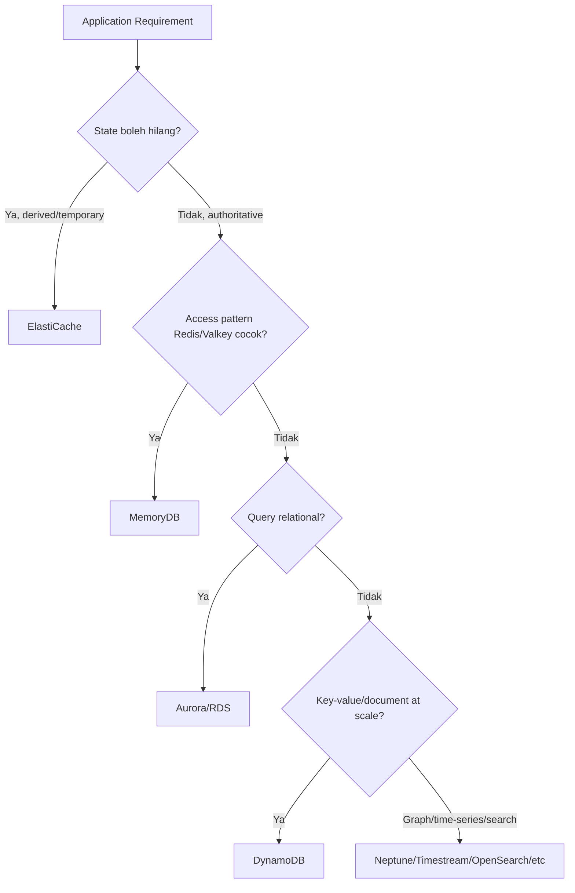
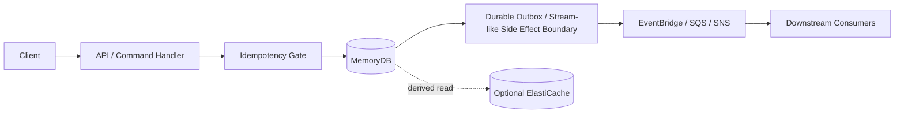
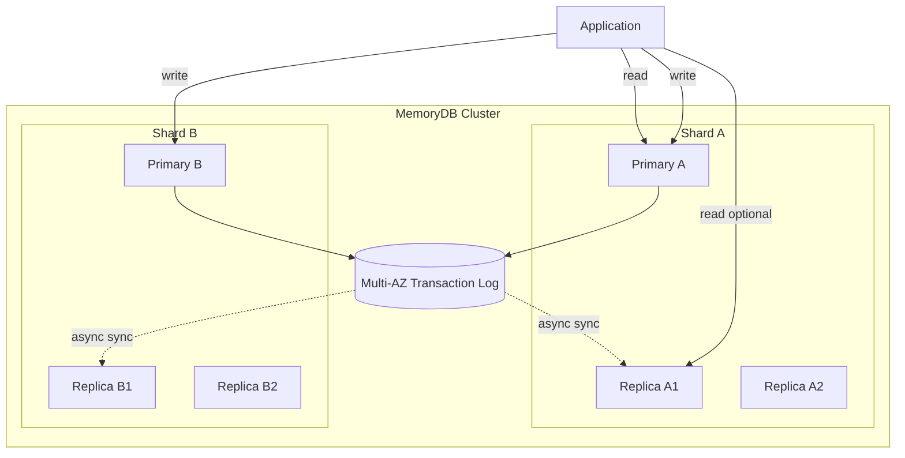
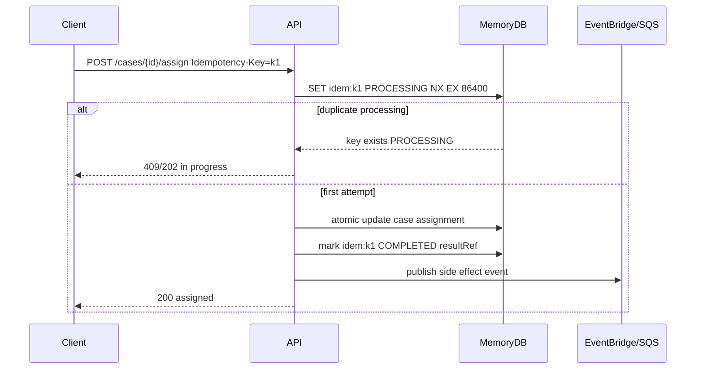
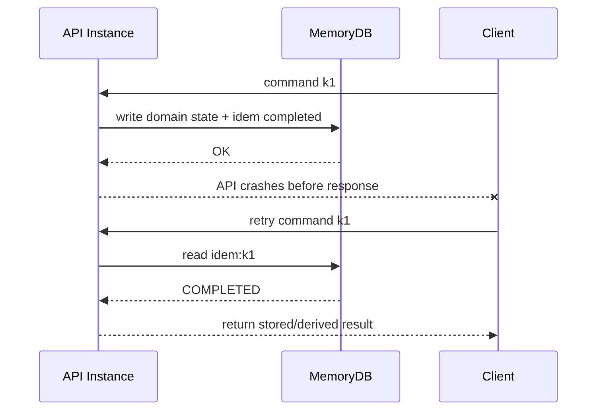

# Part 083 — MemoryDB: Durable In-Memory Store, When Cache Becomes Primary State

> **Core idea:** ElastiCache biasanya diperlakukan sebagai **derived state**. MemoryDB berbeda: ia bisa menjadi **primary state** untuk workload yang butuh Redis/Valkey-style access pattern, latensi sangat rendah, dan durability Multi-AZ. Begitu cache menjadi primary state, cara berpikirnya harus berubah dari “boleh hilang” menjadi “harus benar, bisa dipulihkan, bisa diaudit, dan punya failure model.”

---

## 1. Target Mental Model

Setelah bagian ini, kamu harus bisa menjawab pertanyaan berikut tanpa melihat console AWS:

1. Kapan MemoryDB lebih cocok daripada ElastiCache?
2. Kapan MemoryDB lebih cocok daripada DynamoDB, Aurora, atau Redis OSS cluster biasa?
3. Apa konsekuensi ketika Redis/Valkey data structure menjadi **authoritative data model**?
4. Bagaimana mendesain key, TTL, idempotency, retry, dan failover supaya tidak kehilangan correctness?
5. Metric apa yang wajib dipantau sebelum MemoryDB dianggap production-ready?

MemoryDB bukan “cache yang lebih aman”. Ia adalah **durable in-memory database** yang kompatibel dengan Valkey/Redis OSS API. AWS menyatakan MemoryDB menyimpan data secara durable menggunakan **Multi-AZ transactional log**, mendukung Multi-AZ availability, automatic failover, dan kompatibilitas data structure/API Redis/Valkey.

---

## 2. MemoryDB dalam Peta Data Store AWS



### 2.1 Satu kalimat pembeda

| Service | Gunakan sebagai | Kekuatan utama | Risiko utama |
|---|---|---|---|
| ElastiCache | Cache / ephemeral acceleration | Low latency, Redis/Valkey/Memcached semantics | Jangan jadikan source of truth tanpa desain durability yang jelas |
| MemoryDB | Durable in-memory primary store | Redis/Valkey API + durability + low latency | Data model mudah kacau jika keyspace tidak didesain seperti database |
| DynamoDB | Massive-scale key-value/document database | Predictable scale, conditional write, global table | Query harus diketahui di depan; hot key/index risk |
| Aurora/RDS | Relational source of truth | SQL, constraints, transactions, joins | Connection/locking/failover/replica lag |
| OpenSearch | Search projection | Full-text/search/filter/ranking | Bukan source of truth |

### 2.2 Jangan mulai dari service

Mulai dari invariant:

```txt
Untuk setiap write yang di-ACK ke client, state apa yang harus tetap benar setelah:
- process crash,
- node failover,
- AZ failure,
- retry client,
- duplicate command,
- partial downstream failure,
- replay event,
- restore/recovery?
```

Kalau jawabanmu “data ini boleh hilang dan akan dibangun ulang”, MemoryDB mungkin terlalu kuat. Kalau jawabannya “data ini harus survive failure, tapi query shape-nya Redis-native”, MemoryDB layak dipertimbangkan.

---

## 3. Apa Itu “Cache Menjadi Primary State”?

Cache biasanya punya property berikut:

- Boleh kosong.
- Boleh stale sementara.
- Bisa dipopulate ulang dari database utama.
- Kehilangan cache bukan kehilangan bisnis.

Primary state punya property berbeda:

- Write yang sukses harus survive failure sesuai durability target.
- Ada ownership dan allowed writer.
- Ada schema/key contract.
- Ada backup/restore/recovery story.
- Ada observability untuk correctness, bukan cuma hit ratio.
- Ada migration dan compatibility policy.
- Ada reconciliation untuk external side effects.

MemoryDB masuk kategori kedua saat ia menjadi authoritative store.



Hal penting: **jangan menganggap Redis command atomic = business transaction sudah selesai**. Atomicity command membantu, tetapi business correctness tetap harus dirancang: idempotency, ownership, ordering, expiration, compensation, dan recovery.

---

## 4. MemoryDB Internal Model yang Harus Dipahami

### 4.1 Cluster, shard, primary, replica

MemoryDB mempartisi data ke shard. Setiap shard punya primary node dan bisa punya read replica. Aplikasi menulis ke primary. Replica membantu read scalability dan availability. Dokumentasi AWS menjelaskan bahwa read replica mempertahankan copy data dari primary shard dan disinkronkan menggunakan transaction log secara asynchronous.



### 4.2 Durability

MemoryDB bukan Redis process dengan append-only file lokal. AWS mendeskripsikan MemoryDB sebagai in-memory database yang menyimpan data secara durable lintas Availability Zone menggunakan Multi-AZ transactional log. Ini membuatnya bisa dipakai untuk microservices application yang butuh in-memory performance sekaligus durability.

### 4.3 Consistency

Mental model yang aman:

| Operation path | Consistency expectation |
|---|---|
| Write ke primary | ACK setelah write durable sesuai service semantics |
| Read dari primary | Strongly consistent terhadap prior successful writes ke primary |
| Read dari replica | Bisa lag, tergantung replication |
| Failover primary | Client harus siap reconnect dan retry |
| Multi-Region mode | Butuh desain konflik, locality, dan routing sendiri |

AWS menyatakan primary node MemoryDB strongly consistent: successful write operations disimpan durable di distributed Multi-AZ transactional log sebelum kembali ke client, dan read pada primary mengembalikan data paling mutakhir dari prior successful writes.

---

## 5. Kapan MemoryDB Cocok?

### 5.1 Use case kuat

MemoryDB cocok ketika data model kamu Redis/Valkey-native dan state harus durable:

1. **Durable session / user interaction state**
   - Cart state, session state, live journey state.
   - Butuh low latency dan harus survive failover.

2. **Leaderboard / ranking / scoring state**
   - Sorted set sangat natural.
   - Update/read top-N sangat cepat.
   - State tidak mudah dimodelkan sebagai SQL query biasa tanpa latency tinggi.

3. **Real-time entitlement / rate quota / limit state**
   - Counter/token bucket/window state.
   - Butuh atomic increment/decrement.
   - Namun harus jelas apakah kehilangan state dapat diterima.

4. **Coordination state dengan durability requirement**
   - Reservation, lease, ephemeral-but-important workflow state.
   - Perlu expiration tetapi write sukses harus bertahan.

5. **Semantic cache yang tidak boleh hilang**
   - Misalnya hasil inference/embedding expensive yang harus bertahan, bukan sekadar cache disposable.

6. **Microservice primary state dengan data structure Redis-native**
   - Hash/list/set/sorted set dapat menjadi natural aggregate representation.

### 5.2 Use case lemah

MemoryDB kurang cocok jika:

| Requirement | Kenapa kurang cocok | Alternatif |
|---|---|---|
| Query relational kompleks | Redis/Valkey bukan relational engine | Aurora/RDS |
| Banyak ad-hoc query | Key design harus spesifik | Aurora/OpenSearch/DynamoDB sesuai case |
| Multi-entity ACID transaction kompleks | Command atomic tidak sama dengan SQL transaction | Aurora/RDS |
| Massive document access dengan query known upfront | DynamoDB lebih natural | DynamoDB |
| Search ranking/full-text | Redis search-like pattern bukan source-of-truth search platform | OpenSearch projection |
| Long audit/history ledger | In-memory primary state bukan ledger ideal | Aurora/DynamoDB/S3 ledger |

---

## 6. Decision Table: MemoryDB vs ElastiCache vs DynamoDB vs Aurora

| Pertanyaan | MemoryDB | ElastiCache | DynamoDB | Aurora/RDS |
|---|---:|---:|---:|---:|
| Data harus durable? | Ya | Biasanya tidak sebagai asumsi utama | Ya | Ya |
| Butuh Redis/Valkey API? | Ya | Ya | Tidak | Tidak |
| Low latency in-memory critical? | Sangat | Sangat | Tinggi tapi bukan Redis latency | Bervariasi |
| Query berbasis key/data structure? | Sangat cocok | Cocok untuk cache | Cocok | Bisa tapi overkill |
| SQL joins/constraints? | Tidak | Tidak | Tidak | Ya |
| Conditional write / optimistic concurrency? | Bisa via command pattern/Lua/atomic ops | Bisa tapi bukan source of truth | Native kuat | Native kuat |
| Derived state rebuildable? | Bisa, tapi bukan nilai utama | Ya | Bisa | Bisa |
| Cost sensitivity terhadap memory footprint? | Perlu hati-hati | Perlu hati-hati | Lebih elastis untuk banyak workload | Tergantung instance/storage |
| Auditability out-of-box | Lemah dibanding relational ledger | Lemah | Sedang | Kuat |

Rule praktis:

```txt
Pilih MemoryDB hanya jika Redis/Valkey data structures adalah model domain yang natural,
dan durability state tersebut memang dibutuhkan.
```

Kalau hanya ingin mempercepat read dari Aurora/DynamoDB, mulai dari ElastiCache atau DAX. Kalau ingin primary database dengan key-value scale dan conditional write kuat, mulai dari DynamoDB.

---

## 7. Modeling Data di MemoryDB

### 7.1 Keyspace adalah schema

Di relational database, schema terlihat dari table/column/constraint. Di MemoryDB, schema sering tersembunyi di key naming dan command convention. Itu berbahaya jika tidak didokumentasikan.

Gunakan key grammar eksplisit:

```txt
<env>:<service>:<entity>:<id>:<component>
```

Contoh:

```txt
prod:case:case:CASE-123:summary
prod:case:case:CASE-123:timeline
prod:case:user:U-928:open-cases
prod:case:tenant:T-001:case-rank
prod:case:command:idem:8f1e2a
prod:case:lease:case:CASE-123
```

### 7.2 Pisahkan entity state, index state, dan operational state

| Jenis key | Contoh | Fungsi |
|---|---|---|
| Entity state | `case:{id}:state` | Authoritative state |
| Secondary index | `tenant:{id}:cases-by-priority` | Derived index |
| Idempotency | `idem:{key}` | Duplicate command guard |
| Lease | `lease:{resource}` | Coordination guard |
| Rate state | `quota:{tenant}:{window}` | Limit/token state |
| Outbox marker | `outbox:{eventId}` | Side-effect tracking |

Jangan campur semua dalam satu key tanpa lifecycle jelas.

### 7.3 Pilih data structure berdasarkan invariant

| Data structure | Cocok untuk | Risiko |
|---|---|---|
| String | scalar, JSON blob kecil, counter | Blob besar sulit query/migrate |
| Hash | aggregate fields | Partial update mudah, tapi schema drift bisa tersembunyi |
| Set | membership unik | Tidak punya ordering |
| Sorted Set | ranking, priority, timeline by score | Score collision dan update semantics harus jelas |
| List | queue kecil/simple sequence | Jangan menggantikan SQS untuk durable distributed queue |
| Stream | append-like event log ringan | Retention, consumer, replay, ownership harus dirancang serius |
| Bitmap/HyperLogLog | approximate/counting use case | Tidak cocok untuk authoritative exact state |

### 7.4 TTL adalah lifecycle, bukan garbage collection belaka

TTL pada primary state harus berarti sesuatu secara domain:

```txt
TTL berarti: setelah waktu ini, data secara bisnis tidak valid lagi.
```

Contoh aman:

- `reservation:{id}` expire setelah hold window selesai.
- `idem:{key}` expire setelah replay window selesai.
- `rate:{tenant}:{minute}` expire setelah window selesai.

Contoh berbahaya:

- `case:{id}:state` expire karena “biar hemat memory”.
- `audit:{event}` expire tanpa archival store.
- `entitlement:{user}` expire tanpa refresh path deterministik.

---

## 8. Authoritative State Pattern

### 8.1 Command handler dengan idempotency



Invariant:

```txt
Satu business command boleh dieksekusi banyak kali secara teknis,
tetapi efek domain-nya harus terlihat satu kali.
```

### 8.2 Jangan publish event sebelum state authoritative selesai

Anti-pattern:

```txt
publish CaseAssigned event
then update MemoryDB
```

Kalau update gagal, downstream melihat event palsu.

Pattern lebih aman:

```txt
atomic write domain state + outbox marker
publisher reads outbox marker
publish event idempotently
mark published
```

MemoryDB tidak memberikan SQL transaction + outbox table seperti Aurora. Karena itu kamu harus membuat protocol sendiri dengan Redis/Valkey atomic primitive, Lua/script, atau struktur state yang memastikan outbox marker dan domain mutation tidak divergen.

---

## 9. Atomicity: Command Atomic ≠ Workflow Atomic

Redis/Valkey command sering atomic untuk key tertentu, tetapi workflow bisnis biasanya terdiri dari banyak langkah:

```txt
1. Validate case is OPEN.
2. Reserve assignment slot.
3. Change assignee.
4. Update tenant priority index.
5. Emit CaseAssigned event.
6. Notify downstream.
```

Pertanyaannya:

- Mana yang harus atomic?
- Mana yang boleh eventually consistent?
- Mana yang harus bisa direconcile?
- Mana yang bisa dikompensasi?

### 9.1 Atomic update untuk state + index

Jika satu command mengubah entity state dan index state, gunakan satu atomic operation/script jika memungkinkan.

Pseudo Lua-style logic:

```lua
-- KEYS[1] = case state hash
-- KEYS[2] = tenant priority zset
-- KEYS[3] = idempotency key
-- ARGV[1] = expected version
-- ARGV[2] = new assignee
-- ARGV[3] = new version
-- ARGV[4] = ttl seconds

if redis.call('EXISTS', KEYS[3]) == 1 then
  return { 'DUPLICATE' }
end

local currentVersion = redis.call('HGET', KEYS[1], 'version')
if currentVersion ~= ARGV[1] then
  return { 'CONFLICT', currentVersion }
end

redis.call('HSET', KEYS[1], 'assignee', ARGV[2], 'version', ARGV[3])
redis.call('ZADD', KEYS[2], ARGV[3], KEYS[1])
redis.call('SET', KEYS[3], 'COMPLETED', 'EX', ARGV[4])
return { 'OK', ARGV[3] }
```

Catatan: pastikan script/command yang kamu gunakan kompatibel dengan engine/version yang dipakai. Jangan asumsi seluruh command Redis OSS selalu tersedia sama persis pada semua mode/engine.

---

## 10. MemoryDB dan Multi-Region

MemoryDB juga memiliki konsep Multi-Region cluster di dokumentasi AWS. Namun, begitu state aktif di banyak Region, problem tidak selesai oleh service saja.

Checklist multi-Region:

| Area | Pertanyaan wajib |
|---|---|
| Write routing | Region mana yang boleh menulis key tertentu? |
| Conflict | Apa yang terjadi jika dua Region menulis state yang sama? |
| Clock | Apakah ordering memakai timestamp client, server, atau sequence domain? |
| Eventing | Region mana yang publish domain event authoritative? |
| Idempotency | Apakah idempotency key global atau regional? |
| Failover | Bagaimana client berpindah Region tanpa duplicate side effect? |
| Reconciliation | Apa register untuk membandingkan state lintas Region? |

Jangan menulis semua key dari semua Region tanpa ownership. Itu biasanya membuat bug yang baru muncul saat failover nyata.

---

## 11. Java Client Discipline

### 11.1 DNS dan reconnect

Untuk Redis/Valkey-compatible services di AWS, client harus siap menghadapi endpoint/IP berubah saat failover. Pada JVM, DNS TTL yang terlalu lama bisa membuat aplikasi tetap mencoba IP lama. AWS ElastiCache best practice untuk Lettuce menyarankan JVM DNS TTL rendah, misalnya 5–10 detik, agar aplikasi bisa mengambil IP baru setelah perubahan DNS.

Contoh JVM property:

```properties
networkaddress.cache.ttl=10
networkaddress.cache.negative.ttl=1
```

### 11.2 Timeout harus pendek dan eksplisit

Jangan biarkan Redis client menggantung lebih lama daripada API timeout.

```java
// Pseudo-code; sesuaikan dengan library dan versi yang dipakai.
RedisClient client = RedisClient.create(redisUri);
client.setOptions(ClientOptions.builder()
    .autoReconnect(true)
    .disconnectedBehavior(ClientOptions.DisconnectedBehavior.REJECT_COMMANDS)
    .build());

StatefulRedisConnection<String, String> connection = client.connect();
RedisCommands<String, String> redis = connection.sync();

// Set timeout at client/application layer.
// Guard every business operation with bounded retry budget.
```

### 11.3 Retry classification

| Error | Retry? | Catatan |
|---|---:|---|
| timeout before write result known | Maybe | Treat as ambiguous; read idempotency record first |
| connection reset during failover | Yes | Bounded retry with jitter |
| duplicate idempotency key completed | No | Return stored result |
| optimistic version conflict | No immediate retry | Return conflict or reload/re-evaluate |
| memory pressure / OOM | No blind retry | Trigger backpressure/runbook |
| command rejected due maintenance/failover | Yes bounded | Respect global API timeout |

---

## 12. Failure Model

### 12.1 Process crash after write before response



Invariant:

```txt
If response is lost after commit, retry must discover prior commit.
```

### 12.2 Node failover

Expected behavior:

1. Client receives timeout/connection error.
2. Client reconnects/resolves endpoint again.
3. Client checks idempotency state for ambiguous command.
4. Client retries only within bounded retry budget.
5. API returns stable result or safe pending status.

Do not immediately re-execute non-idempotent side effects after failover.

### 12.3 Replica lag read bug

If you read from replica after write, you can observe stale state. For command response, read from primary or return result from write path.

Bad:

```txt
write primary -> read replica -> return stale value -> client retries -> duplicate action
```

Better:

```txt
write primary -> return deterministic result
or
write primary -> read primary if confirmation needed
```

### 12.4 TTL expiry during workflow

If workflow relies on a key that expires mid-process, design expiry as domain event:

```txt
reservation expires -> state becomes EXPIRED -> compensation/release runs
```

Not:

```txt
key disappears -> downstream guesses what happened
```

---

## 13. Memory Pressure and Eviction Thinking

For a primary database, eviction is dangerous. Treat memory capacity as correctness capacity.

Monitor:

- total memory usage,
- fragmentation,
- key count growth,
- top key patterns,
- TTL coverage,
- large value outliers,
- command latency,
- rejected connections/commands,
- failover events,
- replication lag where relevant.

Design constraints:

```txt
Every key class must have:
- owner,
- lifecycle,
- maximum cardinality estimate,
- maximum value size estimate,
- TTL policy or retention policy,
- rebuild/reconciliation policy,
- alert threshold.
```

---

## 14. Observability

### 14.1 Metrics to classify

| Category | Example signal | Why it matters |
|---|---|---|
| Availability | connection errors, failover events | Client impact |
| Latency | p50/p95/p99 command latency | User-facing SLO |
| Capacity | memory usage, CPU, network | Saturation risk |
| Replication | replica lag / multi-region lag | Staleness and failover risk |
| Keyspace | key count by prefix | Growth and leakage |
| Correctness | idempotency conflict, version conflict | Business invariant health |
| Backpressure | rejected commands, API 429/503 | Protection signal |
| Recovery | restart/failover duration | Operational readiness |

AWS MemoryDB publishes CloudWatch metrics, including metrics relevant for Multi-Region replication lag. Use CloudWatch metrics for service health, but add application-level metrics for correctness.

### 14.2 Application metrics that matter more than cache hit ratio

For MemoryDB primary state, these are more useful:

```txt
memorydb.command.success.count
memorydb.command.timeout.count
memorydb.command.ambiguous.count
memorydb.idempotency.duplicate.completed.count
memorydb.idempotency.duplicate.processing.count
memorydb.optimistic_conflict.count
memorydb.ttl.expired.domain.count
memorydb.outbox.pending.count
memorydb.outbox.publish.retry.count
memorydb.reconciliation.mismatch.count
```

### 14.3 Log envelope

```json
{
  "event": "memorydb_command_result",
  "service": "case-service",
  "command": "AssignCase",
  "idempotencyKey": "k1",
  "aggregateId": "CASE-123",
  "keyPrefix": "prod:case:case",
  "result": "COMPLETED",
  "attempt": 2,
  "durationMs": 7,
  "correlationId": "corr-abc",
  "causationId": "cmd-xyz"
}
```

---

## 15. Runbook: MemoryDB Latency Spike

### Symptom

API p99 naik, command timeout meningkat, MemoryDB latency meningkat.

### Triage

1. Apakah terjadi failover/maintenance?
2. Apakah CPU/memory/network mencapai threshold?
3. Apakah command tertentu mendominasi latency?
4. Apakah ada key prefix growth abnormal?
5. Apakah ada batch job/backfill yang menulis terlalu agresif?
6. Apakah client connection count naik tajam?
7. Apakah aplikasi retry storm?
8. Apakah downstream dependency lambat membuat connection tertahan?

### Immediate containment

- Turunkan concurrency worker/backfill.
- Aktifkan API throttling atau tenant-level backpressure.
- Pause non-critical writers.
- Batasi expensive command path.
- Hindari flush/rebuild massal tanpa capacity plan.

### Recovery

- Re-enable traffic bertahap.
- Reconcile idempotency/outbox/domain counters.
- Review command latency histogram.
- Tambahkan guardrail untuk job yang menyebabkan spike.

---

## 16. Runbook: Suspected Data Loss or Inconsistent State

Dengan MemoryDB, jangan langsung menyimpulkan “data hilang”. Bedakan:

| Kemungkinan | Bukti |
|---|---|
| Client membaca replica stale | primary read menunjukkan data ada |
| Key expired karena TTL | TTL/keyspace event/application log |
| Write ambiguous tapi sebenarnya committed | idempotency record ada |
| Write conflict ditolak | optimistic conflict metric naik |
| Application overwrote field | command audit log menunjukkan writer |
| Prefix/key grammar salah | key exists dengan prefix/version lain |
| Multi-Region conflict | replication/conflict/reconciliation signal |

Langkah:

1. Freeze destructive jobs.
2. Ambil sample affected keys.
3. Trace command by correlation/idempotency key.
4. Bandingkan domain state, index state, and outbox state.
5. Rebuild derived indexes dari authoritative key jika memungkinkan.
6. Jalankan reconciliation batch.
7. Dokumentasikan invariant yang gagal.

---

## 17. Anti-Patterns

### 17.1 “MemoryDB supaya cache tidak hilang”

Salah framing. MemoryDB bukan sekadar cache aman. Jika data masih derived, ElastiCache + proper invalidation mungkin cukup.

### 17.2 Keyspace tanpa schema registry

Jika prefix, field, TTL, dan owner tidak terdokumentasi, MemoryDB akan menjadi shared mutable global map.

### 17.3 Semua state disimpan sebagai JSON blob besar

Ini menghapus manfaat Redis/Valkey data structure dan membuat partial update, index, migration, dan observability sulit.

### 17.4 Menggunakan List sebagai distributed queue utama

Untuk durable work queue dengan DLQ, redrive, visibility timeout, worker backpressure, gunakan SQS kecuali kamu benar-benar punya alasan kuat membangun queue semantics sendiri.

### 17.5 TTL untuk primary business record

TTL boleh untuk domain-expiring state. TTL tidak boleh menjadi “retention policy diam-diam” untuk source of truth.

### 17.6 Replica read untuk command confirmation

Jika command butuh read-your-writes, baca primary atau return result dari write path.

---

## 18. Production Readiness Checklist

### Data model

- [ ] Setiap key prefix punya owner.
- [ ] Setiap key prefix punya lifecycle.
- [ ] Setiap key prefix punya maximum cardinality estimate.
- [ ] Entity state dan derived index dipisahkan jelas.
- [ ] TTL bermakna domain, bukan sekadar cleanup.
- [ ] Large value policy jelas.

### Correctness

- [ ] Semua command non-idempotent punya idempotency key.
- [ ] Ambiguous commit punya recovery path.
- [ ] Version/conflict handling eksplisit.
- [ ] Replica read tidak dipakai untuk read-your-writes path.
- [ ] Outbox/side-effect boundary dirancang.
- [ ] Reconciliation job tersedia.

### Availability

- [ ] Client reconnect dan DNS TTL dikonfigurasi.
- [ ] Timeout dan retry bounded.
- [ ] Failover drill pernah dijalankan.
- [ ] Backpressure path tersedia.
- [ ] Non-critical traffic bisa dipause.

### Observability

- [ ] CloudWatch dashboard tersedia.
- [ ] Application correctness metrics tersedia.
- [ ] Key prefix growth dipantau.
- [ ] Idempotency duplicate/conflict dipantau.
- [ ] Outbox backlog dipantau.
- [ ] Runbook latency spike tersedia.

### Governance

- [ ] ADR menjelaskan kenapa MemoryDB dipilih.
- [ ] Alternatif ElastiCache/DynamoDB/Aurora dievaluasi.
- [ ] Cost model berbasis memory footprint dan command rate dibuat.
- [ ] Backup/recovery/reconciliation path diuji.

---

## 19. Engineering Heuristic

Gunakan rumus ini sebelum memilih MemoryDB:

```txt
MemoryDB cocok jika:
  Redis/Valkey data structure adalah model paling natural
  AND write yang berhasil harus durable
  AND latency target tidak realistis dengan relational/key-value DB biasa
  AND tim siap mengelola keyspace sebagai schema database
  AND failure model sudah diuji.
```

Kalau salah satu bagian hilang, jangan buru-buru memakai MemoryDB.

---

## 20. Referensi

- AWS Documentation — Amazon MemoryDB Documentation: https://docs.aws.amazon.com/memorydb/
- AWS Documentation — What is MemoryDB: https://docs.aws.amazon.com/memorydb/latest/devguide/what-is-memorydb.html
- AWS Documentation — Features of MemoryDB: https://docs.aws.amazon.com/memorydb/latest/devguide/servicename-feature-overview.html
- AWS Documentation — Understanding MemoryDB replication: https://docs.aws.amazon.com/memorydb/latest/devguide/replication.html
- AWS Documentation — Consistency in MemoryDB: https://docs.aws.amazon.com/memorydb/latest/devguide/consistency.html
- AWS Documentation — Minimizing downtime in MemoryDB with Multi-AZ: https://docs.aws.amazon.com/memorydb/latest/devguide/autofailover.html
- AWS Documentation — Metrics for MemoryDB: https://docs.aws.amazon.com/memorydb/latest/devguide/metrics.memorydb.html
- AWS Documentation — ElastiCache Lettuce client configuration: https://docs.aws.amazon.com/AmazonElastiCache/latest/dg/BestPractices.Clients-lettuce.html
