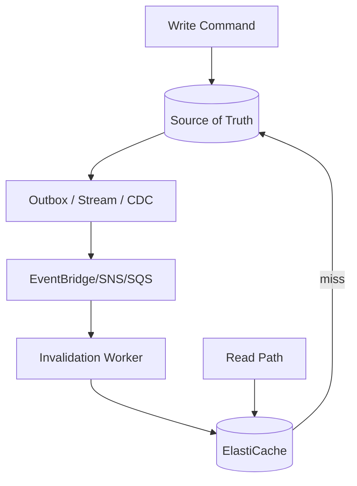
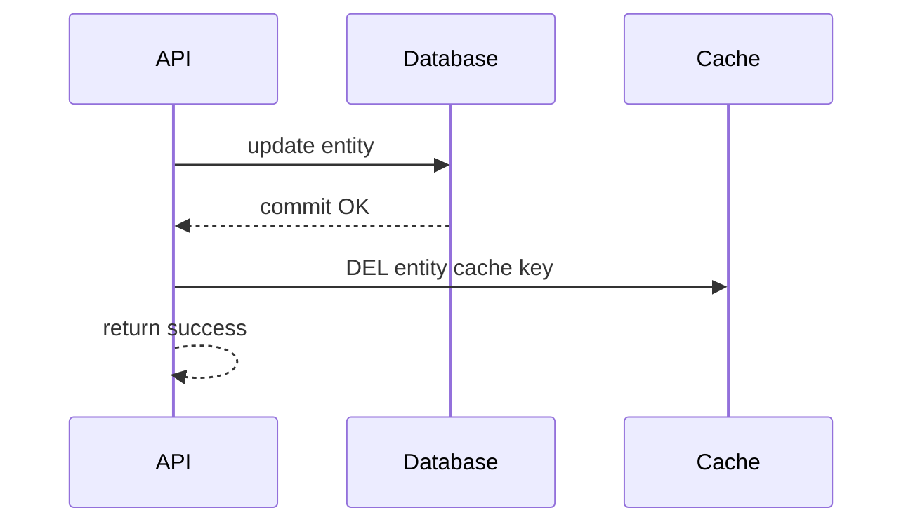
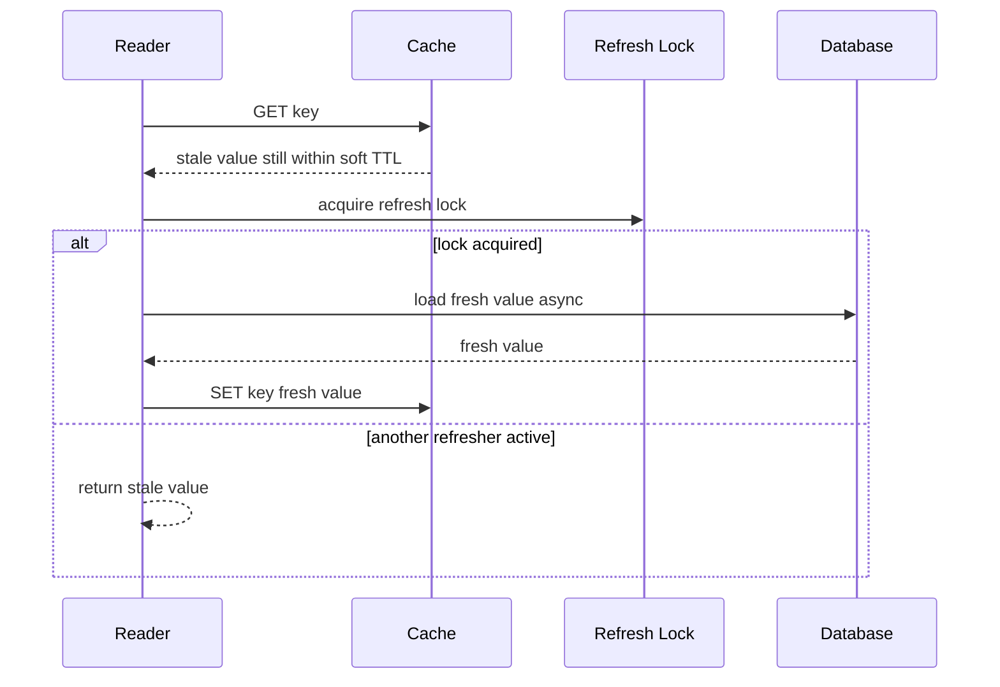
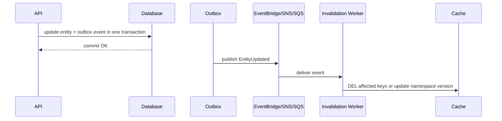
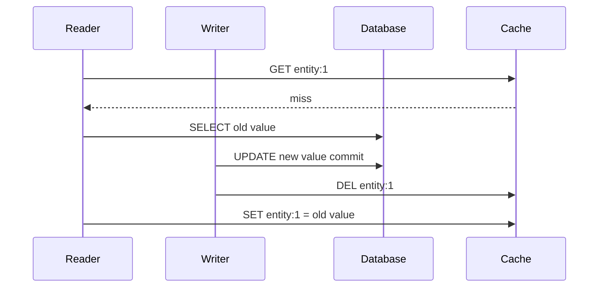
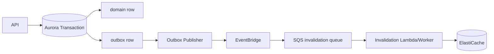
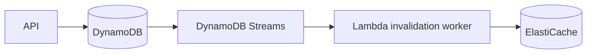

# Part 084 — Cache Invalidation: Versioned Key, Event-Driven Eviction, Stale-While-Revalidate

> **Core idea:** cache invalidation bukan masalah “hapus key setelah update”. Ini adalah masalah **distributed correctness**: siapa owner data, kapan stale data boleh terlihat, bagaimana invalidation dikirim, bagaimana duplicate/out-of-order event ditangani, dan bagaimana sistem tetap aman ketika cache atau event pipeline gagal.

---

## 1. Tujuan Pembelajaran

Setelah bagian ini, kamu harus bisa:

1. Mendesain cache invalidation berdasarkan **staleness budget**, bukan feeling.
2. Memilih antara TTL-only, delete-on-write, write-through, versioned key, namespace version, event-driven invalidation, dan stale-while-revalidate.
3. Menghindari bug klasik: cache resurrecting stale data, lost invalidation, out-of-order event, stampede, dan stale authorization.
4. Menghubungkan invalidation dengan AWS primitives: ElastiCache, DynamoDB Streams, RDS outbox, EventBridge, SNS, SQS, Lambda worker.
5. Membuat observability dan runbook untuk cache correctness.

---

## 2. Cache Invalidation sebagai Contract

Cache invalidation harus menjawab empat pertanyaan:

```txt
1. Source of truth-nya apa?
2. Siapa allowed writer source of truth?
3. Berapa lama stale data boleh terlihat?
4. Apa yang terjadi jika invalidation gagal?
```

Kalau empat pertanyaan ini tidak jelas, strategi invalidation apa pun hanya kebetulan bekerja.



Rule utama:

```txt
Cache is not the truth unless intentionally designed as truth.
```

Jika cache adalah derived state, selalu desain cara membuang, membangun ulang, dan memverifikasi ulang cache.

---

## 3. Staleness Budget

Staleness budget adalah durasi stale data yang masih benar secara bisnis.

| Data | Staleness budget | Strategy umum |
|---|---:|---|
| Product catalog description | menit/jam | TTL + event invalidation |
| User profile display name | detik/menit | delete-on-write + TTL |
| Case status enforcement | hampir 0 | read source of truth atau versioned read |
| Authorization/permission | sangat rendah | short TTL + version/epoch + forced invalidation |
| Rate limit counter | no stale for write path | atomic counter in cache/MemoryDB or DynamoDB conditional write |
| Leaderboard | detik | write-through/update index |
| Search result projection | detik/menit | event-driven rebuild/projection |

Jangan memakai TTL 1 jam untuk data yang secara domain hanya boleh stale 5 detik.

---

## 4. Taxonomy Strategi Invalidation

### 4.1 TTL-only

Cache entry expire otomatis.

```txt
read miss -> load DB -> SET key value EX ttl
```

Kapan cocok:

- Data jarang berubah.
- Stale data dapat diterima sampai TTL.
- Invalidation event tidak worth complexity.

Risiko:

- Stale data terlihat sampai TTL habis.
- Banyak key expire bersamaan bisa menyebabkan stampede.
- TTL panjang menyembunyikan bug update.

Mitigasi:

- Gunakan TTL jitter.
- Gunakan stale-while-revalidate untuk hot key.
- Gunakan manual invalidation untuk perubahan kritis.

AWS caching guidance menyebut cache-aside/lazy loading dan write-through sebagai dua pola umum; TTL sering dipakai untuk membatasi umur data cache.

---

### 4.2 Delete-on-write / invalidate-on-write

Setelah source of truth update sukses, hapus cache entry terkait.



Kapan cocok:

- Simple entity cache.
- Write path dan cache key mapping jelas.
- Staleness setelah write harus pendek.

Risiko:

- Jika `DEL` gagal setelah DB commit, stale cache bertahan.
- Jika cache diisi ulang oleh read race sebelum/selama commit, stale value bisa resurrect.
- Jika banyak derived keys, writer harus tahu terlalu banyak key.

Mitigasi:

- Invalidation worker async dari outbox/stream.
- Versioned keys.
- Short TTL as safety net.
- Reconciliation untuk key kritis.

AWS Prescriptive Guidance untuk integrasi DynamoDB-ElastiCache menyarankan write operation dapat secara proaktif meng-invalidate cache entries terkait agar cache tetap fresh tanpa menunggu TTL expire.

---

### 4.3 Write-through

Write path menulis database dan cache.

```txt
write DB -> write cache -> response
```

Kapan cocok:

- Cache entry hampir pasti segera dibaca.
- Write path bisa menanggung latency tambahan.
- Mapping source-to-cache 1:1 sederhana.

Risiko:

- Cache dipenuhi data yang mungkin tidak pernah dibaca.
- Partial failure DB/cache harus ditangani.
- Write latency meningkat.

DAX untuk DynamoDB adalah contoh managed write-through cache: write API melalui DAX memodifikasi DynamoDB dan DAX item cache.

---

### 4.4 Refresh-ahead

Cache di-refresh sebelum TTL habis.

Kapan cocok:

- Hot keys predictable.
- Miss latency mahal.
- Staleness boleh sedikit.

Risiko:

- Refresh job bisa membebani DB.
- Jika refresh gagal diam-diam, stale data bisa bertahan.

---

### 4.5 Stale-while-revalidate

Read path boleh mengembalikan stale value sebentar sambil satu worker refresh di background.



Kapan cocok:

- Availability lebih penting dari absolute freshness.
- Hot key mahal jika miss bersamaan.
- UI/read-only data dapat tolerate stale.

Risiko:

- Tidak cocok untuk authorization critical path.
- Soft TTL/hard TTL harus jelas.
- Refresh lock harus punya TTL.

---

### 4.6 Versioned key

Alih-alih update key yang sama, cache key memasukkan version.

```txt
case:CASE-123:v42:summary
case:CASE-123:v43:summary
```

Read path harus tahu current version dari source/metadata.

Kapan cocok:

- Read-your-writes penting.
- Old value tidak boleh accidentally served after update.
- Cache deletion tidak boleh menjadi correctness dependency.

Risiko:

- Old keys menumpuk sampai TTL/lifecycle cleanup.
- Butuh cara mendapatkan current version.

Pattern:

```txt
DB row: case_id, version, status, updated_at
cache key: case:{id}:v{version}
```

Read flow:

```txt
1. read lightweight current version from DB/projection
2. GET cache with versioned key
3. miss -> load exact version data -> SET versioned key
```

---

### 4.7 Namespace version / epoch invalidation

Satu namespace version dipakai untuk membatalkan banyak key sekaligus.

```txt
tenant:T1:cache_epoch = 17
case key = tenant:T1:v17:case:CASE-123:summary
```

Ketika perubahan massal terjadi:

```txt
INCR tenant:T1:cache_epoch
```

Semua key lama menjadi tidak digunakan tanpa perlu scan/delete.

Kapan cocok:

- Permission/role berubah massal.
- Tenant-level configuration berubah.
- Banyak derived keys tidak mudah dilacak satu per satu.

Risiko:

- Cold cache wave setelah epoch berubah.
- Epoch lookup bisa menjadi hot key.
- Harus ada cleanup TTL untuk namespace lama.

---

### 4.8 Event-driven invalidation

Write source of truth menghasilkan event; worker menghapus/refresh cache.



Kapan cocok:

- Banyak services/read models memakai cache.
- Writer tidak boleh tahu semua cache keys.
- Invalidation perlu reliable retry/DLQ.
- Cache invalidation perlu audit trail.

Risiko:

- Event delivery delay membuat stale window.
- Duplicate event harus idempotent.
- Out-of-order event bisa menghapus/menulis key salah.
- Lost event harus bisa dideteksi dengan reconciliation.

---

## 5. Strategy Decision Matrix

| Requirement | Strategy awal |
|---|---|
| Data jarang berubah, stale boleh lama | TTL-only + jitter |
| Entity cache sederhana, stale harus pendek | delete-on-write + short TTL |
| Hot entity, deletion race berbahaya | versioned key |
| Banyak key tergantung tenant/config | namespace epoch |
| Banyak consumer/cache tersebar | event-driven invalidation |
| Availability > freshness | stale-while-revalidate |
| Authorization critical | short TTL + epoch/version + source check untuk critical action |
| Query projection mahal | event-driven refresh + reconciliation |
| Writes sangat sering | Hindari write-through global; pakai targeted invalidation/versioning |

---

## 6. The Dangerous Race: Cache Resurrects Old Value

Skenario klasik:



Setelah `DEL`, reader lama menulis value lama ke cache. Stale value hidup sampai TTL.

Mitigasi:

1. Versioned keys.
2. Compare-and-set cache write dengan version.
3. Short TTL untuk cache-aside sederhana.
4. Soft TTL + background refresh.
5. Source version check sebelum SET.

Pseudo-safe cache set:

```java
record EntitySnapshot(String id, long version, String payload) {}

EntitySnapshot snapshot = db.loadEntity(id);
String key = "entity:%s:v%d".formatted(id, snapshot.version());

String cached = redis.get(key);
if (cached != null) {
    return deserialize(cached);
}

// SET exact version key; no stale overwrite of newer version key is possible.
redis.setex(key, ttlSecondsWithJitter(), serialize(snapshot));
return snapshot;
```

---

## 7. Invalidation Event Contract

Invalidation event bukan domain event mentah. Ia harus cukup spesifik untuk cache impact.

```json
{
  "eventId": "evt-01J...",
  "eventType": "CacheInvalidationRequested",
  "source": "case-service",
  "occurredAt": "2026-07-07T09:20:00Z",
  "entityType": "Case",
  "entityId": "CASE-123",
  "tenantId": "T-001",
  "newVersion": 43,
  "affectedKeyPatterns": [
    "case:{entityId}:*",
    "tenant:{tenantId}:case-list:*"
  ],
  "reason": "CaseStatusChanged",
  "correlationId": "corr-123"
}
```

Better: jangan publish raw wildcard lalu worker melakukan expensive scan. Gunakan explicit key derivation atau namespace epoch.

### 7.1 Idempotency

Event worker harus aman menerima event yang sama berkali-kali.

```txt
DEL key is idempotent.
SET epoch to max(current, event.version) is idempotent.
SET cache to old value is not safe unless version-guarded.
```

### 7.2 Ordering

Out-of-order event bisa terjadi.

Bad:

```txt
event v43 processed -> cache updated v43
event v42 processed later -> cache updated v42
```

Safe pattern:

```txt
only apply event if event.version >= current_cache_version
or use versioned keys and never overwrite generic key with stale version
```

---

## 8. AWS Mapping Patterns

### 8.1 Aurora/RDS + outbox + ElastiCache



Use when:

- DB write and event creation must be atomic.
- Cache invalidation is asynchronous but reliable.
- DLQ/replay/reconciliation are needed.

### 8.2 DynamoDB Streams + ElastiCache



Use when:

- DynamoDB table is source of truth.
- Cache keys can be derived from changed item.
- Stream consumer is idempotent and handles lag.

Remember: DynamoDB Streams retention is finite; do not use it as your only permanent audit log.

### 8.3 EventBridge fanout invalidation

Use when multiple cache consumers exist. EventBridge rules can route to different invalidation workers.

```txt
EntityUpdated ->
  CaseSummaryCacheInvalidator
  TenantDashboardCacheInvalidator
  AuthorizationCacheEpochBumper
```

### 8.4 SQS for backpressure

Do not invoke invalidation worker directly if event bursts can overload cache or DB. Use SQS buffer.

```txt
EventBridge -> SQS -> bounded worker -> ElastiCache
```

---

## 9. Implementation Pattern: Cache-Aside with Versioned Key

```java
public final class CaseReadService {
    private final CaseRepository repository;
    private final RedisClient redis;

    public CaseSummary getCaseSummary(String caseId) {
        CaseVersion version = repository.getCurrentVersion(caseId);
        String key = "case:%s:v%d:summary".formatted(caseId, version.value());

        String cached = redis.get(key);
        if (cached != null) {
            return Json.decode(cached, CaseSummary.class);
        }

        CaseSummary summary = repository.loadSummary(caseId, version.value());
        redis.setEx(key, ttlWithJitterSeconds(300, 60), Json.encode(summary));
        return summary;
    }

    private long ttlWithJitterSeconds(long base, long jitter) {
        return base + ThreadLocalRandom.current().nextLong(jitter + 1);
    }
}
```

Properties:

- Generic stale overwrite is impossible because key includes version.
- Old cache naturally expires.
- DB lightweight version lookup remains in read path.
- Good for correctness; less good if DB version lookup itself is hot.

Optimization:

- Cache current version separately with very short TTL.
- Use namespace epoch for tenant-level version.
- Use projection table for current version if primary DB is heavy.

---

## 10. Implementation Pattern: Event-Driven Invalidation Worker

```java
public final class CacheInvalidationWorker {
    private final RedisClient redis;
    private final ProcessedEventStore processed;

    public void handle(CacheInvalidationEvent event) {
        if (!processed.tryStart(event.eventId())) {
            return; // duplicate event
        }

        try {
            for (String key : deriveKeys(event)) {
                redis.del(key);
            }

            for (NamespaceEpoch epoch : deriveEpochs(event)) {
                redis.setIfGreater(epoch.key(), epoch.version());
            }

            processed.markCompleted(event.eventId());
        } catch (TransientCacheException e) {
            processed.markRetryable(event.eventId(), e);
            throw e;
        } catch (Exception e) {
            processed.markFailed(event.eventId(), e);
            throw e;
        }
    }
}
```

Important details:

- `DEL` duplicate-safe.
- `SET epoch to max` duplicate/out-of-order-safe.
- Do not `SET cached payload` from invalidation event unless version-guarded.
- Keep DLQ and replay safe.

---

## 11. Authorization Cache Is Special

Authorization cache stale bug is not just UX bug. It can become security incident.

Safe design:

| Layer | Strategy |
|---|---|
| Read/display authorization | short TTL cache acceptable |
| Critical command authorization | source-of-truth or version/epoch guarded check |
| Role/permission update | bump user/tenant auth epoch |
| Emergency revoke | force source check or global deny list |
| Audit | log policy version used in decision |

Example key:

```txt
authz:user:U123:tenant:T1:epoch:19:permissions
```

When role changes:

```txt
INCR authz:user:U123:tenant:T1:epoch
```

Command log should include:

```json
{
  "actor": "U123",
  "action": "CASE_ASSIGN",
  "resource": "CASE-99",
  "authzPolicyVersion": "2026-07-07.3",
  "authzEpoch": 19,
  "decision": "ALLOW"
}
```

---

## 12. Negative Caching

Negative caching stores “not found” or “not allowed” results.

Useful when:

- Missing IDs are frequently requested.
- Expensive source lookup returns not found.
- Enumeration/spam attempts hit source DB.

Dangerous when:

- Entity can be created shortly after not-found.
- Permission can be granted shortly after denied.
- Negative TTL too long.

Pattern:

```txt
entity:CASE-123:not-found -> TTL 10s
permission:U1:CASE-123:deny -> TTL 3s or no cache for critical command
```

Never give negative cache the same TTL as stable positive cache unless domain guarantees it.

---

## 13. Cache Stampede Control

Stampede happens when many clients miss/expire hot key simultaneously.

Mitigations:

1. TTL jitter.
2. Single-flight lock.
3. Stale-while-revalidate.
4. Per-key refresh rate limit.
5. Prewarming top hot keys.
6. Backpressure to callers.
7. Circuit breaker for DB reload path.

### 13.1 Single-flight lock

```java
String lockKey = "lock:refresh:" + cacheKey;
boolean acquired = redis.setNxEx(lockKey, requestId, 5);

if (acquired) {
    try {
        Value fresh = loadFromSource();
        redis.setEx(cacheKey, ttlWithJitter(), serialize(fresh));
        return fresh;
    } finally {
        releaseLockIfOwner(lockKey, requestId);
    }
}

Value stale = redis.get(staleKey);
if (stale != null) return stale;

throw new RetryLaterException();
```

Caution:

- Lock must have TTL.
- Lock release must verify owner token.
- Do not use cache lock as business-critical distributed lock without stronger design.

---

## 14. Multi-Region Cache Invalidation

Multi-Region makes invalidation harder.

Questions:

| Question | Why it matters |
|---|---|
| Is cache regional or global? | Local cache may stay stale after remote write |
| Where is source of truth? | Prevents conflicting invalidation semantics |
| Is event bus replicated? | Lost/delayed event creates stale Region |
| Do keys include region? | Avoids accidental cross-region overwrite |
| Is epoch global? | Needed for authorization/config cache |
| What is failover behavior? | Client may hit Region with stale cache after failover |

Safe default:

```txt
Regional caches are disposable derived state.
On failover, either cold-start cache or validate epoch/version from source of truth.
```

---

## 15. Observability for Cache Correctness

Do not stop at hit rate.

| Metric | Meaning |
|---|---|
| cache.hit.count / miss.count | Effectiveness |
| cache.stale_served.count | SWR behavior |
| cache.refresh.count / error.count | Refresh health |
| cache.invalidation.event.received.count | Event pipeline health |
| cache.invalidation.failed.count | Correctness risk |
| cache.invalidation.lag.ms | Staleness risk |
| cache.namespace_epoch.bump.count | Mass invalidation signal |
| cache.key.version_mismatch.count | Out-of-order/stale risk |
| cache.db_reload.count | DB pressure |
| cache.stampede_prevented.count | Hot key protection |
| cache.authz.source_check.count | Security-critical fallback |

AWS ElastiCache guidance recommends collecting cache performance metrics together with latency and CPU utilization to understand TTL and application adjustments; ElastiCache provides CloudWatch metrics and commandstats-derived latency metrics.

### 15.1 Log invalidation decisions

```json
{
  "event": "cache_invalidation_applied",
  "sourceEventId": "evt-123",
  "entityType": "Case",
  "entityId": "CASE-123",
  "newVersion": 43,
  "strategy": "VERSIONED_KEY",
  "keysDeleted": 3,
  "epochsUpdated": 1,
  "lagMs": 812,
  "correlationId": "corr-abc"
}
```

---

## 16. Runbook: Stale Data Incident

### Symptom

User sees old case status after update.

### Triage questions

1. What is source of truth value?
2. What cache key was read?
3. Does key include version/epoch?
4. Was invalidation event created?
5. Was event delivered to invalidation worker?
6. Did worker delete/update the correct key?
7. Was stale value repopulated after deletion?
8. Is read path reading replica/projection stale source?
9. Is CDN/browser/client cache involved?
10. Is there multi-Region cache divergence?

### Containment

- Bypass cache for affected entity/tenant.
- Lower TTL for affected key class.
- Bump namespace epoch.
- Pause stale writer/backfill.
- Reprocess invalidation events from safe point.

### Recovery

- Delete affected key prefixes carefully.
- Rebuild hot keys gradually.
- Replay invalidation queue if idempotent.
- Run reconciliation between source and cache sample.
- Add test for exact race discovered.

---

## 17. Runbook: Cache Stampede

### Symptom

DB CPU spikes, cache miss rate spikes, API latency rises.

### Immediate action

1. Enable/raise stale-while-revalidate for non-critical keys.
2. Add temporary per-key single-flight guard.
3. Reduce request concurrency for expensive endpoints.
4. Increase TTL with jitter for safe key classes.
5. Disable mass cache clear jobs.
6. Apply tenant-level throttling if one tenant dominates.

### After incident

- Identify top missed keys.
- Add prewarming for hot set.
- Add refresh-ahead only for predictable hot keys.
- Add dashboard for key expiration bursts.
- Review deployment/job that invalidated too much.

---

## 18. Testing Matrix

| Test | Expected result |
|---|---|
| DB update succeeds, cache delete fails | TTL/event retry eventually removes stale entry |
| Invalidation event duplicated | Worker idempotent; no bad side effect |
| Invalidation event out of order | Older version cannot overwrite newer cache |
| Reader miss races with writer update | Versioned key prevents stale resurrection |
| Hot key expires under load | Single-flight/SWR prevents DB stampede |
| Authorization revoked | Critical command does not allow stale permission |
| Event pipeline down 10 minutes | Staleness alert fires; reconciliation possible |
| Tenant epoch bump | Old namespace no longer used |
| Cache cluster failover | Clients reconnect; app degrades safely |
| Multi-region failover | Cache validates version/epoch after failover |

---

## 19. Anti-Patterns

### 19.1 Clearing all cache after deploy

This creates cold-cache cascade and hides schema/versioning weakness. Use namespace version or targeted invalidation.

### 19.2 Relying only on TTL for critical correctness

TTL-only means stale data is intentionally allowed until expiry. That is unacceptable for many command/authorization paths.

### 19.3 Writer knows every derived cache key

This creates tight coupling. Prefer event-driven invalidation or namespace epoch.

### 19.4 Updating cache before DB commit

If DB commit fails, cache may expose state that never became truth.

### 19.5 Long TTL negative cache

A newly created entity or newly granted permission can remain invisible/denied.

### 19.6 Scan/delete wildcard in production path

Redis-style `KEYS` or broad scan/delete from hot write path can become an outage mechanism. Prefer deterministic keys, set-of-keys indexes, or epoch invalidation.

---

## 20. Production Checklist

### Contract

- [ ] Source of truth identified.
- [ ] Allowed writer identified.
- [ ] Staleness budget documented per key class.
- [ ] Cache key grammar versioned.
- [ ] TTL policy includes jitter.
- [ ] Negative cache TTL shorter than positive cache TTL unless proven safe.

### Invalidation

- [ ] Strategy selected per access pattern.
- [ ] DB commit happens before invalidation.
- [ ] Event-driven invalidation uses outbox/stream where correctness requires it.
- [ ] Worker idempotent.
- [ ] Out-of-order event safe.
- [ ] Namespace epoch available for mass invalidation.

### Failure

- [ ] Lost invalidation has TTL/reconciliation fallback.
- [ ] Cache stampede control implemented.
- [ ] Cache failure degrade mode defined.
- [ ] Authorization cache has critical-path fallback.
- [ ] Multi-Region cache behavior defined.

### Observability

- [ ] Hit/miss monitored.
- [ ] Invalidation lag monitored.
- [ ] Failed invalidation monitored.
- [ ] Stale served count monitored.
- [ ] DB reload rate monitored.
- [ ] Hot key/memory/eviction monitored.
- [ ] Runbook exists for stale data and stampede.

---

## 21. Engineering Heuristic

Cache invalidation yang aman biasanya mengikuti rumus ini:

```txt
Correctness = source_of_truth
            + explicit staleness_budget
            + versioned/epoch-aware key design
            + reliable invalidation path
            + TTL safety net
            + idempotent replayable worker
            + observability and reconciliation
```

Tanpa staleness budget, cache hanya optimisasi spekulatif. Tanpa versioning/epoch, invalidation mudah kalah oleh race. Tanpa reconciliation, kamu tidak tahu apakah cache masih merepresentasikan truth.

---

## 22. Referensi

- AWS Whitepaper — Database Caching Strategies Using Redis, Caching patterns: https://docs.aws.amazon.com/whitepapers/latest/database-caching-strategies-using-redis/caching-patterns.html
- AWS Prescriptive Guidance — Cache write behavior for DynamoDB and ElastiCache integration: https://docs.aws.amazon.com/prescriptive-guidance/latest/dynamodb-elasticache-integration/cache-write.html
- AWS Documentation — Amazon ElastiCache caching strategies: https://docs.aws.amazon.com/AmazonElastiCache/latest/dg/Strategies.html
- AWS Documentation — ElastiCache best practices and caching strategies: https://docs.aws.amazon.com/AmazonElastiCache/latest/dg/BestPractices.html
- AWS Documentation — DAX and DynamoDB consistency models: https://docs.aws.amazon.com/amazondynamodb/latest/developerguide/DAX.consistency.html
- AWS Documentation — Amazon ElastiCache Well-Architected Lens Performance Efficiency: https://docs.aws.amazon.com/AmazonElastiCache/latest/dg/PerformanceEfficiencyPillar.html
