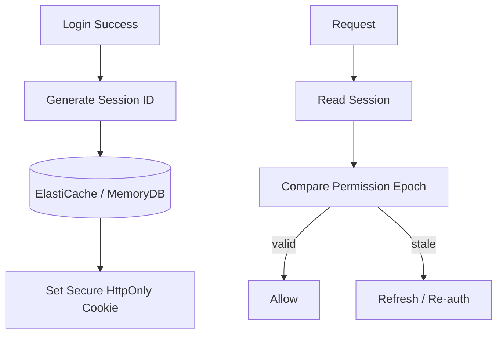
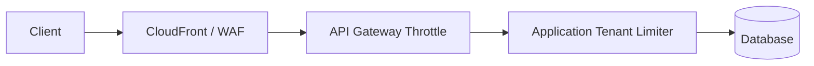
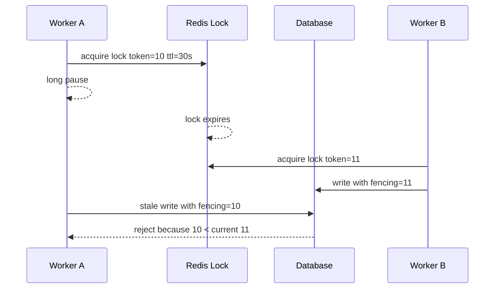

# Part 085 — Session State, Rate Limiting, Distributed Locking, and Token Bucket

> **Core idea:** session, rate limiter, dan lock sama-sama terlihat seperti “tinggal simpan key di Redis”. Di production, ketiganya adalah **coordination state**. Yang membedakan engineer matang adalah kemampuan menjawab: apakah state ini boleh hilang, boleh stale, butuh atomicity, butuh durability, butuh fencing token, dan apa dampaknya ketika cache failover?

---

## 1. Tujuan Pembelajaran

Setelah bagian ini, kamu harus bisa:

1. Mendesain server-side session store yang aman, scalable, dan punya lifecycle jelas.
2. Memilih rate limiting primitive: API Gateway throttling, WAF, Redis/Valkey, DynamoDB, atau local limiter.
3. Mengimplementasikan token bucket secara atomic tanpa race condition.
4. Menghindari distributed lock yang memberikan rasa aman palsu.
5. Mendesain lease dengan TTL, fencing token, idempotency, dan recovery path.
6. Menentukan kapan ElastiCache cukup, kapan MemoryDB/DynamoDB/Aurora lebih tepat.

---

## 2. Mental Model: Coordination State

Coordination state adalah state kecil yang dipakai untuk mengatur perilaku sistem lain.

Contoh:

| Use case | State | Risiko jika salah |
|---|---|---|
| Session | `session:{sid}` | user logout tidak efektif, session fixation, stale permission |
| Rate limiter | `rl:{tenant}:{window}` | noisy tenant merusak semua tenant, false reject, cost spike |
| Token bucket | `bucket:{tenant}` | limit tidak akurat, burst tidak terkendali |
| Lock | `lock:{resource}` | double processing, lost update, dead worker menahan resource |
| Lease | `lease:{aggregate}` | dua worker merasa sama-sama owner |
| Fencing token | monotonic number | stale worker tetap menulis setelah lease hilang |

Rule:

```txt
Coordination state is not harmless because the value is small.
Small state can control large blast radius.
```

---

## 3. Service Selection

Tidak semua coordination state cocok ditaruh di ElastiCache.

| Requirement | Candidate | Reasoning |
|---|---|---|
| Ultra-low latency, state boleh hilang, mudah rebuild | ElastiCache Valkey/Redis OSS | cache/session/rate counter umum |
| In-memory API tapi durable primary state | MemoryDB | ketika loss coordination state tidak boleh terjadi |
| Stronger conditional write, durable lease, audit trail | DynamoDB | conditional write + TTL + stream + history |
| Transactional lock tied to relational aggregate | Aurora/RDS | row lock, optimistic version, uniqueness constraint |
| Edge/API-level coarse throttling | API Gateway/WAF | protection sebelum masuk application |
| Workflow ownership | Step Functions | durable orchestration state |

Decision shortcut:

```txt
If losing the key is acceptable -> ElastiCache.
If losing the key can violate correctness -> DynamoDB/Aurora/MemoryDB with explicit design.
If the key controls irreversible side effects -> require idempotency + fencing.
```

---

## 4. Session State Pattern

### 4.1 Stateless vs server-side session

Ada dua style umum.

| Style | Cara kerja | Kelebihan | Risiko |
|---|---|---|---|
| Stateless token | token menyimpan claim | tidak butuh lookup session | sulit revoke cepat, claim stale |
| Server-side session | cookie hanya session id | revoke mudah, data bisa kecil | perlu store, TTL, failover design |

Untuk sistem regulasi, enforcement, case management, atau aplikasi internal sensitif, server-side session sering lebih defensible karena session bisa dicabut, diaudit, dan dipaksa refresh.

### 4.2 Session schema

Contoh key:

```txt
sess:{sessionId}
user_sessions:{userId}
session_version:{userId}
```

Contoh value:

```json
{
  "userId": "u-123",
  "tenantId": "t-001",
  "issuedAt": "2026-07-07T10:00:00Z",
  "expiresAt": "2026-07-07T18:00:00Z",
  "lastSeenAt": "2026-07-07T10:05:00Z",
  "authLevel": "mfa",
  "permissionEpoch": 42,
  "deviceId": "d-abc",
  "ipHash": "...",
  "userAgentHash": "..."
}
```

Jangan masukkan semua permission detail besar ke session. Masukkan **epoch/version** agar permission change bisa memaksa refresh.



### 4.3 TTL strategy

Gunakan dua konsep:

```txt
absolute expiry  = batas maksimum hidup session
idle expiry      = batas inactivity
```

Jangan hanya sliding expiration tanpa absolute maximum; itu membuat session bisa hidup terlalu lama.

Contoh:

| Field | Nilai contoh | Tujuan |
|---|---:|---|
| Absolute TTL | 8 jam | membatasi lifetime |
| Idle TTL | 30 menit | logout otomatis inactivity |
| Permission epoch | integer | revoke/role change cepat |
| Device binding | optional | mengurangi token reuse |

### 4.4 Session invalidation

Operasi penting:

```txt
logout current session       -> delete sess:{sid}
logout all devices           -> increment session_version:{userId}
permission changed           -> increment permission_epoch:{userId}
account disabled             -> add deny flag / increment epoch / delete sessions
```

Untuk logout-all, jangan scan semua `sess:*`. Simpan reverse index `user_sessions:{userId}` atau gunakan epoch strategy.

---

## 5. Rate Limiting Layers

Rate limiting tidak selalu harus di Redis.



Layering umum:

| Layer | Cocok untuk | Tidak cocok untuk |
|---|---|---|
| AWS WAF rate-based rule | coarse abuse protection | tenant-specific business quota detail |
| API Gateway throttling/usage plan | API-level throttling | complex hierarchical limits |
| App + Redis/Valkey | tenant/user/resource quota | hard financial/legal correctness tanpa fallback |
| DynamoDB conditional counter | durable quota, auditability | extremely high-frequency low-latency limit tanpa cost analysis |
| Local in-memory limiter | protect process | global distributed fairness |

Rule:

```txt
Put coarse protection early. Put business-specific fairness near the application.
```

---

## 6. Rate Limiting Algorithms

| Algorithm | Mental model | Kelebihan | Risiko |
|---|---|---|---|
| Fixed window | count per window | simple | boundary burst |
| Sliding window log | track timestamps | accurate | memory grows with requests |
| Sliding window counter | approximate weighted windows | balanced | approximation |
| Token bucket | tokens refill over time | allows controlled burst | needs atomic update |
| Leaky bucket | smooth output rate | stable downstream | can add latency/queueing |

Untuk API workloads, token bucket sering menjadi default yang baik karena mengizinkan burst terbatas tanpa membiarkan tenant liar menghancurkan downstream.

---

## 7. Token Bucket Model

State bucket:

```txt
bucket:{tenant}:{route}
  tokens          current available tokens
  last_refill_ms  last refill timestamp
```

Parameters:

```txt
capacity     maximum tokens
refill_rate  tokens per second
cost         tokens consumed by this request
```

Decision:

```txt
new_tokens = min(capacity, tokens + elapsed_seconds * refill_rate)
if new_tokens >= cost:
  allow and decrement
else:
  reject with retry_after
```

Invariant:

```txt
tokens must never be updated non-atomically.
```

---

## 8. Redis/Valkey Token Bucket with Lua

Pseudo Lua:

```lua
local key = KEYS[1]
local now_ms = tonumber(ARGV[1])
local capacity = tonumber(ARGV[2])
local refill_rate = tonumber(ARGV[3])
local cost = tonumber(ARGV[4])
local ttl_ms = tonumber(ARGV[5])

local data = redis.call('HMGET', key, 'tokens', 'last_refill_ms')
local tokens = tonumber(data[1])
local last = tonumber(data[2])

if tokens == nil then
  tokens = capacity
  last = now_ms
end

local elapsed = math.max(0, now_ms - last) / 1000
local refill = elapsed * refill_rate
tokens = math.min(capacity, tokens + refill)

local allowed = 0
local retry_after_ms = 0

if tokens >= cost then
  tokens = tokens - cost
  allowed = 1
else
  local missing = cost - tokens
  retry_after_ms = math.ceil((missing / refill_rate) * 1000)
end

redis.call('HMSET', key, 'tokens', tokens, 'last_refill_ms', now_ms)
redis.call('PEXPIRE', key, ttl_ms)

return {allowed, tokens, retry_after_ms}
```

Application behavior:

```txt
allowed=1 -> process request
allowed=0 -> return HTTP 429 + Retry-After
Redis unavailable -> fail-open or fail-closed based on route criticality
```

---

## 9. Hierarchical Rate Limits

Real systems rarely have one limit.

Example:

```txt
global route limit
  tenant limit
    user limit
      resource-specific limit
```

Decision model:

```txt
request allowed only if all required buckets allow
```

Problem: consuming multiple buckets must be atomic enough.

Options:

1. Single Lua script with all keys in same hash slot.
2. Approximate local limiter before global limiter.
3. Coarse global limit in API Gateway/WAF, precise tenant limit in Redis.
4. Durable quota in DynamoDB for expensive operations.

Redis Cluster key hash tags help place related keys in same slot:

```txt
rl:{tenant-123}:global
rl:{tenant-123}:route:/cases/search
rl:{tenant-123}:user:u-99
```

---

## 10. Fail-Open vs Fail-Closed

When rate limiter store is unavailable:

| Route type | Default posture | Reasoning |
|---|---|---|
| Public unauthenticated expensive endpoint | fail-closed or degraded | protect system |
| Internal admin low volume | fail-open with audit | availability may matter more |
| Payment/irreversible command | fail-closed or fallback durable check | financial/correctness risk |
| Read-only cached endpoint | fail-open with local limiter | user impact lower |
| Regulatory action endpoint | fail-closed or require durable quota | defensibility |

Explicitly encode posture per route. Jangan biarkan exception handler menentukan policy secara tidak sengaja.

---

## 11. Distributed Lock: Use with Suspicion

Distributed lock sering dipakai untuk menyembunyikan data modeling yang lemah.

Sebelum memakai lock, tanya:

```txt
Can this be solved with a unique constraint?
Can this be solved with conditional write?
Can this be solved with idempotency key?
Can this be solved with SQS FIFO MessageGroupId?
Can this be solved with Step Functions execution name?
Can this be solved with database transaction isolation?
```

Jika jawabannya ya, gunakan primitive yang lebih dekat ke source of truth.

---

## 12. Simple Redis Lock Pattern

Minimum safe pattern:

```txt
SET lock:{resourceId} {random-owner-token} NX PX 30000
```

Unlock harus membandingkan value:

```lua
if redis.call('GET', KEYS[1]) == ARGV[1] then
  return redis.call('DEL', KEYS[1])
else
  return 0
end
```

Kenapa perlu owner token?

```txt
Worker A acquire lock with TTL 30s
Worker A pauses for 40s
Lock expires
Worker B acquire lock
Worker A resumes and deletes lock
Without owner token, A can delete B's lock
```

Tetapi ini masih belum cukup untuk hard correctness.

---

## 13. Fencing Token

Masalah terbesar lock TTL adalah stale owner.



Fencing token adalah monotonic value yang dikirim ke resource yang dilindungi. Resource harus menolak token lama.

Tanpa fencing token:

```txt
Lock only says who probably owned the right recently.
It does not prove the worker is still safe to write.
```

---

## 14. Durable Lease with DynamoDB

Untuk correctness yang lebih kuat, lease bisa disimpan di DynamoDB.

Table:

```txt
PK = resourceId
ownerId
fencingToken
leaseExpiresAt
version
updatedAt
```

Acquire condition:

```txt
attribute_not_exists(PK) OR leaseExpiresAt < :now
```

Renew condition:

```txt
ownerId = :ownerId AND fencingToken = :token
```

Write protected resource condition:

```txt
incomingFencingToken >= currentFencingToken
```

Pseudo flow:

```txt
1. worker tries conditional acquire
2. acquire increments fencing token
3. worker performs work
4. protected write validates fencing token
5. worker releases or lets lease expire
```

Trade-off:

| Redis lock | DynamoDB lease |
|---|---|
| lower latency | stronger durability/audit |
| simpler | conditional write cost |
| risky for hard correctness unless fenced | better for business-critical ownership |

---

## 15. SQS FIFO as Lock Alternative

Jika tujuan lock adalah “jangan proses aggregate yang sama secara paralel”, SQS FIFO sering lebih baik.

```txt
MessageGroupId = aggregateId
```

Effect:

```txt
Messages for same aggregate processed in order.
Different aggregates can process concurrently.
```

Use when:

| Good fit | Bad fit |
|---|---|
| per-aggregate sequential command processing | arbitrary shared resource locking |
| event/command queue already exists | synchronous low-latency path |
| eventual processing acceptable | direct user request needs immediate result |

---

## 16. Step Functions as Ownership Alternative

Jika tujuan lock adalah “satu workflow instance per business process”, gunakan deterministic execution name.

```txt
executionName = case-{caseId}-appeal-{appealId}
```

Dengan Standard Workflow, `StartExecution` idempotent ketika name dan input sama untuk execution yang masih berjalan. Ini bukan pengganti semua lock, tetapi sering lebih tepat untuk long-running process.

---

## 17. Session + Rate Limit + Lock Combined Example

Use case: submit enforcement action.

```mermaid
flowchart TD
  Req[POST /cases/{id}/actions] --> Sess[Validate Session]
  Sess --> Rate[Token Bucket: tenant + user + route]
  Rate --> Cmd[Idempotent Command Handler]
  Cmd --> Lease[Acquire Case Lease / DB Row Version]
  Lease --> DB[(Aurora/DynamoDB Source of Truth)]
  DB --> Outbox[Outbox Event]
  Outbox --> Bus[EventBridge/SQS]
```

Correctness boundaries:

| Boundary | Primitive |
|---|---|
| user is allowed | session + permission epoch |
| tenant is fair | token bucket |
| command not duplicated | idempotency key |
| case not concurrently mutated incorrectly | DB version / conditional write / durable lease |
| side effect not duplicated | outbox + idempotent consumer |

Notice: rate limiter is not the correctness primitive for case mutation. It only protects capacity/fairness.

---

## 18. Observability

### 18.1 Session metrics

| Metric | Meaning |
|---|---|
| session lookup latency | cache health/user impact |
| session miss rate | expiry, failover, app bug |
| permission epoch mismatch | expected after role change, suspicious if spike |
| forced re-auth count | security posture |
| session store errors | availability risk |

### 18.2 Rate limiter metrics

| Metric | Meaning |
|---|---|
| allowed/rejected count by route/tenant | fairness and abuse |
| retry_after distribution | user impact |
| limiter store latency | Redis/DynamoDB health |
| fail-open count | hidden risk |
| fail-closed count | availability/user impact |
| hot limiter key | tenant/resource skew |

### 18.3 Lock/lease metrics

| Metric | Meaning |
|---|---|
| acquire success/failure | contention |
| wait time | throughput bottleneck |
| lease expiry while processing | worker slow/pause |
| fencing rejection | stale worker detected |
| orphan lease count | crash/recovery problem |
| duplicate owner detected | correctness incident |

---

## 19. Failure Modes

| Failure | Symptom | Mitigation |
|---|---|---|
| Redis failover during session read | login storms, session miss | retry, re-auth path, short outage UX |
| limiter unavailable | unlimited traffic or all blocked | explicit fail-open/closed policy |
| token bucket clock skew | wrong refill | use server-side time when possible or bounded skew |
| non-atomic counter | limit bypass | Lua/transaction/conditional write |
| lock TTL too short | duplicate worker | renew/heartbeat + fencing |
| lock TTL too long | slow recovery | bounded TTL + runbook |
| stale worker writes after lock expiry | data corruption | fencing token at write target |
| session permission stale | unauthorized access | permission epoch/version |
| session scan for logout-all | operational meltdown | reverse index or epoch strategy |

---

## 20. Production Checklist

Before shipping:

```txt
[ ] Every coordination key has documented owner and TTL.
[ ] Every limiter has explicit fail-open/fail-closed policy.
[ ] Rate limiting is layered: edge/API/app where appropriate.
[ ] Token bucket update is atomic.
[ ] Hierarchical limits do not create cross-slot non-atomic bugs accidentally.
[ ] Session contains version/epoch for permission/session invalidation.
[ ] Logout-all does not require scanning all sessions.
[ ] Locks are avoided where conditional write/queue/workflow can solve the problem.
[ ] Any lock protecting correctness uses fencing token.
[ ] Protected resource rejects stale fencing token.
[ ] Lease expiry and renew behavior are tested.
[ ] Metrics exist for rejection, latency, fail-open, contention, and stale-owner rejection.
[ ] Runbook exists for limiter store outage and lock contention incident.
```

---

## 21. Anti-Patterns

1. **Using Redis lock without fencing token for financial/business correctness.**
2. **Putting full authorization snapshot in long-lived session.**
3. **Using fixed window limiter without considering boundary burst.**
4. **Failing open silently for expensive public endpoint.**
5. **Failing closed silently for internal critical operations without incident signal.**
6. **Scanning `sess:*` in production to revoke sessions.**
7. **Using lock to compensate for missing idempotency.**
8. **Using cache TTL as business authorization lifecycle.**
9. **Letting tenant-level hot key overload a shared limiter.**
10. **Treating session/rate/lock state as invisible infrastructure instead of audited control state.**

---

## 22. Key Takeaways

1. Session, limiter, and lock are not random Redis keys; they are coordination state.
2. ElastiCache is excellent for low-latency coordination where loss/staleness is acceptable or mitigated.
3. Durable correctness usually belongs in DynamoDB, Aurora/RDS, MemoryDB, SQS FIFO, or Step Functions depending on the boundary.
4. Token bucket must be atomic.
5. Distributed lock without fencing token is unsafe for hard correctness.
6. Explicit failure posture is part of the design, not an implementation detail.

---

## 23. References

- AWS ElastiCache documentation — What is Amazon ElastiCache: https://docs.aws.amazon.com/AmazonElastiCache/latest/dg/WhatIs.html
- AWS ElastiCache best practices: https://docs.aws.amazon.com/AmazonElastiCache/latest/dg/BestPractices.html
- AWS ElastiCache client best practices for Valkey and Redis OSS: https://docs.aws.amazon.com/AmazonElastiCache/latest/dg/BestPractices.Clients.redis.html
- AWS ElastiCache client timeout guidance: https://docs.aws.amazon.com/AmazonElastiCache/latest/dg/BestPractices.Clients.Redis.ClientTimeout.html
- AWS ElastiCache cluster discovery and exponential backoff: https://docs.aws.amazon.com/AmazonElastiCache/latest/dg/BestPractices.Clients.Redis.Discovery.html
- Redis distributed locks documentation: https://redis.io/docs/latest/develop/clients/patterns/distributed-locks/
- AWS DynamoDB conditional writes: https://docs.aws.amazon.com/amazondynamodb/latest/developerguide/Expressions.ConditionExpressions.html
- AWS Step Functions StartExecution API: https://docs.aws.amazon.com/step-functions/latest/apireference/API_StartExecution.html
