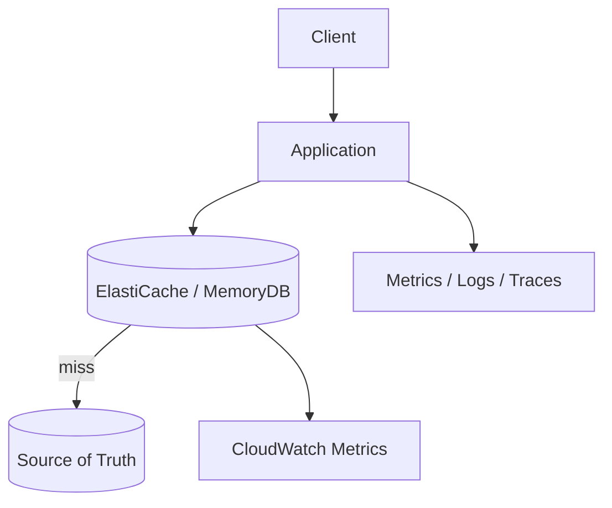
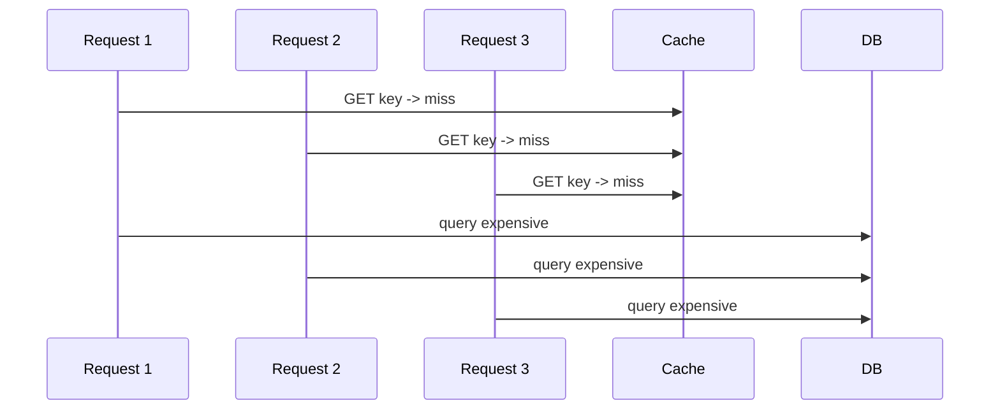

# Part 086 — Cache Operability: Eviction, Memory Pressure, Stampede, Hot Key, Failover

> **Core idea:** cache biasanya ditambahkan untuk membuat sistem lebih cepat. Di production, cache sering menjadi komponen yang membuat sistem lebih rapuh jika operability-nya lemah. Cache yang sehat menurunkan latency. Cache yang sakit menciptakan database storm, stale data, connection exhaustion, dan incident yang sulit dibedakan dari database problem.

---

## 1. Tujuan Pembelajaran

Setelah bagian ini, kamu harus bisa:

1. Membaca sinyal kesehatan ElastiCache/Redis/Valkey dari metric utama.
2. Membedakan eviction normal, memory pressure, fragmentation, hot key, stampede, dan connection storm.
3. Mendesain alarm yang actionable, bukan noise.
4. Membuat runbook untuk cache hit-rate collapse, failover, eviction spike, dan stale data incident.
5. Mendesain client behavior yang aman saat cluster failover, timeout, dan slot topology berubah.
6. Menentukan apakah cache outage harus fail-open, fail-closed, atau degraded.

---

## 2. Operability Mental Model

Cache berada di jalur panas.



Ketika cache bermasalah, efeknya tidak berhenti di cache.

```txt
cache latency naik -> app thread menunggu -> connection pool penuh
cache miss naik    -> database QPS naik -> DB latency naik
cache failover     -> client reconnect storm -> CPU/network spike
cache eviction     -> hit rate turun -> source of truth dihantam
hot key            -> satu shard/node bottleneck meskipun cluster besar
```

Rule:

```txt
A cache incident is often a database incident in disguise.
```

---

## 3. Critical Metrics

AWS merekomendasikan alarm untuk metrik seperti CPU, engine CPU, swap, evictions, connections, memory, network latency, replication, dan traffic management pada ElastiCache.

| Metric | Baca sebagai | Risiko |
|---|---|---|
| `CPUUtilization` | host CPU | node overload, network/I/O pressure |
| `EngineCPUUtilization` | Redis/Valkey engine CPU | command hot path, single-thread pressure |
| `DatabaseMemoryUsagePercentage` / memory metrics | memory pressure | eviction, OOM, latency |
| `Evictions` | key dibuang karena memory pressure | hit rate drop, DB storm |
| `CurrConnections` | active client connections | connection leak/storm |
| `NewConnections` | churn/reconnect | failover, bad pooling |
| `CacheHitRate` | cache effectiveness | miss storm, invalidation issue |
| `ReplicationLag` | replica behind primary | stale read/failover risk |
| `NetworkBytesIn/Out` | traffic volume | hot key, large values |
| `BytesUsedForCache` | used memory | capacity trend |
| `SwapUsage` | host memory stress | severe performance risk |

Important distinction:

```txt
CPUUtilization high      -> host is busy.
EngineCPUUtilization high -> Redis/Valkey command execution is the bottleneck.
```

For Redis-like engines, one hot command pattern can saturate engine CPU even when cluster aggregate capacity looks fine.

---

## 4. Dashboard Layout

Minimum dashboard:

```txt
1. User-facing latency/error
2. Cache latency and command error
3. Hit rate / miss rate
4. Evictions and memory usage
5. Engine CPU and host CPU
6. Connections and new connections
7. Network throughput
8. Replication lag / failover events
9. DB QPS and DB latency
10. Top tenant/key family approximation from app telemetry
```

Dashboard must show cache and database together. Otherwise you will misdiagnose cache miss storm as “database suddenly slow”.

---

## 5. Eviction

Eviction means cache has reached memory pressure and removes keys according to `maxmemory-policy`.

Common policies:

| Policy | Meaning | Use carefully when |
|---|---|---|
| `noeviction` | reject writes when full | cache is not allowed to silently drop keys |
| `allkeys-lru` | evict least-recently-used among all keys | general cache-aside |
| `volatile-lru` | evict LRU only among keys with TTL | not all keys have TTL |
| `allkeys-lfu` | evict least-frequently-used | skewed workloads |
| `volatile-ttl` | evict keys near expiry | TTL-heavy cache |

If cache is purely derived state, eviction can be acceptable. If cache stores coordination/session state, eviction may log users out or break control behavior.

```txt
Cache data can be evicted.
Coordination state should be protected or moved to durable store.
```

---

## 6. Memory Pressure

Memory pressure sources:

| Source | Symptom | Fix |
|---|---|---|
| Too many keys | memory trend grows | TTL, namespace cleanup, capacity scale |
| Large values | network + memory high | compress, split, avoid giant blobs |
| No TTL | cache never drains | enforce TTL policy |
| Stampede fill | sudden memory jump | request coalescing, admission control |
| Fragmentation | memory used strange vs dataset | monitor, restart/scale if needed |
| Hot ephemeral keys | churn high | key design, batching |

Key question:

```txt
Is memory growth proportional to business growth, traffic spike, deployment bug, or missing TTL?
```

Run this investigation:

```txt
1. Did deployment change key schema or TTL?
2. Did hit rate fall before memory rose?
3. Did evictions start after a traffic event?
4. Is memory concentrated in one shard/node?
5. Did value size change?
6. Did background warming/backfill run?
```

---

## 7. Cache Stampede

Cache stampede happens when many requests miss the same key and all rebuild it concurrently.



Mitigations:

| Pattern | How it works | Trade-off |
|---|---|---|
| TTL jitter | randomize expiry | simple, approximate |
| Request coalescing | only one request rebuilds | needs local/distributed coordination |
| Stale-while-revalidate | serve stale while one refreshes | stale data allowed |
| Probabilistic refresh | refresh before expiry with probability | more complex |
| Background warming | precompute hot keys | may waste work |
| Admission control | only cache keys that prove hot | avoids memory pollution |

TTL jitter example:

```java
long baseTtlSeconds = 300;
long jitter = ThreadLocalRandom.current().nextLong(0, 60);
long ttl = baseTtlSeconds + jitter;
```

---

## 8. Stale-While-Revalidate

Value shape:

```json
{
  "payload": { "caseId": "C-123", "status": "OPEN" },
  "freshUntil": "2026-07-07T10:05:00Z",
  "serveUntil": "2026-07-07T10:10:00Z",
  "version": 17
}
```

Decision:

```txt
now < freshUntil -> serve
freshUntil <= now < serveUntil -> serve stale and trigger async refresh
now >= serveUntil -> block/rebuild or fail based on route policy
```

Use only when business allows bounded staleness.

Bad fit:

```txt
authorization decision
case finalization state
financial balance after transaction
legal deadline calculation
```

Good fit:

```txt
catalog display
dashboard counters
non-critical profile rendering
search suggestion metadata
```

---

## 9. Hot Key

Hot key means one key or key family receives disproportionate traffic.

Symptoms:

```txt
cluster has capacity but one node/shard is overloaded
EngineCPUUtilization high on one node
network out high on one node
latency spikes for one route/tenant
DB is fine but cache latency high
```

Common sources:

| Key | Why hot |
|---|---|
| `config:global` | every request reads it |
| `tenant:{id}:permissions` | large tenant fanout |
| `catalog:homepage` | public page spike |
| `rate:{tenant}:global` | noisy tenant limiter |
| `case:{id}:summary` | viral/internal bulk access |

Mitigations:

| Technique | When |
|---|---|
| local in-process cache | small config, short TTL |
| key replication | read-mostly hot keys |
| sharded counter | write-heavy counters |
| route-specific batching | repeated same lookup |
| CDN/edge cache | public read-heavy content |
| precomputed projection | expensive derived data |
| tenant isolation | noisy tenant risk |

Hot key sharding example for counter:

```txt
counter:{name}:shard:0
counter:{name}:shard:1
...
counter:{name}:shard:N
```

Read sums shards. Write picks shard by random or actor hash.

---

## 10. Large Values

Large values cause:

```txt
more network bytes
longer serialization/deserialization
higher memory fragmentation risk
slower replication
larger blast radius per miss
```

Guidelines:

```txt
Cache the view you need, not the entire aggregate graph.
Prefer stable schema and compact payload.
Avoid storing huge arrays that change partially.
Consider compression only after measuring CPU trade-off.
Split hot fields from cold fields.
```

Anti-pattern:

```txt
cache key: case:{id}
value: entire case graph + documents + comments + permissions + history
```

Better:

```txt
case:{id}:summary
case:{id}:timeline:page:{n}
case:{id}:permission-epoch
case:{id}:latest-action
```

---

## 11. Connection Operability

Client behavior can break cache even when cache capacity is enough.

AWS client guidance includes finite connection pool, client-side timeout, cluster discovery, retry with exponential backoff and jitter, and server-side idle timeout for idle connection buildup.

Production rules:

```txt
[ ] Use bounded connection pool.
[ ] Set connect timeout and command timeout.
[ ] Retry only safe commands.
[ ] Add exponential backoff with jitter.
[ ] Avoid unbounded async concurrency.
[ ] Handle MOVED/ASK/topology change if cluster mode enabled.
[ ] Avoid DNS cache settings that prevent failover discovery.
[ ] Emit client-side metrics, not only server metrics.
```

Connection storm pattern:

```txt
cache node failover -> clients disconnect -> all clients reconnect immediately -> new connections spike -> engine/host pressure -> command latency rises -> app retries -> worse storm
```

Mitigation:

```txt
bounded pool + jittered reconnect + circuit breaker + local degraded mode
```

---

## 12. Failover

During failover, expect:

```txt
short connection errors
timeouts
retries
possible topology refresh
some in-flight commands ambiguous
read replica promotion behavior
client reconnect storm
```

Application policy:

| Cache purpose | During failover |
|---|---|
| derived read cache | bypass cache temporarily, read DB with backpressure |
| session store | retry briefly, then controlled re-auth/degraded UX |
| rate limiter | explicit fail-open/closed per route |
| distributed lock | assume lock state uncertain; require fencing/durable verification |
| cache invalidation worker | retry; idempotent delete; reconcile later |

Do not assume failover is invisible to the application. Design the path.

---

## 13. Cache Hit-Rate Collapse Runbook

Symptoms:

```txt
CacheHitRate drops
DB QPS rises
API latency rises
Evictions may or may not rise
```

Immediate actions:

```txt
1. Check deployment timeline for key/TTL/schema change.
2. Check evictions and memory pressure.
3. Check invalidation event volume.
4. Check whether cache warming/backfill was disabled.
5. Check whether one tenant/key family caused churn.
6. Apply DB protection: throttle expensive routes, reduce worker concurrency, enable degraded cache path.
7. Restore previous key format or rollback deployment if needed.
```

Questions:

```txt
Is this cache empty, invalidated, evicted, bypassed, or using the wrong key?
```

---

## 14. Eviction Spike Runbook

Symptoms:

```txt
Evictions > 0 or sharply increasing
memory usage high
hit rate slowly or suddenly drops
```

Actions:

```txt
1. Identify whether eviction policy is expected.
2. Check memory usage per node/shard, not only cluster aggregate.
3. Check key cardinality and value size change after deployment.
4. Reduce TTL for low-value keys only if memory is dominated by stale data.
5. Disable or slow warming/backfill jobs.
6. Scale node memory or shard count if growth is legitimate.
7. For session/coordination keys, move critical state out of eviction-prone cache or isolate cluster.
```

Important:

```txt
Eviction of cache-aside data is a performance problem.
Eviction of session/lock/rate state can be correctness or security problem.
```

---

## 15. Hot Key Runbook

Symptoms:

```txt
one shard/node high CPU/network
route latency skewed
tenant-specific latency spike
command latency high despite normal aggregate capacity
```

Actions:

```txt
1. Use app telemetry to identify route + cache key family.
2. Compare per-node EngineCPUUtilization and network metrics.
3. Check whether key is read-hot or write-hot.
4. For read-hot: local cache, key replication, CDN, precompute.
5. For write-hot: sharded counter, queue aggregation, rate limit, redesign key.
6. Add tenant-level protection if one tenant dominates.
```

Do not blindly scale the cluster if only one key is hot. More capacity may not help unless traffic is redistributed.

---

## 16. Stampede Runbook

Symptoms:

```txt
miss spike followed by DB spike
same expensive query repeated
traffic aligned with TTL expiration
latency wave every N minutes
```

Actions:

```txt
1. Add TTL jitter.
2. Add request coalescing for hot keys.
3. Enable stale-while-revalidate where safe.
4. Protect DB with bounded concurrency.
5. Warm critical keys gradually, not all at once.
6. Add per-key rebuild metrics.
```

Request coalescing local sketch:

```java
CompletableFuture<Value> existing = inFlight.get(key);
if (existing != null) return existing;

CompletableFuture<Value> created = new CompletableFuture<>();
CompletableFuture<Value> previous = inFlight.putIfAbsent(key, created);
if (previous != null) return previous;

try {
  Value value = loadFromDb(key);
  cache.set(key, value, ttlWithJitter());
  created.complete(value);
  return created;
} catch (Throwable t) {
  created.completeExceptionally(t);
  throw t;
} finally {
  inFlight.remove(key);
}
```

---

## 17. Stale Data Incident Runbook

Symptoms:

```txt
user sees old state
cache value version older than DB version
invalidation worker lag
event replay happened
```

Actions:

```txt
1. Compare source-of-truth version vs cached version.
2. Check invalidation event was emitted after DB commit.
3. Check EventBridge/SNS/SQS/Lambda delivery and DLQ.
4. Check out-of-order invalidation if multiple updates occurred.
5. Delete exact keys or bump namespace epoch.
6. Reconcile affected aggregates.
7. Add version guard to cache set to avoid stale overwrite.
```

Stale overwrite prevention:

```txt
Only write cache if incoming version >= cached version.
```

For Redis/Valkey, use Lua if compare-and-set is required atomically.

---

## 18. Command Cost and Slow Commands

Expensive Redis-like commands can behave like table scans.

Avoid in request path:

```txt
KEYS *
large SMEMBERS
large LRANGE
large HGETALL for huge hash
unbounded Lua scripts
blocking operations without isolation
```

Prefer:

```txt
SCAN with bounded operational tooling only
bounded page sizes
small hashes
purpose-specific keys
precomputed projections
```

Runbook question:

```txt
Did we accidentally introduce an O(N) command into a hot request path?
```

---

## 19. Cache as Blast-Radius Boundary

Separate clusters when blast radius differs.

| State | Isolation recommendation |
|---|---|
| public content cache | can share lower-criticality cache |
| session state | isolate or use MemoryDB/DynamoDB if critical |
| rate limiter | isolate if limiter failure can affect all APIs |
| authorization cache | isolate + short TTL + epoch |
| distributed lock/lease | prefer durable store; isolate if used |
| feature flags/config | local cache + highly available source |

One shared Redis cluster for everything is operationally convenient and architecturally dangerous.

---

## 20. Alarm Design

Good alarm:

```txt
Condition: CacheHitRate drops below baseline AND DB read QPS increases AND API latency increases
Action: investigate cache miss storm, protect DB
```

Bad alarm:

```txt
Condition: CPU > 80% for 1 minute
Action: panic
```

Useful composite alarms:

| Alarm | Signal |
|---|---|
| cache-miss-impact | hit rate down + DB QPS up + p95 up |
| eviction-risk | memory high + evictions increasing |
| connection-storm | new connections spike + errors/timeouts |
| hot-shard | one node engine CPU much higher than peers |
| replica-risk | replication lag high + read traffic on replica |
| stale-projection-risk | invalidation queue age high + stale read complaints |

---

## 21. Load Test Matrix

Test beyond happy path:

```txt
[ ] Cold cache startup at peak traffic.
[ ] Simultaneous TTL expiry for hot keys.
[ ] One tenant generates 10x traffic.
[ ] Cache unavailable for 2 minutes.
[ ] Node failover while traffic is high.
[ ] DB slower than usual during cache miss storm.
[ ] Invalidation worker DLQ grows.
[ ] Deployment changes key schema.
[ ] Large value accidentally cached.
[ ] Connection pool maxed out.
```

Measure:

```txt
API p50/p95/p99
cache latency
hit rate
DB QPS/latency
connection count
evictions
engine CPU
error rate
recovery time
```

---

## 22. Security and Compliance Operability

Cache can leak sensitive data if treated casually.

Checklist:

```txt
[ ] TLS enabled where required.
[ ] Auth/ACL/secrets managed and rotated.
[ ] Key/value does not contain unnecessary PII.
[ ] Logs do not print raw cache values.
[ ] Session keys are random and non-guessable.
[ ] Authorization cache has short TTL/epoch.
[ ] Data deletion policy includes cache invalidation.
[ ] Incident runbook includes forced namespace invalidation.
[ ] Cross-tenant key names cannot collide.
```

For regulatory systems, cache content may affect evidence, authorization, or user-visible decision state. Document whether cached state is authoritative or derived.

---

## 23. Production Readiness Checklist

```txt
[ ] Every cache namespace has owner, source of truth, TTL, and staleness budget.
[ ] Critical coordination state is not mixed with best-effort read cache.
[ ] Eviction policy is intentional.
[ ] Memory usage, evictions, hit rate, engine CPU, connections, network, and replication lag are monitored.
[ ] Client has bounded connection pool.
[ ] Client has sane connect/read timeout.
[ ] Retries use exponential backoff with jitter.
[ ] Cache failover behavior is tested.
[ ] Cache unavailable path is defined: fail-open, fail-closed, or degraded.
[ ] Stampede protection exists for hot expensive keys.
[ ] TTL jitter exists for high-volume keys.
[ ] Hot key detection uses app telemetry, not only cache metrics.
[ ] Invalidation pipeline has DLQ, retry, and reconciliation.
[ ] Stale overwrite is prevented with version guard where needed.
[ ] Runbooks exist for hit-rate collapse, eviction spike, hot key, connection storm, stale data, and failover.
```

---

## 24. Anti-Patterns

1. **One shared cache cluster for sessions, locks, rate limits, and random read cache.**
2. **No TTL because “the data rarely changes”.**
3. **TTL-only invalidation for authorization-sensitive data.**
4. **Ignoring evictions because “it is only cache”.**
5. **Scaling cache cluster to fix a single hot key.**
6. **Caching huge aggregate graphs.**
7. **Using `KEYS *` in production tooling.**
8. **Unbounded connection pools from ECS/Lambda workers.**
9. **Fail-open/fail-closed determined by accidental exception behavior.**
10. **No load test for cold cache or cache failover.**

---

## 25. Key Takeaways

1. Cache operability must be designed with the database and application path together.
2. Evictions, hot keys, connection storms, and stampedes are different incidents with different fixes.
3. Aggregate cluster capacity can hide per-node/per-shard bottlenecks.
4. Client behavior is part of cache reliability.
5. Critical coordination state needs isolation or a stronger store.
6. A cache that cannot be rebuilt, invalidated, and observed safely is not an optimization; it is hidden state.

---

## 26. References

- AWS ElastiCache best practices and caching strategies: https://docs.aws.amazon.com/AmazonElastiCache/latest/dg/BestPractices.html
- AWS ElastiCache metrics to monitor: https://docs.aws.amazon.com/AmazonElastiCache/latest/dg/CacheMetrics.WhichShouldIMonitor.html
- AWS ElastiCache metrics for Valkey and Redis OSS: https://docs.aws.amazon.com/AmazonElastiCache/latest/dg/CacheMetrics.Redis.html
- AWS ElastiCache client best practices: https://docs.aws.amazon.com/AmazonElastiCache/latest/dg/BestPractices.Clients.redis.html
- AWS ElastiCache client timeout: https://docs.aws.amazon.com/AmazonElastiCache/latest/dg/BestPractices.Clients.Redis.ClientTimeout.html
- AWS ElastiCache cluster discovery and exponential backoff: https://docs.aws.amazon.com/AmazonElastiCache/latest/dg/BestPractices.Clients.Redis.Discovery.html
- AWS ElastiCache server-side idle timeout: https://docs.aws.amazon.com/AmazonElastiCache/latest/dg/BestPractices.Clients.Redis.ServerTimeout.html
- AWS database caching strategies using Redis: https://docs.aws.amazon.com/whitepapers/latest/database-caching-strategies-using-redis/caching-patterns.html
- AWS Well-Architected caching guidance: https://docs.aws.amazon.com/wellarchitected/latest/performance-efficiency-pillar/perf_data_access_patterns_caching.html
