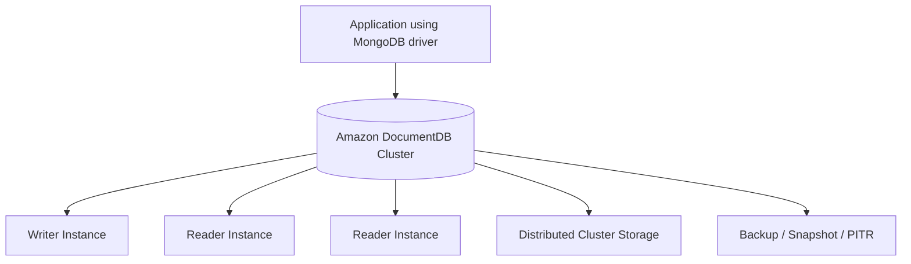
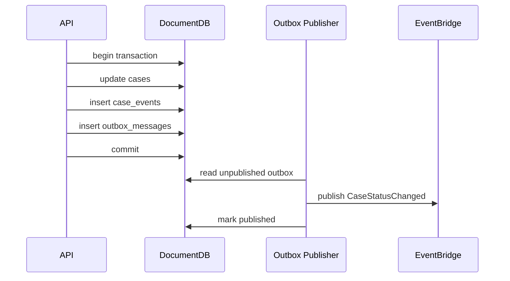
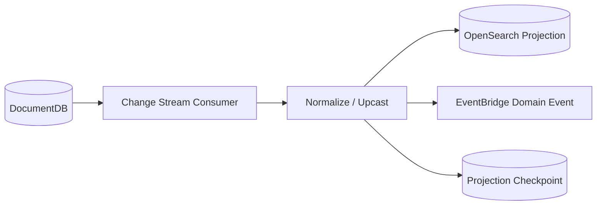
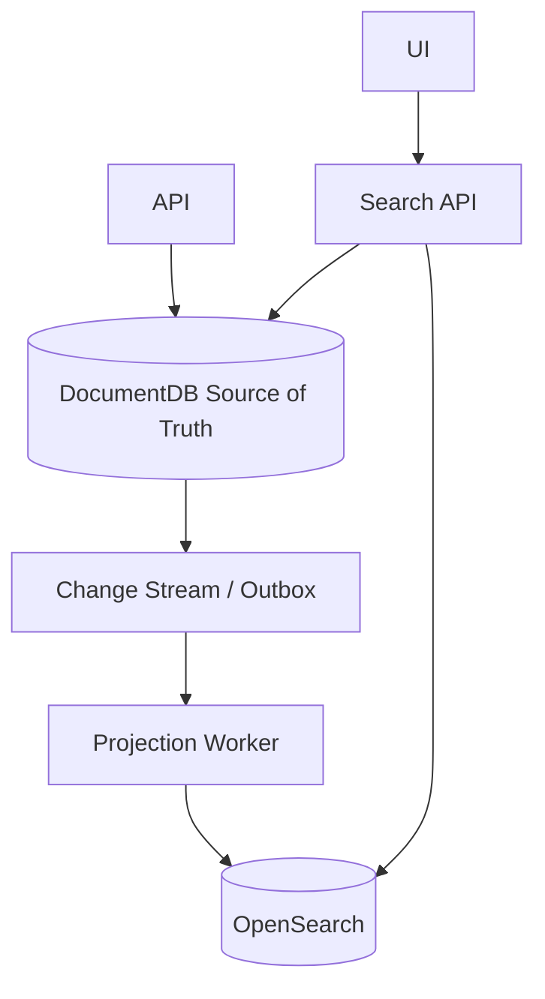
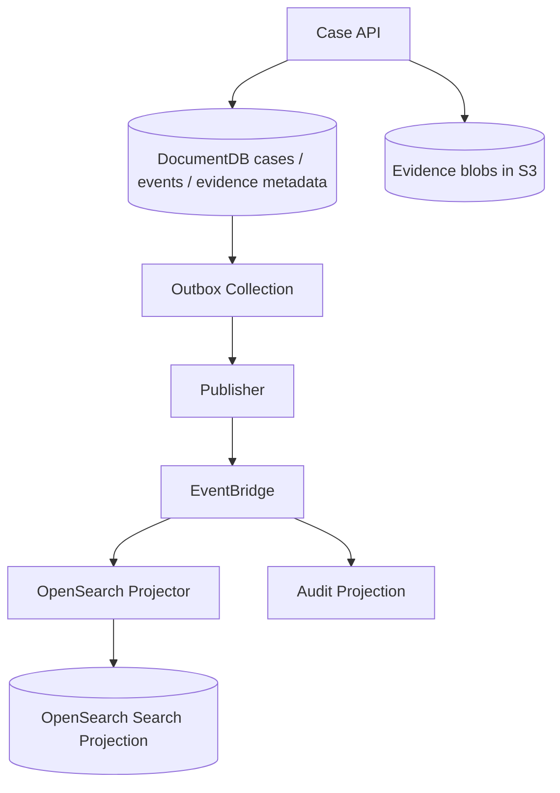

# Part 087 — Amazon DocumentDB: Document Modeling, Compatibility Boundary, Query Pattern

> **Core idea:** DocumentDB bukan “MongoDB yang dikelola AWS” dalam arti identik 100%. Ia adalah managed document database yang kompatibel dengan banyak API/driver MongoDB, tetapi tetap punya boundary, behavior, dan trade-off sendiri. Pakai DocumentDB ketika bentuk data, query, dan ownership memang document-oriented; jangan memakainya hanya karena schema relational terasa “ribet”.

---

## 1. Tujuan Pembelajaran

Setelah bagian ini, kamu harus bisa:

1. Menjelaskan kapan document database lebih cocok daripada Aurora/RDS, DynamoDB, OpenSearch, atau Neptune.
2. Mendesain document model berdasarkan aggregate, lifecycle, read shape, mutation shape, dan index shape.
3. Memahami compatibility boundary Amazon DocumentDB dengan MongoDB API, termasuk jebakan asumsi fitur.
4. Mendesain collection, index, transaction, dan change stream yang aman untuk production.
5. Membuat migration plan dari MongoDB/self-managed database ke DocumentDB tanpa mengorbankan correctness.
6. Membaca gejala operasional seperti slow query, index miss, cache pressure, replica lag, connection storm, storage growth, dan oplog/change-stream lag.

---

## 2. Mental Model

Document database menyimpan aggregate sebagai document.

```txt
Relational mindset:
  case table + party table + evidence table + event table + status table

Document mindset:
  case document containing stable aggregate snapshot + embedded substructures
```

Tapi document database bukan berarti semua data harus masuk ke satu document raksasa.

```txt
Good document design:
  aggregate kecil, lifecycle jelas, update lokal, query predictable

Bad document design:
  document jadi dumping ground, array tumbuh tak terbatas, query arbitrary, index random
```

Amazon DocumentDB cocok ketika:

1. Data natural berbentuk semi-structured document.
2. Schema berubah bertahap tetapi tetap punya contract.
3. Read path sering mengambil aggregate utuh.
4. Join lintas aggregate bukan hot path utama.
5. Query bisa diprediksi dan di-index.
6. Aplikasi sudah memakai MongoDB driver/API dan ingin managed AWS service dengan compatibility cukup.

Tidak cocok ketika:

1. Query membutuhkan relational join kompleks dan ad-hoc reporting.
2. Invariant kuat melibatkan banyak aggregate dengan constraint ketat.
3. Workload membutuhkan partition-key scale model seperti DynamoDB.
4. Search relevancy/full-text ranking adalah kebutuhan utama.
5. Relationship traversal mendalam adalah kebutuhan utama.
6. Aplikasi bergantung pada fitur MongoDB tertentu yang tidak tersedia atau berbeda di DocumentDB.

---

## 3. AWS Positioning

Amazon DocumentDB adalah fully managed document database service dengan MongoDB compatibility. Secara praktis, kamu memakai MongoDB-compatible drivers/tools untuk mengakses cluster DocumentDB, tetapi tetap harus membaca dokumentasi compatibility dan functional differences sebelum menganggap semua fitur sama.



Boundary penting:

| Area | Prinsip |
|---|---|
| API | kompatibel dengan subset/banyak MongoDB API, bukan implementasi MongoDB upstream |
| Storage | managed AWS storage architecture, bukan replica set MongoDB biasa |
| Scaling | instance/reader scaling dan storage scaling, bukan DynamoDB-style partition model |
| Index | index harus mengikuti query shape; terlalu banyak index memperberat write |
| Transaction | ada multi-statement transaction, tetapi jangan menjadikannya pengganti relational modeling |
| Change stream | berguna untuk projection/integration, bukan message queue durable tak terbatas |
| Search | gunakan OpenSearch projection jika butuh search engine behavior |

---

## 4. Decision Framework

Gunakan DocumentDB bila score berikut tinggi.

| Pertanyaan | Ya berarti... |
|---|---|
| Apakah aggregate natural berbentuk JSON/document? | DocumentDB kandidat kuat |
| Apakah query utama mengambil aggregate utuh atau subset field predictable? | Cocok |
| Apakah struktur field sering berevolusi antar tenant/product? | Cocok dengan schema discipline |
| Apakah aplikasi sudah MongoDB-oriented? | Migration friction lebih rendah |
| Apakah join kompleks tidak dominan? | Cocok |
| Apakah write invariant lintas banyak aggregate minimal? | Cocok |
| Apakah perlu strong relational constraint? | Aurora/RDS lebih aman |
| Apakah perlu massive single-digit-ms key-value at any scale? | DynamoDB lebih alami |
| Apakah perlu graph traversal? | Neptune lebih alami |
| Apakah perlu ranking/full text search? | OpenSearch projection lebih alami |

### 4.1 DocumentDB vs DynamoDB

| Dimensi | DocumentDB | DynamoDB |
|---|---|---|
| Model utama | document collections | key-value/document table |
| Query | richer document query, indexed fields | predictable Query by key/index |
| Scaling mental model | cluster instances/storage | partition key and capacity model |
| Schema flexibility | high | high, tetapi access-pattern-first |
| Compatibility | MongoDB API/driver compatibility | AWS-native API |
| Hot key handling | instance/index/query tuning | partition-key design/adaptive capacity |
| Transaction | multi-document transaction supported | transaction API up to service limits |
| Best fit | semi-structured aggregate apps | high-scale predictable access patterns |

### 4.2 DocumentDB vs Aurora PostgreSQL JSONB

| Dimensi | DocumentDB | Aurora PostgreSQL + JSONB |
|---|---|---|
| Flexible document | native | supported but relational-first |
| Relational integrity | weaker | strong |
| Joins | not primary strength | strong |
| Query planner maturity | document-query-specific | SQL planner + indexes |
| Team skill | MongoDB ecosystem | SQL/PostgreSQL ecosystem |
| Schema migration | application-managed | DDL + migration discipline |
| Use case | flexible aggregate document | relational core with JSON extension |

### 4.3 DocumentDB vs OpenSearch

OpenSearch bukan source of truth untuk transactional document state.

```txt
DocumentDB = authoritative document state
OpenSearch = search/query projection
```

Gunakan OpenSearch ketika butuh:

1. full-text search,
2. relevance scoring,
3. fuzzy search,
4. faceting,
5. log/search analytics,
6. query yang lebih mirip search engine daripada database lookup.

---

## 5. Document Modeling: Aggregate First

Mulai dari aggregate, bukan collection.

```txt
Aggregate = unit of consistency + lifecycle + ownership.
```

Contoh regulatory case management:

```json
{
  "_id": "CASE#2026-000120",
  "tenantId": "TENANT#ID-FSA",
  "caseNumber": "2026-000120",
  "subject": {
    "type": "Company",
    "name": "PT Example Risk",
    "registrationNumber": "REG-991"
  },
  "status": "UNDER_REVIEW",
  "priority": "HIGH",
  "assignedTeam": "ENFORCEMENT_TRIAGE",
  "risk": {
    "score": 84,
    "band": "HIGH",
    "lastCalculatedAt": "2026-07-07T03:20:00Z"
  },
  "milestones": [
    {
      "type": "INTAKE_RECEIVED",
      "at": "2026-07-01T10:00:00Z",
      "by": "SYSTEM"
    },
    {
      "type": "TRIAGE_COMPLETED",
      "at": "2026-07-02T11:12:00Z",
      "by": "USER#123"
    }
  ],
  "schemaVersion": 3,
  "createdAt": "2026-07-01T10:00:00Z",
  "updatedAt": "2026-07-07T03:20:00Z"
}
```

Ini masuk akal bila:

1. `subject`, `risk`, dan `milestones` dibaca bersama case.
2. `milestones` tidak tumbuh tak terbatas.
3. Update milestones tidak menciptakan write contention tinggi.
4. Query utama bisa di-index: `tenantId`, `status`, `priority`, `assignedTeam`, `updatedAt`.

Ini buruk bila:

1. `evidenceItems` bisa jutaan per case.
2. setiap evidence punya lifecycle sendiri.
3. banyak actor update array sama secara paralel.
4. query utama mencari evidence lintas case.

Dalam kasus itu, pisahkan collection.

```txt
cases
case_events
case_evidence
case_assignments
```

---

## 6. Embed vs Reference

Keputusan paling penting di document modeling adalah embed atau reference.

| Pilih embed ketika | Pilih reference ketika |
|---|---|
| child dibaca bersama parent | child sering dibaca sendiri |
| child lifecycle mengikuti parent | child lifecycle independen |
| cardinality bounded | cardinality unbounded |
| update frequency rendah/sedang | update frequency tinggi |
| tidak butuh ownership terpisah | butuh ownership/permission terpisah |
| consistency lokal penting | aggregate boundary berbeda |

### 6.1 Good Embedding

```json
{
  "_id": "CASE#1",
  "status": "OPEN",
  "subject": {
    "name": "PT Alpha",
    "type": "Company"
  },
  "sla": {
    "dueAt": "2026-07-20T00:00:00Z",
    "breachRisk": "MEDIUM"
  }
}
```

`subject` dan `sla` adalah part of case snapshot.

### 6.2 Dangerous Embedding

```json
{
  "_id": "CASE#1",
  "evidenceItems": [
    { "id": "E1", "blobKey": "..." },
    { "id": "E2", "blobKey": "..." }
  ]
}
```

Jika evidence bertambah terus, ini menjadi unbounded array. Masalahnya:

1. document size tumbuh,
2. write contention naik,
3. partial update makin rumit,
4. query evidence lintas case sulit,
5. archive/delete evidence menjadi mahal.

Lebih baik:

```txt
cases
case_evidence
```

`case_evidence` document:

```json
{
  "_id": "EVIDENCE#E1",
  "caseId": "CASE#1",
  "tenantId": "TENANT#A",
  "type": "PDF",
  "classification": "CONFIDENTIAL",
  "blobKey": "s3://bucket/cases/1/evidence/e1.pdf",
  "receivedAt": "2026-07-07T10:00:00Z"
}
```

---

## 7. Collection Design

Collection bukan tabel relational yang harus dinormalisasi, tapi juga bukan folder bebas.

Collection yang baik punya:

1. ownership jelas,
2. query pattern jelas,
3. index set kecil dan intentional,
4. lifecycle/retention jelas,
5. schemaVersion jelas,
6. document size bounded,
7. cardinality predictable,
8. migration strategy.

Contoh collection boundary:

| Collection | Source of truth? | Query utama | Catatan |
|---|---:|---|---|
| `cases` | yes | by tenant/status/assignment | aggregate utama |
| `case_events` | yes/audit | by case/time | append-only audit-ish |
| `case_evidence` | yes | by case/type/date | evidence metadata, blob di S3 |
| `case_search_projection` | no | jangan di DocumentDB jika search-heavy | lebih cocok OpenSearch |
| `case_timeline_projection` | derived | by case/time | bisa rebuild dari events |

Rule:

```txt
A collection should map to a lifecycle and query family, not just an object class.
```

---

## 8. Query Pattern First

Sebelum membuat index, tulis access pattern.

```txt
AP-01: list open high-priority cases by tenant ordered by updatedAt desc
AP-02: get case by id
AP-03: list evidence by case ordered by receivedAt desc
AP-04: list cases assigned to investigator by status
AP-05: find cases by external reference id
AP-06: load timeline events for case ordered by occurredAt asc
```

Map ke query + index.

| Access Pattern | Collection | Filter | Sort | Index |
|---|---|---|---|---|
| AP-01 | `cases` | `tenantId`, `status`, `priority` | `updatedAt desc` | `{ tenantId: 1, status: 1, priority: 1, updatedAt: -1 }` |
| AP-02 | `cases` | `_id` | none | default `_id` |
| AP-03 | `case_evidence` | `tenantId`, `caseId` | `receivedAt desc` | `{ tenantId: 1, caseId: 1, receivedAt: -1 }` |
| AP-04 | `cases` | `tenantId`, `assignedUserId`, `status` | `updatedAt desc` | `{ tenantId: 1, assignedUserId: 1, status: 1, updatedAt: -1 }` |
| AP-05 | `cases` | `tenantId`, `externalRef` | none | unique/sparse if applicable |
| AP-06 | `case_events` | `tenantId`, `caseId` | `occurredAt asc` | `{ tenantId: 1, caseId: 1, occurredAt: 1 }` |

Jangan mulai dari:

```txt
"Kita index semua field yang mungkin dicari."
```

Itu menambah write amplification, storage, dan maintenance cost.

---

## 9. Index Discipline

AWS best practice untuk DocumentDB menekankan minimisasi jumlah index; tambahkan hanya index yang diperlukan untuk common queries.

Index adalah materialized access path.

```txt
Index improves selected reads.
Index taxes writes.
Index consumes memory/storage.
Index complicates migration.
```

### 9.1 Compound Index Order

Umumnya:

```txt
equality fields first -> range/sort field last
```

Contoh:

```js
// list open high priority cases ordered by updatedAt
db.cases.createIndex({
  tenantId: 1,
  status: 1,
  priority: 1,
  updatedAt: -1
})
```

Query:

```js
db.cases.find({
  tenantId: "TENANT#A",
  status: "OPEN",
  priority: "HIGH"
}).sort({ updatedAt: -1 }).limit(50)
```

### 9.2 Index Smells

| Smell | Dampak |
|---|---|
| index per UI filter | write/storage explosion |
| index untuk field low-cardinality saja | selectivity buruk |
| index tidak sesuai sort | query masih scan/sort mahal |
| wildcard thinking | tidak ada ownership access pattern |
| index untuk report ad-hoc | pindahkan ke analytical/search projection |
| banyak index pada write-heavy collection | write latency naik |

### 9.3 Sparse/Optional Field

Jika field opsional dan hanya sebagian document punya field itu, pertimbangkan sparse/partial-style design sesuai kemampuan yang tersedia. Tapi jangan hanya menyalin pattern MongoDB tanpa memverifikasi support DocumentDB version yang dipakai.

Checklist:

1. Apakah index didukung di engine version ini?
2. Apakah query planner memakainya?
3. Apakah selectivity cukup?
4. Apakah write latency setelah index acceptable?
5. Apakah index build/backfill aman untuk traffic produksi?

---

## 10. Compatibility Boundary

Hal paling berbahaya dalam DocumentDB adoption adalah asumsi:

```txt
"Aplikasi jalan di MongoDB, berarti pasti jalan persis sama di DocumentDB."
```

Yang benar:

```txt
"DocumentDB mendukung MongoDB compatibility, tetapi kita harus audit API, operator, index behavior, transaction, aggregation, dan operational differences."
```

### 10.1 Compatibility Checklist

Sebelum migrasi:

1. Inventaris driver dan versi.
2. Inventaris query/operator yang dipakai.
3. Inventaris aggregation pipeline.
4. Inventaris index types.
5. Inventaris transaction usage.
6. Inventaris change stream usage.
7. Inventaris TTL behavior.
8. Inventaris admin commands.
9. Inventaris monitoring/tooling dependency.
10. Jalankan compatibility test suite terhadap DocumentDB target version.

### 10.2 Functional Difference Register

Buat file seperti ini di repository:

```yaml
service: case-management
database: amazon-documentdb
engineCompatibility: mongodb-5.0
verifiedAt: 2026-07-07

differences:
  - area: aggregation
    feature: "$lookup variant X"
    usedBy: "case-reporting"
    status: "not used in hot path"
    mitigation: "OpenSearch/Redshift projection for reporting"

  - area: index
    feature: "specific index option"
    usedBy: "case search"
    status: "requires test"
    mitigation: "contract test + explain plan"

  - area: transaction
    feature: "multi-document case close transaction"
    usedBy: "case-close command"
    status: "supported in target version"
    mitigation: "keep transaction short; retry whole command"
```

Rule:

```txt
Compatibility is not a slogan. It is a tested contract.
```

---

## 11. Transactions

DocumentDB supports multi-statement transactions. Namun transaksi tetap harus pendek, bounded, dan tidak dipakai untuk menyembunyikan aggregate boundary yang salah.

Good transaction:

```txt
update case status
insert case event
insert outbox notification
commit
```

Bad transaction:

```txt
update case
update many evidence items
update reporting snapshot
update search-like projection
call external service
wait for approval
commit
```

### 11.1 Transaction Shape



### 11.2 Retry Rule

Retry whole transaction, not one random statement.

```txt
start transaction
  read precondition
  write state
  write event/outbox
commit

if transient/ambiguous failure:
  check idempotency command record
  retry whole command if safe
```

### 11.3 Transaction Smells

| Smell | Meaning |
|---|---|
| transaction includes network call | broken boundary |
| transaction lasts seconds | concurrency risk |
| transaction updates many unrelated collections | aggregate boundary unclear |
| transaction used for reporting projection | derived state inside write path |
| transaction retry duplicates side effects | missing idempotency/outbox |

---

## 12. Optimistic Concurrency

Setiap mutable aggregate sebaiknya punya `version`.

```json
{
  "_id": "CASE#1",
  "status": "OPEN",
  "version": 12,
  "updatedAt": "2026-07-07T10:00:00Z"
}
```

Update:

```js
db.cases.updateOne(
  { _id: "CASE#1", version: 12, status: "OPEN" },
  {
    $set: {
      status: "UNDER_REVIEW",
      updatedAt: new Date()
    },
    $inc: { version: 1 }
  }
)
```

Jika matched count = 0:

```txt
- document not found, or
- version changed, or
- status precondition failed
```

Jangan langsung treat sebagai 500.

Map ke domain:

| Failure | API response |
|---|---|
| not found | 404 |
| version mismatch | 409 Conflict |
| invalid state transition | 409/422 |
| duplicate idempotency key | return previous result |
| transient DB error | retry / 503 if exhausted |

---

## 13. Schema Evolution

Document database fleksibel bukan berarti schema tidak ada. Schema tetap ada; hanya enforcement-nya sering pindah ke aplikasi.

Minimal fields:

```json
{
  "_id": "CASE#1",
  "schemaVersion": 3,
  "createdAt": "2026-07-01T00:00:00Z",
  "updatedAt": "2026-07-07T00:00:00Z"
}
```

### 13.1 Evolution Pattern

```txt
v1: field absent
v2: field optional, writer writes new field
v3: reader assumes field with fallback
v4: backfill old documents
v5: field required in application contract
v6: remove fallback after measurement
```

### 13.2 Reader Compatibility

Reader harus bisa membaca beberapa versi.

```ts
function normalizeCase(doc: any): CaseView {
  return {
    id: doc._id,
    status: doc.status,
    riskBand: doc.risk?.band ?? "UNKNOWN",
    schemaVersion: doc.schemaVersion ?? 1,
  }
}
```

### 13.3 Backfill Safety

Backfill harus:

1. batch kecil,
2. throttle-aware,
3. idempotent,
4. resumable,
5. punya checkpoint,
6. punya observability,
7. tidak mengganggu hot path.

Pseudo-code:

```txt
lastId = checkpoint
while true:
  docs = find({_id > lastId, schemaVersion < target}).sort({_id:1}).limit(500)
  if empty: break
  for doc in docs:
    updateOne({_id: doc._id, schemaVersion: doc.schemaVersion}, {$set: ..., $inc: {schemaVersion: 1}})
  checkpoint = docs[-1]._id
  sleep(throttle)
```

---

## 14. Change Streams

Change streams memberi time-ordered sequence of change events pada collection/cluster yang bisa dipakai untuk notification, OpenSearch projection, analytics projection, dan integration.

Tapi change stream bukan pengganti semua message broker.

| Untuk | Cocok? |
|---|---:|
| update search projection | yes |
| cache invalidation | yes |
| analytics replication | yes |
| domain event contract publik | hati-hati |
| durable long-retention event log | no |
| workflow orchestration | no, pakai Step Functions/EventBridge |
| fanout consumer isolation | lebih cocok EventBridge/SNS/SQS |

### 14.1 Change Stream Pattern



### 14.2 Consumer Correctness

Consumer harus punya:

1. resume token/checkpoint,
2. idempotency key,
3. poison-event handling,
4. projection version,
5. lag metric,
6. replay/rebuild strategy,
7. schema upcaster.

### 14.3 Outbox vs Change Stream

| Pattern | Kapan dipakai |
|---|---|
| Change stream directly from collection | internal projection/cache/search update |
| Explicit outbox collection | domain event contract butuh stable envelope |
| EventBridge publish from outbox | cross-service integration |
| SQS per consumer | consumer isolation/backpressure |

Explicit outbox lebih defensible untuk domain events karena envelope bisa dikontrol.

```json
{
  "_id": "OUTBOX#01J...",
  "eventId": "01J...",
  "eventType": "CaseStatusChanged",
  "aggregateType": "Case",
  "aggregateId": "CASE#1",
  "occurredAt": "2026-07-07T10:00:00Z",
  "schemaVersion": 2,
  "payload": {
    "caseId": "CASE#1",
    "oldStatus": "OPEN",
    "newStatus": "UNDER_REVIEW"
  },
  "publishedAt": null,
  "attempt": 0
}
```

---

## 15. Search and Reporting Boundary

DocumentDB boleh query document, tapi jangan menjadikannya search engine/reporting warehouse.

### 15.1 Search Projection



Search API pattern:

1. Query OpenSearch untuk IDs dan ranking.
2. Fetch authoritative details dari DocumentDB untuk selected IDs jika perlu.
3. Jangan update source of truth dari OpenSearch result.

### 15.2 Reporting Projection

Untuk reporting berat:

```txt
DocumentDB -> change stream/outbox -> S3/Redshift/Athena/OpenSearch projection
```

Jangan menjalankan laporan ad-hoc mahal pada primary operational cluster.

---

## 16. Multi-Tenancy

Minimal setiap document punya `tenantId` jika sistem multi-tenant.

```json
{
  "_id": "CASE#1",
  "tenantId": "TENANT#A"
}
```

Index harus tenant-aware:

```js
db.cases.createIndex({ tenantId: 1, status: 1, updatedAt: -1 })
```

Anti-pattern:

```js
// Missing tenantId in hot query
db.cases.find({ status: "OPEN" }).sort({ updatedAt: -1 })
```

Risiko:

1. cross-tenant data leak,
2. low selectivity,
3. bad index usage,
4. noisy-neighbor amplification,
5. sulit audit.

Tenant isolation options:

| Model | Kelebihan | Kekurangan |
|---|---|---|
| shared cluster, shared collections | simple, efficient | noisy neighbor, blast radius |
| shared cluster, collection per tenant | isolation sedang | collection/index sprawl |
| cluster per tenant | high isolation | cost/operation overhead |
| account per tenant | strongest boundary | governance/automation complexity |

---

## 17. Security Boundary

Security tidak cukup di VPC.

Checklist:

1. TLS enforced.
2. Secrets managed via Secrets Manager.
3. IAM boundary untuk secret access.
4. Least privilege network access via security groups.
5. Audit sensitive commands/access.
6. Field-level sensitive data diklasifikasi.
7. PII masking/tokenization bila perlu.
8. Backups/snapshots encrypted.
9. Change-stream consumers tidak bocorkan sensitive payload.
10. Logs tidak menulis full document sensitive.

Application-level authorization tetap wajib.

```txt
DocumentDB authenticates connection.
Application authorizes domain access.
```

---

## 18. Application Code Pattern

### 18.1 Repository Boundary

Jangan expose Mongo query bebas dari controller.

```java
interface CaseRepository {
  Optional<CaseDocument> findById(TenantId tenantId, CaseId caseId);
  Page<CaseSummary> listOpenCases(TenantId tenantId, CaseListCursor cursor);
  boolean transitionStatus(TenantId tenantId, CaseId caseId, CaseStatus from, CaseStatus to, long expectedVersion);
}
```

Controller tidak boleh tahu index detail.

### 18.2 Command Handler

```java
public CaseStatusChanged handle(ChangeCaseStatusCommand cmd) {
  IdempotencyRecord record = idempotency.start(cmd.key(), cmd.requestHash());
  if (record.isCompleted()) return record.previousResult();

  try {
    CaseDocument before = cases.findForUpdate(cmd.tenantId(), cmd.caseId());
    before.requireVersion(cmd.expectedVersion());
    before.requireTransitionAllowed(cmd.newStatus());

    CaseDocument after = before.transitionTo(cmd.newStatus(), cmd.actor(), clock.now());

    db.transaction(tx -> {
      cases.save(tx, after);
      caseEvents.insert(tx, CaseEvent.statusChanged(before, after));
      outbox.insert(tx, DomainEvent.caseStatusChanged(before, after));
      idempotency.markCompleted(tx, cmd.key(), after.toResult());
    });

    return after.toResult();
  } catch (TransientDatabaseException e) {
    throw retryable(e);
  }
}
```

Note: pseudocode ini menunjukkan boundary, bukan API spesifik driver.

---

## 19. Operational Metrics

Pantau minimal:

| Area | Signal |
|---|---|
| CPU/memory | instance saturation |
| connection | connection storm/pool exhaustion |
| read latency | index miss, cache pressure |
| write latency | index overhead, transaction contention |
| replica lag | stale reads |
| storage growth | retention/index bloat |
| slow query | missing/inefficient index |
| change stream lag | projection falling behind |
| transaction abort | contention/long transaction |
| backup/PITR | recovery readiness |

### 19.1 Dashboard Layout

```txt
Top row: availability, p50/p95/p99 read/write latency, error rate
Second: CPU/memory/connections/storage
Third: slow queries, top collections, index usage, operation counts
Fourth: replica lag, change stream lag, projector error
Fifth: backup/snapshot/PITR health, restore drill status
```

---

## 20. Production Failure Modes

| Failure | Penyebab umum | Containment |
|---|---|---|
| slow query | missing index, low selectivity, bad sort | explain, index review, query limit |
| write latency spike | too many indexes, transaction contention | reduce index, shard collection boundary, retry |
| storage growth | unbounded documents, no retention, index bloat | lifecycle, rolling collections, archive |
| connection exhaustion | pool too large, Lambda fanout, leak | pool cap, proxy/pooling discipline |
| replica stale read | read replica lag | read-your-writes policy |
| change stream lag | consumer slow/poison event | checkpoint, DLQ, replay/rebuild |
| migration failure | compatibility assumption | compatibility test suite |
| schema drift | no schemaVersion | validation + upcaster |
| cross-tenant leak | missing tenant filter | repository guard + tests |

---

## 21. Migration Strategy

### 21.1 Migration From MongoDB

Steps:

1. Inventory workload.
2. Run compatibility scan/test.
3. Build representative performance benchmark.
4. Migrate schema/index definitions intentionally.
5. Seed data using chosen migration tooling.
6. Validate counts/checksums/sample queries.
7. Dual-read or shadow-read where useful.
8. Dual-write only with strict reconciliation if unavoidable.
9. Cut over write path.
10. Monitor latency/errors/change-stream/projection.
11. Keep rollback path for agreed window.

### 21.2 Compatibility Test Suite

```txt
test: all repository methods against DocumentDB target engine
assert:
  - result correctness
  - sort order
  - pagination correctness
  - transaction behavior
  - index usage expectation
  - error classification
  - retry safety
```

### 21.3 Cutover Runbook

```txt
T-7d  restore rehearsal complete
T-3d  compatibility test green
T-1d  freeze incompatible schema changes
T-1h  enable enhanced monitoring/dashboard
T     stop writes or enable dual-write guard
T+5m  validate write success/error rate
T+30m validate critical queries and projections
T+2h  compare source/target counts/checksums
T+24h decide rollback window close
```

---

## 22. Anti-Patterns

### 22.1 DocumentDB as Free-Form Dump

```txt
"Kita tidak perlu schema karena ini document database."
```

Salah. Schema tetap ada. Jika tidak eksplisit, schema menjadi kebetulan historis.

### 22.2 Unbounded Arrays

Array yang tumbuh tanpa batas akan menjadi write, size, and query problem.

### 22.3 Reporting on Operational Cluster

Query reporting berat mencuri kapasitas dari write/read hot path.

### 22.4 Search in DocumentDB

DocumentDB query bukan search relevance engine.

### 22.5 MongoDB Feature Assumption

Selalu verifikasi compatibility.

### 22.6 Cross-Service Shared Collections

Jika banyak service menulis collection yang sama, ownership hilang.

---

## 23. Regulatory Case Study

Problem:

```txt
Regulatory enforcement platform needs flexible case records.
Different case types have different metadata.
Investigators need fast case detail load.
Evidence is large and independently managed.
Search needs relevance and filters.
Audit trail must be defensible.
```

Design:



Collections:

| Collection | Role |
|---|---|
| `cases` | authoritative case aggregate snapshot |
| `case_events` | append-oriented lifecycle/audit events |
| `case_evidence` | evidence metadata, S3 object is blob store |
| `outbox_messages` | domain event publication boundary |
| `migration_checkpoints` | backfill/rebuild progress |

Key invariants:

1. Only Case API writes `cases`.
2. Evidence blob upload must be referenced by `case_evidence` after validation.
3. Search reads OpenSearch but authoritative case view comes from DocumentDB.
4. Every status transition writes `case_events` and `outbox_messages` atomically.
5. Projectors are idempotent and rebuildable.

---

## 24. Production Readiness Checklist

### Modeling

- [ ] Collection ownership documented.
- [ ] Embed/reference decisions justified.
- [ ] All hot access patterns mapped to indexes.
- [ ] No unbounded arrays in hot aggregate.
- [ ] `tenantId`, `schemaVersion`, `createdAt`, `updatedAt` strategy defined.
- [ ] Source-of-truth vs projection documented.

### Compatibility

- [ ] MongoDB API/operator usage inventoried.
- [ ] Functional differences reviewed for target version.
- [ ] Driver version validated.
- [ ] Aggregation/index/transaction tests green.
- [ ] Migration benchmark done.

### Correctness

- [ ] Idempotency key for commands.
- [ ] Optimistic concurrency with version or state precondition.
- [ ] Transaction boundary short and bounded.
- [ ] Outbox or change stream pattern defined.
- [ ] Retry classification documented.

### Operability

- [ ] Slow query dashboard.
- [ ] Connection dashboard.
- [ ] Replica lag dashboard.
- [ ] Change stream lag dashboard.
- [ ] Backup/restore drill tested.
- [ ] Index build/backfill runbook.
- [ ] Storage growth alarm.

### Security

- [ ] TLS.
- [ ] Secrets Manager.
- [ ] Security group boundary.
- [ ] Encryption at rest.
- [ ] Sensitive field classification.
- [ ] Log redaction.
- [ ] Tenant isolation tests.

---

## 25. Heuristics

1. If you need joins, start relational.
2. If you need graph traversal, start graph.
3. If you need search relevance, use search projection.
4. If you need predictable key-value scale, consider DynamoDB.
5. If you need flexible aggregate documents with MongoDB-compatible access, DocumentDB can be a strong fit.
6. If an array can grow forever, it is probably a collection.
7. If a query is not in the access pattern matrix, it does not get a production index by default.
8. If compatibility is not tested, it is not compatibility.
9. If change stream consumer is not idempotent, replay will hurt you.
10. If source of truth is unclear, every migration and incident becomes political.

---

## 26. References

- Amazon DocumentDB — What is Amazon DocumentDB: https://docs.aws.amazon.com/documentdb/latest/devguide/what-is.html
- Amazon DocumentDB compatibility with MongoDB: https://docs.aws.amazon.com/documentdb/latest/devguide/compatibility.html
- Functional differences: Amazon DocumentDB and MongoDB: https://docs.aws.amazon.com/documentdb/latest/devguide/functional-differences.html
- Best practices for Amazon DocumentDB: https://docs.aws.amazon.com/documentdb/latest/developerguide/best_practices.html
- Transactions in Amazon DocumentDB: https://docs.aws.amazon.com/documentdb/latest/developerguide/transactions.html
- Change streams with Amazon DocumentDB: https://docs.aws.amazon.com/documentdb/latest/devguide/change_streams.html
- Managing Amazon DocumentDB indexes: https://docs.aws.amazon.com/documentdb/latest/developerguide/managing-indexes.html
- Performance improvement tips for Amazon DocumentDB: https://docs.aws.amazon.com/documentdb/latest/devguide/performance-improvement-tips.html

---

## 27. Penutup

DocumentDB adalah pilihan yang baik ketika masalahnya memang document-oriented: aggregate fleksibel, query predictable, schema evolutif, dan aplikasi membutuhkan MongoDB-compatible surface. Tapi ia bukan pengganti relational integrity, bukan search engine, bukan graph database, dan bukan magic scale layer.

Gunakan DocumentDB dengan discipline:

```txt
aggregate first
query pattern first
index minimal
compatibility tested
change propagation explicit
source of truth clear
operability measurable
```

Jika semua itu terpenuhi, DocumentDB bisa menjadi bagian yang sangat produktif dalam platform AWS application/database architecture.
