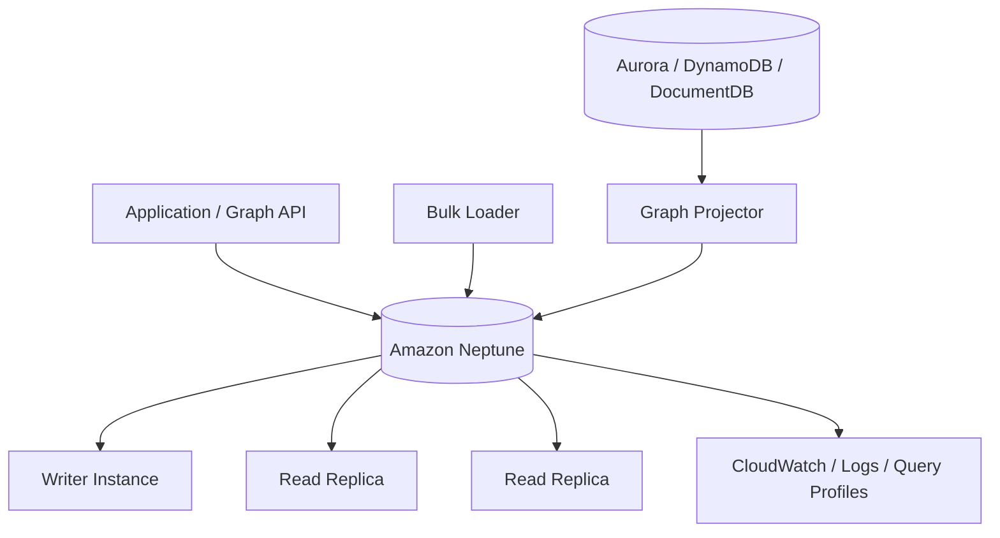
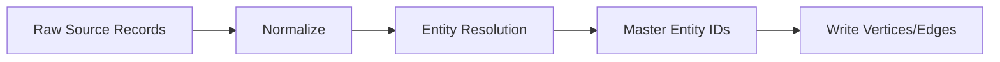
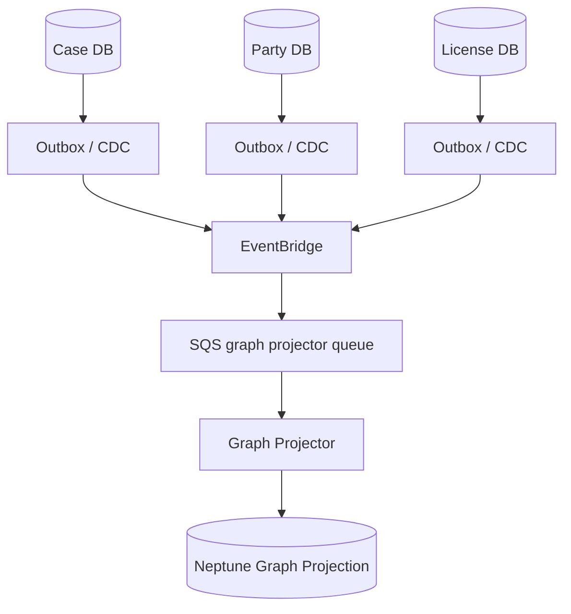
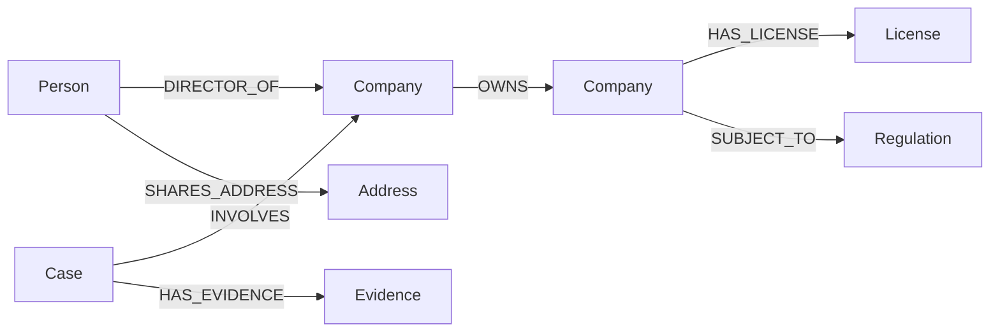
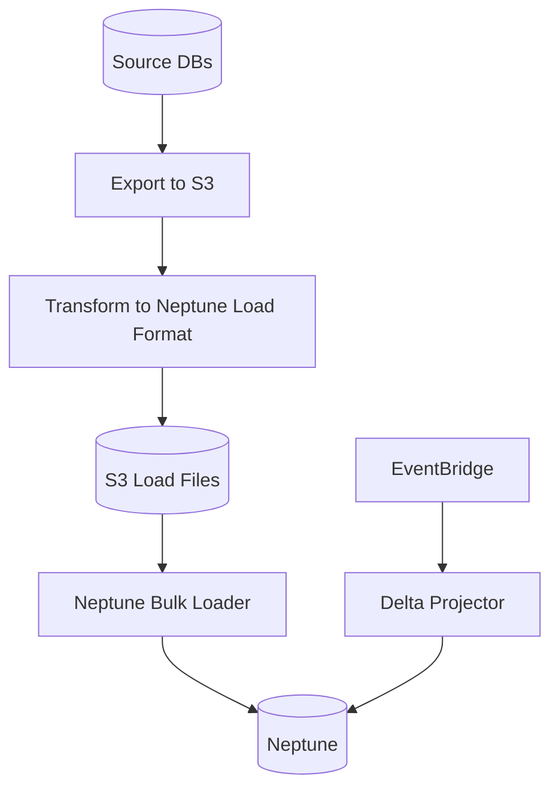
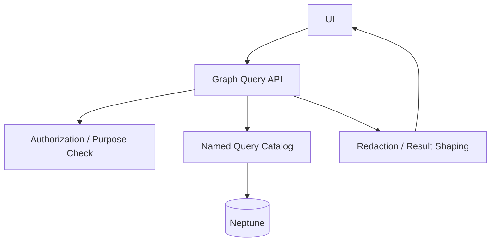
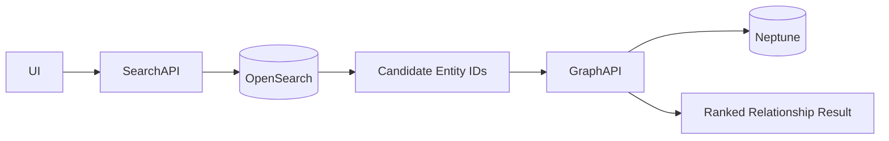
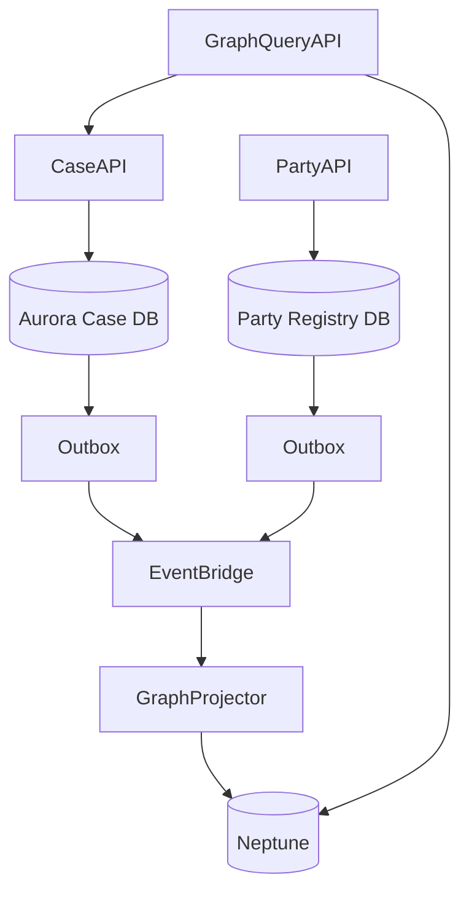
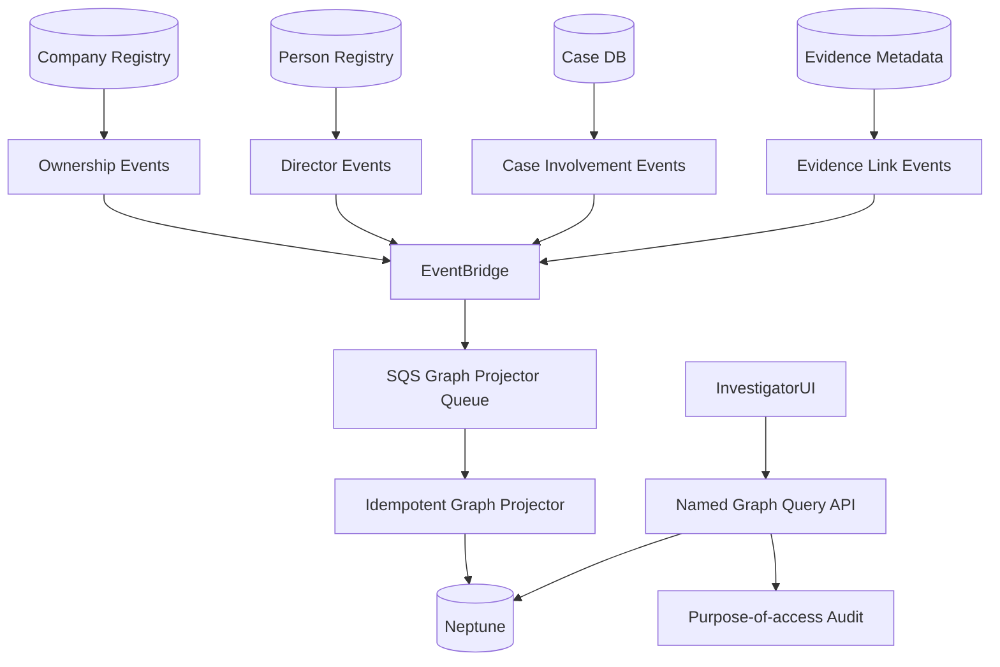

# Part 088 — Amazon Neptune: Graph Modeling, Traversal, Relationship-Heavy Workloads

> **Core idea:** graph database bukan database untuk “data yang punya relasi”. Semua database punya relasi. Graph database berguna ketika **relasi itu sendiri adalah data utama**, traversal adalah hot path, dan jawaban bisnis muncul dari struktur koneksi: path, neighborhood, reachability, centrality, similarity, influence, fraud ring, ownership chain, dependency chain, atau knowledge graph.

---

## 1. Tujuan Pembelajaran

Setelah bagian ini, kamu harus bisa:

1. Menentukan kapan Amazon Neptune lebih tepat daripada Aurora/RDS, DynamoDB, DocumentDB, atau OpenSearch.
2. Memilih antara property graph dan RDF berdasarkan bentuk data, query, semantics, dan tim.
3. Mendesain vertex, edge, label, property, cardinality, dan identity secara production-grade.
4. Menulis traversal yang bounded, index-friendly, dan tidak meledakkan fanout.
5. Memahami Gremlin, openCypher, dan SPARQL sebagai query surface dengan trade-off berbeda.
6. Mendesain ingestion, bulk load, change propagation, graph projection, dan rebuild strategy.
7. Mengoperasikan Neptune dari sisi query latency, memory pressure, replica, failover, slow traversal, dan incident runbook.

---

## 2. Mental Model

Relational database bertanya:

```txt
How do tables join?
```

Document database bertanya:

```txt
What aggregate document should I load?
```

Key-value database bertanya:

```txt
What key/index answers this access pattern?
```

Graph database bertanya:

```txt
What path through relationships answers the question?
```

Contoh pertanyaan graph:

```txt
Which entities are indirectly controlled by this organization?
Which accounts share devices, addresses, officers, and transactions?
Which cases are connected through the same evidence chain?
Which service dependencies are impacted by this database migration?
Which subjects are within 3 hops of a sanctioned entity?
```

Jika pertanyaan utama mengandung:

```txt
connected to
path to
within N hops
owns indirectly
similar to
shares with
depends on
influences
reachable from
```

maka graph model layak dipertimbangkan.

---

## 3. AWS Positioning

Amazon Neptune adalah fully managed graph database service untuk highly connected datasets. Neptune mendukung property graph query languages seperti Apache TinkerPop Gremlin dan openCypher, serta RDF/SPARQL untuk semantic graph/knowledge graph workloads.



Neptune cocok untuk:

1. fraud detection,
2. identity graph,
3. entity resolution,
4. knowledge graph,
5. recommendation graph,
6. dependency graph,
7. network/security graph,
8. ownership/control graph,
9. relationship-heavy investigation.

Tidak cocok untuk:

1. simple CRUD aggregate,
2. key-value lookup,
3. general relational transactions,
4. high-volume append-only time-series,
5. full-text relevance search,
6. arbitrary analytics warehouse.

---

## 4. Graph Is Not “Join But Fancy”

A relational query can answer relationship questions, but cost grows when relationship depth and variability grow.

Relational pattern:

```sql
SELECT ...
FROM company c
JOIN ownership o1 ON ...
JOIN company c2 ON ...
JOIN ownership o2 ON ...
JOIN company c3 ON ...
```

Graph pattern:

```txt
start from Company A
follow OWNS edges 1..N hops
filter effective control
return reachable companies and paths
```

Graph becomes valuable when:

1. path length is dynamic,
2. relationship type matters,
3. relationship property matters,
4. traversal direction matters,
5. neighborhood expansion matters,
6. graph topology changes the answer,
7. the query is naturally expressed as traversal.

---

## 5. Decision Framework

| Question | If yes |
|---|---|
| Is relationship traversal a hot path? | consider Neptune |
| Do you need variable-depth path queries? | Neptune likely useful |
| Are edge properties important? | property graph fits |
| Do you need RDF semantics/ontology/linked data? | RDF/SPARQL fits |
| Is the graph derived from authoritative systems? | build graph projection |
| Is graph the source of truth? | design write ownership very carefully |
| Are queries mostly lookup by ID? | DynamoDB/Aurora may be enough |
| Are joins fixed and shallow? | Aurora may be simpler |
| Is search/relevance core? | OpenSearch projection |
| Is batch analytics core? | Neptune Analytics/Spark/warehouse may fit better |

Rule:

```txt
Do not choose graph because data has relationships.
Choose graph when relationship traversal is the product.
```

---

## 6. Property Graph vs RDF

Neptune supports two major modeling worlds.

### 6.1 Property Graph

Property graph has:

1. vertices,
2. edges,
3. labels,
4. properties on vertices and edges.

Example:

```txt
(:Company {id, name, country})
(:Person {id, name})
(:Case {id, status})

(:Person)-[:DIRECTOR_OF {from, to}]->(:Company)
(:Company)-[:OWNS {percent, from, to}]->(:Company)
(:Case)-[:INVOLVES]->(:Company)
```

Query surfaces:

1. Gremlin,
2. openCypher.

Best for:

1. application graph,
2. fraud graph,
3. recommendation graph,
4. operational dependency graph,
5. entity relationship graph.

### 6.2 RDF

RDF represents facts as triples/quads.

```txt
subject predicate object
```

Example:

```ttl
:CompanyA :owns :CompanyB .
:CompanyA :jurisdiction :Indonesia .
:PersonX :directorOf :CompanyA .
```

Query surface:

```txt
SPARQL
```

Best for:

1. knowledge graph,
2. ontology-driven model,
3. linked data,
4. semantic interoperability,
5. reasoning-adjacent workloads.

### 6.3 Selection Table

| Need | Prefer |
|---|---|
| app developers familiar with graph traversal | property graph |
| edge properties central to query | property graph |
| Cypher-like declarative graph matching | openCypher/property graph |
| traversal programming style | Gremlin/property graph |
| semantic standards/ontology | RDF/SPARQL |
| linked open data integration | RDF/SPARQL |
| strict domain vocabulary | RDF/SPARQL |
| graph as application data model | property graph |

The choice is hard to reverse. Treat it as architecture decision, not implementation detail.

---

## 7. Graph Modeling Principles

### 7.1 Start From Questions

Do not start with entities. Start with graph questions.

```txt
Q1: Find all companies directly or indirectly controlled by subject X.
Q2: Find cases connected by shared bank account, address, director, or device.
Q3: Find shortest path between subject and sanctioned entity.
Q4: Find investigators impacted by a policy change through case assignments.
Q5: Find suspicious clusters where many entities share weak signals.
```

Then identify:

1. starting vertices,
2. edge labels,
3. max traversal depth,
4. filters,
5. path constraints,
6. result shape,
7. freshness requirement,
8. source of truth.

### 7.2 Vertex Design

Vertex should represent identity with stable lifecycle.

Good vertices:

```txt
Person
Company
Case
Evidence
Address
BankAccount
Device
License
Regulation
ControlRequirement
Service
Database
```

Bad vertices:

```txt
CaseStatusChangedEvent as vertex for every event when traversal does not need it
RawLogLine as vertex
UIFilter as vertex
JSONField as vertex without semantics
```

### 7.3 Edge Design

Edges are first-class facts.

```txt
(Person)-[:DIRECTOR_OF {from, to, source, confidence}]->(Company)
(Company)-[:OWNS {percent, from, to, source}]->(Company)
(Case)-[:INVOLVES {role}]->(Company)
(Case)-[:USES_EVIDENCE]->(Evidence)
(Person)-[:SHARES_ADDRESS {from, to, confidence}]->(Address)
```

Edge design questions:

1. Is direction meaningful?
2. Is edge type stable?
3. Does edge have properties?
4. Does edge expire?
5. Does edge have confidence/source?
6. Can duplicate edge exist?
7. Is edge authoritative or derived?
8. Is edge part of audit/history?

### 7.4 Direction Matters

Choose direction by traversal frequency.

If query is:

```txt
from person -> companies they direct
```

Edge:

```txt
(Person)-[:DIRECTOR_OF]->(Company)
```

If reverse query is also hot:

```txt
from company -> directors
```

Graph databases can usually traverse incoming edges, but you must verify query cost and index/start-point strategy. Do not duplicate reverse edges unless necessary and governed.

---

## 8. Identity Strategy

Identity bugs destroy graph quality.

Every vertex needs stable ID.

```txt
Company: COMPANY#jurisdiction#registrationNumber
Person: PERSON#country#nationalId or internal mastered person id
Address: ADDRESS#normalizedHash
BankAccount: BANK_ACCOUNT#iban/hash
Case: CASE#caseNumber
```

Avoid:

```txt
Company name as ID
free-text address as ID
email as immutable person ID
phone number as primary identity
```

### 8.1 Entity Resolution Boundary

Do not hide entity resolution inside graph writes.

Pipeline:



Graph query quality depends on mastered identity quality.

---

## 9. Source of Truth vs Graph Projection

Most enterprise Neptune deployments should treat graph as projection, not primary source of truth.

```txt
Aurora/DynamoDB/DocumentDB = authoritative transactional state
Neptune = relationship query projection
```

Why?

1. Source systems own business transactions.
2. Graph materializes relationships optimized for traversal.
3. Projection can be rebuilt.
4. Data lineage remains defensible.
5. Graph schema can evolve separately.

Pattern:



Graph projection invariants:

1. Projector is idempotent.
2. Edge writes include source event/version.
3. Deletes/tombstones are modeled.
4. Rebuild path exists.
5. Projection freshness is observable.
6. Source record can explain every graph fact.

---

## 10. Property Graph Modeling Example

Regulatory enforcement graph:



### 10.1 Vertex Labels

| Label | Identity | Source |
|---|---|---|
| `Person` | mastered person id | party registry |
| `Company` | jurisdiction + registration | company registry |
| `Case` | case number | case management |
| `Evidence` | evidence id | evidence metadata |
| `Address` | normalized address hash | entity resolution |
| `BankAccount` | tokenized account id | financial record |
| `License` | license id | licensing system |
| `Regulation` | regulation id/version | policy repository |

### 10.2 Edge Labels

| Edge | Direction | Properties |
|---|---|---|
| `DIRECTOR_OF` | Person -> Company | `from`, `to`, `source`, `confidence` |
| `OWNS` | Company -> Company | `percent`, `from`, `to`, `source` |
| `INVOLVES` | Case -> Entity | `role`, `createdAt` |
| `SHARES_ADDRESS` | Entity -> Address | `confidence`, `source` |
| `HAS_LICENSE` | Company -> License | `status`, `validFrom`, `validTo` |
| `SUBJECT_TO` | Entity -> Regulation | `reason`, `effectiveAt` |

---

## 11. Query Surface: Gremlin, openCypher, SPARQL

### 11.1 Gremlin

Gremlin is traversal-oriented.

```groovy
g.V('COMPANY#ID#123')
 .repeat(outE('OWNS').has('percent', gte(25)).inV().simplePath())
 .times(3)
 .path()
```

Good when:

1. traversal logic is procedural,
2. step-by-step path control matters,
3. application team is comfortable with traversal APIs,
4. you need explicit control over expansion.

### 11.2 openCypher

openCypher is pattern-oriented.

```cypher
MATCH path = (c:Company {id: 'COMPANY#ID#123'})-[:OWNS*1..3]->(target:Company)
RETURN path, target
```

Good when:

1. graph pattern matching reads naturally,
2. team knows Cypher/Neo4j style,
3. query is declarative,
4. analysts/developers prefer pattern syntax.

### 11.3 SPARQL

SPARQL is RDF query language.

```sparql
SELECT ?company ?owned
WHERE {
  ?company :owns ?owned .
  ?company :jurisdiction "ID" .
}
```

Good when:

1. RDF/ontology matters,
2. standard semantic graph ecosystem matters,
3. linked data/interoperability matters,
4. facts are naturally triples.

### 11.4 Rule

Do not choose query language only because it looks nicer. Choose based on:

1. graph model,
2. team capability,
3. query complexity,
4. tooling,
5. compatibility needs,
6. long-term maintainability.

---

## 12. Traversal Design

Graph incident often comes from unbounded traversal.

Bad:

```txt
start from broad set -> expand all edges -> filter late -> unlimited depth
```

Good:

```txt
start from selective vertex -> filter edges early -> cap depth -> cap result -> return bounded shape
```

### 12.1 Traversal Checklist

1. Is start vertex selective?
2. Is max depth bounded?
3. Are edge labels explicit?
4. Are edge properties filtered early?
5. Is path cycle controlled?
6. Is result count limited?
7. Is timeout set?
8. Is query profiled?
9. Is result size safe for API response?
10. Is query safe under high-degree vertex?

### 12.2 High-Degree Vertex Problem

High-degree vertices are graph hot keys.

Examples:

```txt
Address shared by thousands of entities
Generic regulation linked to millions of companies
Country vertex connected to every company
Common device/browser fingerprint
```

Mitigation:

1. avoid traversing through generic vertices in hot path,
2. model relationship with more selective edge properties,
3. cap traversal depth/result,
4. precompute summary/projection,
5. use query-specific graph projection,
6. filter early,
7. split high-degree concepts.

---

## 13. Path Query Semantics

Path query must define semantics explicitly.

Example: indirect ownership.

Questions:

1. What edge labels count as ownership?
2. What percentage threshold applies?
3. How deep can ownership chain go?
4. Are inactive edges ignored?
5. How are cycles handled?
6. Is effective control cumulative or per-edge?
7. What timestamp version of graph is used?
8. Does jurisdiction affect ownership interpretation?

Pseudo query semantics:

```txt
A controls B if there exists a path from A to B where:
  - every edge label is OWNS
  - every edge is active at evaluation time
  - every edge percent >= 25
  - path length <= 5
  - path has no repeated vertex
```

This is domain logic. Put it in a named graph query service, not copied across UI code.

---

## 14. Write Patterns

### 14.1 Authoritative Graph Writes

If Neptune is source of truth, writes must enforce graph invariants.

Example:

```txt
create vertex if absent
create edge if absent
update edge properties if source version newer
write audit metadata
```

But Neptune is not usually the best place for complex multi-aggregate business transactions. Keep domain commands in authoritative systems when possible.

### 14.2 Projection Writes

Projection event:

```json
{
  "eventId": "01J...",
  "eventType": "CompanyOwnershipChanged",
  "source": "company-registry",
  "aggregateId": "COMPANY#ID#123",
  "version": 44,
  "occurredAt": "2026-07-07T10:00:00Z",
  "payload": {
    "ownerCompanyId": "COMPANY#SG#991",
    "ownedCompanyId": "COMPANY#ID#123",
    "percent": 45,
    "validFrom": "2026-01-01"
  }
}
```

Projector logic:

```txt
if event version <= lastAppliedVersion(edgeIdentity): skip
upsert owner vertex
upsert owned vertex
upsert OWNS edge with properties
record lastAppliedVersion
```

### 14.3 Idempotent Edge Upsert

Edge identity:

```txt
EDGE#OWNS#OWNER#COMPANY#SG#991#OWNED#COMPANY#ID#123#SOURCE#registry
```

Properties:

```json
{
  "percent": 45,
  "validFrom": "2026-01-01",
  "validTo": null,
  "source": "company-registry",
  "sourceVersion": 44,
  "updatedAt": "2026-07-07T10:00:00Z"
}
```

Idempotency rule:

```txt
same event twice -> same graph state
older event after newer event -> ignored or creates historical edge if model supports bitemporal data
```

---

## 15. Delete and Temporal Modeling

Delete is dangerous in graph because paths disappear.

Options:

| Model | Behavior |
|---|---|
| physical delete | removes vertex/edge, simple but loses history |
| soft delete | keeps fact with `active=false` |
| temporal edge | `validFrom`, `validTo` properties |
| versioned graph | separate graph snapshot/version |
| event-sourced rebuild | graph projection rebuilt for time window |

For regulatory systems, temporal edges are often better.

```txt
(Person)-[:DIRECTOR_OF {from: 2020-01-01, to: 2024-02-01}]->(Company)
```

Query must filter active interval.

---

## 16. Bulk Loading and Rebuild

Graph projection must be rebuildable.



Rebuild phases:

1. freeze graph schema contract,
2. export authoritative sources,
3. transform to vertex/edge load files,
4. bulk load into new graph/cluster or clean target,
5. validate counts and sample paths,
6. apply delta events since export point,
7. switch read traffic,
8. keep old graph for rollback window.

Validation:

| Check | Example |
|---|---|
| vertex count | company count by jurisdiction |
| edge count | ownership edges by source |
| orphan edge | edge references missing vertices |
| duplicate edge | same edge identity repeated |
| path sample | known ownership chain result |
| query latency | p95 for top graph queries |
| semantic correctness | case investigation expected result |

---

## 17. Query Tuning

Neptune query performance is highly dependent on start point, expansion, filters, and high-degree nodes.

### 17.1 Tuning Loop

```txt
1. capture slow query
2. identify start condition
3. inspect fanout at each step
4. move filters earlier
5. reduce traversed edge labels
6. cap depth/result
7. test on production-like graph
8. compare p50/p95/p99 and result correctness
```

### 17.2 Explain/Profile Discipline

For any critical query, keep:

1. query text,
2. intended semantics,
3. expected cardinality,
4. sample graph size,
5. profile/explain result,
6. tuning notes,
7. owner.

Repository layout:

```txt
graph/
  queries/
    indirect-ownership.gremlin
    shared-signal-ring.opencypher
    regulation-impact.sparql
  profiles/
    indirect-ownership-profile-2026-07-07.md
  tests/
    indirect-ownership-fixture.json
```

---

## 18. API Layer Pattern

Do not expose raw Gremlin/openCypher/SPARQL to frontend.

Graph API should expose domain questions.

```http
GET /cases/{caseId}/relationship-map?depth=2
GET /entities/{entityId}/ownership-chain?maxDepth=5
GET /entities/{entityId}/shared-signals?types=ADDRESS,DEVICE,BANK_ACCOUNT
GET /regulations/{regulationId}/impact-map
```

Service boundary:



Why:

1. prevent arbitrary expensive queries,
2. enforce authorization,
3. enforce max depth/result,
4. keep domain semantics centralized,
5. enable query profiling and versioning,
6. protect sensitive relationships.

---

## 19. Authorization and Privacy

Graph data is privacy-sensitive because it reveals relationships.

A user may be allowed to see a case but not all connected entities.

Authorization dimensions:

1. tenant,
2. jurisdiction,
3. case assignment,
4. data classification,
5. relationship type,
6. relationship confidence,
7. source system restriction,
8. investigation purpose,
9. time-bound access.

Do not assume graph traversal can simply filter after query. Sometimes filtering after traversal leaks existence through count, path shape, latency, or UI hints.

Safer model:

```txt
permission-aware start set
allowed edge labels
allowed max depth
redacted vertex properties
result count cap
purpose-of-access audit
```

---

## 20. Graph and Search Together

Graph answers path/relationship questions. Search answers text/relevance questions.

Combined pattern:



Example:

1. Search company by fuzzy name in OpenSearch.
2. User selects candidate entity.
3. Graph query finds ownership/control relationships in Neptune.
4. Case API loads authoritative case/entity details from source systems.

Do not force Neptune to do fuzzy text search. Do not force OpenSearch to do graph traversal.

---

## 21. Graph and Relational Together

Relational remains useful for authoritative transactions.



Rule:

```txt
Use relational/document/key-value stores for authoritative state.
Use Neptune for relationship-optimized query projection unless graph is truly the source domain.
```

---

## 22. Operability Metrics

Monitor:

| Area | Signal |
|---|---|
| query latency | p50/p95/p99 by named query |
| query errors | timeout, syntax, cancellation |
| active connections | client pool pressure |
| CPU/memory | instance saturation |
| writer load | ingestion/update bottleneck |
| replica lag/staleness | read consistency risk |
| storage growth | graph bloat, duplicate edges |
| high-degree vertex count | fanout risk |
| projector lag | freshness issue |
| bulk load status | rebuild progress |
| slow query catalog | tuning backlog |

Application metrics should use domain names:

```txt
graph.query.indirectOwnership.latency.p95
graph.query.sharedSignalRing.timeout.count
graph.projector.companyOwnership.lag.seconds
graph.projector.event.failure.count
graph.vertex.company.count
graph.edge.owns.count
```

---

## 23. Failure Modes

| Failure | Cause | Containment |
|---|---|---|
| traversal timeout | unbounded expansion, high-degree node | cap depth/result, filter early |
| wrong path result | bad temporal/filter semantics | named query tests |
| duplicate edges | non-idempotent projector | edge identity + version guard |
| stale graph | projector lag | lag SLO + fallback message |
| graph-source mismatch | failed projection event | reconciliation job |
| high memory/CPU | expensive query/fanout | query kill/limit, profile |
| sensitive edge leak | weak authorization | named query authorization policy |
| rebuild corrupt | bad transform | validation counts/path samples |
| hot vertex | generic hub node | model refactor/precompute |
| source delete not reflected | missing tombstone | delete event contract |

---

## 24. Reconciliation

Graph projection needs reconciliation because events can be missed, duplicated, delayed, or applied incorrectly.

Reconciliation job:

```txt
for each authoritative relationship batch:
  compute expected edge identity
  check graph has current edge
  check sourceVersion matches
  check inactive/deleted state
  emit mismatch report
  optionally repair idempotently
```

Mismatch types:

| Type | Meaning |
|---|---|
| missing vertex | source entity not projected |
| missing edge | source relationship not projected |
| stale edge | older sourceVersion |
| extra edge | source deleted but graph still active |
| property mismatch | percent/confidence/date mismatch |
| duplicate edge | identity model broken |

---

## 25. Testing Strategy

### 25.1 Unit Test Named Query Semantics

Fixture graph:

```txt
A owns 30% B
B owns 40% C
C owns 10% D
A owns 5% E
B owns 50% A  // cycle
```

Expected:

```txt
control(A, threshold=25, maxDepth=3) = B, C
D excluded because C->D below threshold
E excluded because A->E below threshold
cycle A->B->A ignored
```

### 25.2 Load Test Traversals

Test with:

1. high-degree vertices,
2. deep paths,
3. skewed relationship distribution,
4. concurrent query mix,
5. ingestion while querying,
6. replica reads,
7. timeout behavior,
8. result size boundaries.

### 25.3 Projection Test

Events:

```txt
create vertex
create edge
update edge property
older event arrives
delete/tombstone edge
duplicate event arrives
```

Expected:

```txt
idempotent final graph state
sourceVersion monotonic
no duplicate edge
inactive relationship excluded by active query
```

---

## 26. Deployment and Schema Evolution

Graph schema evolves through labels/properties/queries/projectors.

### 26.1 Safe Evolution

```txt
1. add new property to projector
2. support missing property in query
3. backfill graph
4. validate query results
5. switch named query version
6. deprecate old property
```

### 26.2 Query Versioning

```txt
indirectOwnership.v1 = OWNS edges only
indirectOwnership.v2 = OWNS + CONTROLS edges with confidence threshold
```

API can expose:

```http
GET /entities/{id}/ownership-chain?modelVersion=v2
```

For regulatory systems, record which model version produced a decision.

---

## 27. Incident Runbooks

### 27.1 Slow Graph Query

```txt
1. identify named query and parameters
2. check start vertex cardinality
3. check depth/result limit
4. inspect high-degree vertices in path
5. profile/explain query
6. disable risky query variant if needed
7. add temporary lower result cap
8. deploy tuned query
9. add regression test
```

### 27.2 Projection Lag

```txt
1. check event source lag
2. check SQS queue age/depth
3. check projector errors
4. isolate poison event
5. replay from checkpoint if safe
6. mark graph freshness degraded
7. run reconciliation after recovery
```

### 27.3 Wrong Relationship Result

```txt
1. capture query parameters and result
2. inspect source facts for involved vertices/edges
3. check graph edge sourceVersion
4. check temporal filters
5. check authorization redaction
6. repair projection if stale
7. patch query if semantics wrong
8. write fixture regression test
```

### 27.4 High-Degree Vertex Incident

```txt
1. find vertex causing fanout
2. identify queries traversing through it
3. cap result/depth or block query temporarily
4. add selective edge filters
5. consider model refactor or precomputed projection
```

---

## 28. Cost and Capacity Thinking

Graph cost is driven by:

1. instance size,
2. read replicas,
3. storage,
4. I/O/query workload,
5. bulk load/rebuild frequency,
6. inefficient traversals,
7. overconnected model,
8. projection duplicate/bloat,
9. cross-AZ/network patterns,
10. operational environments.

Cost trap:

```txt
A single unbounded traversal can consume more capacity than thousands of targeted lookups.
```

Capacity worksheet:

| Input | Example |
|---|---|
| vertices | 50M entities |
| edges | 800M relationships |
| hot query p95 target | 150 ms |
| max traversal depth | 3 |
| ingestion rate | 2k relationship events/sec |
| read/write ratio | 95/5 |
| high-degree vertices | top 1% > 100k edges |
| rebuild frequency | monthly / on schema change |
| freshness SLO | 60 seconds |

---

## 29. Anti-Patterns

### 29.1 Graph for Everything

Not every relationship deserves graph database.

```txt
User has orders
Order has items
Item has product
```

Relational/document model may be simpler.

### 29.2 Unbounded Public Query

Letting users submit arbitrary Gremlin/openCypher/SPARQL is dangerous.

### 29.3 No Source Lineage

A graph edge without source/version/confidence is hard to defend.

### 29.4 Modeling Generic Hubs

A vertex like `Indonesia` connected to every company may destroy traversal selectivity if used in hot paths.

### 29.5 Graph as Search Engine

Use OpenSearch for text/relevance.

### 29.6 Missing Temporal Semantics

If past relationships matter, active-only graph is insufficient.

### 29.7 No Rebuild Strategy

If you cannot rebuild the graph, projection corruption becomes permanent.

---

## 30. Production Readiness Checklist

### Modeling

- [ ] Graph questions documented.
- [ ] Property graph vs RDF decision recorded.
- [ ] Vertex labels and identities defined.
- [ ] Edge labels, direction, properties, and lifecycle defined.
- [ ] High-degree vertex risks identified.
- [ ] Temporal relationship strategy defined.
- [ ] Source lineage properties included.

### Query

- [ ] Named query catalog exists.
- [ ] Max depth/result limit defined per query.
- [ ] Authorization policy defined per query.
- [ ] Query fixtures and expected paths tested.
- [ ] Slow query/profile artifacts stored.
- [ ] Frontend cannot submit arbitrary graph queries.

### Projection

- [ ] Source of truth documented.
- [ ] Projector idempotent.
- [ ] Edge identity deterministic.
- [ ] Source version guard implemented.
- [ ] Rebuild path tested.
- [ ] Reconciliation job exists.
- [ ] Projection lag monitored.

### Operability

- [ ] Query latency dashboard by named query.
- [ ] Error/timeout alarms.
- [ ] Projector lag and failure alarms.
- [ ] Storage/vertex/edge growth tracked.
- [ ] High-degree vertex report.
- [ ] Backup/restore/rebuild drill.
- [ ] Incident runbooks tested.

### Governance

- [ ] Sensitive relationship classification.
- [ ] Purpose-of-access logging.
- [ ] Query result redaction.
- [ ] Tenant/jurisdiction isolation.
- [ ] Model version recorded for decisions.

---

## 31. Regulatory Case Study

Use case:

```txt
Find whether a company under investigation is indirectly controlled by sanctioned or high-risk parties through ownership, director, address, and bank account relationships.
```

Architecture:



Named queries:

| Query | Semantics |
|---|---|
| `IndirectOwnership` | ownership paths up to depth 5, active edges only |
| `SharedSignals` | shared address/device/bank account within confidence threshold |
| `CaseRelationshipMap` | case to involved parties/evidence/related cases |
| `SanctionProximity` | path from subject to sanctioned entity within allowed edge labels |
| `RegulatoryImpact` | entities subject to regulation through license/activity graph |

Defensibility requirements:

1. Every edge has `sourceSystem`, `sourceRecordId`, `sourceVersion`.
2. Every query result logs query model version.
3. Every investigation access logs purpose and actor.
4. Relationship confidence is visible.
5. Temporal edge filter is explicit.
6. Result can be reproduced for audit.

---

## 32. Heuristics

1. A graph is valuable when relationship traversal is the workload, not merely when data is related.
2. Start with graph questions, not entity nouns.
3. Bound every traversal.
4. Filter early, especially before high-fanout expansion.
5. Treat high-degree vertices as hot partitions.
6. Put graph queries behind named API operations.
7. Keep source lineage on every important edge.
8. Prefer graph projection when authoritative state lives elsewhere.
9. Make projectors idempotent and rebuildable.
10. If a graph result affects enforcement decisions, record query version and input time.

---

## 33. References

- Amazon Neptune documentation: https://docs.aws.amazon.com/neptune/
- What is Amazon Neptune: https://docs.aws.amazon.com/neptune/latest/userguide/intro.html
- Neptune graph data model: https://docs.aws.amazon.com/neptune/latest/userguide/feature-overview-data-model.html
- Querying a Neptune graph: https://docs.aws.amazon.com/neptune/latest/userguide/access-graph-queries.html
- Accessing Neptune graph with openCypher: https://docs.aws.amazon.com/neptune/latest/userguide/access-graph-opencypher.html
- General best practices for Gremlin with Neptune: https://docs.aws.amazon.com/neptune/latest/userguide/best-practices-gremlin.html
- Neptune best practices using SPARQL: https://docs.aws.amazon.com/neptune/latest/userguide/best-practices-sparql.html
- Amazon Neptune ML: https://docs.aws.amazon.com/neptune/latest/userguide/machine-learning.html

---

## 34. Penutup

Amazon Neptune adalah pilihan kuat untuk workload yang relationship-heavy: fraud, investigation, ownership chain, knowledge graph, identity graph, dependency graph, dan recommendation. Tapi graph database menuntut discipline berbeda.

Jangan berpikir:

```txt
"Kita punya banyak relasi, jadi pakai graph."
```

Berpikirlah:

```txt
"Pertanyaan utama kita adalah traversal dan path. Relasi adalah data utama. Kita bisa membatasi query, menjaga lineage, dan mengoperasikan projection dengan aman."
```

Graph yang baik bukan hanya model yang ekspresif. Graph yang baik adalah graph yang:

```txt
semantically clear
query-bounded
authorization-aware
lineage-rich
idempotently projected
rebuildable
observable
defensible
```

Itulah perbedaan antara graph demo yang terlihat menarik dan graph system yang bisa hidup di production.
