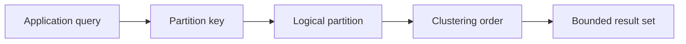
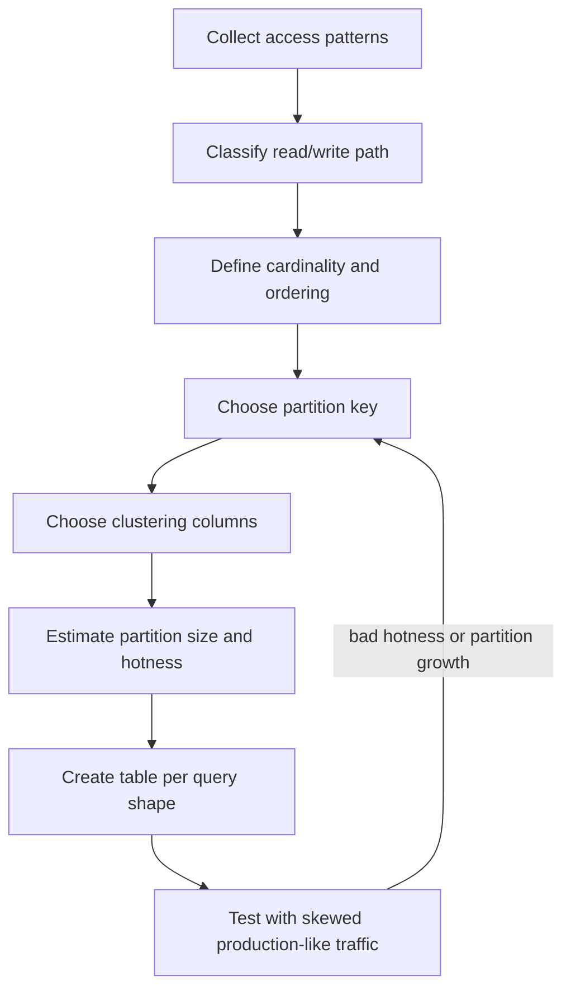
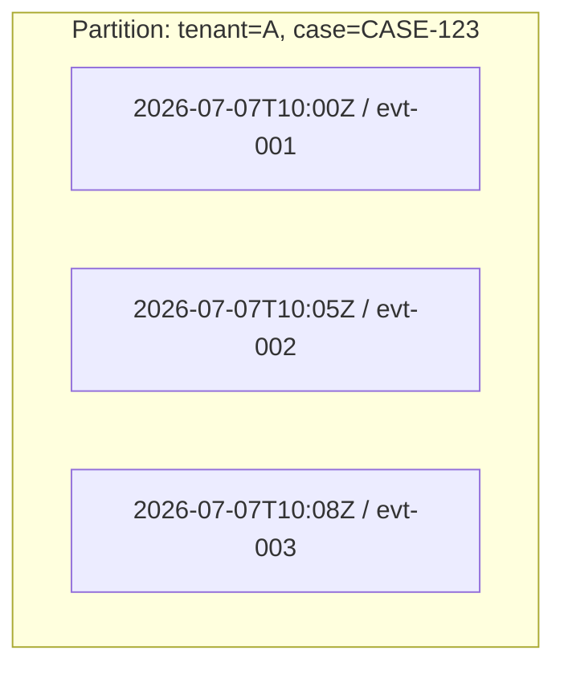
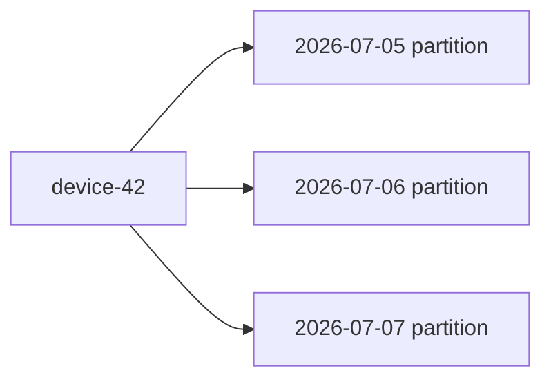
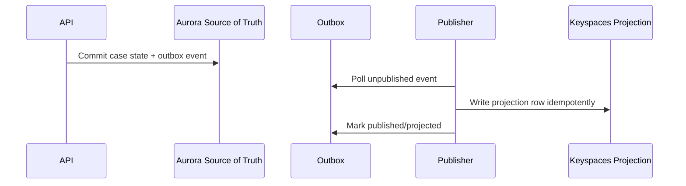
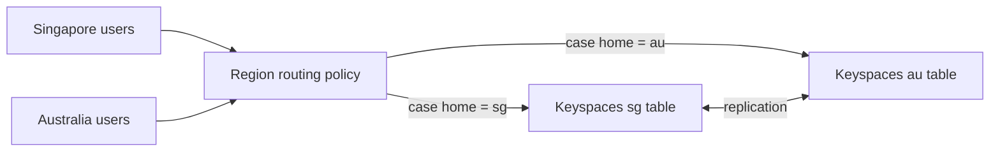
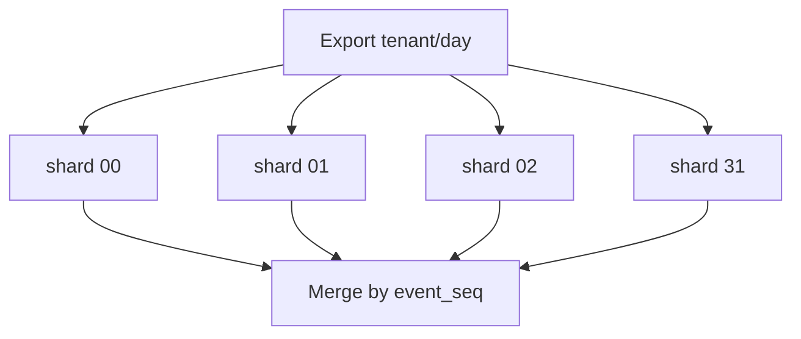
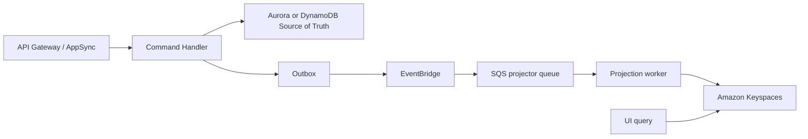
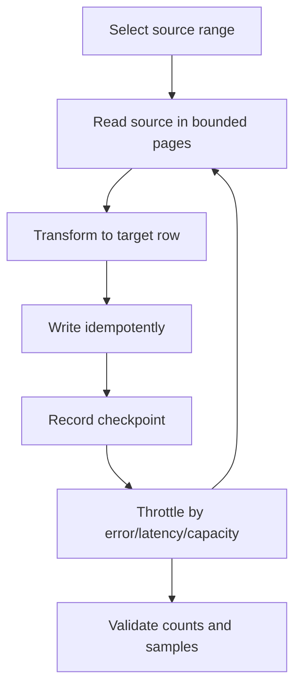

# Part 089 — Amazon Keyspaces: Cassandra-Compatible Modeling, Partition, Clustering, Query

Amazon Keyspaces is not “SQL without joins.” It is not DynamoDB with CQL syntax. It is a managed, Apache Cassandra-compatible, wide-column database service where the data model is designed from the query backward.

If relational design starts with entities and constraints, Cassandra-style design starts with this question:

> For this exact access pattern, what partition can answer the query with bounded work?

That one sentence is the core of this part.

Amazon Keyspaces removes cluster operations such as node provisioning, patching, and replication management, but it does not remove Cassandra’s modeling discipline. You still need to design partition keys, clustering columns, query tables, cardinality, time buckets, TTL, consistency level, and operational alarms deliberately.

This part focuses on usage and implementation:

- when Keyspaces is a good fit;
- when it is a dangerous fit;
- how to model tables from access patterns;
- how partition and clustering columns shape performance;
- how to avoid hot partitions and unbounded rows;
- how to model regulatory/case-management timelines;
- how to operate Keyspaces in production.

References used for this part are listed at the end, including AWS documentation for Keyspaces data modeling, partition keys, CQL compatibility, consistency, multi-Region replication, quotas, and metrics.

---

## 1. The Mental Model

A Keyspaces table is a distributed lookup structure.

You do not ask it, “find whatever matches this flexible predicate.” You ask it, “given this partition key, return a known slice of rows ordered by clustering columns.”

The primary key has two parts:

```txt
PRIMARY KEY ((partition_key_columns...), clustering_columns...)
```

The **partition key** decides where the data is stored and how read/write load is distributed. The **clustering columns** decide how rows are ordered within that partition.



A good Keyspaces query is usually:

```sql
SELECT ...
FROM table_by_access_pattern
WHERE partition_key = ?
  AND clustering_column >= ?
  AND clustering_column < ?
ORDER BY clustering_column DESC
LIMIT ?;
```

A bad Keyspaces query usually smells like:

```sql
SELECT ...
FROM one_big_entity_table
WHERE status = 'OPEN'
  AND assigned_to = 'alice'
  AND created_at > ?;
```

That second query is a relational/filtering mindset. In Cassandra-style modeling, you would create a table whose primary key is built for that access pattern.

---

## 2. What Amazon Keyspaces Is Good At

Use Keyspaces when these properties dominate:

| Requirement | Why Keyspaces fits |
|---|---|
| Very high scale key-based access | Partition-key-first model distributes load horizontally. |
| Predictable query patterns | Tables can be designed per access pattern. |
| Wide-row/time-ordered reads | Clustering columns naturally support ordered slices inside a partition. |
| Cassandra compatibility need | Existing Cassandra/CQL applications can migrate with less rewrite than changing database model entirely. |
| Multi-Region active-active-ish Cassandra-style applications | Keyspaces supports multi-Region replication for replicated tables. |
| Serverless Cassandra operations | No node capacity planning, compaction tuning, repair scheduling, or cluster patching by your team. |

Good workload examples:

- device/event history by device and time bucket;
- compliance activity timeline by case;
- append-heavy audit records by tenant and day;
- lookup tables keyed by high-cardinality IDs;
- materialized query tables for known dashboards;
- Cassandra migration where rewriting to DynamoDB/Aurora is too risky.

---

## 3. What Amazon Keyspaces Is Bad At

Do not use Keyspaces when the workload needs these as primary behaviors:

| Requirement | Better fit |
|---|---|
| Ad hoc filtering across arbitrary columns | OpenSearch, Athena/S3, Redshift, relational reporting model. |
| Complex joins and foreign-key integrity | Aurora/RDS PostgreSQL or MySQL. |
| Cross-partition transactional workflows | Aurora/RDS, DynamoDB transactions for bounded item sets, or workflow orchestration. |
| Small domain model with highly relational constraints | Aurora/RDS is usually simpler. |
| Flexible product search | OpenSearch projection. |
| Graph traversal | Neptune. |
| Time-series analytics with retention tiers and rollups | Timestream. |

A common failure is using Keyspaces because the system has “large data,” then discovering that every product requirement asks for another secondary query. The fix is not to add arbitrary indexes everywhere. The fix is to model query tables explicitly or choose a more suitable database.

---

## 4. Cassandra-Style Modeling Is Query-First

Relational modeling often starts like this:

```txt
Find nouns → normalize entities → define relationships → write queries
```

Keyspaces modeling starts like this:

```txt
List queries → group by access pattern → design primary key → duplicate data intentionally
```

The workflow:



The important phrase is **table per query shape**. That does not mean table per endpoint blindly. It means each table has one explicit access contract.

---

## 5. Access Pattern Inventory

Before creating a table, write the access patterns as a table.

Example for a regulatory enforcement platform:

| ID | User journey | Query | Sort/order | Cardinality | Freshness | Criticality |
|---|---|---|---|---:|---|---|
| AP-01 | Case officer opens case timeline | list events by `tenantId + caseId`, newest first | `occurredAt DESC` | 10–20k per case | < 1s | high |
| AP-02 | Supervisor dashboard | list open escalations by `tenantId + officerId` | `dueAt ASC` | 0–5k per officer | < 5s | high |
| AP-03 | Audit export | list audit records by `tenantId + day` | `eventId ASC` | 100k–10M per day | minutes | medium |
| AP-04 | Case lookup | find case summary by `caseId` | none | 1 | < 100ms | high |
| AP-05 | SLA breach scan | list due tasks by `tenantId + dayBucket` | `dueAt ASC` | large | < 1min | high |

Now map each access pattern to a table.

| Access pattern | Table |
|---|---|
| AP-01 | `case_events_by_case` |
| AP-02 | `open_escalations_by_officer` |
| AP-03 | `audit_events_by_tenant_day` |
| AP-04 | `case_summary_by_id` |
| AP-05 | `due_tasks_by_tenant_day` |

This looks redundant. That is the point. Keyspaces is optimized for query-specific denormalization.

---

## 6. Primary Key Anatomy

A primary key in CQL:

```sql
PRIMARY KEY ((tenant_id, case_id), occurred_at, event_id)
```

This means:

- partition key: `(tenant_id, case_id)`;
- clustering columns: `occurred_at`, `event_id`;
- rows with the same tenant/case live in the same logical partition;
- rows are sorted by `occurred_at`, then `event_id` inside that partition.



The model is efficient when the query provides the partition key:

```sql
SELECT event_type, actor_id, payload
FROM case_events_by_case
WHERE tenant_id = ?
  AND case_id = ?
ORDER BY occurred_at DESC
LIMIT 100;
```

It is not efficient if the query does not provide the partition key:

```sql
-- Bad modeling smell
SELECT *
FROM case_events_by_case
WHERE actor_id = ?;
```

If `actor_id` is a real access pattern, create a separate table:

```sql
CREATE TABLE case_events_by_actor_day (
    tenant_id text,
    actor_id text,
    day date,
    occurred_at timestamp,
    event_id text,
    case_id text,
    event_type text,
    payload text,
    PRIMARY KEY ((tenant_id, actor_id, day), occurred_at, event_id)
) WITH CLUSTERING ORDER BY (occurred_at DESC, event_id ASC);
```

---

## 7. Partition Key Design

The partition key must balance two opposing constraints:

1. **Locality**: rows needed together should be in the same partition.
2. **Distribution**: traffic should not concentrate into too few partitions.

A partition key that is too narrow creates hot partitions.

```txt
partition key = tenant_id
```

If one tenant is large, every write for that tenant hits the same partition key space.

A partition key that is too wide destroys locality.

```txt
partition key = event_id
```

This distributes well, but you cannot query a case timeline efficiently.

Good partition keys usually encode the access pattern:

```txt
(tenant_id, case_id)
(tenant_id, officer_id)
(tenant_id, day_bucket)
(device_id, hour_bucket)
(account_id, statement_month)
```

### 7.1 Time Buckets

Time-series-like data should almost always include a bucket.

Bad:

```sql
PRIMARY KEY ((tenant_id, device_id), event_time)
```

If the device lives for years, the partition grows forever.

Better:

```sql
PRIMARY KEY ((tenant_id, device_id, day), event_time, event_id)
```

The bucket bounds the partition.



Choose bucket size based on:

- write rate per entity;
- read window size;
- retention period;
- partition growth;
- query count cost.

If users usually read “last 24 hours,” a day bucket is natural. If write rate is huge, use hour buckets. If writes are sparse, week/month buckets may be acceptable.

### 7.2 Composite Partition Keys

Composite partition keys help combine tenancy, ownership, and bucket.

```sql
PRIMARY KEY ((tenant_id, officer_id, due_day), due_at, task_id)
```

This supports:

```sql
SELECT *
FROM due_tasks_by_officer_day
WHERE tenant_id = ?
  AND officer_id = ?
  AND due_day = ?
ORDER BY due_at ASC;
```

The key makes the access path explicit.

---

## 8. Clustering Column Design

Clustering columns define the order inside a partition.

They should answer:

- what range do we read?
- what order do we need?
- what tie-breaker guarantees uniqueness?
- do we need prefix queries?

Example:

```sql
PRIMARY KEY ((tenant_id, case_id), occurred_at, event_id)
WITH CLUSTERING ORDER BY (occurred_at DESC, event_id ASC);
```

`event_id` is a tie-breaker because multiple events can share the same timestamp.

Common clustering patterns:

| Pattern | Clustering columns | Query |
|---|---|---|
| Timeline | `occurred_at DESC, event_id` | newest events first |
| Due task queue | `due_at ASC, task_id` | next due tasks |
| Version history | `entity_version DESC` | latest version first |
| Audit export | `sequence_id ASC` | deterministic export |
| Status timeline | `status, occurred_at DESC` | events by status within partition |

Be careful with clustering prefix rules. If clustering columns are `(status, due_at, task_id)`, a query by `due_at` without `status` is not naturally supported. Design the order around actual predicates.

---

## 9. Table Per Query Shape

Suppose the canonical case state is stored in Aurora, but high-volume timeline reads use Keyspaces.

You might create:

```sql
CREATE TABLE case_events_by_case (
    tenant_id text,
    case_id text,
    occurred_at timestamp,
    event_id text,
    event_type text,
    actor_id text,
    actor_role text,
    payload_json text,
    trace_id text,
    PRIMARY KEY ((tenant_id, case_id), occurred_at, event_id)
) WITH CLUSTERING ORDER BY (occurred_at DESC, event_id ASC);
```

For actor audit:

```sql
CREATE TABLE case_events_by_actor_day (
    tenant_id text,
    actor_id text,
    day date,
    occurred_at timestamp,
    event_id text,
    case_id text,
    event_type text,
    payload_json text,
    PRIMARY KEY ((tenant_id, actor_id, day), occurred_at, event_id)
) WITH CLUSTERING ORDER BY (occurred_at DESC, event_id ASC);
```

For daily export:

```sql
CREATE TABLE audit_events_by_tenant_day (
    tenant_id text,
    day date,
    event_seq text,
    occurred_at timestamp,
    event_id text,
    case_id text,
    actor_id text,
    event_type text,
    payload_json text,
    PRIMARY KEY ((tenant_id, day), event_seq)
) WITH CLUSTERING ORDER BY (event_seq ASC);
```

Yes, the same event is copied three times.

The invariant is:

> Denormalized tables are projections. They are not independent sources of truth unless explicitly designed that way.

---

## 10. Write Path: Dual Write Risk

If a command writes Aurora and then writes Keyspaces, you have a dual-write problem.

Bad:

```txt
1. update case in Aurora
2. insert timeline row in Keyspaces
3. return success
```

If step 1 succeeds and step 2 fails, the source of truth and projection diverge.

Better:



The source-of-truth transaction records the event. A projector writes Keyspaces asynchronously and idempotently.

Projection lag is then a designed behavior, not a surprise.

---

## 11. Idempotent Writes

Keyspaces writes can be retried by clients. Retried writes must not duplicate logical events.

Use deterministic IDs:

```txt
event_id = hash(command_id + event_type + aggregate_version)
```

Then write with the same primary key on retry.

For append-only timelines, the primary key should include the deterministic `event_id` as tie-breaker:

```sql
PRIMARY KEY ((tenant_id, case_id), occurred_at, event_id)
```

If the write is retried, it writes the same row, not a new row.

For projections derived from an outbox, store projector progress elsewhere if needed:

```txt
projection_checkpoint
- projector_name
- source_event_id
- processed_at
- target_table
- target_key
- result_hash
```

The projector should be safe under:

- duplicate source event;
- retry after timeout;
- partial failure;
- replay after schema migration;
- projection rebuild.

---

## 12. Consistency Levels

Amazon Keyspaces supports Cassandra-style read/write consistency options, but you should treat consistency as an application contract.

Typical read consistency choices:

| Consistency | Use when |
|---|---|
| `LOCAL_QUORUM` | The read must reflect successful prior writes in the Region. |
| `LOCAL_ONE` / `ONE` | Lower latency / higher availability is more important than immediate freshness. |

For command correctness, do not rely on a stale projection table. Keep command validation against the source-of-truth store, or use a Keyspaces table explicitly designed as the source of truth with clear consistency semantics.

Bad:

```txt
Validate enforcement transition using eventually fresh timeline projection.
```

Better:

```txt
Validate enforcement transition against authoritative case state table.
Append timeline as projection.
```

---

## 13. Multi-Region Replication

Keyspaces supports multi-Region replication for replicated tables. This is valuable, but it does not remove distributed systems problems.

You still need policies for:

- write ownership;
- conflict handling;
- idempotency;
- Region failover;
- duplicate projection writes;
- regulatory data residency;
- replay after regional outage.

A safe pattern is **aggregate-home Region**:

```txt
homeRegion(caseId) = hash(caseId) % allowedRegions
```

All writes for a case are routed to its home Region during normal operations. Other Regions serve local reads and may take over only during controlled evacuation.



Avoid assuming that multi-Region means “write anywhere with no semantic cost.” Multi-Region correctness belongs to the application model.

---

## 14. TTL and Lifecycle Modeling

TTL is useful when data naturally expires:

- temporary lookup rows;
- session-derived state;
- short-lived dedup records;
- raw telemetry with fixed retention;
- non-authoritative projection caches.

Do not use TTL blindly for evidence, audit, or regulatory records unless retention policy explicitly allows deletion.

For regulatory systems, define lifecycle classes:

| Data | Retention | TTL allowed? |
|---|---:|---|
| Case timeline event | years / legal policy | usually no |
| UI notification | 30–90 days | yes |
| Idempotency key | 1–30 days | yes, depending replay window |
| Projection checkpoint | until rebuild policy allows deletion | maybe |
| Audit evidence | legal hold aware | usually no |

TTL is not a substitute for data governance.

---

## 15. Secondary Index Discipline

Cassandra-compatible systems are not designed around arbitrary secondary indexes the way relational databases are.

The main design tool is still table-per-query.

Use secondary indexing only when:

- cardinality is understood;
- query fanout is bounded;
- traffic is measured;
- fallback plan exists;
- the index is part of the access contract.

If a query is important and high-volume, model it as a dedicated table.

---

## 16. Capacity and Hot Partition Thinking

The most important production risk is uneven partition activity.

A table can be large and still healthy if load is distributed. A table can be small and unhealthy if one partition key receives most requests.

Watch for keys like:

```txt
tenant_id = "largest-government-agency"
status = "OPEN"
day = "today"
country = "SG"
```

Those are low-cardinality or skewed keys.

Better keys combine locality with distribution:

```txt
(tenant_id, officer_id, due_day)
(tenant_id, case_id)
(tenant_id, shard_id, day)
(device_id, hour_bucket)
```

When a logical group is too hot, add a shard component:

```txt
partition_key = (tenant_id, day, shard_id)
shard_id = hash(event_id) % 32
```

Then reads must query all shards for that day and merge results. That is a trade-off: write distribution improves, read complexity increases.

---

## 17. Modeling Example: Case Timeline

### Requirement

Case officers need to view case timeline events newest-first. A case may have up to 50,000 events over its lifetime. Most reads load the last 100 events. Some reads paginate older history.

### Table

```sql
CREATE TABLE case_events_by_case (
    tenant_id text,
    case_id text,
    occurred_at timestamp,
    event_id text,
    event_type text,
    actor_id text,
    actor_role text,
    summary text,
    payload_json text,
    schema_version int,
    trace_id text,
    PRIMARY KEY ((tenant_id, case_id), occurred_at, event_id)
) WITH CLUSTERING ORDER BY (occurred_at DESC, event_id ASC);
```

### Query

```sql
SELECT occurred_at, event_id, event_type, actor_id, summary, payload_json
FROM case_events_by_case
WHERE tenant_id = :tenantId
  AND case_id = :caseId
LIMIT 100;
```

### Pagination

Use the driver/page mechanism or explicit cursor fields. The API cursor should not expose internal details blindly. Encode a stable cursor:

```json
{
  "tenantId": "t-123",
  "caseId": "case-456",
  "lastOccurredAt": "2026-07-07T10:13:00Z",
  "lastEventId": "evt-789"
}
```

### Invariants

- `event_id` is deterministic.
- `occurred_at` is event time, not ingest time.
- `payload_json` includes `schema_version` or the row has a schema version column.
- Application can tolerate duplicate projector writes.
- Timeline is a projection unless declared authoritative.

---

## 18. Modeling Example: Due Tasks by Officer

### Requirement

Show due tasks for an officer sorted by due time.

### Table

```sql
CREATE TABLE due_tasks_by_officer_day (
    tenant_id text,
    officer_id text,
    due_day date,
    due_at timestamp,
    task_id text,
    case_id text,
    task_type text,
    priority text,
    status text,
    summary text,
    PRIMARY KEY ((tenant_id, officer_id, due_day), due_at, task_id)
) WITH CLUSTERING ORDER BY (due_at ASC, task_id ASC);
```

### Query

```sql
SELECT due_at, task_id, case_id, task_type, priority, summary
FROM due_tasks_by_officer_day
WHERE tenant_id = :tenantId
  AND officer_id = :officerId
  AND due_day = :today
LIMIT 100;
```

### Update Problem

If task status changes from `OPEN` to `DONE`, you must remove or update the projection row.

If the table only contains open tasks, completion should delete the row:

```sql
DELETE FROM due_tasks_by_officer_day
WHERE tenant_id = ?
  AND officer_id = ?
  AND due_day = ?
  AND due_at = ?
  AND task_id = ?;
```

This means the source of truth must know the previous projection key or emit enough event data for the projector to compute it.

Event payload should include:

```json
{
  "taskId": "task-123",
  "previous": {
    "officerId": "officer-a",
    "dueDay": "2026-07-07",
    "dueAt": "2026-07-07T14:00:00Z",
    "status": "OPEN"
  },
  "current": {
    "officerId": "officer-a",
    "dueDay": "2026-07-07",
    "dueAt": "2026-07-07T14:00:00Z",
    "status": "DONE"
  }
}
```

Without previous keys, projection repair becomes expensive.

---

## 19. Modeling Example: Daily Audit Export

### Requirement

Export all audit events for a tenant and day deterministically.

### Risk

One tenant/day may be huge.

### Option A: Single Day Partition

```sql
PRIMARY KEY ((tenant_id, day), event_seq)
```

Good for moderate event volume.

Bad if a single tenant/day becomes too large or hot.

### Option B: Sharded Day Partition

```sql
PRIMARY KEY ((tenant_id, day, shard_id), event_seq)
```

Writes are distributed. Reads must scan each shard and merge.



Choose this when write distribution matters more than single-partition read simplicity.

---

## 20. Application Integration Pattern

Keyspaces often appears as one part of a wider AWS system:



This keeps command correctness separate from read-model scalability.

A dangerous shortcut is letting UI projection writes become command truth:

```txt
API writes Keyspaces timeline → downstream reads timeline → business assumes state changed
```

If the timeline is projection, it should not authorize state transitions.

---

## 21. Schema Evolution

Wide-column schemas evolve differently from relational schemas.

Safe changes:

- add nullable column;
- add new projection table;
- write both old and new table temporarily;
- backfill new table from event log/source store;
- switch read path by feature flag;
- delete old table after verification.

Risky changes:

- changing primary key of existing table;
- changing clustering order expectation;
- changing semantic meaning of a column;
- removing column still used by old clients;
- rewriting huge partitions in place.

For primary-key changes, create a new table. Do not mutate your way out of a wrong access pattern.

---

## 22. Backfill Strategy

Backfill is a production operation, not a script.



Backfill rules:

- use checkpoints;
- throttle intentionally;
- isolate from customer-facing traffic if needed;
- emit metrics per table/keyspace;
- make writes idempotent;
- validate source-to-target counts;
- sample payload correctness;
- plan rollback or abandon strategy.

Backfill should never be an unbounded `SELECT *` plus infinite write loop.

---

## 23. Observability

Monitor by symptom and by invariant.

| Concern | Signal |
|---|---|
| Hot partition | storage-partition throughput exceeded, throttling, p99 latency by key |
| Table capacity pressure | read/write throttle events |
| Query design issue | high latency for specific query/table |
| Projection lag | oldest unprojected event age |
| Backfill impact | foreground latency increases during backfill |
| Multi-Region issue | replication lag/error signals, regional write failures |
| Driver issue | timeout, retry count, connection errors |
| Cost issue | sudden read/write unit growth, row size growth |

Log every query with:

```json
{
  "table": "case_events_by_case",
  "accessPattern": "AP-01",
  "tenantIdHash": "...",
  "partitionKeyHash": "...",
  "limit": 100,
  "consistency": "LOCAL_QUORUM",
  "latencyMs": 24,
  "retryCount": 0,
  "resultCount": 100,
  "traceId": "..."
}
```

Do not log raw sensitive partition keys if they contain personal or regulated identifiers. Hash or tokenize.

---

## 24. Incident Runbook: Hot Partition

Symptoms:

- elevated p99 latency;
- write/read throttle events;
- one tenant/case/device dominates traffic;
- retries amplify load;
- downstream queues grow.

Immediate actions:

1. Identify the table and access pattern.
2. Identify hot key without exposing sensitive data.
3. Reduce retry aggressiveness.
4. Enable application-level shedding for non-critical reads.
5. Temporarily route expensive queries to cached/stale projection if safe.
6. Pause or throttle backfills.
7. Increase table throughput mode/limits if relevant.
8. Prepare data-model fix if key is structurally hot.

Permanent fixes:

- introduce bucket or shard key;
- split hot access pattern into separate table;
- cache hot read with bounded staleness;
- change dashboard query to precomputed projection;
- add queue-based smoothing for writes;
- revise access pattern contract.

---

## 25. Testing Matrix

| Test | Expected result |
|---|---|
| Query without full partition key | rejected in review or impossible through repository API |
| Single large tenant traffic | no partition-level throttling beyond target budget |
| Duplicate projection event | same final row state |
| Projection replay | no duplicate logical rows |
| Backfill while live writes continue | bounded lag and no customer p99 breach |
| Schema version mix | old and new readers function |
| Multi-Region regional outage | writes follow documented policy |
| Hot case timeline | partition growth and latency remain within budget |
| TTL expiration | only allowed lifecycle data disappears |
| Driver timeout | retry policy does not create storm |

---

## 26. Repository Boundary

Do not expose free-form CQL from application code. Expose access-pattern-specific repository methods.

Bad:

```java
keyspacesClient.execute("SELECT * FROM " + table + " WHERE " + filter);
```

Better:

```java
interface CaseTimelineProjectionRepository {
    Page<CaseEventRow> listLatestEvents(
        TenantId tenantId,
        CaseId caseId,
        int limit,
        PageCursor cursor
    );

    void upsertEventProjection(CaseEventProjectionRow row);
}
```

The repository name should encode that it is a projection if it is not authoritative.

---

## 27. Design Review Checklist

Before approving a Keyspaces table, answer:

- What access pattern does this table serve?
- What is the exact query shape?
- What is the partition key?
- What is the clustering order?
- What is expected partition size after 1 month, 1 year, 5 years?
- What is expected hottest key traffic?
- What is the read/write consistency requirement?
- Is this table source of truth or projection?
- How is it populated?
- Is write idempotent?
- How is it backfilled?
- How is it reconciled?
- What is the retention policy?
- What are the alarms?
- What happens during Region failure?
- What happens if this table is wrong and must be remodeled?

If the answer to “what query does this table serve?” is vague, the design is not ready.

---

## 28. Key Takeaways

- Amazon Keyspaces is strongest when access patterns are known and partition-key-first.
- Partition key design is the main scalability decision.
- Clustering columns are your ordered index inside a partition.
- Table-per-query-shape is normal, not a smell.
- Denormalized tables need clear source-of-truth and projection rules.
- Hot partitions are usually data-model problems, not only capacity problems.
- Multi-Region replication does not remove write-ownership and conflict policy.
- Backfill, replay, and schema evolution must be designed before production traffic.

---

## References

- AWS Documentation — What is Amazon Keyspaces: https://docs.aws.amazon.com/keyspaces/latest/devguide/what-is-keyspaces.html
- AWS Documentation — How Amazon Keyspaces works: https://docs.aws.amazon.com/keyspaces/latest/devguide/how-it-works.html
- AWS Documentation — Data modeling in Amazon Keyspaces: https://docs.aws.amazon.com/keyspaces/latest/devguide/data-modeling.html
- AWS Documentation — Partition key design: https://docs.aws.amazon.com/keyspaces/latest/devguide/bp-partition-key-design.html
- AWS Documentation — Supported Cassandra APIs and CQL compatibility: https://docs.aws.amazon.com/keyspaces/latest/devguide/cassandra-apis.html
- AWS Documentation — Supported consistency levels: https://docs.aws.amazon.com/keyspaces/latest/devguide/consistency.html
- AWS Documentation — Multi-Region replication: https://docs.aws.amazon.com/keyspaces/latest/devguide/multiRegion-replication.html
- AWS Documentation — Quotas: https://docs.aws.amazon.com/keyspaces/latest/devguide/quotas.html
- AWS Documentation — Metrics and dimensions: https://docs.aws.amazon.com/keyspaces/latest/devguide/metrics-dimensions.html
