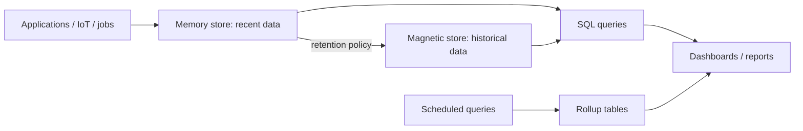
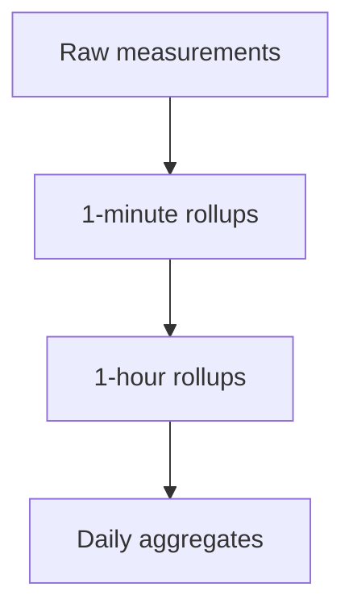
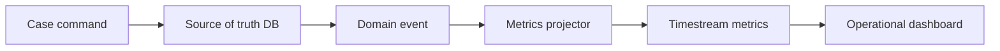
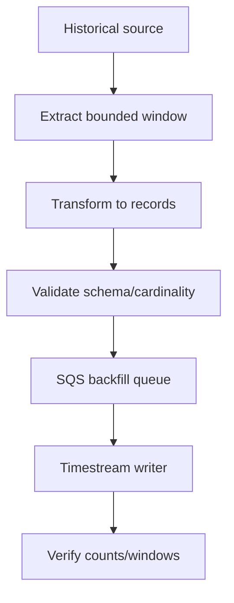

# Part 090 — Amazon Timestream: Time-Series Modeling, Retention, Dimension, Measure

Time-series data is not just data with a timestamp.

A time-series system is built around time as the dominant access path:

- recent values;
- historical windows;
- aggregation by time bucket;
- retention by age;
- late-arriving data;
- high-ingest append patterns;
- dashboards that ask the same questions every minute.

Amazon Timestream for LiveAnalytics is a purpose-built time-series database service for storing and analyzing time-series data. It gives you a memory store for recent data, a magnetic store for historical data, SQL query support, scheduled queries for rollups, and lifecycle policies for retention.

This part focuses on **Timestream for LiveAnalytics**. AWS also offers Timestream for InfluxDB as a managed InfluxDB-compatible option, but the modeling in this part targets the serverless Timestream LiveAnalytics model: database, table, dimensions, measures, time, retention tiers, and scheduled queries.

The main rule:

> Model time-series data from the dashboard and retention policy backward.

If you do not know query windows, aggregation grain, cardinality, and retention, you do not have enough information to design a Timestream table.

---

## 1. Mental Model

A Timestream record is roughly:

```txt
time + dimensions + measure(s)
```

- **Time**: when the measurement happened.
- **Dimensions**: metadata used to identify and group the series.
- **Measures**: the observed values.

Example:

```json
{
  "time": "2026-07-07T10:15:00Z",
  "dimensions": {
    "tenantId": "t-123",
    "service": "case-api",
    "region": "ap-southeast-1",
    "environment": "prod"
  },
  "measureName": "latency_ms",
  "measureValue": 42.7
}
```

A more efficient representation for related values can use **multi-measure records**:

```json
{
  "time": "2026-07-07T10:15:00Z",
  "dimensions": {
    "tenantId": "t-123",
    "service": "case-api",
    "region": "ap-southeast-1"
  },
  "measures": {
    "p50_latency_ms": 18.1,
    "p95_latency_ms": 92.4,
    "p99_latency_ms": 210.3,
    "request_count": 1842,
    "error_count": 12
  }
}
```

The storage lifecycle:



The memory store is for recent data. The magnetic store is for older data. Retention policies decide when data moves and when it expires permanently.

---

## 2. When Timestream Fits

Use Timestream when the workload is dominated by:

| Requirement | Why Timestream fits |
|---|---|
| Time-window queries | Time is a first-class query dimension. |
| High-volume append measurements | Time-series ingestion is the core model. |
| Recent + historical storage tiers | Memory and magnetic store retention are built in. |
| Dashboards and operational analytics | SQL and scheduled queries support dashboard workloads. |
| Rollups and downsampling | Scheduled queries can precompute aggregates. |
| IoT, metrics, telemetry, compliance monitoring | These naturally group by dimensions and time. |

Good examples:

- application latency/error metrics;
- IoT device telemetry;
- enforcement SLA breach counts by hour/day;
- case processing throughput over time;
- audit event volume metrics;
- sensor readings;
- operational dashboard aggregates;
- regulatory trend analytics where source events live elsewhere.

---

## 3. When Timestream Is the Wrong Primary Store

Do not use Timestream as the source of truth for rich business entities.

Bad fits:

| Need | Better fit |
|---|---|
| Current case state | Aurora/RDS or DynamoDB |
| Complex transactional workflow | Aurora/RDS, DynamoDB, Step Functions |
| Arbitrary search over documents | OpenSearch projection |
| Graph traversal | Neptune |
| Event sourcing ledger with strict legal evidence semantics | Append-only relational/event store or immutable log architecture |
| Flexible BI across many dimensions and joins | S3 + Glue + Athena, Redshift, or lakehouse pattern |

Timestream can store measurements derived from domain events. It should not replace the domain model.

---

## 4. Dimensions vs Measures

This is the first major modeling decision.

### Dimensions

Dimensions identify and group a series.

Examples:

```txt
tenantId
service
region
environment
deviceId
caseType
officerTeam
workflowName
```

Use dimensions for values you filter/group by frequently.

### Measures

Measures are numeric/string/boolean values observed at a time.

Examples:

```txt
latency_ms
request_count
error_count
cpu_percent
sla_breach_count
queue_age_seconds
case_open_count
```

Use measures for values you aggregate, average, sum, min/max, or plot.

### Bad Dimension Smells

Do not put extremely high-cardinality or unbounded values into dimensions unless query patterns require it.

Dangerous dimensions:

```txt
requestId
traceId
customerEmail
freeTextReason
fullUrlWithQueryString
rawUserAgent
```

These explode cardinality and often violate privacy expectations.

### Bad Measure Smells

Do not put filter/group identifiers as measures if dashboards need to group by them.

Bad:

```txt
measure: tenantId = "t-123"
```

Better:

```txt
dimension: tenantId = "t-123"
```

The design question:

> Will I filter/group by this, or will I aggregate this as a value?

---

## 5. Single-Measure vs Multi-Measure Records

A single-measure shape stores one value per record:

```txt
(time, dimensions, measure_name, measure_value)
```

A multi-measure shape stores multiple related values at the same timestamp and dimension set.

Use multi-measure records when:

- metrics share the same timestamp;
- metrics share the same dimensions;
- dashboards usually read them together;
- ingestion code naturally emits them as a bundle.

Example: API service rollup per minute.

```json
{
  "time": "2026-07-07T10:15:00Z",
  "dimensions": {
    "service": "case-api",
    "tenantTier": "enterprise",
    "region": "ap-southeast-1"
  },
  "measures": {
    "request_count": 12000,
    "error_count": 31,
    "p50_ms": 18.4,
    "p95_ms": 130.2,
    "p99_ms": 411.7
  }
}
```

Do not force unrelated measures into one multi-measure record if they have different update rates, dimensions, or query lifecycles.

---

## 6. Table Design

A Timestream database can contain multiple tables. Use tables to separate different lifecycle and query domains.

Possible tables:

| Table | Data | Retention intent |
|---|---|---|
| `app_service_metrics_raw` | raw service metrics | short memory, medium magnetic |
| `app_service_metrics_1m` | 1-minute rollups | medium memory, long magnetic |
| `case_workflow_metrics_1h` | hourly workflow stats | long magnetic |
| `device_telemetry_raw` | device readings | short/medium depending use case |
| `sla_breach_metrics_daily` | daily regulatory KPIs | long retention |

Do not create one table per metric blindly. Tables should reflect lifecycle and access pattern boundaries.

---

## 7. Retention Modeling

Retention is not a storage afterthought. It is a query and cost design decision.

Timestream for LiveAnalytics has:

- **memory store retention** for recent data;
- **magnetic store retention** for historical data.

When data ages out of memory retention, it moves to magnetic store. When it ages out of magnetic retention, it is permanently deleted.

Example retention design:

| Data | Memory store | Magnetic store | Reason |
|---|---:|---:|---|
| raw API metrics | 6 hours | 30 days | debugging recent incidents |
| 1-minute rollups | 7 days | 13 months | dashboards and trend analysis |
| daily SLA KPIs | 30 days | 7 years | regulatory reporting |
| raw device telemetry | 24 hours | 90 days | operational inspection |

The dangerous mistake is keeping raw data forever because “maybe one day.” Usually the right pattern is raw-short + rollup-long.

---

## 8. Late-Arriving Data

Time-series systems must handle late records.

Causes:

- mobile/offline clients;
- device buffering;
- network outage;
- batch imports;
- delayed event pipeline;
- replay after failure.

If late data is expected, configure retention and magnetic store writes accordingly. The modeling question is:

> How late can valid data arrive, and must it update dashboards immediately?

Example policy:

| Data source | Expected lateness | Handling |
|---|---:|---|
| app metrics | seconds/minutes | memory store path |
| IoT gateway | up to 6 hours | allow late ingest path |
| historical migration | months/years | batch import/backfill strategy |
| regulatory correction | days/weeks | correction event + recompute rollups |

Do not design dashboards that assume ingestion time equals event time. Store both if needed:

```txt
event_time: when measurement happened
ingest_time: when system accepted it
```

---

## 9. Time Semantics

Every time-series table should define these terms:

| Term | Meaning |
|---|---|
| Event time | When the real-world/system event happened. |
| Ingest time | When Timestream received the record. |
| Processing time | When pipeline processed/aggregated it. |
| Query window | Time range selected by dashboard/API. |
| Rollup bucket time | Start of aggregation bucket. |

For correctness, dashboards should usually use event time. Pipeline monitoring often needs ingest/processing time too.

Example record dimensions/measures:

```json
{
  "time": "2026-07-07T10:15:00Z",
  "dimensions": {
    "tenantId": "t-123",
    "workflowName": "case-escalation",
    "region": "ap-southeast-1"
  },
  "measures": {
    "started_count": 100,
    "completed_count": 97,
    "failed_count": 3,
    "p95_duration_seconds": 42.5,
    "max_ingest_lag_seconds": 17
  }
}
```

---

## 10. Ingestion Architecture

A common production architecture:

```mermaid
flowchart LR
    App[Application services]
    Collector[Metrics collector / producer]
    Queue[SQS buffer]
    Writer[Timestream writer worker]
    TS[Timestream raw table]
    SQ[Scheduled query]
    Rollup[Timestream rollup table]
    Dash[Dashboard]

    App --> Collector
    Collector --> Queue
    Queue --> Writer
    Writer --> TS
    TS --> SQ
    SQ --> Rollup
    Rollup --> Dash
```



Why queue before Timestream?

- smooth bursty writes;
- isolate application latency from analytics ingestion;
- retry failed writes safely;
- provide DLQ for malformed records;
- enable backpressure;
- support replay after temporary outage.

For very low-volume workloads, direct writes may be enough. For production systems with critical operational metrics, queueing gives better failure isolation.

---

## 11. Idempotency and Duplicate Records

Metric pipelines often retry.

If a writer times out, it may not know whether Timestream accepted the record. This creates ambiguity.

Design records with deterministic identity semantics:

```txt
series identity = dimensions + measure_name + time
```

For rollups, the bucket timestamp should be deterministic:

```txt
bucket_start = truncate(event_time, 1 minute)
```

The writer should avoid generating new random timestamps for retries. If you use “now” at retry time, duplicates become new facts.

Bad:

```java
record.time = Instant.now(); // changes on retry
```

Better:

```java
record.time = metric.eventTime().truncatedTo(ChronoUnit.SECONDS);
```

---

## 12. Raw Data vs Rollup Data

Raw data is useful for debugging. Rollup data is useful for dashboards.

Do not make every dashboard scan raw data over long windows.



Example:

| Query | Should use |
|---|---|
| Last 15 minutes p99 latency | raw or 1-minute rollup |
| Last 24 hours request count | 1-minute or 5-minute rollup |
| Last 90 days SLA breach trend | daily rollup |
| Incident deep dive at exact timestamp | raw |

Scheduled queries are the main tool for precomputing rollups.

---

## 13. Scheduled Queries

A scheduled query periodically computes and writes derived time-series data.

Use it for:

- minute/hour/day rollups;
- dashboard acceleration;
- cost reduction;
- long-retention aggregates;
- KPI materialization.

Example concept:

```sql
SELECT
  BIN(time, 1m) AS bucket,
  service,
  region,
  COUNT(*) AS request_count,
  SUM(error_count) AS error_count,
  AVG(latency_ms) AS avg_latency_ms,
  APPROX_PERCENTILE(latency_ms, 0.95) AS p95_latency_ms
FROM app_service_metrics_raw
WHERE time BETWEEN ago(10m) AND now()
GROUP BY BIN(time, 1m), service, region;
```

The scheduled query writes results into a rollup table.

Design questions:

- What is the source window?
- How much lateness is allowed?
- Will the query recompute overlapping windows?
- How are corrections handled?
- What happens if scheduled query fails for 30 minutes?
- Can the rollup be rebuilt from raw data?

---

## 14. Modeling Example: Application Service Metrics

### Requirement

Platform team needs dashboards for API latency, request count, and error rate per service, Region, environment, and tenant tier.

### Dimensions

```txt
service
environment
region
tenantTier
apiName
operation
```

Avoid `tenantId` unless per-tenant dashboard is required. If you need tenant-level debugging, consider separate tables or strict retention because cardinality and privacy risk increase.

### Multi-Measure Record

```json
{
  "time": "2026-07-07T10:15:00Z",
  "dimensions": {
    "service": "case-api",
    "environment": "prod",
    "region": "ap-southeast-1",
    "tenantTier": "enterprise",
    "apiName": "cases",
    "operation": "CreateCase"
  },
  "measures": {
    "request_count": 2400,
    "error_count": 18,
    "p50_latency_ms": 22.3,
    "p95_latency_ms": 141.5,
    "p99_latency_ms": 388.2
  }
}
```

### Dashboard Queries

- request count by service over last hour;
- p95/p99 latency by operation;
- error rate by tenant tier;
- Region comparison;
- deployment regression before/after timestamp.

---

## 15. Modeling Example: Regulatory Case Workflow Metrics

### Requirement

Track enforcement lifecycle performance:

- cases opened;
- cases escalated;
- cases closed;
- SLA breaches;
- average time in stage;
- backlog by stage.

Do not store full case state in Timestream. Store derived measurements.

### Dimensions

```txt
tenantId
caseType
stage
region
officerTeam
priority
```

### Measures

```txt
opened_count
escalated_count
closed_count
sla_breach_count
backlog_count
avg_stage_age_hours
p95_stage_age_hours
```

### Hourly Rollup Record

```json
{
  "time": "2026-07-07T10:00:00Z",
  "dimensions": {
    "tenantId": "t-123",
    "caseType": "AML_REVIEW",
    "stage": "INVESTIGATION",
    "officerTeam": "team-east",
    "priority": "HIGH"
  },
  "measures": {
    "opened_count": 12,
    "escalated_count": 3,
    "closed_count": 7,
    "sla_breach_count": 1,
    "backlog_count": 184,
    "p95_stage_age_hours": 36.2
  }
}
```

This makes regulatory dashboards cheap and stable without forcing case queries into an analytics store.

---

## 16. Modeling Example: IoT Device Telemetry

### Requirement

Store sensor data from devices. Query recent device readings and aggregate fleet health.

### Dimensions

```txt
deviceId
deviceType
siteId
firmwareVersion
region
```

Be careful with firmware version as a dimension: it is useful for rollout analysis, but if it changes frequently, make sure dashboards expect it.

### Measures

```txt
temperature_c
humidity_percent
battery_percent
signal_strength
error_code
```

### Multi-Measure Record

```json
{
  "time": "2026-07-07T10:15:02Z",
  "dimensions": {
    "deviceId": "device-001",
    "deviceType": "gateway",
    "siteId": "site-sg-12",
    "region": "ap-southeast-1"
  },
  "measures": {
    "temperature_c": 31.4,
    "humidity_percent": 74.2,
    "battery_percent": 88.0,
    "signal_strength": -67
  }
}
```

Common queries:

- latest value per device;
- device history for last 24 hours;
- average temperature by site/hour;
- battery below threshold;
- error rate by firmware version.

For “latest device state,” evaluate whether you need a separate latest-state table in DynamoDB or Aurora. Timestream can answer time-series history, but operational systems often need current state with fast direct lookup.

---

## 17. Query Design

Good Timestream queries always bound time.

Bad:

```sql
SELECT *
FROM metrics
WHERE service = 'case-api';
```

Better:

```sql
SELECT time, p95_latency_ms, error_count
FROM app_service_metrics_1m
WHERE service = 'case-api'
  AND time BETWEEN ago(1h) AND now()
ORDER BY time DESC;
```

Dashboards should use stable windows:

```txt
last 15 minutes
last 1 hour
last 24 hours
last 30 days
```

Longer windows should usually query rollup tables.

---

## 18. High Cardinality

High cardinality is not automatically bad. Uncontrolled cardinality is bad.

High-cardinality dimensions may be legitimate:

```txt
deviceId
caseId
tenantId
workflowExecutionId
```

But they must be justified by query patterns.

Do not make `traceId` a dimension just because it exists. If you need trace-level debugging, use tracing/logging systems. Timestream is not your trace store.

Cardinality review checklist:

- How many unique values per day?
- Does the dimension appear in dashboard filters?
- Is it sensitive?
- Does it grow without bound?
- Does it create cost/query explosion?
- Should it be hashed, bucketed, or omitted?

---

## 19. Correction and Recalculation

Time-series data is often corrected:

- late data arrives;
- metric bug fixed;
- business definition changes;
- regulatory classification changes;
- backfill adds missing records.

For derived rollups, define recalculation policy.

Options:

| Strategy | Use when |
|---|---|
| Append correction measure | auditability matters and correction must be visible |
| Recompute overlapping window | dashboard accuracy matters and raw data retained |
| Rebuild rollup table | definition changed materially |
| Version metric name | old and new definitions must coexist |

Metric definitions must be versioned.

Bad:

```txt
sla_breach_count changed meaning silently on July 7
```

Better:

```txt
sla_breach_count_v1
sla_breach_count_v2
```

Or include a `metricDefinitionVersion` dimension when appropriate.

---

## 20. Source of Truth Boundary

A Timestream record should usually be treated as derived analytics state.

For example:

```txt
Case command → Aurora/DynamoDB source of truth → EventBridge → metrics projector → Timestream
```



The dashboard can inform humans. It should not be the authoritative state machine for enforcement decisions.

---

## 21. Security and Privacy

Time-series metrics can leak sensitive data.

Avoid dimensions like:

```txt
customerEmail
personName
nationalId
caseDescription
freeTextReason
fullIpAddress unless required and governed
```

Prefer:

```txt
tenantId hash or internal ID
caseType
officerTeam
region
device class
risk tier
```

Define:

- who can query raw data;
- who can query rollups;
- retention per table;
- encryption and access boundary;
- PII redaction rules;
- audit logging for query access;
- data export policy.

Metrics are not automatically non-sensitive.

---

## 22. Cost Model Thinking

Avoid pricing-by-memory. Design by workload drivers:

- ingest volume;
- record size;
- dimensions count/cardinality;
- query scan range;
- raw retention;
- rollup retention;
- scheduled query frequency;
- dashboard refresh rate;
- number of concurrent dashboard users.

Cost traps:

| Trap | Consequence |
|---|---|
| dashboards scan raw 90-day data | high query cost and latency |
| excessive dimensions | larger records and higher cardinality |
| no rollups | repeated expensive aggregation |
| over-retaining raw data | storage/cost growth |
| high refresh rate dashboards | query amplification |
| per-tenant panels for thousands of tenants | dashboard fanout explosion |

The fix is usually rollup tables, retention discipline, and dashboard query budgets.

---

## 23. Dashboard Design

Dashboards are production clients. They can overload databases.

Dashboard rules:

- default to rollup tables;
- limit time windows;
- avoid auto-refresh below useful granularity;
- pre-aggregate expensive panels;
- cap top-N queries;
- avoid per-tenant unbounded fanout;
- show freshness/last update timestamp;
- show “data delayed” when ingestion lag exceeds budget.

A dashboard without freshness information is dangerous. Humans may assume it is real time.

---

## 24. Observability for the Timestream Pipeline

Monitor both Timestream and the pipeline around it.

| Component | Signal |
|---|---|
| Producer | emitted records count, dropped metrics, serialization errors |
| Queue | visible backlog, oldest message age, DLQ growth |
| Writer | write success/failure, retry count, rejected record count, latency |
| Timestream table | ingest errors, query latency, throttling, storage growth |
| Scheduled query | success/failure, delay, output row count |
| Dashboard | query latency, error rate, refresh count |
| Data correctness | expected vs actual counts, freshness, gap detection |

Add data-quality metrics:

```txt
metrics_projector_lag_seconds
metrics_records_rejected_total
metrics_records_late_total
metrics_rollup_last_success_time
metrics_gap_detected_total
```

---

## 25. Failure Modes

| Failure | Cause | Mitigation |
|---|---|---|
| Missing dashboard data | writer failure, scheduled query failure | queue + DLQ + freshness indicator |
| Duplicate datapoints | retry with changing timestamp | deterministic event time/bucket |
| Expensive dashboard query | raw scan over long window | rollup table and query budget |
| Late data not reflected | no overlapping recompute | scheduled query overlap/rebuild policy |
| Metric definition drift | semantic change without version | version metric definitions |
| Cardinality explosion | requestId/userAgent dimensions | dimension governance |
| Retention data loss | magnetic retention too short | retention ADR and legal review |
| Backfill overload | unthrottled historical writes | bounded batch, queue, rate limit |
| Sensitive data leak | PII in dimensions | schema review and redaction |

---

## 26. Backfill and Migration

Historical data backfill needs a separate plan.



Backfill rules:

- process by time window;
- throttle intentionally;
- separate backfill from live ingest;
- make writes deterministic;
- track checkpoints;
- verify row counts and aggregates;
- pause on query/ingest degradation;
- document correction/recompute policy.

Backfill can also change rollups. Do not backfill raw data and forget to rebuild derived tables.

---

## 27. Production Readiness Checklist

Before using Timestream in production, answer:

- What tables exist and why?
- What is raw vs rollup?
- What dimensions are allowed?
- Which dimensions are sensitive?
- What is each table’s memory retention?
- What is each table’s magnetic retention?
- What lateness is expected?
- How are late records handled?
- What scheduled queries exist?
- What happens when a scheduled query fails?
- Can rollups be rebuilt?
- What dashboards query raw data?
- What dashboards query rollups?
- What is dashboard refresh rate?
- What is the freshness SLO?
- How are duplicates avoided?
- How are metric definitions versioned?
- What is the backfill runbook?
- What are the alarms?
- Who owns the data quality?

---

## 28. Key Takeaways

- Timestream is for time-series measurements, not general domain state.
- Dimensions identify series and support grouping/filtering.
- Measures are values you aggregate or plot.
- Retention is part of schema design.
- Raw data should usually have shorter retention than rollups.
- Scheduled queries are essential for cost-effective dashboards.
- Late-arriving data and corrections must be designed explicitly.
- Dashboards are production clients and need budgets, freshness indicators, and rollups.
- Metrics can leak sensitive data; dimension governance matters.

---

## References

- AWS Documentation — What is Amazon Timestream for LiveAnalytics: https://docs.aws.amazon.com/timestream/latest/developerguide/what-is-timestream.html
- AWS Documentation — Storage and retention: https://docs.aws.amazon.com/timestream/latest/developerguide/storage.html
- AWS Documentation — Configuring retention: https://docs.aws.amazon.com/timestream/latest/developerguide/configuration.html
- AWS Documentation — Scheduled queries: https://docs.aws.amazon.com/timestream/latest/developerguide/scheduled-query.html
- AWS Documentation — Scheduled query examples and concepts: https://docs.aws.amazon.com/timestream/latest/developerguide/scheduledqueries.html
- AWS API Reference — RetentionProperties: https://docs.aws.amazon.com/timestream/latest/APIReference/API_RetentionProperties.html
