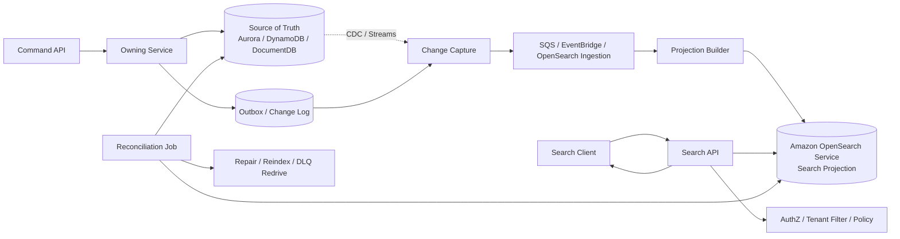
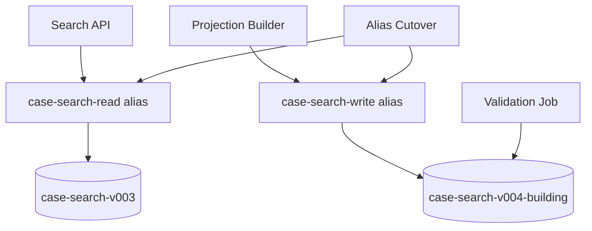
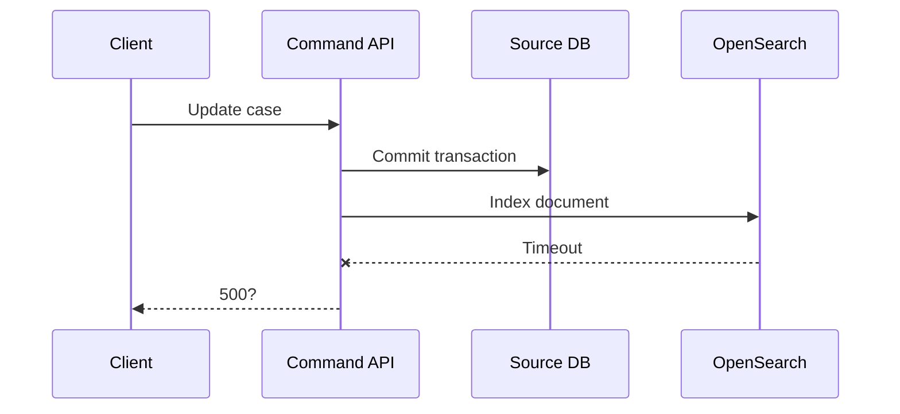
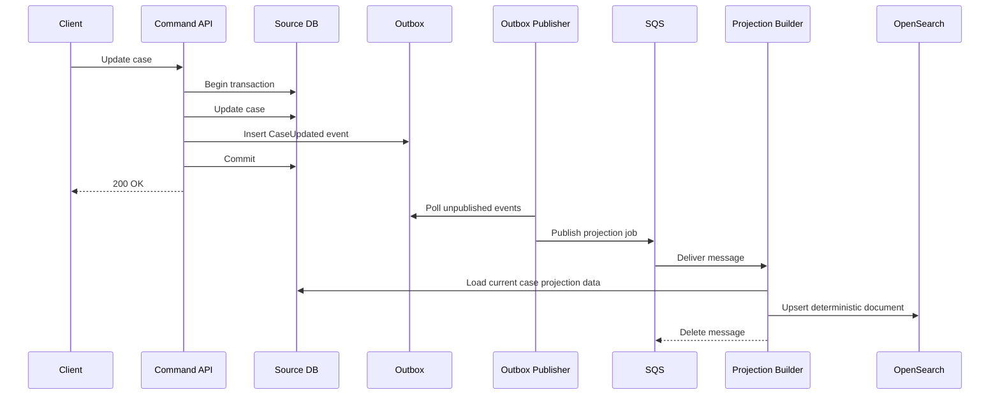
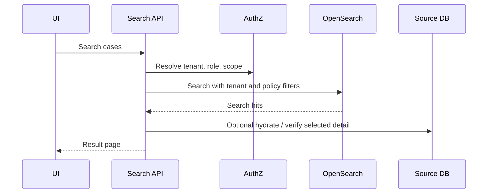
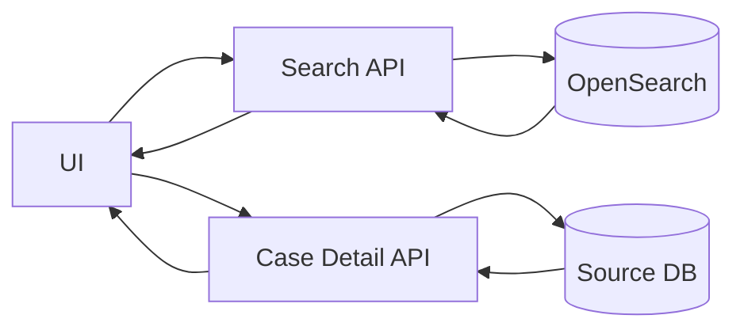
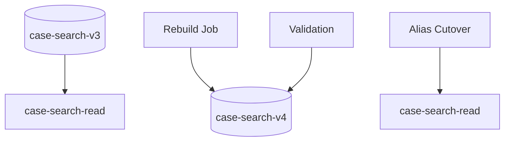

# Part 091 — OpenSearch as Query Projection

OpenSearch is excellent when the application needs **search-shaped access**:

- full-text search
- relevance ranking
- autocomplete
- faceted filtering
- aggregations for user-facing exploration
- operational search over denormalized documents
- near-real-time query over data that is primarily owned somewhere else

The dangerous mistake is to treat OpenSearch as the **source of truth**.

In production systems, OpenSearch should usually be modeled as a **query projection**: a rebuildable, denormalized, search-optimized copy of authoritative data from Aurora/RDS, DynamoDB, DocumentDB, Neptune, Keyspaces, Timestream, or event streams.

The mental model is not:

> "We store our entities in OpenSearch."

The correct model is:

> "We derive searchable documents from authoritative state and maintain them as a projection with explicit staleness, rebuild, replay, and reconciliation behavior."

That one sentence changes how you design APIs, ingestion, deletion, authorization, incident response, and schema evolution.

---

## 1. The Core Boundary

OpenSearch is a **read model**.

It is not the command boundary.
It is not the transactional boundary.
It is not the ownership boundary.
It is not where correctness invariants should be enforced.

A good OpenSearch architecture answers these questions explicitly:

| Question | Correct answer |
|---|---|
| Where is the authoritative entity stored? | Aurora, DynamoDB, DocumentDB, etc. |
| Who is allowed to mutate it? | The owning service command handler. |
| How does OpenSearch learn about changes? | Outbox, CDC, stream, ingestion pipeline, or rebuild job. |
| Is the OpenSearch document allowed to be stale? | Yes, within a defined staleness budget. |
| Can OpenSearch be deleted and rebuilt? | Yes. That is the recovery proof. |
| Can OpenSearch reject a write without losing the source update? | Yes. The source write and projection update must be decoupled. |
| Can a user see data in OpenSearch that they are not authorized to see? | No. Authorization must be enforced at query API and/or document shaping. |
| Can OpenSearch be used to decide business correctness? | Usually no. Use source-of-truth data for correctness decisions. |

---

## 2. Projection Architecture

A production-grade search projection has five planes:

1. **Source-of-truth plane**  
   Owns commands, invariants, transactions, and audit.

2. **Change-capture plane**  
   Emits facts about committed changes.

3. **Projection builder plane**  
   Transforms source changes into search documents.

4. **Search serving plane**  
   Accepts search requests, enforces authorization, calls OpenSearch, and shapes responses.

5. **Reconciliation plane**  
   Detects and repairs drift between source data and projection.



The key invariant:

> The source write must remain correct even if projection update fails.

If a database transaction waits for OpenSearch indexing to succeed, you have coupled the authoritative write path to a non-authoritative search system. That creates unnecessary downtime, retry ambiguity, and user-facing correctness risk.

---

## 3. When OpenSearch Is the Right Tool

OpenSearch is a strong fit when the access pattern is dominated by:

| Workload need | Why OpenSearch fits |
|---|---|
| Full-text search | Inverted index, analyzers, tokenization, scoring |
| Multi-field fuzzy search | Search relevance is a first-class concern |
| Faceted navigation | Aggregations across indexed fields |
| Search result highlighting | Native search feature |
| Operational lookup across many fields | Better than dozens of ad hoc SQL predicates |
| User-facing filtering and sorting | Denormalized documents can be optimized for query UX |
| Log/event exploration | Search and analytics over semi-structured records |
| Search projection over DynamoDB | Avoids `Scan`, complex GSI explosion, or unnatural single-table access pattern |
| Search projection over relational data | Avoids slow wildcard queries and over-indexing relational tables for UX search |

OpenSearch is usually not the right source of truth for:

| Need | Better default |
|---|---|
| ACID command transaction | Aurora/RDS |
| Conditional writes and entity state machine | DynamoDB or Aurora |
| Referential integrity | Aurora/RDS or application-managed model |
| Strong read-after-write business decision | Source database |
| Durable queue/workflow | SQS, EventBridge, Step Functions |
| Long-term immutable audit authority | Source audit store, append-only table, object archive |
| Time-series ingestion and retention | Timestream, S3, or purpose-built metric pipeline |
| Graph traversal | Neptune |
| Key-value access by ID | DynamoDB or Aurora |

---

## 4. Search Projection Invariants

OpenSearch projection design must define these invariants before implementation.

### 4.1 Rebuildability

You should be able to delete the OpenSearch index and rebuild it from source data plus change log.

Rebuildability proves that OpenSearch is not the system of record.

Minimum requirements:

- deterministic document ID
- deterministic document body
- deterministic delete behavior
- version field
- source entity reference
- rebuild job
- alias cutover strategy
- reconciliation report

### 4.2 Idempotent indexing

The same source event may be processed more than once.

Projection updates must be idempotent:

```txt
document_id = "<entity_type>#<entity_id>"
projection_version = source_entity_version
```

The projection builder should never generate a random document ID for an entity projection. Random IDs turn duplicate processing into duplicate search results.

### 4.3 Monotonic versioning

Late or out-of-order updates can happen.

The projection builder should avoid overwriting newer projection state with older events. Common strategies:

- source entity version
- source updated timestamp with caution
- sequence number from source stream
- event version plus aggregate version
- compare-and-set update script
- index full document from source read instead of trusting event payload

For correctness-sensitive systems, a projection event should often be treated as a **signal to reload** from source, not as the entire truth.

### 4.4 Staleness budget

Search results are usually eventually consistent.

Define the allowed delay:

| Search surface | Example staleness budget |
|---|---:|
| Internal admin search | 1-5 minutes may be acceptable |
| Customer order search | 5-30 seconds may be acceptable |
| Fraud investigation queue | seconds may matter |
| Authorization-sensitive search | stale permission must not leak data |
| Case lifecycle search | stale status may be acceptable if detail page rechecks source |

A good pattern:

1. Search API queries OpenSearch for IDs and lightweight fields.
2. Detail API loads authoritative entity from source database.
3. If the source entity no longer matches the projected search result, the UI handles it as stale.

---

## 5. Document Design

An OpenSearch document is not the same as a domain entity.

It is a query artifact.

For example, a regulatory case may be stored relationally as:

- `case`
- `party`
- `violation`
- `inspection`
- `assignment`
- `workflow_state`
- `evidence`
- `notice`
- `payment`
- `appeal`

But the search document may look like:

```json
{
  "docType": "case_search_v3",
  "caseId": "CASE-2026-000123",
  "tenantId": "regulator-sg",
  "caseNumber": "ENF-2026-000123",
  "status": "UNDER_REVIEW",
  "severity": "HIGH",
  "jurisdiction": "CENTRAL",
  "assignedOfficerIds": ["u-101", "u-203"],
  "partyNames": ["Acme Logistics Pte Ltd", "John Tan"],
  "violationCodes": ["FOOD-SAFETY-17", "LICENCE-04"],
  "searchText": "Acme Logistics Pte Ltd John Tan food safety licence inspection...",
  "openedAt": "2026-06-15T03:10:00Z",
  "lastActivityAt": "2026-07-06T11:42:00Z",
  "sourceVersion": 37,
  "projectedAt": "2026-07-06T11:42:03Z"
}
```

This document is intentionally denormalized. It is shaped for queries such as:

- find cases by free-text party name
- filter by jurisdiction and status
- sort by last activity
- facet by violation code
- show assigned officer
- show severity buckets

It is not suitable for:

- approving a case transition
- computing regulatory penalty
- enforcing uniqueness
- validating due date
- proving audit history
- deciding authorization without policy check

---

## 6. Index Naming and Alias Strategy

Never let application code hardcode a physical index name if you expect schema evolution.

Use aliases:

```txt
case-search-read  -> case-search-v003-20260707
case-search-write -> case-search-v003-20260707
```

For rebuild:

```txt
case-search-read  -> case-search-v003-20260707
case-search-write -> case-search-v004-20260708-building
```

After validation:

```txt
case-search-read  -> case-search-v004-20260708
case-search-write -> case-search-v004-20260708
```

For rollback:

```txt
case-search-read -> case-search-v003-20260707
```

The alias is part of the runtime contract.



---

## 7. Mapping Discipline

Mapping errors become operational incidents.

Common mistakes:

| Mistake | Consequence |
|---|---|
| Letting arbitrary JSON dynamic mapping grow forever | Mapping explosion |
| Indexing IDs as analyzed text | Broken exact filtering |
| Indexing high-cardinality fields for expensive aggregation | Memory pressure |
| Using one giant document with unbounded arrays | Large document latency and update cost |
| Changing field type in place | Reindex required |
| Mixing tenant data without hard tenant filter | Data leakage risk |
| Indexing sensitive fields unnecessarily | Compliance risk |
| Treating search relevance as backend detail | User-visible ranking instability |

Recommended field categories:

| Field type | Index design |
|---|---|
| Entity ID | keyword |
| Tenant ID | keyword |
| Status enum | keyword |
| Timestamp | date |
| Full text | text with analyzer |
| Sortable name | keyword normalizer or dedicated sort field |
| Numeric amount | numeric |
| Geo field | geo type if needed |
| Authorization principals | keyword, but query API must enforce policy carefully |

For regulated systems, maintain a projection dictionary:

| Field | Source | Purpose | Searchable | Filterable | Sortable | Sensitive | Retention |
|---|---|---|---|---|---|---|---|
| `caseNumber` | `case.case_number` | Display/search | Yes | Yes | Yes | No | active + archive |
| `partyNames` | party table | Search | Yes | No | No | Maybe | active only |
| `assignedOfficerIds` | assignment table | Auth/filter | No | Yes | No | Yes | active only |
| `searchText` | derived | Full-text | Yes | No | No | Maybe | active only |

---

## 8. Ingestion Patterns

### 8.1 Synchronous dual-write anti-pattern

Bad pattern:



This creates an ambiguity:

- Did the source update commit?
- Should the client retry?
- Will retry duplicate the command?
- Is the projection stale?
- Did OpenSearch failure make the business command fail?

Usually, OpenSearch failure should not roll back the authoritative command.

### 8.2 Transactional outbox to projection builder

Better pattern:



Benefits:

- command transaction is independent from OpenSearch availability
- projection builder can retry
- projection can reload current source state
- DLQ can isolate poison projection jobs
- replay can rebuild projection
- OpenSearch is a derived read model

### 8.3 DynamoDB Streams to OpenSearch

For DynamoDB source tables, common options:

1. DynamoDB Streams + Lambda projection builder
2. DynamoDB zero-ETL integration with OpenSearch Ingestion
3. DynamoDB export to S3 + OpenSearch bulk load + stream catch-up

A robust design still needs:

- deterministic document ID
- stream event classification
- delete propagation
- poison record handling
- DLQ or failure destination
- replay/rebuild procedure
- protection against stale older stream record overwriting newer projection

### 8.4 RDS/Aurora to OpenSearch

Common options:

- transactional outbox table + publisher
- CDC via AWS DMS or custom log tailing
- application domain events
- periodic rebuild jobs for small datasets
- batch export from snapshot to S3, transform, bulk index

For relational models, do not blindly replicate every table. Search documents usually require joins and denormalized shape. You need a projection model.

### 8.5 Batch rebuild

Every search projection needs a rebuild path.

A typical rebuild job:

1. Create new physical index.
2. Apply mapping/settings.
3. Scan source data in deterministic chunks.
4. Build documents.
5. Bulk index.
6. Validate counts and sample checksums.
7. Catch up changes from outbox/stream watermark.
8. Cut read alias.
9. Monitor query and error metrics.
10. Delete old index after retention window.

---

## 9. Projection Builder Design

A projection builder should be boring, deterministic, and retry-safe.

Pseudo-code:

```java
public final class CaseProjectionWorker {
  private final CaseRepository source;
  private final ProjectionOffsetRepository offsets;
  private final OpenSearchClient openSearch;

  public void handle(ProjectionJob job) {
    String idempotencyKey = job.eventId();

    if (offsets.alreadyApplied(idempotencyKey)) {
      return;
    }

    CaseProjection projection = source.loadCaseProjection(job.caseId());

    if (projection == null) {
      openSearch.delete("case-search-write", job.caseId());
      offsets.markApplied(idempotencyKey, job.caseId(), "DELETED");
      return;
    }

    SearchDocument doc = CaseSearchDocument.from(projection);

    openSearch.index(IndexRequest.of(r -> r
      .index("case-search-write")
      .id(projection.caseId())
      .document(doc)
    ));

    offsets.markApplied(idempotencyKey, job.caseId(), "INDEXED");
  }
}
```

Important detail:

The worker loads current source state rather than trusting the event payload as complete truth. This reduces the risk of out-of-order events producing old documents.

But this pattern has a trade-off:

- it increases source database read load
- it may collapse many events into current state
- it may lose historical intermediate states in search projection, which is usually fine for search

For an audit timeline projection, you may instead index immutable event records.

---

## 10. Delete Semantics

Delete is often the least tested part of search projection.

There are multiple forms:

| Delete type | Meaning | Projection behavior |
|---|---|---|
| Hard delete | Source entity removed | Delete OpenSearch doc |
| Soft delete | Source marks deleted | Remove from normal search or index with `deleted=true` |
| Legal hold | Source retained, not searchable | Remove from user search but keep audit source |
| Tenant offboarding | All tenant data removed | Bulk delete by tenant with proof |
| Privacy erasure | Specific PII removed | Redact fields and reindex |
| Authorization removal | User no longer allowed | Search API must enforce current auth, projection may update later |

Never rely only on OpenSearch delete for compliance. The authoritative data lifecycle must be handled in the source system.

---

## 11. Query API Boundary

Do not let frontend clients query OpenSearch directly in enterprise systems.

Put a Search API in front:



The Search API owns:

- tenant filtering
- authorization filtering
- query validation
- max page size
- sort whitelist
- field whitelist
- sensitive field suppression
- rate limiting
- query timeout
- fallback behavior
- stale result handling
- result shaping

OpenSearch query DSL is powerful. That is exactly why it should not be exposed directly without governance.

---

## 12. Pagination and Sorting

Offset pagination can become expensive for deep pages.

Common patterns:

| Pattern | Use |
|---|---|
| `from` + `size` | Small page depth only |
| `search_after` | Deep pagination with stable sort |
| point-in-time search | Consistent pagination over changing data |
| cursor API | Hide OpenSearch details from clients |
| sort by deterministic fields | Avoid unstable result ordering |

For user search, do not promise stable infinite pagination if documents are actively changing. Define semantics:

- results are near-real-time
- pagination is best-effort snapshot or cursor-bound
- detail view rechecks source state

---

## 13. Authorization and Multi-Tenancy

Search data leakage is a severe failure mode.

Never assume that because OpenSearch is "only a projection", leakage is acceptable.

Minimum controls:

- index includes `tenantId`
- every query includes tenant filter from trusted auth context
- API rejects client-supplied tenant override unless explicitly allowed
- sensitive fields are not indexed if not needed
- field-level response shaping
- per-tenant index only if isolation needs justify operational cost
- audit logs for search access where required
- tests that prove cross-tenant query cannot happen

A dangerous bug:

```txt
GET /cases/search?tenantId=other-tenant&status=OPEN
```

The API must not trust this tenant ID. It should derive tenant scope from identity context and policy.

---

## 14. Staleness Handling Patterns

### 14.1 Detail revalidation

Search returns IDs and summary fields. Detail API loads source entity.



This avoids making business decisions from stale search docs.

### 14.2 Projection status field

Include:

```json
{
  "sourceVersion": 37,
  "projectedAt": "2026-07-07T01:20:30Z",
  "projectionSchemaVersion": 4
}
```

Useful for debugging:

- "Why is this case not searchable?"
- "Is the projection behind?"
- "Was this index built with old schema?"

### 14.3 Search freshness alarm

Track:

```txt
projection_lag_seconds = now - source_updated_at_of_latest_projected_change
```

This is more meaningful than only checking cluster health.

---

## 15. Failure Modes

### 15.1 OpenSearch unavailable during command

Expected behavior:

- command still commits if source DB is healthy
- outbox/stream accumulates projection lag
- users may see stale search
- alert fires for projection lag
- no data loss

### 15.2 Projection builder bug

Symptoms:

- indexing failures
- DLQ growth
- missing documents
- stale documents
- mapping errors

Response:

1. Stop or throttle broken consumer.
2. Preserve DLQ.
3. Fix transformer.
4. Replay from DLQ or rebuild affected index.
5. Run reconciliation.

### 15.3 Mapping conflict

Example:

```txt
field "penaltyAmount" was indexed as text, later sent as number
```

Response:

- create new index with correct mapping
- rebuild
- alias cutover
- prevent dynamic mapping for critical fields

### 15.4 Out-of-order updates

Example:

```txt
event version 39 indexed
event version 38 retried later and overwrote doc
```

Response:

- include source version
- use version check
- reload current source state
- store projection source version
- reject older write

### 15.5 Delete not propagated

Symptoms:

- deleted case appears in search
- detail page returns 404 or hidden
- compliance alarm maybe triggered

Response:

- search API should suppress if source says deleted on detail load
- projection repair deletes document
- reconciliation should detect source missing but projection present

### 15.6 Authorization drift

Example:

- assignment changes from officer A to officer B
- search projection update delayed
- officer A can still find case in search

Mitigation:

- query authorization must use current policy where possible
- avoid relying only on projected principal list for high-risk data
- short TTL or fast invalidation for permission projection
- detail API always rechecks source-of-truth authorization

### 15.7 Rebuild overloads source database

A rebuild can destroy your primary database.

Mitigation:

- chunked reads
- read replica if acceptable
- bounded concurrency
- sleep/backoff
- rate limit by DB load
- resumable cursor
- off-peak window
- export/snapshot path for large datasets

---

## 16. Observability

A search projection dashboard should include four groups.

### 16.1 Source/change capture

- outbox unpublished count
- oldest unpublished event age
- stream iterator age
- CDC lag
- source update rate
- source read latency for projection builder

### 16.2 Projection builder

- processed events per minute
- success/failure count
- retry count
- DLQ count
- projection lag seconds
- indexing latency
- bulk indexing failure reason
- stale event rejected count

### 16.3 OpenSearch cluster/index

- cluster health
- CPU/JVM/memory
- disk usage
- indexing rate
- search latency
- search error rate
- rejected requests
- shard count and size
- slow search logs
- slow indexing logs

### 16.4 Search API

- search request rate
- p50/p95/p99 latency
- timeout count
- 4xx/5xx rate
- authorization rejection count
- query complexity rejection count
- empty result anomaly
- top query templates

---

## 17. Reconciliation

Reconciliation proves projection correctness.

Types:

| Reconciliation | What it detects |
|---|---|
| Count by status | Missing/extra documents |
| Sample checksum | Field mismatch |
| Version mismatch | Stale projection |
| Source missing / projection exists | Delete failure |
| Source exists / projection missing | Indexing failure |
| Authorization sample | Security drift |
| Tenant count | Cross-tenant indexing bug |

A simple reconciliation job:

```java
for (CaseId caseId : source.scanCaseIds(batchCursor)) {
  SourceProjection sourceDoc = source.loadCaseProjection(caseId);
  SearchDocument osDoc = openSearch.get(caseId);

  if (osDoc == null || osDoc.sourceVersion() < sourceDoc.version()) {
    repairQueue.enqueue(new ProjectionRepairJob(caseId));
  }
}
```

For large systems, reconcile by partitions:

```txt
tenantId + dateBucket
tenantId + caseNumberHashRange
jurisdiction + updatedAtWindow
```

Do not run full reconciliation without capacity planning.

---

## 18. Zero-Downtime Mapping Change

OpenSearch field type changes require careful reindexing.

Safe workflow:

1. Define new projection schema version.
2. Create new physical index.
3. Apply explicit mapping.
4. Run rebuild into new index.
5. Run validation.
6. Dual-write projection builder to old and new index if needed.
7. Cut read alias.
8. Monitor.
9. Retire old index.



The read API should ideally not expose physical schema directly. It should expose a stable API contract.

---

## 19. Cost and Capacity Thinking

OpenSearch cost is not only "number of nodes".

Think in these dimensions:

- indexed document count
- document size
- field count
- shard count
- replica count
- indexing rate
- update rate
- query rate
- query complexity
- aggregation cardinality
- retention period
- storage type
- snapshot/backup
- cross-AZ/network cost
- rebuild frequency
- observability logs

Common cost traps:

| Trap | Why expensive |
|---|---|
| Indexing every field | Larger index and memory pressure |
| High-cardinality aggregations | Heap and latency risk |
| Too many small shards | Cluster overhead |
| Unbounded retention | Storage growth |
| Frequent full-document updates | High indexing load |
| Rebuild without throttling | Source and OpenSearch overload |
| Logs indexed forever | Cost explosion |
| Search API with arbitrary query DSL | Unbounded query cost |

---

## 20. Implementation Blueprint

### 20.1 Source write

```java
@Transactional
public CaseId assignCase(AssignCaseCommand command) {
  CaseRecord current = cases.getForUpdate(command.caseId());

  current.assign(command.officerId(), command.reason());

  cases.save(current);

  outbox.insert(new OutboxEvent(
    UUID.randomUUID().toString(),
    "regulatory.case",
    "CaseAssigned",
    current.caseId(),
    current.version()
  ));

  return current.caseId();
}
```

### 20.2 Outbox publisher

```java
public void publishBatch() {
  List<OutboxEvent> events = outbox.lockNextBatch(100);

  for (OutboxEvent event : events) {
    sqs.sendMessage(queueUrl, event.toJson(), event.id());
    outbox.markPublished(event.id());
  }
}
```

### 20.3 Projection worker

```java
public void project(OutboxEvent event) {
  CaseProjection projection = caseReadRepository.loadProjection(event.aggregateId());

  if (projection == null) {
    openSearch.delete("case-search-write", event.aggregateId());
    return;
  }

  CaseSearchDocument doc = mapper.toSearchDocument(projection);

  openSearch.index("case-search-write", event.aggregateId(), doc);
}
```

### 20.4 Search API

```java
public SearchResult search(SearchRequest request, AuthContext auth) {
  TenantScope tenant = auth.tenantScope();

  SearchQuery query = SearchQuery.builder()
    .tenantId(tenant.id())
    .allowedJurisdictions(auth.allowedJurisdictions())
    .text(request.text())
    .status(request.status())
    .sort(validateSort(request.sort()))
    .pageSize(limit(request.pageSize(), 100))
    .cursor(request.cursor())
    .build();

  return openSearchCaseGateway.search(query);
}
```

---

## 21. Testing Matrix

| Test | Expected proof |
|---|---|
| Duplicate projection job | One document remains |
| Out-of-order event | Older event does not overwrite newer projection |
| OpenSearch outage during command | Source commit succeeds, projection lag grows |
| Projection builder mapping error | Message goes to DLQ; command path unaffected |
| Delete event | Document disappears or is suppressed |
| Rebuild from scratch | New index matches source counts/checksums |
| Alias cutover | Search API works without code change |
| Tenant filter bypass attempt | API refuses or ignores untrusted tenant input |
| Authorization change | User cannot see forbidden result after policy change |
| Large query | API rejects or times out safely |
| Backfill load | Source DB remains within SLO |
| Search stale result | Detail API handles source mismatch |

---

## 22. Production Readiness Checklist

Before using OpenSearch for a production query path, verify:

- [ ] Source of truth is explicit.
- [ ] OpenSearch is documented as projection, not authority.
- [ ] Every document has deterministic ID.
- [ ] Every document has source version and projected timestamp.
- [ ] Ingestion path is retry-safe.
- [ ] Projection builder is idempotent.
- [ ] DLQ exists for failed projection jobs.
- [ ] Rebuild procedure exists and has been tested.
- [ ] Alias cutover procedure exists.
- [ ] Mapping is explicit for critical fields.
- [ ] Query API validates filters, sort fields, and page size.
- [ ] Tenant filter is derived from trusted auth context.
- [ ] Sensitive fields are reviewed.
- [ ] Projection lag metric exists.
- [ ] Search slow logs and indexing slow logs are enabled where appropriate.
- [ ] Reconciliation job exists.
- [ ] Delete/redaction behavior is tested.
- [ ] Incident runbook covers stale index, DLQ growth, mapping error, and cluster degradation.
- [ ] Cost model includes rebuild, replicas, retention, logs, and shard strategy.

---

## 23. Mental Shortcut

Use this rule:

> If losing OpenSearch loses business truth, the architecture is wrong.

OpenSearch should be replaceable.

The source data should survive.
The change log should allow replay.
The projection should be rebuildable.
The Search API should hide physical index details.
The business command path should not depend on search indexing success.

That is the difference between using OpenSearch as a powerful search engine and accidentally building your core system on a derived index.

---

## References

- Amazon OpenSearch Service Documentation: https://docs.aws.amazon.com/opensearch-service/
- Indexing data in Amazon OpenSearch Service: https://docs.aws.amazon.com/opensearch-service/latest/developerguide/indexing.html
- Searching data in Amazon OpenSearch Service: https://docs.aws.amazon.com/opensearch-service/latest/developerguide/searching.html
- Loading streaming data from Amazon DynamoDB: https://docs.aws.amazon.com/opensearch-service/latest/developerguide/integrations-dynamodb.html
- DynamoDB zero-ETL integration with Amazon OpenSearch Service: https://docs.aws.amazon.com/amazondynamodb/latest/developerguide/OpenSearchIngestionForDynamoDB.html
- DynamoDB Streams: https://docs.aws.amazon.com/amazondynamodb/latest/developerguide/Streams.html
- OpenSearch slow logs and audit logs: https://docs.aws.amazon.com/opensearch-service/latest/developerguide/createdomain-configure-slow-logs.html
- AWS Well-Architected — purpose-built data store: https://docs.aws.amazon.com/wellarchitected/latest/framework/perf_data_use_purpose_built_data_store.html
