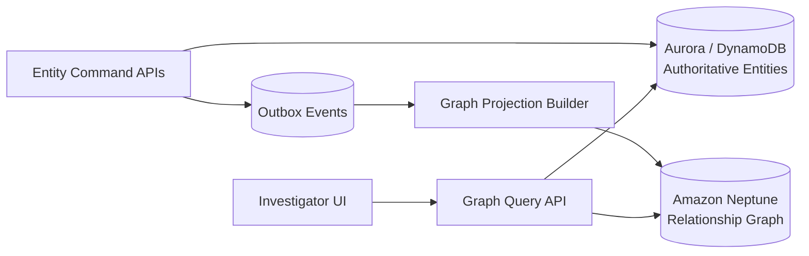
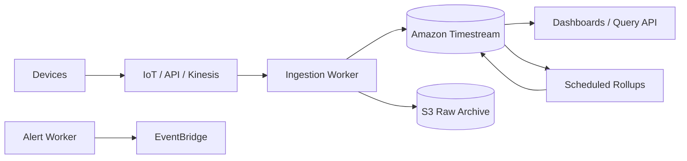
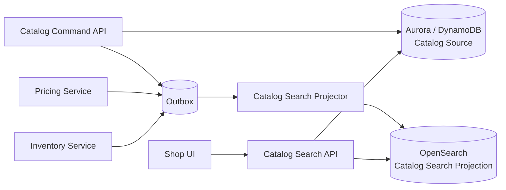
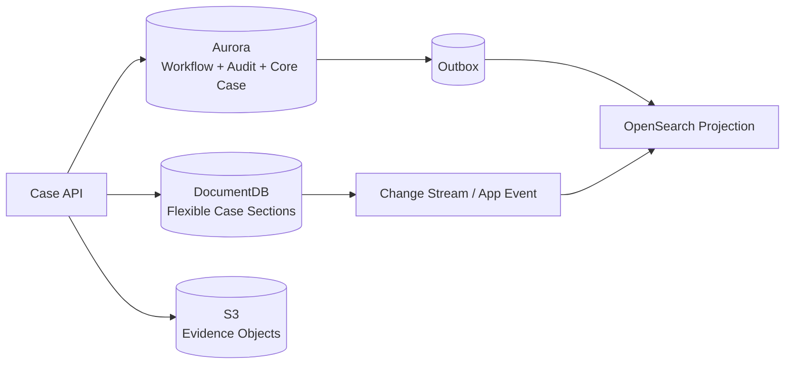
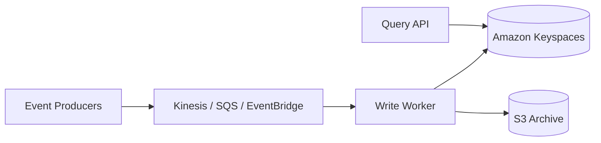
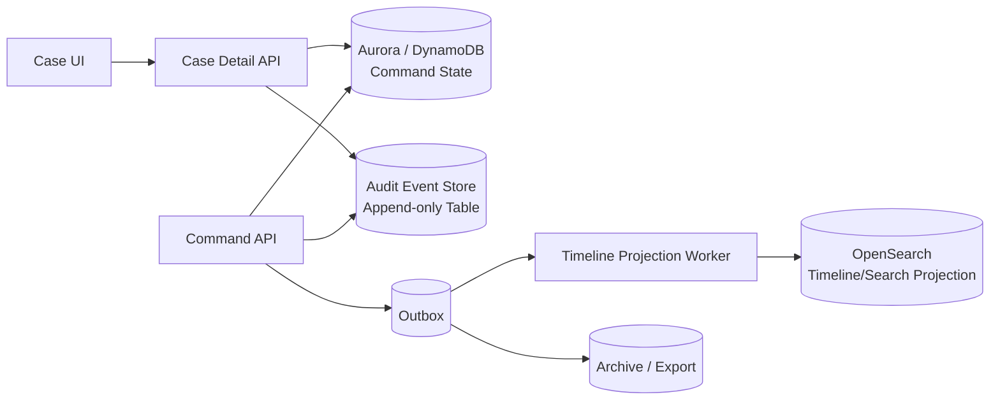
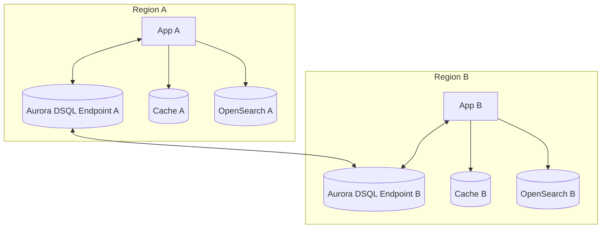
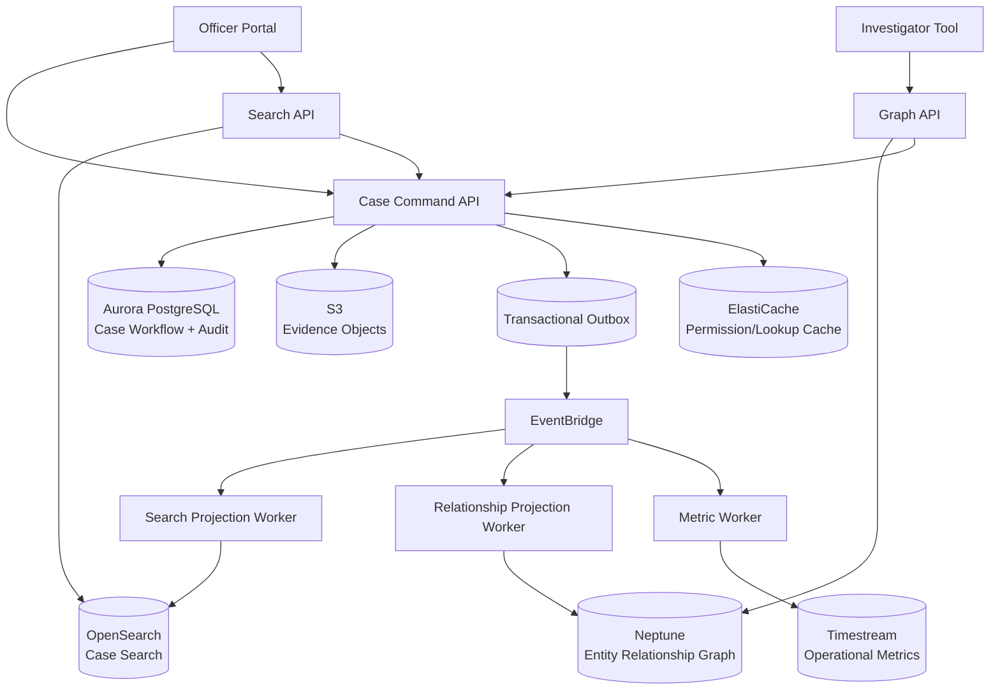

# Part 092 — Specialized Database Selection Cases

This part closes the specialized database module.

The goal is not to memorize:

> "Fraud = graph, IoT = time-series, search = OpenSearch."

That is too shallow.

A top-tier engineer asks sharper questions:

- What is the source of truth?
- What is the query shape?
- What must be strongly consistent?
- What is derived?
- What can be stale?
- What must be rebuilt?
- What is the failure mode if the specialized store lags?
- What is the migration path if the workload outgrows the first design?
- What operational skill does the team need to run it safely?

Specialized databases are powerful because they optimize for a shape.

They are dangerous when used as an excuse to avoid data modeling.

---

## 1. The Universal Decision Frame

For every specialized data store, use this frame.

```txt
Workload = access pattern + mutation pattern + correctness invariant + operational envelope
```

Break it down:

| Dimension | Question |
|---|---|
| Access pattern | How will the application read the data? |
| Mutation pattern | How does the data change? |
| Consistency invariant | What must be true immediately after write? |
| Latency budget | How fast must the operation return? |
| Cardinality | How many entities, relationships, dimensions, or events? |
| Growth direction | Does the data grow by entities, edges, time, documents, or tenants? |
| Retention | How long must data be queryable? |
| Query flexibility | Are query patterns known or exploratory? |
| Source of truth | Which store owns correctness? |
| Projection strategy | Which stores are derived? |
| Rebuildability | Can the derived store be recreated? |
| Failure behavior | What happens if this store is stale/down? |
| Cost driver | What metric dominates cost? |
| Team maturity | Can the team model, tune, and operate this store? |

---

## 2. Specialized Store Cheat Sheet

| Store / service | Optimized for | Usually source of truth? | Common failure mode |
|---|---|---:|---|
| Aurora/RDS | Relational OLTP, constraints, transactions | Yes | locks, slow queries, connection exhaustion |
| DynamoDB | Key-value/document access by known keys at scale | Yes | hot partition, wrong access pattern, GSI lag |
| DocumentDB | Document aggregate with MongoDB-compatible API | Sometimes | compatibility assumptions, document growth, index miss |
| Neptune | Relationship-heavy graph traversal | Often projection or specialized authority | high-degree vertices, expensive traversal |
| Keyspaces | Cassandra-compatible wide-column query-first workloads | Sometimes | bad partition key, table-per-query sprawl |
| Timestream | Time-series ingestion, retention, rollups | Often metric authority | cardinality explosion, late data handling |
| OpenSearch | Search and analytics-like projection | Usually no | stale index, mapping explosion, search leakage |
| ElastiCache | Low-latency cache/coordination | Usually no | stale cache, stampede, eviction |
| MemoryDB | Durable in-memory state | Sometimes | memory model mistakes, failover assumptions |

This table is only the first pass. The real selection comes from cases.

---

## 3. Case 1 — Fraud and Relationship Investigation

### 3.1 Scenario

You are building a fraud investigation module.

Investigators ask:

- Which accounts share phone numbers?
- Which merchants are connected through common device fingerprints?
- Which cases are within two hops of a known offender?
- Which companies share directors, addresses, and bank accounts?
- Which enforcement cases form a hidden cluster?

The natural data shape is not rows or documents. It is a graph.

### 3.2 Candidate architecture



### 3.3 Data model

Entities become vertices:

```txt
Person
Company
Address
PhoneNumber
Device
BankAccount
Case
Inspection
Violation
Permit
```

Relationships become edges:

```txt
PERSON_OWNS_COMPANY
PERSON_DIRECTOR_OF_COMPANY
COMPANY_REGISTERED_AT_ADDRESS
CASE_INVOLVES_COMPANY
CASE_HAS_VIOLATION
DEVICE_USED_BY_PERSON
BANK_ACCOUNT_LINKED_TO_COMPANY
CASE_RELATED_TO_CASE
```

### 3.4 Why Neptune fits

Neptune fits because queries traverse relationships:

```txt
Find all cases within 3 hops of this company through shared directors, addresses, or bank accounts.
```

Doing this in relational SQL is possible, but it can become complex and slow if the graph is deep, variable, or exploratory.

Doing it in DynamoDB is unnatural unless every traversal path is precomputed.

### 3.5 Source-of-truth decision

There are two patterns.

#### Pattern A — Neptune as projection

The authoritative entity data lives in Aurora/DynamoDB. Neptune is rebuilt from events.

Use this when:

- commands are still entity-centric
- graph is for investigation/search
- relationship data is derived from multiple domains
- stale graph is acceptable within a budget
- you need rebuildability

#### Pattern B — Neptune as relationship authority

Neptune owns relationship facts.

Use this when:

- relationships are first-class mutable facts
- graph updates are core commands
- graph consistency is central to business correctness
- the team is ready to operate graph as source system

Most enterprise systems should start with Pattern A.

### 3.6 Failure modes

| Failure | Consequence | Mitigation |
|---|---|---|
| Graph projection lags | Investigator misses recent link | Show projected timestamp, detail revalidation |
| Duplicate edge | Inflated relationship count | Deterministic edge ID |
| Missing delete | Deleted relationship still appears | Reconciliation and tombstone handling |
| High-degree vertex | Traversal latency spikes | Degree caps, query limits, precomputed summaries |
| Unbounded traversal | Query becomes cluster incident | API query budget and max depth |
| Authorization leakage | User sees restricted relationships | Query API policy enforcement and result filtering |

### 3.7 Selection verdict

Use Neptune when the core read question is:

> "How are these things connected?"

Do not use Neptune merely because the domain has relationships. Every non-trivial domain has relationships. Use graph when traversing those relationships is the workload.

---

## 4. Case 2 — IoT Telemetry and Operational Metrics

### 4.1 Scenario

You ingest sensor readings:

- device ID
- facility
- metric name
- timestamp
- value
- firmware version
- location
- measurement quality

Queries:

- show last 24 hours of temperature for a device
- aggregate average per facility per hour
- detect threshold violations
- retain raw data for 30 days
- retain hourly aggregates for 3 years
- handle late-arriving readings

### 4.2 Candidate architecture



### 4.3 Why Timestream fits

Timestream fits when:

- data is naturally time-indexed
- writes are append-heavy
- queries are time-windowed
- retention differs for recent and historical data
- aggregates/rollups are common
- time-series functions matter

### 4.4 Modeling questions

| Question | Why it matters |
|---|---|
| What is a dimension? | High-cardinality dimensions can drive cost/query complexity |
| What is a measure? | Multi-measure records can reduce write/query overhead for related metrics |
| How late can data arrive? | Determines ingestion and correction behavior |
| What is raw retention? | Determines memory/magnetic store retention |
| What aggregates are needed? | Scheduled query design |
| Are metrics tenant-specific? | Authorization and partitioning of query surface |
| Is raw data legally auditable? | Archive to S3 or authoritative store may be required |

### 4.5 Source-of-truth decision

Timestream can be the metric authority for operational telemetry. But if readings must be preserved as legal evidence, write raw records to S3 or another immutable archive as well.

A common pattern:

```txt
Raw ingest -> S3 archive
Queryable recent/historical time-series -> Timestream
Alerts -> EventBridge/SQS
Case/evidence links -> Aurora/DynamoDB
```

### 4.6 Failure modes

| Failure | Consequence | Mitigation |
|---|---|---|
| Cardinality explosion | Cost and query latency spike | Dimension governance |
| Late data not handled | Incorrect aggregates | Correction window and recompute |
| Bad timestamp | Data appears missing | Ingestion validation |
| Over-wide query | Expensive dashboard | Query API guardrails |
| Raw retention too short | Audit gap | S3 archive |
| Scheduled rollup failure | Dashboard stale | Rollup lag metric and retry |

### 4.7 Selection verdict

Use Timestream when the query shape is:

> "Give me values over time, aggregated by dimensions."

Do not use it as a generic event store or arbitrary document database.

---

## 5. Case 3 — Product Catalog Search

### 5.1 Scenario

A marketplace needs:

- full-text search by product name and description
- filters by category, brand, price, availability
- ranking by relevance and popularity
- typo tolerance
- autocomplete
- facet counts
- near-real-time stock and price updates

### 5.2 Candidate architecture



### 5.3 Why OpenSearch fits

OpenSearch fits because the access pattern is search/relevance/faceted filtering, not entity transaction.

The product source may be relational or DynamoDB. But the search document is denormalized:

```json
{
  "productId": "p-1001",
  "tenantId": "marketplace-a",
  "title": "Organic Arabica Coffee Beans",
  "description": "Medium roast whole beans...",
  "brand": "Acme Coffee",
  "categoryPath": ["Grocery", "Coffee", "Beans"],
  "price": 19.90,
  "available": true,
  "popularityScore": 0.87,
  "updatedAt": "2026-07-07T01:15:00Z"
}
```

### 5.4 Source-of-truth decision

OpenSearch should not own:

- product identity
- price authority
- inventory authority
- seller ownership
- compliance status
- payment constraints

Search is a projection.

Checkout must revalidate price, stock, and eligibility against authoritative systems.

### 5.5 Failure modes

| Failure | Consequence | Mitigation |
|---|---|---|
| Index stale | User sees unavailable product | Checkout revalidation |
| Price stale | Wrong displayed price | Staleness label, fast price projection, final recheck |
| Mapping explosion | Index instability | Explicit mapping |
| Bad ranking release | Search quality incident | A/B, rollback alias |
| Tenant filter bug | Data leakage | Search API-enforced tenant scope |
| Rebuild overload | Catalog DB pressure | Snapshot/export path and throttled rebuild |

### 5.6 Selection verdict

Use OpenSearch when the user experience depends on search quality and facets.

Keep transactional purchase correctness outside OpenSearch.

---

## 6. Case 4 — Case Management Document Aggregate

### 6.1 Scenario

A regulatory case record has flexible sections:

- allegation summary
- parties involved
- inspection notes
- evidence metadata
- dynamic jurisdiction-specific forms
- nested review comments
- evolving policy-driven fields

Queries are mostly:

- load case by ID
- update specific case section
- list cases by status/owner
- search by text
- produce audit/export

### 6.2 Candidate options

| Option | Fit |
|---|---|
| Aurora PostgreSQL | Strong when workflow, constraints, reporting, joins, audit matter |
| DynamoDB | Strong when access patterns are known and scale/latency dominate |
| DocumentDB | Strong when document aggregate is naturally nested and MongoDB-compatible API is desired |
| OpenSearch | Search projection only |
| S3 | Large evidence objects and immutable exports |

### 6.3 DocumentDB fit

DocumentDB can fit if:

- the case aggregate is naturally document-shaped
- most operations load/update whole or bounded sections
- schema evolves frequently
- nested structure is more natural than relational decomposition
- MongoDB-compatible client/query style is a good fit
- operational compatibility has been tested

### 6.4 When Aurora is safer

Aurora may be safer if:

- cross-case reports are heavy
- workflow constraints are complex
- relational joins are central
- strict transaction boundaries matter
- audit and history are first-class
- team has stronger relational skill
- regulatory defensibility requires explicit constraints and migrations

### 6.5 Hybrid pattern



This can be powerful, but it increases operational complexity. Use it only if each store owns a clear shape.

### 6.6 Failure modes

| Failure | Consequence | Mitigation |
|---|---|---|
| Unbounded document growth | Slow update/read | Split large sections |
| Flexible schema chaos | Inconsistent behavior | Schema version and validation |
| Search tied to document DB | Poor full-text UX | OpenSearch projection |
| Cross-document transaction assumption | Correctness bug | Explicit transaction boundary |
| Compatibility assumption | Migration surprise | Run compatibility tests |

### 6.7 Selection verdict

Use DocumentDB when the domain aggregate is document-native and compatibility/operations are proven.

Do not use it just because the schema is "flexible". Flexible schema without governance becomes invisible schema debt.

---

## 7. Case 5 — Wide-Column Event Processing and Query-First Tables

### 7.1 Scenario

You need to store high-volume events and query by known shapes:

- events by device per day
- events by customer per hour
- latest state per entity
- status history by aggregate
- game/session activity by player
- operational event feed by tenant

### 7.2 Candidate architecture



### 7.3 Why Keyspaces fits

Keyspaces fits when:

- query patterns are known up front
- high write volume matters
- wide rows / time-bucketed partitions make sense
- Cassandra-compatible data model is desired
- table-per-query duplication is acceptable
- horizontal scale is more important than relational flexibility

### 7.4 Modeling pattern

For query:

```txt
Get events for device D between 10:00 and 11:00 on 2026-07-07
```

Table shape:

```sql
CREATE TABLE device_events_by_day (
  tenant_id text,
  device_id text,
  event_day date,
  event_ts timestamp,
  event_id text,
  event_type text,
  payload text,
  PRIMARY KEY ((tenant_id, device_id, event_day), event_ts, event_id)
);
```

The partition key controls locality. The clustering columns control sort within partition.

### 7.5 Failure modes

| Failure | Consequence | Mitigation |
|---|---|---|
| Partition too hot | Throttling/latency | Add bucket, shard, or change key |
| Partition too large | Slow reads/compaction pressure | Time bucket |
| Query not modeled | No efficient query path | Add table/projection |
| Table-per-query sprawl | Write amplification | Governance and ADR |
| TTL misunderstood | Data disappears | Retention policy review |
| Backfill writes too fast | Throttling | Rate-limited backfill |

### 7.6 Selection verdict

Use Keyspaces when the workload is Cassandra-shaped:

> high-volume writes, known queries, partition-oriented reads, and deliberate duplication.

Do not use it for exploratory querying or relational workflows.

---

## 8. Case 6 — Audit Timeline and Enforcement Lifecycle

### 8.1 Scenario

A regulatory platform needs:

- case lifecycle timeline
- officer actions
- state transitions
- notices issued
- evidence uploaded
- payment events
- appeal events
- escalation events
- immutable history for defensibility

### 8.2 Correctness questions

This workload is not primarily a search, graph, or time-series problem.

It is an **auditability and lifecycle correctness** problem.

Ask:

- What is the authoritative event?
- Who can write it?
- Can it be corrected?
- Can it be deleted?
- What is the retention policy?
- How do we prove sequence and causality?
- How do we reconstruct case state?
- What is the legal meaning of each event?

### 8.3 Candidate architecture



### 8.4 Store choices

| Need | Candidate |
|---|---|
| Command state machine | Aurora or DynamoDB |
| Append-only audit events | Aurora append-only table, DynamoDB event table, S3 archive |
| Timeline query by case | Aurora/DynamoDB |
| Search across timelines | OpenSearch projection |
| Metrics over event time | Timestream or analytics pipeline |
| Relationship investigation | Neptune projection |

### 8.5 Why not one specialized database?

Because the lifecycle has multiple shapes:

- transaction correctness
- append-only history
- search
- reporting
- timeline display
- relationship exploration

Trying to force all of that into one specialized store creates hidden coupling.

### 8.6 Failure modes

| Failure | Consequence | Mitigation |
|---|---|---|
| Audit event not atomic with command | Defensibility gap | Same transaction or transactional outbox |
| Timeline projection stale | UI incomplete | Source audit table remains authoritative |
| Search index stale | Investigator misses event | Reconciliation and detail recheck |
| Event schema changes uncontrolled | Rebuild/replay breaks | Versioned event contract |
| Correction not modeled | Legal ambiguity | Correction event, not destructive update |
| Clock ordering assumption | Wrong timeline | Sequence number or transaction order |

### 8.7 Selection verdict

For enforcement lifecycle, prioritize authoritative state and audit first. Specialized databases are projections around it.

---

## 9. Case 7 — Authorization, Session, and Rate-Limit State

### 9.1 Scenario

You need:

- user sessions
- API rate limiting
- temporary lockout
- permission cache
- case assignment lease
- request deduplication cache
- short-lived workflow token

### 9.2 Candidate stores

| Need | Candidate |
|---|---|
| Session cache | ElastiCache |
| Durable session/state | DynamoDB or MemoryDB |
| Rate limit token bucket | ElastiCache/MemoryDB |
| Strong durable lease | DynamoDB conditional write |
| Workflow coordination | Step Functions |
| Idempotency record | DynamoDB/Aurora, sometimes cache as fast path |
| Permission cache | ElastiCache with short TTL and versioning |

### 9.3 Key decision

Is this state correctness-critical?

If yes, avoid pure cache as the only authority unless the failure semantics are acceptable.

For example:

| State | If lost | Store |
|---|---|---|
| UI session | User logs in again | ElastiCache may be fine |
| Payment idempotency | Duplicate charge risk | Durable DB |
| Case lock | Two officers edit same case | DynamoDB lease or database lock/version |
| Rate limit | Temporary overuse | Cache may be fine |
| Legal workflow deadline | Missed compliance | Durable DB/workflow |

### 9.4 Failure modes

| Failure | Consequence | Mitigation |
|---|---|---|
| Cache eviction | Session/limit state lost | TTL semantics and fallback |
| Fail-open rate limiter | Abuse risk | Decide fail-open vs fail-closed |
| Lock lost during failover | Concurrent mutation | Fencing token |
| Permission cache stale | Access leakage | Permission version/epoch |
| Token bucket hot key | Redis CPU spike | Shard by tenant/API/user |
| Durable state in cache only | Correctness loss | Use DynamoDB/Aurora/MemoryDB if needed |

### 9.5 Selection verdict

Use cache for speed, not unexamined truth.

When state protects money, legal action, audit, or authorization, define durable authority and fencing behavior.

---

## 10. Case 8 — Multi-Region Read/Write Workload

### 10.1 Scenario

A global SaaS platform needs:

- low-latency reads in multiple Regions
- writes from multiple Regions
- tenant locality
- Region failover
- strong correctness for commands
- local search
- local cache
- auditability

### 10.2 Candidate architecture



### 10.3 Store choices

| Need | Candidate |
|---|---|
| Strong multi-Region SQL command state | Aurora DSQL |
| Key-value multi-Region state | DynamoDB Global Tables |
| Search in each Region | OpenSearch projection per Region |
| Cache in each Region | ElastiCache/MemoryDB local |
| Workflow | Step Functions with regional ownership |
| Events | EventBridge cross-Region routing with idempotency |

### 10.4 Failure modes

| Failure | Consequence | Mitigation |
|---|---|---|
| Two Regions write same aggregate | Conflict/OCC failure | Aggregate home Region or command routing |
| Cache differs by Region | Stale reads | Local staleness budget and invalidation |
| Search projection differs | Different search results | Per-Region projection lag metric |
| Workflow duplicated | Double side effect | Execution idempotency and ownership |
| Event replicated twice | Duplicate consumer processing | Idempotent consumers |
| Region evacuation | Partial traffic shift | runbook and failover drills |

### 10.5 Selection verdict

Do not confuse multi-Region with "just replicate everything".

Multi-Region design needs ownership, idempotency, conflict policy, routing, and operational drills.

---

## 11. Decision Matrix by Workload Smell

| Workload smell | Likely candidate | Check before deciding |
|---|---|---|
| "Users need fuzzy search and facets" | OpenSearch projection | What owns truth? How rebuild? |
| "Queries walk relationships of unknown depth" | Neptune | Is graph source or projection? |
| "Data is metric over time" | Timestream | Dimensions, retention, late data |
| "Known high-volume partitioned queries" | Keyspaces or DynamoDB | Partition key and table-per-query strategy |
| "Nested aggregate loaded mostly by ID" | DocumentDB or DynamoDB | Transaction and query requirements |
| "Strict relational constraints and reporting" | Aurora/RDS | Locking, indexing, connection management |
| "Ultra-low-latency ephemeral state" | ElastiCache | What happens on eviction/failover? |
| "Durable in-memory primary state" | MemoryDB | Is data model actually Redis-shaped? |
| "Strong multi-Region SQL writes" | Aurora DSQL | Conflict and latency trade-off |
| "Low-latency global key-value writes" | DynamoDB Global Tables | Conflict semantics and locality |
| "Legal audit timeline" | Aurora/DynamoDB append-only + projections | Atomicity and retention |

---

## 12. Composite Architecture Example — Regulatory Case Platform

A realistic regulatory platform rarely uses one database.



Here:

- Aurora owns case lifecycle correctness.
- S3 owns large evidence objects.
- Outbox owns reliable publication of committed facts.
- OpenSearch is a case search projection.
- Neptune is relationship investigation projection.
- Timestream stores operational metrics.
- ElastiCache accelerates low-risk lookups.
- APIs enforce policy and hide physical stores.

The goal is not "polyglot because microservices".

The goal is:

> Each store owns the shape it is good at, and nothing else.

---

## 13. Anti-Patterns

### 13.1 Specialized database as escape hatch

Bad reasoning:

> "Our relational schema is messy; let's move to DocumentDB."

Messy relational modeling often becomes messy document modeling.

Fix the model first.

### 13.2 Search engine as source of truth

Bad reasoning:

> "OpenSearch already has all fields, so let's update it directly."

This breaks projection rebuildability and creates silent divergence.

### 13.3 Graph database for simple joins

Bad reasoning:

> "We have relationships, therefore Neptune."

Use graph when traversal is the workload, not when the domain merely has foreign keys.

### 13.4 Time-series database for arbitrary events

Bad reasoning:

> "Events have timestamps, therefore Timestream."

Every event has a timestamp. Use time-series when time-windowed measurement queries dominate.

### 13.5 Cache as hidden database

Bad reasoning:

> "Redis is fast, so store coordination state there."

Fast state can still be wrong state. Define durability and fencing.

### 13.6 Multi-store without ownership

Bad reasoning:

> "We'll write the same data to Aurora, DynamoDB, and OpenSearch."

Without ownership and projection rules, this becomes inconsistency by design.

---

## 14. ADR Template for Specialized Store Selection

Use this template before introducing a specialized database.

```md
# ADR: Use <store> for <workload>

## Status

Proposed / Accepted / Deprecated

## Context

What workload are we solving?
What access patterns exist?
What mutation patterns exist?
What invariants must hold?

## Decision

We will use <store> for <specific responsibility>.

## Source of truth

The authoritative source is <store/service>.
This specialized store is / is not source of truth.

## Query patterns

- Q1:
- Q2:
- Q3:

## Consistency model

- Strong:
- Eventual:
- Staleness budget:
- Reconciliation:

## Data model

- Entity/document/vertex/edge/table/measure:
- Key design:
- Index strategy:
- Retention:

## Ingestion/write path

- Command path:
- Projection path:
- Retry:
- DLQ:
- Replay:

## Failure modes

- Failure:
- Blast radius:
- Detection:
- Recovery:

## Operations

- Metrics:
- Alarms:
- Runbook:
- Backup/rebuild:
- Cost driver:

## Alternatives considered

- Aurora:
- DynamoDB:
- OpenSearch:
- Neptune:
- Timestream:
- Keyspaces:
- DocumentDB:
- Cache/MemoryDB:

## Consequences

Benefits:
Costs:
Risks:
Reversal plan:
```

---

## 15. Production Selection Checklist

Before introducing a specialized database:

- [ ] The workload shape is written down.
- [ ] Query patterns are known and prioritized.
- [ ] Mutation patterns are known.
- [ ] Strong consistency needs are explicit.
- [ ] Eventual consistency boundaries are explicit.
- [ ] Source of truth is identified.
- [ ] Projection stores are rebuildable.
- [ ] Ingestion path is retry-safe.
- [ ] DLQ/replay procedure exists.
- [ ] Data model handles cardinality and growth.
- [ ] Delete/retention behavior is defined.
- [ ] Authorization model is defined.
- [ ] Cost drivers are known.
- [ ] Operational metrics are known.
- [ ] Team can debug the store.
- [ ] Migration/reversal path exists.
- [ ] ADR is approved.

---

## 16. Final Mental Model

Specialized databases are not a hierarchy where one is "better" than another.

They are different machines.

- Relational databases protect relational invariants.
- Key-value stores optimize known-key access.
- Document databases optimize aggregate document access.
- Graph databases optimize traversal.
- Time-series databases optimize measurement over time.
- Wide-column stores optimize partitioned query-first workloads.
- Search engines optimize search and exploration.
- Caches optimize latency while weakening freshness.
- Durable in-memory stores optimize low-latency state with durability trade-offs.

The top 1% engineering skill is not knowing every service name.

It is knowing where each service stops being true.

---

## References

- Choosing an AWS database service: https://docs.aws.amazon.com/databases-on-aws-how-to-choose/
- AWS Well-Architected — purpose-built data store: https://docs.aws.amazon.com/wellarchitected/latest/framework/perf_data_use_purpose_built_data_store.html
- Amazon Neptune User Guide: https://docs.aws.amazon.com/neptune/latest/userguide/intro.html
- Amazon Timestream storage and retention: https://docs.aws.amazon.com/timestream/latest/developerguide/storage.html
- Amazon DocumentDB Developer Guide: https://docs.aws.amazon.com/documentdb/latest/devguide/what-is.html
- Amazon Keyspaces Developer Guide: https://docs.aws.amazon.com/keyspaces/latest/devguide/how-it-works.html
- Amazon OpenSearch Service Documentation: https://docs.aws.amazon.com/opensearch-service/
- Amazon ElastiCache Documentation: https://docs.aws.amazon.com/AmazonElastiCache/latest/dg/WhatIs.html
- Amazon MemoryDB Documentation: https://docs.aws.amazon.com/memorydb/
