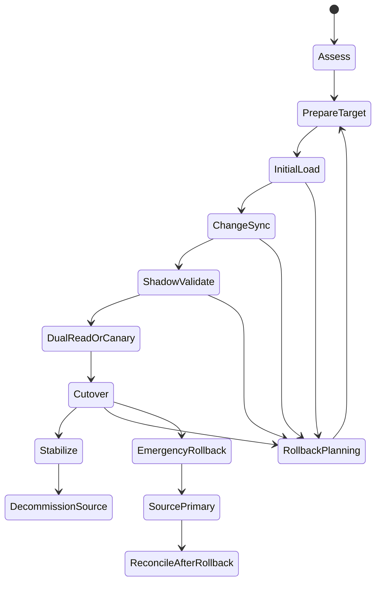
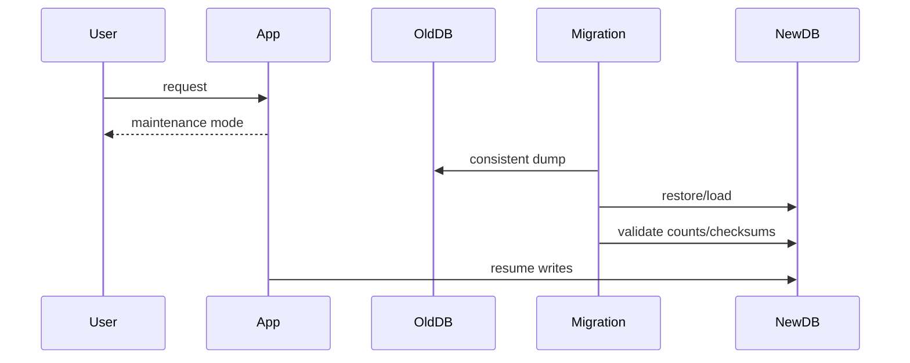
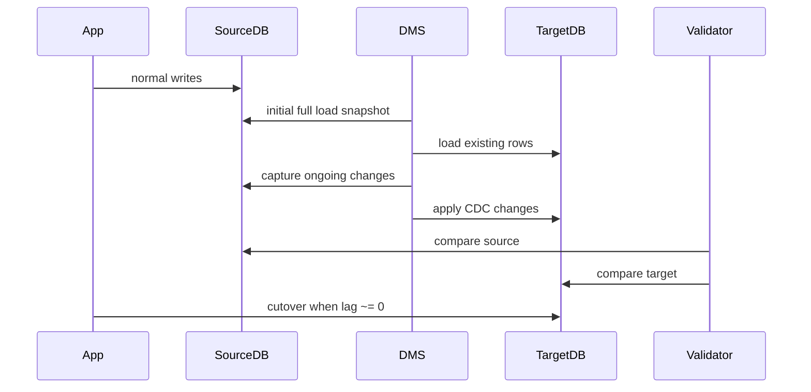
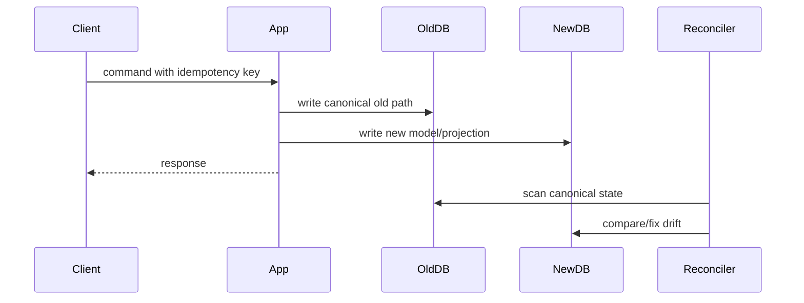
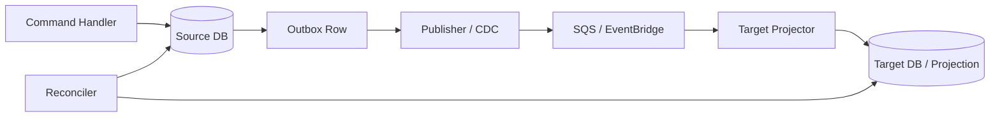
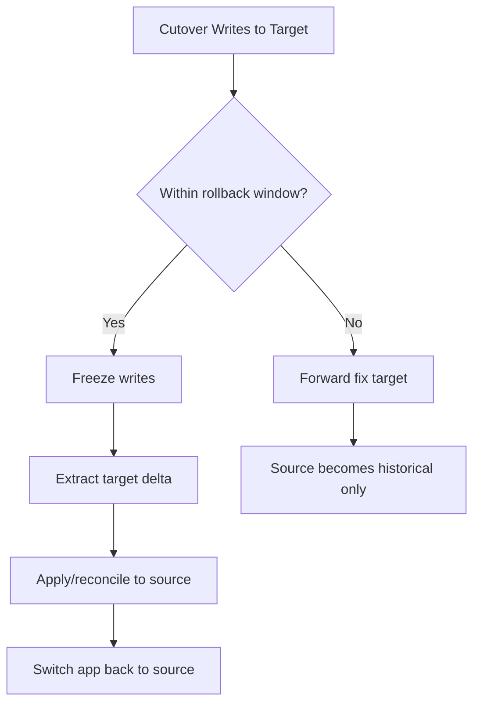

# Part 093 — Database Migration Strategy

Migration database bukan aktivitas memindahkan tabel. Migration adalah operasi mengganti **source of truth** sebuah sistem hidup sambil menjaga correctness, availability, auditability, dan kepercayaan bisnis.

Engineer yang melihat migration sebagai “export/import data” biasanya gagal pada hal-hal yang tidak terlihat di diagram:

- transaksi yang masih berjalan ketika snapshot diambil,
- sequence/identity yang tidak sinkron,
- trigger/constraint yang berbeda,
- query lama yang diam-diam bergantung pada behaviour engine tertentu,
- cache/projection/search index yang masih menunjuk source lama,
- consumer event yang membaca state lama dan baru bersamaan,
- rollback yang ternyata hanya ada di slide,
- data mismatch yang baru ditemukan setelah cutover.

Database migration yang benar selalu dimulai dari pertanyaan:

> Invariant bisnis apa yang tidak boleh rusak selama source of truth berpindah?

Bukan:

> Tool migrasinya pakai apa?

Tool datang setelah strategy.

---

## 1. Mental Model: Migration sebagai State Transition

Anggap migration sebagai state machine.



Setiap state harus punya:

1. entry criteria,
2. exit criteria,
3. validation evidence,
4. rollback path,
5. owner,
6. observable metrics,
7. maximum allowed drift.

Migration bukan sukses ketika task selesai. Migration sukses ketika sistem baru menjadi source of truth, data terbukti benar, aplikasi stabil, dan source lama bisa dinonaktifkan tanpa rasa takut.

---

## 2. Migration Taxonomy

Gunakan taxonomy ini sebelum memilih AWS DMS, backup/restore, CDC, application dual-write, atau rewrite.

| Strategy | Apa yang Berubah | Downtime | Risiko | Kapan Cocok |
|---|---|---:|---:|---|
| Rehost | Infrastruktur pindah, engine sama | rendah-sedang | rendah | lift-and-shift database ke managed RDS/Aurora |
| Replatform | Engine sama/serupa, managed capability berubah | rendah-sedang | sedang | self-managed PostgreSQL/MySQL ke RDS/Aurora |
| Refactor | Model data atau engine berubah | sedang-tinggi | tinggi | relational ke DynamoDB, monolith ke service-owned data |
| Offline bulk migration | aplikasi stop write, dump/restore | tinggi | rendah-sedang | data kecil, downtime diterima |
| Online migration with CDC | initial load + ongoing changes | rendah | sedang-tinggi | downtime kecil, source masih aktif |
| Dual-write migration | aplikasi tulis source dan target | rendah | tinggi | perubahan domain/model butuh kontrol app-level |
| Strangler migration | sebagian capability pindah bertahap | rendah | tinggi secara organisasi | monolith/data ownership dipisah bertahap |
| Active-active migration | source dan target sama-sama menerima write | rendah | sangat tinggi | hanya jika conflict model matang |

### Prinsip

- **Rehost** memindahkan tempat.
- **Replatform** memindahkan operating model.
- **Refactor** memindahkan mental model data.
- **CDC** memindahkan perubahan database.
- **Dual write** memindahkan ownership application.
- **Strangler** memindahkan capability.

Jangan salah pilih level perubahan. Migrasi dari PostgreSQL monolith ke DynamoDB single-table design bukan “DMS task”. Itu redesign data ownership dan access pattern.

---

## 3. Migration Drivers

Migration harus punya driver eksplisit. Tanpa driver, trade-off menjadi arbitrer.

| Driver | Implikasi Strategy |
|---|---|
| Mengurangi ops burden | RDS/Aurora, managed backup, managed failover |
| Meningkatkan availability | Multi-AZ, Aurora, Global Database, DSQL, DynamoDB global tables |
| Scale read-heavy workload | read replica, cache, query projection, OpenSearch |
| Scale write-heavy predictable access | DynamoDB/Keyspaces dengan partition strategy |
| Ubah monolith menjadi services | database-per-service, outbox, CDC, strangler |
| Regulatory auditability | immutable audit, validation evidence, reconciliation reports |
| Cost reduction | right-sizing, engine licensing, storage lifecycle, query rewrite |
| Feature evolution | schema refactor, event sourcing adjacent, projection rebuild |

Migration yang baik menolak scope creep. Kalau driver awal adalah “managed PostgreSQL”, jangan sekaligus memecah domain, mengganti API, memperkenalkan event sourcing, dan mengganti authorization model.

---

## 4. Source-of-Truth Migration Patterns

### 4.1 Stop-the-world migration



Cocok ketika:

- downtime dapat diterima,
- data relatif kecil,
- write rate rendah,
- rollback mudah,
- tidak ada banyak consumer/projection.

Risiko utama:

- downtime ternyata lebih panjang dari estimasi,
- restore gagal di target,
- sequence/identity tidak sinkron,
- application compatibility belum diuji,
- rollback butuh menyalin balik write yang terjadi setelah cutover.

### 4.2 Initial load + CDC



Cocok ketika:

- downtime kecil,
- source dan target schema cukup kompatibel,
- source dapat menyediakan log/replication stream,
- aplikasi masih bisa menulis ke source selama migration.

Risiko utama:

- CDC lag tidak pernah mengejar,
- unsupported data type/DDL/change operation,
- target constraint/index memperlambat apply,
- source retention log tidak cukup,
- transformasi data terlalu kompleks untuk tool-level migration.

### 4.3 Dual write



Dual write cocok ketika target data model berbeda dan CDC tidak bisa melakukan transformasi domain dengan benar.

Namun dual write berbahaya karena tidak ada atomic transaction lintas dua database berbeda. Karena itu dual write harus punya:

- idempotency key,
- write result ledger,
- retry semantics,
- reconciliation job,
- deterministic transform,
- explicit source of truth selama migration,
- rollback rule.

Dual write tanpa reconciliation adalah data corruption yang tertunda.

### 4.4 Outbox + projection migration

Daripada menulis target langsung dari command path, aplikasi menulis event/outbox dalam transaksi source, lalu projector membangun target.



Cocok untuk:

- membangun read model baru,
- migrasi search projection,
- migrasi domain slice,
- incremental strangler,
- menjaga command path tetap transactional.

Batasannya: target bukan source of truth sampai cutover resmi.

---

## 5. Cutover Strategies

### 5.1 Offline cutover

Langkah sederhana:

1. stop writes,
2. final sync,
3. validate,
4. switch connection/config/DNS,
5. smoke test,
6. resume traffic.

Kelemahannya: downtime jelas.

### 5.2 Flash cutover

Aplikasi tetap berjalan sampai window cutover, lalu source dibekukan sebentar untuk mengejar CDC lag dan switch target.

Precondition:

- CDC lag stabil rendah,
- target sudah validated,
- app compatibility sudah shadow-tested,
- rollback path jelas.

### 5.3 Incremental cutover

Pindahkan subset traffic atau subset domain/tenant.

Contoh:

- tenant A pindah ke target,
- read path pindah dulu, write path belakangan,
- low-risk entity pindah dulu,
- internal user pindah dulu.

Ini lebih aman tetapi butuh routing dan source-of-truth matrix yang eksplisit.

### 5.4 Active-active cutover

Source dan target menerima writes selama transisi. Ini paling berbahaya.

Hanya gunakan jika:

- conflict resolution jelas,
- idempotency global jelas,
- ownership partition jelas,
- reconciliation otomatis,
- operasi bisnis dapat menerima semantic conflict.

Untuk sistem regulasi/case management, active-active sering tidak cocok karena audit trail dan sequence of authority sulit dipertahankan.

---

## 6. Migration Readiness Checklist

### 6.1 Data assessment

- daftar database, schema, table, row count, storage size,
- growth rate,
- top write tables,
- top read queries,
- large objects,
- unsupported data type,
- trigger/procedure/function,
- sequence/identity,
- foreign key dependency,
- time zone assumptions,
- collation/case sensitivity,
- encoding,
- null semantics,
- enum/domain type,
- audit tables,
- soft delete/hard delete behaviour.

### 6.2 Application assessment

- connection string ownership,
- transaction assumptions,
- SQL dialect assumptions,
- ORM behaviour,
- migration scripts,
- retry policy,
- read replica assumptions,
- cache invalidation,
- background workers,
- scheduled jobs,
- reporting jobs,
- data exports,
- admin tools,
- manual SQL runbooks.

### 6.3 Integration assessment

- downstream consumers,
- event publishers,
- queues,
- workflow state machines,
- search index,
- BI/export pipeline,
- audit sink,
- backup/restore jobs,
- data retention policy,
- compliance reports.

Migration biasanya gagal karena “hidden consumers” yang tidak ada di architecture diagram.

---

## 7. Consistency and Validation Strategy

Validation harus dibagi menjadi beberapa level.

| Level | Validasi | Kapan |
|---|---|---|
| Structural | schema, table, column, type, index, constraint | sebelum load |
| Count | row count per table/partition/tenant | setelah full load |
| Checksum | hash per partition/range | setelah full load dan CDC stable |
| Semantic | business invariant | sebelum cutover |
| Query-level | critical read path output | shadow/canary |
| Transactional | command produces same state | canary/dual-run |
| Operational | latency, error, lock, connection, lag | continuous |
| Audit | sample case history reconstructable | sebelum go-live |

### Jangan cukup hanya row count

Row count bisa sama sementara data rusak.

Contoh mismatch yang tidak tertangkap row count:

- timestamp timezone berubah,
- decimal precision berbeda,
- enum mapping salah,
- null menjadi empty string,
- boolean mapping berubah,
- JSON field berubah format,
- deleted rows ikut termigrasi,
- audit ordering berubah.

---

## 8. Drift Budget

Setiap migration online punya drift.

Tentukan:

- maksimum CDC lag,
- maksimum validation mismatch,
- maksimum unprocessed event,
- maksimum stale projection age,
- maksimum unresolved reconciliation item,
- maksimum rollback data loss yang dapat diterima.

Contoh:

```txt
CDC lag before cutover: <= 5 seconds for 30 continuous minutes
Validation mismatch: 0 for authoritative tables
Non-critical audit mismatch: <= 0.001%, must be reconciled before decommission
Open reconciliation items: 0 for tenant selected for cutover
Rollback decision window: 30 minutes after write cutover
```

Tanpa drift budget, tim hanya akan berdebat berdasarkan rasa aman.

---

## 9. Rollback Is a Data Problem

Rollback aplikasi mudah: deploy version lama.

Rollback database sulit karena ada write baru di target setelah cutover.

Ada tiga model rollback:

### 9.1 Rollback before write cutover

Masih aman. Source masih primary. Target dibuang atau diulang.

### 9.2 Rollback after read cutover only

Relatif aman jika write masih ke source. Read path diarahkan kembali ke source.

### 9.3 Rollback after write cutover

Sulit. Harus memutuskan nasib write yang sudah masuk ke target:

- replay balik ke source,
- export delta,
- manual reconciliation,
- forward-fix target,
- freeze business operation.

Karena itu setiap cutover harus punya **rollback decision window**.



---

## 10. CDC vs Dual Write Decision

| Question | Prefer CDC | Prefer Dual Write / Outbox |
|---|---|---|
| Target schema nearly same? | yes | no |
| Need domain transformation? | limited | yes |
| Need preserve transaction order? | yes | maybe |
| Need application semantics? | no | yes |
| Source can expose replication log? | yes | not required |
| Target is projection/read model? | yes | yes |
| Need new aggregate model? | no | yes |
| Need business validation per command? | no | yes |

Rule praktis:

- gunakan CDC untuk **state movement**,
- gunakan outbox/dual-write untuk **semantic movement**.

---

## 11. Schema Evolution During Migration

Migration sering berjalan selama minggu/bulan. Source schema akan berubah.

Gunakan prinsip expand-migrate-contract:

1. **Expand**: tambahkan kolom/tabel baru secara backward-compatible.
2. **Dual-read/dual-write jika perlu**: aplikasi support versi lama dan baru.
3. **Backfill**: isi data historis.
4. **Validate**: cek completeness dan semantics.
5. **Switch**: gunakan field/model baru.
6. **Contract**: hapus model lama setelah aman.

Selama migration:

- freeze perubahan DDL besar,
- wajib review migration impact,
- setiap schema change punya compatibility matrix,
- migrasi target ikut perubahan source,
- CDC task diuji terhadap DDL.

---

## 12. Application Routing During Migration

Migration modern jarang hanya database-level. Aplikasi perlu routing.

Contoh routing flags:

```yaml
migration:
  readPath:
    cases: source
    officers: target_shadow
    auditTimeline: target
  writePath:
    cases: source
    officerAssignment: source_plus_outbox_projection
  tenantCutover:
    tenant-001: source
    tenant-002: target
  fallback:
    readTargetFallbackToSource: true
    writeFallbackToSource: false
```

Routing harus deterministik dan observable.

Setiap request harus bisa menjawab:

- tenant/domain/entity mana,
- source DB mana yang dibaca,
- target DB mana yang ditulis,
- migration mode apa,
- data version apa,
- correlation ID apa.

---

## 13. Observability for Migration

Minimal dashboard:

| Category | Signal |
|---|---|
| Source health | CPU, I/O, lock wait, replication log retention, connection count |
| Migration task | full load progress, CDC latency, errors, retries, throughput |
| Target health | CPU, I/O, locks, write latency, constraint failures, storage growth |
| Application | error rate, latency, retry, timeout, pool exhaustion |
| Data quality | mismatch count, checksum diff, reconciliation backlog |
| Business | failed commands, stuck cases, duplicate audit entries |
| Cutover | active route map, canary result, rollback decision window |

Migration without observability is a long-running production incident with a happy name.

---

## 14. Regulatory / Case Management Example

Misal sistem enforcement lifecycle punya:

- `case`,
- `case_state_transition`,
- `case_assignment`,
- `evidence`,
- `enforcement_action`,
- `audit_log`,
- `deadline`,
- `notification`.

### Migration risk matrix

| Data | Source of Truth | Migration Risk | Validation |
|---|---|---|---|
| Case core state | relational DB | high | state machine invariant |
| Audit log | append-only table | very high | sequence/order/hash chain |
| Evidence metadata | relational + object storage | high | DB row + object existence |
| Assignment | relational DB | medium | active assignment uniqueness |
| Notification | queue/event | medium | idempotency and delivery log |
| Search timeline | OpenSearch projection | low-medium | rebuildable from source |
| Dashboard metrics | derived state | low | recompute from source |

### Invariants

```txt
Each case has exactly one current state.
Each state transition has a previous state except the initial transition.
No enforcement action exists without a case.
Audit log order must be reconstructable.
Evidence metadata must reference an existing object version.
Deadline recalculation must be deterministic.
```

Migration plan must validate these, not only table counts.

---

## 15. Migration Strategy ADR Template

```md
# ADR: Database Migration Strategy for <System>

## Status
Proposed | Accepted | Superseded

## Context
- Current source database:
- Target database:
- Business driver:
- Downtime tolerance:
- RPO/RTO/RCO:
- Compliance constraints:

## Scope
Included:
Excluded:

## Source-of-Truth Plan
- Current source of truth:
- Target source of truth:
- Transition model:
- Read path during migration:
- Write path during migration:

## Migration Pattern
- Offline / Full load + CDC / Dual write / Outbox projection / Strangler:
- Why:
- Alternatives rejected:

## Validation Plan
- Structural:
- Count:
- Checksum:
- Semantic:
- Business invariant:
- Shadow/canary:

## Cutover Plan
- Entry criteria:
- Steps:
- Owner:
- Communication:
- Freeze window:

## Rollback Plan
- Before write cutover:
- After write cutover:
- Rollback decision window:
- Delta handling:

## Observability
- Dashboards:
- Alerts:
- Logs:
- Reconciliation reports:

## Risks
- Data mismatch:
- Lag:
- Unsupported feature:
- Performance regression:
- Hidden consumer:

## Decision

## Consequences
```

---

## 16. Pre-Cutover Checklist

```txt
[ ] All critical queries tested against target.
[ ] Application compatibility tested with target engine/version.
[ ] Full load completed.
[ ] CDC lag below threshold for agreed window.
[ ] Validation mismatch is zero for authoritative tables.
[ ] Semantic invariant checks passed.
[ ] Target backup/PITR configured.
[ ] Target monitoring alarms configured.
[ ] Connection pool and credentials configured.
[ ] Secrets rotation strategy ready.
[ ] Cache invalidation plan ready.
[ ] Background workers paused/routed correctly.
[ ] Scheduled jobs reviewed.
[ ] Downstream consumers notified or tested.
[ ] Rollback runbook rehearsed.
[ ] Business sign-off captured.
[ ] Decommission plan documented.
```

---

## 17. Failure Modes

| Failure | Cause | Mitigation |
|---|---|---|
| CDC lag grows forever | target slow, missing indexes, high write rate | scale replication, add indexes, reduce transform, pause cutover |
| Target data mismatch | unsupported type, transformation bug | partition checksum, semantic validation, reconciliation |
| App works in test but fails in prod | hidden query/path | shadow traffic, query log, canary |
| Rollback impossible | no delta plan | rollback window and write delta ledger |
| Sequence collision | sequence not advanced | set sequence after load |
| Constraint violation during CDC | target constraint too early | defer constraints/index strategy |
| Source log retention exceeded | CDC paused too long | monitor retention and lag |
| Cutover DNS stale | client caching | config-based switch or short TTL prepared earlier |
| Cache shows old data | cache not flushed/versioned | namespace epoch or explicit invalidation |
| Audit trail inconsistent | ordering/timestamp mismatch | preserve source order and event metadata |

---

## 18. Engineering Heuristics

- Prefer **one source of truth** during migration.
- Treat target as projection until cutover.
- Do not call migration “done” before reconciliation passes.
- Avoid big-bang refactor and engine migration at the same time.
- Never migrate data you cannot validate.
- Never cut over to a system you cannot restore.
- Never rely on rollback after write cutover unless delta handling is rehearsed.
- Every migration plan should include a “do nothing” alternative and why it is worse.

---

## 19. References

- AWS Database Migration Service User Guide — What is AWS DMS: https://docs.aws.amazon.com/dms/latest/userguide/Welcome.html
- AWS DMS — Creating tasks for ongoing replication using CDC: https://docs.aws.amazon.com/dms/latest/userguide/CHAP_Task.CDC.html
- AWS DMS — Best practices: https://docs.aws.amazon.com/dms/latest/userguide/CHAP_BestPractices.html
- AWS DMS — Data validation: https://docs.aws.amazon.com/dms/latest/userguide/CHAP_Validating.html
- AWS DMS Fleet Advisor end of support: https://docs.aws.amazon.com/dms/latest/userguide/dms_fleet.advisor-end-of-support.html
- AWS Prescriptive Guidance — Database cutover strategies: https://docs.aws.amazon.com/prescriptive-guidance/latest/strategy-database-migration/cut-over.html
- AWS Prescriptive Guidance — Cutover stage: https://docs.aws.amazon.com/prescriptive-guidance/latest/best-practices-migration-cutover/cutover-stage.html
- AWS Prescriptive Guidance — Transactional outbox pattern: https://docs.aws.amazon.com/prescriptive-guidance/latest/cloud-design-patterns/transactional-outbox.html
