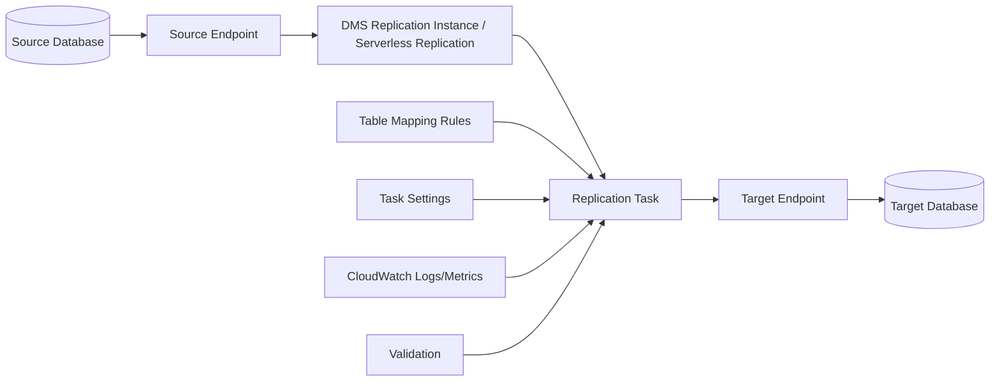
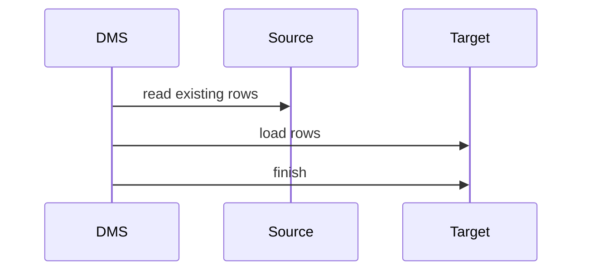
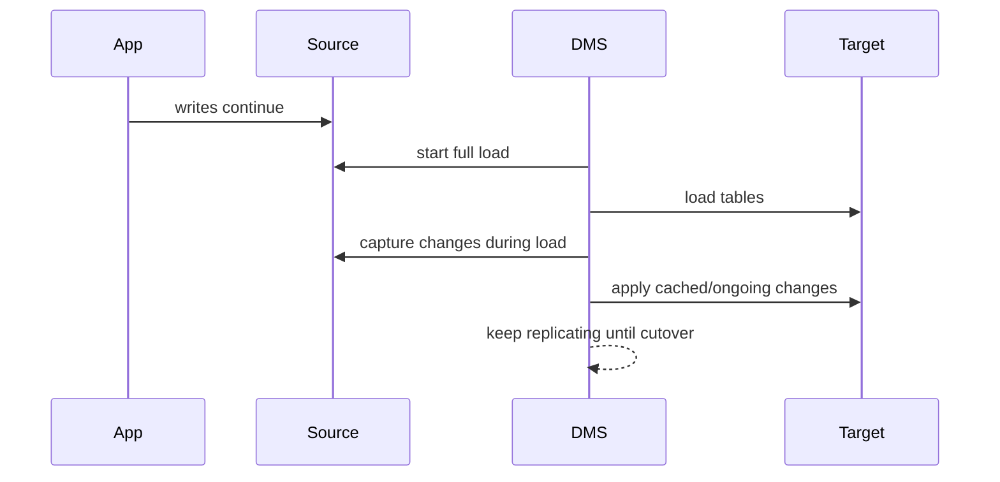
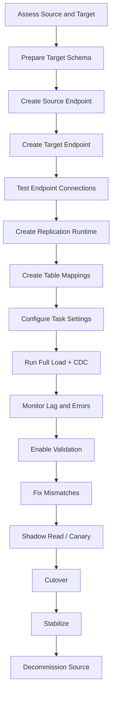
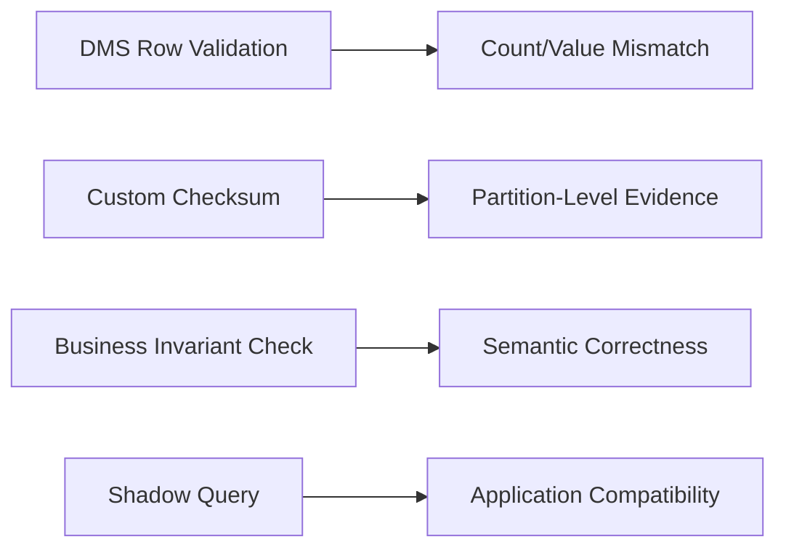
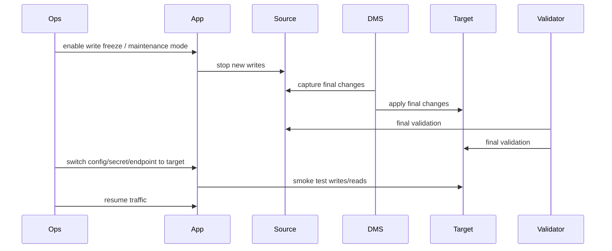
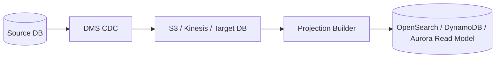

# Part 094 — AWS DMS in Action

AWS Database Migration Service adalah tool migrasi dan replication. Ia bukan pengganti migration strategy, bukan magic compatibility layer, dan bukan validator semua invariant bisnis.

DMS kuat ketika masalahnya adalah:

- load data existing,
- capture change dari source,
- apply change ke target,
- keep target approximately/currently synchronized,
- membantu cutover dengan downtime kecil.

DMS lemah ketika masalahnya adalah:

- perubahan domain model besar,
- business invariant kompleks,
- cross-aggregate transformation,
- hidden application dependency,
- semantic conflict,
- source-of-truth ambiguity.

Gunakan DMS sebagai data movement engine. Gunakan architecture discipline untuk correctness.

---

## 1. DMS Runtime Model



Core objects:

| Object | Fungsi |
|---|---|
| Source endpoint | koneksi ke database sumber |
| Target endpoint | koneksi ke database target |
| Replication instance / serverless replication | compute runtime yang menjalankan migration |
| Replication task | definisi migration: full load, CDC, full load + CDC |
| Table mappings | include/exclude/transform table/schema |
| Task settings | full load behaviour, logging, validation, error policy, LOB handling |
| CloudWatch metrics/logs | observability |

DMS task bukan transaction coordinator. DMS memindahkan perubahan, tetapi aplikasi tetap harus aman terhadap cutover, lag, mismatch, retry, dan rollback.

---

## 2. Migration Types in DMS

DMS task umum punya tiga mode.

| Mode | Arti | Cocok Untuk |
|---|---|---|
| Full load | copy existing data sekali | offline/bulk migration |
| CDC only | apply ongoing changes mulai posisi tertentu | target sudah di-load sebelumnya |
| Full load + CDC | load existing data lalu apply perubahan ongoing | online migration dengan downtime kecil |

### Full load only



Cocok untuk data statis atau downtime accepted.

### Full load + CDC



Ini mode paling umum untuk low-downtime migration.

---

## 3. DMS Does Not Migrate Everything

Sebelum memakai DMS, pisahkan:

| Category | DMS Handles? | Notes |
|---|---:|---|
| Table rows | yes | core function |
| Ongoing row changes | yes, with CDC support | source-dependent |
| Schema conversion | partly via AWS SCT/schema conversion tooling | not magic |
| Indexes | not always automatically ideal | plan target index strategy |
| Stored procedures/functions | usually separate work | engine-dependent |
| Triggers | separate work | often disabled until cutover |
| Sequences/identity | manual validation needed | common cutover bug |
| Users/roles/permissions | separate work | migration/security plan |
| Application SQL compatibility | no | test application |
| Business invariants | no | build validation/reconciliation |
| Cache/search/projection | no | rebuild or sync separately |

DMS can move bytes. It cannot decide whether moved bytes still mean the same thing.

---

## 4. End-to-End DMS Migration Plan



Key point: target schema should be explicitly prepared. Do not blindly expect migration-generated schema to be production-grade.

---

## 5. Source Preparation

### 5.1 General checks

```txt
[ ] Source engine/version supported.
[ ] Required database privileges granted.
[ ] Network path from DMS runtime to source works.
[ ] SSL/TLS requirements defined.
[ ] Replication/log retention configured.
[ ] Source write rate measured.
[ ] Large objects measured.
[ ] Long-running transactions identified.
[ ] Tables without primary key identified.
[ ] Unsupported data types identified.
[ ] DDL change policy defined during migration.
```

### 5.2 PostgreSQL-style source concerns

For PostgreSQL/Aurora PostgreSQL migrations, pay attention to:

- logical replication configuration,
- replication slot retention,
- WAL growth,
- primary key/replica identity,
- long-running transactions,
- large objects,
- schema search path,
- extensions,
- sequences.

### 5.3 MySQL-style source concerns

For MySQL/Aurora MySQL migrations, pay attention to:

- binlog format,
- binlog retention,
- row-based logging,
- timezone,
- character set/collation,
- unsigned numeric mapping,
- auto-increment sync,
- trigger behaviour.

---

## 6. Target Preparation

Target preparation is not passive.

```txt
[ ] Target database created.
[ ] Network path from DMS runtime to target works.
[ ] Target schema reviewed.
[ ] Target indexes planned.
[ ] Target constraints planned.
[ ] Target parameter groups tuned.
[ ] Target storage/autoscaling configured.
[ ] Target backup/PITR configured.
[ ] Target monitoring/alarm configured.
[ ] Application credentials/secrets prepared.
[ ] Cutover connection config prepared.
```

### Index timing

DMS best practice is often nuanced:

- Too many indexes during full load can slow load.
- Missing indexes during CDC can slow apply and cause full scans.
- Constraints/triggers may need to be delayed until target catches up.

For full load + CDC, a common production approach:

1. create essential schema,
2. run full load with minimal necessary constraints,
3. pause before CDC catch-up if needed,
4. add indexes/constraints needed for apply and app,
5. resume CDC,
6. validate,
7. cut over.

Do not blindly apply all application indexes before bulk load without testing.

---

## 7. Table Mapping Rules

Table mappings define what DMS migrates.

Conceptual example:

```json
{
  "rules": [
    {
      "rule-type": "selection",
      "rule-id": "1",
      "rule-name": "include-case-schema",
      "object-locator": {
        "schema-name": "case_management",
        "table-name": "%"
      },
      "rule-action": "include"
    },
    {
      "rule-type": "selection",
      "rule-id": "2",
      "rule-name": "exclude-temp-tables",
      "object-locator": {
        "schema-name": "case_management",
        "table-name": "tmp_%"
      },
      "rule-action": "exclude"
    }
  ]
}
```

Keep table mappings version-controlled.

Bad practice:

```txt
Someone clicked include-all in the console and nobody knows what changed.
```

Good practice:

```txt
Mappings are reviewed like code, tagged to migration wave, tested in staging, and stored with ADR.
```

---

## 8. Task Settings That Matter

DMS task settings are where many production issues hide.

### 8.1 Full load settings

Important concerns:

- parallel load settings,
- commit rate,
- transaction consistency timeout,
- target table preparation mode,
- stop task cached changes applied / not applied,
- LOB handling.

`TransactionConsistencyTimeout` matters because full load must decide how long to wait for open source transactions before starting.

### 8.2 CDC settings

Important concerns:

- start position/time,
- apply batch settings,
- error handling,
- DDL handling,
- log retention,
- latency metrics,
- task restart behaviour.

### 8.3 LOB handling

Large objects can dominate migration performance.

Options vary by engine and settings, but strategy-level choices are:

| Strategy | Trade-off |
|---|---|
| Ignore LOB | fastest, but data incomplete |
| Limited LOB mode | better performance, truncation risk if limit wrong |
| Full LOB mode | correctness for arbitrary LOB, slower |
| Separate object migration | best if LOBs are really files/blobs |

If evidence files are stored as BLOBs in a source database, migration is not only database migration. It is storage architecture migration.

---

## 9. Validation with DMS

DMS data validation can compare source and target after full load and during CDC-enabled tasks. Treat it as one layer, not the whole validation story.



Use DMS validation for row-level movement confidence.

Use custom validation for:

- aggregate invariants,
- state machine validity,
- audit trail ordering,
- derived projection correctness,
- attachment/object existence,
- tenant-level completeness,
- query result equivalence.

---

## 10. Monitoring DMS

Minimum operational dashboard:

| Signal | Meaning |
|---|---|
| CDC latency source | how far capture is behind source |
| CDC latency target | how far apply is behind target |
| full load progress | whether initial load is moving |
| task errors | transformation/apply/connectivity issues |
| table errors | table-specific failure |
| validation failures | mismatch evidence |
| replication runtime CPU/memory | capacity pressure |
| source DB load | migration harming production? |
| target DB load | apply bottleneck? |
| WAL/binlog retention | risk of CDC failure |

A DMS task can be green while the business migration is red. Always correlate with app and data validation metrics.

---

## 11. DMS Failure Modes

| Failure | Symptom | Likely Cause | Response |
|---|---|---|---|
| CDC latency grows | target lag increasing | target indexes, locks, capacity, high write rate | scale target/runtime, tune apply, reduce load |
| Full load slow | low throughput | network, LOB, indexes, source query cost | tune parallelism, index strategy, split tables |
| Source log grows | WAL/binlog retention pressure | CDC slow or paused | fix lag before source disk risk |
| Data mismatch | validation errors | mapping/type/transform issue | stop cutover, reconcile/fix mapping |
| Constraint errors | apply fails | target constraints too strict/early | adjust load/constraint sequence |
| Duplicate key | target not empty or sequence issue | table prep/mapping/identity | inspect target prep and sequence |
| Task stops after DDL | schema changed during migration | unmanaged DDL | freeze DDL or handle migration path |
| Source production degraded | CPU/I/O/locks high | migration load too aggressive | throttle, window, read replica source if valid |
| Target app fails after cutover | app compatibility gap | SQL dialect/version/config issue | rollback/read-only/fix forward |

---

## 12. Cutover Runbook with DMS

### 12.1 Entry criteria

```txt
[ ] Full load complete.
[ ] CDC running and stable.
[ ] CDC latency <= agreed threshold for agreed window.
[ ] DMS validation clean for authoritative tables.
[ ] Custom semantic validation passed.
[ ] Target backup/PITR enabled.
[ ] Application smoke tests passed against target.
[ ] Rollback runbook rehearsed.
[ ] Business freeze window approved.
[ ] Communication sent.
```

### 12.2 Cutover steps



### 12.3 Post-cutover stabilization

For the first window after cutover:

- monitor target error rate,
- monitor DB load and locks,
- monitor app retry/timeouts,
- monitor business commands,
- keep source read-only if possible,
- keep DMS/task artifacts until evidence accepted,
- run reconciliation more frequently,
- delay destructive cleanup.

---

## 13. Rollback Runbook

### 13.1 Before application writes target

Rollback is simple:

1. keep source primary,
2. stop DMS task,
3. discard/recreate target,
4. fix issue,
5. retry migration.

### 13.2 After application writes target

Rollback is a data reconciliation problem.

You need one of:

- reverse CDC,
- target delta export,
- application outbox replay to source,
- manual reconciliation,
- forward-fix only.

Recommended: during the rollback decision window, record all successful target writes in a command ledger:

```sql
create table migration_target_write_ledger (
  command_id text primary key,
  aggregate_type text not null,
  aggregate_id text not null,
  operation text not null,
  request_hash text not null,
  committed_at timestamptz not null default now(),
  reverse_applied_at timestamptz,
  notes text
);
```

Without this, rollback after write cutover becomes guesswork.

---

## 14. DMS and Application Architecture Patterns

### 14.1 DMS for homogeneous migration

Good fit:

```txt
Self-managed PostgreSQL -> Amazon RDS for PostgreSQL
Amazon RDS PostgreSQL -> Aurora PostgreSQL
Self-managed MySQL -> Aurora MySQL
```

Main work:

- compatibility testing,
- extension support,
- parameter tuning,
- index/constraint strategy,
- cutover and validation.

### 14.2 DMS for heterogeneous migration

Example:

```txt
Oracle -> PostgreSQL
SQL Server -> Aurora PostgreSQL
MySQL -> DynamoDB-like target? usually not simple
```

Needs:

- schema conversion,
- SQL rewrite,
- stored procedure replacement,
- type mapping validation,
- app compatibility testing.

DMS moves data. It does not rewrite your application mental model.

### 14.3 DMS as CDC source for projection

DMS can be part of projection pipeline, but be careful:



If projection needs business semantics, prefer transactional outbox where possible.

---

## 15. Security and Network Design

Checklist:

```txt
[ ] DMS runtime placed in appropriate VPC/subnet.
[ ] Security groups least privilege.
[ ] Source/target credentials stored securely.
[ ] TLS/SSL enforced where required.
[ ] IAM roles scoped to DMS actions.
[ ] CloudWatch logs access controlled.
[ ] Migration artifacts classified.
[ ] Temporary dumps/S3 buckets encrypted and lifecycle-managed.
[ ] PII masking strategy defined for non-prod tests.
[ ] Audit trail for migration operator actions retained.
```

Migration frequently creates privileged cross-environment access. Treat it as a temporary high-risk control plane.

---

## 16. DMS for Regulatory Case Platform: Example Plan

### Source

```txt
Oracle / PostgreSQL monolith database
Tables: case, case_transition, evidence_metadata, assignment, audit_log, notification_outbox
```

### Target

```txt
Aurora PostgreSQL cluster
OpenSearch projection rebuilt separately
S3 object references validated separately
```

### DMS scope

```txt
Include:
- case
- case_transition
- evidence_metadata
- assignment
- audit_log

Exclude:
- temp tables
- derived reporting tables
- search projection tables
- old batch job staging tables
```

### Validation

```txt
Structural:
- schemas match target spec

Count:
- row count by table and tenant

Checksum:
- hash by tenant/date partition

Semantic:
- one active state per case
- transition chain complete
- assignment uniqueness
- evidence object exists
- audit ordering preserved

Application:
- load case detail
- transition case state
- attach evidence metadata
- generate audit timeline
```

### Cutover

```txt
1. Freeze writes.
2. Wait for CDC lag to zero/threshold.
3. Run final semantic validation.
4. Switch app secret endpoint to Aurora.
5. Smoke test command and audit timeline.
6. Resume traffic.
7. Monitor target, app, and business invariants.
8. Keep source read-only for rollback window.
```

---

## 17. DMS Task Review Checklist

Before approving a DMS task:

```txt
[ ] Migration type is justified.
[ ] Source endpoint tested.
[ ] Target endpoint tested.
[ ] Replication runtime sized and monitored.
[ ] Table mappings are version-controlled.
[ ] Task settings reviewed.
[ ] LOB strategy explicit.
[ ] Error handling policy explicit.
[ ] Logging enabled.
[ ] Validation enabled where appropriate.
[ ] Target indexes/constraints strategy documented.
[ ] Source log retention monitored.
[ ] CDC lag alarms configured.
[ ] Data validation dashboard exists.
[ ] Cutover runbook exists.
[ ] Rollback runbook exists.
[ ] Owner assigned for each phase.
```

---

## 18. Common Anti-Patterns

### Anti-pattern 1: “DMS will handle schema.”

DMS can help, but production schema design still needs review.

### Anti-pattern 2: “CDC lag is low, so we are ready.”

Low lag says movement is current. It does not prove correctness.

### Anti-pattern 3: “We can rollback anytime.”

After target accepts writes, rollback requires delta handling.

### Anti-pattern 4: “Validation count passed.”

Count is necessary but not sufficient.

### Anti-pattern 5: “Let the migration run with DDL changes.”

DDL during migration can break replication assumptions. Freeze or govern DDL.

### Anti-pattern 6: “All tables included.”

Derived, temp, staging, reporting, and obsolete tables should be intentionally included or excluded.

---

## 19. Notes on Fleet Advisor

AWS has announced end of support for AWS DMS Fleet Advisor on **May 20, 2026**. After that date, the Fleet Advisor console/resources are no longer accessible and support is no longer available. For new migration assessment planning, do not design a process that depends on Fleet Advisor being available after that date; use current AWS migration assessment alternatives and your own inventory/assessment pipeline.

This matters because “DMS” as a core migration/replication service remains relevant, but Fleet Advisor-specific planning workflows should not be treated as durable tooling after end-of-support.

---

## 20. Final Production Rule

AWS DMS can execute a replication task.

It cannot answer:

- is this still the source of truth?
- is the audit trail legally defensible?
- did the business invariant survive?
- can we rollback safely?
- who owns writes during migration?
- what happens if CDC lag grows during cutover?

Those are architecture questions. Own them explicitly.

---

## 21. References

- AWS Database Migration Service User Guide — What is AWS DMS: https://docs.aws.amazon.com/dms/latest/userguide/Welcome.html
- AWS DMS — Set up replication: https://docs.aws.amazon.com/dms/latest/userguide/CHAP_GettingStarted.Replication.html
- AWS DMS — Creating tasks for ongoing replication using CDC: https://docs.aws.amazon.com/dms/latest/userguide/CHAP_Task.CDC.html
- AWS DMS — Full-load task settings: https://docs.aws.amazon.com/dms/latest/userguide/CHAP_Tasks.CustomizingTasks.TaskSettings.FullLoad.html
- AWS DMS — Data validation: https://docs.aws.amazon.com/dms/latest/userguide/CHAP_Validating.html
- AWS DMS — Data resync: https://docs.aws.amazon.com/dms/latest/userguide/CHAP_Validating.DataResync.html
- AWS DMS — Best practices: https://docs.aws.amazon.com/dms/latest/userguide/CHAP_BestPractices.html
- AWS DMS Fleet Advisor end of support: https://docs.aws.amazon.com/dms/latest/userguide/dms_fleet.advisor-end-of-support.html
- AWS Prescriptive Guidance — Database cutover strategies: https://docs.aws.amazon.com/prescriptive-guidance/latest/strategy-database-migration/cut-over.html
