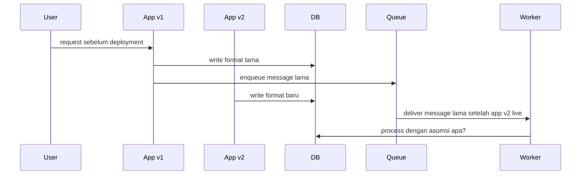
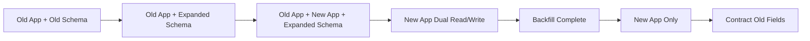
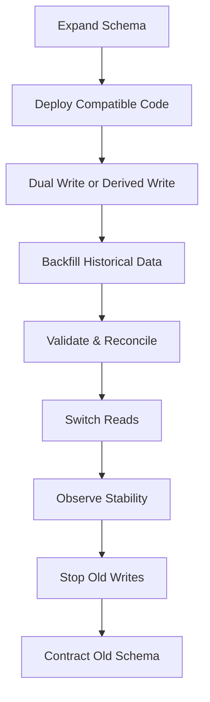
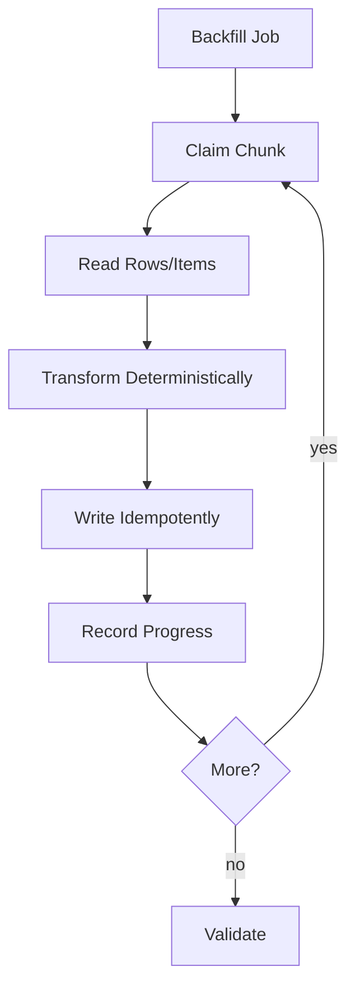
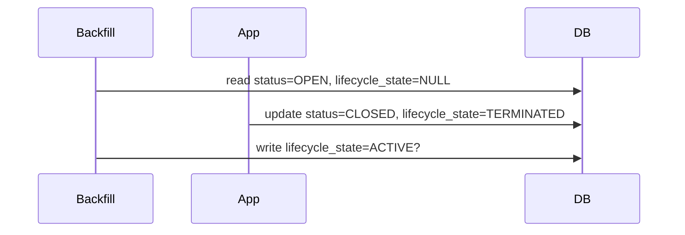
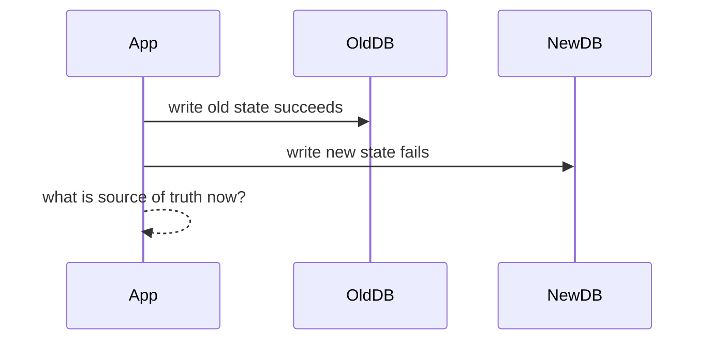
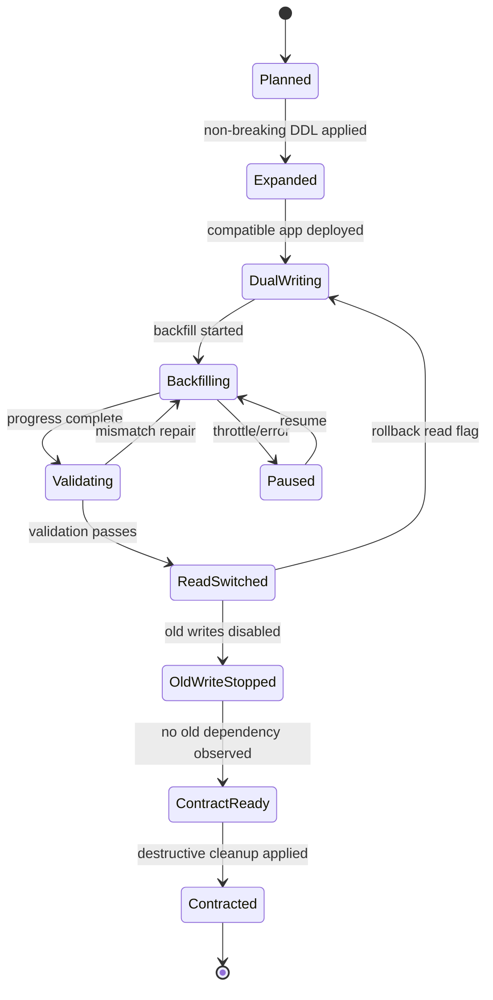

# Part 095 — Zero-Downtime Schema Change

Zero-downtime schema change bukan trik `ALTER TABLE`.

Ia adalah disiplin untuk mengubah **contract antara application, database, event, queue, workflow, cache, dan projection** tanpa menghentikan traffic dan tanpa membuat data berada di state yang tidak bisa dijelaskan.

Kalau hanya satu versi aplikasi berjalan, hanya satu writer, tidak ada queue, tidak ada replay, tidak ada cache, dan tidak ada consumer eksternal, schema migration terlihat sederhana.

Production tidak begitu.

Di production, pada saat deployment:

- versi aplikasi lama dan baru bisa berjalan bersamaan,
- request lama masih retry,
- message lama masih berada di queue,
- workflow lama masih berjalan,
- consumer event lama masih membaca kontrak lama,
- cache masih menyimpan bentuk lama,
- read model mungkin masih memakai projection lama,
- rollback harus mungkin,
- backfill bisa berjalan berjam-jam,
- database harus tetap melayani traffic utama.

Mental model inti:

> Schema change adalah distributed system change.

---

## 1. The Real Problem

Schema migration gagal bukan hanya karena migration SQL salah.

Ia gagal karena perubahan dilakukan seolah-olah application dan database berubah secara atomik.

Padahal deployment biasanya begini:



Pertanyaan yang harus dijawab:

- Apakah aplikasi lama masih bisa membaca schema baru?
- Apakah aplikasi baru masih bisa membaca data lama?
- Apakah worker baru bisa memproses message lama?
- Apakah event lama masih valid untuk consumer baru?
- Apakah event baru masih aman untuk consumer lama?
- Apakah rollback aplikasi masih aman setelah schema berubah?
- Apakah backfill bisa dihentikan dan dilanjutkan?
- Apakah migration bisa diulang tanpa corruption?

Zero downtime bukan berarti tidak ada perubahan internal.

Zero downtime berarti **external contract tetap memenuhi SLO dan invariant selama perubahan berlangsung**.

---

## 2. The Golden Rule: Compatibility Window

Setiap breaking change harus melewati compatibility window.



Compatibility window adalah periode ketika sistem sengaja mendukung dua bentuk data/contract.

| Phase | Yang Harus Benar |
|---|---|
| Old app + expanded schema | app lama tidak rusak ketika schema ditambah |
| mixed old/new app | kedua versi bisa read/write tanpa semantic conflict |
| backfill | data lama dan baru bisa dibaca konsisten |
| new app only | semua traffic memakai logic baru |
| contract | field/index/table lama baru dihapus setelah aman |

Jangan menghapus sesuatu sebelum semua producer dan consumer berhenti menggunakannya.

---

## 3. Expand-Migrate-Contract Pattern

Pattern utama zero-downtime schema change adalah:

1. **Expand** — tambah struktur baru tanpa merusak struktur lama.
2. **Migrate** — pindahkan data dan traffic secara bertahap.
3. **Contract** — hapus struktur lama setelah terbukti tidak digunakan.



Rule praktis:

| Step | Boleh Breaking? | Contoh |
|---|---:|---|
| Expand | Tidak | add nullable column, add table, add index, add event field |
| Migrate | Tidak | backfill, dual write, shadow read |
| Contract | Ya, setelah aman | drop old column, remove old event field, delete old table |

Breaking change hanya boleh terjadi di akhir, setelah observasi membuktikan tidak ada dependency aktif.

---

## 4. Backward and Forward Compatibility

Ada dua arah compatibility.

### Backward compatibility

New code bisa membaca data lama.

Contoh:

```java
String lifecycleState = row.lifecycleState != null
    ? row.lifecycleState
    : mapOldStatus(row.status);
```

### Forward compatibility

Old code tidak rusak ketika schema/data baru muncul.

Contoh:

- field baru nullable,
- enum baru tidak membuat parser crash,
- event payload memakai additive fields,
- unknown JSON field diabaikan,
- old app tidak menulis field baru tetapi new app bisa handle `NULL`.

Checklist compatibility:

| Pertanyaan | Harus Ada Jawaban |
|---|---|
| Old app membaca row baru? | Ya/tidak + bukti test |
| New app membaca row lama? | Ya/tidak + fallback path |
| Old worker memproses message baru? | Ya/tidak + routing/compatibility |
| New worker memproses message lama? | Ya/tidak + upcaster |
| Rollback app setelah schema expand? | Aman/tidak |
| Rollback setelah contract? | Biasanya tidak aman; butuh restore/forward fix |

---

## 5. Schema Change Taxonomy

Tidak semua schema change sama risikonya.

| Change | Risk | Safe Strategy |
|---|---|---|
| Add nullable column | Rendah | expand dulu, app fallback |
| Add column with default | Sedang | cek engine behavior, hindari rewrite besar bila risk |
| Add NOT NULL | Tinggi | add nullable → backfill → validate → enforce |
| Rename column | Tinggi | add new column → dual write → migrate → switch read → drop old |
| Drop column | Tinggi | observe no-read/no-write dulu |
| Change enum/domain value | Sedang/tinggi | additive first, tolerant parser |
| Add index | Sedang | online/concurrent if supported, throttle |
| Drop index | Sedang | prove unused, watch query plans |
| Change primary key | Sangat tinggi | new table/projection/migration path |
| Split table | Tinggi | create new table, dual write, backfill, switch read |
| Merge table | Tinggi | projection/derived model, validation |
| Change event field meaning | Sangat tinggi | new field/name/version; never silently change semantics |

Prinsip:

> Additive change first. Destructive change last.

---

## 6. Aurora PostgreSQL Safe Migration Playbook

Aurora PostgreSQL mengikuti semantics PostgreSQL, tetapi production risk tetap dipengaruhi ukuran table, workload, locks, replication, connection pool, query plan, dan maintenance window.

### 6.1 Add nullable column

Biasanya aman sebagai expand step.

```sql
ALTER TABLE enforcement_case
ADD COLUMN lifecycle_state text;
```

Tetapi tetap:

- jalankan dengan `lock_timeout`,
- jalankan saat traffic rendah jika table sangat panas,
- ukur lock wait,
- pastikan migration runner punya timeout,
- jangan jalankan migration besar dari application startup secara buta.

```sql
SET lock_timeout = '2s';
SET statement_timeout = '30s';

ALTER TABLE enforcement_case
ADD COLUMN lifecycle_state text;
```

Kalau gagal karena lock timeout, migration bisa dicoba ulang dengan aman.

### 6.2 Add column with default

PostgreSQL modern mengoptimalkan beberapa kasus `ADD COLUMN ... DEFAULT` untuk constant default, tetapi jangan jadikan itu alasan malas desain.

Untuk table besar dan sistem kritis, strategi konservatif:

```sql
ALTER TABLE enforcement_case
ADD COLUMN lifecycle_state text;
```

Lalu application mengisi nilai baru untuk write baru, dan backfill mengisi data lama.

### 6.3 Add NOT NULL safely

Jangan langsung:

```sql
ALTER TABLE enforcement_case
ALTER COLUMN lifecycle_state SET NOT NULL;
```

Untuk table besar, pendekatan yang lebih aman:

```sql
-- 1. Tambah column nullable
ALTER TABLE enforcement_case
ADD COLUMN lifecycle_state text;

-- 2. Backfill bertahap
-- dilakukan oleh worker, bukan satu UPDATE besar

-- 3. Tambah check constraint tanpa validasi langsung
ALTER TABLE enforcement_case
ADD CONSTRAINT enforcement_case_lifecycle_state_nn
CHECK (lifecycle_state IS NOT NULL) NOT VALID;

-- 4. Validate constraint setelah backfill
ALTER TABLE enforcement_case
VALIDATE CONSTRAINT enforcement_case_lifecycle_state_nn;

-- 5. Optional: set NOT NULL setelah validasi dan testing
ALTER TABLE enforcement_case
ALTER COLUMN lifecycle_state SET NOT NULL;
```

Catatan: detail lock dan optimization bisa berubah antar versi PostgreSQL/Aurora. Jangan menganggap safe karena statement terlihat kecil. Test di snapshot production-size.

### 6.4 Create index safely

Untuk PostgreSQL:

```sql
CREATE INDEX CONCURRENTLY idx_case_lifecycle_state
ON enforcement_case (tenant_id, lifecycle_state, updated_at DESC);
```

Rules:

- jangan bungkus `CREATE INDEX CONCURRENTLY` dalam transaction block,
- monitor invalid index jika gagal,
- cek write amplification,
- cek query plan setelah index tersedia,
- jangan membuat index karena “mungkin berguna”.

### 6.5 Rename column safely

Jangan langsung rename jika ada app lama.

Buruk:

```sql
ALTER TABLE enforcement_case
RENAME COLUMN status TO lifecycle_state;
```

Aman:

```sql
ALTER TABLE enforcement_case
ADD COLUMN lifecycle_state text;
```

Application transition:

1. v1 reads/writes `status`.
2. expand adds `lifecycle_state`.
3. v2 writes both `status` and `lifecycle_state`.
4. backfill `lifecycle_state` from `status`.
5. v3 reads `lifecycle_state`, fallback to `status`.
6. observe no old reads/writes.
7. v4 stops writing `status`.
8. contract drops `status`.

---

## 7. DynamoDB Schema Evolution Playbook

DynamoDB tidak punya schema migration dalam arti relational DDL, tetapi tetap punya schema contract.

Yang berubah:

- item shape,
- attribute name,
- key grammar,
- GSI projection,
- entity type,
- sort key prefix,
- uniqueness sentinel,
- stream consumer contract,
- TTL behaviour.

### 7.1 Add attribute

Aman jika reader tolerant terhadap missing attribute.

```json
{
  "PK": "CASE#123",
  "SK": "META#123",
  "status": "OPEN",
  "lifecycleState": "OPEN"
}
```

Reader:

```java
String lifecycleState = item.getString("lifecycleState");
if (lifecycleState == null) {
  lifecycleState = mapOldStatus(item.getString("status"));
}
```

### 7.2 Rename attribute

Sama seperti relational: jangan rename langsung.

- add new attribute,
- dual write,
- backfill,
- switch read,
- stop old write,
- optional cleanup.

### 7.3 Change key design

Ini bukan migration kecil.

Kalau access pattern berubah sampai butuh PK/SK baru, biasanya strategi aman:

- tambah GSI baru,
- atau buat table/projection baru,
- backfill dari source table/export/stream,
- switch read path,
- keep source of truth jelas.

### 7.4 Add GSI

Menambah GSI pada table existing memicu backfill index.

Risiko:

- write throttling,
- backfill lama,
- query mulai memakai index sebelum complete,
- GSI hot partition,
- projection tidak cukup.

Safe practice:

- buat GSI dengan nama jelas,
- monitor index status,
- jangan route query ke GSI sebelum `ACTIVE`,
- load test access pattern,
- siapkan rollback read path.

---

## 8. Event, Queue, and Workflow Contract Migration

Schema change database sering pecah karena message/event/workflow tidak ikut dimigrasikan.

### 8.1 Event additive change

Aman:

```json
{
  "eventId": "evt-123",
  "eventType": "CaseStatusChanged",
  "schemaVersion": 2,
  "detail": {
    "caseId": "CASE-123",
    "status": "OPEN",
    "lifecycleState": "ACTIVE"
  }
}
```

Consumer lama masih pakai `status`. Consumer baru pakai `lifecycleState` dengan fallback.

### 8.2 Event semantic change

Tidak aman mengubah arti field yang sama.

Buruk:

```json
{
  "status": "ACTIVE"
}
```

Padahal dulu `status` berarti `OPEN | CLOSED | SUSPENDED`.

Aman:

```json
{
  "status": "OPEN",
  "lifecycleState": "ACTIVE"
}
```

Atau event type baru:

```txt
CaseLifecycleStateChanged
```

### 8.3 Queue message migration

SQS message lama bisa muncul setelah deployment baru.

Consumer harus punya upcaster:

```java
CommandEnvelope envelope = parse(rawMessage);

switch (envelope.schemaVersion()) {
  case 1 -> handle(upcastV1ToV2(envelope));
  case 2 -> handle(envelope);
  default -> sendToQuarantine(envelope);
}
```

### 8.4 Step Functions workflow migration

Workflow lama bisa berjalan lama.

Jangan mengubah asumsi input state lama tanpa versioning.

Safe options:

- buat state machine version/alias baru,
- route execution baru ke versi baru,
- biarkan execution lama selesai,
- jika perlu migration, buat explicit migration workflow,
- jangan menghapus Lambda/worker lama sebelum workflow lama selesai.

---

## 9. Online Backfill Design

Backfill adalah production workload.

Ia harus diperlakukan seperti worker system, bukan script sekali jalan.



### 9.1 Backfill requirements

Backfill harus:

- idempotent,
- resumable,
- throttled,
- observable,
- cancellable,
- partition-aware,
- safe with concurrent writes,
- bounded by retry budget,
- produce reconciliation evidence.

### 9.2 Progress table

Relational example:

```sql
CREATE TABLE migration_job_progress (
  job_name text NOT NULL,
  shard_id text NOT NULL,
  last_seen_id bigint,
  status text NOT NULL,
  updated_at timestamptz NOT NULL DEFAULT now(),
  PRIMARY KEY (job_name, shard_id)
);
```

### 9.3 Chunking relational rows

Avoid one giant transaction.

```sql
SELECT id, status
FROM enforcement_case
WHERE id > :lastSeenId
  AND lifecycle_state IS NULL
ORDER BY id
LIMIT 500;
```

Then update in small batches:

```sql
UPDATE enforcement_case
SET lifecycle_state = :mappedState,
    updated_at = now()
WHERE id = :id
  AND lifecycle_state IS NULL;
```

The `AND lifecycle_state IS NULL` makes it safe if application already wrote the new value.

### 9.4 Chunking DynamoDB

Options:

- scan with low rate and checkpoint,
- segment scan if needed,
- stream-assisted migration,
- export/import for large transformation,
- projection rebuild instead of in-place mutation.

Avoid unlimited Scan on hot production table.

Use:

- rate limiter,
- retry with jitter,
- `ConsumedCapacity` observation,
- `UnprocessedItems` handling,
- per-tenant throttle.

### 9.5 Concurrent writes during backfill

Race example:



Prevent with conditional update:

```sql
UPDATE enforcement_case
SET lifecycle_state = :mappedState
WHERE id = :id
  AND lifecycle_state IS NULL
  AND status = :statusReadByBackfill;
```

If no row updated, skip and let new app value win.

---

## 10. Dual Write Without Lying to Yourself

Dual write is dangerous when it means “write to two independent sources of truth”.

For schema migration, dual write is acceptable when:

- both writes are inside same database transaction, or
- one write is derived and recoverable, or
- there is reconciliation, or
- old/new values live in same item/row, or
- one path is an outbox/projection.

Relational safe dual write:

```sql
BEGIN;

UPDATE enforcement_case
SET status = :oldStatus,
    lifecycle_state = :newState,
    version = version + 1
WHERE id = :caseId
  AND version = :expectedVersion;

INSERT INTO outbox_event (...);

COMMIT;
```

Unsafe dual write:



If two independent stores are involved, use one of:

- transactional outbox,
- CDC,
- projection rebuild,
- reconciliation ledger,
- explicit source-of-truth transition window.

---

## 11. Validation and Reconciliation

Validation bukan `SELECT COUNT(*)` saja.

Validation harus membuktikan semantic equivalence.

| Validation | Example |
|---|---|
| Count | old rows = migrated rows |
| Null check | no remaining `lifecycle_state IS NULL` |
| Mapping check | `status='OPEN'` maps to allowed state |
| Referential check | child rows still resolve parent |
| API check | old and new read path return compatible response |
| Projection check | OpenSearch/DynamoDB read model matches source |
| Event check | no invalid schema in bus/queue |
| Business invariant | no closed case with active sanction |

Example SQL:

```sql
SELECT count(*)
FROM enforcement_case
WHERE lifecycle_state IS NULL;
```

```sql
SELECT status, lifecycle_state, count(*)
FROM enforcement_case
GROUP BY status, lifecycle_state
ORDER BY status, lifecycle_state;
```

Reconciliation job should emit:

- scanned count,
- mismatch count,
- repaired count,
- unrepaired count,
- oldest mismatch age,
- sample IDs,
- run ID,
- code version.

---

## 12. Rollback Strategy

Rollback is not one thing.

| Phase | Rollback Difficulty | Strategy |
|---|---|---|
| Before expand | Easy | no-op |
| After expand | Easy | rollback app; extra nullable fields harmless |
| During dual write | Medium | keep compatibility; disable feature flag |
| During backfill | Medium | stop backfill; resume later |
| After read switch | Medium | switch read flag back if old data maintained |
| After stop old writes | High | re-enable old writes only if old field still maintained |
| After contract/drop | Very high | restore/forward fix; rollback usually impossible |

Never drop old field/table until you accept that rollback may require restore or forward migration.

Safe deploy controls:

- feature flag for read switch,
- feature flag for write switch,
- kill switch for backfill,
- migration version marker,
- dashboard before contract,
- explicit approval gate before destructive DDL.

---

## 13. Migration State Machine

Treat migration as stateful process.



Store migration state somewhere queryable, not only in chat or deployment notes.

Example table:

```sql
CREATE TABLE schema_migration_control (
  migration_name text PRIMARY KEY,
  phase text NOT NULL,
  read_mode text NOT NULL,
  write_mode text NOT NULL,
  backfill_status text NOT NULL,
  validation_status text NOT NULL,
  owner text NOT NULL,
  updated_at timestamptz NOT NULL DEFAULT now()
);
```

---

## 14. Example: `status` to `lifecycle_state`

Requirement:

- old `status`: `OPEN`, `IN_REVIEW`, `CLOSED`
- new `lifecycle_state`: `ACTIVE`, `PENDING_REVIEW`, `TERMINATED`
- no downtime,
- old app rollback possible until final contract.

### Phase 1 — Expand

```sql
ALTER TABLE enforcement_case
ADD COLUMN lifecycle_state text;

ALTER TABLE enforcement_case
ADD CONSTRAINT enforcement_case_lifecycle_state_allowed
CHECK (
  lifecycle_state IS NULL OR
  lifecycle_state IN ('ACTIVE', 'PENDING_REVIEW', 'TERMINATED')
) NOT VALID;
```

### Phase 2 — Compatible app

Write both:

```java
caseRepository.updateStatusAndLifecycleState(
    caseId,
    oldStatus,
    mapToLifecycleState(oldStatus),
    expectedVersion
);
```

Read new with fallback:

```java
LifecycleState state = row.lifecycleState() != null
    ? LifecycleState.valueOf(row.lifecycleState())
    : mapOldStatus(row.status());
```

### Phase 3 — Backfill

```sql
UPDATE enforcement_case
SET lifecycle_state = CASE status
  WHEN 'OPEN' THEN 'ACTIVE'
  WHEN 'IN_REVIEW' THEN 'PENDING_REVIEW'
  WHEN 'CLOSED' THEN 'TERMINATED'
END
WHERE lifecycle_state IS NULL
  AND id BETWEEN :fromId AND :toId;
```

For large table, do this in controlled chunks.

### Phase 4 — Validate

```sql
SELECT count(*)
FROM enforcement_case
WHERE lifecycle_state IS NULL;
```

```sql
ALTER TABLE enforcement_case
VALIDATE CONSTRAINT enforcement_case_lifecycle_state_allowed;
```

### Phase 5 — Switch read

Feature flag:

```txt
case.lifecycle.readSource = lifecycle_state
```

Observe:

- API error rate,
- query latency,
- fallback count,
- null count,
- mismatch count,
- queue retries,
- workflow failures.

### Phase 6 — Stop old write

New app no longer updates `status`, but keeps it for rollback only if needed.

Alternative: keep old field mirrored for one more release.

### Phase 7 — Contract

Only after dependency scan:

```sql
ALTER TABLE enforcement_case
DROP COLUMN status;
```

Do this as separate deployment with explicit approval.

---

## 15. Observability Dashboard

Minimum metrics:

| Metric | Why It Matters |
|---|---|
| migration phase | current state |
| app version distribution | mixed-version window |
| old field reads | dependency still active |
| old field writes | old writer still active |
| fallback reads | data not fully migrated |
| backfill rows/sec | progress |
| backfill error rate | safety |
| lock wait | database impact |
| deadlocks | migration conflict |
| slow query count | index/query impact |
| replica lag | migration pressure |
| queue age | async side effect impact |
| DLQ count | broken consumer contract |
| event schema failures | contract drift |
| validation mismatch | semantic correctness |

Log every migration write with:

- `migration_name`,
- `phase`,
- `chunk_id`,
- `entity_id`,
- `old_value_hash`,
- `new_value_hash`,
- `result`,
- `reason`,
- `duration_ms`.

---

## 16. Failure Modes

| Failure | Cause | Mitigation |
|---|---|---|
| app old crashes on new field | non-tolerant parser | compatibility tests |
| app new crashes on old row | no fallback | backward compatibility |
| table lock incident | unsafe DDL | lock timeout, online DDL, rehearsal |
| backfill overloads DB | no throttle | rate limiter, window, pause switch |
| stale cache | invalidation missing | versioned key/event eviction |
| projection mismatch | derived state not rebuilt | rebuild/reconcile path |
| queue poison messages | old schema unsupported | upcaster/quarantine |
| workflow stuck | state input incompatible | workflow versioning |
| rollback impossible | destructive contract too early | approval gate |
| silent semantic corruption | field meaning changed | new field/event type, validation |

---

## 17. Production Checklist

Before expand:

- [ ] migration ADR exists,
- [ ] compatibility matrix reviewed,
- [ ] rollback phase identified,
- [ ] destructive step separated,
- [ ] production-size rehearsal done,
- [ ] lock/statement timeout configured,
- [ ] observability dashboard ready.

Before backfill:

- [ ] worker idempotent,
- [ ] progress checkpoint exists,
- [ ] throttle/kill switch exists,
- [ ] concurrent write race handled,
- [ ] validation query prepared,
- [ ] alert thresholds defined.

Before read switch:

- [ ] backfill complete,
- [ ] mismatch below agreed threshold,
- [ ] fallback count understood,
- [ ] query latency acceptable,
- [ ] cache/projection updated,
- [ ] event/message contract stable.

Before contract:

- [ ] old reads = 0 for agreed window,
- [ ] old writes = 0 for agreed window,
- [ ] old workflow executions drained,
- [ ] old queue messages drained or upcasted,
- [ ] rollback plan accepted as restore/forward-fix,
- [ ] stakeholder approval recorded.

---

## 18. Mental Model Summary

Zero-downtime schema change is not a database trick.

It is a compatibility protocol.

The invariant:

> At every phase, every running application version, queued message, workflow execution, event consumer, cache entry, and projection must either understand the current data contract or be isolated from it.

The safest pattern is boring:

```txt
expand → compatible code → dual/derived write → backfill → validate → switch read → observe → contract
```

Boring is good.

Boring is what lets you change production data models without gambling with user traffic.

---

## References

- AWS Prescriptive Guidance — Database migration strategy and cutover: https://docs.aws.amazon.com/prescriptive-guidance/latest/strategy-database-migration/cut-over.html
- AWS Prescriptive Guidance — Migrate the data: https://docs.aws.amazon.com/prescriptive-guidance/latest/strategy-database-migration/migrate-data.html
- AWS Prescriptive Guidance — Transactional outbox pattern: https://docs.aws.amazon.com/prescriptive-guidance/latest/cloud-design-patterns/transactional-outbox.html
- PostgreSQL Documentation — `ALTER TABLE`: https://www.postgresql.org/docs/current/sql-altertable.html
- PostgreSQL Documentation — `CREATE INDEX`: https://www.postgresql.org/docs/current/sql-createindex.html
- Amazon RDS/Aurora documentation: https://docs.aws.amazon.com/AmazonRDS/latest/AuroraUserGuide/Welcome.html
- DynamoDB Developer Guide — Data modeling foundations: https://docs.aws.amazon.com/amazondynamodb/latest/developerguide/data-modeling-foundations.html
- DynamoDB Developer Guide — Global secondary indexes: https://docs.aws.amazon.com/amazondynamodb/latest/developerguide/GSI.html
