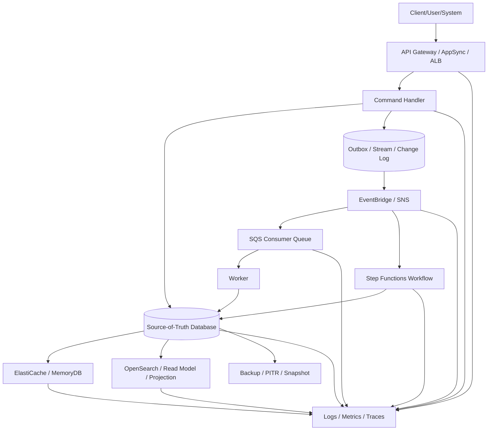
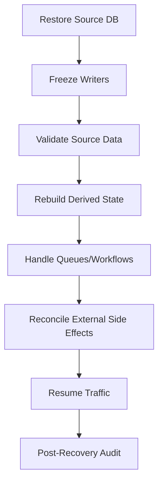

# Part 096 — Production Readiness Final Review

Ini part terakhir seri.

Tujuannya bukan menambah service baru.

Tujuannya adalah memastikan semua yang sudah dipelajari bisa dipakai untuk menjawab satu pertanyaan production:

> Apakah sistem ini siap menerima traffic nyata, gagal secara terkendali, dipulihkan dengan bukti, dan dievolusi tanpa kehilangan correctness?

Production readiness bukan checklist kosmetik.

Production readiness adalah **argumentasi teknis yang bisa diaudit**.

---

## 1. The Final System Map

Sistem application + database di AWS biasanya terlihat seperti ini:



The production question is not “does every box exist?”

The production question is:

- what invariant does each box protect,
- what happens when it fails,
- who owns recovery,
- what is the blast radius,
- how do we prove data correctness after recovery,
- how do we safely change it later?

---

## 2. Production Readiness as Evidence

A production-ready system has evidence for these categories:

| Category | Evidence |
|---|---|
| Functional correctness | invariant tests, contract tests, state transition tests |
| Integration correctness | idempotency, retry, DLQ, replay, ordering decision |
| Data correctness | source-of-truth definition, reconciliation, backup restore test |
| Reliability | RTO/RPO, failover test, dependency degradation |
| Operability | dashboard, alarms, runbook, owner, escalation |
| Security | least privilege, encryption, audit trail, data classification |
| Cost | capacity model, cost drivers, guardrails |
| Change safety | deployment plan, migration strategy, rollback/forward-fix |
| Compliance | evidence retention, auditability, explainability |

If you cannot show evidence, it is not ready. It is only hoped ready.

---

## 3. Invariants Register

Start with invariants, not services.

Example invariant register:

| ID | Invariant | Owner | Enforcement | Detection | Repair |
|---|---|---|---|---|---|
| INV-001 | Case number unique per tenant | Case service | DB unique constraint / conditional write | duplicate scan | merge/void duplicate |
| INV-002 | Closed case cannot receive new sanction | Command handler | state transition guard | reconciliation query | reverse invalid sanction |
| INV-003 | Every accepted command has audit event | transaction + outbox | outbox count mismatch | outbox repair |
| INV-004 | Projection eventually matches source | projection worker | reconciliation job | rebuild projection |
| INV-005 | External notification sent at most once per command | side-effect ledger | duplicate check | compensate/manual review |
| INV-006 | Workflow cannot remain pending beyond SLA | Step Functions timeout + monitor | stuck execution alarm | escalate/compensate |

A serious readiness review asks:

- Where is this invariant enforced?
- Is enforcement atomic?
- What if enforcement fails after commit?
- What if the event is duplicated?
- What if the projection is stale?
- What if the workflow is replayed?
- How do we prove and repair violation?

---

## 4. Boundary Review

Every boundary must have an owner and contract.

| Boundary | Required Contract |
|---|---|
| API → command handler | request schema, idempotency, timeout, error model |
| command handler → database | transaction boundary, concurrency policy, retry policy |
| database → outbox/event | atomic publication or recoverable CDC |
| event bus → consumer | schema version, filtering, DLQ, replay behavior |
| queue → worker | idempotent consumer, visibility timeout, backpressure |
| workflow → participant | task contract, timeout, compensation |
| source DB → cache | staleness budget, invalidation, fallback |
| source DB → projection | rebuild, lag SLO, reconciliation |
| production → operator | dashboard, alarm, runbook |

Anti-pattern:

```txt
"The service owns it".
```

Better:

```txt
Case Service owns command validation and source-of-truth writes.
Projection Worker owns OpenSearch read model freshness and rebuild.
Workflow Orchestrator owns long-running process progress and compensation.
Operations owns incident coordination, but service team owns repair logic.
```

---

## 5. API Readiness

API readiness is not “endpoint returns 200”.

Review:

| Area | Question |
|---|---|
| Contract | Is OpenAPI/GraphQL schema versioned and tested? |
| Validation | Are invalid commands rejected before side effect? |
| Idempotency | Are retries safe for create/update commands? |
| Timeout | Is timeout budget explicit from client to database? |
| Retry | Are client retries bounded and jittered? |
| Rate limit | Are tenant/global limits configured? |
| Error model | Are 4xx/409/429/5xx/503/504 semantics stable? |
| Observability | Can we trace one request to DB write/event/workflow? |
| Authorization | Is decision checked server-side at command boundary? |
| Rollback | Can old and new app versions coexist? |

Minimum API production gates:

- [ ] `Idempotency-Key` or equivalent for non-trivial commands,
- [ ] correlation ID propagated,
- [ ] request validation exists,
- [ ] structured error shape documented,
- [ ] per-tenant abuse controls exist,
- [ ] load test covers p95/p99 and failure responses,
- [ ] dashboards show latency, error, throttling, dependency failure.

---

## 6. Queue Readiness

SQS readiness means the system can absorb work, slow down safely, and recover from bad messages.

Review:

| Area | Question |
|---|---|
| Queue type | Standard or FIFO chosen based on ordering need? |
| Message contract | Is schema versioned? |
| Idempotency | Can duplicate delivery corrupt state? |
| Visibility timeout | Is it longer than normal processing but not infinite? |
| DLQ | Does max receive count match retry policy? |
| Redrive | Is replay controlled and observable? |
| Backpressure | Can worker concurrency be reduced safely? |
| Poison message | Can bad message be quarantined without blocking all work? |
| Ordering | If FIFO, is `MessageGroupId` designed to avoid hot groups? |
| Large payload | Is S3 pointer pattern safe and secured? |

Production gate:

- [ ] message age alarm,
- [ ] visible backlog alarm,
- [ ] DLQ growth alarm,
- [ ] worker error-rate alarm,
- [ ] replay runbook,
- [ ] idempotency/inbox table,
- [ ] partial batch failure support where applicable.

---

## 7. Event Readiness

Event-driven systems fail silently when no one owns the contract.

Review:

| Area | Question |
|---|---|
| Event type | Is this a fact, not a command disguised as event? |
| Source | Is `source` stable and owned? |
| Detail type | Is `detail-type` semantic and versionable? |
| Schema | Is schema compatible and tested? |
| Routing | Are rules/filter policies owned and reviewed? |
| DLQ | Are important targets protected by DLQ? |
| Replay | Are consumers replay-safe? |
| Archive | Is archive retention intentional? |
| Cross-account | Are bus policies least-privilege? |
| Observability | Can event be traced from producer to consumer? |

Production gate:

- [ ] event envelope standard,
- [ ] schema compatibility CI,
- [ ] consumer idempotency,
- [ ] DLQ and replay path,
- [ ] rule inventory,
- [ ] archive/replay governance,
- [ ] event storm and replay storm runbook.

---

## 8. Workflow Readiness

Step Functions readiness means long-running process correctness is explicit.

Review:

| Area | Question |
|---|---|
| Workflow type | Standard vs Express justified? |
| State ownership | What is workflow state vs domain state? |
| Task timeout | Does every task have timeout/heartbeat? |
| Retry | Are transient vs permanent errors separated? |
| Compensation | Is compensation semantic, not blind rollback? |
| Callback | Are callback tokens protected and expiring? |
| Idempotency | Are participants safe under retry/redrive? |
| Versioning | What happens to old executions after deployment? |
| Observability | Can an operator understand stuck execution? |
| Cost | Are polling loops avoided? |

Production gate:

- [ ] state machine reviewed as code,
- [ ] `Retry`/`Catch` policies explicit,
- [ ] terminal states meaningful,
- [ ] timeout/heartbeat configured,
- [ ] compensation tested,
- [ ] stuck execution alarm,
- [ ] execution history/logging strategy documented.

---

## 9. Database Readiness

Database readiness is not “the table exists”.

Review:

| Area | Question |
|---|---|
| Source of truth | Which database owns each entity? |
| Access pattern | Are query/write patterns known and tested? |
| Consistency | Which reads require strong consistency? |
| Transaction | What is the atomic boundary? |
| Concurrency | Optimistic, pessimistic, conditional, or serialized? |
| Uniqueness | Where is uniqueness enforced? |
| Schema evolution | Is expand-migrate-contract ready? |
| Backup | Has restore been tested? |
| DR | Are RTO/RPO defined and tested? |
| Observability | Can we diagnose latency, lock, hot key, throttling? |

### 9.1 RDS/Aurora gate

- [ ] engine selection ADR,
- [ ] parameter groups reviewed,
- [ ] connection pool sized,
- [ ] RDS Proxy considered/tested if needed,
- [ ] migration lock strategy defined,
- [ ] slow query visibility enabled,
- [ ] wait-event dashboard,
- [ ] backup/PITR restore test,
- [ ] failover test,
- [ ] read replica lag strategy.

### 9.2 DynamoDB gate

- [ ] access pattern matrix,
- [ ] PK/SK grammar documented,
- [ ] GSI/LSI decision documented,
- [ ] hot key load test,
- [ ] capacity mode justified,
- [ ] throttling alarms,
- [ ] conditional write and transaction failure handling,
- [ ] stream consumer idempotency,
- [ ] backup/restore/export strategy,
- [ ] global table conflict strategy if multi-Region.

### 9.3 Cache gate

- [ ] cache is not hidden source of truth unless using MemoryDB intentionally,
- [ ] staleness budget defined,
- [ ] invalidation strategy tested,
- [ ] stampede protection,
- [ ] fail-open/fail-closed policy,
- [ ] eviction/memory alarms,
- [ ] reconnect storm mitigation,
- [ ] hot key detection.

### 9.4 Specialized database gate

- [ ] DocumentDB compatibility tested,
- [ ] Neptune traversal performance tested,
- [ ] Keyspaces partition design validated,
- [ ] Timestream retention/rollup policy defined,
- [ ] OpenSearch treated as projection, not source of truth,
- [ ] rebuild/reconciliation path exists.

---

## 10. Migration and Change Readiness

Every production system must change safely.

Review:

| Change Type | Required Plan |
|---|---|
| API change | compatibility, versioning, deprecation |
| Event change | schema versioning, replay safety |
| DB schema change | expand-migrate-contract |
| Index change | online build, query plan validation |
| Data backfill | idempotent, resumable, throttled |
| Database migration | full load/CDC/dual run/cutover/rollback |
| Cache key change | namespace/version strategy |
| Projection change | rebuild and shadow compare |
| Workflow change | versioning and old execution policy |

Production gate:

- [ ] change has owner,
- [ ] rollback/forward-fix chosen,
- [ ] blast radius known,
- [ ] deploy sequence written,
- [ ] validation queries ready,
- [ ] observability ready before deploy,
- [ ] destructive step separated and approved.

---

## 11. Disaster Recovery and Recovery Correctness

Backups are not recovery.

Recovery is proven only when restore and validation have been executed.

Review:

| Area | Question |
|---|---|
| RTO | How long until service restored? |
| RPO | How much data loss tolerated? |
| Restore | Has backup/PITR/snapshot restore been tested? |
| Integrity | How is restored data validated? |
| Dependencies | Which hard dependencies block recovery? |
| Runbook | Who does what during recovery? |
| Credentials | Can operators access recovery path during identity incident? |
| Replay | How are queues/events/workflows handled after restore? |
| Reconciliation | How are external side effects reconciled? |

Important recovery edge cases:

- database restored to T-15 minutes but SQS still contains messages after T,
- workflow executions reference state that no longer exists,
- outbox events replay and duplicate external notification,
- cache/projection contains data newer than restored source DB,
- OpenSearch index must be rebuilt,
- DMS/CDC target lags behind source,
- global tables have region conflict after failover.

Recovery plan must include dependent state cleanup.



---

## 12. Observability Readiness

Observability must answer:

- is the system healthy,
- why is it unhealthy,
- what user/business invariant is at risk,
- what should an operator do next?

Minimum dashboard sections:

| Section | Metrics |
|---|---|
| API | request rate, p50/p95/p99 latency, 4xx/5xx/429/503/504 |
| Command | idempotency hits, conflict rate, validation failure |
| Database | CPU, connections, latency, locks/waits, throttling, replica lag |
| Queue | visible messages, oldest age, in-flight, DLQ count |
| Event | failed invocations, retry attempts, DLQ, rule match count |
| Workflow | executions started/succeeded/failed/timed out, stuck age |
| Cache | hit rate, evictions, memory, connections, latency |
| Projection | lag, rebuild status, mismatch count |
| Migration | phase, progress, error, validation mismatch |
| Cost | request units, state transitions, data transfer, storage growth |

Alarm design:

- alert on user impact or invariant risk,
- avoid unactionable noise,
- include runbook link,
- include owner,
- include dashboard link,
- include recent deploy/change context.

---

## 13. Load, Capacity, and Cost Readiness

Capacity test must reflect real shape, not average traffic.

Test dimensions:

| Dimension | Example |
|---|---|
| steady state | normal weekday traffic |
| peak | monthly filing deadline |
| burst | sudden import/upload |
| skew | one tenant/case hot key |
| degraded dependency | database slower, cache unavailable |
| replay | SQS/EventBridge replay after outage |
| backfill | migration running during live traffic |
| failover | Aurora/RDS/ElastiCache failover |
| cold start | cache empty, projection rebuild |
| regional event | cross-region routing/failover |

Cost review must identify drivers:

- API requests,
- Lambda duration/concurrency,
- Step Functions state transitions or Express duration,
- SQS requests,
- EventBridge events/rules/pipes/scheduler,
- DynamoDB RCU/WCU/GSI/streams/global tables,
- RDS/Aurora instance/ACU/I/O/storage/backup,
- ElastiCache/MemoryDB node/serverless usage,
- OpenSearch storage/compute/ingest,
- data transfer,
- logging volume,
- snapshot retention.

Guardrails:

- tenant quotas,
- max throughput settings where supported,
- alarms on cost anomaly,
- per-feature cost attribution,
- load-shed policy,
- expensive query review.

---

## 14. Security and Compliance Readiness

Application + database security is not only IAM.

Review:

| Area | Question |
|---|---|
| Identity | Which principal can call/write/read? |
| Authorization | Is authorization enforced near source-of-truth command? |
| Least privilege | Are IAM policies scoped to specific resources/actions? |
| Encryption | At rest and in transit? |
| Secrets | Rotation and runtime access path? |
| Audit | Can we explain who changed what and why? |
| Data classification | PII/sensitive field handling? |
| Logs | Are secrets/PII redacted? |
| Backup | Are backups protected and retained properly? |
| Deletion | Legal retention vs user deletion reconciled? |
| Cross-account | Event bus/resource policies controlled? |

For regulatory systems, defensibility requires:

- immutable or append-only audit trail where needed,
- actor identity,
- command reason,
- previous state,
- new state,
- timestamp,
- correlation ID,
- decision basis,
- evidence link,
- repair/override trail.

---

## 15. Incident Runbook Readiness

Minimum runbooks:

| Incident | Runbook Must Include |
|---|---|
| API latency spike | dependency isolation, throttle, rollback |
| DB connection exhaustion | pool reduction, RDS Proxy, client kill, failover check |
| DB lock/deadlock | identify blocker, safe terminate, query fix |
| DynamoDB throttling | throttling reason, hot key, capacity/action |
| SQS backlog | worker scale, DB pressure, poison message check |
| DLQ growth | sample, classify, replay/quarantine |
| EventBridge target failure | DLQ/retry/rule inspection |
| Step Functions stuck workflow | execution search, timeout/compensation |
| Cache failure | fail-open/fail-closed, DB protection |
| Projection mismatch | rebuild/reconcile |
| Migration failure | pause, rollback/forward-fix, validation |
| Regional degradation | traffic route, data authority, recovery state |
| Restore needed | freeze, restore, validate, replay/reconcile |

Runbook format:

```txt
Symptom:
Impact:
Likely causes:
Immediate mitigation:
Diagnostic queries:
Rollback/repair:
Validation after repair:
Escalation:
Customer/compliance note:
```

---

## 16. Launch Readiness Review Template

Use this before production launch or major release.

### 16.1 System context

```txt
Service:
Owner:
On-call:
Business capability:
Critical users:
Dependencies:
Source-of-truth databases:
Derived stores:
Async systems:
External side effects:
```

### 16.2 Invariants

```txt
Invariant:
Enforced by:
Detection:
Repair:
Evidence:
Residual risk:
```

### 16.3 Failure model

```txt
Failure:
Expected behavior:
Blast radius:
Alarm:
Runbook:
Test evidence:
```

### 16.4 Data readiness

```txt
Schema reviewed:
Migration plan:
Backfill plan:
Validation plan:
Restore test date:
RTO/RPO:
Reconciliation owner:
```

### 16.5 Go/no-go criteria

```txt
Go if:
- critical invariants have enforcement and detection,
- high-severity runbooks tested,
- dashboards/alarms active,
- rollback/forward-fix clear,
- load/capacity evidence accepted,
- security/compliance sign-off complete.

No-go if:
- source of truth unclear,
- destructive migration lacks rollback/restore plan,
- DLQ/replay path missing for critical async work,
- backup restore untested,
- no owner for production incident,
- observability cannot identify user impact.
```

---

## 17. Final Architecture Review Questions

Ask these in the final review.

### Correctness

- What can never be allowed to happen?
- Where is that enforced?
- Is enforcement atomic?
- How do we detect violation?
- How do we repair violation?

### Consistency

- Which read paths are stale by design?
- What is the staleness budget?
- Which state is source of truth?
- Which state is derived?
- Can derived state be rebuilt?

### Failure

- What happens if DB write succeeds but response fails?
- What happens if event publish fails?
- What happens if message is delivered twice?
- What happens if workflow times out?
- What happens if cache is empty or stale?
- What happens if Region fails?

### Operations

- Which dashboard shows user impact?
- Which alarm wakes someone up?
- Which runbook do they follow?
- Can they safely pause consumers/backfill/replay?
- Can they prove recovery?

### Evolution

- Can we add a field without breaking old app?
- Can we change event contract safely?
- Can we rebuild projection?
- Can we migrate database with low downtime?
- Can we roll back or forward-fix?

---

## 18. The Top 1% Mental Model

A strong engineer does not ask:

```txt
Should we use SQS, EventBridge, Step Functions, Aurora, or DynamoDB?
```

A strong engineer asks:

```txt
What invariant must hold?
What is the access pattern?
Where is the transaction boundary?
What happens under retry?
What happens under duplicate delivery?
What happens under stale read?
What happens under partial failure?
How do we observe, recover, and evolve it?
```

AWS services are implementation choices.

The real architecture is:

- boundary,
- ownership,
- state,
- consistency,
- failure model,
- recovery,
- operability,
- evolution.

If those are clear, service selection becomes disciplined.

If those are unclear, even the best managed service becomes a distributed failure amplifier.

---

## 19. Series Completion

This is the final part of the series:

```txt
learn-aws-application-database-part-096-production-readiness-final-review.mdx
```

The series covered:

- application/database mental model,
- integration style decision framework,
- API Gateway and AppSync,
- SQS,
- SNS and EventBridge,
- Step Functions,
- database selection,
- RDS and Aurora,
- Aurora DSQL,
- DynamoDB,
- cache and MemoryDB/ElastiCache,
- specialized databases,
- database migration,
- zero-downtime schema change,
- final production readiness review.

You now have the map.

The next level is not more service memorization.

The next level is building production-grade systems, injecting failures, measuring invariants, and forcing the design to survive reality.

---

## References

- AWS Well-Architected Framework: https://docs.aws.amazon.com/wellarchitected/latest/framework/welcome.html
- AWS Well-Architected Operational Excellence — Implement observability: https://docs.aws.amazon.com/wellarchitected/latest/operational-excellence-pillar/implement-observability.html
- AWS Well-Architected Reliability — Plan for disaster recovery: https://docs.aws.amazon.com/wellarchitected/latest/reliability-pillar/plan-for-disaster-recovery-dr.html
- AWS Well-Architected Reliability — Back up data: https://docs.aws.amazon.com/wellarchitected/latest/reliability-pillar/back-up-data.html
- AWS Operational Readiness Reviews: https://docs.aws.amazon.com/wellarchitected/latest/operational-readiness-reviews/wa-operational-readiness-reviews.html
- AWS Prescriptive Guidance — Transactional outbox pattern: https://docs.aws.amazon.com/prescriptive-guidance/latest/cloud-design-patterns/transactional-outbox.html
- AWS Prescriptive Guidance — Saga pattern: https://docs.aws.amazon.com/prescriptive-guidance/latest/cloud-design-patterns/saga.html
- AWS Prescriptive Guidance — Database migration strategy: https://docs.aws.amazon.com/prescriptive-guidance/latest/strategy-database-migration/welcome.html
- Amazon SQS Developer Guide: https://docs.aws.amazon.com/AWSSimpleQueueService/latest/SQSDeveloperGuide/welcome.html
- Amazon EventBridge User Guide: https://docs.aws.amazon.com/eventbridge/latest/userguide/eb-what-is.html
- AWS Step Functions Developer Guide: https://docs.aws.amazon.com/step-functions/latest/dg/welcome.html
- Amazon RDS User Guide: https://docs.aws.amazon.com/AmazonRDS/latest/UserGuide/Welcome.html
- Amazon DynamoDB Developer Guide: https://docs.aws.amazon.com/amazondynamodb/latest/developerguide/Introduction.html
