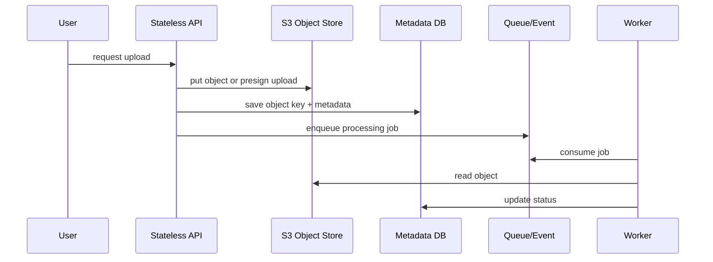
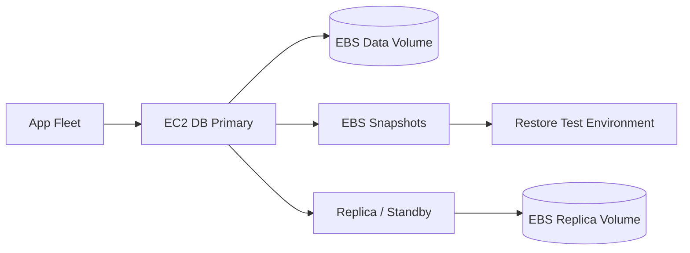
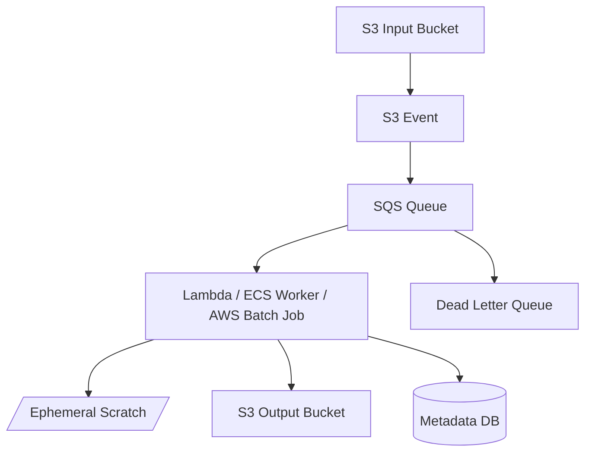
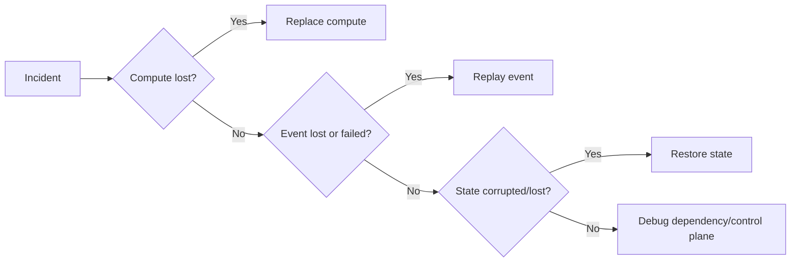
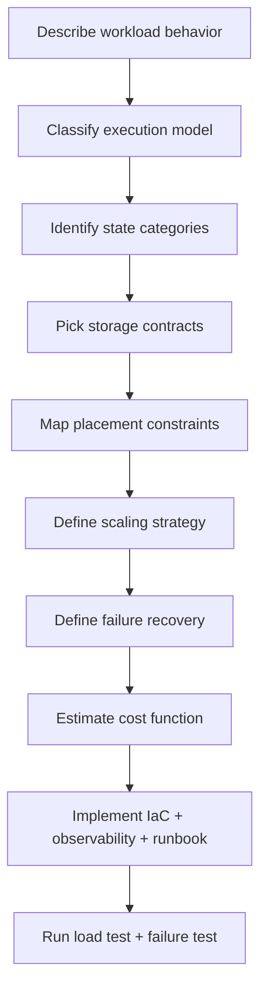

# Part 001 — Compute-Storage Mental Model

Tujuan part ini sederhana: sebelum memilih EC2, ECS, EKS, Lambda, Batch, S3, EBS, EFS, FSx, atau instance store, kita harus punya cara berpikir yang benar.

Kesalahan engineer yang masih “service-oriented” biasanya begini:

> “Workload ini pakai Lambda atau ECS?”  
> “File upload taruh di S3 atau EFS?”  
> “Database di EC2 butuh EBS gp3 atau io2?”

Pertanyaan itu tidak salah, tapi terlalu cepat. Di production, pilihan compute dan storage bukan soal nama service. Pilihan itu adalah hasil dari kontrak workload:

1. bagaimana kode dieksekusi,
2. bagaimana state disimpan,
3. seberapa dekat compute harus berada dengan state,
4. apa yang boleh hilang,
5. apa yang harus tahan lama,
6. bagaimana sistem pulih ketika sebagian infrastruktur gagal,
7. dan berapa biaya yang masuk akal untuk semua itu.

AWS compute dan storage harus dipahami sebagai satu sistem, bukan dua katalog produk terpisah.

---

## 1. Problem yang Diselesaikan

Ketika aplikasi berjalan di laptop, compute dan storage terasa menyatu:

- proses berjalan di mesin yang sama,
- file ada di disk lokal,
- latency file system rendah,
- failure domain kecil,
- dependency mental model sederhana.

Di AWS, hubungan itu pecah menjadi beberapa lapisan:

- compute bisa ephemeral,
- storage bisa remote,
- disk bisa network-attached,
- object store bukan file system,
- container bisa pindah node,
- Lambda execution environment bisa hidup ulang,
- Auto Scaling bisa mengganti instance kapan saja,
- satu Availability Zone bisa bermasalah,
- satu Region bisa perlu diisolasi dalam desain disaster recovery.

Dari sudut pandang production engineering, masalah utamanya bukan “service mana yang paling bagus”, tapi:

> Bagaimana menyusun compute dan storage supaya workload tetap benar, cepat, pulih, dan ekonomis ketika kondisi normal maupun gagal?

Part ini membangun fondasi untuk semua part berikutnya.

---

## 2. Mental Model Utama

Gunakan formula berikut sebagai pegangan:

```txt
Workload = Execution Model + State Contract + Placement Constraint + Failure Recovery Path + Cost Function
```

Mari pecah.

### 2.1 Execution Model

Execution model menjawab:

- kode berjalan di mana?
- siapa yang mengelola runtime?
- siapa yang mengelola host?
- kapan compute dibuat dan dihancurkan?
- workload butuh proses panjang atau request pendek?
- workload butuh daemon, scheduler, worker, job, atau function?

Contoh execution model AWS:

| Model | AWS service umum | Karakter |
|---|---|---|
| Virtual machine | EC2 | Kontrol tinggi, operational burden tinggi |
| Managed fleet | EC2 Auto Scaling Group | VM tetap, tapi capacity dikontrol otomatis |
| Container service | ECS | Container orchestration managed oleh AWS |
| Kubernetes | EKS | Kubernetes API + AWS integration |
| Serverless function | Lambda | Function-per-event, runtime managed, scaling otomatis |
| Serverless container | Fargate | Container tanpa mengelola host |
| Batch scheduler | AWS Batch | Job queue, compute environment, retry, scheduling |

Execution model menentukan siapa yang bertanggung jawab terhadap patching, bootstrapping, bin-packing, scaling, isolation, dan recovery.

### 2.2 State Contract

State contract menjawab:

- data apa yang dibuat workload?
- data itu transient atau durable?
- boleh hilang atau tidak?
- dibaca oleh satu compute atau banyak compute?
- mutability-nya seperti apa?
- butuh file semantics, block semantics, atau object semantics?
- butuh latency mikrodetik, milidetik, atau bisa detik-menit?

Contoh storage model AWS:

| Model | AWS service umum | Karakter |
|---|---|---|
| Object storage | S3 | Object/key, durable, scalable, bukan file system |
| Block storage | EBS | Volume attach ke EC2, cocok untuk filesystem/database |
| Ephemeral local disk | Instance store | Sangat dekat dengan host, cepat, data hilang saat lifecycle tertentu |
| Shared file | EFS | File system bersama, NFS, multi-client |
| Specialized file | FSx | File workload spesifik: Lustre, Windows, ONTAP, OpenZFS |
| Hybrid bridge | Storage Gateway/DataSync | Transfer, cache, migration, hybrid access |

State contract lebih penting daripada storage service name. Misalnya:

- upload dokumen user hampir selalu lebih cocok sebagai object di S3 daripada file di EBS,
- database write-ahead log biasanya lebih cocok di block storage dengan latency predictable,
- shared media assets untuk banyak container bisa cocok di EFS,
- HPC scratch dataset bisa cocok di FSx for Lustre atau instance store tergantung durability contract.

### 2.3 Placement Constraint

Placement constraint menjawab:

- compute dan storage harus berada di Availability Zone yang sama?
- storage bisa diakses lintas AZ?
- latency budget cukup untuk remote object store?
- data harus dekat dengan GPU/CPU tertentu?
- workload bisa berpindah node?
- ada dependency ke mount target, ENI, subnet, atau AZ-specific resource?

Contoh penting:

- EBS volume bersifat zonal; instance yang akan attach volume harus berada di AZ yang sama.
- S3 bersifat regional; aplikasi tidak attach block device, tetapi akses via API.
- EFS bisa diakses oleh banyak compute melalui mount target di VPC.
- Instance store melekat ke host fisik; data tidak boleh dianggap durable.
- Kubernetes PersistentVolume berbasis EBS akan membawa constraint AZ ke scheduling pod.

### 2.4 Failure Recovery Path

Failure recovery path menjawab:

- kalau compute mati, siapa mengganti?
- kalau disk rusak atau volume impaired, apa recovery-nya?
- kalau AZ tidak tersedia, sistem degrade atau failover?
- kalau object terhapus, bagaimana restore?
- kalau Lambda retry menyebabkan duplicate processing, apakah aplikasi idempotent?
- kalau queue menumpuk, apakah sistem scale atau collapse?

Recovery path harus didesain sebelum incident, bukan saat incident.

### 2.5 Cost Function

Cost function menjawab:

- biaya dihitung per instance-hour, vCPU-hour, request, GB-month, IOPS, throughput, transfer, retrieval, atau lifecycle?
- apakah workload idle lama?
- apakah traffic bursty?
- apakah data cold tapi retention panjang?
- apakah request kecil tapi sangat banyak?
- apakah biaya transfer data lebih mahal daripada compute?

Cost di AWS jarang hanya “harga service”. Cost adalah perilaku workload dikalikan pricing model.

---

## 3. Diagram Mental Model

```mermaid
flowchart TD
    W[Workload] --> E[Execution Model]
    W --> S[State Contract]
    W --> P[Placement Constraint]
    W --> F[Failure Recovery Path]
    W --> C[Cost Function]

    E --> EC2[EC2 / ASG]
    E --> ECS[ECS / Fargate]
    E --> EKS[EKS]
    E --> L[Lambda]
    E --> B[AWS Batch]

    S --> OBJ[S3 Object]
    S --> BLK[EBS Block]
    S --> LOC[Instance Store]
    S --> FILE[EFS / FSx File]

    P --> AZ[AZ-local]
    P --> REG[Regional]
    P --> HYB[Hybrid / Edge]

    F --> R1[Replace compute]
    F --> R2[Restore state]
    F --> R3[Replay events]
    F --> R4[Fail over]

    C --> CC[Capacity cost]
    C --> SC[Storage cost]
    C --> RC[Request cost]
    C --> DC[Data transfer cost]
```



Baca diagram ini dari kiri ke kanan. Jangan mulai dari kotak service. Mulai dari workload.

---

## 4. Compute Bukan Mesin, Compute Adalah Execution Boundary

Di AWS, compute bukan sekadar “server”. Compute adalah boundary tempat kode berjalan.

Boundary ini menentukan:

- lifecycle proses,
- scaling unit,
- deployment unit,
- security boundary,
- storage attachment,
- failure handling,
- observability unit,
- dan operational ownership.

### 4.1 EC2

EC2 memberi kontrol paling besar. Anda memilih instance type, AMI, OS, bootstrap, daemon, patching, filesystem, runtime, capacity strategy, dan termination behavior.

Cocok ketika:

- butuh kontrol OS/kernel/runtime,
- ada legacy binary,
- workload stateful membutuhkan block device,
- butuh custom networking atau low-level tuning,
- butuh predictable long-running process,
- perlu GPU/accelerator/large memory tertentu,
- container/serverless abstraction terlalu membatasi.

Trade-off:

- patching menjadi tanggung jawab Anda,
- bootstrapping harus robust,
- drift harus dikendalikan,
- scaling lambat dibanding function-level scaling,
- host failure harus dimodelkan eksplisit.

### 4.2 Auto Scaling Group

ASG mengubah EC2 dari “server individual” menjadi “fleet”. Unit berpikirnya bukan lagi instance tunggal, tetapi desired capacity.

Cocok ketika:

- aplikasi stateless atau semi-stateless,
- instance bisa diganti,
- load berubah secara predictable atau metric-driven,
- deployment bisa rolling/blue-green,
- scaling dan recovery instance harus otomatis.

Invariant penting:

> Instance dalam ASG harus disposable. Kalau instance tidak bisa dibuang, desain Anda belum benar-benar fleet-ready.

### 4.3 ECS dan EKS

Container compute memindahkan unit deployment dari VM ke image/container. Scheduler menempatkan workload di capacity yang tersedia.

Cocok ketika:

- aplikasi dikemas sebagai container,
- deployment butuh isolation per service,
- bin-packing penting,
- service count banyak,
- scaling per service/task/pod lebih relevan daripada scaling per VM,
- organization butuh platform internal.

Perbedaan mental model:

- ECS lebih langsung terintegrasi dengan AWS primitives.
- EKS memberi Kubernetes API dan ecosystem, dengan kompleksitas lebih besar.

### 4.4 Fargate

Fargate membuat container berjalan tanpa Anda mengelola host EC2 secara langsung.

Cocok ketika:

- workload containerized,
- tim ingin mengurangi host operations,
- scaling tidak membutuhkan custom node tuning,
- isolation per task/pod lebih penting,
- workload tidak terlalu bergantung pada local disk/daemon/privileged operations.

Trade-off:

- lebih sedikit kontrol host,
- beberapa pattern storage/daemon/sidecar tertentu lebih terbatas,
- cost bisa lebih tinggi untuk workload steady besar dibanding EC2 fleet yang dioptimalkan.

### 4.5 Lambda

Lambda menjadikan function sebagai execution unit. Anda tidak mengelola server, tetapi harus menerima model concurrency, timeout, retry, cold start, dan event semantics.

Cocok ketika:

- workload event-driven,
- durasi pendek-menengah,
- traffic bursty,
- operasi bisa idempotent,
- state eksternal,
- tidak perlu daemon long-running.

Trade-off:

- runtime lifecycle tidak sepenuhnya Anda kontrol,
- cold start dan concurrency harus dipahami,
- local filesystem hanya scratch sementara,
- retry dapat menghasilkan duplicate processing.

### 4.6 AWS Batch

Batch adalah scheduler untuk job-oriented workload. Anda mendeskripsikan job, queue, compute environment, retry, dan resource requirement.

Cocok ketika:

- workload tidak request/response,
- job bisa diantrikan,
- compute bisa scale up/down mengikuti backlog,
- workload ML/simulasi/ETL/rendering/batch analytics,
- Spot interruption bisa ditoleransi dengan checkpoint/retry.

---

## 5. Storage Bukan Disk, Storage Adalah State Contract

Storage harus dipilih berdasarkan kontrak state, bukan berdasarkan kebiasaan lokal.

### 5.1 Object Storage: S3

S3 adalah object store. Anda menyimpan object berdasarkan key. Access dilakukan melalui API, bukan mount disk biasa.

Cocok untuk:

- file upload user,
- document/archive/media,
- data lake,
- event-driven pipeline,
- backup artifact,
- static assets,
- immutable object,
- large binary payload.

Tidak cocok sebagai pengganti langsung POSIX filesystem ketika aplikasi membutuhkan:

- rename atomic seperti file system,
- append-in-place,
- low-latency random write,
- lock file semantics,
- directory metadata yang sangat sering berubah.

### 5.2 Block Storage: EBS

EBS adalah block device network-attached yang biasanya diformat sebagai filesystem atau dipakai database engine.

Cocok untuk:

- root volume EC2,
- database volume,
- low-latency block I/O,
- filesystem lokal durable untuk satu instance,
- log/WAL/data file layout.

Constraint utama:

- volume terikat AZ,
- attachment umumnya ke EC2 di AZ yang sama,
- throughput/IOPS/latency harus dipilih dan diuji,
- snapshot perlu diuji restore-nya.

### 5.3 Instance Store

Instance store adalah storage lokal pada host fisik. Cepat dan dekat dengan compute, tetapi ephemeral.

Cocok untuk:

- cache,
- scratch,
- temporary processing,
- shuffle,
- build artifact sementara,
- data yang bisa direkonstruksi.

Tidak cocok untuk:

- source of truth,
- data user yang belum direplikasi,
- database utama tanpa replication/checkpoint yang aman.

### 5.4 Shared File: EFS

EFS memberi file system bersama. Banyak compute bisa mount file system yang sama.

Cocok untuk:

- shared content,
- multi-instance file access,
- container/serverless yang butuh shared files,
- CMS/media workflow,
- lift-and-shift aplikasi yang butuh NFS-like behavior.

Trade-off:

- metadata-heavy workload bisa menjadi bottleneck,
- permission model harus rapi,
- latency berbeda dari disk lokal,
- mount/network path menjadi dependency.

### 5.5 Specialized File: FSx

FSx cocok untuk file workload khusus:

- FSx for Lustre untuk HPC/ML/high-throughput file workload,
- FSx for Windows File Server untuk SMB/Windows workload,
- FSx for NetApp ONTAP untuk enterprise NAS pattern,
- FSx for OpenZFS untuk workload yang butuh OpenZFS semantics.

Gunakan FSx ketika “file storage” bukan sekadar shared folder, tetapi bagian dari performance atau compatibility contract.

---

## 6. Compute-Storage Coupling

Setiap desain production memiliki tingkat coupling antara compute dan storage.

| Coupling | Contoh | Karakter | Risiko |
|---|---|---|---|
| Tightly coupled | EC2 + EBS database | Latency rendah, kontrol tinggi | AZ constraint, failover kompleks |
| Moderately coupled | ECS task + EFS | Shared file mudah | Network/mount dependency |
| Loosely coupled | Lambda + S3 | Durable, scalable, event-driven | Event duplication, request cost |
| Ephemeral coupled | EC2 + instance store | Cepat, murah untuk scratch | Data hilang saat host hilang |
| Scheduler-coupled | EKS StatefulSet + EBS CSI | Kubernetes-native state | Pod scheduling terikat AZ |

Prinsipnya:

> Semakin ketat coupling compute-storage, semakin besar tanggung jawab Anda terhadap placement, failover, dan recovery.

---

## 7. Production Invariants

Invariant adalah aturan yang tidak boleh dilanggar oleh desain production.

### 7.1 Compute Harus Bisa Diganti

Kecuali untuk workload stateful yang benar-benar sadar state, compute harus disposable.

Artinya:

- instance bisa terminate tanpa kehilangan data utama,
- container bisa reschedule,
- Lambda bisa cold start,
- worker bisa retry job,
- node bisa diganti tanpa manual surgery.

Kalau satu server punya “file penting” yang tidak ada di tempat lain, itu bukan compute. Itu state yang sedang menyamar sebagai compute.

### 7.2 State Harus Punya Owner

Setiap state harus jelas owner-nya:

- siapa menulis,
- siapa membaca,
- siapa boleh menghapus,
- siapa melakukan lifecycle,
- siapa backup,
- siapa restore,
- siapa audit.

Tanpa owner, storage menjadi tempat sampah mahal.

### 7.3 Durability Tidak Sama dengan Availability

Data bisa durable tetapi tidak tersedia sementara. Service bisa highly available tetapi datanya salah. Jangan mencampur konsep.

Contoh:

- snapshot bisa ada, tetapi restore time terlalu lama untuk RTO,
- object bisa durable, tetapi aplikasi gagal karena permission/KMS/key policy,
- EBS volume bisa ada, tetapi attachment gagal karena instance di AZ berbeda,
- EFS bisa tersedia, tetapi aplikasi collapse karena metadata latency.

### 7.4 Backup Belum Bernilai Sampai Restore Diuji

Snapshot, versioning, replication, dan backup policy hanya janji sampai diuji.

Minimal yang harus diuji:

- restore ke environment baru,
- restore lintas account bila perlu,
- restore saat KMS key masih valid,
- restore dengan dependency IAM/network tersedia,
- restore waktu RTO yang realistis,
- validasi integrity aplikasi setelah restore.

### 7.5 Scaling Compute Tanpa Scaling Dependency Adalah Cara Cepat Membuat Outage

Menambah compute memperbesar pressure ke dependency:

- database connection,
- EBS IOPS,
- S3 request rate dan prefix/layout,
- EFS metadata operation,
- downstream API,
- NAT gateway/endpoint,
- KMS calls,
- queue visibility timeout.

Scaling harus dilihat sebagai sistem, bukan tombol capacity.

---

## 8. Latency, Throughput, IOPS, dan Concurrency

Empat istilah ini sering dipakai sembarangan. Di storage/compute engineering, bedakan dengan tegas.

### 8.1 Latency

Latency adalah waktu untuk satu operasi selesai.

Contoh:

- satu GET object dari S3,
- satu fsync ke EBS,
- satu metadata lookup di EFS,
- satu cold start Lambda,
- satu container image pull.

Latency menentukan user experience dan tail behavior.

### 8.2 Throughput

Throughput adalah jumlah data per waktu.

Contoh:

- MB/s membaca object besar,
- GB/s training dataset,
- MiB/s volume EBS,
- network bandwidth instance.

Throughput penting untuk data-heavy workload.

### 8.3 IOPS

IOPS adalah jumlah operasi I/O per detik.

Contoh:

- random read/write database,
- small block operation,
- filesystem metadata/write-ahead log.

IOPS tinggi tidak selalu berarti throughput tinggi. Throughput dipengaruhi ukuran operasi.

```txt
Throughput ~= IOPS * average_io_size
```

### 8.4 Concurrency

Concurrency adalah jumlah operasi yang berjalan bersamaan.

Contoh:

- jumlah request Lambda aktif,
- jumlah worker membaca S3,
- jumlah database connection,
- jumlah pod mount EFS,
- queue depth EBS.

Concurrency yang terlalu rendah membuat resource menganggur. Concurrency terlalu tinggi membuat tail latency naik atau dependency collapse.

---

## 9. Failure Domain

Failure domain adalah area di mana kegagalan bisa berdampak bersama.

Di AWS, failure domain yang sering relevan:

| Domain | Contoh |
|---|---|
| Process | aplikasi crash |
| Container | task/pod restart |
| Instance | EC2 host mati |
| Volume | EBS degraded/impaired |
| AZ | zonal dependency gagal |
| Region | regional outage atau isolation event |
| Account | IAM/KMS/quota/control plane issue |
| Dependency | S3/EFS/FSx/database/queue/downstream service |

Desain compute-storage yang matang selalu menyebut failure domain secara eksplisit.

### 9.1 Zonal vs Regional Thinking

Contoh:

- EC2 instance: zonal.
- EBS volume: zonal.
- EFS mount targets: berada di AZ, file system dapat melayani multi-AZ access.
- S3 bucket: regional namespace/data service.
- Lambda: regional service dengan execution tersebar menurut konfigurasi dan dependency.

Jangan bilang “multi-AZ” hanya karena service berjalan di AWS. Multi-AZ adalah properti desain end-to-end.

### 9.2 Control Plane vs Data Plane

Control plane adalah API untuk membuat/mengubah resource. Data plane adalah path runtime workload.

Contoh:

- membuat EC2 instance = control plane,
- request ke aplikasi di instance = data plane,
- membuat bucket policy = control plane,
- GET object S3 = data plane,
- update ASG desired capacity = control plane,
- traffic ke running fleet = data plane.

Production system harus tetap bertahan ketika beberapa control-plane operation lambat/gagal. Jangan bergantung pada “membuat resource baru” sebagai satu-satunya recovery path untuk incident akut.

---

## 10. Case Study 1 — Stateless API dengan Upload Dokumen

### 10.1 Desain Buruk

Aplikasi Java API berjalan di EC2. User upload dokumen. File disimpan di `/var/app/uploads` pada instance.

Masalah:

- instance terminate = data hilang,
- Auto Scaling membuat file tersebar antar instance,
- load balancer request berikutnya bisa masuk ke instance lain,
- backup tidak jelas,
- deployment bisa menghapus file,
- horizontal scaling menjadi berbahaya.

### 10.2 Desain Lebih Benar

- API berjalan stateless di ECS/EKS/EC2 ASG/Lambda.
- Upload file masuk ke S3.
- Metadata masuk ke database.
- Processing dilakukan async melalui queue/event.
- Compute bisa diganti tanpa kehilangan dokumen.



Core invariant:

> API compute tidak memiliki state utama. S3 adalah owner binary object. Database adalah owner metadata transaksi.

---

## 11. Case Study 2 — Database di EC2 dengan EBS

### 11.1 Kenapa Ini Bisa Valid

Tidak semua workload harus langsung memakai managed database. Ada kasus ketika database di EC2 valid:

- engine custom,
- extension tidak didukung managed service,
- lisensi/legacy constraint,
- low-level tuning spesifik,
- migration intermediate state,
- appliance/vendor requirement.

### 11.2 Kontrak yang Harus Eksplisit

Kalau database berjalan di EC2 + EBS, desain harus menjawab:

- AZ mana primary berada?
- apakah ada replica?
- bagaimana failover?
- bagaimana snapshot dibuat?
- apakah snapshot crash-consistent atau app-consistent?
- bagaimana restore diuji?
- apakah EBS throughput/IOPS cukup untuk p99 write latency?
- apa yang terjadi saat instance mati tapi volume masih ada?
- apa yang terjadi saat volume degraded?

### 11.3 Pattern Minimal



Invariant:

> EBS bukan strategi HA. EBS adalah block storage. HA tetap harus didesain di lapisan database, replication, failover, dan restore.

---

## 12. Case Study 3 — Batch Image Processing

Workload:

- menerima banyak gambar,
- transform resize/thumbnail/OCR,
- hasil disimpan untuk akses user,
- traffic tidak rata,
- processing bisa retry.

Desain yang masuk akal:

- input object di S3,
- event ke SQS/EventBridge,
- worker di Lambda/ECS/Batch,
- hasil output di S3,
- metadata status di database,
- dead-letter queue untuk poison job.



Decision point:

- Lambda cocok jika durasi, memory, package size, dan dependency sesuai.
- ECS cocok jika butuh container long-running worker.
- Batch cocok jika job besar, resource bervariasi, dan scheduling penting.
- Instance store cocok untuk scratch sementara.
- S3 cocok untuk input/output durable.

---

## 13. Anti-Patterns yang Harus Dihindari

### 13.1 Treating S3 Like a POSIX Filesystem

Gejala:

- aplikasi sering list “directory”,
- rename dipakai sebagai commit primitive,
- append-in-place diasumsikan murah,
- banyak small file tanpa compaction,
- metadata operation tidak dihitung.

Solusi:

- desain object key sebagai API contract,
- gunakan manifest jika perlu,
- gunakan staging + atomic metadata update,
- jangan memodelkan S3 seperti folder lokal.

### 13.2 Stateful Auto Scaling Group Tanpa State Protocol

Gejala:

- instance ASG punya file user lokal,
- termination policy bisa membuang data,
- bootstrap tergantung manual copy,
- recovery dilakukan SSH.

Solusi:

- pindahkan state ke S3/EBS/EFS/database sesuai kontrak,
- gunakan lifecycle hook untuk drain,
- desain replacement otomatis.

### 13.3 Kubernetes StatefulSet Tanpa Memahami AZ Binding

Gejala:

- pod dengan EBS PVC tidak bisa reschedule ke node AZ lain,
- autoscaler menambah node di AZ yang salah,
- deployment stuck karena volume attachment.

Solusi:

- pahami zonal storage,
- gunakan node/pod topology constraints,
- desain storage class dan scheduler behavior,
- siapkan runbook volume attachment.

### 13.4 Lambda Tanpa Idempotency

Gejala:

- retry membuat data double,
- partial batch failure memproses ulang event,
- timeout setelah side effect membuat status ambigu.

Solusi:

- gunakan idempotency key,
- tulis status transaksional,
- pisahkan side effect dan commit,
- gunakan DLQ/on-failure destination.

### 13.5 EFS untuk Semua Shared State

Gejala:

- semua service menulis shared file sembarangan,
- permission drift,
- metadata latency tinggi,
- tidak jelas ownership file.

Solusi:

- definisikan namespace dan owner,
- gunakan S3 untuk object/archive,
- gunakan database untuk transactional metadata,
- gunakan EFS hanya ketika file semantics memang dibutuhkan.

---

## 14. Decision Heuristics

Gunakan heuristik berikut untuk mempercepat desain awal.

### 14.1 Jika Data Harus Durable dan Diakses Banyak Compute

Pertimbangkan:

- S3 jika object semantics cukup.
- EFS jika butuh shared file system.
- FSx jika butuh file system spesifik/performa khusus.
- Database jika butuh query/transaction/index.

Jangan gunakan local disk instance sebagai source of truth.

### 14.2 Jika Workload Stateless dan Traffic Naik Turun

Pertimbangkan:

- ECS/Fargate untuk containerized API.
- EC2 ASG jika butuh host control.
- Lambda jika request/event cocok dengan function model.

Simpan state eksternal.

### 14.3 Jika Workload Butuh Disk Latency Predictable

Pertimbangkan:

- EC2 + EBS untuk block storage.
- Instance family dengan network/EBS bandwidth sesuai.
- io2/gp3 sesuai kebutuhan IOPS/throughput.
- Benchmark dengan pola I/O aplikasi, bukan synthetic default saja.

### 14.4 Jika Workload Butuh Scratch Cepat

Pertimbangkan:

- instance store,
- Lambda `/tmp`,
- container ephemeral storage,
- FSx for Lustre untuk distributed high-throughput file workload.

Pastikan scratch bisa dibuang.

### 14.5 Jika Workload Event-Driven

Pertimbangkan:

- S3 event + SQS + Lambda/ECS worker,
- idempotency,
- retry policy,
- DLQ,
- object version/checksum,
- backpressure.

---

## 15. Implementation Checklist Awal

Sebelum memilih service, jawab pertanyaan ini.

### 15.1 Workload

- [ ] Apakah workload request/response, async, batch, stream, atau scheduled?
- [ ] Apakah workload long-running atau short-lived?
- [ ] Apakah workload CPU-bound, memory-bound, I/O-bound, network-bound, atau latency-bound?
- [ ] Apakah workload punya burst pattern?
- [ ] Apakah workload bisa retry tanpa efek samping berbahaya?

### 15.2 State

- [ ] State apa yang dibuat?
- [ ] State mana yang source of truth?
- [ ] State mana yang cache/scratch?
- [ ] Apakah state immutable atau mutable?
- [ ] Apakah state butuh transaction?
- [ ] Apakah state butuh file semantics?
- [ ] Apakah state harus dapat direplikasi lintas AZ/Region?

### 15.3 Placement

- [ ] Apakah compute harus satu AZ dengan storage?
- [ ] Apakah workload bisa berjalan multi-AZ?
- [ ] Apakah ada dependency mount target, ENI, subnet, endpoint?
- [ ] Apakah scheduler memahami topology constraint?
- [ ] Apakah data transfer lintas AZ dihitung?

### 15.4 Recovery

- [ ] Apa yang terjadi jika instance mati?
- [ ] Apa yang terjadi jika container rescheduled?
- [ ] Apa yang terjadi jika Lambda retry?
- [ ] Apa yang terjadi jika EBS volume impaired?
- [ ] Apa yang terjadi jika object terhapus?
- [ ] Apa RTO dan RPO?
- [ ] Kapan terakhir restore diuji?

### 15.5 Cost

- [ ] Apakah biaya utama compute-hour, request, GB-month, IOPS, throughput, retrieval, atau data transfer?
- [ ] Apakah workload idle cukup lama untuk serverless/Fargate lebih efisien?
- [ ] Apakah workload steady besar sehingga EC2/Savings Plans lebih masuk akal?
- [ ] Apakah lifecycle storage sudah diterapkan?
- [ ] Apakah request amplification dihitung?

---

## 16. Failure Mode Table

| Failure | Dampak | Desain defensif |
|---|---|---|
| EC2 instance terminate | proses hilang | ASG replacement, stateless compute, externalized state |
| Bad AMI rollout | fleet gagal boot | launch template versioning, canary, rollback |
| EBS latency spike | DB/app melambat | metrics, queue depth tuning, volume type fit, failover plan |
| EBS volume full | write gagal | alarm, filesystem reserve, log rotation, expansion runbook |
| S3 object deleted | data hilang secara logis | versioning, Object Lock untuk use case tertentu, backup/lifecycle review |
| S3 request amplification | cost/latency naik | key design, batching, manifest, caching |
| EFS metadata bottleneck | app lambat | workload profiling, namespace design, FSx/S3 alternative |
| Lambda duplicate event | double write | idempotency key, conditional write, dedupe table |
| Spot interruption | job berhenti | checkpoint, retry, mixed capacity |
| AZ impairment | zonal dependency gagal | multi-AZ design, failover, regional storage, tested runbook |
| Quota exhaustion | scaling gagal | quota planning, pre-request, graceful degradation |

---

## 17. The “Replace, Replay, Restore” Rule

Untuk setiap compute-storage design, pastikan minimal satu dari tiga recovery primitive ini tersedia.

### 17.1 Replace

Compute diganti.

Contoh:

- ASG replace instance,
- ECS replace task,
- EKS reschedule pod,
- Lambda creates new execution environment.

Syarat:

- compute stateless atau state eksternal,
- bootstrap deterministik,
- dependency siap,
- traffic drain benar.

### 17.2 Replay

Event diputar ulang.

Contoh:

- SQS message retry,
- stream replay,
- S3 inventory reprocessing,
- batch job rerun.

Syarat:

- idempotent processing,
- input durable,
- output commit aman,
- poison message ditangani.

### 17.3 Restore

State dipulihkan.

Contoh:

- EBS snapshot restore,
- S3 version restore,
- AWS Backup restore,
- file system restore.

Syarat:

- backup valid,
- restore path diuji,
- key/permission/network tersedia,
- RTO/RPO realistis.



---

## 18. Practical Production Design Flow

Gunakan flow ini saat mendesain workload baru.



Jangan skip D dan G. Banyak outage terjadi karena tim langsung dari B ke I.

---

## 19. Mini Exercise

Ambil satu aplikasi internal yang Anda kenal. Jawab:

1. Apa execution model-nya sekarang?
2. State apa saja yang dibuat?
3. State mana source of truth?
4. State mana cache/scratch?
5. Apa dependency storage paling kritis?
6. Apa yang terjadi jika compute mati?
7. Apa yang terjadi jika storage latency naik 10x?
8. Apa yang terjadi jika retry berjalan dua kali?
9. Apa RTO/RPO nyata, bukan harapan?
10. Apakah restore pernah diuji?

Kalau Anda tidak bisa menjawab nomor 3, 6, 8, dan 10, sistem belum production-understood.

---

## 20. Summary

AWS compute-storage engineering bukan hafalan service. Ini adalah disiplin memodelkan execution dan state.

Pegangan utama:

- compute adalah execution boundary,
- storage adalah state contract,
- placement menentukan latency dan failure domain,
- scaling compute memperbesar pressure ke dependency,
- durability tidak sama dengan availability,
- backup tidak bernilai sampai restore diuji,
- compute production idealnya replaceable,
- state harus punya owner,
- recovery primitive minimal: replace, replay, restore.

Pada Part 002, kita akan mengubah mental model ini menjadi taxonomy workload dan decision map yang lebih operasional.

---

## Official References

- AWS Compute Decision Guide — Choosing an AWS compute service for your workload: https://docs.aws.amazon.com/compute-on-aws-how-to-choose/
- AWS Storage Decision Guide — Choosing an AWS storage service: https://docs.aws.amazon.com/decision-guides/latest/storage-on-aws-how-to-choose/choosing-aws-storage-service.html
- Amazon EC2 Documentation: https://docs.aws.amazon.com/ec2/
- Amazon EC2 Instance Types: https://docs.aws.amazon.com/ec2/latest/instancetypes/instance-types.html
- Instances built on the AWS Nitro System: https://docs.aws.amazon.com/ec2/latest/instancetypes/ec2-nitro-instances.html
- AWS Well-Architected Framework: https://docs.aws.amazon.com/wellarchitected/latest/framework/welcome.html
