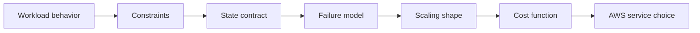
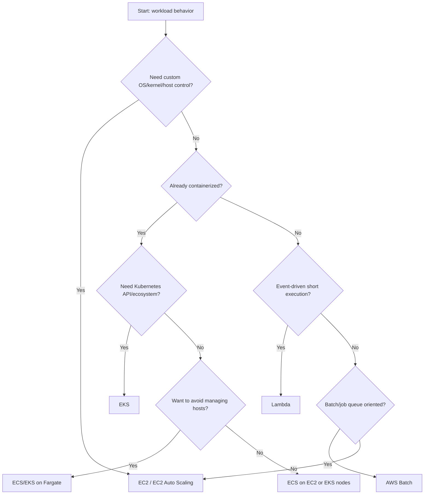
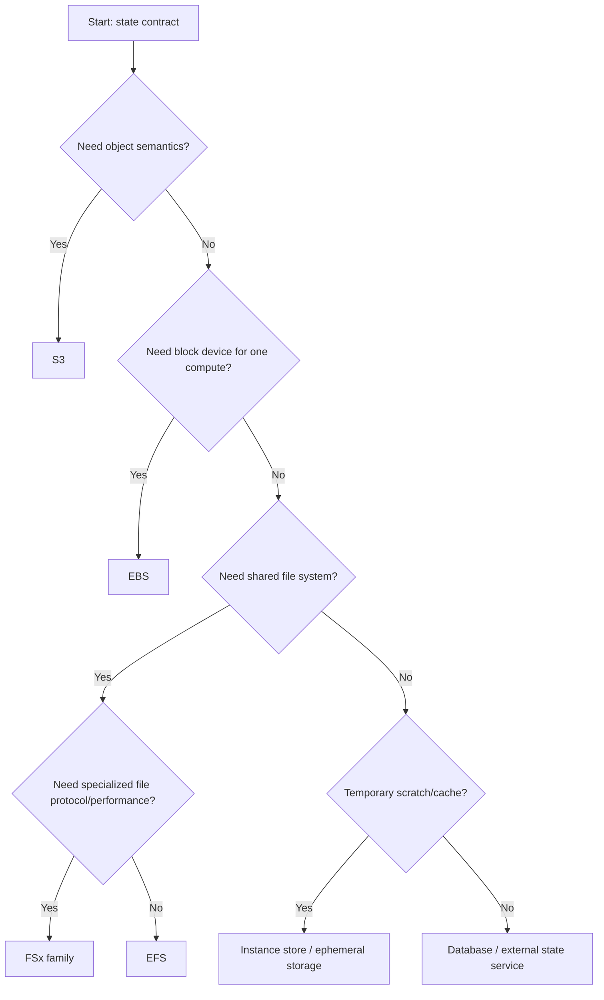
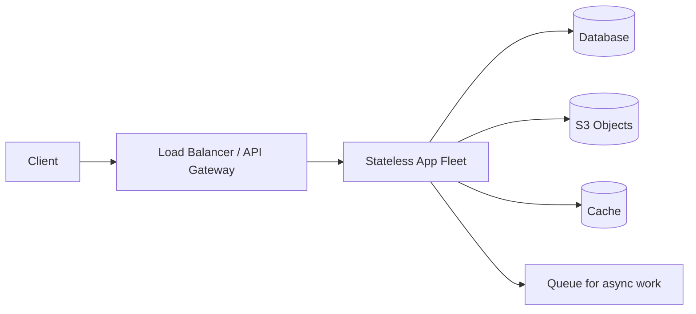
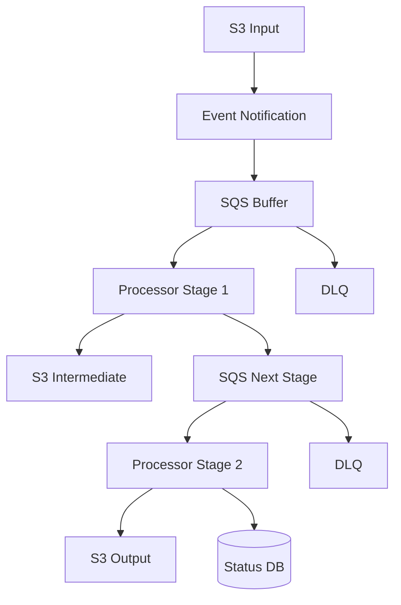
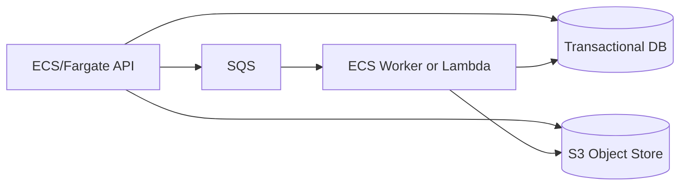
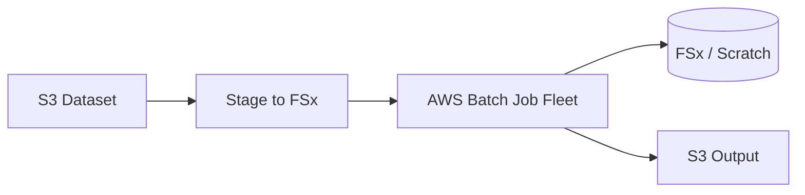
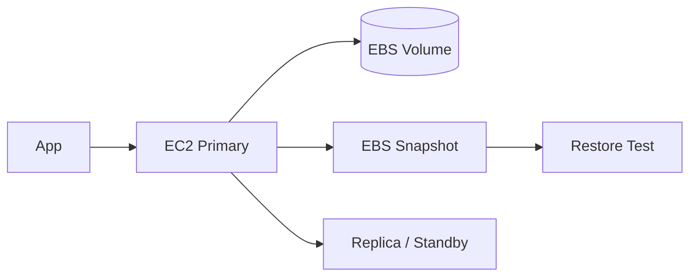
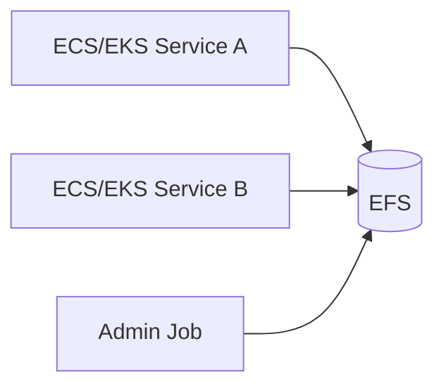
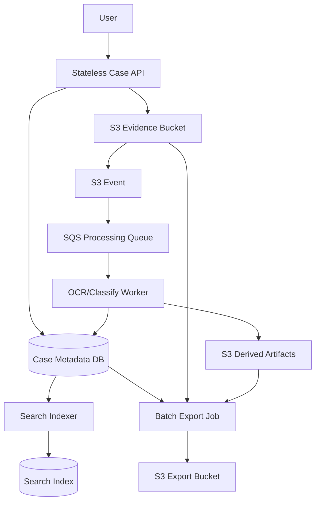

# Part 002 — Workload Taxonomy and Decision Map

Part 001 membangun mental model:

```txt
Workload = Execution Model + State Contract + Placement Constraint + Failure Recovery Path + Cost Function
```

Part ini membuatnya operasional. Kita akan menyusun taxonomy workload dan decision map agar pemilihan AWS compute-storage tidak bergantung pada selera, hype, atau “tim lain juga pakai itu”.

Target kita bukan membuat satu jawaban absolut. Targetnya membuat proses pengambilan keputusan yang repeatable.

---

## 1. Problem yang Diselesaikan

Dalam review arsitektur, pertanyaan seperti ini sering muncul:

- “Pakai Lambda atau ECS?”
- “Perlu EKS atau cukup ECS?”
- “EC2 masih relevan?”
- “Upload file simpan di EFS atau S3?”
- “Batch processing pakai Lambda, ECS worker, atau AWS Batch?”
- “Kubernetes stateful workload pakai EBS atau EFS?”
- “Kapan butuh FSx?”

Pertanyaan-pertanyaan ini kelihatannya spesifik, tetapi sebenarnya belum cukup informasi.

Contoh:

> “Pakai Lambda atau ECS?”

Jawaban bergantung pada:

- durasi eksekusi,
- dependency package,
- concurrency,
- cold start tolerance,
- event source,
- retry semantics,
- downstream capacity,
- observability requirement,
- local scratch requirement,
- VPC dependency,
- deployment model,
- cost under load.

Tanpa taxonomy, engineer cenderung memilih service berdasarkan familiarity, bukan workload fit.

---

## 2. Prinsip: Jangan Mulai dari Service Name

Mulai dari behavior workload.

Urutan berpikir yang benar:

```txt
Behavior -> Constraints -> State -> Failure -> Scaling -> Cost -> Service
```

Bukan:

```txt
Service -> Feature -> Workaround -> Incident -> Redesign
```

Diagram:



Service choice adalah output, bukan input.

---

## 3. Workload Taxonomy Overview

Kita akan klasifikasikan workload menjadi beberapa family:

| Family | Contoh | Compute umum | Storage umum |
|---|---|---|---|
| Stateless synchronous service | REST/GraphQL API, web app | ECS, EKS, EC2 ASG, Lambda | S3, database, cache |
| Async worker | queue consumer, email sender, webhook processor | ECS worker, Lambda, EC2 ASG | S3, queue, database, EBS scratch |
| Event-driven object pipeline | upload processing, media transform | Lambda, ECS, Batch | S3, `/tmp`, EFS/FSx optional |
| Scheduled/batch job | report, reconciliation, ETL | AWS Batch, ECS scheduled task, Lambda | S3, EBS, FSx, database |
| Stateful low-latency service | self-managed DB, broker, index | EC2, EKS StatefulSet | EBS, instance store, FSx |
| Shared file workload | CMS, legacy app, shared assets | EC2, ECS, EKS, Lambda | EFS, FSx |
| Data-heavy analytics/HPC | simulation, ML preprocessing | Batch, EC2 fleet, EKS | S3, FSx for Lustre, instance store |
| Edge/hybrid workload | on-prem bridge, local processing | Outposts, Snow, EC2, ECS Anywhere | Storage Gateway, DataSync, S3, FSx |
| Regulated retention workload | audit records, evidence, archive | Any compute | S3 Object Lock, Glacier classes, Backup |
| Ephemeral compute burst | CI/build, render, fanout jobs | Spot EC2, Batch, ECS | instance store, S3 |

Taxonomy ini bukan label final. Satu sistem biasanya gabungan beberapa family.

Contoh platform file upload:

- synchronous API,
- object storage,
- async worker,
- event-driven pipeline,
- regulated retention,
- batch reconciliation.

---

## 4. Classification Questions

Sebelum memilih service, jawab pertanyaan berikut.

### 4.1 Execution Behavior

- Apakah workload menerima request langsung dari user?
- Apakah workload dipicu event?
- Apakah workload batch dan bisa menunggu?
- Apakah proses harus long-running?
- Apakah workload butuh daemon background?
- Apakah butuh custom OS/kernel/runtime?
- Apakah bisa dikemas sebagai container?
- Apakah butuh GPU/accelerator/large memory?

### 4.2 Time and Latency

- Berapa p50/p95/p99 latency target?
- Apakah cold start bisa diterima?
- Apakah startup time penting?
- Apakah workload bisa queueing?
- Apakah job bisa retry nanti?
- Apakah user menunggu hasil?

### 4.3 State

- Apakah workload punya state lokal?
- Apakah state durable?
- Apakah state shared?
- Apakah state mutable?
- Apakah state append-only?
- Apakah state butuh transaction?
- Apakah state butuh POSIX/file semantics?
- Apakah state bisa direkonstruksi?

### 4.4 Scaling Shape

- Scaling berdasarkan request rate?
- Scaling berdasarkan queue depth?
- Scaling berdasarkan CPU/memory?
- Scaling berdasarkan schedule?
- Scaling berdasarkan data volume?
- Scaling berdasarkan job count?
- Scaling butuh cepat atau boleh lambat?

### 4.5 Failure Semantics

- Apakah retry aman?
- Apakah duplicate event berbahaya?
- Apakah partial output bisa terlihat user?
- Apakah job bisa checkpoint?
- Apakah compute bisa diganti?
- Apakah state bisa restore?
- Apakah ada RTO/RPO formal?

### 4.6 Operational Ownership

- Tim siap mengelola OS patching?
- Tim siap mengelola Kubernetes control plane complexity?
- Tim siap membuat runbook EBS attach/detach?
- Tim siap mengelola file permission/NFS behavior?
- Tim siap mengelola snapshot/restore drill?
- Tim punya observability untuk tail latency dan saturation?

---

## 5. Decision Map: Compute

### 5.1 Compute Decision Tree



Decision tree ini bukan hukum. Ini alat untuk memulai diskusi.

### 5.2 EC2 / ASG Fit

Gunakan EC2/ASG ketika:

- butuh kontrol tinggi atas host,
- workload long-running,
- butuh kernel/OS tuning,
- butuh EBS attachment langsung,
- butuh GPU/special instance family,
- workload steady dan cost bisa dioptimalkan dengan commitment,
- legacy app belum container/serverless-ready.

Hindari EC2/ASG sebagai default jika:

- tim tidak punya kapasitas patching/bootstrapping,
- workload sederhana event-driven,
- traffic sangat sporadis,
- state belum dipisahkan,
- recovery masih manual SSH.

### 5.3 ECS Fit

Gunakan ECS ketika:

- aplikasi containerized,
- tim ingin orchestration tanpa Kubernetes complexity,
- integrasi AWS native cukup,
- service/task model sesuai,
- deployment dan scaling per service dibutuhkan,
- Fargate atau EC2 capacity provider bisa dipilih sesuai cost/control.

ECS sangat cocok untuk banyak platform internal yang butuh container production tanpa harus mengadopsi Kubernetes sebagai platform organisasi.

### 5.4 EKS Fit

Gunakan EKS ketika:

- organisasi sudah punya Kubernetes skill/platform,
- butuh Kubernetes API sebagai abstraction layer,
- workload portability dan ecosystem penting,
- operator/controller/CRD penting,
- multi-team platform membutuhkan namespace/policy/scheduler extensibility,
- stateful workload di Kubernetes memang dikelola dengan matang.

Hindari EKS jika alasan utamanya hanya “lebih enterprise”. Kubernetes membawa operational surface yang besar.

### 5.5 Fargate Fit

Gunakan Fargate ketika:

- containerized workload tidak butuh host control,
- ingin mengurangi EC2 node operations,
- workload scale variabel,
- isolation per task/pod penting,
- startup overhead masih acceptable,
- storage requirement sederhana: ephemeral atau EFS.

Hindari Fargate jika:

- butuh privileged daemon,
- butuh host-level tuning,
- butuh local NVMe/instance store,
- workload steady besar dengan cost pressure kuat,
- dependency pada node-local agent kompleks.

### 5.6 Lambda Fit

Gunakan Lambda ketika:

- event-driven,
- durasi sesuai batas runtime,
- state eksternal,
- idempotency bisa dibuat,
- concurrency bisa dikontrol,
- cold start acceptable atau bisa dimitigasi,
- package/runtime cocok.

Hindari Lambda jika:

- proses harus daemon long-running,
- butuh koneksi/stateful session panjang,
- butuh local disk besar dan permanen,
- retry duplicate tidak bisa ditoleransi,
- dependency cold start terlalu mahal,
- observability/troubleshooting function-level tidak cukup untuk tim.

### 5.7 AWS Batch Fit

Gunakan AWS Batch ketika:

- workload job-oriented,
- job bisa antre,
- resource per job bervariasi,
- compute bisa scale mengikuti backlog,
- retry/checkpoint bisa diterapkan,
- workload ML/simulasi/render/ETL/reconciliation,
- Spot bisa menurunkan biaya dengan interruption-aware design.

Hindari Batch jika:

- user menunggu response interaktif,
- job tidak idempotent,
- output partial tidak dikontrol,
- startup time tidak acceptable,
- workload lebih cocok sebagai continuously running service.

---

## 6. Decision Map: Storage

### 6.1 Storage Decision Tree



### 6.2 S3 Fit

Gunakan S3 ketika:

- data berbentuk object,
- object bisa diidentifikasi dengan key,
- read/write via API acceptable,
- data durable dan scalable,
- workload upload/download/archive/data lake,
- event-driven processing diinginkan,
- lifecycle/retention penting.

Hindari S3 sebagai filesystem langsung jika aplikasi membutuhkan:

- frequent append-in-place,
- file locking,
- rename atomic sebagai commit,
- low-latency random write,
- metadata operation seperti local filesystem.

### 6.3 EBS Fit

Gunakan EBS ketika:

- aplikasi butuh block device,
- database/file system lokal durable,
- latency lebih rendah dan predictable dibanding object/file remote,
- single-writer pattern masuk akal,
- AZ-local placement bisa diterima,
- snapshot/restore strategy jelas.

Hindari EBS jika:

- banyak compute perlu read-write shared access sederhana,
- compute harus bebas pindah AZ tanpa state handling,
- data lebih cocok object/archive,
- tim tidak siap mengelola backup/restore/attach/detach.

### 6.4 Instance Store / Ephemeral Storage Fit

Gunakan ephemeral storage ketika:

- data bisa hilang,
- data bisa direkonstruksi,
- workload butuh scratch cepat,
- cache local meningkatkan performance,
- shuffle/temp processing dominan.

Jangan gunakan untuk source of truth.

### 6.5 EFS Fit

Gunakan EFS ketika:

- banyak compute butuh shared file access,
- NFS-like behavior cukup,
- workload cocok dengan shared file semantics,
- ingin integrasi dengan EC2/ECS/EKS/Lambda,
- data shared lebih penting daripada latency disk lokal.

Hindari EFS jika:

- workload metadata-heavy ekstrem,
- aplikasi sebenarnya lebih cocok object store,
- permission model tidak jelas,
- shared mutable state membuat coupling antar service.

### 6.6 FSx Fit

Gunakan FSx ketika:

- workload butuh file system tertentu,
- performance file system adalah core requirement,
- compatibility enterprise penting,
- HPC/ML butuh high-throughput shared file,
- Windows SMB/AD integration penting,
- ONTAP/OpenZFS feature set dibutuhkan.

FSx bukan “EFS yang lebih keren”. FSx adalah specialized file platform.

---

## 7. Workload Family Deep Dive

## 7.1 Stateless Synchronous Service

Contoh:

- REST API,
- GraphQL API,
- web backend,
- public/internal service,
- BFF/mobile backend.

### Behavior

- user menunggu response,
- latency penting,
- horizontal scaling umum,
- state utama seharusnya eksternal,
- deployment harus aman,
- rollback cepat penting.

### Compute Candidates

| Candidate | Fit |
|---|---|
| ECS/Fargate | default kuat untuk containerized API tanpa host ops |
| ECS on EC2 | cocok untuk cost/control lebih besar |
| EKS | cocok jika platform Kubernetes sudah matang |
| EC2 ASG | cocok untuk legacy/custom runtime |
| Lambda | cocok untuk API kecil/event-driven dengan latency/cold start acceptable |

### Storage Candidates

- S3 untuk upload/download object,
- database untuk transactional state,
- cache untuk hot ephemeral data,
- EFS hanya jika shared file semantics benar-benar dibutuhkan.

### Common Failure Modes

| Failure | Mitigation |
|---|---|
| Instance/task crash | health check + replacement |
| Bad deployment | canary/blue-green + rollback |
| DB connection storm | pool limit + backpressure |
| Upload file local | externalize to S3 |
| Scale-out overload dependency | autoscaling guardrail + rate limit |

### Recommended Baseline



Invariant:

> Stateless service boleh punya local cache, tetapi tidak boleh punya local source of truth.

---

## 7.2 Async Worker

Contoh:

- email sender,
- webhook delivery,
- notification processor,
- image processor,
- document parser,
- reconciliation worker.

### Behavior

- konsumsi queue/event,
- retry umum,
- duplicate event mungkin terjadi,
- latency user tidak langsung,
- throughput lebih penting daripada p99 request latency,
- backpressure bisa diterapkan.

### Compute Candidates

| Candidate | Fit |
|---|---|
| Lambda | cocok untuk event kecil dan durasi terbatas |
| ECS worker | cocok untuk worker long-running/containerized |
| EC2 ASG | cocok untuk custom daemon atau heavy runtime |
| AWS Batch | cocok untuk job besar/bervariasi |

### Storage Candidates

- S3 untuk input/output object,
- database untuk job status,
- ephemeral storage untuk scratch,
- EFS/FSx jika processing butuh shared files.

### Critical Design

Worker harus idempotent.

```txt
same input + same idempotency key -> same final state
```

### Failure Modes

| Failure | Impact | Mitigation |
|---|---|---|
| Worker crash | message retry | visibility timeout, idempotency |
| Poison message | retry loop | DLQ, max receive count |
| Partial output | inconsistent state | staged output + commit marker |
| Downstream slow | backlog grows | backpressure, circuit breaker, scale cap |
| Duplicate processing | double side effect | dedupe key, conditional write |

---

## 7.3 Event-Driven Object Pipeline

Contoh:

- file upload scan,
- media transcode,
- PDF extraction,
- OCR,
- thumbnail generation,
- antivirus scanning,
- document classification.

### Behavior

- input biasanya object,
- processing bisa async,
- output bisa object baru,
- pipeline bisa multi-stage,
- event duplication harus dianggap normal,
- failure per object harus diisolasi.

### Recommended Baseline



### Compute Choice

| Pattern | Better fit |
|---|---|
| Small/short transform | Lambda |
| Heavy binary dependency | ECS/Fargate or ECS on EC2 |
| Long job/resource variation | AWS Batch |
| High-throughput shared dataset | Batch/EC2 + FSx for Lustre |

### Storage Choice

| State | Storage |
|---|---|
| Input durable object | S3 |
| Intermediate object | S3 or scratch depending recomputability |
| Temporary working directory | `/tmp`, ephemeral storage, instance store |
| Shared model/data files | EFS or FSx |
| Processing status | Database |

---

## 7.4 Scheduled / Batch Job

Contoh:

- nightly report,
- billing reconciliation,
- compliance export,
- data compaction,
- scheduled ETL,
- archival lifecycle job.

### Behavior

- bisa dijadwalkan,
- user biasanya tidak menunggu langsung,
- retry bisa dilakukan,
- input/output besar,
- observability job-level penting,
- failure harus menghasilkan status jelas.

### Compute Choice

| Candidate | Fit |
|---|---|
| Lambda scheduled | kecil, singkat, dependency sederhana |
| ECS scheduled task | container job sedang |
| AWS Batch | banyak job, resource bervariasi, queue/scheduler penting |
| EC2 cron | legacy; gunakan hati-hati |

### Anti-pattern: Cron di Satu EC2

Masalah:

- instance mati = job tidak jalan,
- overlap tidak terkendali,
- retry manual,
- log tersebar,
- tidak ada job queue,
- scaling buruk.

Lebih baik gunakan scheduler yang eksplisit: EventBridge Scheduler + ECS/Lambda/Batch, atau orchestration layer yang tepat.

---

## 7.5 Stateful Low-Latency Service

Contoh:

- self-managed database,
- search index,
- message broker,
- cache cluster custom,
- ledger engine,
- specialized storage engine.

### Behavior

- state kuat,
- latency critical,
- recovery kompleks,
- data consistency penting,
- placement dan replication harus eksplisit,
- operational maturity tinggi.

### Compute Choice

Biasanya:

- EC2 untuk kontrol tinggi,
- EKS StatefulSet jika organisasi benar-benar matang dengan Kubernetes stateful operations,
- managed service lebih baik jika memenuhi kebutuhan.

### Storage Choice

- EBS untuk durable block storage,
- instance store untuk cache atau replicated ephemeral engine,
- FSx untuk specialized file storage,
- S3 untuk backup/snapshot/export.

### Mandatory Questions

- Apa consensus/replication protocol?
- Apa quorum behavior saat AZ failure?
- Apa write durability guarantee?
- Apa restore path?
- Apa split-brain prevention?
- Apa disk-full behavior?
- Apa snapshot consistency model?
- Apa upgrade/rollback path?

Stateful low-latency workload bukan tempat untuk “coba-coba managed later”. Desain failure-nya harus selesai sejak awal.

---

## 7.6 Shared File Workload

Contoh:

- CMS shared media,
- legacy enterprise app,
- shared config/content,
- user home directories,
- render farm shared assets,
- Windows file workload.

### Compute Choice

- EC2 untuk legacy app,
- ECS/EKS jika app sudah containerized,
- Lambda jika fungsi butuh shared read/write file ringan dengan EFS.

### Storage Choice

| Requirement | Service |
|---|---|
| Simple shared NFS-like file | EFS |
| Windows SMB / AD integration | FSx for Windows File Server |
| HPC high-throughput file | FSx for Lustre |
| Enterprise NAS feature | FSx for NetApp ONTAP |
| ZFS semantics | FSx for OpenZFS |

### Failure Modes

- mount failure,
- stale file handle,
- permission drift,
- metadata bottleneck,
- noisy writer,
- accidental shared-state coupling.

### Design Rule

> Shared file storage should be a deliberate compatibility/performance choice, not a shortcut to avoid designing ownership.

---

## 7.7 Data-Heavy Analytics / HPC / ML Workload

Contoh:

- simulation,
- genome processing,
- video rendering,
- ML training preprocessing,
- large-scale ETL,
- parallel file processing.

### Behavior

- throughput matters,
- parallelism high,
- scratch space large,
- data staging important,
- cost dominated by compute fleet + data movement,
- checkpointing important.

### Compute Choice

- AWS Batch for job scheduling,
- EC2 fleet for custom control,
- EKS for Kubernetes-native ML/HPC platform,
- Spot for cost if interruption-aware.

### Storage Choice

- S3 for durable dataset/artifacts,
- FSx for Lustre for high-throughput shared file access,
- instance store for scratch,
- EBS for node-local block needs.

### Design Focus

- data locality,
- parallel read pattern,
- checkpoint frequency,
- recomputation cost,
- spot interruption recovery,
- small file problem,
- staging in/out cost.

---

## 7.8 Regulated Retention / Evidence Workload

Contoh:

- audit evidence,
- enforcement case document,
- legal hold,
- financial record,
- compliance archive,
- tamper-resistant logs.

### Behavior

- correctness > convenience,
- immutability may be required,
- deletion policy must be controlled,
- retention must be provable,
- access audit matters,
- restore and discovery matter.

### Storage Choice

- S3 with versioning and Object Lock for WORM-style retention when required,
- Glacier storage classes for archive patterns,
- AWS Backup for backup policy across supported resources,
- KMS key governance as part of data lifecycle.

### Compute Choice

Compute is less important than state governance. Any compute that writes regulated data must respect:

- idempotent write,
- audit trail,
- retention policy,
- deletion boundary,
- access control,
- metadata integrity.

### Important Warning

Regulated storage is not solved by “turn on encryption”. You need lifecycle, retention, auditability, recovery, and operational controls.

---

## 8. Matrix: Workload to AWS Choices

| Workload | Primary compute | Primary storage | Watch out |
|---|---|---|---|
| Public stateless API | ECS/Fargate, EKS, EC2 ASG, Lambda | DB + S3 | local file state, DB connection storm |
| Internal admin app | ECS/Fargate or EC2 ASG | DB + S3/EFS if needed | overengineering with EKS |
| Queue worker | Lambda/ECS/Batch | S3 + DB + queue | duplicate processing |
| File upload pipeline | Lambda/ECS/Batch | S3 | event duplication, partial output |
| Nightly report | ECS task/Batch/Lambda | S3 + DB | cron-on-one-instance |
| Self-managed DB | EC2/EKS StatefulSet | EBS + snapshots | HA/restore complexity |
| Legacy app requiring shared files | EC2/ECS | EFS/FSx | permission and metadata bottleneck |
| HPC simulation | Batch/EC2/EKS | FSx Lustre + S3 | staging cost, scratch lifecycle |
| ML preprocessing | Batch/EKS/EC2 | S3 + FSx/instance store | small files, checkpoint |
| Compliance archive | Any | S3 Object Lock/Glacier | retention misconfiguration |
| CI/build burst | EC2 Spot/ECS/Batch | instance store + S3 cache | interruption and cache poisoning |

---

## 9. Cost-Aware Decision Patterns

### 9.1 Idle vs Steady

If workload is idle most of the day:

- Lambda can be efficient,
- Fargate scheduled tasks can be efficient,
- Batch can scale to zero depending configuration,
- always-on EC2 may waste money.

If workload is steady and large:

- EC2 with Savings Plans/Reserved strategy may be cheaper,
- ECS/EKS on EC2 may beat per-task Fargate cost,
- storage throughput/IOPS cost must be modeled.

### 9.2 Request-Cost vs Capacity-Cost

S3/Lambda-style systems often shift cost to request/concurrency. EC2/EBS-style systems often shift cost to provisioned capacity.

Ask:

- Are there many tiny operations?
- Is request amplification hidden?
- Are lifecycle transitions too aggressive?
- Are data retrieval fees relevant?
- Is provisioned capacity idle?

### 9.3 Data Movement Cost

Data movement can dominate.

Watch:

- cross-AZ traffic,
- cross-Region replication,
- NAT gateway path,
- repeated S3 read of same large dataset,
- no cache for hot objects,
- staging data repeatedly for batch jobs.

### 9.4 Overprovisioned Performance

Common mistakes:

- buying high IOPS without measuring queue depth,
- using large instances for memory leak,
- using FSx when S3 layout would be enough,
- using EKS because of platform ambition, not workload need,
- using Lambda for high steady compute without cost comparison.

---

## 10. Failure-Aware Decision Patterns

### 10.1 If Retry Can Happen, Duplicate Can Happen

Any event/queue/serverless system must assume:

- duplicate event,
- out-of-order event,
- delayed event,
- partial failure,
- visibility timeout expiration,
- downstream success but caller timeout.

Design:

- idempotency key,
- dedupe table,
- conditional write,
- output commit marker,
- DLQ.

### 10.2 If Compute Can Move, Storage Placement Matters

Common example:

- EKS pod with EBS PVC cannot freely move across AZ.
- EC2 replacement must be in same AZ to attach same EBS volume.
- EFS/FSx access path depends on networking/mount targets.

Design scheduler and topology explicitly.

### 10.3 If Data Can Be Deleted, Recovery Must Be Tested

Protection features are not enough.

You need:

- versioning/snapshot/backup,
- restore procedure,
- integrity validation,
- access to encryption keys,
- clear RTO/RPO,
- game day.

---

## 11. Architecture Decision Record Template

Gunakan template ini untuk setiap keputusan compute-storage besar.

```mdx
# ADR: <Decision title>

## Context

What workload are we supporting?

## Workload Classification

- Family:
- Execution behavior:
- State contract:
- Latency requirement:
- Scaling shape:
- Failure semantics:

## Options Considered

1. Option A
2. Option B
3. Option C

## Decision

We choose <service/pattern> because...

## Consequences

### Positive

- ...

### Negative / Trade-offs

- ...

## Failure Modes

- ...

## Operational Requirements

- Metrics:
- Alarms:
- Runbooks:
- Backup/restore:
- Load test:
- Game day:

## Revisit Trigger

We revisit this decision when...
```

ADR yang baik tidak hanya berkata “kami memilih ECS”. ADR yang baik menjelaskan mengapa ECS lebih cocok daripada Lambda/EKS/EC2 untuk workload tertentu.

---

## 12. Example ADR — File Upload Processing

```mdx
# ADR: File Upload Processing Compute and Storage

## Context

Users upload documents that must be scanned, transformed, and made available for later download. User request should not wait for full processing.

## Workload Classification

- Family: event-driven object pipeline + async worker
- Execution behavior: upload request + async processing
- State contract: original object durable, derived object durable, processing status transactional
- Latency requirement: upload response fast; processing eventually complete
- Scaling shape: based on upload volume and queue depth
- Failure semantics: duplicate processing possible; retry required

## Options Considered

1. Store uploads on app server disk and process locally
2. Store uploads in EFS and process by shared worker fleet
3. Store uploads in S3 and process via SQS-backed worker

## Decision

Use S3 for original and derived objects, SQS as buffer, and ECS/Lambda worker depending on processing profile.

## Consequences

### Positive

- API fleet remains stateless
- Upload data durable outside compute lifecycle
- Workers can scale independently
- Retry and DLQ can be modeled explicitly

### Negative / Trade-offs

- Processing must be idempotent
- S3 object keys become application contract
- Event delivery and duplicate processing must be handled
- Status tracking requires database state

## Failure Modes

- Duplicate event -> idempotency key
- Worker timeout -> message retry
- Poison file -> DLQ
- Partial output -> write to staging key then commit metadata

## Operational Requirements

- Queue depth alarm
- DLQ alarm
- Processing age metric
- S3 lifecycle for intermediate files
- Restore/versioning policy for original objects

## Revisit Trigger

Revisit if processing jobs exceed Lambda limits, binary dependency grows too large, or queue backlog requires specialized batch scheduling.
```

---

## 13. Bad Decision Smells

### 13.1 “We Chose X Because It Is Serverless”

Serverless is an operational model, not an architecture justification.

Ask:

- Does it fit latency?
- Does it fit retry semantics?
- Does it fit cost at load?
- Does it fit observability?
- Does it fit state boundary?

### 13.2 “We Chose EKS for Future Flexibility”

Flexibility has cost.

Ask:

- Who operates the cluster?
- Who owns upgrades?
- Who debugs CSI/storage scheduling?
- Who defines platform guardrails?
- Is Kubernetes API actually needed?

### 13.3 “We Store Files on Disk Temporarily”

Temporary often becomes permanent.

Ask:

- What deletes it?
- What if compute dies?
- What if disk fills?
- What if another compute needs it?
- Is it source of truth?

### 13.4 “Backup Is Enabled”

Backup enabled is not recovery.

Ask:

- Restore tested when?
- Restore to where?
- Restore by whom?
- RTO achieved?
- KMS permissions valid?
- Application validated?

### 13.5 “Auto Scaling Will Handle It”

Auto Scaling adds compute. It does not automatically scale dependencies.

Ask:

- Can database handle connections?
- Can EBS handle I/O?
- Can EFS handle metadata load?
- Can downstream service handle request rate?
- Are quotas high enough?

---

## 14. Decision Map by Constraint

### 14.1 Need Lowest Operational Burden

Prefer:

- Lambda for suitable event/function workloads,
- Fargate for suitable container workloads,
- managed storage like S3/EFS/FSx rather than self-managed file servers.

Avoid:

- EC2 pets,
- self-managed cluster without operational owner,
- EKS if team lacks Kubernetes maturity.

### 14.2 Need Maximum Control

Prefer:

- EC2,
- ECS/EKS on EC2,
- EBS/instance store/FSx depending storage needs.

Accept:

- patching,
- AMI lifecycle,
- host tuning,
- capacity planning,
- detailed runbooks.

### 14.3 Need Fast Burst Scaling

Prefer:

- Lambda for function/event workloads,
- Fargate for container burst where startup acceptable,
- pre-warmed EC2/ASG warm pools for VM workloads,
- queue-based smoothing.

Watch:

- quota,
- cold start,
- image pull time,
- downstream pressure.

### 14.4 Need Long-Running Stable Compute

Prefer:

- EC2 ASG,
- ECS on EC2,
- EKS node groups,
- Fargate only after cost comparison.

Watch:

- patching,
- deployment strategy,
- node draining,
- overprovisioning.

### 14.5 Need Strong Shared File Compatibility

Prefer:

- EFS for general NFS-like shared access,
- FSx for protocol/performance-specific workload.

Watch:

- metadata bottleneck,
- permissions,
- mount target/network dependency,
- accidental coupling.

### 14.6 Need Durable Object Archive

Prefer:

- S3,
- lifecycle policy,
- versioning,
- Object Lock if WORM/retention required,
- Glacier classes for archival access patterns.

Watch:

- retrieval pattern,
- lifecycle transition cost,
- deletion/retention governance,
- metadata/indexing.

---

## 15. Combining Compute and Storage Choices

The best architecture is usually a composition.

### 15.1 API + Async Processing



Good for:

- uploads,
- document processing,
- notification systems,
- async workflows.

### 15.2 Batch + S3 + FSx



Good for:

- HPC,
- ML preprocessing,
- high-throughput file processing.

### 15.3 Stateful EC2 + EBS + Snapshot



Good only when:

- self-managed state is justified,
- HA/backup/restore are owned,
- failover is designed.

### 15.4 Container + Shared File



Good when:

- shared file semantics are required.

Dangerous when:

- EFS becomes hidden database,
- ownership is unclear,
- writes are uncontrolled.

---

## 16. Review Checklist for Architecture Design

Use this checklist in design review.

### 16.1 Workload Fit

- [ ] Workload family identified.
- [ ] Compute choice follows behavior, not preference.
- [ ] Storage choice follows state contract, not habit.
- [ ] Latency and throughput requirements stated.
- [ ] Scaling signal stated.
- [ ] Failure semantics stated.

### 16.2 State and Data

- [ ] Source of truth identified.
- [ ] Cache/scratch separated from durable state.
- [ ] Ownership and lifecycle defined.
- [ ] Backup/restore path defined.
- [ ] Retention and deletion behavior defined.
- [ ] Encryption/KMS dependency understood.

### 16.3 Placement

- [ ] AZ constraints documented.
- [ ] Cross-AZ traffic considered.
- [ ] Mount target/endpoint dependency considered.
- [ ] Scheduler topology considered.
- [ ] Regional/multi-Region requirement clarified.

### 16.4 Scaling

- [ ] Scaling metric chosen.
- [ ] Dependency capacity checked.
- [ ] Quotas checked.
- [ ] Backpressure mechanism designed.
- [ ] Scale-in termination/drain behavior defined.

### 16.5 Operations

- [ ] Metrics and alarms defined.
- [ ] Runbooks written.
- [ ] Load test plan exists.
- [ ] Failure test plan exists.
- [ ] Restore drill exists.
- [ ] Cost dashboard or allocation tags defined.

---

## 17. Mini Case Study — Choosing for a Regulatory Case Document Platform

Workload:

- users upload evidence documents,
- documents must be immutable after certain lifecycle stage,
- OCR/classification happens async,
- case metadata is transactional,
- search index is derived,
- audit trail must be preserved,
- some workflows require export packages.

### 17.1 Classification

| Dimension | Classification |
|---|---|
| API | stateless synchronous service |
| Upload storage | durable object storage |
| Processing | async object pipeline |
| OCR/classification | worker/batch depending size |
| Metadata | transactional database |
| Search | derived index |
| Audit/evidence | regulated retention workload |
| Export | scheduled/batch job |

### 17.2 Compute Choice

Potential design:

- API: ECS/Fargate or EKS depending platform maturity.
- Upload processing: Lambda for small OCR triggers, ECS/Batch for heavy jobs.
- Export packaging: AWS Batch or ECS scheduled task.
- Search indexing worker: ECS worker or Lambda depending payload and throughput.

### 17.3 Storage Choice

Potential design:

- Original evidence: S3 with versioning and retention policy.
- Derived OCR text: S3 or database depending query pattern.
- Metadata: database.
- Export bundle: S3 with lifecycle.
- Temporary packaging: ephemeral storage or EBS/FSx depending size.
- Audit logs: append-only durable store, possibly S3 with retention controls depending compliance requirement.

### 17.4 Failure Considerations

- Duplicate upload event must not duplicate case record.
- OCR retry must not overwrite approved result incorrectly.
- Evidence object deletion must be governed.
- Export job failure must leave clear status.
- Search index rebuild must be possible from source of truth.
- Retention policy must align with legal lifecycle.

### 17.5 Diagram



This is the kind of design where compute-storage decisions directly affect regulatory defensibility.

---

## 18. What “Top 1%” Looks Like Here

Top-level engineer behavior is not memorizing all AWS services. It is the ability to reason from constraints.

A strong engineer says:

> This is an async object pipeline. The source object must be durable. Processing can retry. Duplicate events are expected. The API should be stateless. We should use S3 for object ownership, SQS for backpressure, Lambda for short transforms or ECS/Batch for heavy transforms, and DB status updates with idempotency keys. EFS is unnecessary unless a library requires shared file semantics. EBS is unnecessary unless we need block-local processing or self-managed state.

A weaker engineer says:

> Let’s use Lambda because it is serverless.

Or:

> Let’s use EKS because it is scalable.

The difference is not tool knowledge. The difference is causal reasoning.

---

## 19. Summary

Workload taxonomy gives structure to AWS compute-storage decisions.

Core rules:

- classify workload before choosing service,
- separate execution behavior from state contract,
- treat storage as ownership/lifecycle, not disk,
- choose compute based on runtime, scaling, and operational ownership,
- choose storage based on semantics, durability, access pattern, and placement,
- model retry, duplicate, failure, and restore from the beginning,
- write ADRs that explain trade-offs, not just final choices.

Part 003 will go deeper into placement, time, state, and failure domains: Region, AZ, zonal storage, regional services, locality, blast radius, and recovery paths.

---

## Official References

- AWS Compute Decision Guide — Choosing an AWS compute service for your workload: https://docs.aws.amazon.com/compute-on-aws-how-to-choose/
- AWS Storage Decision Guide — Choosing an AWS storage service: https://docs.aws.amazon.com/decision-guides/latest/storage-on-aws-how-to-choose/choosing-aws-storage-service.html
- Amazon EC2 Documentation: https://docs.aws.amazon.com/ec2/
- Amazon EC2 Instance Types: https://docs.aws.amazon.com/ec2/latest/instancetypes/instance-types.html
- AWS Batch User Guide — What is AWS Batch: https://docs.aws.amazon.com/batch/latest/userguide/what-is-batch.html
- Amazon EKS User Guide — Use application data storage for your cluster: https://docs.aws.amazon.com/eks/latest/userguide/storage.html
- AWS Well-Architected Framework: https://docs.aws.amazon.com/wellarchitected/latest/framework/welcome.html
