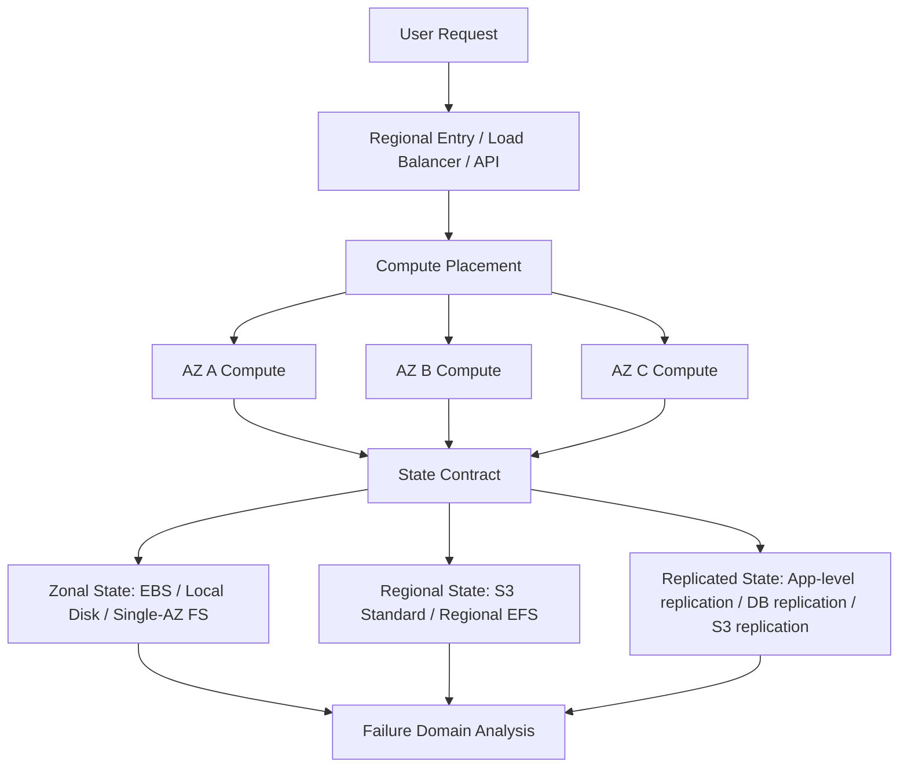
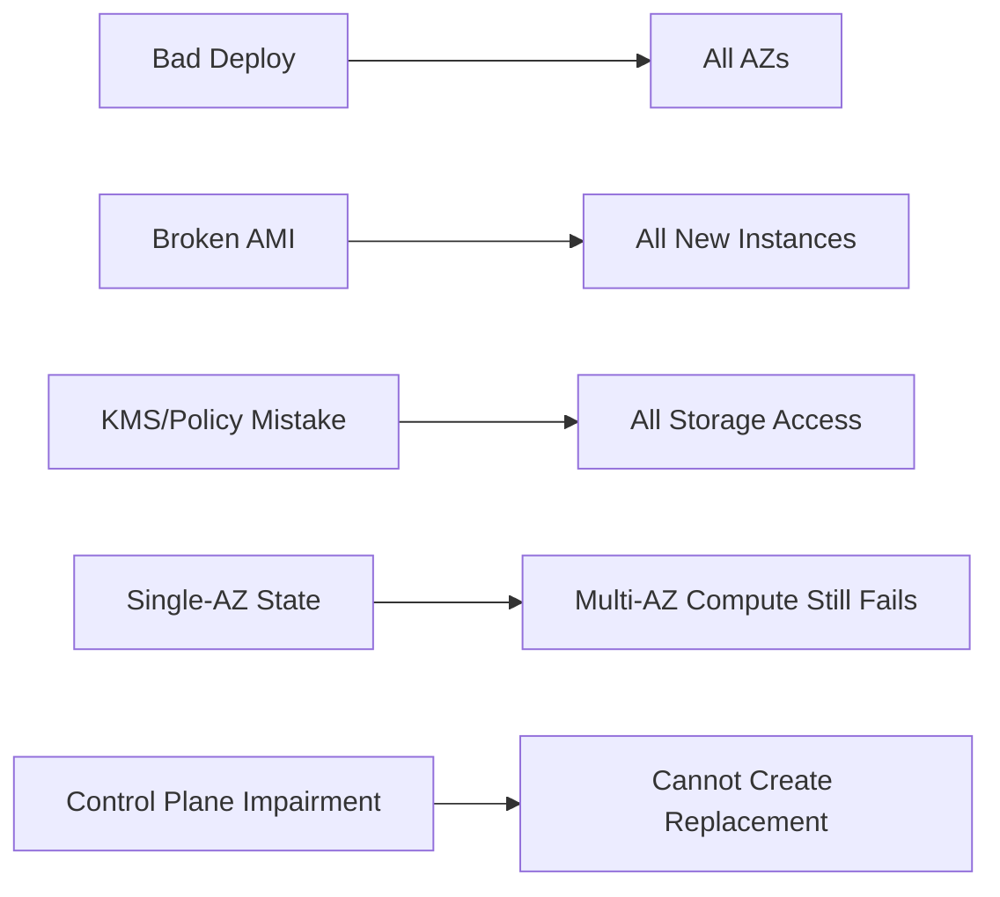
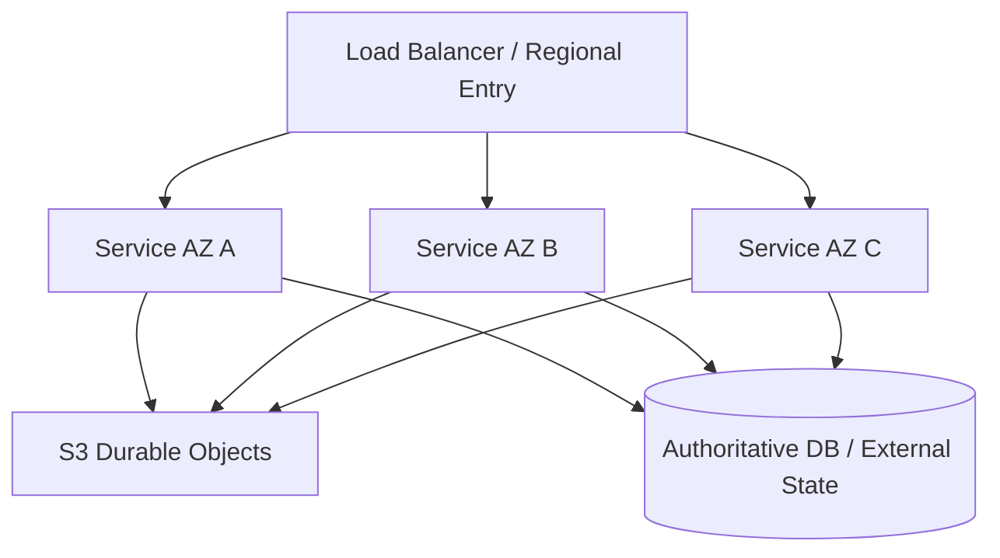
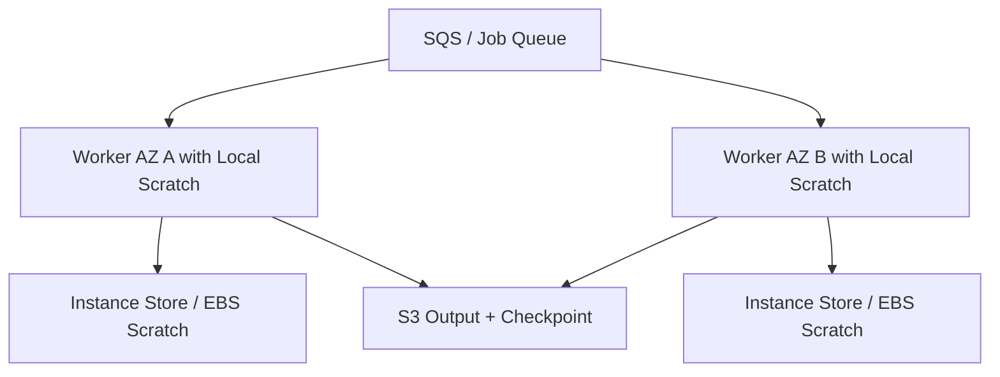
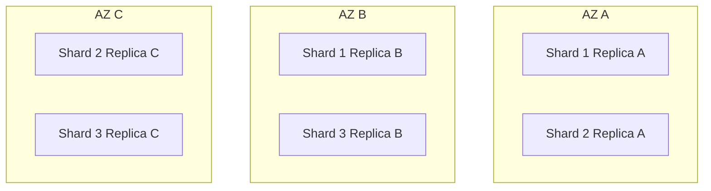
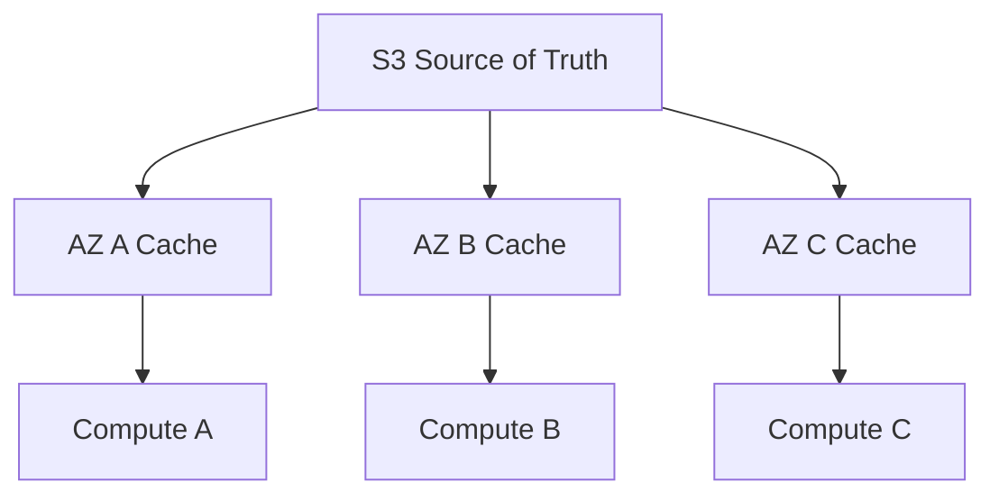
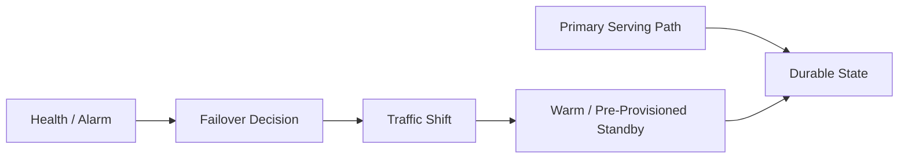
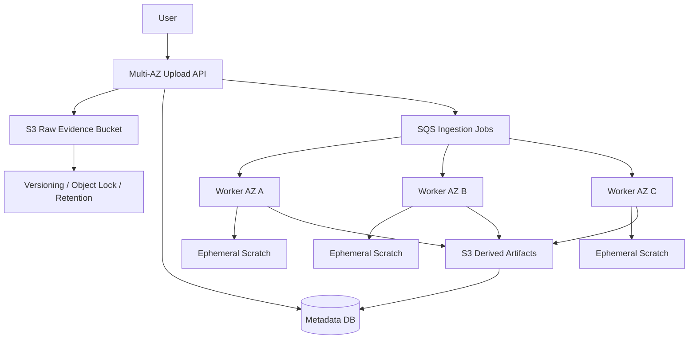

## 1. Problem yang Diselesaikan

Banyak engineer belajar AWS sebagai daftar service:

- EC2 untuk server.
- EBS untuk disk.
- S3 untuk object.
- EFS untuk shared file.
- Lambda untuk function.
- ECS/EKS untuk container.

Itu cukup untuk membuat sistem berjalan, tetapi belum cukup untuk membuat sistem **tahan rusak**.

Di production, pertanyaan yang menentukan bukan hanya:

> Service apa yang dipakai?

Pertanyaan yang lebih tajam adalah:

> Di mana compute berjalan, di mana state berada, kapan state berubah, dan failure domain apa yang bisa menjatuhkan keduanya secara bersamaan?

Part ini membangun mental model untuk membaca arsitektur AWS sebagai gabungan dari empat dimensi:

1. **Placement**: lokasi fisik/logis resource.
2. **Time**: waktu startup, drain, replication, timeout, recovery, dan propagation.
3. **State**: data yang boleh hilang, bisa dibuat ulang, atau wajib bertahan.
4. **Failure domain**: batas kerusakan yang tidak boleh ikut menjatuhkan seluruh workload.

Kalau empat dimensi ini tidak eksplisit, sistem biasanya terlihat sederhana di diagram, tetapi rapuh saat ada AZ impairment, instance replacement, storage latency spike, queue backlog, atau control plane degradation.

---

## 2. Mental Model: Cloud Resource Bukan Abstraksi Tanpa Lokasi

Cloud membuat server terasa seperti API object. Itu benar di control plane, tetapi tidak benar di data plane.

EC2 instance tetap berjalan di host fisik. EBS volume tetap berada dalam Availability Zone. EFS mount target tetap berada di subnet/AZ tertentu. S3 Standard memang Regional, tetapi storage class tertentu seperti S3 One Zone-IA atau S3 Express One Zone memiliki sifat zonal. Placement group memengaruhi kedekatan hardware dan blast radius. Lambda/ECS/EKS menyembunyikan sebagian placement, tetapi workload tetap berjalan di capacity yang berada di Region/AZ tertentu.

Mental model yang lebih aman:



Resource cloud harus dibaca sebagai:

```txt
resource = service + scope + lifecycle + state coupling + recovery path
```

Contoh:

```txt
EC2 instance = compute + AZ-scoped placement + replaceable lifecycle + optional local state + ASG/AMI recovery
EBS volume   = block storage + AZ-scoped placement + detachable lifecycle + durable zonal state + snapshot/restore recovery
S3 object    = object storage + bucket/storage-class scope + object lifecycle + durable object state + versioning/replication recovery
EFS mount    = shared file access + mount target placement + NFS lifecycle + shared file state + remount/failover behavior
```

---

## 3. Core Concepts

### 3.1 Region

Region adalah batas geografis besar. Region dipakai untuk:

- latency ke user atau sistem eksternal,
- data residency,
- service availability,
- disaster recovery,
- regulatory boundary,
- operational isolation.

Region bukan sekadar dropdown. Begitu workload memilih Region, banyak keputusan lain ikut terkunci:

- quota per Region,
- AMI per Region,
- snapshot copy antar Region,
- S3 bucket Region,
- KMS key Region,
- ECR image replication,
- service availability,
- cost model,
- latency ke dependency.

Anti-pattern:

```txt
Kita deploy di satu Region dulu. Nanti kalau butuh DR, tinggal replicate.
```

Masalahnya: DR bukan tombol. DR adalah desain sejak awal tentang data ownership, replication lag, DNS failover, operational authority, runbook, quota, secrets, image availability, dan consistency model.

### 3.2 Availability Zone

Availability Zone adalah batas isolasi fault di dalam Region. Untuk workload production, AZ harus diperlakukan sebagai unit kegagalan yang bisa hilang, lambat, atau terganggu sebagian.

Yang sering salah:

- Menganggap multi-subnet berarti multi-AZ tanpa mengecek resource placement.
- Menjalankan compute di banyak AZ tetapi storage authoritative hanya ada di satu AZ.
- Membuat ASG multi-AZ tetapi database/file system/cache hanya sehat di satu AZ.
- Mengandalkan control plane untuk recovery saat incident, padahal control plane bisa ikut terhambat.

Model yang lebih benar:

```txt
Production workload is healthy only if it can continue serving when one placement unit is impaired.
```

Artinya bukan semua workload harus multi-Region. Banyak workload cukup multi-AZ. Tetapi single-AZ production harus dianggap sebagai keputusan sadar, bukan default tidak sengaja.

### 3.3 Zonal, Regional, Global, and Partitional Service Scope

Service AWS tidak semuanya memiliki scope yang sama.

| Scope | Contoh mental model | Risiko utama | Desain aman |
|---|---|---|---|
| Zonal | EC2 instance, EBS volume, subnet, zonal mount target | AZ impairment, capacity shortage, zonal dependency | Spread across AZ, make state movable/replicated |
| Regional | S3 Standard bucket, regional EFS, regional API endpoint | Regional outage, regional quota, regional dependency | Backup/replication, failover runbook, reduce control plane dependency |
| Global / partitional | IAM-style global/partitioned dependency, DNS/global services | Hidden dependency, policy propagation, control plane impairment | Static stability, pre-provisioned access, avoid emergency changes |

Hal penting: **scope service tidak sama dengan scope data plane yang Anda pakai**.

Contoh:

- S3 bucket Standard bersifat Regional, tetapi object lifecycle, versioning, replication, dan access pattern tetap harus didesain.
- EBS service tersedia secara Regional, tetapi volume EBS yang Anda attach adalah AZ-scoped.
- EFS Regional menyimpan data lintas AZ, tetapi access path tetap melalui mount target di AZ/subnet.
- EC2 Auto Scaling adalah control plane Regional, tetapi instance yang berjalan tetap ada di AZ tertentu.

### 3.4 Control Plane vs Data Plane

Control plane adalah tempat Anda membuat, mengubah, menghapus, atau mengkonfigurasi resource.

Data plane adalah jalur yang menjalankan fungsi utama resource.

Contoh:

| Service | Control plane action | Data plane action |
|---|---|---|
| EC2 | Launch instance, terminate instance, modify attribute | Instance menjalankan proses, menerima traffic |
| EBS | Create volume, attach volume, snapshot volume | Read/write block device |
| S3 | Create bucket, configure lifecycle, configure replication | PUT/GET object |
| Auto Scaling | Update desired capacity, scaling policy | Instance yang sudah berjalan melayani traffic |
| EFS | Create file system, create mount target | Read/write via NFS mount |

Prinsip production:

```txt
A reliable system should keep serving with already-provisioned resources during many control plane impairments.
```

Ini disebut static stability dalam banyak diskusi reliability: sistem tetap stabil tanpa harus membuat resource baru ketika kondisi buruk terjadi.

Contoh desain static stability:

- ASG sudah punya capacity minimum cukup di beberapa AZ, bukan baru scale out saat semua sudah merah.
- S3 bucket, lifecycle, replication, KMS key, IAM role, endpoint, dan policy sudah disiapkan sebelum incident.
- Failover target sudah ada, bukan baru dibuat saat Region/AZ bermasalah.
- Lambda reserved concurrency sudah diset untuk workload kritikal, bukan berebut account-level concurrency saat traffic spike.
- EFS mount targets sudah ada di setiap AZ yang dipakai compute.

---

## 4. Placement as a Design Constraint

### 4.1 Compute Placement

Compute placement menentukan:

- latency ke user dan dependency,
- latency ke storage,
- blast radius,
- capacity availability,
- failure correlation,
- deployment strategy,
- recovery time.

Untuk EC2/ECS/EKS:

```txt
compute placement = Region + AZ + subnet + instance type availability + capacity class + scheduler decision
```

Untuk Lambda/Fargate, Anda tidak selalu memilih host, tetapi tetap memilih VPC/subnet/AZ exposure ketika fungsi/task berada di VPC.

Checklist compute placement:

- Apakah workload benar-benar aktif di minimal dua AZ?
- Apakah setiap AZ punya cukup capacity untuk menerima failover?
- Apakah dependency storage tersedia dari setiap AZ?
- Apakah subnet route table/NAT/endpoint membuat satu AZ bergantung pada AZ lain?
- Apakah instance type yang dipilih tersedia dan cukup di semua AZ target?
- Apakah Spot capacity diversified atau terlalu terkunci ke satu pool?
- Apakah scheduler bisa menempatkan workload ke node yang salah karena constraint tidak lengkap?

### 4.2 Storage Placement

Storage placement menentukan:

- apakah data bisa diakses ketika compute pindah AZ,
- apakah recovery butuh copy/snapshot/restore,
- apakah latency konsisten,
- apakah biaya cross-AZ muncul,
- apakah data loss domain sesuai business requirement.

Contoh:

| Storage | Placement implication |
|---|---|
| EBS | Volume harus attach ke instance di AZ yang sama. Recovery lintas AZ biasanya butuh snapshot/restore atau replikasi aplikasi. |
| Instance store | Data hilang saat instance berhenti/terminasi/failure. Cocok untuk cache/scratch, bukan authoritative state. |
| S3 Standard | Regional object storage. Cocok untuk durable object state, artifact, event-driven data, backup, data lake. |
| S3 One Zone variants | Lebih dekat/lebih murah/lebih cepat untuk use case tertentu, tetapi failure domain lebih sempit. |
| EFS Regional | Shared file system regional dengan mount target per AZ. Cocok untuk shared file semantics, bukan semua workload latency-sensitive. |
| EFS One Zone | Lebih murah/terlokalisasi, tetapi failure domain satu AZ. |
| FSx | Deployment model tergantung family dan pilihan Single-AZ/Multi-AZ atau integration pattern. Harus dibaca per service. |

### 4.3 Placement Groups

Placement group bukan fitur default untuk semua workload. Placement group adalah cara memengaruhi placement EC2 ketika kebutuhan performance atau failure isolation lebih spesifik.

| Strategy | Cocok untuk | Risiko / trade-off |
|---|---|---|
| Cluster | low-latency/high-throughput antar instance, HPC, tightly coupled workload | failure correlation lebih tinggi, capacity constraint lebih ketat |
| Spread | critical instances yang harus di hardware berbeda | jumlah instance terbatas per AZ/group, tidak cocok untuk fleet besar sembarang |
| Partition | distributed system seperti Kafka/Cassandra/HDFS dengan shard/replica awareness | app harus sadar partition; salah mapping bisa tetap correlated failure |

Heuristic:

```txt
Use placement groups only when the workload has a concrete placement requirement.
Do not use them as magical performance flag.
```

---

## 5. Time as an Architecture Dimension

Arsitektur sering digambar statis. Production berjalan dalam waktu.

Yang penting bukan hanya “resource ada”, tetapi:

- berapa lama resource siap,
- berapa lama resource sehat setelah traffic masuk,
- berapa lama shutdown yang aman,
- berapa lama replication tertinggal,
- berapa lama DNS/cache/config berubah,
- berapa lama snapshot restore usable,
- berapa lama queue bisa menahan backlog,
- berapa lama downstream bisa overload sebelum rusak.

### 5.1 Startup Time

Startup time mencakup:

```txt
instance launch
+ AMI boot
+ cloud-init/userdata
+ package/config fetch
+ app startup
+ dependency warmup
+ health check grace
+ load balancer registration
+ cache warmup
```

Kalau startup butuh 8 menit tetapi scaling policy mengevaluasi tiap 1 menit, scaling loop akan overshoot. Sistem akan terus menambah instance yang belum siap, lalu ketika semua siap sekaligus, kapasitas berlebih dan cost naik.

### 5.2 Drain Time

Drain time mencakup:

```txt
stop accepting new work
+ finish in-flight request/job
+ checkpoint progress
+ flush buffer/log
+ release lease/lock
+ deregister from load balancer
+ detach/close storage safely
```

Untuk stateless HTTP service, drain mungkin 30-120 detik. Untuk worker batch, drain bisa menit atau jam. Untuk Spot workload, drain harus cocok dengan interruption notice. Untuk Lambda/SQS, drain diterjemahkan ke batch visibility timeout, retry, dan DLQ behavior.

### 5.3 Recovery Time

Recovery time bukan satu angka. Pecah menjadi:

| Recovery component | Contoh |
|---|---|
| Detection time | CloudWatch alarm, health check, app heartbeat |
| Decision time | autoscaling policy, operator action, failover automation |
| Provision time | launch instance, create pod, restore snapshot |
| Warmup time | JIT, cache, connection pool, shard ownership |
| Data catch-up time | replay log, copy object, resync replica |
| Traffic shift time | DNS TTL, LB target health, client retry behavior |

RTO realistis adalah jumlah dari semua komponen ini, bukan angka yang ditulis di dokumen compliance.

### 5.4 Replication Lag Time

Replication lag adalah hutang temporal.

Kalau data direplikasi asynchronous, sistem punya dua state:

```txt
committed at source
visible at destination
```

Lag ini berdampak pada:

- failover correctness,
- duplicate processing,
- stale reads,
- object availability,
- RPO,
- reconciliation workload.

Jika business mengatakan RPO 0, asynchronous replication harus dipertanyakan. Kalau RPO 5 menit diterima, Anda tetap butuh metrik lag dan runbook ketika lag melebihi batas.

---

## 6. State Taxonomy

Tidak semua state sama. Kesalahan besar adalah menyebut semua data sebagai “storage”.

Gunakan taxonomy ini:

| State type | Definisi | Boleh hilang? | Storage kandidat |
|---|---|---:|---|
| Ephemeral | temporary runtime state | Ya | memory, `/tmp`, instance store |
| Cache | bisa dibuat ulang dari source of truth | Ya, dengan cost | local disk, EFS, Redis, S3 derived objects |
| Derived | hasil transformasi dari data lain | Tergantung SLA | S3, EBS, FSx, data lake layout |
| Durable artifact | binary/file/event yang harus disimpan | Tidak | S3, EFS/FSx, backup |
| Authoritative | source of truth business | Tidak | DB/storage dengan consistency & backup jelas |
| Coordination | lock, lease, ownership, cursor | Tidak boleh ambigu | DynamoDB/DB/consensus system, bukan file sembarang |
| Audit/Compliance | bukti historis | Tidak | S3 Object Lock, immutable backup, append-only log |

Prinsip:

```txt
Do not use the same storage and recovery strategy for different state types.
```

Contoh buruk:

```txt
/var/app/uploads on EC2 instance
```

Apa state type-nya?

- Kalau itu user upload authoritative, bahaya.
- Kalau itu staging sebelum upload ke S3, acceptable dengan retry/idempotency.
- Kalau itu cache thumbnail, acceptable jika regenerable.
- Kalau itu compliance evidence, sangat salah.

### 6.1 State Coupling

State coupling adalah seberapa kuat state terikat ke compute tertentu.

| Coupling | Contoh | Recovery behavior |
|---|---|---|
| Process-coupled | memory session | hilang saat process mati |
| Instance-coupled | local file, instance store | hilang saat instance diganti |
| AZ-coupled | EBS volume | compute harus di AZ sama atau data dipindah |
| Regional | S3 Standard, Regional EFS | compute bisa pindah AZ dalam Region |
| Multi-Region | replicated object/db | failover lintas Region mungkin, dengan consistency trade-off |

Top 1% engineer biasanya tidak bertanya “pakai storage apa?”, tetapi:

```txt
What is this state coupled to, and what happens when that coupling breaks?
```

---

## 7. Failure Domain Analysis

Failure domain adalah batas di mana kegagalan bisa berkorelasi.

Daftar failure domain yang harus Anda pikirkan:

- process,
- container,
- VM/instance,
- host hardware,
- rack/network/power segment,
- placement group partition,
- subnet,
- Availability Zone,
- Region,
- account,
- IAM/KMS/global dependency,
- deployment wave,
- image/build artifact,
- human operator action,
- data migration batch,
- quota boundary,
- downstream dependency.

### 7.1 Blast Radius Matrix

Gunakan matriks ini untuk setiap komponen:

| Component | Failure domain | User impact | Recovery path | RTO | RPO | Manual step? |
|---|---|---|---|---:|---:|---|
| API task | container/node/AZ | partial error/latency | reschedule, retry, LB failover | 1-5 min | 0 | no |
| Worker | instance/AZ/Spot pool | backlog grows | retry, replacement, queue replay | 5-30 min | 0 if idempotent | no |
| Upload staging | instance disk | upload retry needed | client retry / resumable upload | seconds-min | possible partial | no |
| Object store | Region/storage class | read/write impaired | replica/failover/degraded mode | depends | depends | maybe |
| Shared file | mount target/AZ/file system | app latency/failure | remount/failover | min | depends | maybe |
| EBS-backed DB | AZ/volume/instance | DB unavailable | failover/restore | min-hours | depends | yes/no |

### 7.2 Correlated Failure

Kegagalan paling berbahaya bukan satu instance mati. Itu mudah.

Yang berbahaya:

- semua instance memakai AMI rusak,
- semua worker memakai dependency KMS key/policy yang salah,
- semua pods scheduled ke node group yang capacity-nya habis,
- semua replicas ditempatkan di AZ yang sama,
- failover butuh membuat resource baru saat control plane bermasalah,
- backup tidak pernah diuji restore,
- queue menahan backlog tetapi downstream tidak idempotent,
- lifecycle policy menghapus object yang masih dibutuhkan replay.



---

## 8. Production Design Patterns

### 8.1 Stateless Multi-AZ Compute + Regional Durable State

Pattern paling umum untuk application service:



Cocok untuk:

- web/API backend,
- upload service,
- document processing,
- webhook receiver,
- case management service,
- event ingestion.

Invariant:

```txt
Any instance can die. Any AZ can lose serving capacity. No user-owned durable state is trapped on a single instance.
```

### 8.2 Zonal Stateful Worker + Durable Checkpoint

Cocok untuk workload yang butuh local disk cepat tetapi output durable di S3.



Invariant:

```txt
Local disk can disappear. Work must be replayable from queue/checkpoint.
```

### 8.3 Zonal Shard with Replica Awareness

Untuk distributed system seperti Kafka, Cassandra, Elasticsearch/OpenSearch self-managed, atau storage cluster.



Invariant:

```txt
Replica placement must be topology-aware. Losing one AZ must not remove all replicas of a shard.
```

### 8.4 Regional Object Store + Zonal Compute Cache

Cocok untuk high-read workload:



Invariant:

```txt
Cache is disposable. Source of truth remains durable and recoverable.
```

### 8.5 Pre-Provisioned Failover Path

Failover yang baik tidak bergantung pada membuat resource baru saat incident.



Invariant:

```txt
Failover path already exists before failure.
```

---

## 9. Implementation Pattern: Placement Contract

Buat placement contract untuk setiap service. Ini bukan dokumen panjang. Ini semacam schema agar keputusan placement eksplisit.

```yaml
service: document-ingestion-worker
criticality: high
compute:
  runtime: ecs-on-ec2
  region: ap-southeast-1
  az_strategy: active-active-across-3-az
  min_healthy_az: 2
  capacity:
    baseline: on-demand
    burst: spot-diversified
storage:
  authoritative:
    type: s3
    bucket_scope: regional
    versioning: enabled
    object_lock: governance-for-selected-prefix
  scratch:
    type: instance-store
    durability: disposable
  checkpoint:
    type: dynamodb-or-s3-manifest
    semantics: idempotent-progress-marker
failure_model:
  instance_loss: replay_job
  az_loss: continue_in_other_az
  region_loss: manual_dr_runbook
  control_plane_impairment: serve_with_existing_capacity
recovery:
  rto_target: 15m
  rpo_target: 0-for-accepted-jobs
  manual_steps: false-for-az-loss
```

Hal yang harus selalu ada:

- resource scope,
- state classification,
- failover behavior,
- RTO/RPO,
- dependency saat recovery,
- manual step atau full automation,
- apakah recovery butuh control plane.

---

## 10. Failure Modes

### 10.1 Compute Multi-AZ, State Single-AZ

Gejala:

- ASG/ECS/EKS berjalan di tiga AZ.
- Storage authoritative ada di EBS single AZ atau file server single AZ.
- Saat AZ storage terganggu, compute di AZ lain hidup tetapi tidak bisa melayani request.

Root cause:

```txt
Compute was multi-AZ, but state was not.
```

Mitigasi:

- pindahkan authoritative object ke S3/regional store,
- gunakan DB/file system dengan HA sesuai kebutuhan,
- implement app-level replication,
- pastikan compute di AZ lain dapat read/write state yang diperlukan.

### 10.2 EBS Volume Trapped in Failed AZ

Gejala:

- instance mati atau AZ terganggu,
- EBS volume berada di AZ yang sama,
- instance pengganti di AZ lain tidak bisa attach volume,
- recovery harus snapshot/restore atau failover ke replica.

Mitigasi:

- jangan treat EBS sebagai multi-AZ storage,
- snapshot rutin dan test restore,
- untuk database gunakan replication/failover layer,
- untuk file/object gunakan storage yang scope-nya sesuai.

### 10.3 Mount Target Cross-AZ Surprise

Gejala:

- EFS bisa di-mount, tetapi latency/cost tidak sesuai,
- compute mengakses mount target di AZ lain,
- partial AZ problem membuat NFS behavior tidak stabil.

Mitigasi:

- buat mount target di setiap AZ yang dipakai,
- validasi DNS/mount helper behavior,
- test remount/failover,
- jangan pakai shared file system untuk workload yang sebenarnya butuh low-latency block/object semantics.

### 10.4 Placement Group Capacity Failure

Gejala:

- deployment gagal karena instance tidak bisa ditempatkan,
- cluster placement group terlalu constraint,
- workload tidak punya fallback.

Mitigasi:

- gunakan placement group hanya untuk kebutuhan konkret,
- pre-warm/provision capacity jika perlu,
- pecah cluster atau gunakan instance type alternatif,
- desain fallback mode.

### 10.5 Control Plane Dependency During Incident

Gejala:

- saat incident, sistem butuh launch instance/create bucket/update IAM/attach volume,
- API control plane lambat/gagal,
- failover tidak berjalan.

Mitigasi:

- pre-provision failover resources,
- gunakan static stability,
- simpan capacity buffer,
- hindari emergency architecture mutation.

### 10.6 Time Budget Mismatch

Gejala:

- autoscaling butuh 10 menit tetapi traffic spike terjadi dalam 2 menit,
- lifecycle hook timeout terlalu pendek,
- queue visibility timeout lebih pendek dari job duration,
- health check memasukkan instance sebelum warm.

Mitigasi:

- ukur semua time budget,
- gunakan warm pool/provisioned capacity bila perlu,
- desain retry/idempotency,
- sesuaikan health check grace, visibility timeout, drain window.

---

## 11. Operational Runbook

### 11.1 Saat AZ Impairment Diduga

Langkah diagnosis:

1. Group metrics by AZ.
2. Bandingkan error rate, latency, saturation, queue age per AZ.
3. Cek target health load balancer per AZ.
4. Cek capacity replacement: apakah ASG/ECS/EKS menambah capacity di AZ sehat?
5. Cek storage path: EBS/EFS/mount target/S3 endpoint/client behavior.
6. Cek dependency zonal seperti NAT, endpoint, route, subnet, node group.
7. Jika workload bisa zonal shift, shift traffic dari AZ yang terganggu.
8. Jangan buru-buru membuat dependency baru saat control plane tidak stabil.

### 11.2 Saat Instance Replacement Gagal

Checklist:

- AMI valid?
- launch template version benar?
- instance type capacity tersedia?
- subnet IP cukup?
- IAM instance profile benar?
- user data sukses?
- package repository reachable?
- EBS attach/mount berhasil?
- app health check menunggu warmup cukup?
- lifecycle hook stuck?

### 11.3 Saat Storage Latency Spike

Checklist:

- Latency terjadi di semua AZ atau satu AZ?
- Apakah storage zonal, regional, atau remote dependency?
- Apakah disk queue depth tinggi?
- Apakah throughput/IOPS limit tercapai?
- Apakah application retry memperparah overload?
- Apakah ada lifecycle/backup/snapshot/compaction job berjalan?
- Apakah object key/prefix/request pattern berubah?
- Apakah client timeout terlalu agresif atau terlalu longgar?

---

## 12. Common Mistakes

### Mistake 1: “Multi-AZ” Hanya di Diagram

Banyak sistem punya tiga subnet tetapi hanya satu AZ yang benar-benar melayani traffic atau menyimpan state.

Tes sederhana:

```txt
Matikan satu AZ secara logis. Apakah workload masih memenuhi SLO?
```

Kalau jawabannya belum pernah diuji, klaim multi-AZ belum valid.

### Mistake 2: Semua State Diperlakukan Sama

Cache, upload sementara, audit record, dan source of truth butuh storage strategy berbeda.

### Mistake 3: Menggunakan EBS untuk Data yang Harus Multi-AZ Tanpa Replication Layer

EBS sangat berguna, tetapi EBS volume adalah block device yang attach ke instance di AZ yang sama. Kalau butuh multi-AZ semantics, harus ada layer di atasnya.

### Mistake 4: Recovery Butuh Control Plane Saat Control Plane Sedang Bermasalah

Ini sering terjadi pada DR yang belum diuji.

### Mistake 5: Tidak Mengukur Waktu

Tanpa angka untuk startup, drain, replication lag, restore, dan traffic shift, RTO/RPO hanya aspirasi.

---

## 13. Design Review Questions

Gunakan pertanyaan ini saat review arsitektur:

1. Apa source of truth untuk setiap state?
2. State mana yang boleh hilang?
3. State mana yang bisa dibuat ulang?
4. State mana yang harus immutable?
5. Resource mana yang AZ-scoped?
6. Jika AZ A hilang, state apa yang ikut hilang/tidak dapat diakses?
7. Recovery butuh create/modify resource baru?
8. Apa yang tetap berjalan jika control plane terganggu?
9. Berapa startup time compute baru?
10. Berapa drain time aman?
11. Berapa replication lag maksimum?
12. Apakah retry bisa menyebabkan duplicate write?
13. Apakah queue visibility timeout cocok dengan durasi job?
14. Apakah health check benar-benar mencerminkan kesiapan melayani?
15. Apakah backup pernah diuji restore?

---

## 14. Mini Case Study: Document Ingestion for Regulatory Case Platform

### 14.1 Context

Sistem menerima dokumen untuk case enforcement:

- user upload PDF/evidence,
- service membuat metadata,
- file disimpan durable,
- worker melakukan virus scan/OCR/classification,
- hasil dipakai downstream workflow,
- audit harus defensible.

### 14.2 Naive Design

```mermaid
flowchart TD
    User --> EC2[Single EC2 Upload Service]
    EC2 --> Disk[/var/uploads]
    EC2 --> Worker[Local Worker]
    Worker --> Result[Result DB]
```

Masalah:

- upload authoritative tersimpan di local disk,
- instance failure bisa menghilangkan evidence,
- scaling sulit,
- audit lemah,
- worker dan upload coupling terlalu kuat,
- tidak ada replay path.

### 14.3 Production Design



Key decisions:

- Raw evidence langsung masuk S3 sebagai durable object.
- Local disk hanya scratch.
- Worker idempotent berdasarkan object key + version id + job id.
- Metadata menyimpan state machine ingestion.
- Queue menjadi retry boundary.
- Derived output disimpan terpisah dari raw object.
- Object retention/audit policy dibedakan dari derived output lifecycle.

### 14.4 Placement Contract

```yaml
raw_evidence:
  storage: s3-standard
  scope: regional
  versioning: enabled
  retention: policy-based
  source_of_truth: true

upload_api:
  compute: ecs-or-ec2-asg
  az_strategy: active-active
  local_state: none
  failure_behavior: safe_retry

ocr_worker:
  compute: spot-capable-worker-fleet
  local_storage: scratch-only
  checkpoint: ingestion_state_machine
  failure_behavior: replay_from_queue

az_loss:
  expected_behavior: continue_degraded_or_normal
  data_loss: none_for_committed_raw_evidence
```

### 14.5 Why This Works

- Compute bisa diganti.
- State authoritative tidak menempel pada instance.
- Processing bisa diulang.
- Audit trail punya storage contract sendiri.
- AZ failure tidak otomatis berarti evidence loss.
- Backlog bisa naik, tetapi data tetap aman.

---

## 15. Checklist

### Placement Checklist

- [ ] Semua resource diberi label scope: zonal, Regional, global/partitional.
- [ ] Semua compute kritikal berjalan di minimal dua AZ.
- [ ] Semua state authoritative punya recovery path yang diuji.
- [ ] EBS-backed state tidak diasumsikan bisa pindah AZ tanpa restore/replication.
- [ ] EFS mount target tersedia di AZ compute yang membutuhkan.
- [ ] Placement group digunakan hanya jika ada kebutuhan konkret.
- [ ] Spot workload diversified dan siap interruption.
- [ ] Quota dan capacity diperiksa per Region/AZ/instance family.

### Time Checklist

- [ ] Startup time diukur.
- [ ] Drain time diukur.
- [ ] Health check grace period realistis.
- [ ] Queue visibility timeout sesuai job duration.
- [ ] Replication lag dimonitor.
- [ ] Snapshot restore diuji.
- [ ] Traffic shift time diketahui.
- [ ] RTO/RPO dihitung dari fakta, bukan asumsi.

### State Checklist

- [ ] State diklasifikasikan: ephemeral/cache/derived/durable/authoritative/audit.
- [ ] Source of truth eksplisit.
- [ ] Cache bisa dibuang.
- [ ] Derived data bisa direkonstruksi atau punya SLA sendiri.
- [ ] Immutable/audit data punya retention strategy.
- [ ] Idempotency key tersedia untuk retry.
- [ ] Duplicate processing tidak menghasilkan duplicate business effect.

### Failure Domain Checklist

- [ ] Single-AZ failure diuji.
- [ ] Instance replacement diuji.
- [ ] Broken AMI/deploy diuji.
- [ ] Control plane impairment dipikirkan.
- [ ] Backup restore diuji.
- [ ] Cross-AZ dependency dicek.
- [ ] Manual step diketahui dan dilatih.

---

## 16. Summary

Placement, time, state, dan failure domain adalah fondasi compute-storage engineering di AWS.

Kalimat kuncinya:

```txt
Do not design around services. Design around resource scope, state coupling, time budget, and failure boundaries.
```

Yang harus dibawa dari part ini:

- Cloud resource tetap punya lokasi dan failure domain.
- Compute multi-AZ tidak cukup jika state masih single-AZ.
- EBS adalah block storage kuat, tetapi AZ-scoped.
- S3/EFS/FSx punya semantics dan scope berbeda; jangan disamaratakan.
- Recovery harus diuji sebagai urutan waktu, bukan gambar statis.
- Static stability lebih kuat daripada berharap control plane selalu tersedia saat incident.
- State harus diklasifikasikan sebelum memilih storage.
- Arsitektur production harus bisa menjawab: apa yang terjadi saat instance, AZ, Region, control plane, atau deployment wave gagal?

Part berikutnya membahas compute capacity sebagai control system: bagaimana demand signal, saturation, queue, autoscaling, warmup, drain, dan backpressure membentuk sistem yang elastis tanpa oscillation dan tanpa menghancurkan downstream.

---

## 17. References

- AWS Fault Isolation Boundaries: https://docs.aws.amazon.com/whitepapers/latest/aws-fault-isolation-boundaries/abstract-and-introduction.html
- Availability Zones - AWS Fault Isolation Boundaries: https://docs.aws.amazon.com/whitepapers/latest/aws-fault-isolation-boundaries/availability-zones.html
- Control planes and data planes: https://docs.aws.amazon.com/whitepapers/latest/aws-fault-isolation-boundaries/control-planes-and-data-planes.html
- Static stability: https://docs.aws.amazon.com/whitepapers/latest/aws-fault-isolation-boundaries/static-stability.html
- AWS Well-Architected Reliability Pillar: https://docs.aws.amazon.com/wellarchitected/latest/reliability-pillar/welcome.html
- REL10-BP01 Deploy the workload to multiple locations: https://docs.aws.amazon.com/wellarchitected/latest/reliability-pillar/rel_fault_isolation_multiaz_region_system.html
- REL11-BP02 Fail over to healthy resources: https://docs.aws.amazon.com/wellarchitected/latest/reliability-pillar/rel_withstand_component_failures_failover2good.html
- Amazon EC2 placement groups: https://docs.aws.amazon.com/AWSEC2/latest/UserGuide/placement-groups.html
- EC2 placement strategies: https://docs.aws.amazon.com/AWSEC2/latest/UserGuide/placement-strategies.html
- Amazon EBS volumes: https://docs.aws.amazon.com/ebs/latest/userguide/ebs-volumes.html
- Amazon EFS how it works: https://docs.aws.amazon.com/efs/latest/ug/how-it-works.html
- Data protection in Amazon S3: https://docs.aws.amazon.com/AmazonS3/latest/userguide/DataDurability.html
