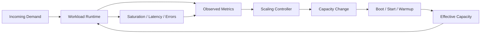
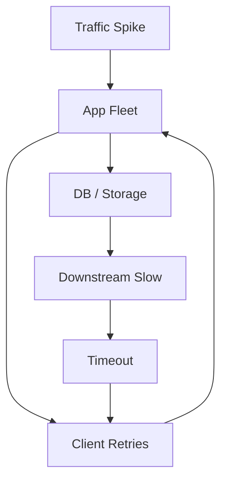
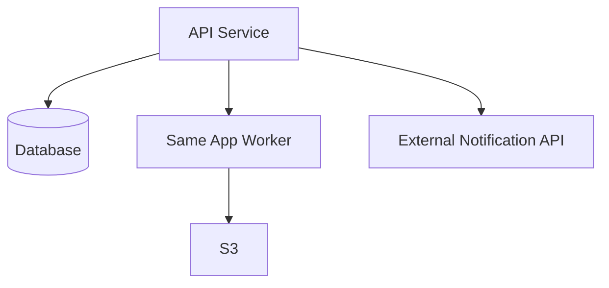
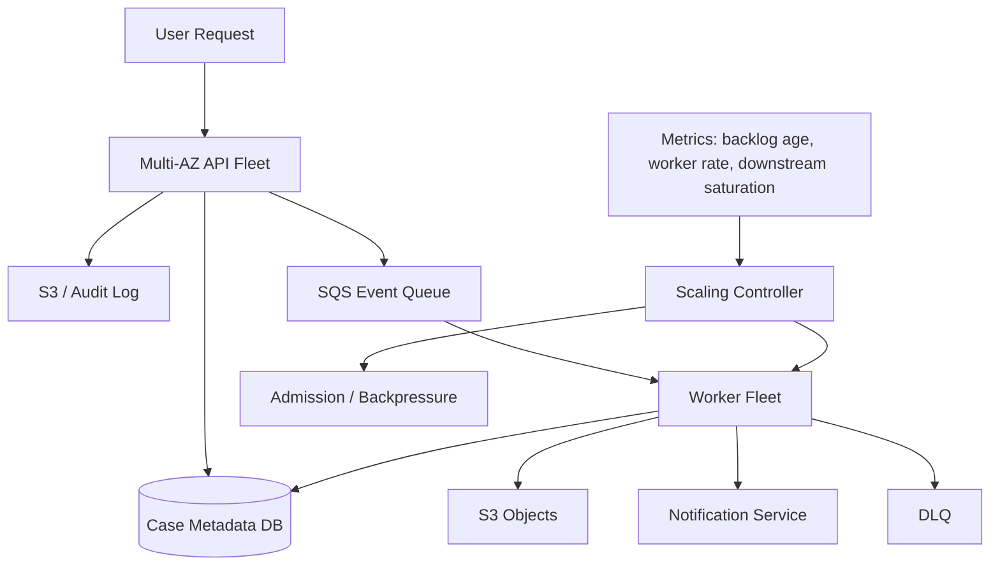

## 1. Problem yang Diselesaikan

AWS membuat capacity terlihat elastis. Anda bisa launch EC2, menambah task ECS, menambah pod EKS, menaikkan Lambda concurrency, mengubah EBS throughput, atau memindahkan object storage class melalui API.

Tetapi elastis tidak berarti otomatis stabil.

Banyak outage bukan terjadi karena tidak ada autoscaling, tetapi karena autoscaling dipasang dengan mental model yang salah:

- metric yang dipakai tidak mewakili bottleneck,
- scaling terlalu lambat dibanding spike,
- warmup tidak dihitung,
- cooldown menyebabkan under/over-scaling,
- retry memperparah load,
- queue menyembunyikan backlog sampai telat,
- downstream storage/DB tidak ikut scale,
- capacity baru gagal start karena AMI, quota, IP, atau dependency,
- scale-in membunuh job yang belum selesai,
- Spot interruption dianggap seperti normal scale-in.

Part ini membahas cloud capacity sebagai **control system**.

Bukan:

```txt
CPU tinggi => tambah instance
```

Tetapi:

```txt
Demand changes -> metric observes -> controller decides -> capacity changes -> workload warms -> saturation changes -> feedback repeats
```

Kalau loop ini salah, sistem akan oscillate, terlambat, memboroskan biaya, atau menghancurkan dependency.

---

## 2. Mental Model: Capacity adalah Feedback Loop

Cloud capacity memiliki loop dasar:



Yang sering dilupakan: **capacity baru tidak langsung menjadi effective capacity**.

Ada delay:

```txt
launch delay + boot delay + app init + dependency connect + cache warmup + health check + traffic ramp
```

Selama delay itu, metric bisa tetap buruk sehingga controller menambah capacity lagi. Setelah semua capacity masuk sekaligus, sistem bisa over-provisioned. Jika scale-in terlalu agresif, sistem akan kembali kekurangan capacity. Ini disebut oscillation.

### 2.1 Control System Vocabulary

| Istilah | Dalam sistem cloud |
|---|---|
| Plant | workload yang dikontrol: API service, worker fleet, batch queue, Lambda function |
| Input | traffic, jobs, events, object arrivals, user requests |
| Output | latency, throughput, error rate, backlog, CPU, memory, IOPS |
| Sensor | metrics/logs/traces/health checks |
| Controller | Auto Scaling policy, HPA/Karpenter, Lambda concurrency config, Batch scheduler |
| Actuator | launch instance, add task, add pod, increase concurrency, change throughput |
| Delay | startup, warmup, metric period, cooldown, provisioning, queue visibility |
| Saturation | bottleneck reached: CPU, memory, disk, network, DB connection, IOPS, downstream rate |
| Disturbance | traffic spike, AZ loss, retry storm, bad deploy, dependency slowness |

Kalau Anda memahami vocabulary ini, scaling policy bukan lagi config acak. Ia menjadi desain feedback loop.

---

## 3. The Real Capacity Equation

Capacity bukan jumlah instance.

Capacity efektif adalah minimum dari banyak batas:

```txt
effective_capacity = min(
  compute_cpu_capacity,
  memory_capacity,
  network_capacity,
  disk_iops_capacity,
  disk_throughput_capacity,
  file_system_metadata_capacity,
  object_store_request_capacity,
  database_connection_capacity,
  downstream_api_rate_limit,
  queue_processing_capacity,
  concurrency_limit,
  quota_limit,
  operator_safe_change_rate
)
```

Scaling compute tidak membantu jika bottleneck ada di storage atau downstream.

Contoh:

```txt
API CPU = 35%
Latency p99 = 4s
DB connection pool = full
S3 PUT retry = rising
EBS queue depth = high
```

Menambah EC2 instance mungkin memperburuk keadaan karena lebih banyak instance membuka connection dan retry.

### 3.1 Demand vs Load vs Work

Bedakan tiga hal:

| Concept | Definisi | Contoh metric |
|---|---|---|
| Demand | keinginan eksternal terhadap sistem | incoming RPS, job arrival rate, upload count |
| Load | pekerjaan yang diterima sistem | requests in progress, queue messages visible/not visible |
| Work | operasi internal yang diperlukan | DB query, S3 PUT, EBS read, OCR CPU seconds |

Satu request user bisa menjadi banyak work unit internal.

```txt
1 document upload
= 1 API request
+ 1 object PUT
+ 1 metadata write
+ 1 queue message
+ N OCR pages
+ M derived objects
+ K audit events
```

Capacity planning harus berbasis work amplification, bukan hanya request count.

---

## 4. Saturation: Metric Paling Penting yang Sering Disembunyikan

Saturation berarti resource sudah mencapai batas sehingga tambahan work menyebabkan queue, latency, error, atau throttling.

### 4.1 Saturation Signals

| Resource | Saturation signal |
|---|---|
| CPU | CPU high, run queue high, throttling, load average tidak turun |
| Memory | swap, OOM kill, GC pressure, page cache collapse |
| Network | bandwidth cap, packet drops, high retransmit, ENI PPS limit |
| EBS | high queue depth, high latency, IOPS/throughput cap |
| EFS/FSx | metadata latency, throughput limit, client timeout |
| S3 | elevated latency/errors, request amplification, hot key/prefix pattern, throttling-like client behavior |
| Lambda | throttles, concurrent executions at limit, iterator age, async event age |
| Queue worker | visible backlog, age of oldest message, processing time > arrival interval |
| DB/downstream | connection pool full, lock wait, timeout, rejected requests |

Latency naik biasanya adalah gejala, bukan root cause. Saturation adalah root cause yang harus dicari.

### 4.2 Latency Percentile as Control Signal

Latency p50 jarang cukup. p95/p99 lebih berguna, tetapi berbahaya jika langsung dipakai sebagai scaling metric tanpa memahami penyebabnya.

P99 bisa naik karena:

- CPU saturation,
- disk latency,
- GC pause,
- downstream timeout,
- queueing inside thread pool,
- retry storm,
- noisy neighbor,
- cold start,
- lock contention,
- client network issue.

Scaling compute hanya cocok jika latency disebabkan oleh compute saturation atau concurrency shortage. Kalau p99 naik karena DB lock, scaling compute bisa memperbanyak lock contention.

---

## 5. Queueing Mental Model

Queue adalah shock absorber. Queue bukan solusi kapasitas permanen.

Queue membantu ketika:

- demand burst lebih cepat dari processing rate,
- worker bisa retry idempotently,
- workload bisa menerima delay,
- downstream perlu dilindungi,
- batch/async lebih cocok daripada synchronous path.

Queue berbahaya ketika:

- backlog tidak dimonitor,
- message age tidak punya SLO,
- visibility timeout salah,
- poison message berputar terus,
- processing tidak idempotent,
- retry memperbesar work,
- DLQ tidak ditangani,
- backlog menabrak retention limit.

### 5.1 Simple Queue Equation

Gunakan mental model sederhana:

```txt
arrival_rate = messages masuk per second
service_rate_per_worker = messages selesai per worker per second
workers = jumlah worker efektif
processing_capacity = service_rate_per_worker * workers

if arrival_rate > processing_capacity:
    backlog grows
else:
    backlog drains
```

Backlog drain time:

```txt
drain_time = backlog / (processing_capacity - arrival_rate)
```

Kalau arrival rate 500 msg/min dan capacity 400 msg/min, backlog naik 100 msg/min. Menambah 10 worker tidak berguna jika bottleneck adalah DB yang hanya mampu 400 msg/min.

### 5.2 Queue Metrics yang Wajib

| Metric | Mengapa penting |
|---|---|
| visible messages | backlog yang belum diambil |
| in-flight messages | sedang diproses |
| age of oldest message | user-visible delay/SLO breach |
| processing duration | service rate per worker |
| success/failure/retry count | work amplification |
| DLQ count | poison/dead processing |
| downstream saturation | apakah worker harus ditahan |

Scaling worker sebaiknya tidak hanya berdasarkan visible backlog. Gunakan kombinasi:

```txt
desired_workers ~= backlog / target_drain_time / service_rate_per_worker
```

Lalu clamp dengan downstream-safe concurrency.

```txt
desired_workers = min(queue_based_workers, downstream_safe_workers, quota_safe_workers)
```

---

## 6. Autoscaling Patterns

### 6.1 Target Tracking

Target tracking cocok ketika ada metric yang proporsional terhadap load per capacity unit.

Contoh:

- average CPU utilization untuk stateless CPU-bound service,
- ALB request count per target untuk web service,
- custom metric seperti queue messages per worker.

Kelebihan:

- sederhana,
- mudah dioperasikan,
- cocok untuk banyak workload stateless.

Kelemahan:

- butuh metric yang benar,
- bisa terlambat untuk spike cepat,
- tidak tahu downstream bottleneck,
- bisa oscillate jika warmup/cooldown salah.

Rule of thumb:

```txt
Use target tracking when the metric represents pressure per unit of capacity.
```

### 6.2 Step Scaling

Step scaling cocok ketika Anda ingin scaling response berbeda untuk severity berbeda.

Contoh:

```txt
CPU > 70% for 5 minutes => +2 instances
CPU > 85% for 2 minutes => +5 instances
CPU > 95% for 1 minute  => +10 instances
```

Kelemahan:

- threshold mudah salah,
- bisa agresif,
- maintenance sulit,
- tidak adaptif terhadap perubahan workload shape.

Gunakan step scaling untuk workload dengan karakteristik jelas dan threshold yang sudah diuji.

### 6.3 Scheduled Scaling

Scheduled scaling cocok untuk pola load yang predictable.

Contoh:

- office-hour traffic,
- monthly report processing,
- market open/close,
- nightly batch,
- weekly campaign.

Scheduled scaling sering lebih baik daripada reactive scaling karena capacity siap sebelum demand datang.

```txt
If demand is predictable, scaling after metric rises is already late.
```

### 6.4 Predictive Scaling

Predictive scaling cocok untuk pola historis yang stabil. Namun, jangan treat sebagai magic.

Tetap perlu:

- baseline min capacity,
- reactive fallback,
- anomaly handling,
- deployment-aware monitoring.

### 6.5 Queue-Based Scaling

Queue-based scaling cocok untuk async workers.

Metric ideal:

```txt
backlog_per_worker = visible_messages / active_workers
```

Atau:

```txt
desired_workers = backlog / target_drain_time / avg_worker_rate
```

Tetapi harus dibatasi oleh downstream:

```txt
worker_concurrency <= db_safe_connections / connections_per_worker
worker_concurrency <= api_rate_limit / calls_per_job
worker_concurrency <= storage_safe_iops / iops_per_job
```

### 6.6 Concurrency-Based Scaling

Untuk runtime seperti Lambda atau event-driven worker, concurrency adalah capacity.

Concurrency dibutuhkan kira-kira:

```txt
required_concurrency = request_rate_per_second * average_duration_seconds
```

Jika function menerima 100 request/detik dan rata-rata durasi 0.2 detik, concurrency rata-rata sekitar 20. Jika durasi naik menjadi 2 detik karena downstream lambat, concurrency butuh naik menjadi 200 untuk rate sama. Ini bisa menyebabkan throttle atau downstream overload.

---

## 7. Warmup, Cooldown, and Health

### 7.1 Warmup

Warmup adalah waktu sampai capacity baru benar-benar aman menerima traffic.

Warmup bisa mencakup:

- instance boot,
- container image pull,
- JVM warmup/JIT,
- dependency connection pool,
- config fetch,
- cache population,
- model loading,
- EFS mount,
- disk pre-read,
- app-specific readiness.

Health check tidak boleh sekadar:

```txt
process is listening on port 8080
```

Health check production harus menjawab:

```txt
Can this instance serve real traffic within SLO without causing dependency damage?
```

### 7.2 Cooldown

Cooldown menahan scaling decision agar tidak terlalu sering berubah.

Terlalu pendek:

- oscillation,
- over-scaling,
- cost spike.

Terlalu panjang:

- under-scaling,
- backlog tumbuh,
- user latency naik.

Cooldown harus disesuaikan dengan:

```txt
metric period + provisioning delay + warmup + stabilization time
```

### 7.3 Scale-In Safety

Scale-out jarang merusak correctness. Scale-in sering merusak correctness.

Scale-in harus mempertimbangkan:

- in-flight HTTP requests,
- long-running jobs,
- local scratch files,
- queue visibility timeout,
- checkpoint completeness,
- leader/lease ownership,
- file flush,
- load balancer deregistration delay,
- ECS/EKS pod termination grace,
- Auto Scaling lifecycle hooks.

Pattern:

```txt
receive termination signal
stop accepting new work
finish or checkpoint current work
publish progress
release ownership
flush state
exit cleanly
```

---

## 8. Storage Capacity is Also a Control System

Compute autoscaling tidak cukup. Storage punya capacity dimension sendiri.

### 8.1 EBS Capacity Dimensions

EBS bukan hanya ukuran GB. Untuk production, pikirkan:

- volume type,
- IOPS,
- throughput,
- latency,
- queue depth,
- filesystem behavior,
- snapshot/restore behavior,
- attachment limit,
- AZ placement,
- instance EBS bandwidth limit.

Contoh bottleneck:

```txt
App CPU 40%, DB latency high, disk queue depth high.
```

Menambah compute tidak membantu. Anda perlu:

- meningkatkan IOPS/throughput,
- mengubah volume type,
- memperbaiki query/write pattern,
- memisahkan WAL/data/temp,
- mengurangi random write amplification,
- menaikkan instance class dengan EBS bandwidth lebih baik.

### 8.2 S3 Capacity Dimensions

S3 biasanya sangat scalable, tetapi application-level design tetap bisa membuat bottleneck:

- terlalu banyak small objects,
- listing sebagai critical path,
- hot key/prefix pattern,
- multipart upload tidak dibersihkan,
- retry tanpa backoff,
- object metadata/head request amplification,
- lifecycle transition cost tidak dihitung,
- storage class tidak cocok dengan access pattern.

Scaling compute worker untuk memproses object bisa memperbanyak:

```txt
GET + HEAD + LIST + PUT + tagging + KMS requests
```

Jadi storage cost dan request pressure bisa naik jauh lebih cepat daripada jumlah job.

### 8.3 File System Capacity Dimensions

EFS/FSx workload sering bottleneck di:

- metadata operations,
- small file count,
- directory listing,
- lock behavior,
- throughput mode,
- client mount options,
- cross-AZ access,
- file handle/cache behavior.

Menambah worker yang semua melakukan `stat/list/open/close` pada shared directory bisa menurunkan performance, bukan menaikkannya.

---

## 9. Backpressure and Admission Control

Autoscaling tidak bisa selalu mengejar demand. Maka sistem butuh backpressure.

Backpressure adalah kemampuan sistem berkata:

```txt
I cannot safely accept more work right now.
```

Bentuk backpressure:

- HTTP 429/503 dengan retry-after,
- queue admission limit,
- per-tenant quota,
- token bucket,
- circuit breaker,
- reserved concurrency,
- worker max concurrency,
- bulkhead per downstream,
- load shedding untuk non-critical request,
- degraded mode.

### 9.1 Why Backpressure Matters

Tanpa backpressure:



Retry storm bisa membuat beban internal jauh lebih besar daripada demand awal.

### 9.2 Admission Control Before Queue

Queue tanpa admission control bisa menjadi tempat menyimpan kegagalan masa depan.

Pertanyaan:

- Berapa backlog maksimum sebelum user promise dilanggar?
- Apakah message retention cukup?
- Apakah downstream sanggup drain backlog setelah pulih?
- Apakah biaya memproses backlog masih masuk akal?
- Apakah item lama masih relevan?

Jika backlog terlalu besar, mungkin lebih benar untuk reject early daripada menerima pekerjaan yang pasti telat.

---

## 10. Capacity Planning Framework

### 10.1 Define Unit of Work

Jangan mulai dari instance. Mulai dari unit kerja.

Contoh document processing:

```txt
1 document =
  upload bytes
  pages
  OCR CPU seconds
  object reads/writes
  metadata writes
  audit events
  downstream notifications
```

### 10.2 Measure Service Rate

Ukur:

```txt
single_worker_rate = completed_units / minute
p95_processing_time
p99_processing_time
resources_per_unit
```

Pisahkan berdasarkan ukuran:

- small document,
- medium document,
- large document,
- pathological document.

### 10.3 Determine SLO

Contoh:

```txt
95% documents processed within 5 minutes
99% documents processed within 30 minutes
raw upload committed durably before API returns success
```

### 10.4 Calculate Baseline Capacity

```txt
required_workers = peak_arrival_rate * avg_processing_time / target_utilization
```

Untuk async:

```txt
workers_for_drain = backlog / target_drain_time / worker_rate
```

Gunakan target utilization < 1, misalnya 0.6-0.75 untuk headroom.

### 10.5 Add Failure Headroom

Capacity harus tetap cukup saat satu AZ hilang.

Untuk tiga AZ active-active:

```txt
normal_total_capacity = C
capacity_per_az = C / 3
remaining_after_one_az_loss = 2C / 3
```

Jika workload harus tetap 100% saat satu AZ hilang, total normal capacity harus overprovisioned:

```txt
2/3 * normal_total_capacity >= required_capacity
normal_total_capacity >= required_capacity * 1.5
```

Ini bukan pemborosan; ini harga dari AZ failure tolerance tanpa menunggu scale-out.

---

## 11. AWS Compute-Specific Capacity Notes

### 11.1 EC2 Auto Scaling Group

ASG cocok untuk:

- EC2 service fleet,
- container node fleet,
- worker fleet,
- mixed On-Demand/Spot capacity,
- state-light replaceable nodes.

Hal yang harus didesain:

- min/max/desired capacity,
- health check type,
- launch template versioning,
- instance warmup,
- lifecycle hook,
- termination policy,
- mixed instance policy,
- AZ distribution,
- warm pool jika startup mahal,
- scale-in protection untuk long job.

### 11.2 ECS Service Scaling

Untuk ECS, ada dua layer:

```txt
service desired task count
cluster capacity provider / EC2 capacity / Fargate capacity
```

Bottleneck bisa di:

- task count,
- EC2 cluster capacity,
- image pull,
- ENI/IP availability,
- CPU/memory reservation,
- ALB target health,
- downstream.

### 11.3 EKS Scaling

Untuk EKS, ada beberapa loop:

- Horizontal Pod Autoscaler,
- Cluster Autoscaler/Karpenter-like node provisioning,
- pod scheduling,
- node readiness,
- storage attach/mount,
- application readiness.

Failure mode umum:

```txt
HPA increases pods -> pods pending -> node scaler launches node -> node not ready -> storage not attachable in AZ -> pods stuck -> HPA keeps increasing
```

### 11.4 Lambda Concurrency

Lambda scaling harus dipikirkan bersama:

- account concurrency,
- reserved concurrency,
- provisioned concurrency,
- event source batch size,
- downstream rate limit,
- async retry,
- DLQ/destination,
- function duration.

Jika downstream lambat, function duration naik. Jika request rate tetap, concurrency naik. Ini bisa menciptakan throttle atau overload.

### 11.5 AWS Batch

AWS Batch cocok jika workload berupa job dengan queue, retry, dan compute environment.

Capacity concern:

- job queue priority,
- compute environment max vCPU,
- Spot interruption,
- container image size,
- data staging,
- checkpoint,
- array job fan-out,
- storage throughput.

---

## 12. Failure Modes

### 12.1 Wrong Metric Scaling

Gejala:

- CPU rendah tetapi latency tinggi.
- Autoscaling tidak trigger.
- User melihat timeout.

Root cause:

```txt
Metric observes CPU, but bottleneck is downstream/storage/thread pool.
```

Mitigasi:

- gunakan metric yang mewakili saturation,
- tambahkan p95/p99 latency, queue depth, connection pool, disk queue,
- jangan hanya pakai average CPU.

### 12.2 Scaling Lag

Gejala:

- traffic spike cepat,
- scale-out terjadi tetapi terlambat,
- backlog/error sudah terjadi sebelum capacity siap.

Mitigasi:

- scheduled scaling,
- warm pool,
- provisioned concurrency,
- baseline headroom,
- faster AMI/container image,
- pre-warmed cache,
- admission control.

### 12.3 Oscillation

Gejala:

- capacity naik-turun terus,
- latency berosilasi,
- cost naik,
- cache terus dingin.

Root cause:

- cooldown terlalu pendek,
- metric noisy,
- warmup tidak dihitung,
- scale-in agresif,
- target terlalu tinggi.

Mitigasi:

- smooth metric,
- set instance warmup,
- conservative scale-in,
- separate scale-out and scale-in logic,
- use min capacity.

### 12.4 Retry Storm

Gejala:

- incoming demand tidak naik banyak,
- internal request ke DB/S3/API naik drastis,
- timeout meningkat,
- client retry memperburuk overload.

Mitigasi:

- exponential backoff + jitter,
- circuit breaker,
- bounded retry,
- idempotency,
- load shedding,
- per-tenant quota.

### 12.5 Scale-Out Amplifies Downstream Failure

Gejala:

- menambah worker membuat DB/storage makin lambat,
- queue backlog tidak turun,
- error meningkat.

Root cause:

```txt
The bottleneck is downstream, but controller adds upstream concurrency.
```

Mitigasi:

- cap worker concurrency,
- downstream-aware autoscaling,
- token bucket per dependency,
- circuit breaker,
- reduce batch size,
- degrade non-critical features.

### 12.6 Unsafe Scale-In

Gejala:

- jobs duplicate,
- partial files,
- lock orphan,
- inconsistent checkpoint,
- user operation lost.

Mitigasi:

- lifecycle hook,
- termination signal handling,
- checkpoint before exit,
- idempotent job design,
- scale-in protection,
- longer termination grace.

### 12.7 Capacity Cannot Be Created

Gejala:

- ASG wants capacity but cannot launch,
- ECS tasks pending,
- EKS pods pending,
- Lambda throttled,
- Batch jobs RUNNABLE but not STARTING.

Possible causes:

- quota,
- subnet IP exhaustion,
- instance type unavailable,
- Spot pool interruption/capacity shortage,
- broken launch template,
- IAM failure,
- image pull failure,
- EBS volume/AZ mismatch,
- security group/ENI limits.

Mitigasi:

- quota headroom,
- multiple instance types,
- multiple AZ,
- mixed On-Demand/Spot,
- IP planning,
- canary launch template,
- proactive capacity tests.

---

## 13. Implementation Pattern: Capacity Contract

Setiap workload production harus punya capacity contract.

```yaml
service: case-document-processor
workload_type: async-worker
slo:
  p95_processing_time: 5m
  p99_processing_time: 30m
  max_oldest_message_age: 10m
unit_of_work:
  name: document
  size_buckets:
    small: "1-5 pages"
    medium: "6-50 pages"
    large: "51-500 pages"
capacity_model:
  worker_rate:
    small: 20_per_minute
    medium: 4_per_minute
    large: 0.5_per_minute
  target_utilization: 0.65
  max_worker_concurrency: 200
  downstream_limits:
    metadata_db_connections: 100
    ocr_api_rps: 300
    s3_put_budget_per_minute: 10000
scaling:
  metric: backlog_per_worker_and_oldest_message_age
  scale_out:
    policy: aggressive_until_downstream_threshold
  scale_in:
    policy: conservative_after_drain
  min_capacity: 30
  max_capacity: 200
  az_strategy: active_active_3_az
failure_headroom:
  tolerate_one_az_loss: true
  normal_overprovision_factor: 1.5
backpressure:
  admission_limit: enabled
  tenant_quota: enabled
  retry_after: enabled
  dlq: enabled
shutdown:
  graceful_drain: true
  checkpoint_required: true
  max_job_before_checkpoint: 60s
```

Capacity contract membuat autoscaling bisa direview sebagai engineering decision, bukan angka magic.

---

## 14. Example: API Service Capacity Model

### 14.1 Workload

Service menerima request dari user. Request membaca metadata, mengambil object dari S3, dan menulis audit event.

Observed:

```txt
p95 request duration: 120 ms
p99 request duration: 300 ms
peak RPS: 2,000
average CPU per instance at 500 RPS: 65%
downstream DB safe connection limit: 400
connections per instance: 20
```

### 14.2 Compute Estimate

Jika satu instance aman di 500 RPS:

```txt
required_instances_for_peak = 2000 / 500 = 4
```

Dengan headroom 50%:

```txt
baseline = 6 instances
```

Untuk tolerate one AZ loss di 3 AZ:

```txt
normal_total >= required_capacity * 1.5
normal_total >= 4 * 1.5 = 6
```

Jadi 6 instance, 2 per AZ, masuk akal dari compute perspective.

### 14.3 Downstream Limit Check

6 instance * 20 DB connections = 120 connections. Aman terhadap limit 400.

Tetapi max scaling tidak boleh sembarang:

```txt
max_instances_by_db = 400 / 20 = 20
```

Jika Auto Scaling max = 100, maka saat incident service bisa membuka 2,000 DB connections dan menjatuhkan DB.

Capacity cap harus mempertimbangkan downstream.

### 14.4 Scaling Policy

```yaml
scaling:
  target_tracking:
    metric: ALBRequestCountPerTarget
    target: 450
  min_capacity: 6
  max_capacity: 20
  instance_warmup: 180s
  scale_in_cooldown: 600s
  health_check_grace: 240s
```

Mengapa bukan CPU saja?

Karena request count per target lebih langsung merepresentasikan load per instance untuk service ini. CPU tetap dimonitor sebagai saturation guardrail.

---

## 15. Example: Queue Worker Capacity Model

### 15.1 Workload

- Arrival peak: 10,000 documents/hour.
- Average processing: 30 seconds/document/worker.
- Target drain: backlog harus selesai < 15 menit.
- OCR downstream limit: 500 concurrent operations.

Worker rate:

```txt
1 worker = 2 docs/minute
```

Peak arrival:

```txt
10000 docs/hour = 166.7 docs/minute
```

Workers for steady-state:

```txt
166.7 / 2 = 84 workers
```

Dengan utilization target 70%:

```txt
84 / 0.7 = 120 workers
```

Jika backlog 30,000 docs dan arrival tetap 166.7/min, untuk drain dalam 15 menit:

```txt
extra_capacity_needed = 30000 / 15 = 2000 docs/min
required_total_processing = 2000 + 166.7 = 2166.7 docs/min
workers = 2166.7 / 2 = 1084 workers
```

Tetapi downstream OCR hanya 500 concurrent. Maka realistic drain target 15 menit tidak mungkin kecuali:

- downstream limit dinaikkan,
- processing dipercepat,
- backlog target diperlonggar,
- job diprioritaskan,
- processing dipecah menjadi tier.

Inilah nilai capacity model: ia menunjukkan janji yang mustahil sebelum outage terjadi.

---

## 16. Operational Dashboard

Dashboard capacity harus menunjukkan loop, bukan metric terpisah.

### 16.1 API Dashboard

Wajib:

- RPS total dan per target,
- p50/p95/p99 latency,
- 4xx/5xx,
- healthy target count per AZ,
- CPU/memory/network per instance/task,
- thread pool/concurrency,
- DB connection pool,
- downstream latency,
- autoscaling desired/current/in-service capacity,
- instance launch failures,
- deployment version distribution.

### 16.2 Worker Dashboard

Wajib:

- queue visible/in-flight,
- age of oldest message,
- processing rate,
- success/failure/retry,
- DLQ,
- active workers,
- worker saturation,
- downstream rate/latency,
- checkpoint lag,
- scale-out/scale-in events,
- Spot interruption count.

### 16.3 Storage Dashboard

Wajib:

- EBS IOPS/throughput/latency/queue depth,
- filesystem disk usage/inode usage,
- EFS/FSx throughput and client errors,
- S3 request count/error/latency by operation,
- object count/size growth,
- lifecycle transition/delete count,
- replication lag if used,
- backup/snapshot success and restore test.

---

## 17. Testing Capacity Behavior

Capacity design yang belum dites adalah hipotesis.

### 17.1 Load Test

Test:

- steady peak,
- sudden spike,
- slow ramp,
- long soak,
- large object/job pathological case,
- downstream latency injection,
- partial AZ capacity loss.

### 17.2 Scaling Test

Verify:

- scale-out triggers at expected metric,
- capacity becomes healthy within expected time,
- scale-in does not kill work,
- cooldown prevents oscillation,
- max capacity does not overload downstream,
- quota is enough,
- new capacity uses correct AMI/image/config.

### 17.3 Backpressure Test

Verify:

- HTTP returns correct overload response,
- retry-after is respected,
- queue admission limit works,
- tenant quota prevents noisy neighbor,
- DLQ catches poison messages,
- circuit breaker opens and recovers.

### 17.4 AZ Loss Game Day

Simulate logically:

- remove one AZ from load balancer,
- terminate node group in one AZ,
- block scheduling to one AZ,
- reduce ASG capacity in one AZ,
- shift traffic away from one AZ.

Observe:

- does remaining capacity absorb traffic?
- does storage path remain available?
- does autoscaling create replacement in healthy AZ?
- does backlog stay within SLO?
- does cost/concurrency explode?

---

## 18. Common Mistakes

### Mistake 1: Autoscaling Without Backpressure

Autoscaling is not instant. Backpressure protects the system during the delay.

### Mistake 2: CPU as Universal Metric

CPU is useful only when CPU is the bottleneck. For IO-heavy service, CPU can be low during outage.

### Mistake 3: Ignoring Warmup

A new instance that passed port check but has cold cache, cold JVM, and empty connection pool may hurt latency.

### Mistake 4: Aggressive Scale-In

Scale-in saves cost but can destroy long-running work.

### Mistake 5: Max Capacity Above Downstream Safety

Max capacity is not “as high as possible”. It is the maximum safe concurrency for the whole system.

### Mistake 6: No Failure Headroom

If system runs at 75% utilization across three AZ, losing one AZ can push remaining AZs above 100%.

### Mistake 7: Queue Without Age SLO

A queue can look healthy by depth but still violate user promise if oldest message age is high.

---

## 19. Design Review Questions

1. What is the unit of work?
2. What is the arrival rate at normal, peak, and burst?
3. What is the service rate per capacity unit?
4. What is the true bottleneck under load?
5. What metric represents saturation?
6. What metric controls scale-out?
7. What metric controls scale-in?
8. What is startup/warmup time?
9. What is safe drain time?
10. What is max safe concurrency for each downstream?
11. What happens when one AZ disappears?
12. What happens when capacity cannot be launched?
13. What happens when downstream slows by 10x?
14. How are retries bounded?
15. What work is rejected instead of queued?
16. What is the oldest acceptable backlog item?
17. How is cost bounded during retry/spike?
18. Is max capacity aligned with quota and downstream limits?
19. Is scale-in safe for current work type?
20. Has the scaling behavior been load-tested?

---

## 20. Mini Case Study: Enforcement Event Processing Platform

### 20.1 Context

A regulatory enforcement platform receives events:

- complaint submitted,
- evidence uploaded,
- case status changed,
- officer assigned,
- deadline breached,
- escalation triggered.

Some events are synchronous user actions. Some are async processing jobs. Some trigger file processing. Some write audit records.

### 20.2 Bad Design



Problems:

- synchronous and async capacity mixed,
- external API slowness affects user path,
- worker concurrency tied to API scaling,
- retries happen inside request path,
- no backlog SLO,
- no downstream-aware limit.

### 20.3 Better Design



Capacity model:

- API scales by request count per target and latency guardrails.
- Worker scales by backlog age and backlog per worker.
- Worker max concurrency is capped by DB and notification API limit.
- Audit write is not optional; if audit path fails, user action semantics are explicit.
- Queue protects user path from external notification slowness.
- DLQ and idempotency prevent poison message loop.

### 20.4 Result

The platform can say:

```txt
We can accept case actions up to X RPS.
We can process async effects within Y minutes at p95.
If notification provider slows down, user action path remains safe.
If one AZ fails, remaining capacity handles baseline traffic.
If backlog exceeds threshold, low-priority processing is deferred or rejected.
```

This is capacity engineering. Not just autoscaling.

---

## 21. Checklist

### Capacity Model Checklist

- [ ] Unit of work defined.
- [ ] Work amplification measured.
- [ ] Arrival rate measured.
- [ ] Service rate per worker/instance measured.
- [ ] Saturation metric identified.
- [ ] Downstream limits documented.
- [ ] Max safe concurrency calculated.
- [ ] AZ failure headroom calculated.
- [ ] Quotas checked.
- [ ] Startup and warmup measured.
- [ ] Drain and shutdown measured.

### Autoscaling Checklist

- [ ] Scale-out metric matches bottleneck.
- [ ] Scale-in is conservative.
- [ ] Warmup/cooldown configured.
- [ ] Min capacity supports baseline.
- [ ] Max capacity respects downstream safety.
- [ ] Scheduled scaling used for predictable load.
- [ ] Queue-based scaling uses oldest age/backlog per worker.
- [ ] Capacity creation failure is alarmed.
- [ ] Scaling events are visible in dashboard.

### Backpressure Checklist

- [ ] Retry has exponential backoff and jitter.
- [ ] Retry count is bounded.
- [ ] Circuit breaker exists for fragile downstream.
- [ ] Tenant quota exists if multi-tenant.
- [ ] Queue admission limit exists.
- [ ] DLQ is monitored.
- [ ] Degraded mode defined.
- [ ] Rejection semantics are user-safe.

---

## 22. Summary

Cloud capacity is not a pile of instances. It is a delayed feedback system.

Key ideas:

- Autoscaling controls a loop with sensors, controller, actuator, delay, and saturation.
- The right metric depends on the bottleneck.
- Effective capacity arrives after warmup, not at launch time.
- Queue absorbs burst but does not create processing capacity.
- Backpressure is mandatory because scaling is not instant.
- Max capacity must respect downstream limits.
- Storage capacity can be the bottleneck even when compute is healthy.
- Scale-in needs more safety than scale-out.
- Capacity planning must include AZ loss, quota, Spot interruption, startup, drain, and retry behavior.

Kalimat praktis:

```txt
Before adding capacity, identify the bottleneck. Before accepting more work, prove the system can finish it within SLO.
```

Part berikutnya masuk ke storage sebagai kontrak, bukan disk: durability, consistency, mutability, lifecycle, retention, access pattern, ownership, dan bagaimana memilih storage berdasarkan semantics, bukan berdasarkan nama service.

---

## 23. References

- Amazon EC2 Auto Scaling: https://docs.aws.amazon.com/autoscaling/ec2/userguide/what-is-amazon-ec2-auto-scaling.html
- Target tracking scaling policies: https://docs.aws.amazon.com/autoscaling/ec2/userguide/as-scaling-target-tracking.html
- Scheduled scaling for Amazon EC2 Auto Scaling: https://docs.aws.amazon.com/autoscaling/ec2/userguide/ec2-auto-scaling-scheduled-scaling.html
- Amazon EC2 Auto Scaling lifecycle hooks: https://docs.aws.amazon.com/autoscaling/ec2/userguide/lifecycle-hooks.html
- Warm pools for Amazon EC2 Auto Scaling: https://docs.aws.amazon.com/autoscaling/ec2/userguide/ec2-auto-scaling-warm-pools.html
- Auto Scaling groups with multiple instance types and purchase options: https://docs.aws.amazon.com/autoscaling/ec2/userguide/ec2-auto-scaling-mixed-instances-groups.html
- Spot Instance interruption notices: https://docs.aws.amazon.com/AWSEC2/latest/UserGuide/spot-instance-termination-notices.html
- EC2 instance rebalance recommendations: https://docs.aws.amazon.com/AWSEC2/latest/UserGuide/rebalance-recommendations.html
- Lambda concurrency: https://docs.aws.amazon.com/lambda/latest/dg/lambda-concurrency.html
- AWS Batch: https://docs.aws.amazon.com/batch/latest/userguide/what-is-batch.html
- AWS Well-Architected Reliability Pillar: https://docs.aws.amazon.com/wellarchitected/latest/reliability-pillar/welcome.html
