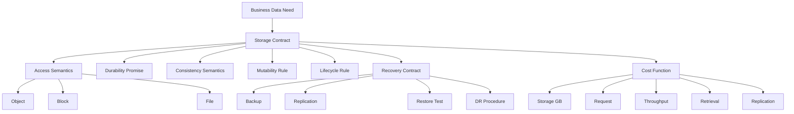
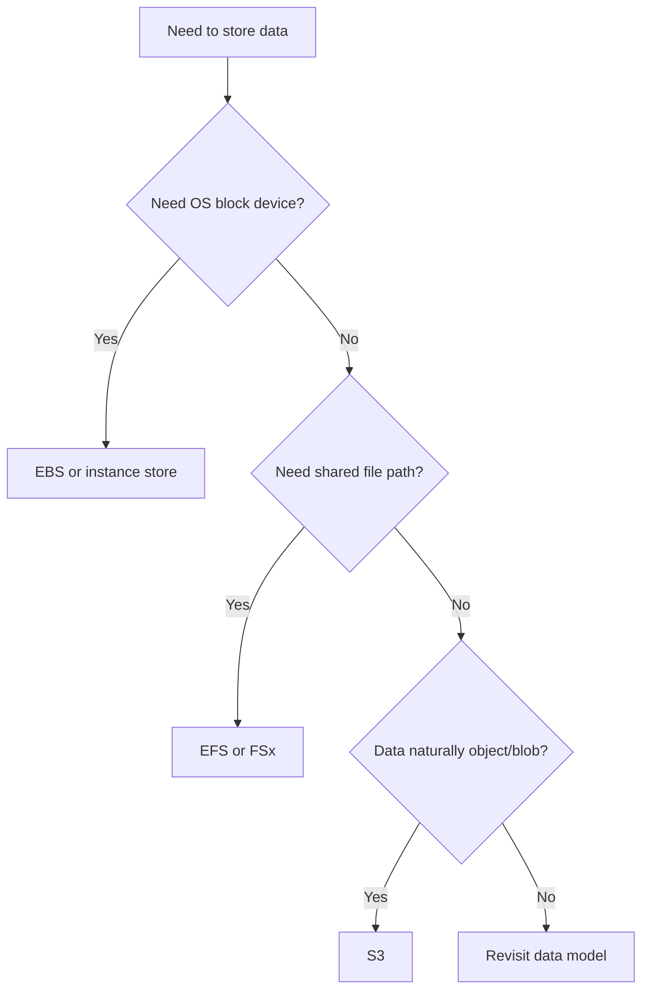
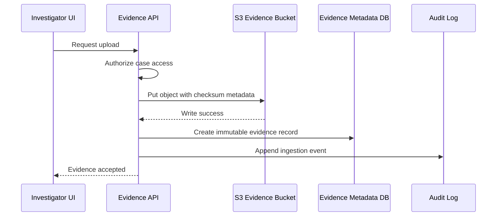
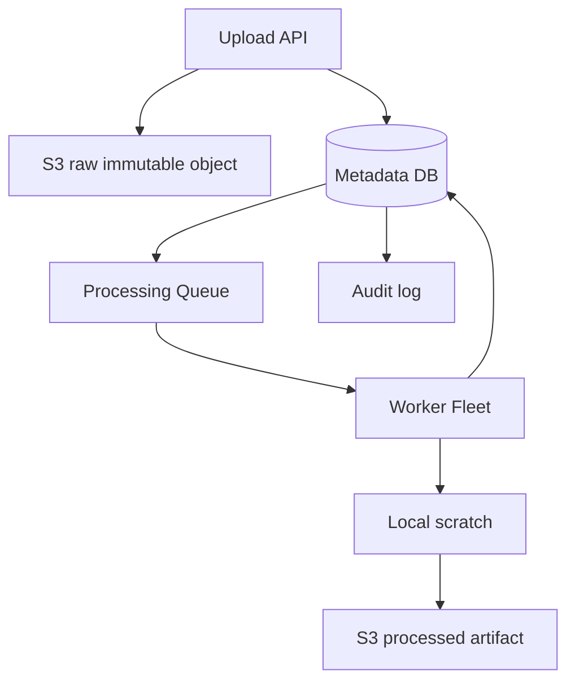

# Part 005 — Storage as Contract, Not Disk

Storage di cloud tidak boleh dipikirkan sebagai “tempat menyimpan file”. Itu terlalu rendah level.

Di production, storage adalah **kontrak** antara aplikasi, data, pengguna, operasi, compliance, dan failure recovery.

Ketika kita memilih S3, EBS, EFS, FSx, instance store, atau Storage Gateway, kita sebenarnya sedang memilih jawaban untuk pertanyaan berikut:

- data ini berbentuk apa?
- siapa yang boleh menulis?
- siapa yang boleh membaca?
- kapan data dianggap berhasil disimpan?
- apakah overwrite diperbolehkan?
- apakah delete sungguhan atau logical?
- berapa lama data harus bertahan?
- apa yang terjadi kalau compute mati?
- apa yang terjadi kalau satu Availability Zone bermasalah?
- bagaimana data dipulihkan?
- berapa biaya untuk write, read, store, replicate, archive, dan recover?

Engineer yang matang tidak mulai dari “pakai storage apa?”. Ia mulai dari:

> “Kontrak data apa yang dibutuhkan workload ini?”

AWS menyediakan object, block, dan file storage. AWS Storage Decision Guide menyatakan pemilihan storage perlu dilakukan berdasarkan kebutuhan bisnis dan workload, termasuk object, block, file, serta opsi migration. Amazon S3 menyediakan object storage dengan strong read-after-write consistency untuk PUT dan DELETE object di semua AWS Region. Amazon EBS menyediakan block storage yang attach/detach ke EC2 instance dan tetap ada independen dari lifecycle instance. Referensi resmi: <https://docs.aws.amazon.com/decision-guides/latest/storage-on-aws-how-to-choose/choosing-aws-storage-service.html>, <https://docs.aws.amazon.com/AmazonS3/latest/userguide/Welcome.html>, <https://docs.aws.amazon.com/AWSEC2/latest/UserGuide/Storage.html>.

---

## 1. Problem yang Diselesaikan

Banyak masalah storage production lahir dari satu kesalahan dasar:

> aplikasi mengasumsikan semantic storage yang tidak diberikan oleh service yang dipilih.

Contoh nyata:

| Kesalahan asumsi | Dampak production |
|---|---|
| Menganggap S3 seperti file system lokal | rename atomic tidak tersedia seperti POSIX; listing bisa menjadi bottleneck desain; small-file explosion mahal |
| Menganggap EBS seperti database managed | backup belum tentu application-consistent; failover bukan otomatis; volume scope AZ |
| Menganggap EFS cocok untuk semua shared state | metadata-heavy workload bisa lambat; lock/contention bisa membunuh throughput |
| Menganggap instance store aman untuk data penting | data hilang saat instance stop/terminate/failure |
| Menganggap snapshot sama dengan disaster recovery | restore belum diuji, RTO/RPO tidak jelas, dependency KMS/IAM tidak tervalidasi |
| Menganggap lifecycle policy hanya optimasi biaya | bisa menghapus evidence, log, atau artifact yang masih punya retention obligation |

Storage bukan hanya API. Storage adalah bagian dari **kebenaran sistem**.

Jika kontrak storage salah, masalahnya biasanya bukan langsung terlihat sebagai error. Ia muncul sebagai:

- data hilang setelah deployment,
- recovery gagal saat incident,
- latency spike tanpa perubahan kode,
- biaya membengkak karena request amplification,
- audit gagal karena retention tidak deterministik,
- job batch gagal karena file sementara memenuhi disk,
- container pindah node tapi volume tidak ikut,
- workload multi-AZ diam-diam bergantung pada state single-AZ.

Part ini membangun cara berpikir yang akan kita pakai sepanjang seri.

---

## 2. Mental Model

Gunakan formula berikut:

```txt
Storage Contract = Access Semantics + Durability Promise + Consistency Semantics + Mutability Rule + Lifecycle Rule + Recovery Contract + Cost Function
```

Diagram mental model:



Storage contract harus ditulis sebelum service dipilih. Service hanya implementasi dari kontrak.

---

## 3. Storage Bukan Disk: Tiga Semantic Besar

### 3.1 Object Storage

Object storage menyimpan data sebagai object dengan key dan metadata. Di AWS, representasi utamanya adalah Amazon S3.

Gunakan object storage ketika:

- data cocok sebagai blob/object,
- ukuran data bisa besar,
- aplikasi tidak membutuhkan POSIX file operations,
- write biasanya berupa create/replace object,
- data sering dibaca banyak consumer,
- durability dan scalability lebih penting daripada low-latency block semantics,
- data perlu lifecycle, versioning, replication, event notification, atau archival.

Contoh:

- user upload,
- report artifact,
- image/video/document,
- raw event landing zone,
- data lake object,
- audit evidence,
- backup artifact,
- model artifact,
- static asset.

Kontrak yang cocok:

```txt
Application writes immutable object -> object becomes durable -> consumers read by key -> lifecycle moves/archives/deletes by policy
```

Yang tidak cocok:

- database primary storage,
- frequent in-place small random updates,
- shared POSIX filesystem,
- local temp directory yang butuh rename/lock semantics,
- workload yang sangat latency-sensitive untuk setiap small write.

### 3.2 Block Storage

Block storage terlihat seperti disk block device untuk OS. Di AWS, representasi utamanya adalah Amazon EBS untuk EC2.

Gunakan block storage ketika:

- aplikasi butuh filesystem lokal,
- database butuh random I/O,
- OS butuh boot volume,
- workload membutuhkan low-latency block device,
- data melekat ke satu instance atau satu active writer,
- kita mengelola filesystem, backup, dan application consistency sendiri.

Contoh:

- PostgreSQL/MySQL self-managed di EC2,
- Kafka broker disk,
- Elasticsearch/OpenSearch self-managed node disk,
- application server dengan local persistent directory,
- CI runner dengan durable cache tertentu,
- custom stateful service.

Kontrak yang cocok:

```txt
One primary compute owns block volume -> OS/filesystem manages layout -> snapshot/replication/backups protect data -> failover procedure reattaches/restores volume
```

Yang tidak cocok:

- banyak writer lintas instance secara bersamaan,
- shared file repository,
- object archive,
- cross-AZ active-active storage tanpa desain eksplisit,
- workload yang compute-nya harus bebas berpindah tanpa state coupling.

Catatan penting: EBS volume bersifat regional resource tetapi volume berada di satu Availability Zone dan attach ke instance di AZ yang sama. Ini berarti EBS membawa placement constraint. Referensi: <https://docs.aws.amazon.com/AWSEC2/latest/UserGuide/Storage.html>.

### 3.3 File Storage

File storage memberi file system semantics dan shared access. Di AWS, representasinya mencakup Amazon EFS dan keluarga Amazon FSx.

Gunakan file storage ketika:

- beberapa compute perlu mount path yang sama,
- aplikasi legacy mengharapkan file system,
- workload butuh directory tree,
- workload butuh shared read/write file access,
- POSIX/SMB/NFS-like behavior dibutuhkan,
- migration dari file server lebih masuk akal daripada rewrite ke object store.

Contoh:

- shared media processing workspace,
- home directory,
- content management legacy app,
- WordPress shared uploads,
- Windows file share,
- HPC scratch dengan FSx for Lustre,
- enterprise file workload dengan FSx for Windows File Server,
- NFS workload dengan EFS atau FSx.

Kontrak yang cocok:

```txt
Many compute nodes mount shared filesystem -> file path is coordination surface -> throughput/metadata/lock behavior must be capacity-managed
```

Yang tidak cocok:

- mengganti database block storage tanpa memahami latency,
- high-frequency tiny metadata operations tanpa benchmark,
- object archive murah jangka panjang,
- event stream,
- storage untuk massive immutable data lake layout jika S3 lebih cocok.

---

## 4. Kontrak Storage: Dimensi yang Harus Didefinisikan

### 4.1 Ownership

Pertanyaan pertama:

> Siapa pemilik data ini?

Bukan “service mana yang menyimpan”. Pemilik berarti komponen yang bertanggung jawab atas:

- write correctness,
- schema/format,
- lifecycle,
- retention,
- access policy,
- recovery,
- deletion,
- audit trail.

Contoh buruk:

```txt
Semua service boleh menulis ke bucket shared-prod-data dengan prefix masing-masing tanpa owner jelas.
```

Contoh lebih baik:

```txt
case-evidence-service owns s3://reg-prod-evidence/{tenantId}/{caseId}/{evidenceId}/...
Only evidence ingestion path may create objects.
Downstream readers consume immutable object references.
Deletion requires retention workflow.
```

Storage tanpa ownership akan berubah menjadi “distributed junk drawer”. Awalnya cepat, lalu sulit di-govern.

### 4.2 Access Semantics

Tentukan bentuk akses:

| Akses | Pertanyaan |
|---|---|
| Object | Apakah aplikasi cukup read/write by key? |
| Block | Apakah OS/app butuh raw disk/filesystem lokal? |
| File | Apakah banyak compute butuh path yang sama? |
| Stream-like | Apakah data sebenarnya event, bukan file? |
| Cache | Apakah data bisa dibuang dan dibuat ulang? |

Jangan menyamakan API dengan semantic. Aplikasi bisa upload file lewat HTTP, tetapi storage yang tepat mungkin S3 object. Aplikasi bisa punya path lokal, tetapi path itu mungkin cuma scratch/cache sehingga instance store cukup.

### 4.3 Durability Promise

Durability menjawab:

> Setelah write berhasil, seberapa kuat janji sistem bahwa data tidak hilang?

Kategori praktis:

| Kategori data | Durability expectation | Storage pattern |
|---|---:|---|
| Ephemeral cache | boleh hilang | instance store, container ephemeral, Lambda `/tmp` |
| Rebuildable artifact | boleh hilang jika bisa rebuild | S3 dengan lifecycle pendek, EBS cache volume |
| Business record | tidak boleh hilang | S3/EBS/EFS/FSx dengan backup/replication sesuai RPO |
| Legal/audit evidence | tidak boleh hilang atau diubah | S3 versioning + Object Lock + retention + replication + audit |
| Database state | tidak boleh hilang | managed DB atau EBS/FSx dengan app-consistent backup dan tested restore |

Yang harus dihindari:

```txt
Durable karena “sepertinya disimpan di AWS”.
```

Durability harus dinyatakan dalam mekanisme:

- service durability,
- replication scope,
- backup/snapshot policy,
- retention policy,
- restore procedure,
- access control,
- deletion guard,
- auditability.

### 4.4 Availability Contract

Availability menjawab:

> Data bisa diakses dari mana ketika sebagian sistem gagal?

Contoh pertanyaan:

- Apakah workload harus tetap jalan jika satu instance mati?
- Apakah harus tetap jalan jika satu AZ bermasalah?
- Apakah storage dependency single-AZ?
- Apakah mount target tersedia di semua AZ yang dipakai compute?
- Apakah aplikasi bisa read-only mode jika write path gagal?
- Apakah fallback Region disiapkan?

Contoh failure:

```txt
Service berjalan multi-AZ di ECS, tapi semua task butuh EBS volume single-AZ.
```

Secara compute terlihat multi-AZ, tetapi state membuat workload single-AZ.

### 4.5 Consistency Semantics

Consistency menjawab:

> Setelah write sukses, kapan reader lain melihat data yang benar?

Amazon S3 sekarang memberikan strong read-after-write consistency untuk PUT dan DELETE object di semua AWS Region. Tetapi ini tidak berarti S3 menjadi POSIX filesystem. Strong object consistency tidak memberikan atomic multi-object transaction, directory rename semantics, atau file locking. Referensi: <https://docs.aws.amazon.com/AmazonS3/latest/userguide/Welcome.html>.

Kita perlu bedakan:

| Semantic | Makna |
|---|---|
| Read-after-write object consistency | object baru/overwrite/delete terlihat konsisten setelah success |
| Atomic rename | operasi rename sebagai commit boundary; ini file-system pattern, bukan S3 primitive umum |
| Multi-object transaction | beberapa object berubah sebagai satu unit; perlu manifest/transaction log/app protocol |
| Locking | koordinasi writer; perlu DynamoDB/DB/lock service, bukan sekadar bucket |
| Listing as source of truth | berisiko secara biaya/latency; sering lebih baik pakai manifest/index |

Pattern yang lebih benar untuk S3 data pipeline:

```txt
write object parts -> verify checksum -> write manifest/commit marker -> consumers read manifest, not raw listing
```

### 4.6 Mutability Rule

Mutability menjawab:

> Data boleh berubah setelah dibuat atau tidak?

Empat kategori:

| Kategori | Rule | Contoh |
|---|---|---|
| Immutable | create once, never mutate | evidence file, invoice PDF, release artifact |
| Append-only | tambah record, tidak update record lama | audit log, event archive |
| Mutable latest | object bisa overwrite | user avatar, config snapshot |
| Transactional mutable | update butuh consistency ketat | database record |

Di cloud, immutable sering lebih mudah dioperasikan daripada mutable. Immutable object bisa diberi checksum, version, retention, replication, dan audit trail yang jelas.

Contoh evidence storage:

```txt
BAD:
case-123/evidence.pdf

GOOD:
case-123/evidence/evidence-789/content-sha256=<hash>.pdf
case-123/evidence/evidence-789/metadata.json
case-123/evidence/evidence-789/ingestion-manifest.json
```

### 4.7 Lifecycle Rule

Lifecycle menjawab:

> Data berpindah kelas, diarsipkan, atau dihapus kapan?

Lifecycle bukan hanya cost optimization. Lifecycle adalah bagian dari business rule.

Contoh:

| Data | Lifecycle |
|---|---|
| Upload temporary multipart | abort incomplete upload setelah N hari |
| Transcode intermediate file | delete setelah job sukses + grace period |
| Case evidence | retain sesuai legal/regulatory requirement |
| Application log | hot 30 hari, archive 1 tahun, delete 7 tahun sesuai policy |
| ML training dataset snapshot | keep immutable version sampai model retired |

AWS S3 Lifecycle bisa mengatur transisi storage class dan expiry object. Tetapi policy yang salah bisa menghapus data yang masih dibutuhkan. Referensi: <https://docs.aws.amazon.com/AmazonS3/latest/userguide/object-lifecycle-mgmt.html>.

### 4.8 Recovery Contract

Recovery menjawab:

> Ketika data rusak/hilang/tidak bisa diakses, bagaimana sistem kembali benar?

Recovery contract minimal mencakup:

- RPO: berapa banyak data boleh hilang,
- RTO: berapa lama sistem boleh down/degraded,
- restore source: snapshot, backup, replica, archive,
- restore target: same AZ, different AZ, same Region, different Region,
- restore validation: checksum, application boot, business validation,
- access dependency: IAM, KMS, network, quota,
- runbook owner.

Jangan menulis:

```txt
Backup ada.
```

Tulis:

```txt
EBS snapshot dibuat setiap 1 jam.
Restore diuji mingguan ke isolated environment.
Database recovery divalidasi dengan checksum + application smoke test.
KMS key policy diuji untuk recovery role.
RPO <= 1 hour, RTO <= 2 hours.
```

### 4.9 Cost Function

Storage cost bukan cuma GB per bulan.

Cost function terdiri dari:

```txt
Total Storage Cost = Stored GB + Request Cost + Throughput Cost + Retrieval Cost + Replication Cost + Backup Cost + Operational Cost + Failure Cost
```

Contoh cost trap:

- S3 small object jutaan/miliaran membuat request/listing/lifecycle overhead tinggi.
- S3 Glacier retrieval mahal/lambat jika data sering dibuka.
- EFS shared file convenient tapi bisa mahal untuk workload yang sebenarnya object archive.
- EBS volume over-provisioned karena IOPS/throughput tidak dipisahkan dari size dalam desain lama.
- Cross-Region Replication menyimpan dan mentransfer data tambahan.
- Snapshot retention tanpa lifecycle menyebabkan “backup landfill”.
- Debugging tanpa storage metrics membuat engineer menaikkan size/IOPS buta.

---

## 5. Mapping AWS Service ke Storage Contract

| Service | Semantic utama | Scope/placement | Cocok untuk | Hati-hati terhadap |
|---|---|---|---|---|
| S3 | Object | Regional | durable object, archive, data lake, artifact, backup | bukan POSIX FS, request/listing cost, lifecycle/delete policy |
| EBS | Block | AZ-bound attach ke EC2 | database disk, boot volume, low-latency block | single-AZ coupling, app-consistent backup, attach/detach failure |
| Instance store | Local ephemeral block | instance-local | cache, scratch, spill, temp high-throughput | data hilang saat instance lifecycle berubah |
| EFS | Shared file | Regional service dengan mount target per AZ | shared POSIX-ish file access, serverless/container shared volume | metadata latency, throughput mode, NFS behavior |
| FSx for Windows | Managed Windows file | Regional/AZ options bergantung config | SMB, Windows app, AD-oriented file share | identity/AD dependency, operational model |
| FSx for Lustre | High-performance file | performance-oriented file system | HPC, ML, analytics scratch with S3 integration | workload fit, lifecycle, cost when idle |
| FSx for ONTAP/OpenZFS | Enterprise/NFS/ZFS-like semantics | managed file systems | enterprise migration, snapshots/clones, file workloads | feature complexity, cost, ops understanding |
| Storage Gateway | Hybrid bridge | on-prem + AWS | hybrid access/cache/tape/file gateway | local cache sizing, connectivity, failure path |
| AWS Backup | Protection/orchestration | service-dependent | backup policy, compliance, restore | backup != tested recovery |

---

## 6. Contract-First Design Method

Ikuti urutan ini sebelum memilih service.

### Step 1 — Klasifikasikan data

```txt
Is this data ephemeral, rebuildable, business-critical, audit-critical, or system-critical?
```

Contoh:

| Data | Class |
|---|---|
| `/tmp/image-resize-working-dir` | ephemeral |
| generated thumbnail | rebuildable artifact |
| original uploaded identity document | business/audit-critical |
| PostgreSQL data directory | system/business-critical |
| CI build cache | rebuildable cache |
| regulator decision PDF | audit-critical immutable record |

### Step 2 — Tentukan access model

```txt
Does the workload need object-by-key, block device, or shared filesystem?
```

Decision simple:



### Step 3 — Tentukan mutability

```txt
Can objects/files/blocks be overwritten, or must every version be preserved?
```

Jika audit/compliance penting, prefer immutable object + metadata index daripada overwrite.

### Step 4 — Tentukan concurrency

```txt
Single writer? Multiple readers? Multiple writers? Need locks? Need transactions?
```

Rules of thumb:

- S3 bagus untuk many readers by object key.
- EBS bagus untuk one attached owner, especially stateful single writer.
- EFS/FSx bagus untuk shared file access, tapi concurrency tetap harus dipahami.
- Multi-writer transactional state biasanya lebih cocok database/coordination system, bukan raw storage.

### Step 5 — Tentukan recovery

```txt
If this storage disappears or becomes corrupt, what exactly happens next?
```

Buat recovery table:

| Failure | Detection | Recovery | Validation |
|---|---|---|---|
| Object accidentally deleted | CloudTrail/event/audit | restore version / replica / backup | checksum + metadata validation |
| EBS volume corrupted | app error + fsck + metrics | restore snapshot to new volume | DB consistency check |
| EFS mount unavailable | app timeout + mount metrics | failover path / retry / degraded mode | app smoke test |
| instance store lost | node termination | rebuild cache from source | cache warmup metrics |

### Step 6 — Tentukan cost guardrail

```txt
What are the unit economics?
```

Contoh guardrail:

- maximum object count per business entity,
- lifecycle policy for temporary prefixes,
- abort incomplete multipart upload,
- snapshot retention by class,
- S3 Intelligent-Tiering only for unknown access pattern,
- EBS gp3 baseline sizing from measured IOPS/throughput,
- EFS throughput monitored against burst/elastic behavior,
- storage cost anomaly alert by tag/prefix/project.

---

## 7. Implementation Pattern: Storage Contract Document

Sebelum membuat resource, tulis storage contract singkat.

Template:

```mdx
## Storage Contract: <name>

### Owner
Service/team owning correctness, lifecycle, and recovery.

### Data Class
Ephemeral / rebuildable / business-critical / audit-critical / system-critical.

### Access Semantics
Object / block / file / cache / archive.

### Write Pattern
Create-only / overwrite / append / transactional / batch.

### Read Pattern
Point lookup / scan / listing / shared mount / streaming / restore.

### Mutability
Immutable / append-only / mutable latest / transactional mutable.

### Consistency Expectation
Read-after-write, manifest commit, lock, transaction, eventual reader.

### Placement
Region, AZ, multi-AZ, local, hybrid, edge.

### Recovery
RPO, RTO, backup, replica, restore test, validation.

### Lifecycle
Hot, warm, cold, archive, delete, legal hold, retention.

### Cost Guardrail
Budget, cost driver, tags, lifecycle, request controls.

### Failure Modes
Known failure cases and expected behavior.
```

Ini terlihat formal, tapi hemat waktu ketika incident.

---

## 8. Example: Regulatory Case Evidence Store

Misalkan kita membangun platform enforcement lifecycle. User mengupload evidence file untuk case.

### 8.1 Requirement mentah

```txt
Investigator can upload documents, photos, PDFs, and video as evidence.
Evidence must be preserved, auditable, searchable, and recoverable.
Certain evidence cannot be deleted before retention period expires.
```

Jika langsung memilih service:

```txt
Use S3 bucket.
```

Itu belum cukup.

### 8.2 Contract yang lebih benar

```txt
Evidence object is immutable after ingestion.
Every evidence object has checksum, uploader identity, case id, tenant id, ingest timestamp, and classification.
Application never overwrites evidence content.
Corrections create a new evidence version linked by metadata.
Delete request creates deletion workflow, not immediate physical delete.
Retention policy is enforced by lifecycle + object lock where required.
Recovery must support accidental delete, bad deploy, and regional read failover scenarios.
```

### 8.3 Storage shape

```txt
s3://prod-case-evidence/tenant=<tenantId>/case=<caseId>/evidence=<evidenceId>/content.bin
s3://prod-case-evidence/tenant=<tenantId>/case=<caseId>/evidence=<evidenceId>/manifest.json
s3://prod-case-evidence/tenant=<tenantId>/case=<caseId>/evidence=<evidenceId>/metadata.json
```

### 8.4 Write path



### 8.5 Important invariants

- Evidence content is never overwritten.
- Metadata update does not mutate content hash.
- Deletion is workflow-gated.
- Object versioning and retention policy are environment-specific but explicit.
- Recovery role is tested separately from application role.
- Lifecycle policy never expires evidence before legal retention.

This is storage as contract.

---

## 9. Production Design Patterns

### 9.1 Immutable Object + Metadata Index

Use when object content must be durable and auditable.

```txt
S3 object stores bytes.
Database stores searchable metadata and business state.
Audit log stores who did what.
```

Why this works:

- S3 is good at durable object storage.
- DB is good at query and transaction.
- Audit log is good at traceability.
- App controls lifecycle explicitly.

Anti-pattern:

```txt
Use S3 listing as primary application index.
```

Listing can be useful operationally, but application truth should usually be in an index/metadata store.

### 9.2 Manifest Commit Pattern

Use when a logical dataset has multiple objects.

```txt
write data files -> write manifest last -> readers only consume manifest
```

This avoids consumers seeing partial datasets.


### 9.3 Local Scratch + Durable Commit

Use when processing needs fast local disk but final result must be durable.

```txt
download input -> process on instance store/EBS tmp -> upload result to S3 -> emit commit event
```

Good for:

- image/video processing,
- ML preprocessing,
- large report generation,
- ETL jobs,
- archive packaging.

Rule:

> Anything only on scratch is allowed to disappear.

### 9.4 Block Storage With Explicit Ownership

Use when self-managed stateful service needs block disk.

Contract:

```txt
One active owner per volume.
Volume can be restored/recreated from snapshot.
Application provides consistency boundary.
Failover is documented.
```

Do not pretend this is managed database HA unless you implement the HA story.

### 9.5 Shared File for Legacy Compatibility

Use EFS/FSx when rewriting app to object storage is not feasible or when shared file semantics are actually required.

Contract:

```txt
Shared path is coordination surface.
Performance depends on metadata pattern, file size, concurrency, and throughput mode.
```

Migration strategy:

1. identify paths that are truly shared,
2. separate durable shared files from temp files,
3. move temp files to local scratch,
4. move immutable artifacts to S3 if possible,
5. keep shared filesystem only for what needs file semantics.

---

## 10. Failure Modes

### 10.1 Treating S3 as a Filesystem

Symptoms:

- app expects atomic rename,
- app writes many tiny files,
- app scans bucket constantly,
- app uses directory structure as database,
- app relies on overwrite as transaction.

Fix:

- design object keys intentionally,
- use manifest/index,
- batch writes,
- compact small files,
- use DB for metadata/query,
- use file storage when file semantics are required.

### 10.2 Treating EBS Snapshot as Application-Consistent Backup

Snapshot captures block state. Application consistency depends on flushing/quiescing or database backup protocol.

Symptoms:

- restore boots but DB recovery fails,
- WAL/data mismatch,
- filesystem corruption,
- missing recent acknowledged writes,
- restore test never performed.

Fix:

- use application-aware backup,
- coordinate snapshot with database checkpoint/flush,
- test restore regularly,
- document RPO/RTO,
- validate with application-level checks.

### 10.3 Single-AZ State Hidden Behind Multi-AZ Compute

Symptoms:

- ECS service runs in multiple AZs,
- but all useful state is attached to one AZ,
- AZ issue causes global service outage,
- failover requires manual volume restore.

Fix:

- make state placement explicit,
- use multi-AZ managed state where possible,
- use S3/EFS/FSx appropriately,
- document degraded mode,
- test AZ isolation.

### 10.4 Lifecycle Deletes Business Data

Symptoms:

- lifecycle policy created for cost saving,
- prefix pattern accidentally matches important data,
- object expired before business process ended,
- no versioning or recovery path.

Fix:

- lifecycle policy reviewed as business rule,
- prefix ownership explicit,
- retention tags/classification,
- versioning/Object Lock where needed,
- test lifecycle against synthetic objects.

### 10.5 Shared Filesystem Becomes Global Lock

Symptoms:

- many workers contend on same directory,
- metadata operations dominate,
- lock files become bottleneck,
- application stalls under concurrency.

Fix:

- partition paths,
- reduce shared mutable files,
- move coordination to DB/queue,
- use local scratch for temp,
- benchmark realistic concurrency.

### 10.6 Storage Cost Grows Without Owner

Symptoms:

- no tags,
- no lifecycle,
- old snapshots accumulate,
- multipart uploads incomplete,
- S3 prefixes abandoned,
- no team wants to delete.

Fix:

- owner tag required,
- data class required,
- lifecycle per prefix/class,
- periodic storage review,
- cost anomaly detection,
- deletion workflow.

---

## 11. Performance and Cost Trade-off

Storage performance is not one dimension.

| Dimension | Question |
|---|---|
| Latency | How fast must one operation complete? |
| IOPS | How many small operations per second? |
| Throughput | How many MB/s or GB/s? |
| Concurrency | How many clients operate at once? |
| Object/file size | Many small items or fewer large items? |
| Access pattern | random, sequential, scan, point lookup? |
| Hot/cold ratio | what percentage of data is frequently accessed? |
| Recovery speed | how fast can data be restored? |

### 11.1 Object storage cost shape

S3-like cost tends to be driven by:

- stored bytes,
- request count,
- lifecycle transition,
- retrieval,
- replication,
- data transfer,
- monitoring/analytics features.

Design implication:

> Fewer well-structured objects are often easier to operate than unlimited tiny files.

### 11.2 Block storage cost shape

EBS-like cost tends to be driven by:

- provisioned volume size,
- provisioned IOPS,
- provisioned throughput,
- snapshot storage,
- fast snapshot restore if used,
- overprovisioning for peak.

Design implication:

> Measure IOPS, throughput, queue depth, and latency before increasing volume class blindly.

### 11.3 File storage cost shape

EFS/FSx-like cost tends to be driven by:

- stored bytes,
- throughput/performance configuration,
- backup/snapshot,
- metadata-heavy behavior,
- idle capacity for high-performance file systems.

Design implication:

> Shared file convenience can hide architectural coupling and cost. Use it intentionally.

---

## 12. Operational Runbook

When storage incident happens, do not jump to service console first. Ask contract questions.

### 12.1 Data unavailable

Checklist:

```txt
1. Which contract is broken: read, write, mount, attach, list, restore?
2. Is the failure scoped to one instance, one AZ, one Region, one prefix, one file system, one KMS key?
3. Is this control plane or data plane?
4. Is data actually missing or access denied?
5. Is application using expected identity/role?
6. Is KMS permission or key state involved?
7. Is network path involved: endpoint, route, mount target, security group?
8. Is quota/throttle involved?
9. What is the documented recovery path?
10. Has recovery been tested before?
```

### 12.2 Latency spike

Checklist:

```txt
1. Is latency from storage service, network, client, OS, filesystem, or application lock?
2. Is I/O random or sequential?
3. Is operation read, write, list, metadata, fsync, mount, attach, snapshot?
4. Is queue depth saturated?
5. Are clients retrying and amplifying load?
6. Did object/file count or concurrency change?
7. Did lifecycle/replication/backup job run?
8. Did deployment change access pattern?
9. Is the slow path all requests or specific keys/prefixes/files?
10. What metric proves the bottleneck?
```

### 12.3 Unexpected cost spike

Checklist:

```txt
1. Stored bytes increased or request count increased?
2. Which bucket/volume/filesystem/prefix/snapshot owner?
3. Lifecycle missing or misconfigured?
4. Multipart uploads incomplete?
5. Replication accidentally enabled?
6. Backup retention too long?
7. Temporary prefix not cleaned?
8. Analytics/reporting scanning too much data?
9. Small object explosion?
10. Which application change caused new write/read pattern?
```

---

## 13. Common Mistakes

| Mistake | Better approach |
|---|---|
| “Simpan saja di S3” | Define object contract, key design, lifecycle, metadata index, recovery |
| “Taruh di EBS biar gampang” | Define owner, AZ coupling, backup, restore, failover |
| “Pakai EFS supaya semua service bisa akses” | Challenge shared mutable state; use object/event/DB if possible |
| “Snapshot sudah cukup” | Test restore and application consistency |
| “Data temp tidak penting” | Ensure it is truly rebuildable and cleanup exists |
| “Lifecycle nanti saja” | Lifecycle is part of data contract from day one |
| “Delete berarti delete” | For audit/regulatory systems, deletion is business workflow |
| “Storage cost = GB” | Include requests, throughput, retrieval, replication, backup, operations |

---

## 14. Checklist

Before choosing storage, answer:

```txt
[ ] What business object does this data represent?
[ ] Who owns the data contract?
[ ] Is it ephemeral, rebuildable, business-critical, audit-critical, or system-critical?
[ ] Is access object, block, file, cache, archive, or transaction?
[ ] Is the write create-only, append-only, overwrite, or transactional?
[ ] How many writers and readers exist?
[ ] What consistency does the application assume?
[ ] Is the data mutable or immutable?
[ ] What is the placement scope: local, AZ, Region, multi-Region, hybrid?
[ ] What happens if compute is replaced?
[ ] What happens if one AZ fails?
[ ] What happens if data is accidentally deleted?
[ ] What RPO/RTO is required?
[ ] Is restore tested?
[ ] What lifecycle policy exists?
[ ] What retention policy exists?
[ ] What tags/owner/cost allocation exist?
[ ] What metric proves performance health?
[ ] What runbook exists for read/write/latency/cost incident?
```

---

## 15. Mini Case Study: From Bad Storage Design to Contract-First Design

### Initial design

A team builds a document processing system:

```txt
- API uploads files to EC2 local disk.
- Worker reads from local path.
- Processed files are copied to shared EFS.
- Metadata stored in application DB.
- Old files deleted by cron.
```

It works in staging.

Production failure:

- Auto Scaling replaces an EC2 instance.
- Uploaded files on local disk disappear before worker processes them.
- EFS becomes slow during bulk processing.
- Cron deletes files still needed for audit.
- Nobody knows which files are source-of-truth.

### Corrected design

Contract-first version:

```txt
- Original uploads are immutable S3 objects.
- API creates metadata record only after object checksum validation.
- Worker receives object reference through queue.
- Worker uses local scratch for processing.
- Result artifact is written back to S3 with manifest.
- EFS is removed unless shared file semantics are truly needed.
- Lifecycle separates temp, processed, audit-retained, and failed-processing prefixes.
- Delete is business workflow, not cron.
```

Diagram:



Why better:

- original data survives compute replacement,
- local scratch can be safely lost,
- worker is horizontally scalable,
- audit retention is explicit,
- source-of-truth is clear,
- shared filesystem is not used as accidental integration bus.

---

## 16. Summary

Storage in AWS is not “disk in the cloud”. It is a contract.

The core lesson:

```txt
Do not choose storage by service name.
Choose storage by semantic contract.
```

A good storage contract defines:

- ownership,
- access semantics,
- durability,
- availability,
- consistency,
- mutability,
- lifecycle,
- recovery,
- cost function,
- failure behavior.

Once the contract is clear, service choice becomes much easier:

- use S3 for durable object semantics,
- use EBS for block device semantics tied to EC2/AZ ownership,
- use instance store for ephemeral high-speed local data,
- use EFS/FSx for shared file semantics,
- use Storage Gateway/DataSync/Snow when hybrid/migration constraints dominate,
- use AWS Backup/snapshot/replication only as part of tested recovery, not as a checkbox.

In the next part, we convert this contract-first thinking into a practical decision map for AWS compute and storage service selection.

---

## References

- AWS Storage Decision Guide — <https://docs.aws.amazon.com/decision-guides/latest/storage-on-aws-how-to-choose/choosing-aws-storage-service.html>
- Amazon S3 User Guide — <https://docs.aws.amazon.com/AmazonS3/latest/userguide/Welcome.html>
- Amazon S3 Lifecycle — <https://docs.aws.amazon.com/AmazonS3/latest/userguide/object-lifecycle-mgmt.html>
- Amazon EC2 storage options — <https://docs.aws.amazon.com/AWSEC2/latest/UserGuide/Storage.html>
- Amazon EBS volume types — <https://docs.aws.amazon.com/ebs/latest/userguide/ebs-volume-types.html>
- AWS Well-Architected Framework: Storage — <https://docs.aws.amazon.com/wellarchitected/latest/framework/perf-storage.html>
