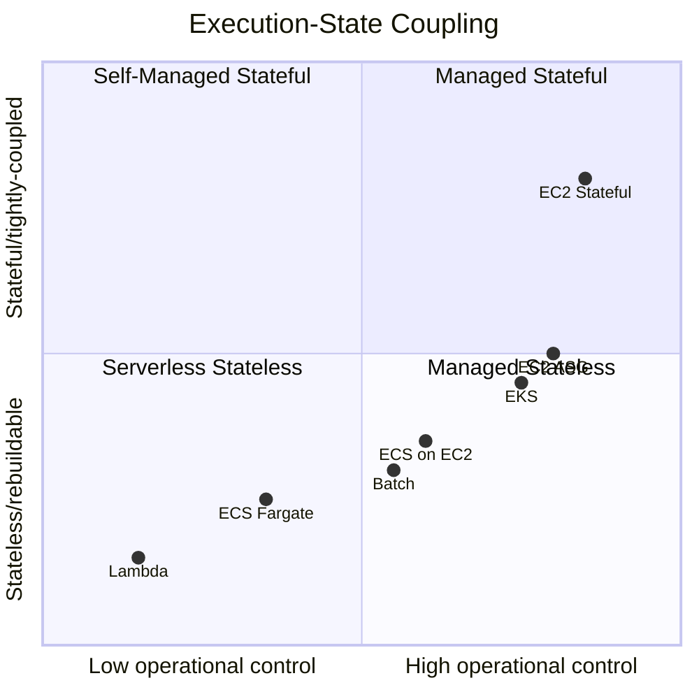
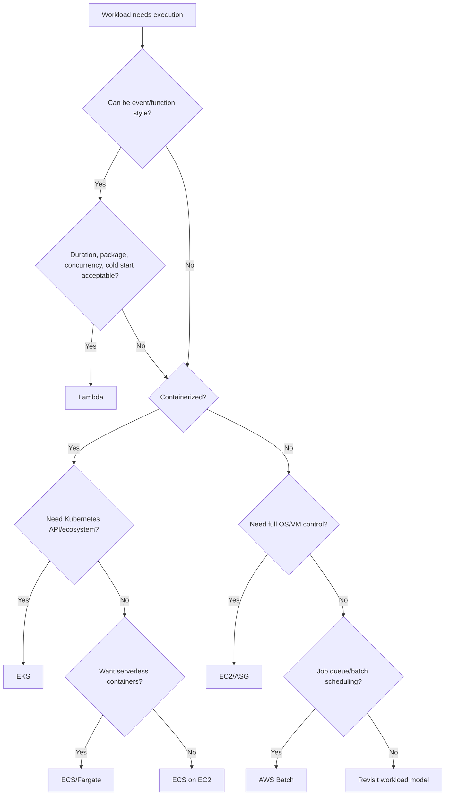
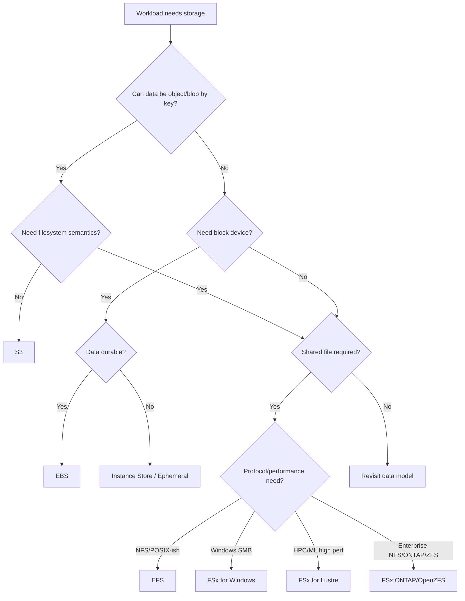
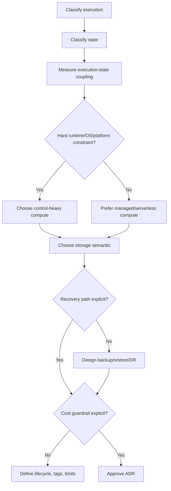

# Part 006 — AWS Compute-Storage Service Selection

Part sebelumnya menyatakan prinsip penting:

> Storage adalah kontrak, bukan disk.

Part ini menambahkan sisi compute:

> Compute adalah execution contract, bukan sekadar server.

Ketika compute dan storage dipilih bersama, kita tidak lagi bertanya:

- “Pakai EC2 atau Lambda?”
- “Pakai S3 atau EFS?”
- “Pakai ECS atau EKS?”

Kita bertanya:

```txt
What execution model does the workload need?
What state contract does the workload need?
How tightly are execution and state coupled?
What recovery path is acceptable?
What operational burden is the team willing to own?
```

AWS Compute Decision Guide menyatakan AWS compute services mencakup pilihan untuk virtual machines, containerized applications, serverless code, dan workload lain; layanan seperti EC2, ECS, EKS, Lambda, Fargate, dan Batch memenuhi kebutuhan workload yang berbeda. AWS Storage Decision Guide menyatakan storage harus dipilih berdasarkan kebutuhan workload dan bisnis, termasuk object, block, file, migration, dan hybrid use cases. Referensi resmi: <https://docs.aws.amazon.com/compute-on-aws-how-to-choose/> dan <https://docs.aws.amazon.com/decision-guides/latest/storage-on-aws-how-to-choose/choosing-aws-storage-service.html>.

---

## 1. Problem yang Diselesaikan

Banyak arsitektur AWS gagal bukan karena memilih service yang “buruk”, tetapi karena memilih service yang benar untuk masalah yang salah.

Contoh:

| Pilihan | Terlihat benar | Masalah tersembunyi |
|---|---|---|
| Lambda untuk semua job | serverless, autoscale | job butuh runtime panjang, large local scratch, fine-grained concurrency control |
| ECS Fargate untuk semua container | no server management | workload butuh GPU, custom kernel, high local NVMe, daemon pattern |
| EKS untuk semua platform | powerful, ecosystem besar | team belum siap operational complexity Kubernetes |
| EC2 untuk semua hal | kontrol penuh | terlalu banyak undifferentiated heavy lifting |
| EFS untuk shared uploads | mudah dipakai | aplikasi sebenarnya butuh immutable object store dan metadata index |
| EBS untuk durable state | performa bagus | state single-AZ, failover manual, backup belum application-consistent |
| S3 untuk application coordination | scalable | butuh transaction/lock, bukan object store |

Service selection harus mencegah dua hal:

1. **underfitting** — service terlalu sederhana untuk kebutuhan workload,
2. **overfitting** — service terlalu kompleks untuk kebutuhan workload.

Tujuan part ini adalah memberi decision framework yang bisa dipakai di design review, ADR, RFC, atau architecture board.

---

## 2. Mental Model: Execution-State Coupling

Compute dan storage harus dipilih berdasarkan tingkat coupling antara execution dan state.



Prinsip:

```txt
The more stateful and tightly coupled the workload is, the more explicit the recovery and placement design must be.
```

Stateless compute bisa diganti kapan saja. Stateful compute tidak bisa diperlakukan seperti ternak sepenuhnya kecuali state sudah dipisah, direplikasi, atau dapat direbuild.

---

## 3. Decision Inputs

Sebelum memilih service, kumpulkan input berikut.

### 3.1 Execution input

```txt
- Request/response, daemon, worker, batch job, scheduled job, event function, stream processor?
- Runtime duration: milliseconds, seconds, minutes, hours, days?
- Startup sensitivity: cold start acceptable or not?
- Needs custom OS/kernel/driver/GPU/NVMe?
- Needs long-lived connection?
- Needs local process supervision?
- Needs privileged container or host access?
- Needs custom networking or high packet-per-second tuning?
- Scaling unit: request, container, VM, job, pod, queue depth?
```

### 3.2 State input

```txt
- Stateless, ephemeral, cache, durable object, shared file, block device, database-like state?
- Data size and growth rate?
- IOPS, throughput, latency target?
- Single writer or multi-writer?
- Multi-AZ or single-AZ acceptable?
- RPO/RTO?
- Immutable, append-only, mutable, transactional?
- Retention and compliance?
```

### 3.3 Operational input

```txt
- Team skill: Linux/EC2, containers, Kubernetes, serverless, storage internals?
- Need platform standardization?
- Debugging maturity?
- IaC maturity?
- On-call ownership?
- Release frequency?
- Compliance and audit requirements?
- Cost sensitivity: idle, burst, predictable, unpredictable?
```

### 3.4 Constraint input

```txt
- Existing application architecture?
- Vendor/license constraints?
- Required protocol: HTTP, TCP, NFS, SMB, POSIX, block, S3 API?
- Data residency?
- Existing hybrid data center?
- Migration window?
- Performance benchmark evidence?
```

---

## 4. Compute Selection: Practical Decision Tree



### 4.1 Choose Lambda when

Use Lambda when the workload is:

- event-driven,
- short-to-medium duration,
- horizontally scalable by invocation,
- stateless or externalized state,
- tolerant of managed runtime constraints,
- naturally integrated with S3/SQS/EventBridge/API Gateway/Kinesis/DynamoDB,
- operationally better as function than service.

Good fit:

- image thumbnail generation,
- S3 object event processor,
- lightweight API endpoint,
- scheduled cleanup,
- async enrichment,
- webhook handler,
- fanout worker with bounded execution time.

Bad fit:

- long-running daemon,
- stateful process,
- custom kernel/driver,
- persistent socket server,
- high local disk requirement beyond model limits,
- workload needing exact host-level control.

Decision note:

> Lambda reduces server management, not system design. You still own concurrency, retries, idempotency, downstream backpressure, and state contract.

### 4.2 Choose ECS/Fargate when

Use ECS with Fargate when:

- workload is containerized,
- team wants less host management,
- task-level scaling is enough,
- OS/kernel customization is not required,
- persistent local host dependency is minimal,
- integration with AWS-native deployment model is desired.

Good fit:

- stateless API services,
- background workers,
- scheduled tasks,
- internal services,
- moderate container platform without Kubernetes overhead.

Bad fit:

- privileged host agents,
- custom kernel modules,
- special hardware/GPU needs not supported in chosen mode,
- deep node-level tuning,
- workloads needing tight daemon-per-host pattern.

### 4.3 Choose ECS on EC2 when

Use ECS on EC2 when:

- you want ECS orchestration,
- but need EC2-level control,
- workload benefits from reserved/spot/mixed instance fleets,
- local storage or instance type specialization matters,
- daemon/sidecar/agent placement matters,
- cost optimization through bin-packing is important.

Good fit:

- high-throughput API fleet,
- workers with large ephemeral disk,
- applications needing specialized instance families,
- mixed On-Demand/Spot capacity,
- workloads needing custom AMI.

Trade-off:

> You now own host lifecycle, AMI, patching, capacity provider behavior, draining, and node health.

### 4.4 Choose EKS when

Use EKS when:

- Kubernetes API is a requirement,
- platform already standardizes on Kubernetes,
- workload uses Kubernetes ecosystem/controllers/operators,
- multi-cloud/on-prem portability matters enough,
- custom scheduling/storage/networking ecosystem is valuable,
- team has real Kubernetes operational maturity.

Good fit:

- platform engineering environment,
- complex microservice platform,
- workloads needing Kubernetes CRDs/operators,
- stateful workloads with CSI-based volume management,
- multi-team shared cluster with governance.

Bad fit:

- small app with no Kubernetes need,
- team lacks cluster operations capacity,
- “because Kubernetes is industry standard” with no concrete need,
- high compliance workload without clear tenancy/isolation model.

Decision note:

> EKS is a platform substrate, not just a deployment target. Choose it when Kubernetes semantics are part of the solution, not merely a packaging format.

### 4.5 Choose EC2/Auto Scaling Group when

Use EC2 when:

- you need full OS/runtime control,
- custom kernel/driver/security agent is required,
- workload is not containerized or migration must be low-change,
- application expects VM lifecycle,
- stateful service needs block storage and explicit host model,
- performance tuning requires host-level control.

Good fit:

- self-managed database or broker,
- legacy app migration,
- high-performance custom server,
- specialized appliances,
- workloads with strict runtime assumptions.

Trade-off:

> EC2 gives control, but every control surface becomes an operational responsibility.

### 4.6 Choose AWS Batch when

Use AWS Batch when:

- workload is job-oriented,
- jobs can be queued and scheduled,
- retries/checkpoints matter,
- capacity can scale with job queue,
- workloads are containerized,
- Spot/On-Demand/Fargate trade-off is useful,
- HPC/data processing style scheduling matters.

Good fit:

- ETL batch,
- simulation,
- rendering,
- scientific compute,
- report generation,
- ML preprocessing,
- large asynchronous batch jobs.

AWS Batch can run containerized workloads and manage scheduling over compute environments such as ECS, EKS, EC2, Fargate, Spot, and On-Demand depending on configuration. Referensi: <https://docs.aws.amazon.com/batch/latest/userguide/what-is-batch.html>.

---

## 5. Storage Selection: Practical Decision Tree



### 5.1 Choose S3 when

Use S3 when:

- data is object/blob/document/artifact,
- access by key is natural,
- durability and scale are primary,
- lifecycle/archival/replication/versioning matter,
- many independent consumers read objects,
- event-driven processing is useful,
- object metadata and tags are sufficient at storage layer.

Good fit:

- uploads,
- exports,
- reports,
- data lake landing zone,
- backup artifacts,
- immutable evidence,
- static content,
- ML artifacts,
- logs archive.

Avoid when:

- app requires POSIX file operations,
- app requires low-latency random writes,
- app requires multi-object transactions without additional protocol,
- app uses listing as hot critical path.

### 5.2 Choose EBS when

Use EBS when:

- EC2 instance needs durable block device,
- workload has database-like random I/O,
- filesystem/local path is required,
- one active owner pattern is acceptable,
- AZ coupling is understood,
- backup/restore/failover are explicit.

Good fit:

- boot volume,
- database disk,
- broker disk,
- search index node disk,
- stateful VM migration.

Avoid when:

- multiple compute nodes need concurrent shared file access,
- state must transparently move across AZs without design,
- workload could be redesigned as object storage,
- team will not own backup/restore testing.

### 5.3 Choose instance store when

Use instance store when:

- data can be lost,
- high local I/O matters,
- workload uses scratch/cache/spill/temp,
- final output is committed elsewhere,
- node replacement is expected.

Good fit:

- cache,
- temporary processing directory,
- shuffle/spill,
- local build cache,
- transient ML preprocessing,
- high-speed scratch.

Rule:

```txt
Never put irreplaceable data only on instance store.
```

### 5.4 Choose EFS when

Use EFS when:

- Linux workloads need shared file system,
- multiple compute services need same file tree,
- serverless/container integration needs mounted shared storage,
- POSIX-like access is useful,
- app migration from NFS-like model is required.

Good fit:

- shared uploads for legacy apps,
- content management shared files,
- home directories,
- Lambda/ECS/EKS shared data,
- moderate shared file workloads.

Avoid when:

- workload is actually immutable object archive,
- app is metadata-operation heavy without benchmark,
- file system is used as distributed queue or lock service,
- temp files could be local scratch instead.

### 5.5 Choose FSx family when

Use FSx when you need a specific file system/protocol/performance model.

| Service | Choose when |
|---|---|
| FSx for Windows File Server | Windows/SMB enterprise file workloads, AD integration, Windows app compatibility |
| FSx for Lustre | HPC, ML, high-throughput file access, S3-linked datasets, scratch/performance file system |
| FSx for NetApp ONTAP | ONTAP features, enterprise migration, NFS/SMB/iSCSI, snapshots/clones, storage efficiency |
| FSx for OpenZFS | ZFS semantics, snapshots/clones, NFS workloads, performance-oriented file system |

Avoid defaulting to FSx just because EFS seems too simple. FSx is powerful, but power brings configuration and operational complexity.

### 5.6 Choose Storage Gateway/DataSync/Snow/Transfer Family when

Use migration/hybrid transfer services when:

- data originates on-prem,
- migration window matters,
- network bandwidth is limited,
- protocol compatibility matters,
- offline physical transfer is needed,
- hybrid access must continue during transition,
- external parties need managed transfer interface.

Typical mapping:

| Need | Service family |
|---|---|
| Online data transfer to AWS storage | AWS DataSync |
| Hybrid file/volume/tape gateway | AWS Storage Gateway |
| Physical/offline large data migration | AWS Snow Family |
| Managed SFTP/FTPS/FTP into AWS storage | AWS Transfer Family |

---

## 6. Compute + Storage Pairing Matrix

Service selection becomes clearer when paired.

| Compute | Natural storage pair | Why |
|---|---|---|
| Lambda | S3, EFS, DynamoDB, SQS | event-driven, externalized state, bounded execution |
| ECS Fargate | S3, EFS, external DB | container without host storage ownership |
| ECS on EC2 | S3, EBS, EFS, instance store, FSx | more host/storage control |
| EKS | CSI: EBS/EFS/FSx/S3 integration, S3, external DB | Kubernetes storage abstractions and controllers |
| EC2 ASG stateless | S3, EFS, external DB, instance store cache | replaceable compute |
| EC2 stateful | EBS, FSx, S3 backup/artifact | explicit host-state coupling |
| AWS Batch | S3, FSx for Lustre, EBS, instance store | job input/output, scratch, high throughput |
| Hybrid/edge compute | Storage Gateway, DataSync, S3, FSx, local cache | latency/data residency/migration constraints |

---

## 7. Workload Archetype Decision Map

### 7.1 Stateless Web API

Typical requirement:

```txt
HTTP API, horizontally scalable, no local durable state, external database/object storage.
```

Good options:

| Option | When |
|---|---|
| Lambda | event/API style, low ops, bounded runtime |
| ECS Fargate | containerized API, simple service operations |
| ECS on EC2 | cost/bin-packing/custom host needs |
| EKS | platform standard already Kubernetes |
| EC2 ASG | legacy VM app or host-level control |

Storage:

- S3 for uploads/artifacts,
- external DB for transaction state,
- local ephemeral only for cache/temp,
- EFS only if app truly requires shared path.

### 7.2 Background Worker

Requirement:

```txt
Consumes queue, processes jobs, writes output.
```

Good options:

- Lambda for short event jobs,
- ECS/Fargate for longer container workers,
- ECS/EC2 for high-volume cost control or local disk,
- Batch for queued batch scheduling,
- EKS if platform standard.

Storage:

- S3 input/output,
- local scratch for temp,
- EFS/FSx only for shared working set,
- EBS if worker owns durable local state, usually avoid.

### 7.3 Stateful Database on EC2

Requirement:

```txt
Self-managed DB, durable block storage, specific OS/version/control needs.
```

Good option:

- EC2 + EBS, sometimes FSx depending database/storage design.

Storage contract:

- one primary writer,
- app-consistent backups,
- snapshot/restore tested,
- WAL/log/data layout explicit,
- failover documented,
- AZ coupling understood.

Challenge:

> Should this be managed database instead? If not, document why.

### 7.4 Document Processing Pipeline

Requirement:

```txt
Upload documents, validate, transform, extract metadata, retain original.
```

Good options:

- S3 for original and result artifacts,
- Lambda for lightweight transforms,
- ECS/Batch for heavy processing,
- local scratch for temporary files,
- DB for metadata,
- audit log for lifecycle.

Avoid:

- EC2 local disk as upload source-of-truth,
- EFS as general pipeline bus,
- bucket listing as primary job scheduler.

### 7.5 HPC / Simulation / ML Preprocessing

Requirement:

```txt
Large datasets, high throughput, parallel jobs, scratch space, checkpointing.
```

Good options:

- AWS Batch/EKS/EC2 depending scheduler model,
- S3 as durable dataset/artifact layer,
- FSx for Lustre for high-performance shared file system,
- instance store for local scratch,
- EBS for node-local durable block where needed.

Key question:

```txt
Is the high-performance file system source-of-truth or scratch/cache over S3?
```

### 7.6 Legacy Enterprise File Application

Requirement:

```txt
App expects shared file path, SMB/NFS, directory tree, possibly AD integration.
```

Good options:

- EFS for Linux/NFS-like shared file,
- FSx for Windows File Server for Windows SMB/AD,
- FSx ONTAP/OpenZFS for enterprise feature requirements,
- EC2/ECS/EKS compute depending runtime.

Migration path:

1. identify durable shared files,
2. separate temp/cache,
3. benchmark metadata pattern,
4. define backup/retention,
5. test app locking behavior.

### 7.7 Audit Evidence / Regulatory Record

Requirement:

```txt
Immutable evidence, retention, auditability, controlled deletion, recoverability.
```

Good options:

- S3 with versioning/object lock where required,
- metadata DB,
- audit log,
- replication/backup policy,
- strict IAM/KMS boundary,
- event-driven validation.

Avoid:

- mutable shared files,
- overwrite-in-place,
- cron deletion,
- storage without owner/retention class.

---

## 8. Service Selection by Constraint

### 8.1 Need lowest operational burden

Prefer:

- Lambda,
- Fargate,
- S3,
- managed file systems,
- managed backup/lifecycle.

But remember:

```txt
Managed infrastructure does not mean managed correctness.
```

You still own:

- idempotency,
- data model,
- concurrency,
- retries,
- authorization boundary,
- recovery validation,
- cost behavior.

### 8.2 Need maximum control

Prefer:

- EC2,
- ECS on EC2,
- EKS,
- EBS,
- FSx specialized options,
- instance store.

But remember:

```txt
Control increases operational surface area.
```

You own:

- host image,
- patching,
- scaling behavior,
- failure handling,
- backup consistency,
- tuning,
- incident debugging.

### 8.3 Need fast scale-to-zero / burst

Prefer:

- Lambda,
- Fargate tasks,
- Batch with dynamic compute,
- S3 as durable input/output,
- queues as buffers.

Watch:

- cold starts,
- concurrency limits,
- downstream saturation,
- startup time,
- image pull time,
- data loading overhead.

### 8.4 Need long-running process

Prefer:

- ECS,
- EKS,
- EC2,
- Batch for jobs,
- not Lambda unless within runtime constraints and semantics fit.

Watch:

- deployment draining,
- health checks,
- persistent connection behavior,
- storage cleanup,
- checkpointing.

### 8.5 Need shared mutable data

First challenge the need.

Ask:

```txt
Is shared mutable file state truly required, or can we use DB/object/event model?
```

If truly required:

- EFS for Linux shared file,
- FSx for Windows/ONTAP/OpenZFS/Lustre depending protocol/performance,
- clear locking/concurrency model,
- benchmark real workload.

### 8.6 Need high random I/O

Prefer:

- EBS SSD volume types for EC2 block workloads,
- managed database storage if using managed DB,
- io2/gp3 choices based on measured IOPS/throughput/latency.

Avoid:

- S3 for in-place random update,
- EFS for database disk unless vendor/application specifically supports and benchmark proves it,
- HDD volumes for random small I/O.

Amazon EBS volume types differ in performance characteristics and price; SSD-backed volumes are suited to random or sequential I/O, while HDD-backed volumes are optimized for large sequential I/O patterns. Referensi: <https://docs.aws.amazon.com/ebs/latest/userguide/ebs-volume-types.html> and <https://docs.aws.amazon.com/ebs/latest/userguide/ebs-io-characteristics.html>.

### 8.7 Need immutable large object retention

Prefer:

- S3,
- versioning,
- Object Lock where required,
- lifecycle/retention policy,
- metadata index,
- replication if recovery/failover requires.

Avoid:

- shared mutable file paths,
- overwrite by same key without versioning,
- lifecycle policy not aligned to business retention.

---

## 9. Architecture Decision Record Template

Use this when approving compute-storage choices.

```mdx
# ADR: Compute and Storage Selection for <workload>

## Context
What workload are we deploying? What business capability does it support?

## Execution Requirements
- Workload type:
- Runtime duration:
- Scaling signal:
- Startup sensitivity:
- OS/runtime constraints:
- Hardware requirements:

## State Requirements
- Data classes:
- Access semantics:
- Mutability:
- Consistency:
- Concurrency:
- Lifecycle:
- RPO/RTO:

## Options Considered
1. <Option A>
2. <Option B>
3. <Option C>

## Decision
Chosen compute:
Chosen storage:

## Why
Why this combination fits execution and state contract.

## Rejected Alternatives
Why not Lambda/ECS/EKS/EC2/S3/EBS/EFS/FSx/etc.

## Failure Modes
- Instance failure:
- AZ impairment:
- storage latency:
- accidental delete:
- deployment rollback:
- quota/capacity exhaustion:

## Operations
- Metrics:
- Alerts:
- Backup:
- Restore test:
- Runbook:
- Cost guardrail:

## Review Trigger
When should we revisit this decision?
```

A good ADR is not long. It makes trade-offs visible.

---

## 10. Anti-Patterns and Corrections

### 10.1 “Lambda because no servers”

Correction:

```txt
Choose Lambda if event/function semantics fit. Do not use it to avoid thinking about concurrency, retries, idempotency, and downstream capacity.
```

### 10.2 “Kubernetes because portability”

Correction:

```txt
Choose EKS if Kubernetes API/ecosystem is required and the team can operate it. Portability is not free if storage, IAM, networking, and observability are AWS-specific anyway.
```

### 10.3 “EC2 because easiest to understand”

Correction:

```txt
EC2 is often easiest to start, but not always easiest to operate. Account for patching, image drift, scaling, backup, recovery, and host failure.
```

### 10.4 “EFS because multiple services need files”

Correction:

```txt
First ask whether they need files or shared state. If the data is immutable artifact, use S3 + metadata. If it is coordination, use queue/DB/lock service.
```

### 10.5 “S3 as database”

Correction:

```txt
S3 can store objects durably and consistently, but application-level query, transaction, indexing, and locking usually belong elsewhere.
```

### 10.6 “EBS makes state safe”

Correction:

```txt
EBS makes block data persistent independent from instance lifecycle, but recovery, consistency, backup, AZ coupling, and failover are still your design.
```

---

## 11. Worked Examples

### 11.1 Case Intake API

Requirement:

```txt
User submits case intake form with attachments.
API must scale with traffic.
Attachments must be durable and immutable after submit.
Metadata must be queryable.
```

Decision:

| Layer | Choice | Reason |
|---|---|---|
| Compute | ECS Fargate or Lambda | depends on API/runtime complexity; both externalize state |
| Attachment storage | S3 | object durability, lifecycle, versioning, event integration |
| Metadata | database | query and transaction semantics |
| Async processing | SQS + Lambda/ECS worker | decouple upload from processing |
| Temp processing | ephemeral/local scratch | rebuildable intermediate state |

Avoid:

- saving uploads to container local disk,
- EFS as source-of-truth unless legacy file app requires it,
- overwrite existing evidence key.

### 11.2 Self-Managed Search Cluster

Requirement:

```txt
Search nodes need fast local persistent disk and full JVM/OS tuning.
Cluster can rebuild replicas but primary data durability matters.
```

Decision:

| Layer | Choice | Reason |
|---|---|---|
| Compute | EC2 ASG or self-managed EC2 fleet | host/JVM/disk tuning |
| Node storage | EBS gp3/io2 depending benchmark | durable block storage |
| Snapshot repository | S3 | durable backup/restore artifact |
| Scratch/cache | instance store if acceptable | high-speed rebuildable data |

Key invariant:

```txt
Cluster replication is not backup. Snapshot/restore to S3 must be tested.
```

### 11.3 Video Transcoding Pipeline

Requirement:

```txt
Large files uploaded, transcoded into variants, output served later.
Processing can be retried.
```

Decision:

| Layer | Choice | Reason |
|---|---|---|
| Raw input | S3 | durable object input |
| Compute | AWS Batch or ECS workers | long/heavy jobs, controlled concurrency |
| Scratch | instance store or EBS temp | local processing |
| Output | S3 | durable object variants |
| Job state | queue/database | retry/idempotency/progress |

Avoid:

- shared filesystem for all intermediate files unless benchmark proves need,
- processing directly against S3 for every small temp operation,
- no checkpoint for long jobs.

### 11.4 Enterprise Windows File Migration

Requirement:

```txt
Existing Windows application expects SMB share and Active Directory permissions.
```

Decision:

| Layer | Choice | Reason |
|---|---|---|
| Compute | EC2 Windows / ECS Windows if appropriate | application compatibility |
| Storage | FSx for Windows File Server | SMB + Windows file workload semantics |
| Migration | DataSync or file migration tooling | controlled data movement |
| Backup | AWS Backup / snapshots | recovery and retention |

Challenge:

```txt
Can some immutable archive data be moved to S3 instead of expensive file share?
```

### 11.5 Analytics Landing Zone

Requirement:

```txt
Ingest raw events/files, partition by time/entity, process later, retain history.
```

Decision:

| Layer | Choice | Reason |
|---|---|---|
| Raw storage | S3 | object/data lake pattern |
| Compute | Glue/EMR/Batch/EKS depending stack | processing model varies |
| Metadata | catalog/table metadata | avoid raw listing as app logic |
| Lifecycle | S3 lifecycle | hot/warm/archive/delete by policy |
| Commit | manifest/table transaction protocol | avoid partial read |

Avoid:

- millions of tiny files with no compaction,
- lifecycle without data classification,
- direct mutable overwrite of partitions without transaction protocol.

---

## 12. Review Questions for Design Review

Ask these before approving architecture.

### 12.1 Compute questions

```txt
[ ] What is the unit of scale: request, task, pod, instance, job?
[ ] What is the scaling signal?
[ ] What happens during deploy rollback?
[ ] What happens if a node dies mid-request/job?
[ ] What happens if startup becomes slow?
[ ] Is cold start acceptable?
[ ] Is host-level control required?
[ ] Is Kubernetes actually required?
[ ] Is the workload long-running or event-bounded?
[ ] What quotas can stop scale-out?
```

### 12.2 Storage questions

```txt
[ ] What data is source-of-truth?
[ ] What data is scratch/cache?
[ ] What data is immutable?
[ ] What data is transactional?
[ ] What data is shared mutable state?
[ ] What is the read/write pattern?
[ ] What is RPO/RTO?
[ ] What is the lifecycle/retention rule?
[ ] How is accidental deletion recovered?
[ ] How is storage cost contained?
```

### 12.3 Coupling questions

```txt
[ ] Can compute be replaced without data loss?
[ ] Can compute move AZ without storage issue?
[ ] Does storage force workload into one AZ?
[ ] Does scaling compute multiply storage contention?
[ ] Does retry amplify storage writes?
[ ] Does deployment create object/file format compatibility issue?
[ ] Does backup require application quiescence?
[ ] Does recovery require IAM/KMS permissions not tested in normal path?
```

---

## 13. A Compact Selection Algorithm

Use this as a practical algorithm.

```txt
1. Classify workload execution.
   - function/event, service, worker, job, VM, platform, hybrid?

2. Classify state.
   - none, ephemeral, cache, object, block, shared file, database-like, archive?

3. Measure coupling.
   - can compute die without losing truth?
   - can state move independently?

4. Choose lowest operational burden that satisfies hard constraints.
   - start from Lambda/Fargate/S3 when semantic fits.
   - move toward ECS/EKS/EC2/EBS/FSx only when control/semantic requires.

5. Define recovery before launch.
   - backup without restore test is not recovery.

6. Define cost guardrail before traffic.
   - cost behavior is architecture behavior.

7. Document rejected alternatives.
   - future engineers need to know why.
```

Mermaid version:



---

## 14. Where This Series Goes Next

This part is a decision map. The next parts deepen each axis:

- Part 007: production invariants for compute-storage,
- Part 008: reference architecture map,
- Part 009 onward: EC2 from first principles,
- then Auto Scaling, EBS, instance store, S3, EFS, FSx, containers, Lambda, Batch, hybrid, and capstone.

The important habit:

```txt
Never approve a compute choice without a state contract.
Never approve a storage choice without an execution model.
```

---

## 15. Summary

AWS service selection is not a popularity contest.

Good selection flows from five questions:

```txt
1. What execution model does the workload need?
2. What state contract does the workload need?
3. How tightly are execution and state coupled?
4. What recovery path is acceptable?
5. What operational burden is the team willing to own?
```

Rules of thumb:

- Lambda for event/function workloads with externalized state.
- Fargate for container workloads without host ownership.
- ECS on EC2 when container orchestration plus host control is needed.
- EKS when Kubernetes API/ecosystem is a real requirement.
- EC2 when VM/OS/hardware/control requirements dominate.
- Batch when queued job scheduling is the natural model.
- S3 for object storage and durable artifacts.
- EBS for EC2-attached block storage.
- Instance store for ephemeral high-speed local data.
- EFS for shared Linux file semantics.
- FSx when specific enterprise/HPC/file system semantics are needed.
- Migration/hybrid services when data movement and compatibility dominate.

The best architecture is usually the simplest service combination that satisfies the real execution-state contract and has a tested failure recovery path.

---

## References

- AWS Compute Decision Guide — <https://docs.aws.amazon.com/compute-on-aws-how-to-choose/>
- AWS Storage Decision Guide — <https://docs.aws.amazon.com/decision-guides/latest/storage-on-aws-how-to-choose/choosing-aws-storage-service.html>
- Amazon EC2 User Guide — <https://docs.aws.amazon.com/AWSEC2/latest/UserGuide/concepts.html>
- Amazon EC2 storage options — <https://docs.aws.amazon.com/AWSEC2/latest/UserGuide/Storage.html>
- Amazon EBS volume types — <https://docs.aws.amazon.com/ebs/latest/userguide/ebs-volume-types.html>
- Amazon EBS I/O characteristics — <https://docs.aws.amazon.com/ebs/latest/userguide/ebs-io-characteristics.html>
- Amazon ECS Developer Guide — <https://docs.aws.amazon.com/AmazonECS/latest/developerguide/Welcome.html>
- Amazon EKS User Guide: Storage — <https://docs.aws.amazon.com/eks/latest/userguide/storage.html>
- AWS Lambda Developer Guide — <https://docs.aws.amazon.com/lambda/latest/dg/welcome.html>
- AWS Batch User Guide — <https://docs.aws.amazon.com/batch/latest/userguide/what-is-batch.html>
