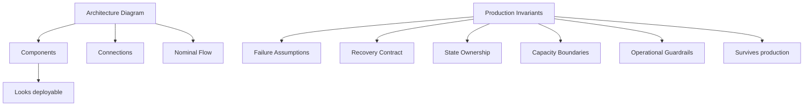
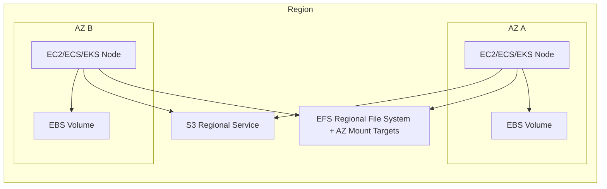
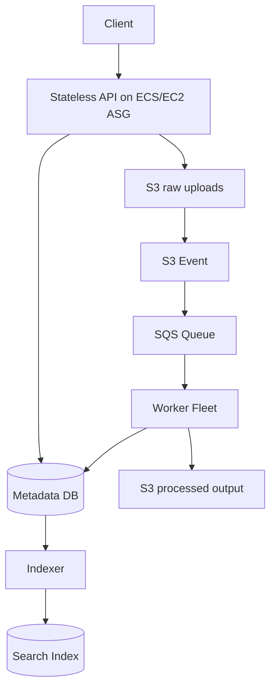

# Part 007 — Production Invariants for Compute-Storage

Part sebelumnya membahas cara memilih layanan AWS compute dan storage.

Part ini membahas hal yang lebih penting daripada pemilihan layanan:

> Apa aturan yang harus selalu benar agar sistem compute-storage tetap aman saat production kacau?

Service choice bisa berubah. EC2 bisa diganti ECS. Worker bisa dipindah dari VM ke Fargate. Upload bisa berpindah dari EFS ke S3. Tetapi sistem production yang sehat biasanya menjaga invariants yang sama.

AWS Well-Architected Framework menggunakan enam pilar: operational excellence, security, reliability, performance efficiency, cost optimization, dan sustainability. Reliability Pillar menekankan workload harus dapat menangani perubahan demand, mendeteksi failure, dan melakukan automatic healing. AWS Fault Isolation Boundaries menjelaskan bahwa AWS memiliki boundary seperti Region, Availability Zone, control plane, dan data plane; boundary inilah yang harus masuk ke desain, bukan hanya diagram logical. Referensi resmi: <https://docs.aws.amazon.com/wellarchitected/latest/framework/welcome.html>, <https://docs.aws.amazon.com/wellarchitected/latest/reliability-pillar/welcome.html>, dan <https://docs.aws.amazon.com/whitepapers/latest/aws-fault-isolation-boundaries/abstract-and-introduction.html>.

---

## 1. Problem yang Diselesaikan

Arsitektur sering tampak benar saat dilihat sebagai diagram service:

```txt
ALB -> ECS -> RDS
ALB -> EC2 -> EBS
S3 -> Lambda -> DynamoDB
EKS -> EBS PVC
```

Namun diagram seperti itu belum menjawab pertanyaan production:

```txt
Apa yang tetap benar saat 1 AZ hilang?
Apa yang tetap benar saat instance diganti?
Apa yang tetap benar saat deployment gagal setengah jalan?
Apa yang tetap benar saat autoscaling terlambat?
Apa yang tetap benar saat snapshot restore ternyata lambat?
Apa yang tetap benar saat data tertulis dua kali?
Apa yang tetap benar saat control plane service sedang degraded?
```

Production invariant adalah aturan desain yang tetap harus benar di semua kondisi tersebut.

Tanpa invariant, sistem hanya punya konfigurasi. Dengan invariant, sistem punya kontrak operasional.

---

## 2. Mental Model: Invariant > Architecture Diagram

Architecture diagram menunjukkan apa yang terhubung.

Invariant menunjukkan apa yang tidak boleh rusak.



Cara berpikirnya:

```txt
Service adalah pilihan.
Topology adalah bentuk.
Invariant adalah hukum.
```

Jika sebuah desain melanggar invariant, desain itu rapuh meskipun memakai layanan AWS yang benar.

---

## 3. Core Production Invariants

Daftar di bawah adalah invariant yang akan terus dipakai di seluruh seri ini.

### Invariant 1 — Compute Harus Rebuildable

Compute production tidak boleh diperlakukan sebagai benda unik yang harus diselamatkan.

Target mental model:

```txt
A broken compute node is replaced, not repaired.
```

Ini berlaku untuk:

- EC2 instance dalam Auto Scaling Group,
- ECS task,
- EKS pod/node,
- Lambda execution environment,
- AWS Batch job container,
- worker queue consumer.

Compute boleh memiliki local cache atau scratch data, tetapi data tersebut harus dapat dibuang.

#### Desain yang benar

```txt
- Bootstrap instance/task/pod dari image + config + secret reference.
- Tidak ada manual change yang hanya hidup di satu node.
- Tidak ada state bisnis permanen di root volume tanpa backup/recovery contract.
- Semua node bisa diganti oleh automation.
- Recovery path diuji dengan replace, bukan hanya restart.
```

#### Anti-pattern

```txt
- SSH ke instance untuk patch manual.
- Upload file user ke local disk EC2.
- Menyimpan queue offset hanya di local file.
- Cron penting hanya berjalan di satu VM tanpa leader election.
- Stateful pod memakai local path tanpa recovery strategy.
```

### Invariant 2 — State Harus Punya Owner Eksplisit

State yang tidak punya owner akan menjadi sumber incident.

Setiap state harus menjawab:

```txt
Who owns this data?
Where is the source of truth?
Who can mutate it?
How is it recovered?
How long is it retained?
What happens if duplicated?
What happens if partially written?
```

Contoh:

| State | Owner yang sehat | Owner yang buruk |
|---|---|---|
| Uploaded file | S3 bucket + metadata table | local disk app server |
| Job intermediate result | S3 prefix/job-id atau ephemeral scratch | random `/tmp` tanpa cleanup |
| Search index | rebuildable projection | satu-satunya source of truth |
| User session | external session store/token | memory satu instance |
| Application config | versioned config source | manual edit di node |
| DB backup | backup policy + restore runbook | snapshot tanpa restore test |

### Invariant 3 — Failure Domain Harus Terlihat di Desain

AWS Fault Isolation Boundaries membedakan boundary seperti Region, AZ, zonal service, regional service, control plane, dan data plane. EC2 dan EBS adalah contoh layanan zonal; S3 adalah regional service yang menggunakan isolasi dan redundancy AZ di balik regional endpoint.

Desain harus menunjukkan boundary ini.



Pertanyaan desain:

```txt
- Resource ini zonal atau regional?
- Jika AZ A hilang, apa yang masih bisa serve traffic?
- Jika resource zonal harus pindah AZ, data ikut bagaimana?
- Jika regional endpoint degraded, aplikasi degrade seperti apa?
- Apakah control plane diperlukan saat recovery panas?
```

### Invariant 4 — Multi-AZ Bukan Otomatis Reliable

Multi-AZ hanya membantu jika workload benar-benar bisa beroperasi lintas AZ.

Multi-AZ yang buruk:

```txt
- App server ada di 2 AZ, tetapi semua state ada di 1 EBS volume.
- ECS service multi-AZ, tetapi task hanya sehat saat mount target EFS tertentu stabil.
- EKS node multi-AZ, tetapi StatefulSet PVC terikat ke satu AZ dan reschedule gagal.
- S3 dipakai lintas AZ, tetapi metadata database single-AZ.
```

Multi-AZ yang sehat:

```txt
- Compute stateless tersebar lintas AZ.
- State durable menggunakan layanan yang sesuai failure model-nya.
- Routing bisa mengurangi traffic ke AZ bermasalah.
- Queue/backlog dapat menyerap temporary loss of capacity.
- Recovery tidak butuh operator membuat resource manual saat incident.
```

### Invariant 5 — Recovery Path Harus Lebih Sederhana daripada Failure

Jika recovery membutuhkan 17 langkah manual saat orang panik, recovery itu belum layak production.

Recovery path harus:

```txt
- documented,
- automated sejauh mungkin,
- tested,
- observable,
- reversible atau at least bounded,
- punya owner jelas,
- tidak tergantung pada resource yang sedang gagal.
```

Contoh buruk:

```txt
Jika EC2 stateful mati:
1. Cari snapshot terakhir.
2. Buat volume baru.
3. Attach manual ke instance baru.
4. Edit fstab.
5. Jalankan script migration.
6. Update DNS.
7. Restart service.
8. Berdoa.
```

Contoh lebih sehat:

```txt
- AMI versioned.
- Launch Template immutable.
- EBS snapshot policy jelas.
- Restore procedure scripted.
- DNS/routing controlled by deployment automation.
- Synthetic check membuktikan service healthy.
```

### Invariant 6 — Write Path Harus Idempotent

Compute-storage incident sering berubah menjadi data incident karena write path tidak idempotent.

Kondisi yang menyebabkan duplicate/partial write:

```txt
- Lambda retry.
- SQS redelivery.
- ECS task killed during processing.
- Spot interruption.
- Client retry setelah timeout.
- Multipart upload gagal sebagian.
- Batch job retry setelah checkpoint ambigu.
- Deployment mengganti worker saat job masih berjalan.
```

Write path sehat memiliki:

```txt
- idempotency key,
- deterministic object key,
- conditional write jika tersedia,
- checkpoint eksplisit,
- side-effect ordering jelas,
- reconciliation job,
- poison-message handling,
- audit trail.
```

### Invariant 7 — Capacity Harus Didesain untuk Degraded Mode

Sistem tidak cukup berjalan saat semua sehat.

Ia harus tetap bekerja saat kapasitas sebagian hilang.

Contoh target:

```txt
- Jika 1 AZ hilang, kapasitas tersisa cukup untuk critical traffic.
- Jika Spot capacity hilang, On-Demand fallback tersedia untuk workload prioritas.
- Jika downstream lambat, queue menahan lonjakan dan worker menurunkan concurrency.
- Jika warm pool habis, sistem degrade gracefully, bukan overload total.
```

Capacity invariant:

```txt
Peak healthy capacity is not the same as survivable capacity.
```

### Invariant 8 — Control Plane Tidak Boleh Menjadi Satu-satunya Recovery Jalan Panas

Banyak service AWS memiliki control plane dan data plane. Saat incident, kemampuan data plane bisa tetap berjalan tetapi operasi control plane seperti create/update/delete resource bisa terganggu atau lambat.

Desain sehat:

```txt
- Kapasitas kritikal sudah pre-provisioned atau punya buffer.
- Recovery umum tidak selalu membutuhkan create resource baru.
- Deployment freeze bisa dilakukan tanpa merusak runtime.
- Data plane operation tetap berjalan saat control plane action ditunda.
```

Contoh:

| Situasi | Desain rapuh | Desain lebih sehat |
|---|---|---|
| Traffic spike | baru membuat semua capacity saat spike | baseline + autoscale + warm capacity |
| AZ issue | operator membuat manual replacement | pre-existing multi-AZ capacity |
| Restore | hanya tahu klik console | scripted restore + tested path |
| Secret/config change | harus update semua node manual | versioned config + controlled rollout |

### Invariant 9 — Backup Bukan Recovery

Snapshot, backup, replication, dan lifecycle rule bukan bukti recovery.

Bukti recovery adalah restore yang berhasil memenuhi RPO/RTO.

```txt
Backup answers: Do we have bytes somewhere?
Recovery answers: Can we bring the system back correctly in time?
```

Untuk setiap durable state:

```txt
- Apa RPO?
- Apa RTO?
- Restore diuji kapan terakhir?
- Apakah backup application-consistent atau hanya crash-consistent?
- Apakah encryption key tersedia saat restore?
- Apakah dependency restore juga tersedia?
- Apakah restore target berbeda AZ/Region/account diuji?
```

### Invariant 10 — Observability Harus Ada di Boundary, Bukan Hanya di Node

Monitoring node saja tidak cukup.

Boundary penting:

```txt
- client -> load balancer,
- load balancer -> compute,
- compute -> storage,
- compute -> queue,
- queue -> worker,
- worker -> object store,
- compute -> block/file system,
- backup -> restore,
- deployment -> runtime health.
```

Metric yang berguna:

| Boundary | Signal |
|---|---|
| Ingress | request rate, p95/p99 latency, 5xx, target health |
| Compute | CPU, memory, saturation, restart count, throttling |
| Queue | depth, age of oldest message, redrive count |
| S3 | request count, 4xx/5xx, first-byte latency, lifecycle/storage metrics |
| EBS | queue length, throughput, IOPS, latency, burst balance |
| EFS/FSx | throughput, metadata pressure, client errors |
| Backup | backup age, restore success, restore duration |
| Deployment | error budget burn, rollback count, unhealthy replacement |

### Invariant 11 — Quota dan Limit Adalah Bagian dari Arsitektur

Quota bukan detail administratif.

Quota adalah capacity boundary.

Contoh quota/limit yang sering menjadi incident:

```txt
- EC2 On-Demand instance limit.
- EBS volume/IOPS/throughput limits.
- Elastic IP limit.
- ENI/IP exhaustion.
- Lambda concurrency limit.
- S3 request/cost amplification.
- EFS throughput mode constraints.
- ECS/EKS node capacity and pod density.
- AWS Batch compute environment capacity.
```

Invariant:

```txt
Every scaling plan must include quota headroom.
```

### Invariant 12 — Cost Harus Bisa Diterangkan oleh Workload Shape

Cost optimization bukan sekadar mencari service murah.

Cost yang sehat bisa dijelaskan:

```txt
- Apa unit cost per request/job/GB/object/customer?
- Apa fixed cost vs variable cost?
- Apa idle cost?
- Apa retry cost?
- Apa storage retention cost?
- Apa data movement cost?
- Apa cost of resilience?
```

Cost incident sering berasal dari:

```txt
- lifecycle rule tidak ada,
- retry storm,
- small-file problem,
- over-provisioned EBS IOPS,
- idle EC2 fleet,
- NAT/data transfer amplification,
- logging berlebihan,
- orphaned snapshots/volumes,
- forgotten test clusters.
```

---

## 4. Production Design Checklist

Gunakan checklist ini saat design review compute-storage.

### 4.1 Compute checklist

```txt
[ ] Compute unit bisa direbuild dari image/config/secret reference.
[ ] Tidak ada manual state penting di node.
[ ] Health check merepresentasikan kemampuan serve traffic, bukan sekadar process alive.
[ ] Shutdown path graceful dan bounded.
[ ] Replacement path sudah diuji.
[ ] Autoscaling metric sesuai bottleneck nyata.
[ ] Quota headroom cukup.
[ ] Deployment bisa rollback.
[ ] Node/task/pod interruption tidak membuat data corrupt.
```

### 4.2 Storage checklist

```txt
[ ] Source of truth jelas.
[ ] Ownership jelas.
[ ] Access pattern cocok dengan storage type.
[ ] Durability dan availability contract cocok dengan business impact.
[ ] Backup dan restore diuji.
[ ] Retention/lifecycle policy eksplisit.
[ ] Encryption key dependency dipahami.
[ ] Write path idempotent.
[ ] Partial write bisa dideteksi.
[ ] Cleanup orphaned object/volume/snapshot ada.
```

### 4.3 Failure-domain checklist

```txt
[ ] Resource zonal/regional/global ditandai.
[ ] AZ loss scenario dijelaskan.
[ ] Region impairment scenario dijelaskan jika workload critical.
[ ] Control plane dependency saat recovery diketahui.
[ ] Data plane behavior saat degraded diketahui.
[ ] Blast radius dibatasi per tenant/service/job jika relevan.
```

### 4.4 Operation checklist

```txt
[ ] Runbook tersedia untuk top failure modes.
[ ] Alert berbasis user-impact/saturation, bukan noise metric.
[ ] Dashboard menunjukkan boundary compute-storage.
[ ] Restore drill dilakukan berkala.
[ ] Game day minimal mencakup node loss, AZ loss, storage latency, quota hit.
[ ] Cost dashboard punya unit economics.
```

---

## 5. Implementation Pattern: Invariant-Driven ADR

Gunakan format ADR berikut untuk setiap keputusan compute-storage.

```mdx
# ADR: <Decision Title>

## Context
What workload are we running?
What state does it own?
What are the performance, recovery, cost, and operational constraints?

## Decision
Which compute/storage service do we choose?

## Invariants
- Compute rebuildability:
- State ownership:
- Failure domain:
- Recovery path:
- Idempotency:
- Capacity degraded mode:
- Backup/restore:
- Observability:
- Quota/cost boundary:

## Consequences
What becomes easier?
What becomes harder?
What failure modes remain?

## Reversal Plan
How do we migrate away if this decision becomes wrong?
```

ADR yang baik tidak hanya berkata:

```txt
We choose ECS Fargate because it is managed.
```

ADR yang baik berkata:

```txt
We choose ECS Fargate because workload is stateless request/response, has no host-level dependency, uses S3 as durable object store, can tolerate task replacement, and can scale on request-count-per-target. We accept less host-level control. Recovery path is task replacement across two AZs. Uploaded data is never stored on task ephemeral disk.
```

---

## 6. Failure Modes

### 6.1 Hidden state on compute

Gejala:

```txt
- Deploy aman di staging tetapi user data hilang di production.
- Instance replacement menyebabkan file/session/config hilang.
- Scale-out menghasilkan inconsistent behavior antar node.
```

Root cause:

```txt
Compute dianggap server permanen.
```

Mitigasi:

```txt
- Externalize state.
- Gunakan S3/EFS/database/session store sesuai kontrak.
- Jadikan local disk hanya cache/scratch.
- Audit filesystem paths yang ditulis aplikasi.
```

### 6.2 Zonal coupling tidak disadari

Gejala:

```txt
- Aplikasi multi-AZ tetapi mati saat satu AZ terganggu.
- Pod tidak bisa pindah AZ karena PVC terikat AZ lama.
- EC2 replacement gagal karena EBS volume ada di AZ berbeda.
```

Mitigasi:

```txt
- Tandai semua resource zonal.
- Gunakan multi-AZ compute untuk stateless tier.
- Untuk state zonal, desain replication/restore/failover explicitly.
```

### 6.3 Recovery path butuh control plane saat incident

Gejala:

```txt
- Butuh create banyak instance/volume saat service sedang degraded.
- Restore manual lambat.
- Quota baru diajukan saat outage.
```

Mitigasi:

```txt
- Pre-provision critical baseline.
- Maintain quota headroom.
- Test restore automation.
- Hindari recovery strategy yang hanya bekerja saat semua control plane sehat.
```

### 6.4 Duplicate side effects saat retry

Gejala:

```txt
- User menerima dua email.
- Payment/job diproses dua kali.
- Object ditulis ulang tidak konsisten.
- Downstream data lake punya duplicate record.
```

Mitigasi:

```txt
- Idempotency key.
- Dedup table.
- Deterministic object key.
- Conditional write.
- Reconciliation pipeline.
```

### 6.5 Backup tanpa restore proof

Gejala:

```txt
- Snapshot ada tetapi tidak bisa dipakai.
- Restore melebihi RTO.
- KMS key tidak tersedia.
- Application consistency rusak.
```

Mitigasi:

```txt
- Restore drill.
- Application-level backup consistency.
- Cross-account/cross-Region recovery test jika diperlukan.
- Dokumentasikan dependency restore.
```

---

## 7. Performance and Cost Trade-off

Invariant bukan berarti selalu memilih desain paling mahal.

Yang dicari adalah trade-off yang sadar.

| Invariant | Bisa menambah cost | Bisa mengurangi cost incident |
|---|---:|---:|
| Multi-AZ capacity | ya | mengurangi downtime saat AZ loss |
| Backup + restore test | ya | mengurangi permanent data loss |
| Warm pool/buffer capacity | ya | mengurangi scaling lag |
| Idempotency/reconciliation | engineering cost | mengurangi data repair manual |
| Lifecycle policy | engineering cost kecil | mengurangi storage bloat |
| Quota headroom | planning cost | mengurangi outage saat spike |
| Observability boundary | telemetry cost | mengurangi MTTR |

Prinsip:

```txt
Cost optimization that removes recovery ability is not optimization. It is deferred outage cost.
```

---

## 8. Operational Runbook: Invariant Audit

Jalankan audit ini per service penting.

### Step 1 — Enumerate compute units

```txt
List all:
- EC2 instances / ASGs
- ECS services/tasks
- EKS deployments/statefulsets/jobs
- Lambda functions
- Batch queues/jobs
```

Untuk setiap unit:

```txt
Can we delete and recreate it safely?
If not, why?
What state is coupled to it?
```

### Step 2 — Enumerate state stores

```txt
List all:
- S3 buckets/prefixes
- EBS volumes/snapshots
- EFS file systems
- FSx file systems
- instance store usage
- local disk paths
- backup vaults
```

Untuk setiap state:

```txt
Is it source of truth, cache, scratch, projection, or backup?
What is the recovery process?
```

### Step 3 — Map failure domains

```txt
For each resource:
- zonal?
- regional?
- global?
- account-scoped?
- control-plane dependent?
- data-plane dependent?
```

### Step 4 — Test top three failures

Minimal:

```txt
1. Kill compute unit.
2. Fill or degrade storage path.
3. Simulate AZ capacity loss or disable one AZ target group path.
```

### Step 5 — Review unit economics

```txt
- cost per request/job/customer/GB,
- retry amplification,
- backup and snapshot growth,
- orphaned resources,
- retention growth.
```

---

## 9. Common Mistakes

### Mistake 1 — Menganggap managed service menghapus semua failure mode

Managed service mengurangi operational burden. Ia tidak menghapus kebutuhan memahami kontrak.

Contoh:

```txt
S3 sangat durable, tetapi object key design, lifecycle, access pattern, idempotency, dan cost tetap tanggung jawab aplikasi.
```

### Mistake 2 — Menganggap stateless berarti tidak punya state sama sekali

Stateless compute tetap memproses state.

Bedanya:

```txt
State is not owned by the compute unit.
```

### Mistake 3 — Backup dianggap checkbox compliance

Backup yang tidak bisa direstore dalam RTO adalah arsip, bukan recovery plan.

### Mistake 4 — Health check terlalu dangkal

Health check `200 OK` bisa menipu jika hanya memeriksa process alive.

Health check production harus membedakan:

```txt
- process alive,
- ready to receive traffic,
- dependency degraded,
- safe to terminate,
- safe to scale in.
```

### Mistake 5 — Cost optimization dilakukan tanpa melihat failure model

Memindahkan semua workload ke Spot, menghapus warm capacity, atau mengurangi replica bisa valid. Tetapi harus disertai degradasi yang diterima bisnis.

---

## 10. Mini Case Study: Upload Processing Platform

### Context

Aplikasi menerima dokumen user, melakukan scan, ekstraksi metadata, dan indexing.

Desain awal:

```txt
ALB -> EC2 app server -> local disk /uploads
cron scanner on same EC2
metadata in local SQLite
nightly rsync to backup server
```

Masalah:

```txt
- EC2 tidak rebuildable.
- Upload data source of truth ada di local disk.
- Scanner coupling ke satu node.
- Backup tidak real-time.
- Tidak ada idempotency untuk retry upload.
```

### Invariant-driven redesign



Production invariants:

```txt
- API compute rebuildable.
- Upload source of truth adalah S3 object.
- Metadata update memakai idempotency key.
- Worker bisa retry berdasarkan object key + version.
- Search index adalah projection dan bisa direbuild.
- Queue age menunjukkan backlog.
- S3 lifecycle mengatur retention.
- Restore test dilakukan untuk metadata database.
```

Yang berubah bukan hanya service. Yang berubah adalah kontrak sistem.

---

## 11. Summary

Production-grade compute-storage design tidak dimulai dari pertanyaan “pakai service apa?”

Ia dimulai dari invariant:

```txt
- Compute must be rebuildable.
- State must have explicit ownership.
- Failure domains must be visible.
- Multi-AZ is a design property, not a checkbox.
- Recovery must be simpler than failure.
- Write paths must be idempotent.
- Capacity must survive degraded mode.
- Control plane must not be the only hot recovery path.
- Backup must be proven through restore.
- Observability must exist at boundaries.
- Quotas and limits are architecture.
- Cost must map to workload shape.
```

Jika invariant ini benar, pilihan layanan AWS menjadi lebih mudah dan lebih defensible.

Part berikutnya menutup Section I dengan reference architecture map: bagaimana semua konsep awal ini diterjemahkan menjadi peta arsitektur compute-storage production-grade.

---

## 12. References

- AWS Well-Architected Framework: <https://docs.aws.amazon.com/wellarchitected/latest/framework/welcome.html>
- AWS Well-Architected Framework — Six Pillars: <https://docs.aws.amazon.com/wellarchitected/latest/framework/the-pillars-of-the-framework.html>
- AWS Reliability Pillar: <https://docs.aws.amazon.com/wellarchitected/latest/reliability-pillar/welcome.html>
- AWS Reliability Pillar — Design Principles: <https://docs.aws.amazon.com/wellarchitected/latest/reliability-pillar/design-principles.html>
- AWS Operational Excellence Pillar: <https://docs.aws.amazon.com/wellarchitected/latest/operational-excellence-pillar/welcome.html>
- AWS Fault Isolation Boundaries: <https://docs.aws.amazon.com/whitepapers/latest/aws-fault-isolation-boundaries/abstract-and-introduction.html>
- AWS Fault Isolation Boundaries — Availability Zones: <https://docs.aws.amazon.com/whitepapers/latest/aws-fault-isolation-boundaries/availability-zones.html>
- AWS Fault Isolation Boundaries — Zonal Services: <https://docs.aws.amazon.com/whitepapers/latest/aws-fault-isolation-boundaries/zonal-services.html>
- AWS Fault Isolation Boundaries — Regional Services: <https://docs.aws.amazon.com/whitepapers/latest/aws-fault-isolation-boundaries/regional-services.html>
