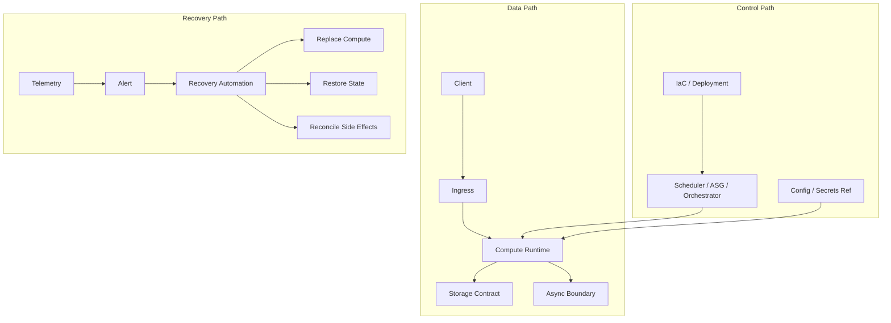
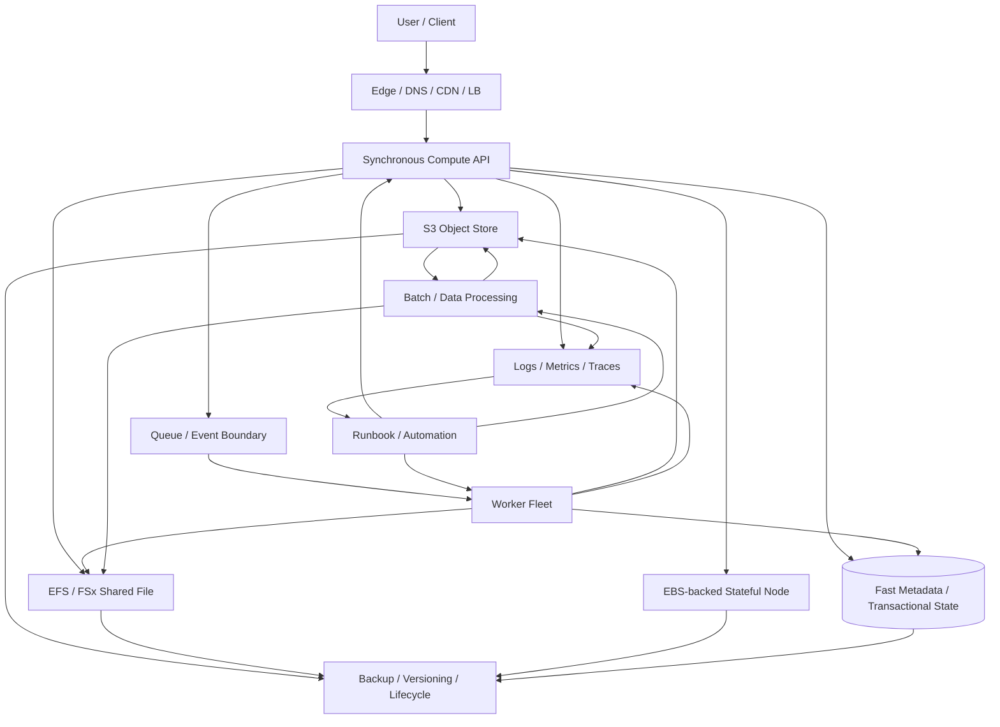
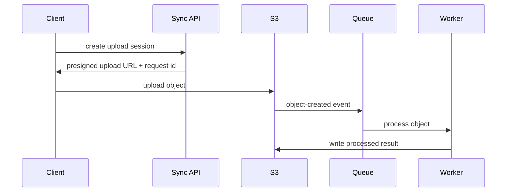
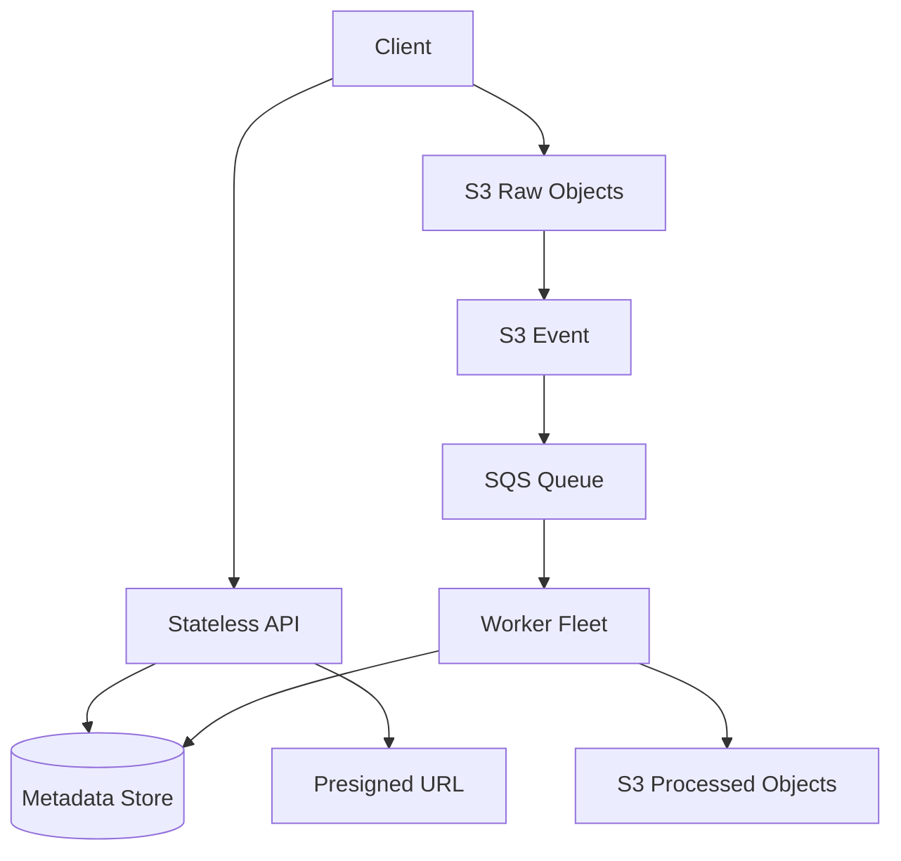
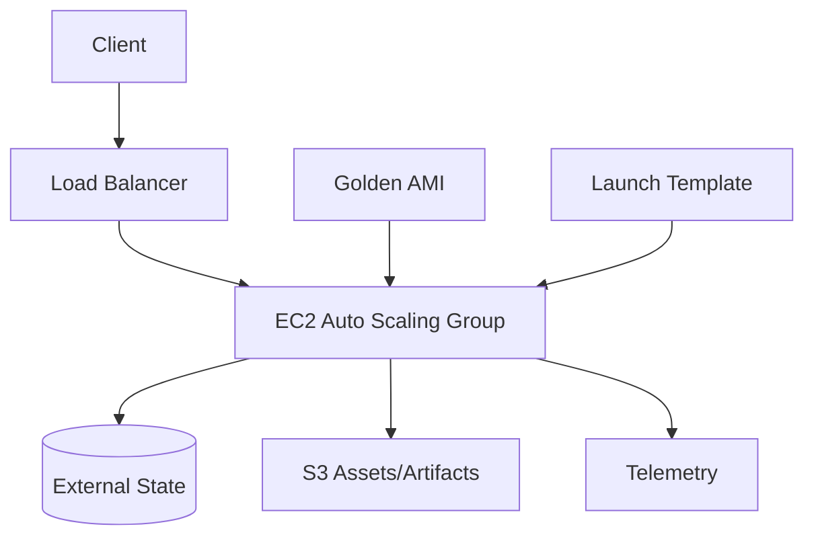
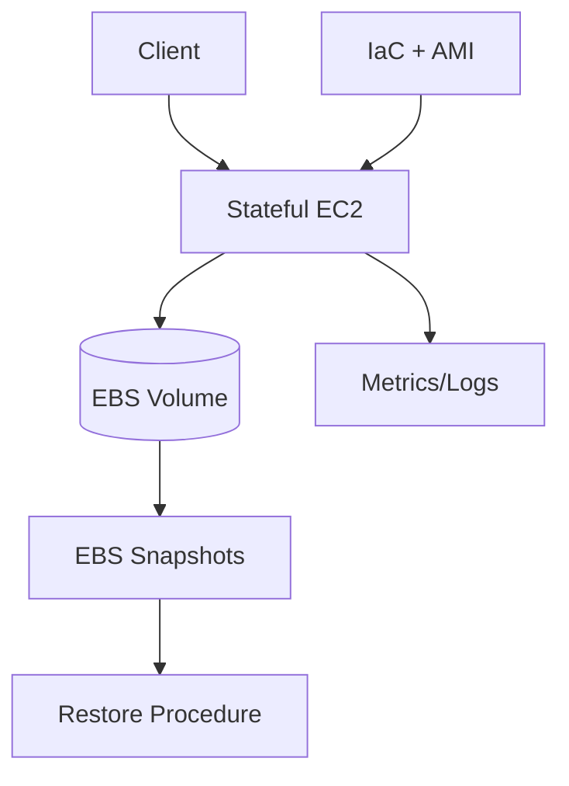
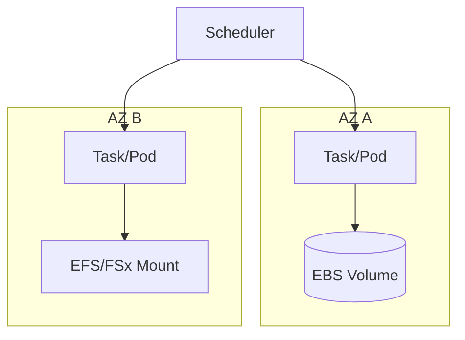
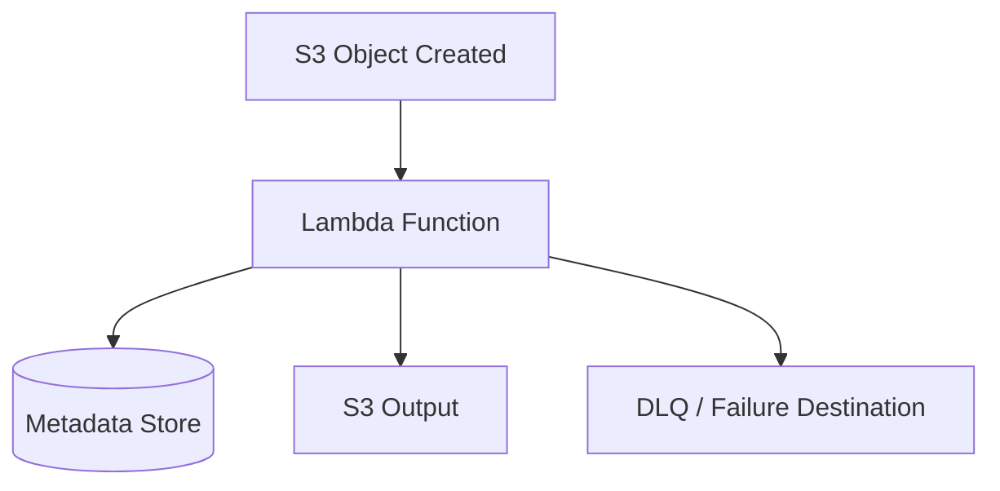
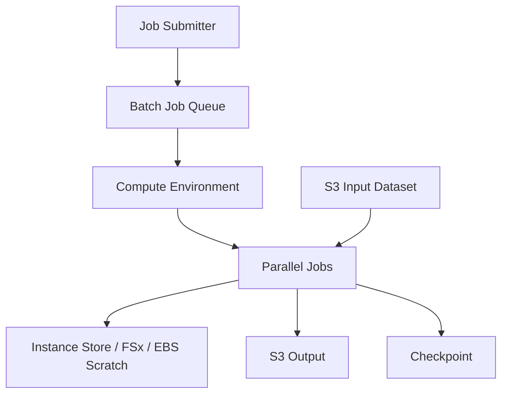
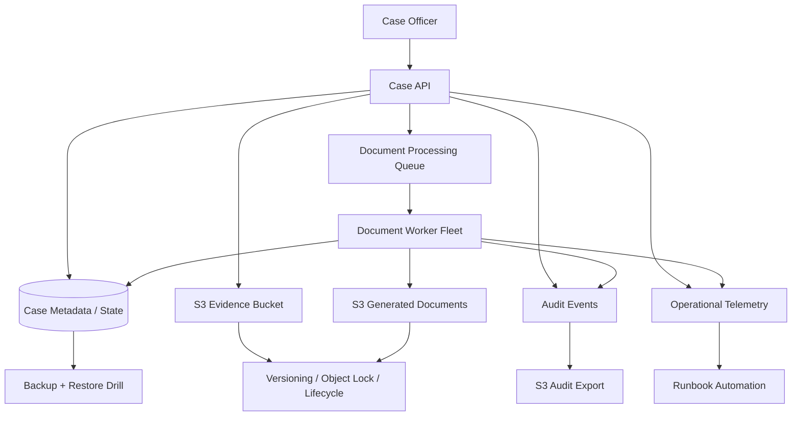

# Part 008 — Reference Architecture Map

Part ini menutup Section I.

Sebelumnya kita sudah membangun fondasi:

```txt
Part 001: compute-storage mental model
Part 002: workload taxonomy and decision map
Part 003: placement, time, state, failure domains
Part 004: cloud capacity as control system
Part 005: storage as contract, not disk
Part 006: AWS compute-storage service selection
Part 007: production invariants
```

Sekarang kita gabungkan menjadi satu peta arsitektur.

Tujuan part ini bukan memberi satu arsitektur final untuk semua sistem. Itu jebakan.

Tujuan part ini adalah memberi **architecture map** yang bisa dipakai untuk membaca, mendesain, dan mengevaluasi banyak bentuk workload AWS compute-storage.

AWS Compute Decision Guide menempatkan EC2, containers, serverless, dan batch sebagai pilihan compute dengan model operasi berbeda. AWS Storage Decision Guide menempatkan object, block, file, migration, dan hybrid storage sebagai pilihan berdasarkan kebutuhan workload. AWS Fault Isolation Boundaries menekankan pentingnya Region, Availability Zone, zonal service, regional service, control plane, dan data plane. Referensi resmi: <https://docs.aws.amazon.com/compute-on-aws-how-to-choose/>, <https://docs.aws.amazon.com/decision-guides/latest/storage-on-aws-how-to-choose/choosing-aws-storage-service.html>, dan <https://docs.aws.amazon.com/whitepapers/latest/aws-fault-isolation-boundaries/abstract-and-introduction.html>.

---

## 1. Problem yang Diselesaikan

Banyak engineer belajar AWS sebagai katalog layanan:

```txt
EC2 = server
S3 = object storage
EBS = disk
EFS = shared file system
Lambda = function
ECS/EKS = containers
Batch = batch jobs
```

Itu benar, tetapi belum cukup.

Production architecture membutuhkan peta yang menjawab:

```txt
Where does request enter?
Where does synchronous work stop?
Where does asynchronous work begin?
Where is durable state written?
Where is temporary state allowed?
Where are failure domains?
Where can retries duplicate work?
Where is capacity controlled?
Where is recovery proven?
Where does cost grow?
```

Reference architecture map membantu menjawab hal tersebut secara berulang.

---

## 2. Mental Model: Planes, Paths, and Contracts

Peta arsitektur compute-storage harus memisahkan tiga hal:

```txt
1. Data path
2. Control path
3. Recovery path
```

### Data path

Data path adalah jalur runtime normal:

```txt
client -> compute -> storage -> response/event/output
```

### Control path

Control path adalah jalur perubahan sistem:

```txt
deployment -> scaling -> config -> provisioning -> scheduling
```

### Recovery path

Recovery path adalah jalur saat sistem rusak:

```txt
detect -> isolate -> degrade -> replace -> restore -> reconcile
```

Diagram arsitektur yang sehat membedakan ketiganya.



Jika diagram hanya menunjukkan Data Path, biasanya production risk masih tersembunyi.

---

## 3. Canonical Production Map

Berikut peta umum yang akan sering dipakai sepanjang seri.



Ini bukan “satu arsitektur”. Ini adalah grammar.

Setiap workload akan memilih subset dari grammar tersebut.

---

## 4. Layer by Layer

### 4.1 Ingress layer

Ingress menerima traffic dari user, partner, system, device, atau internal service.

Dalam seri compute-storage, ingress hanya dibahas sejauh ia memengaruhi runtime dan state:

```txt
- Apakah request synchronous atau bisa asynchronous?
- Apakah upload langsung ke compute atau langsung ke S3?
- Apakah request harus menunggu durable write?
- Apakah retry client bisa menduplikasi side effect?
- Apakah ingress bisa mengurangi traffic ke AZ bermasalah?
```

Pattern umum:

| Pattern | Compute impact | Storage impact |
|---|---|---|
| Direct API upload | compute menangani bytes besar | risiko memory/disk pressure |
| Presigned S3 upload | compute hanya issue authorization | object write langsung ke S3 |
| API command + queue | compute cepat return | worker async owns processing |
| Streaming ingest | compute long-lived | storage layout harus append/partition aware |

### 4.2 Synchronous compute layer

Synchronous compute melayani request yang user tunggu.

Bisa berupa:

```txt
- EC2 Auto Scaling Group,
- ECS service,
- EKS Deployment,
- Lambda function,
- application runtime behind ALB/API Gateway.
```

Kontraknya:

```txt
- bounded latency,
- safe retry,
- no hidden durable state,
- graceful shutdown,
- health check meaningful,
- scaling metric sesuai bottleneck.
```

Jangan taruh pekerjaan berat di synchronous path jika tidak perlu.



Pattern ini menjaga API tetap ringan dan mengalihkan bytes besar ke object storage.

### 4.3 Async boundary

Async boundary memisahkan user latency dari processing latency.

Ia biasanya berupa queue, event bus, stream, atau batch job submission.

Dalam konteks compute-storage, async boundary penting karena:

```txt
- menyerap burst,
- melindungi downstream storage,
- memberi retry contract,
- memberi backpressure signal,
- memisahkan lifecycle compute API dan worker,
- membuat partial failure lebih terkendali.
```

Namun async boundary menambah kebutuhan:

```txt
- idempotency,
- deduplication,
- poison message handling,
- queue age monitoring,
- replay/reconciliation,
- ordering decision.
```

### 4.4 Worker fleet

Worker melakukan pekerjaan yang bisa diproses di luar request user.

Bisa berupa:

```txt
- ECS worker service,
- EKS deployment/job,
- EC2 ASG worker,
- Lambda event consumer,
- AWS Batch job.
```

Kontraknya:

```txt
- input idempotent,
- checkpoint jelas,
- interruption safe,
- concurrency controlled,
- output deterministic,
- side effect auditable.
```

Worker yang sehat tidak mengandalkan “sekali jalan pasti selesai”.

### 4.5 Object storage layer

Object storage cocok untuk:

```txt
- immutable blobs,
- upload/download,
- artifacts,
- data lake layout,
- backup/export,
- event-driven processing,
- large object handling,
- cross-service durable handoff.
```

Kontrak desain:

```txt
- object key adalah API contract,
- metadata bukan hanya filename,
- versioning/lifecycle dirancang,
- object write idempotent,
- multipart cleanup ada,
- listing tidak menjadi critical transaction path,
- small-file problem dipahami untuk analytics.
```

### 4.6 Block storage layer

Block storage cocok untuk:

```txt
- OS/root volume,
- database volume,
- low-latency mutable filesystem,
- single-node stateful workload,
- WAL/log/data separation,
- workloads requiring block device semantics.
```

Kontrak desain:

```txt
- zonal coupling jelas,
- snapshot/restore diuji,
- filesystem consistency dipahami,
- volume performance sesuai workload,
- attachment lifecycle jelas,
- failover bukan asumsi otomatis.
```

EBS sangat kuat, tetapi ia bukan shared regional database. Ia adalah block storage dengan placement dan attachment constraints yang harus dihormati.

### 4.7 File storage layer

File storage cocok untuk:

```txt
- shared filesystem,
- legacy apps expecting POSIX/SMB/NFS-like access,
- shared model/data directory,
- media processing workspace,
- HPC shared path,
- multi-compute read/write file semantics.
```

Kontrak desain:

```txt
- metadata operation cost dipahami,
- locking behavior diuji,
- throughput mode cocok,
- mount target/path tersedia di failure domain yang tepat,
- permission model tidak drift,
- aplikasi tidak menganggap local disk latency.
```

### 4.8 Backup and recovery layer

Backup layer bukan hiasan.

Ia bagian dari runtime architecture karena semua state durable harus punya recovery proof.

```txt
- S3: versioning, Object Lock, replication, lifecycle.
- EBS: snapshots, AMI, application-consistent backup if needed.
- EFS/FSx: backup policy and restore drill.
- Compute: AMI/container image/IaC versioning.
```

Recovery design harus menjawab:

```txt
- restore target di mana?
- apakah key encryption tersedia?
- apakah dependency identity/network/config tersedia?
- apakah app bisa membaca restored data tanpa migration manual?
- apakah RTO/RPO terukur?
```

---

## 5. Reference Architecture Variants

### 5.1 Stateless API + S3 object storage

Use case:

```txt
- file upload,
- document processing,
- media pipeline,
- user-generated content,
- artifact service.
```



Compute choice:

```txt
- Lambda jika processing singkat dan event-driven.
- ECS/Fargate jika processing containerized dan durasi lebih fleksibel.
- Batch jika processing heavy, scheduled, parallel, atau resource-intensive.
```

Storage choice:

```txt
- S3 sebagai source of truth object.
- Metadata store untuk status/index/reference.
- Optional EFS/FSx jika processing membutuhkan shared working directory.
```

Failure notes:

```txt
- S3 event/queue delivery can retry.
- Worker must be idempotent.
- Object key/version should identify input.
- Metadata update must handle duplicate processing.
```

### 5.2 EC2 Auto Scaling stateless service

Use case:

```txt
- existing app server,
- high-control runtime,
- custom OS tuning,
- predictable service behind load balancer.
```



Invariants:

```txt
- instance replacement safe,
- no durable local user data,
- AMI/Launch Template versioned,
- health check protects traffic,
- lifecycle hook handles draining,
- scale-in does not interrupt critical work.
```

### 5.3 Stateful EC2 + EBS

Use case:

```txt
- single-node database-like workload,
- vendor software,
- block-device requirement,
- controlled stateful appliance.
```



Risk:

```txt
- zonal state,
- failover may be manual or semi-automated,
- snapshot may be crash-consistent only,
- restore time may exceed expectation,
- kernel/filesystem tuning matters.
```

Use this pattern only when the state contract is understood.

### 5.4 ECS/EKS service + persistent volume

Use case:

```txt
- containerized stateful application,
- platform standardization,
- Kubernetes/ECS operational model,
- workload requiring mounted storage.
```



Design questions:

```txt
- Is the volume single-AZ or shared/multi-AZ?
- What happens when scheduler moves workload?
- Can the workload tolerate detach/attach delay?
- Is file locking required?
- Is the CSI/storage driver part of the operational dependency chain?
```

### 5.5 Lambda event-driven storage pipeline

Use case:

```txt
- object-created processing,
- lightweight transformations,
- notifications,
- metadata extraction,
- short event handlers.
```



Invariants:

```txt
- handler idempotent,
- timeout bounded,
- memory and ephemeral storage sized,
- concurrency protects downstream,
- DLQ/retry behavior understood,
- duplicate event safe.
```

### 5.6 Batch / HPC / data-heavy processing

Use case:

```txt
- large-scale ETL,
- ML preprocessing,
- simulation,
- rendering,
- scientific/HPC jobs,
- heavy parallel workers.
```



Key decisions:

```txt
- object store vs shared file vs scratch disk,
- checkpoint interval,
- Spot interruption tolerance,
- queue priority,
- data locality,
- output commit protocol,
- cost per job.
```

---

## 6. Control and Data Plane Map

A common design mistake is relying on control-plane mutation during hot failure.

Use this map:

| Operation | Mostly data path | Control path involved | Risk |
|---|---:|---:|---|
| existing EC2 serving traffic | yes | no | runtime failure, capacity exhaustion |
| create new EC2 instance | no | yes | control plane / quota / capacity dependency |
| existing S3 object read/write | yes | usually no | request/data path issue |
| create bucket/change policy | no | yes | control plane dependency |
| existing Lambda invoke | yes | no/limited | concurrency/downstream issue |
| update Lambda config | no | yes | deployment/control issue |
| existing EBS volume I/O | yes | no | volume/instance/AZ issue |
| create/attach EBS volume | no | yes | control plane + AZ placement |
| ECS/EKS scheduling new tasks/pods | partly | yes | scheduler/control dependency |
| running container serving request | yes | no | runtime dependency |

Architecture rule:

```txt
Do not make your only emergency path depend on just-in-time control-plane success.
```

---

## 7. Implementation Pattern: Architecture Decision Matrix

Use this matrix before choosing the concrete AWS services.

| Dimension | Question | Output |
|---|---|---|
| Runtime | request, worker, job, function, daemon? | compute model |
| Duration | milliseconds, minutes, hours, days? | Lambda/Fargate/EC2/Batch fit |
| State | object, block, file, cache, scratch? | storage model |
| Mutability | immutable, append, mutable, transactional? | write contract |
| Placement | single-AZ, multi-AZ, regional, edge? | failure domain |
| Scaling | request rate, queue depth, CPU, memory, custom? | autoscaling metric |
| Recovery | replace, restore, replay, rebuild? | runbook path |
| Cost | per request, per GB, per hour, per job? | unit economics |
| Operation | who owns runtime complexity? | team/platform model |

Example output:

```txt
Workload: document ingestion and extraction
Runtime: sync API + async workers
Duration: API < 200ms, worker 30s-10m
State: S3 raw object, S3 processed object, metadata DB
Mutability: object immutable, metadata mutable
Placement: API multi-AZ, S3 regional, workers multi-AZ
Scaling: API request count, worker queue age
Recovery: replay queue/object, restore metadata DB
Cost: object storage + worker compute per document
Operation: ECS/Fargate initially, Batch later for heavy extraction
```

---

## 8. Minimal IaC Shape

This is not full Terraform. It is the shape of resources you should expect in a production compute-storage module.

```hcl
# Shape only, not complete copy-paste code.

module "compute_service" {
  source = "./modules/compute-service"

  name              = "document-api"
  runtime           = "ecs-fargate"
  desired_capacity  = 3
  min_capacity      = 3
  max_capacity      = 30
  availability_zones = ["az-a", "az-b", "az-c"]

  health_check = {
    path = "/health/ready"
  }

  scaling = {
    metric = "request_count_per_target"
    target = 100
  }
}

module "object_store" {
  source = "./modules/object-store"

  bucket_name = "document-raw-prod"
  versioning  = true

  lifecycle_rules = [
    {
      prefix = "raw/"
      transition_after_days = 30
      expire_after_days     = 2555
    }
  ]
}

module "worker" {
  source = "./modules/worker-service"

  name          = "document-worker"
  runtime       = "ecs-fargate"
  queue_name    = "document-events"
  scale_metric  = "queue_age"
  max_capacity  = 100

  interruption_safe = true
}

module "recovery" {
  source = "./modules/recovery-contract"

  restore_test_schedule = "monthly"
  rpo_minutes           = 15
  rto_minutes           = 60
}
```

The point is not the syntax.

The point is that architecture should expose:

```txt
- runtime contract,
- state contract,
- capacity contract,
- recovery contract,
- observability contract.
```

---

## 9. Operational Runbook Map

Every architecture variant needs runbooks for the same categories.

### 9.1 Compute degraded

```txt
Signals:
- rising 5xx,
- target unhealthy,
- queue age rising,
- pod/task restarts,
- CPU/memory saturation,
- throttling.

Actions:
- identify affected AZ/service/version,
- reduce traffic if needed,
- pause deployment,
- scale out if safe,
- rollback if correlated with release,
- drain bad nodes/tasks,
- protect downstream concurrency.
```

### 9.2 Storage degraded

```txt
Signals:
- EBS latency/queue depth,
- EFS/FSx client errors,
- S3 4xx/5xx spike,
- object write failures,
- disk full,
- metadata operation latency,
- backup failure.

Actions:
- classify source of truth vs cache/scratch,
- stop unsafe writes if needed,
- enable read-only/degraded mode,
- retry with backoff,
- fail over if designed,
- restore/replay if necessary,
- reconcile duplicate/partial writes.
```

### 9.3 Capacity degraded

```txt
Signals:
- scaling max reached,
- quota errors,
- Spot interruption spike,
- no capacity in selected instance type/AZ,
- queue backlog growing faster than drain rate.

Actions:
- shed non-critical load,
- expand instance diversification,
- use On-Demand fallback,
- raise max capacity if quota exists,
- lower per-worker concurrency if downstream saturated,
- activate degraded business mode.
```

### 9.4 Recovery validation

```txt
Signals:
- backup age exceeds RPO,
- restore test failed,
- snapshot lifecycle unexpected,
- KMS/key access failure,
- cross-account restore blocked.

Actions:
- restore to isolated environment,
- validate application can read restored data,
- compare record/object counts,
- run synthetic transaction,
- document actual RTO,
- fix dependency drift.
```

---

## 10. Common Architecture Smells

### Smell 1 — Everything is synchronous

If upload, processing, indexing, notification, and analytics all happen before response, the API path becomes fragile.

Fix:

```txt
Move non-immediate work behind async boundary.
```

### Smell 2 — Compute owns durable data

If the only copy of user/business data is on a compute node, rebuildability is broken.

Fix:

```txt
Move durable data to explicit storage contract.
```

### Smell 3 — EFS used as a universal shared database

Shared file system is not a replacement for database semantics.

Fix:

```txt
Use file storage for file semantics, not coordination/transaction semantics.
```

### Smell 4 — S3 used as if it were a transactional filesystem

S3 is excellent object storage, but application semantics must respect object key, listing, lifecycle, and write patterns.

Fix:

```txt
Use metadata/index/manifest patterns; avoid hidden transactional assumptions.
```

### Smell 5 — Kubernetes hides placement risk

EKS scheduler can move pods, but storage binding may still be zonal.

Fix:

```txt
Make StorageClass, PVC binding, topology, and failure domain explicit.
```

### Smell 6 — Autoscaling without backpressure

Autoscaling cannot save a system if downstream cannot absorb concurrency.

Fix:

```txt
Use queues, concurrency limits, throttling, and admission control.
```

### Smell 7 — Backup policy exists but restore path unknown

Fix:

```txt
Restore drill with measured RTO/RPO.
```

---

## 11. Mini Case Study: Regulatory Case Document Platform

### Business context

A regulatory case management platform stores evidence documents, process state, generated letters, audit exports, and case timelines.

Requirements:

```txt
- user-facing API must stay responsive,
- documents must be durable,
- evidence retention must be explicit,
- generated documents must be reproducible/auditable,
- processing can be asynchronous,
- workloads may spike near enforcement deadlines,
- recovery must be defensible.
```

### Reference map



### Compute-storage contracts

| Component | Contract |
|---|---|
| Case API | stateless, rebuildable, synchronous, no durable local data |
| S3 Evidence | source of truth for evidence bytes, versioned, retention-governed |
| Case DB | source of truth for case state and document metadata |
| Worker | async, idempotent, can retry document processing |
| Generated Documents | durable output, linked to case state and generation version |
| Audit Export | append/audit-oriented, lifecycle governed |
| Backup | restore-tested, not merely configured |

### Important invariants

```txt
- Officer upload should not depend on worker availability.
- Evidence object key must be deterministic or tied to immutable document id.
- Worker duplicate processing must not create duplicate authoritative documents.
- Audit event must be emitted around durable state transition, not best-effort afterthought.
- Restore test must validate both bytes and metadata relationships.
- Degraded mode should allow case read access even if document generation is delayed.
```

This is the kind of architecture map we will keep refining throughout the series.

---

## 12. Section I Summary

Section I built the mental model.

You should now be able to reason about AWS compute-storage with these questions:

```txt
What is the execution contract?
What is the state contract?
Where is the failure domain?
Where is the async boundary?
Where can work duplicate?
Where does capacity saturate?
Where is recovery proven?
Where does cost grow?
```

From Part 009 onward, we enter concrete implementation.

Next section starts with Amazon EC2 from first principles: VM lifecycle, Nitro mental model, metadata, tenancy, bootstrapping, failure model, and why EC2 remains foundational even in a serverless/container-heavy AWS architecture.

---

## 13. References

- AWS Compute Decision Guide: <https://docs.aws.amazon.com/compute-on-aws-how-to-choose/>
- AWS Storage Decision Guide: <https://docs.aws.amazon.com/decision-guides/latest/storage-on-aws-how-to-choose/choosing-aws-storage-service.html>
- AWS Fault Isolation Boundaries: <https://docs.aws.amazon.com/whitepapers/latest/aws-fault-isolation-boundaries/abstract-and-introduction.html>
- AWS Fault Isolation Boundaries — Availability Zones: <https://docs.aws.amazon.com/whitepapers/latest/aws-fault-isolation-boundaries/availability-zones.html>
- AWS Fault Isolation Boundaries — Zonal Services: <https://docs.aws.amazon.com/whitepapers/latest/aws-fault-isolation-boundaries/zonal-services.html>
- AWS Fault Isolation Boundaries — Regional Services: <https://docs.aws.amazon.com/whitepapers/latest/aws-fault-isolation-boundaries/regional-services.html>
- AWS Well-Architected Framework: <https://docs.aws.amazon.com/wellarchitected/latest/framework/welcome.html>
- AWS Reliability Pillar: <https://docs.aws.amazon.com/wellarchitected/latest/reliability-pillar/welcome.html>
- AWS Operational Excellence Pillar: <https://docs.aws.amazon.com/wellarchitected/latest/operational-excellence-pillar/welcome.html>
- Amazon EKS Storage: <https://docs.aws.amazon.com/eks/latest/userguide/storage.html>
