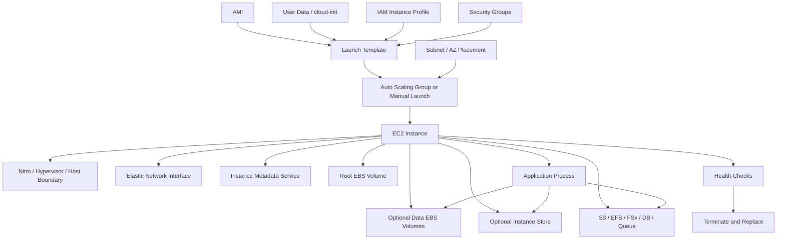
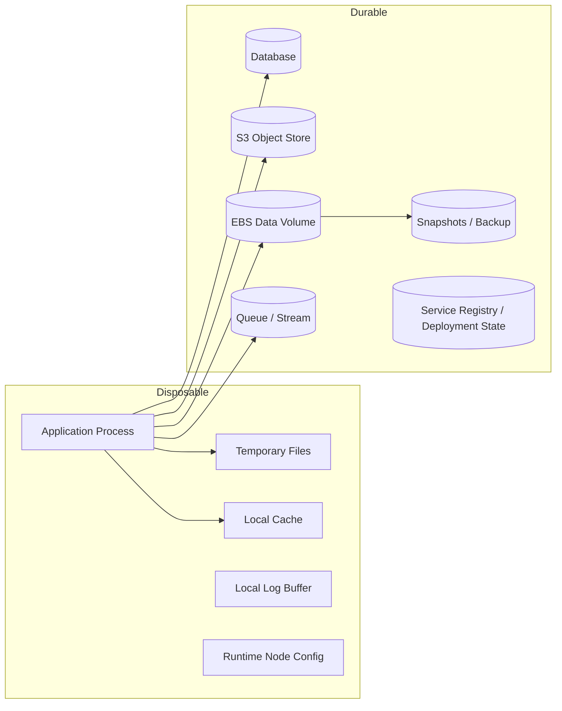
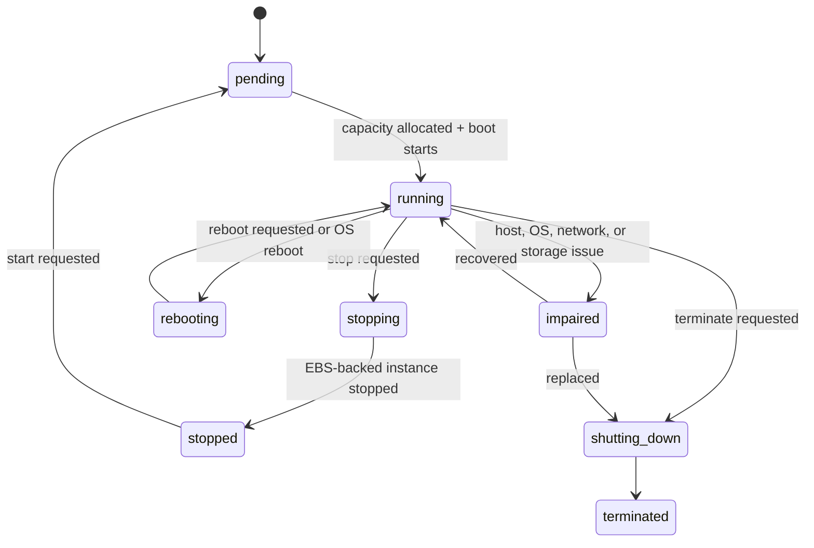
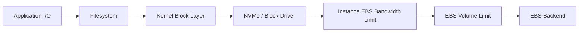
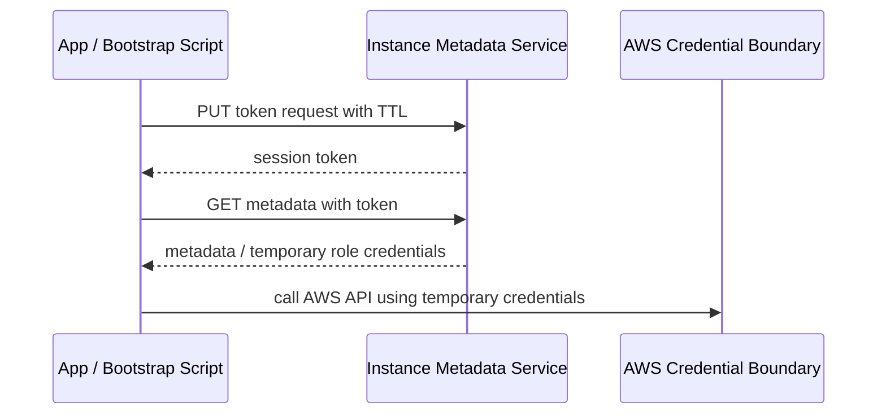
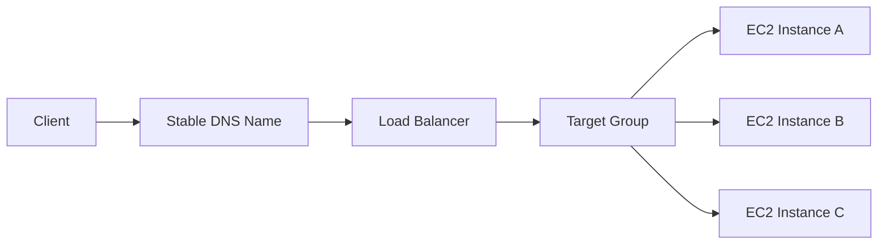
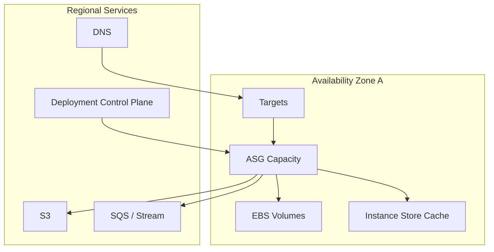
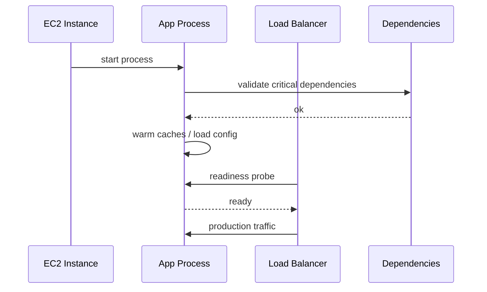
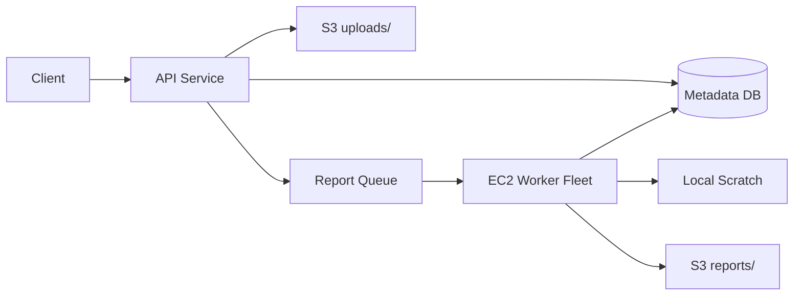

# Part 009 — EC2 From First Principles

EC2 is often introduced as “a virtual server in the cloud”. That sentence is true, but not useful enough for production engineering.

A production engineer should understand EC2 as a **rebuildable compute cell** that temporarily occupies AWS capacity, receives network identity, receives storage attachments, receives credentials through instance metadata, and participates in one or more failure domains.

The important question is not:

> “How do I launch an EC2 instance?”

The real question is:

> “What contract does this instance have with the rest of the system, and what happens when the contract breaks?”

That is the level we will use in this part.

---

## 1. Problem yang Diselesaikan

EC2 is the lowest-level general-purpose compute primitive most AWS application teams directly operate.

It gives you control over:

- operating system
- runtime
- kernel-level tuning
- filesystem layout
- local daemons
- network stack
- process supervision
- disk attachment
- placement
- capacity purchasing model
- lifecycle hooks
- failure recovery model

That control is useful when the workload needs it. It is also dangerous when the team treats EC2 as a pet server.

EC2 should usually be modeled as:

```txt
configuration + image + attached state + runtime signals = replaceable execution unit
```

Not as:

```txt
unique server that must survive forever
```

The first model gives you production leverage. The second creates hidden operational debt.

---

## 2. Mental Model

Think of an EC2 instance as a running composition of five things:

| Layer | What it means | Production question |
|---|---|---|
| Capacity slot | AWS allocates host capacity for your selected instance type | Can this capacity be obtained again during failure? |
| Machine shape | vCPU, memory, network, EBS bandwidth, local disk, accelerator | Does this shape match the actual bottleneck? |
| Boot identity | AMI, kernel, user data, launch template, tags | Can a new instance boot deterministically? |
| Runtime identity | private IP, ENI, IAM role, metadata, hostname, service registration | Can identity be recreated or moved safely? |
| State attachment | EBS, instance store, EFS, FSx, S3, external database | What state survives instance replacement? |

The mistake is to reason about only vCPU and memory. EC2 failure and performance behavior are usually dominated by the boundaries between these layers.

---

## 3. EC2 in One Diagram



The instance is not one object. It is an orchestration of identities, attachments, and contracts.

---

## 4. First Principle: Compute Is Disposable, State Is Not

A clean EC2 architecture starts with this invariant:

> An EC2 instance may disappear. The system should know which parts are allowed to disappear with it.

Break the instance into two zones:



The production design question is:

| Data type | Should it survive instance replacement? | Recommended placement |
|---|---:|---|
| Application binary | No, rebuild from image/artifact | AMI, package repository, container image |
| Runtime config | Yes, but not as local manual file | Parameter Store, Secrets Manager, S3, baked config, deployment system |
| Session data | Usually yes | Redis, database, signed client token, external store |
| Upload before commit | Yes | S3 multipart/upload staging, queue-backed commit protocol |
| Cache | No | Instance store, local disk, tmpfs, Redis if shared |
| Database data | Yes | Managed database, EBS with snapshot/replication model, specialized storage |
| Logs | Yes enough for audit/debug | CloudWatch Logs, S3, log pipeline; local only as buffer |
| Build scratch | No | Instance store, ephemeral EBS, temp S3 prefix |

The more state you leave on the instance, the more the instance becomes a pet. The more state you externalize with explicit recovery contracts, the more EC2 becomes safe infrastructure.

---

## 5. EC2 Lifecycle Model

An EC2 instance goes through lifecycle transitions. Each transition can break different assumptions.



Key lifecycle implications:

| Transition | What usually survives | What may change | Design implication |
|---|---|---|---|
| Reboot | EBS volumes, instance identity, private IP usually | process memory, local runtime state | Process supervisor must restart cleanly |
| Stop/start | EBS volumes | host placement, instance store, public IP unless Elastic IP | Do not rely on host-local data |
| Terminate | Nothing local by default except explicitly retained EBS volumes/snapshots | instance ID, local data, runtime identity | Instance must be rebuildable |
| Replace by ASG | Desired capacity restored | all node identity | Service registration and drain must be automated |
| Host impairment | Unknown | CPU/network/storage path | Detect, quarantine, replace |

### Critical distinction: reboot vs stop/start vs terminate

A reboot is an operating-system-level event. A stop/start is a cloud lifecycle event. A terminate is an infrastructure deletion event.

Teams often confuse them.

That confusion causes bad assumptions like:

- “The local disk survived reboot, so it is durable.”
- “The private IP came back, so this instance is stable identity.”
- “The root volume exists, so the application state is safe.”
- “The Auto Scaling Group replaced the node, so recovery is complete.”

Recovery is complete only when the **application-level invariant** is true again.

Example:

```txt
Bad recovery invariant:
EC2 instance is running.

Better recovery invariant:
New instance is running, registered in the load balancer, has loaded valid config,
can reach dependencies, emits metrics, handles production traffic, and old instance
is drained without losing in-flight work.
```

---

## 6. Nitro Mental Model

Many modern EC2 instances are built on the AWS Nitro System. Nitro is not a feature you turn on inside your app; it is the underlying platform design that moves many virtualization, networking, storage, and security functions into dedicated AWS-built hardware/software components.

For application engineers, Nitro matters because it changes the shape of performance and device behavior:

- EBS and instance store may appear as NVMe devices on Nitro-based instances.
- Network and EBS performance characteristics are strongly tied to instance type.
- Modern instance families often use Nitro capabilities for better isolation and performance.
- Some older instance assumptions, device names, and drivers do not behave identically on Nitro.

Do not memorize “Nitro = faster”. Use this practical model:

```txt
Instance type defines the virtual hardware contract.
Nitro is the underlying implementation that delivers much of that contract.
The OS sees devices, queues, interrupts, network adapters, and block devices.
Your app experiences latency, throughput, CPU steal, network behavior, and failure modes.
```

### What Nitro changes operationally

| Area | Operational effect |
|---|---|
| Storage devices | EBS volumes can appear as NVMe devices; mount by stable identifiers, not fragile names |
| Network | Higher and more predictable networking on many families, but still bounded by instance type |
| EBS bandwidth | Instance type has EBS bandwidth limits; volume IOPS alone is not enough |
| Boot | AMI drivers and kernel support matter |
| Observability | You still debug from OS and CloudWatch signals; Nitro does not remove workload bottlenecks |

### Rule

Never assume that increasing EBS volume performance will help if the instance-level EBS bandwidth is already saturated.

The EBS path is a chain:



Your bottleneck is the narrowest segment.

---

## 7. Instance Metadata: Runtime Control Plane Inside the Instance

The Instance Metadata Service, usually called IMDS, is a local service available from inside the instance. Applications and bootstrapping scripts use it to discover information about the running instance and retrieve temporary credentials for the attached IAM role.

Treat IMDS as a powerful local control plane, not as harmless metadata.

Common metadata use cases:

- detect instance ID
- detect Region and Availability Zone
- retrieve IAM role credentials
- read user data
- discover hostname or network details
- support bootstrapping scripts
- tag-aware runtime behavior, when configured appropriately

### IMDSv2 mental model

IMDSv2 uses a session-oriented token flow. The caller first obtains a token, then uses the token to call metadata endpoints.



Production implications:

| Concern | Recommendation |
|---|---|
| SSRF risk | Require IMDSv2 and avoid exposing metadata access through app request paths |
| Credential scope | Use least-privilege instance profile |
| Bootstrap dependency | Keep user-data scripts idempotent and observable |
| Metadata hop limit | Configure intentionally, especially with containers/proxies |
| Runtime dependency | App should fail clearly if credentials are unavailable |

### Anti-pattern

```txt
Application starts by calling IMDS, assumes credentials exist, fails with generic 500,
and the team debugs the app instead of the instance profile or IMDS setting.
```

Better:

```txt
Startup checks instance role availability, emits structured failure reason,
blocks traffic registration until AWS dependency credentials are valid.
```

---

## 8. EC2 Storage Attachment Model

EC2 storage can be local, attached, shared, or remote.

| Storage type | Scope | Survives instance replacement? | Common use |
|---|---|---:|---|
| Root EBS | AZ-scoped block volume | If retained or snapshotted | OS boot, base runtime |
| Data EBS | AZ-scoped block volume | Yes, if detached/reattached or snapshotted | Databases, durable block data, logs with care |
| Instance store | Host-local ephemeral block | No | cache, scratch, temp files, replicated ephemeral data |
| EFS | Regional file service with mount targets | Yes | shared POSIX-like files, serverless/container sharing |
| FSx | Managed file system family | Yes | Windows file shares, Lustre HPC, ONTAP/OpenZFS patterns |
| S3 | Regional object storage | Yes | object data, artifacts, logs, backups, data lake |
| Database | Managed state service | Yes by service contract | application source of truth |

### Important distinction: attachable vs movable

EBS is durable, but it is not “globally movable”. An EBS volume lives in one Availability Zone. You can detach and attach it to another compatible instance in the same AZ, but cross-AZ movement is not an instant attach operation. Cross-AZ recovery usually requires snapshot/restore, replication, or application-level rebuild.

That means this design is fragile:

```txt
Single EC2 + single EBS data volume + manual failover to another AZ
```

Because the state is AZ-bound.

A better design depends on workload:

| Workload | Better recovery model |
|---|---|
| Small internal tool | Snapshot restore runbook, accepted RTO/RPO |
| Stateful service with strict RTO | Replication at application/database layer |
| Cache | Rebuild from source of truth |
| File workload | EFS/FSx with explicit availability model |
| Object workload | S3 as source of truth |

---

## 9. Network Identity and ENI Model

An EC2 instance receives network identity through Elastic Network Interfaces.

For production reasoning, separate:

| Identity | Meaning | Should app depend on it? |
|---|---|---:|
| Instance ID | Cloud resource identity | Rarely |
| Private IP | VPC network identity | Sometimes, but prefer service discovery/LB |
| Public IP | Internet-reachable identity | Avoid direct dependency unless explicit |
| Elastic IP | Static public IP resource | Only for constrained legacy integration |
| DNS name | Name resolution layer | Prefer stable service endpoint |
| Load balancer target | Traffic routing identity | Yes, for scalable services |
| Service registry entry | Logical service identity | Yes, if managed automatically |

A good service does not ask callers to know its EC2 instance IDs.

Preferred traffic path:



Direct-instance addressing should be treated as an exception for:

- cluster-internal protocols that require peer identity
- specialized stateful systems
- controlled admin access
- legacy integrations
- diagnostics

Even then, automate registration and deregistration.

---

## 10. Tenancy, Host Boundary, and Isolation

Most EC2 workloads run on shared tenancy: the physical host is shared across AWS customers, with isolation provided by AWS virtualization and hardware/software controls.

Other options exist for stricter placement or licensing needs:

| Model | Use case | Trade-off |
|---|---|---|
| Shared tenancy | Default cloud workload | Cheapest and simplest for most systems |
| Dedicated Instance | Instance runs on hardware dedicated to one customer account | Higher cost, more constraints |
| Dedicated Host | Physical server allocated for your use | Useful for licensing, compliance, host affinity |
| Bare metal | Direct access to physical server capabilities | More operational responsibility |

Do not choose dedicated models just because they sound “more secure”. Choose them when there is a specific constraint:

- software license tied to socket/core/host
- compliance requiring host-level isolation
- specialized virtualization workload
- need to control host affinity
- bare-metal hardware feature requirement

Otherwise, shared tenancy plus strong IAM/network/storage controls is usually the operationally superior default.

---

## 11. The EC2 Boot Contract

A production EC2 instance should have a deterministic boot contract.

A boot contract answers:

1. Which AMI boots?
2. Which kernel and drivers are expected?
3. Which user-data script runs?
4. Which packages are installed at boot vs baked into image?
5. Which config source is authoritative?
6. Which secrets are retrieved?
7. Which volumes are mounted?
8. Which services start?
9. Which health checks must pass before traffic?
10. Which logs prove boot progress?

### Bad boot contract

```bash
#!/bin/bash
apt-get update
apt-get install -y app
aws s3 cp s3://some-bucket/config.yml /etc/app/config.yml
systemctl start app
```

Problems:

- not idempotent
- no version pinning
- no failure visibility
- no retry policy
- no checksum
- no traffic readiness separation
- no mount validation
- no secret handling model
- no rollback story

### Better boot contract shape

```bash
#!/usr/bin/env bash
set -euo pipefail

log() { echo "$(date -Is) [bootstrap] $*"; }

log "starting bootstrap"

# 1. Validate expected metadata availability.
TOKEN=$(curl -fsS -X PUT "http://169.254.169.254/latest/api/token" \
  -H "X-aws-ec2-metadata-token-ttl-seconds: 21600")
AZ=$(curl -fsS -H "X-aws-ec2-metadata-token: ${TOKEN}" \
  http://169.254.169.254/latest/meta-data/placement/availability-zone)
INSTANCE_ID=$(curl -fsS -H "X-aws-ec2-metadata-token: ${TOKEN}" \
  http://169.254.169.254/latest/meta-data/instance-id)

log "instance=${INSTANCE_ID} az=${AZ}"

# 2. Validate attached storage before app startup.
if ! lsblk | grep -q nvme; then
  log "expected block device not visible"
  exit 10
fi

# 3. Render config from authoritative source.
# Keep this section explicit in real systems: version, checksum, retries.

# 4. Start service but do not declare readiness until health passes.
systemctl daemon-reload
systemctl enable app.service
systemctl restart app.service

# 5. Local readiness probe.
for i in {1..30}; do
  if curl -fsS http://127.0.0.1:8080/health/ready; then
    log "app ready"
    exit 0
  fi
  sleep 2
done

log "app failed readiness"
exit 20
```

This is still simplified, but it exposes the right structure.

---

## 12. AMI vs User Data vs Configuration Store

A clean EC2 architecture separates **image**, **bootstrap**, and **runtime configuration**.

| Layer | Should contain | Should not contain |
|---|---|---|
| AMI | OS baseline, kernel, drivers, agents, language runtime, stable packages | environment-specific secrets, rapidly changing config |
| User data | bootstrap orchestration, final wiring, mount validation, service start | huge imperative installation script with hidden dependencies |
| Config store | environment-specific config, feature flags, endpoints, non-secret parameters | large binaries, mutable local-only edits |
| Secret store | database passwords, API keys, private credentials | non-secret app config, static files |
| Artifact repository | application artifact/container/binary | hand-copied production binaries |

### Practical rule

The more work you do at boot time, the slower and riskier replacement becomes.

But the more you bake into AMI, the more careful you need to be with image versioning and rollout.

A balanced production model:

```txt
AMI = slow-changing machine baseline
Artifact = versioned application payload
Config = environment binding
User data = deterministic wiring
```

---

## 13. EC2 as a Rebuildable Cell

For resilient EC2 design, define a **cell**.

A cell is a bounded unit of compute + storage + routing that can fail and recover independently.

Example cell:



For stateless services, the cell can be replaced by launching more instances.

For stateful services, the cell includes state transfer and recovery rules.

### Cell questions

Ask these before approving an EC2 architecture:

- Can we recreate this cell from code and artifacts?
- What state is inside the cell?
- What state is outside the cell?
- What happens if one instance dies?
- What happens if all instances in one AZ die?
- What happens if we cannot launch the selected instance type?
- What happens if the AMI is broken?
- What happens if the root volume is corrupted?
- What happens if data EBS attach is delayed?
- What is the tested recovery procedure?

---

## 14. Health Model: Running Is Not Healthy

EC2 status checks are necessary but insufficient.

There are at least five health layers:

| Layer | Example | Who observes it? |
|---|---|---|
| Cloud resource health | instance status check, system status check | EC2/AWS |
| OS health | boot complete, disk mounted, service manager running | OS/agent |
| Process health | app process alive | systemd/supervisor |
| Dependency health | DB reachable, queue reachable, config loaded | application |
| Traffic health | can serve real request within SLO | load balancer/synthetic/client |

A service should not receive production traffic just because the instance is `running`.

Better traffic admission:



### Readiness vs liveness

| Check | Meaning | Failure action |
|---|---|---|
| Liveness | Process should be restarted | restart process or instance |
| Readiness | Process should receive traffic | remove from load balancer until ready |
| Startup | Process is still initializing | wait without killing too early |
| Deep health | Dependency graph valid | alert or degrade intentionally |

Do not use deep dependency checks as liveness checks unless you want dependency outages to restart your entire fleet.

---

## 15. Failure Modes

### 15.1 Instance never reaches running

Common causes:

- quota exhausted
- unsupported instance type in selected AZ
- capacity unavailable
- invalid launch template
- missing AMI
- KMS key issue for encrypted volume
- invalid IAM instance profile
- subnet/IP exhaustion

Response:

- inspect launch failure reason
- check quota and capacity by instance family
- try diversified instance types/AZs if appropriate
- validate launch template version
- validate AMI/KMS/IAM dependencies

### 15.2 Instance running but app not ready

Common causes:

- bootstrap script failed
- package repository unavailable
- config source unreachable
- secret retrieval failed
- volume not mounted
- app started before dependency available
- port mismatch
- health check path wrong

Response:

- inspect cloud-init logs
- inspect systemd logs
- verify user data rendered correctly
- validate IMDS credentials
- verify mount points and permissions
- run local readiness probe

### 15.3 Instance healthy but traffic errors

Common causes:

- load balancer target health mismatch
- security group path issue
- app dependency issue
- DNS/service discovery stale
- connection pool exhaustion
- ephemeral port exhaustion
- CPU/memory saturation

Response:

- compare LB health vs application health
- check p95/p99 latency, not only CPU
- inspect network errors and connection counts
- validate security group/NACL only as needed; do not turn this part into networking debugging
- inspect dependency metrics

### 15.4 EBS attached but performance poor

Common causes:

- instance EBS bandwidth limit reached
- volume IOPS/throughput limit reached
- small block random I/O with insufficient queue depth
- filesystem bottleneck
- noisy application write amplification
- burst credits exhausted on certain volume types

Response:

- check volume metrics and instance metrics together
- benchmark below application layer
- inspect queue depth and await time
- test with realistic block size
- compare instance EBS bandwidth limit vs volume config

### 15.5 Instance store data lost

Common causes:

- stop/start
- terminate
- host retirement
- disk failure
- replacement by Auto Scaling

Response:

- treat instance store as cache/scratch only
- rebuild from durable source
- validate application does not require instance-store data for correctness

---

## 16. Production Implementation Pattern

A reliable EC2 service should usually be implemented as:

```txt
Launch Template
+ immutable or semi-immutable AMI
+ IAM instance profile
+ required IMDSv2
+ explicit storage mapping
+ deterministic user data
+ systemd service
+ load balancer target group
+ Auto Scaling Group
+ graceful drain
+ logs/metrics/alarms
+ replacement runbook
```

Even if you run one instance today, design so that the second instance is boring.

### Minimal production checklist

| Concern | Expected answer |
|---|---|
| Source of truth | IaC, not console-only resource |
| Image | versioned AMI or image pipeline |
| Bootstrap | idempotent, logged, fail-fast |
| Credentials | IAM role, no static credentials on disk |
| Metadata | IMDSv2 required unless justified |
| Storage | explicit mount and recovery model |
| Traffic | load balancer or service discovery, not direct instance dependency |
| Health | readiness separated from liveness |
| Logs | off-instance log pipeline |
| Metrics | host + app + dependency metrics |
| Replacement | tested terminate-and-replace path |
| Backup | tested restore, not just snapshot existence |
| Capacity | quota and instance type availability considered |

---

## 17. Terraform Skeleton

This is intentionally small. The point is the shape, not copy-paste completeness.

```hcl
resource "aws_launch_template" "app" {
  name_prefix   = "app-"
  image_id      = var.ami_id
  instance_type = var.instance_type

  iam_instance_profile {
    name = aws_iam_instance_profile.app.name
  }

  metadata_options {
    http_endpoint               = "enabled"
    http_tokens                 = "required"
    http_put_response_hop_limit = 1
  }

  block_device_mappings {
    device_name = "/dev/xvda"

    ebs {
      volume_type           = "gp3"
      volume_size           = 50
      encrypted             = true
      delete_on_termination = true
    }
  }

  user_data = base64encode(templatefile("${path.module}/bootstrap.sh", {
    app_env = var.environment
  }))

  tag_specifications {
    resource_type = "instance"

    tags = {
      Service     = var.service_name
      Environment = var.environment
      ManagedBy   = "terraform"
    }
  }
}

resource "aws_autoscaling_group" "app" {
  name                = "${var.service_name}-${var.environment}"
  min_size            = 2
  max_size            = 10
  desired_capacity    = 2
  vpc_zone_identifier = var.private_subnet_ids

  launch_template {
    id      = aws_launch_template.app.id
    version = "$Latest"
  }

  target_group_arns = [aws_lb_target_group.app.arn]

  health_check_type         = "ELB"
  health_check_grace_period = 300

  tag {
    key                 = "Service"
    value               = var.service_name
    propagate_at_launch = true
  }
}
```

### Important note

Using `$Latest` is convenient but not always safe. Mature systems often pin launch template versions during rollout so the deployment controller decides when a new version is used.

---

## 18. Operational Runbook

### Scenario: replace one instance safely

1. Mark instance as draining.
2. Deregister or wait for load balancer deregistration delay.
3. Stop accepting new work.
4. Finish or requeue in-flight work.
5. Flush logs/metrics if needed.
6. Terminate instance.
7. Verify ASG launches replacement.
8. Confirm replacement passes readiness.
9. Confirm production traffic returns to expected balance.
10. Inspect errors during the replacement window.

### Scenario: instance boot loop

1. Check ASG activity history or EC2 launch status.
2. Check system status vs instance status.
3. Inspect console output or serial console where available.
4. Inspect cloud-init logs if accessible.
5. Validate AMI, user data, IAM role, KMS key, subnet capacity.
6. Roll back launch template version if correlated with deployment.
7. Launch a diagnostic instance from prior AMI if necessary.

### Scenario: suspected host impairment

1. Compare instance status check and application metrics.
2. Drain traffic if possible.
3. Capture necessary logs/diagnostics.
4. Replace instance rather than repairing in place.
5. Verify whether multiple instances in same AZ/family show similar symptoms.
6. Escalate only after isolating app vs OS vs AWS resource health.

---

## 19. Common Mistakes

### Mistake 1: Treating EC2 as a server, not a cell

A server mindset says:

```txt
This instance is important. Keep it alive.
```

A cell mindset says:

```txt
This instance is one replaceable participant. Keep the service invariant alive.
```

### Mistake 2: Mounting by unstable device name

On Nitro-based instances, block devices can appear differently from the name you requested. Mount by UUID, filesystem label, or stable device metadata.

### Mistake 3: Putting secrets in AMI or user data

User data and AMIs are not good places for long-lived secrets. Use IAM role + secret retrieval with a clear access boundary.

### Mistake 4: Auto Scaling without drain

Terminating a worker instance without requeue/drain creates invisible data loss.

### Mistake 5: Snapshot without restore test

A snapshot is an ingredient. Restore is the meal.

### Mistake 6: Scaling by CPU only

Many EC2 services saturate on memory, I/O, network, lock contention, downstream capacity, or thread pools before CPU reaches obvious levels.

---

## 20. Mini Case Study: Stateful Report Generator

### Initial design

A reporting service runs on one large EC2 instance.

It stores:

- uploaded CSV files in `/data/uploads`
- temp transformed files in `/data/tmp`
- generated PDFs in `/data/reports`
- local SQLite metadata in `/data/db.sqlite`

An EBS volume backs `/data`.

The system works until an AZ incident and a failed deployment happen close together.

### Hidden problems

| Area | Problem |
|---|---|
| Compute | single instance, no replacement confidence |
| Storage | EBS is durable but AZ-bound |
| Metadata | SQLite local file makes horizontal scaling hard |
| Uploads | input data coupled to one instance |
| Reports | generated artifacts not in object store |
| Recovery | snapshot exists but restore path untested |

### Improved design

- Uploads go to S3 staging prefix.
- Metadata moves to managed relational database.
- Report generation is queue-driven.
- Workers are EC2 ASG or ECS tasks.
- Temp transformation uses instance store or ephemeral EBS.
- Generated reports go to S3 final prefix.
- Local disk is no longer source of truth.
- EBS is used only where block semantics are truly required.



### Result

The failure model changes from:

```txt
If the instance fails, the service is in danger.
```

to:

```txt
If a worker fails, work is retried. Durable data stays outside the worker.
```

That is the core EC2 lesson.

---

## 21. Checklist

Before approving an EC2-based design, answer these:

- [ ] What is the instance allowed to lose?
- [ ] What state survives instance replacement?
- [ ] Which parts are AZ-bound?
- [ ] Can a replacement instance boot without manual SSH?
- [ ] Is boot deterministic and logged?
- [ ] Is IMDSv2 required?
- [ ] Are IAM permissions least-privilege enough for the instance role?
- [ ] Are EBS volumes encrypted and recoverable?
- [ ] Are local files treated as cache/scratch unless explicitly durable?
- [ ] Is traffic routed through a replaceable service boundary?
- [ ] Is readiness different from liveness?
- [ ] Can one instance be terminated during business hours safely?
- [ ] Can the selected instance type be obtained in another AZ or substituted?
- [ ] Are quotas part of capacity planning?
- [ ] Is there a tested restore/rebuild runbook?

---

## 22. Summary

EC2 is not merely a virtual machine. It is a composable compute primitive with explicit contracts around capacity, placement, identity, storage, metadata, and lifecycle.

The production-grade mental model is:

```txt
EC2 instance = replaceable execution cell
Durable state = explicit external or attached contract
Recovery = application invariant restored, not instance running
```

The rest of the EC2 section will build on this model.

Next, we will discuss **instance family selection**: how to pick the right instance shape using actual workload signals rather than intuition or outdated rules of thumb.

---

## References

- Amazon EC2 User Guide — What is Amazon EC2?: https://docs.aws.amazon.com/AWSEC2/latest/UserGuide/concepts.html
- Amazon EC2 Instance Types: https://docs.aws.amazon.com/AWSEC2/latest/UserGuide/instance-types.html
- Instances built on the AWS Nitro System: https://docs.aws.amazon.com/ec2/latest/instancetypes/ec2-nitro-instances.html
- AWS Nitro System: https://aws.amazon.com/ec2/nitro/
- Instance Metadata and User Data: https://docs.aws.amazon.com/AWSEC2/latest/UserGuide/ec2-instance-metadata.html
- Configure Instance Metadata Options: https://docs.aws.amazon.com/AWSEC2/latest/UserGuide/configuring-instance-metadata-options.html
- EC2 Storage Options: https://docs.aws.amazon.com/AWSEC2/latest/UserGuide/Storage.html
- Instance Store: https://docs.aws.amazon.com/AWSEC2/latest/UserGuide/InstanceStorage.html
- EBS-Optimized Instances: https://docs.aws.amazon.com/AWSEC2/latest/UserGuide/ebs-optimized.html
