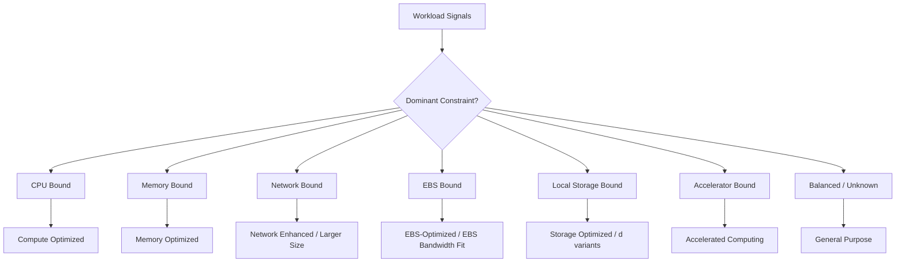
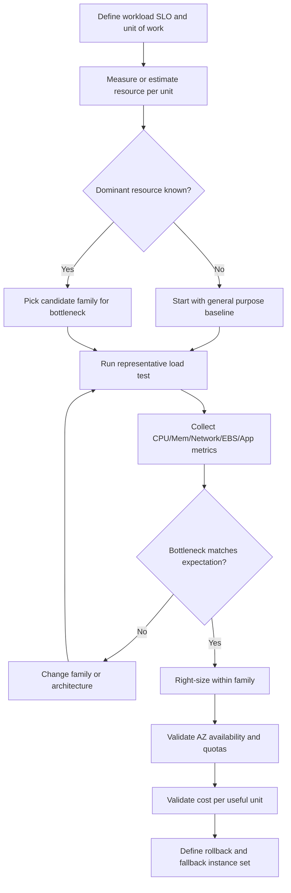
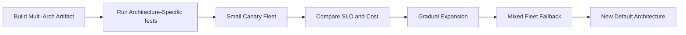
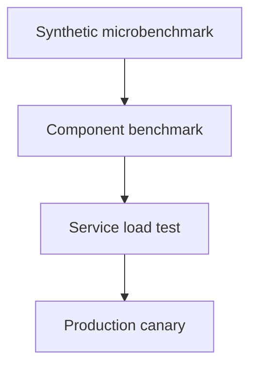

# Part 010 — EC2 Instance Family Selection

Most poor EC2 choices come from choosing instance types like this:

```txt
"This is a Java service, use m-family."
"This is CPU-heavy, use c-family."
"This is important, use a bigger instance."
"This is slow, double the vCPU."
```

That is not engineering. That is superstition with an AWS bill.

A production engineer chooses an EC2 instance by identifying the **dominant constraint** of the workload:

- CPU instruction throughput
- memory footprint
- memory bandwidth
- network bandwidth
- packets per second
- EBS bandwidth
- local NVMe performance
- GPU/accelerator requirement
- latency sensitivity
- cache behavior
- startup time
- capacity availability
- cost per useful unit
- operational risk

This part gives you a decision model.

---

## 1. Problem yang Diselesaikan

EC2 offers many instance families and sizes. Each instance type has a particular ratio of:

```txt
vCPU : memory : network : EBS bandwidth : local storage : accelerator : price : availability
```

The right choice is not the biggest instance. It is the instance whose resource shape matches the workload’s bottleneck and failure model.

The wrong instance type creates one of these outcomes:

| Wrong choice | Symptom |
|---|---|
| Too little CPU | high run queue, request latency, slow batch completion |
| Too little memory | GC pressure, swapping, OOM kills, low cache hit ratio |
| Too little network | high transfer latency, packet drops, connection stalls |
| Too little EBS bandwidth | high disk await, database stalls, queue backlog |
| No local NVMe when needed | slow scratch/shuffle/temp workload |
| Too much instance | low utilization, high cost, poor bin-packing |
| Rare instance family | scaling failure during incident |
| Wrong architecture | app incompatibility, library/runtime issue |
| Wrong size | noisy tail latency due to insufficient headroom |

Instance selection is therefore both a performance and reliability decision.

---

## 2. Mental Model: Instance Type as Resource Vector

Model an EC2 instance type as a resource vector:

```txt
InstanceType = {
  cpu_arch,
  vcpu_count,
  cpu_generation,
  memory_gib,
  memory_bandwidth,
  network_baseline,
  network_burst,
  ebs_bandwidth,
  instance_store,
  gpu_or_accelerator,
  numa_shape,
  price,
  region_az_availability,
  purchasing_options
}
```

Your workload consumes another vector:

```txt
WorkloadDemand = {
  cpu_per_request,
  memory_per_process,
  memory_per_connection,
  io_ops_per_second,
  io_throughput,
  network_bytes_per_second,
  packets_per_second,
  startup_cost,
  concurrency,
  state_size,
  tail_latency_target,
  interruption_tolerance
}
```

The engineering task is to match the two vectors with enough headroom.



Do not start from the family. Start from the signal.

---

## 3. Instance Naming Convention

An instance type name encodes useful hints.

Example:

```txt
m7g.4xlarge
```

Read it as:

| Segment | Meaning |
|---|---|
| `m` | instance family/series: general purpose |
| `7` | generation |
| `g` | option/suffix; here commonly Graviton-based |
| `4xlarge` | size within the family |

Another example:

```txt
i4i.8xlarge
```

| Segment | Meaning |
|---|---|
| `i` | storage optimized family |
| `4` | generation |
| `i` | processor/platform option, depending on family naming |
| `8xlarge` | size |

Do not over-interpret names. They are useful hints, not full specifications. Always check the exact current specs for:

- vCPU
- memory
- network performance
- EBS bandwidth
- instance store availability
- processor architecture
- Region availability
- pricing
- supported purchasing options

---

## 4. Major EC2 Family Categories

### 4.1 General Purpose

Use when compute, memory, and network usage are roughly balanced.

Typical workloads:

- web/API servers
- app servers
- small to medium databases with moderate load
- build agents
- internal tools
- control-plane services
- balanced Java/.NET/Node services

General purpose is a good default when:

```txt
You do not yet know the bottleneck,
and the service has no extreme CPU, memory, storage, or accelerator requirement.
```

But “default” does not mean “final”. Measure and revisit.

### 4.2 Compute Optimized

Use when CPU is the bottleneck and memory per vCPU is not the primary constraint.

Typical workloads:

- high-throughput stateless APIs
- batch processing
- media encoding
- scientific compute
- CPU-bound workers
- some inference workloads
- game servers
- compression/encryption-heavy workloads

Signals:

- high CPU utilization correlated with latency/backlog
- low memory pressure
- high run queue
- request time dominated by CPU sections
- scaling horizontally reduces latency linearly until downstream bottleneck

### 4.3 Memory Optimized

Use when memory capacity, memory/cache footprint, or GC behavior dominates.

Typical workloads:

- in-memory cache
- analytics engine
- JVM service with large heap
- high-cardinality indexing
- memory-resident data structures
- large database working set

Signals:

- GC pause or allocation pressure
- OOM kills
- swap activity
- low page cache hit ratio
- high memory RSS relative to instance size
- latency improves when heap/cache size increases

### 4.4 Storage Optimized

Use when local storage latency/throughput is central to the workload.

Typical workloads:

- distributed databases using replicated local NVMe
- search/indexing nodes
- Kafka-like log workloads, with careful durability design
- cache fleets
- shuffle-heavy data processing
- temporary high-throughput scratch

Signals:

- EBS network-attached storage is not enough or too expensive
- local NVMe scratch materially improves throughput
- data is replicated or reconstructable
- workload benefits from very low local storage latency

### 4.5 Accelerated Computing

Use when specialized hardware matters.

Typical workloads:

- GPU training/inference
- graphics/rendering
- high-performance floating-point workloads
- video processing
- specialized ML inference accelerators

Signals:

- CPU implementation is economically or technically insufficient
- framework supports the accelerator
- data loading path can feed the accelerator
- memory on accelerator is sufficient
- utilization can be kept high

### 4.6 Burstable

Burstable instances can be useful for low-to-moderate average CPU workloads with occasional bursts.

Typical workloads:

- dev/test
- small services
- low-traffic admin tools
- bastion-like utilities
- small build tasks

Signals:

- low average CPU
- occasional burst needed
- predictable low baseline
- cost sensitivity

Risk:

```txt
Burstable is bad for workloads that silently become always-on CPU consumers.
```

When a burstable instance is chosen for production, explicitly monitor credit behavior and sustained CPU requirement.

---

## 5. Decision Matrix

| Workload shape | First family to test | Why |
|---|---|---|
| Unknown balanced API | General purpose | Balanced ratio and safe baseline |
| CPU-bound stateless API | Compute optimized | More CPU per dollar if memory is not limiting |
| JVM service with large heap | Memory optimized or larger general purpose | Avoid GC/OOM/tail latency issues |
| Low-traffic internal tool | Burstable or small general purpose | Cost-efficient if baseline is low |
| High packet/network service | Larger size or network-enhanced family | Network limits often scale with size/family |
| EBS-heavy database | Instance with sufficient EBS bandwidth + right EBS volume | Both instance and volume matter |
| Local scratch / shuffle | Storage optimized or `d` variant | Local NVMe reduces temp I/O bottleneck |
| Replicated local-storage database | Storage optimized | Local disk is part of performance contract |
| GPU inference | Accelerated computing | Specialized hardware required |
| Batch CPU jobs | Compute optimized, Spot-compatible | Throughput per dollar and interruption strategy |
| Memory cache | Memory optimized | Capacity per node and predictable memory behavior |

---

## 6. A Practical Selection Algorithm

Use this algorithm before picking an instance type.



The key phrase is **representative load test**.

A benchmark that does not resemble production is worse than no benchmark because it creates false confidence.

---

## 7. Workload Signals to Collect

### 7.1 CPU signals

Collect:

- CPU utilization per core
- run queue length
- context switches
- CPU steal time
- user vs system CPU
- load average relative to vCPU
- request CPU time if available
- thread pool saturation

Interpretation:

| Signal | Meaning |
|---|---|
| high CPU + high throughput + low wait | likely CPU-bound and healthy |
| high CPU + rising latency | CPU saturated or lock contention |
| low CPU + high latency | bottleneck elsewhere |
| high system CPU | kernel/network/filesystem overhead possible |
| high steal | noisy/host-level contention signal; investigate |
| high load average + low CPU | I/O wait, locks, or blocked threads |

### 7.2 Memory signals

Collect:

- RSS
- heap usage
- page cache
- swap in/out
- OOM kills
- GC pause time
- allocation rate
- memory bandwidth if relevant
- cache hit ratio

Interpretation:

| Signal | Meaning |
|---|---|
| frequent GC + high allocation | heap/object churn issue |
| OOM kill | capacity or leak issue |
| swap activity | severe memory pressure for most server workloads |
| page cache misses | working set too large or poor locality |
| low memory usage | family may be over-provisioned |

### 7.3 Network signals

Collect:

- bytes in/out
- packets per second
- retransmits
- connection count
- ephemeral port usage
- accept queue drops
- TLS handshake rate
- downstream latency

Interpretation:

| Signal | Meaning |
|---|---|
| high bytes/sec | bandwidth-bound possibility |
| high packets/sec | packet processing bottleneck possible |
| retransmits | network path or overload signal |
| many short connections | connection management overhead |
| downstream latency high | not an EC2 sizing issue alone |

### 7.4 EBS signals

Collect:

- volume read/write IOPS
- volume throughput
- average queue length
- await/read/write latency from OS tools
- instance EBS bandwidth limit utilization
- filesystem metrics
- application I/O latency

Interpretation:

| Signal | Meaning |
|---|---|
| volume at IOPS limit | volume config too low or I/O pattern inefficient |
| instance EBS bandwidth saturated | bigger/different instance needed |
| high await with low throughput | small random I/O or queueing issue |
| application slow but disk idle | bottleneck elsewhere |

### 7.5 Application signals

Cloud metrics are not enough.

Collect:

- request rate
- queue depth
- p50/p95/p99 latency
- error rate
- timeout rate
- retry rate
- dependency latency
- worker utilization
- batch completion time
- cost per request/job

Instance selection is correct only when the **application SLO** is satisfied economically.

---

## 8. Java-Specific Instance Selection Notes

For Java services, memory and CPU are entangled through GC.

A JVM service may look CPU-bound because GC is consuming CPU due to memory pressure.

### Important Java signals

| Signal | Possible implication |
|---|---|
| high GC CPU | heap too small, allocation too high, wrong GC config, memory pressure |
| long tail latency during GC | heap/layout/collector issue, not necessarily instance CPU |
| high allocation rate | object churn; bigger instance may only hide issue |
| many runnable threads | CPU or lock contention |
| many blocked threads | dependency, lock, or pool bottleneck |
| low CPU with high p99 | waiting, synchronization, downstream latency |

### Java sizing heuristic

Do not size only by heap.

Memory budget:

```txt
Instance memory >= heap
                 + metaspace
                 + direct buffers
                 + thread stacks
                 + code cache
                 + native libraries
                 + agent overhead
                 + OS memory
                 + page cache
                 + safety headroom
```

For containerized Java this becomes even more important, but even on raw EC2 the principle holds.

### JVM on Graviton

Graviton-based instances can be attractive for price/performance, but validate:

- JDK support
- native library compatibility
- crypto/compression behavior
- profiling agent support
- architecture-specific dependencies
- performance under real traffic

Do not migrate architecture purely by assumption. Benchmark the application, not only a synthetic loop.

---

## 9. Network and EBS Scale with Instance Size

Many teams downsize an instance because CPU is low, then accidentally reduce network or EBS bandwidth and hurt latency.

Instance size is not just vCPU and memory. Bigger sizes often provide higher:

- network bandwidth
- packet processing capability
- EBS bandwidth
- ENA performance characteristics
- memory bandwidth
- local disk count/throughput, for storage families

Therefore, right-sizing must preserve the real bottleneck.

Example:

```txt
A service uses only 20% CPU on m-family 4xlarge.
Team downsizes to xlarge.
CPU is still fine, but EBS throughput drops.
Database-backed local index refresh becomes slow.
p99 rises.
```

The original instance was not oversized for CPU. It was sized for EBS/network headroom.

---

## 10. CPU Architecture: x86 vs Arm/Graviton

Instance architecture is an application compatibility decision and a cost/performance decision.

### Validate before switching architecture

| Area | Question |
|---|---|
| Runtime | Does the language/runtime support target architecture well? |
| Native deps | Any JNI, native modules, OS packages, vendor agents? |
| Container images | Are images multi-arch? |
| Build pipeline | Can CI build and test for target architecture? |
| Observability | Do agents/profilers/security tools support it? |
| Performance | Does real workload improve, degrade, or change bottleneck? |
| Rollback | Can fleet mix architectures safely during migration? |

### Safe migration pattern



Do not mix architectures accidentally if your deployment artifacts are not architecture-neutral.

---

## 11. Choosing Size Within a Family

Once the family is plausible, choose size using three constraints:

1. resource headroom
2. failure blast radius
3. cost efficiency

### Large instances

Pros:

- fewer nodes
- easier local cache efficiency
- often higher network/EBS bandwidth
- fewer load balancer targets
- fewer OS/process overheads

Cons:

- larger blast radius per node
- slower replacement if capacity scarce
- coarser scaling increments
- risk of underutilization
- bigger cold-start/catch-up impact

### Small instances

Pros:

- fine-grained scaling
- smaller blast radius
- easier bin-packing
- more flexible Spot diversification

Cons:

- more nodes to operate
- more connection overhead
- lower per-node network/EBS limits
- more deployment churn
- higher relative daemon/agent overhead

### Rule of thumb

Prefer the smallest size that:

```txt
meets p95/p99 SLO under representative load
+ has enough network/EBS/memory headroom
+ keeps node count operationally manageable
+ does not create too-large failure blast radius
```

---

## 12. Instance Count vs Instance Size

Suppose you need 64 vCPU total.

You could run:

```txt
2 × 32 vCPU
4 × 16 vCPU
8 × 8 vCPU
16 × 4 vCPU
```

The best answer depends on the workload.

| Workload characteristic | Prefer fewer/larger | Prefer more/smaller |
|---|---:|---:|
| large local cache | Yes | Maybe |
| high per-node EBS/network requirement | Yes | Maybe |
| strict blast-radius control | No | Yes |
| fast horizontal scaling | No | Yes |
| expensive process startup | Yes | Maybe |
| noisy workload variance | Maybe | Yes |
| stateful shard per node | Maybe | Maybe |
| Spot diversification | No | Yes |

### Tail latency effect

More nodes can reduce per-node load but increase fleet-level variance. Fewer nodes can simplify operations but increase impact when one node degrades.

Fleet design is a queueing problem, not only arithmetic.

---

## 13. Capacity Availability and Quota Are Design Inputs

An instance type that benchmarks perfectly but cannot be launched during an incident is not a good production default.

Validate:

- Region availability
- AZ availability
- On-Demand quota
- Spot availability if used
- launch limits
- fallback families
- mixed instance policy compatibility
- AMI architecture compatibility
- Reserved/Savings Plan coverage assumptions

### Fallback set

For critical fleets, define a fallback set:

```yaml
primary:
  - m7g.large
fallback:
  - m6g.large
  - m8g.large
  - m7i.large
  - m6i.large
constraints:
  architecture_mixed: only_if_artifact_multi_arch
  min_memory_gib: 8
  min_network: baseline_required
  min_ebs_bandwidth: required
```

The exact families will change over time. The pattern matters more than the specific example.

---

## 14. Cost Model: Cost per Useful Unit

Do not optimize for instance hourly price alone.

Optimize for:

```txt
cost per successful request
cost per completed job
cost per GiB processed
cost per p99-compliant unit of traffic
cost per durable write
```

Formula examples:

```txt
cost_per_request = instance_hourly_cost / successful_requests_per_hour
```

```txt
cost_per_batch_job = total_compute_cost_for_window / completed_jobs
```

```txt
cost_per_gib_processed = compute_cost / gib_processed
```

A more expensive instance can be cheaper if it completes more useful work or reduces retries, errors, and tail latency.

### Hidden cost factors

| Factor | How it distorts cost |
|---|---|
| Retries | More CPU/network/storage per successful request |
| Tail latency | Requires overprovisioning or violates SLO |
| Slow deployment | Longer rollout windows and more idle capacity |
| Poor cache locality | More downstream reads |
| Wrong storage path | Excessive EBS/S3/API cost |
| Underutilized GPU | Very high idle cost |
| Capacity scarcity | Operational incident cost |

---

## 15. Benchmarking Methodology

A useful EC2 benchmark has four layers:



### 15.1 Synthetic microbenchmark

Use to understand raw resource limits:

- CPU math
- memory bandwidth
- disk I/O
- network throughput

But do not use it alone for instance selection.

### 15.2 Component benchmark

Use real components:

- JVM runtime
- database engine
- compression library
- ML framework
- file processing code
- TLS stack

### 15.3 Service load test

Use realistic request mix:

- read/write ratio
- payload size distribution
- concurrency
- dependency latency
- cache warm/cold mix
- error/retry behavior

### 15.4 Production canary

Use small controlled production traffic to validate:

- p99 latency
- error rate
- resource headroom
- observability agents
- cost per unit
- deployment compatibility

### Benchmark checklist

- [ ] Same AMI/kernel/runtime version
- [ ] Same deployment artifact
- [ ] Same configuration
- [ ] Same storage class/volume config
- [ ] Same Region/AZ assumptions
- [ ] Warmup period excluded or measured separately
- [ ] p95/p99 measured, not only average
- [ ] Failure and restart behavior tested
- [ ] Cost normalized by useful work

---

## 16. Example: Choosing for a Java API Service

### Workload

- Java 21 API service
- 1 KB to 50 KB JSON payloads
- mostly synchronous HTTP
- p99 target: 150 ms
- DB dependency p99: 40 ms
- average CPU today: 35%
- p99 latency spikes during traffic bursts
- GC pause observed

### Bad conclusion

```txt
CPU is only 35%, so downsize.
```

### Better analysis

Collect:

- heap occupancy before/after GC
- allocation rate
- thread pool utilization
- DB connection pool wait
- p99 by endpoint
- CPU during p99 spikes
- network bytes and packets
- memory headroom

Possible outcomes:

| Finding | Instance decision |
|---|---|
| GC pressure due to heap | larger memory ratio or tune heap/GC |
| DB pool wait | instance type irrelevant; tune pool/downstream |
| CPU spike during JSON serialization | compute optimized may help |
| network packets high | larger/network-enhanced instance may help |
| no host bottleneck | fix app/dependency architecture |

The correct instance family cannot be chosen from average CPU alone.

---

## 17. Example: Choosing for Batch Workers

### Workload

- CPU-heavy document processing
- stateless workers
- input from S3
- output to S3
- jobs can retry
- deadline: finish nightly batch by 05:00

### Selection model

Prioritize:

- cost per completed job
- CPU throughput
- startup time
- interruption tolerance
- Spot compatibility
- S3 request/throughput behavior
- queue depth scaling

Likely candidates:

- compute optimized instances
- Spot diversified across compatible families
- larger instances if startup overhead dominates
- smaller instances if retry blast radius matters

### Benchmark unit

```txt
completed_documents_per_instance_hour
```

Not CPU utilization alone.

### Failure model

If using Spot:

- checkpoint or make jobs short enough to retry cheaply
- handle interruption notice
- use idempotent output writes
- avoid partial output corruption
- maintain On-Demand fallback if deadline matters

---

## 18. Example: Choosing for Search/Index Nodes

### Workload

- local index shards
- high read rate
- periodic segment merge
- large page cache benefits
- fast local reads useful
- data can be rebuilt from source

### Selection model

Prioritize:

- memory for page cache
- local NVMe if shard storage benefits from locality
- network for replication/query fanout
- CPU for indexing/merge
- recovery time if node lost

Likely candidates:

- storage optimized if local NVMe is central
- memory optimized if page cache dominates
- general purpose if balanced and small scale

### Critical question

```txt
Can we lose the local index and rebuild it within acceptable time?
```

If yes, local instance store can be excellent. If no, rethink durability.

---

## 19. Anti-Patterns

### Anti-pattern 1: “Use latest generation everywhere”

Latest generation is often good, but production also cares about:

- Region availability
- quota
- library compatibility
- reserved commitment
- tested AMI support
- operational familiarity

Use latest as a candidate, not as dogma.

### Anti-pattern 2: “CPU low means oversized”

The instance may be sized for memory, EBS, network, or tail latency.

### Anti-pattern 3: “Bigger instance fixes slow app”

Bigger instances cannot fix:

- N+1 queries
- lock contention
- overloaded database
- poor cache key design
- synchronous dependency chain
- serial algorithm
- bad retry storm

### Anti-pattern 4: “One instance family for all services”

This simplifies procurement but wastes money and hides bottlenecks.

### Anti-pattern 5: “Spot everywhere without interruption design”

Spot is a capacity and cost tool. It is not magic cheap On-Demand.

### Anti-pattern 6: “Use storage optimized because the app uses disk”

Every app uses disk. Storage optimized is for workloads whose performance/cost depends materially on local storage behavior.

---

## 20. Production Selection Checklist

Before finalizing an EC2 instance type:

- [ ] Is the workload bottleneck known?
- [ ] Was the candidate tested with representative traffic?
- [ ] Are p95/p99 SLOs satisfied?
- [ ] Is memory headroom sufficient under peak?
- [ ] Is GC behavior acceptable for JVM workloads?
- [ ] Is network bandwidth sufficient?
- [ ] Are packet rate and connection behavior acceptable?
- [ ] Is EBS bandwidth sufficient at the instance level?
- [ ] Does storage layout match workload access pattern?
- [ ] Is local instance store data disposable or replicated?
- [ ] Is architecture compatible with runtime and dependencies?
- [ ] Is the instance type available in required Regions/AZs?
- [ ] Are quotas sufficient for scale-out and failover?
- [ ] Is there a fallback family set?
- [ ] Is cost measured per useful unit?
- [ ] Is blast radius acceptable per node?
- [ ] Is scaling granularity acceptable?
- [ ] Is deployment/rollback tested?

---

## 21. Decision Table for Quick Review

| Primary signal | Bad reaction | Better reaction |
|---|---|---|
| CPU high | immediately double size | confirm CPU-bound path, try compute optimized, optimize hot code |
| Memory high | add vCPU | inspect heap/RSS/cache/swap, try memory optimized or tune memory |
| Disk latency high | increase volume only | check instance EBS limit and filesystem/application I/O |
| Network high | add more instances blindly | check bandwidth, packet rate, connection reuse, larger/network-capable family |
| p99 high but CPU low | downsize | inspect dependency wait, locks, GC, network, queueing |
| Low utilization | declare waste | identify resource that instance is sized for |
| Scaling failure | blame ASG | check quota, capacity availability, fallback families |
| Cost high | buy commitment first | right-size, benchmark alternatives, then commit |

---

## 22. Mini Case Study: Wrong Family, Correct Metrics

### Context

A team runs a high-throughput ingestion service on a general-purpose family.

Symptoms:

- CPU average: 45%
- memory usage: 50%
- p99 latency: unstable
- EBS write throughput: high
- queue depth rises during bursts
- application logs show slow local persistence step

The team first proposes doubling instance count.

### Investigation

OS metrics show:

- disk await rises during bursts
- EBS throughput near instance-level limit
- volume still has configured headroom
- CPU is not saturated

The bottleneck is not CPU or volume configuration. It is the instance’s EBS path.

### Better options

1. Move to instance size/family with higher EBS bandwidth.
2. Reduce synchronous local write amplification.
3. Batch writes more efficiently.
4. Use different EBS volume layout if volume-level limit is also reached.
5. Move transient staging to instance store if data can be reconstructed.
6. Decouple ingestion with queue and async persistence.

### Lesson

The right metric changed the conversation from:

```txt
"Need more servers."
```

to:

```txt
"Need more EBS bandwidth or different write architecture."
```

That is the difference between cloud usage and cloud engineering.

---

## 23. Summary

EC2 instance selection is not a catalog lookup. It is bottleneck matching.

A strong engineer asks:

```txt
What resource is the workload actually consuming?
What resource creates tail latency or backlog?
What instance family gives the right shape?
What size gives enough headroom without excessive blast radius?
Can we launch enough of it during failure?
What is the cost per useful unit?
```

The best EC2 instance type is the one that satisfies workload SLOs with acceptable cost, availability, and operational risk.

Next, we will continue with **EC2 sizing using real workload signals**, where we will turn this selection model into a measurement-driven sizing workflow.

---

## References

- Amazon EC2 Instance Types: https://docs.aws.amazon.com/AWSEC2/latest/UserGuide/instance-types.html
- Amazon EC2 Instance Type Naming Conventions: https://docs.aws.amazon.com/ec2/latest/instancetypes/instance-type-names.html
- General Purpose Instance Specifications: https://docs.aws.amazon.com/ec2/latest/instancetypes/gp.html
- Compute Optimized Instance Specifications: https://docs.aws.amazon.com/ec2/latest/instancetypes/co.html
- Accelerated Computing Instance Specifications: https://docs.aws.amazon.com/ec2/latest/instancetypes/ac.html
- Amazon EC2 Instance Network Bandwidth: https://docs.aws.amazon.com/AWSEC2/latest/UserGuide/ec2-instance-network-bandwidth.html
- Amazon EBS-Optimized Instances: https://docs.aws.amazon.com/AWSEC2/latest/UserGuide/ebs-optimized.html
- Amazon EC2 Instance Store: https://docs.aws.amazon.com/AWSEC2/latest/UserGuide/InstanceStorage.html
- Amazon EC2 Instance Type Quotas: https://docs.aws.amazon.com/ec2/latest/instancetypes/ec2-instance-quotas.html
- Change the Instance Type: https://docs.aws.amazon.com/AWSEC2/latest/UserGuide/ec2-instance-resize.html
