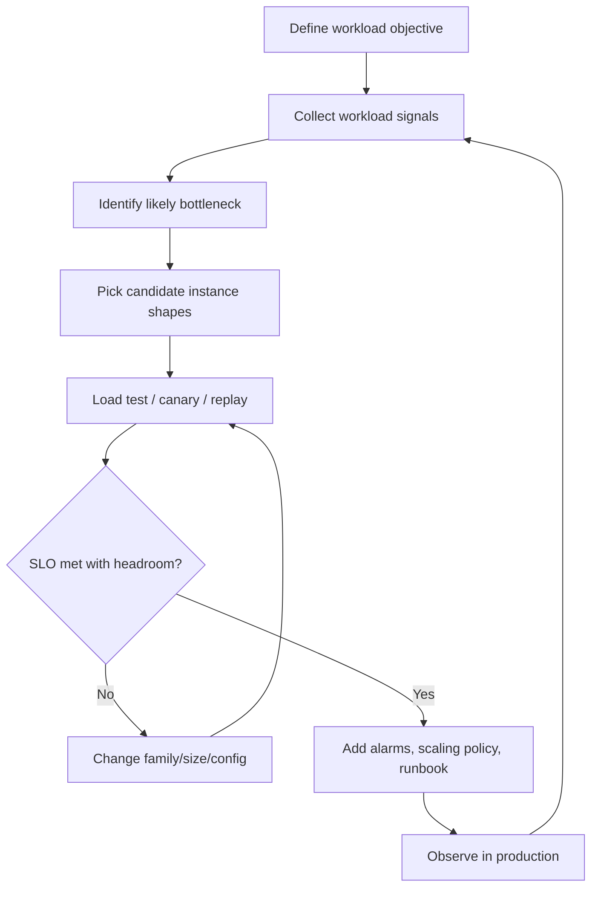
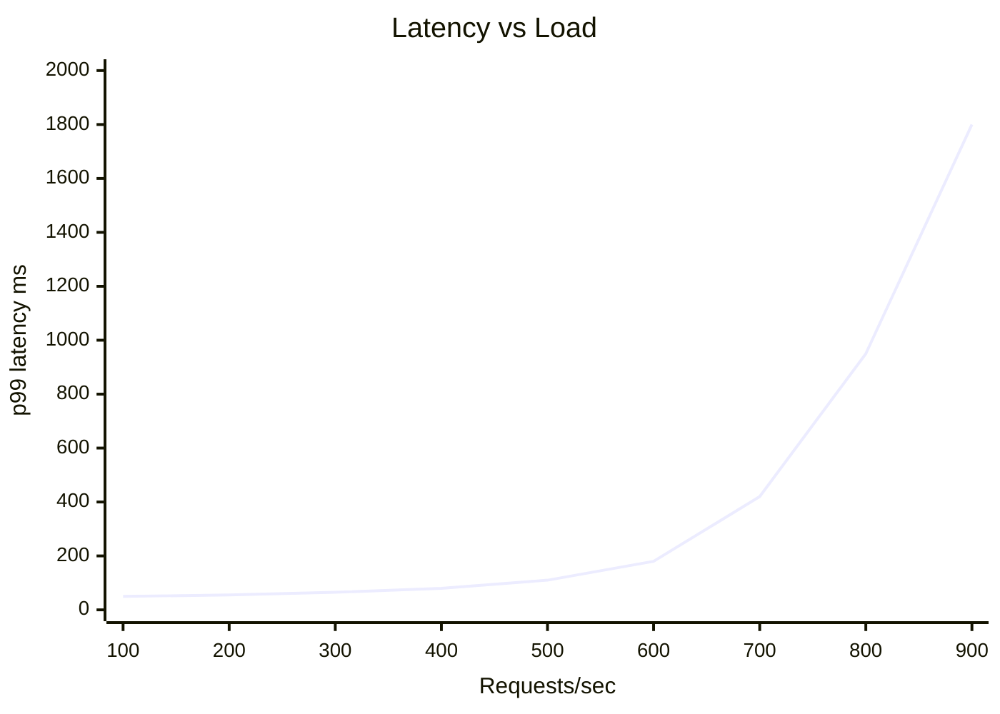
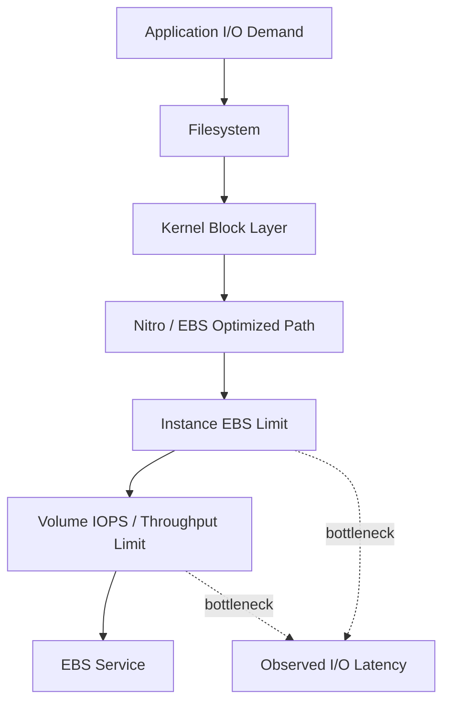

# Part 011 — EC2 Sizing with Real Workload Signals

Most EC2 sizing mistakes happen because engineers ask the wrong first question:

```txt
What instance type should I use?
```

The better question is:

```txt
What resource becomes unsafe first when this workload approaches production demand?
```

EC2 sizing is not a catalog lookup. It is a constraint-discovery process.

You are trying to find the smallest reliable shape that can satisfy the workload's latency, throughput, recovery, and cost constraints while leaving enough headroom for spikes, noisy runtime behavior, deployments, failover, and measurement error.

This part teaches sizing as an engineering loop:

```txt
observe -> hypothesize -> test -> size -> protect -> remeasure
```

Not:

```txt
pick m7i.large -> hope -> panic scale
```

---

## 1. Problem yang Diselesaikan

An EC2 instance can be wrong in many ways:

| Wrong sizing dimension | Production symptom |
|---|---|
| CPU too small | high latency, long run queue, slow batch completion, request timeout |
| Memory too small | GC pressure, swapping, OOM kill, poor cache hit ratio |
| Network too small | stalled connections, slow replication, high transfer latency |
| EBS bandwidth too small | database stalls, high disk await, slow startup, write backlog |
| IOPS too small | random read/write latency, queue growth, low transaction throughput |
| Instance too large | poor cost efficiency, low fleet granularity, expensive overprovisioning |
| Instance too small | many nodes, high coordination overhead, noisy deployment behavior |
| Wrong family | bottleneck in hidden dimension, not visible in CPU average |
| No headroom | failover works on paper but not under real traffic |
| No fallback type | scaling fails during regional capacity pressure |

Sizing is not just performance tuning. It affects:

- availability
- deployment safety
- cost
- recovery time
- blast radius
- autoscaling behavior
- quota consumption
- operational debugging
- failure isolation

A top-tier engineer does not size EC2 by intuition alone. They size it from signals.

---

## 2. Mental Model: EC2 Sizing as Constraint Matching

Think of each instance as a resource envelope:

```txt
InstanceEnvelope = {
  cpu_time,
  memory_space,
  network_bytes,
  network_packets,
  ebs_iops,
  ebs_throughput,
  local_disk_io,
  connection_capacity,
  process_capacity,
  startup_capacity,
  failure_headroom
}
```

The workload consumes that envelope:

```txt
WorkloadDemand = {
  requests_per_second,
  cpu_ms_per_request,
  memory_per_worker,
  memory_per_connection,
  read_iops,
  write_iops,
  bytes_in,
  bytes_out,
  disk_bytes_per_operation,
  background_jobs,
  deployment_overlap,
  failover_multiplier
}
```

Sizing means matching the two with explicit safety margin:

```txt
SafeCapacity(instance) >= PeakDemand * SafetyFactor
```

But the important part is the word **safe**.

An instance may technically handle 1,000 requests/sec in a benchmark but only handle 650 requests/sec safely when you include:

- p99 latency target
- GC pauses
- TLS overhead
- logging volume
- dependency latency
- retry storms
- deployment overlap
- AZ failover
- EBS burst depletion
- CPU credit depletion for burstable types
- kernel and agent overhead

Therefore:

```txt
UsableCapacity != MaximumCapacity
```

A better sizing equation is:

```txt
usable_capacity = measured_capacity_at_slo * utilization_target * confidence_factor
```

Example:

```txt
measured_capacity_at_p99_slo = 900 rps
utilization_target          = 0.65
confidence_factor           = 0.85
usable_capacity             = 900 * 0.65 * 0.85
                            = 497 rps per instance
```

If peak demand is 3,000 rps:

```txt
required_instances = ceil(3000 / 497) = 7
```

That is sizing.

Not:

```txt
CPU average is only 40%, so we are fine.
```

---

## 3. The Sizing Loop

Sizing must be an iterative loop.



Each pass should answer one question:

```txt
What fails first?
```

If the first failure is CPU, you need CPU shape or software optimization.
If memory fails first, you need memory shape or memory behavior change.
If EBS latency fails first, a larger CPU instance may do nothing.
If downstream dependency fails first, EC2 is not the bottleneck.

---

## 4. Three Classes of Signals

Real sizing uses three signal layers.

### 4.1 Cloud-Level Signals

These come from AWS services such as CloudWatch.

Examples:

| Signal | What it tells you |
|---|---|
| `CPUUtilization` | instance-level CPU use |
| `NetworkIn` / `NetworkOut` | network bytes transferred |
| `NetworkPacketsIn` / `NetworkPacketsOut` | packet rate pressure |
| `EBSReadOps` / `EBSWriteOps` | attached EBS operation volume on Nitro instances |
| `EBSReadBytes` / `EBSWriteBytes` | EBS throughput volume |
| `StatusCheckFailed` | instance/system reachability issue |
| `CPUCreditBalance` | remaining burst capacity for burstable instances |
| `CPUSurplusCreditBalance` | surplus burst usage on unlimited burstable instances |

Cloud-level signals are useful, but they are not enough.

CloudWatch can tell you the instance is busy. It usually cannot tell you exactly why the JVM is inefficient, why a thread pool is saturated, or why a filesystem is full unless you publish those metrics.

### 4.2 OS-Level Signals

These come from the operating system.

Examples:

| Signal | Linux source | What it tells you |
|---|---|---|
| load average | `uptime`, `/proc/loadavg` | runnable/blocked work pressure |
| CPU steal | `mpstat`, `top` | hypervisor scheduling wait; usually should be low |
| run queue | `vmstat`, `pidstat` | CPU contention |
| context switches | `vmstat` | scheduler churn |
| free memory | `free`, `/proc/meminfo` | memory pressure |
| page faults | `pidstat`, `vmstat` | memory behavior |
| swap in/out | `vmstat` | dangerous memory exhaustion signal |
| disk await | `iostat` | block I/O latency |
| disk queue | `iostat` | storage backlog |
| filesystem free | `df` | disk-full risk |
| socket states | `ss` | connection behavior |
| retransmits | `netstat`, `ss`, `nstat` | network path issues |
| open files | `lsof`, `/proc/sys/fs/file-nr` | descriptor pressure |

These signals explain the shape of pressure.

### 4.3 Application-Level Signals

These are the most important for sizing because they connect resource usage to business behavior.

Examples:

| Signal | Why it matters |
|---|---|
| requests/sec | demand rate |
| p50/p95/p99 latency | user-visible performance |
| error rate | SLO violation |
| queue depth | backlog and deferred saturation |
| worker utilization | hidden concurrency pressure |
| DB connection pool usage | dependency pressure |
| retry rate | amplification risk |
| timeout rate | user-visible failure |
| GC pause time | JVM runtime overhead |
| heap used after GC | memory floor |
| off-heap/direct memory | hidden memory use |
| thread count | scheduler and memory pressure |
| cache hit ratio | memory-vs-latency trade-off |
| payload size | CPU/network/storage cost driver |

A service with 40% CPU can still be undersized if p99 latency is already near the SLO because of dependency waits, lock contention, or GC pauses.

---

## 5. The Golden Rule: Size from the Saturation Point, Not the Average

Average metrics hide failures.

Bad sizing uses this:

```txt
Average CPU over 1 hour = 42%
```

Good sizing asks:

```txt
At what load does p99 latency break?
At what load does queue depth stop draining?
At what load does GC become nonlinear?
At what load does EBS await exceed acceptable latency?
At what load does network retransmission increase?
```

You want to find the **knee of the curve**.



The instance is not safe at 900 rps just because it still returns responses.
The safe zone may end around 600-650 rps, where latency is still controlled.

Production sizing should usually target the flat part of the curve, not the cliff.

---

## 6. CPU Sizing

CPU sizing is not simply vCPU count.

You need to understand:

- CPU utilization
- per-core saturation
- CPU architecture
- clock behavior
- instruction mix
- vectorization
- JVM/JIT behavior
- context switching
- kernel overhead
- encryption/compression cost
- TLS cost
- serialization/deserialization cost
- logging cost
- background jobs
- noisy deployment overlap

### 6.1 CPU Utilization Is a Lagging Signal

CPU utilization tells you how much CPU time was consumed during a window.
It does not tell you directly whether users are waiting.

A service can have:

```txt
CPUUtilization = 55%
p99 latency    = bad
```

Possible causes:

- lock contention
- insufficient worker threads
- slow dependency
- GC pauses
- disk wait
- network wait
- kernel bottleneck
- per-core hot thread
- synchronized section
- connection pool starvation

Therefore, CPU sizing must be paired with latency, queue, and thread signals.

### 6.2 Per-Core Saturation

A 16 vCPU instance at 50% average CPU can still have one hot core saturated.

Typical causes:

- single-threaded event loop
- lock owner thread
- partition leader
- compression thread
- reactor loop
- broker/network poller thread
- one shard doing most work

Check per-core metrics before scaling vertically.

Bad conclusion:

```txt
The instance has 50% CPU headroom.
```

Better conclusion:

```txt
The instance average is 50%, but one core is at 100%; the bottleneck is single-threaded code or partition imbalance.
```

### 6.3 CPU Sizing Formula

For request-driven services, start with:

```txt
cpu_cores_required = (peak_rps * cpu_seconds_per_request) / target_cpu_utilization
```

Example:

```txt
peak_rps                = 1200
cpu_ms_per_request      = 3.5 ms
cpu_seconds_per_request = 0.0035
target_cpu_utilization  = 0.60

cpu_cores_required = (1200 * 0.0035) / 0.60
                   = 7 cores
```

Then add:

- deployment overlap
- logging overhead
- background workers
- retry amplification
- failover multiplier
- runtime overhead

A realistic sizing may become:

```txt
required_vcpu = ceil(7 * 1.3) = 10 vCPU
```

This does not mean you choose exactly 10 vCPU. It means candidate shapes around 8, 12, or 16 vCPU deserve testing.

### 6.4 CPU Bound Workload Signs

| Signal | Meaning |
|---|---|
| high CPU with low disk/network wait | likely CPU-bound |
| run queue grows with load | CPU contention |
| p99 latency rises with CPU | CPU affects user latency |
| adding vCPU improves throughput | CPU was limiting |
| adding memory does not help | not memory-bound |
| GC is low but CPU high | application compute likely dominates |

### 6.5 Java-Specific CPU Signals

For Java services, inspect:

- CPU per request
- GC CPU percentage
- JIT warmup behavior
- serialization cost
- TLS cost
- JSON parsing cost
- logging appenders
- thread pool utilization
- blocking vs async behavior
- lock contention from Java Flight Recorder
- safepoint pauses

A Java service can look CPU-bound when the real issue is allocation churn causing GC CPU.

Common Java sizing mistake:

```txt
CPU is high, use bigger instance.
```

Better path:

```txt
Measure allocation rate, GC pause, GC CPU, and object lifetime first.
```

---

## 7. Memory Sizing

Memory is not just heap.

For a typical Java EC2 service:

```txt
TotalMemoryNeeded = JVM heap
                  + metaspace
                  + direct buffers
                  + thread stacks
                  + code cache
                  + native libraries
                  + page cache
                  + OS/kernel
                  + agents
                  + sidecars
                  + safety margin
```

### 7.1 Memory Sizing Formula

Start with:

```txt
memory_required = baseline_os
                + app_fixed_memory
                + heap_target
                + off_heap
                + thread_count * stack_size
                + page_cache_target
                + agent_overhead
                + safety_margin
```

Example:

```txt
baseline_os       = 0.8 GiB
heap_target       = 6.0 GiB
off_heap          = 1.5 GiB
threads           = 400
stack_size        = 1 MiB
thread_stacks     = 0.4 GiB
page_cache_target = 2.0 GiB
agent_overhead    = 0.5 GiB
safety_margin     = 2.0 GiB

memory_required   = 13.2 GiB
```

Candidate instance:

```txt
>= 16 GiB memory
```

But if you want room for cache, deployment overlap, or batch spikes, a 32 GiB instance may be safer.

### 7.2 Heap Is Not the Whole Process

For Java, containerized or not, do not confuse:

```txt
-Xmx = process memory limit
```

It is not.

The JVM can use memory outside heap:

- direct byte buffers
- metaspace
- code cache
- thread stacks
- JNI/native allocations
- memory-mapped files
- compression libraries
- TLS libraries
- observability agents

A service with `-Xmx6g` can exceed 8 GiB RSS.

### 7.3 Memory Pressure Signs

| Signal | Meaning |
|---|---|
| heap after GC trends upward | possible leak or undersized heap |
| high allocation rate | GC pressure risk |
| swap in/out | severe memory pressure |
| OOM kill | memory envelope violated |
| high page faults | memory pressure or access pattern issue |
| low page cache hit ratio | insufficient cache for file-heavy workload |
| direct buffer OOM | off-heap not accounted for |
| thread creation failure | native memory exhausted |

### 7.4 Swap Policy

For latency-sensitive services, swap is usually a failure amplifier.

Swap can convert a predictable OOM into unpredictable latency collapse.

A common production stance:

```txt
Avoid swap for latency-sensitive application servers.
Use explicit memory limits.
Crash fast.
Restart cleanly.
Alert before exhaustion.
```

For some batch workloads, swap may be acceptable as a survival mechanism, but it should be an explicit decision.

---

## 8. Network Sizing

Network is often misdiagnosed as CPU, database, or storage latency.

Network sizing must include:

- bytes/sec
- packets/sec
- connection count
- connection churn
- TLS handshakes
- cross-AZ transfer
- dependency fan-out
- retry amplification
- replication traffic
- service mesh overhead if present
- observability export traffic

### 8.1 Byte Throughput vs Packet Rate

Two workloads with the same bandwidth can stress the instance differently.

Large payload workload:

```txt
1000 MB/s with large payloads
```

Small packet workload:

```txt
1000 MB/s with tiny packets
```

The second may hit packet-processing limits earlier.

### 8.2 Network Sizing Formula

Start with expected request traffic:

```txt
network_out_per_second = rps * average_response_bytes * fanout_multiplier
network_in_per_second  = rps * average_request_bytes
```

Then add:

- logs
- metrics
- traces
- dependency calls
- replication
- batch transfer
- backup traffic
- deployment/image pull traffic

Example:

```txt
peak_rps               = 2000
avg_response           = 80 KiB
app_out                = 156 MiB/s
fanout_multiplier      = 1.3
observability_overhead = 20 MiB/s

network_out_target = 156 * 1.3 + 20
                   = 223 MiB/s
```

You must compare that with actual instance network behavior and test under realistic traffic.

### 8.3 Network Saturation Signs

| Signal | Meaning |
|---|---|
| high NetworkOut/In near instance capability | bandwidth pressure |
| retransmits increase | packet loss/path pressure |
| connection timeout increases | network or dependency bottleneck |
| CPU softirq high | packet processing pressure |
| p99 increases with payload size | bandwidth or serialization bottleneck |
| cross-AZ traffic cost spike | placement problem |

---

## 9. EBS Sizing

EBS performance is easy to misunderstand because there are two envelopes:

```txt
volume envelope + instance envelope
```

The effective EBS performance is bounded by the smaller of:

```txt
sum(attached_volume_performance)
instance_ebs_performance_limit
```

This means a high-performance volume attached to a small instance may still be slow.



### 9.1 EBS Workload Dimensions

EBS sizing requires at least:

| Dimension | Why it matters |
|---|---|
| IOPS | number of read/write operations |
| throughput | bytes/sec |
| latency | wait time per operation |
| queue depth | outstanding operations |
| block size | relationship between IOPS and throughput |
| read/write mix | database/data pipeline behavior |
| sequential/random | disk access pattern |
| sync/async write | durability and latency behavior |
| burst behavior | temporary vs sustained demand |

### 9.2 IOPS and Throughput Relationship

A simple relationship:

```txt
throughput = IOPS * block_size
```

Example:

```txt
IOPS       = 10,000
block_size = 16 KiB
throughput = 156 MiB/s
```

But if block size is 256 KiB:

```txt
10,000 * 256 KiB = 2,500 MiB/s
```

That may exceed either the volume or instance limit.

You cannot size EBS using IOPS alone.

### 9.3 EBS Saturation Signs

| Signal | Meaning |
|---|---|
| disk await increases | I/O latency rising |
| disk queue grows | storage cannot keep up |
| EBS throughput near limit | bandwidth-bound |
| EBS IOPS near limit | operation-bound |
| app latency follows disk latency | storage bottleneck visible to users |
| CPU idle but app slow | likely waiting on I/O/dependency |
| volume metrics good but instance slow | instance EBS limit or OS/filesystem issue |

### 9.4 Database Storage Sizing

For database-like workloads, measure separately:

- data reads
- index reads
- WAL/redo log writes
- checkpoint writes
- compaction
- vacuum/background maintenance
- backup reads
- replication reads/writes
- crash recovery reads

A database may look fine during normal load and fail during:

- checkpoint
- backup
- reindex
- restore
- replica catch-up
- failover
- large migration
- batch job

Size for maintenance behavior, not just normal query traffic.

---

## 10. Disk Space Sizing

Disk-full failures are some of the most avoidable production incidents.

Do not size disk only from application data.

Include:

- OS files
- application binaries
- logs
- crash dumps
- temp files
- package cache
- deployment artifacts
- container/image cache if applicable
- database data
- WAL/binlog/redo log
- backup staging
- compression staging
- index rebuild temporary files
- monitoring agent buffers
- failed upload/download leftovers

### 10.1 Disk Space Formula

```txt
disk_required = app_data
              + logs_retention_window
              + temp_peak
              + deployment_overlap
              + backup_staging
              + maintenance_peak
              + growth_window
              + emergency_margin
```

Example:

```txt
app_data              = 200 GiB
logs_retention_window = 30 GiB
temp_peak             = 80 GiB
deployment_overlap    = 10 GiB
backup_staging        = 50 GiB
maintenance_peak      = 100 GiB
growth_window         = 60 GiB
emergency_margin      = 20%

base = 530 GiB
with margin = 636 GiB
candidate volume = 700 GiB or 1 TiB
```

Do not forget that increasing EBS size may also affect available baseline performance depending on volume type.

---

## 11. Latency Sizing

Throughput sizing asks:

```txt
Can the instance handle this much work?
```

Latency sizing asks:

```txt
Can it handle this work before the user or upstream system gives up?
```

A system can be throughput-capable but latency-unsafe.

### 11.1 Tail Latency Matters

Design around p95/p99 for user-facing systems.

Average latency can stay flat while p99 explodes.

Common causes:

- GC pause
- disk flush
- lock convoy
- connection pool wait
- noisy neighbor dependency
- DNS/TLS handshake
- retries
- CPU throttling
- page cache miss
- background maintenance

### 11.2 Latency Budget

Break the request path into a budget:

```txt
Total p99 SLO = 300 ms

ALB/proxy       15 ms
service CPU     40 ms
DB call        120 ms
cache call      20 ms
serialization   25 ms
network         30 ms
margin          50 ms
```

If EC2 sizing only looks at CPU, you will miss the budget failure.

### 11.3 Deployment Overlap

During rolling deploys, you may temporarily run fewer healthy instances or double-run app versions.

Sizing must support:

- one instance draining
- one instance warming
- one instance failed
- one AZ impaired
- old and new version overlap
- cache cold start

If the fleet is only safe when all instances are warm and healthy, it is not safe.

---

## 12. Queue-Based Workload Sizing

For workers, the primary signal is often queue behavior.

Use Little's Law as a starting point:

```txt
L = λ * W
```

Where:

```txt
L = average number of items in system
λ = arrival rate
W = average time in system
```

For worker sizing:

```txt
workers_required = arrival_rate * processing_time / target_utilization
```

Example:

```txt
arrival_rate        = 500 jobs/sec
processing_time     = 120 ms = 0.12 sec
target_utilization  = 0.70

workers_required = 500 * 0.12 / 0.70
                 = 86 workers
```

Then map workers to instances:

```txt
workers_per_instance = safe measured workers per instance
instances_required   = ceil(workers_required / workers_per_instance)
```

### 12.1 Queue Backlog Drain Time

For incident recovery, calculate drain capacity:

```txt
drain_rate = processing_rate - arrival_rate
backlog_drain_time = backlog_size / drain_rate
```

If arrival is 10,000 jobs/minute and processing is 12,000 jobs/minute:

```txt
drain_rate = 2,000 jobs/minute
backlog    = 1,000,000 jobs

time = 500 minutes
```

That is more than 8 hours.

Autoscaling that only keeps up with arrival rate may never recover quickly.

---

## 13. Headroom Model

Headroom is not wasted capacity. It is a risk budget.

You need headroom for:

- demand spikes
- dependency slowdown
- retries
- deployments
- failover
- cold cache
- background jobs
- observability overhead
- kernel/runtime overhead
- AZ loss
- forecast error
- capacity acquisition delay

### 13.1 Headroom Types

| Headroom type | Meaning |
|---|---|
| CPU headroom | spare compute before latency cliff |
| memory headroom | room before OOM/swap/GC collapse |
| network headroom | room for burst and retransmit |
| EBS headroom | room for checkpoint/backup/compaction |
| concurrency headroom | spare workers/connections |
| fleet headroom | spare instances for failover |
| quota headroom | room to scale before service quota blocks you |
| operational headroom | room for debugging and emergency change |

### 13.2 Practical Targets

There is no universal number, but practical starting points:

| Workload | Typical target |
|---|---|
| latency-sensitive API | 40-65% resource utilization at peak |
| background worker | 60-80% if backlog can wait |
| batch workload | 80-95% if interruption/retry safe |
| stateful database | conservative; latency and recovery dominate |
| cache | memory headroom matters more than CPU |
| streaming consumer | lag/drain time matters more than CPU average |

The more user-visible and hard-to-recover the workload, the more conservative the headroom.

---

## 14. Instance Count vs Instance Size

Scaling out and scaling up have different failure shapes.

### 14.1 Many Smaller Instances

Benefits:

- better failure granularity
- smoother rolling deploys
- easier AZ distribution
- more parallelism
- lower per-node blast radius
- faster replacement if AMI boots quickly

Costs:

- more connections to dependencies
- more agent overhead
- more coordination
- more logs/metrics
- more ENIs/IP usage
- more scheduler complexity

### 14.2 Fewer Larger Instances

Benefits:

- fewer nodes to manage
- better memory locality for large heaps/caches
- fewer connections
- sometimes better network/EBS bandwidth
- useful for stateful or memory-heavy workloads

Costs:

- larger failure impact
- slower replacement
- coarser scaling
- expensive overprovisioning
- longer warmup
- larger deployment risk

### 14.3 Decision Heuristic

Use smaller instances when:

- stateless service
- horizontal scale is easy
- startup is fast
- workload distributes evenly
- dependency fanout is controlled

Use larger instances when:

- memory working set is large
- EBS/network limits require it
- workload has high per-node cache value
- startup/warmup is expensive
- software has per-node licensing or coordination cost

---

## 15. Burstable Instances

Burstable instances can be excellent for low-duty-cycle workloads.

They are dangerous when engineers treat burst as sustained capacity.

### 15.1 Good Fit

- dev/test
- low traffic admin tools
- small internal services
- low duty-cycle cron nodes
- bursty but low baseline workloads

### 15.2 Risky Fit

- sustained CPU-heavy production service
- latency-sensitive API at steady load
- batch processing needing predictable completion
- workloads with incident-time CPU spikes

### 15.3 Signals to Watch

- CPU credit balance
- surplus credits
- p99 latency during credit depletion
- scaling behavior when all nodes lose burst at once

Failure mode:

```txt
Everything was fine until all instances depleted CPU credits around the same time.
Then latency rose, retries increased, CPU rose further, and the fleet collapsed.
```

Do not use burstable instances without CPU credit alarms and clear workload fit.

---

## 16. Measurement Methodology

Good sizing requires controlled measurement.

### 16.1 Baseline Test

Purpose:

```txt
Find approximate capacity and bottleneck.
```

Method:

- deploy one candidate instance
- use production-like data shape
- generate realistic request mix
- slowly increase load
- record latency, error, CPU, memory, network, disk, dependency metrics
- identify knee of curve

### 16.2 Soak Test

Purpose:

```txt
Find memory leaks, GC drift, file descriptor leaks, cache behavior, and background maintenance issues.
```

Method:

- run for hours or days
- maintain realistic sustained load
- include log rotation, metrics export, retries, scheduled jobs
- inspect memory after GC, disk growth, queue stability

### 16.3 Spike Test

Purpose:

```txt
Find response to sudden demand.
```

Method:

- jump from baseline to peak quickly
- observe autoscaling lag
- observe connection pool behavior
- observe cache miss storm
- observe p99 latency and throttling

### 16.4 Failure Test

Purpose:

```txt
Find behavior under lost capacity.
```

Method:

- terminate one instance
- drain one instance
- remove one AZ from load
- simulate downstream slowdown
- trigger retry behavior
- check whether remaining fleet can absorb load

### 16.5 Deployment Test

Purpose:

```txt
Find capacity during release.
```

Method:

- deploy during representative load
- observe drain/warmup
- measure cold-start and cache refill
- ensure health checks do not admit traffic too early

---

## 17. Candidate Instance Selection Process

A practical candidate selection process:

```txt
1. Classify workload bottleneck.
2. Choose 2-4 candidate families.
3. Choose at least 2 sizes per family.
4. Benchmark under realistic load.
5. Compare cost per safe unit.
6. Compare failure and capacity availability risk.
7. Choose primary + fallback families.
8. Encode in launch template / ASG mixed policy.
```

### 17.1 Candidate Matrix

Example for Java API:

| Candidate | Why test it |
|---|---|
| `m7i.large` | baseline balanced x86 |
| `m7i.xlarge` | more headroom, same family |
| `m7g.large` | Graviton cost/performance comparison |
| `c7i.xlarge` | CPU-heavy hypothesis |
| `r7i.large` | memory/GC hypothesis |

Example for EBS-heavy service:

| Candidate | Why test it |
|---|---|
| general purpose | baseline |
| larger same family | higher EBS/network envelope |
| storage optimized | local disk or high I/O hypothesis |
| memory optimized | page cache hypothesis |

Do not compare only CPU. Compare cost per safe request, cost per safe job, or cost per safe transaction.

---

## 18. Cost per Useful Unit

Raw hourly cost is misleading.

Better metrics:

```txt
cost_per_safe_rps
cost_per_completed_job
cost_per_GiB_processed
cost_per_transaction
cost_per_p99_slo_unit
cost_per_backlog_drain_hour
```

Example:

| Instance | Hourly cost | Safe rps | Cost per 1k safe rps-hour |
|---|---:|---:|---:|
| A | $0.20 | 400 | $0.50 |
| B | $0.32 | 900 | $0.36 |

Instance B is more expensive per hour but cheaper per useful capacity.

Cost optimization is not choosing the cheapest instance. It is choosing the cheapest reliable capacity unit.

---

## 19. Autoscaling Implications

Sizing and autoscaling cannot be separated.

Instance size affects:

- scale step granularity
- warmup time
- rollout safety
- capacity acquisition
- failure impact
- target tracking stability
- Spot availability
- quota consumption

### 19.1 Small Instance Scaling Behavior

Small instances give smoother scaling but can create many nodes.

Potential issues:

- many connections to database
- many ENIs/IPs
- more log/metric volume
- more health checks
- more deployment events

### 19.2 Large Instance Scaling Behavior

Large instances create coarse steps.

Potential issues:

- adding one instance overcorrects
- removing one instance causes large capacity drop
- warmup is slower
- one failure removes significant fleet capacity

### 19.3 Safe Autoscaling Metric

Good autoscaling metric should be:

- correlated with demand
- stable enough to avoid oscillation
- responsive enough to protect SLO
- not already a late failure signal
- normalized per capacity unit when possible

Examples:

| Workload | Possible scaling metric |
|---|---|
| CPU-bound API | CPU + p95/p99 guardrail |
| queue worker | queue age / backlog per worker |
| memory-heavy cache | memory pressure + hit ratio guardrail |
| network-heavy service | network throughput + latency guardrail |
| EBS-heavy service | disk latency / queue depth guardrail |

---

## 20. Terraform Skeleton: Sizing Guardrails

This is not a full production module. It shows the shape of sizing guardrails.

```hcl
resource "aws_cloudwatch_metric_alarm" "high_cpu" {
  alarm_name          = "api-high-cpu"
  comparison_operator = "GreaterThanThreshold"
  evaluation_periods  = 3
  metric_name         = "CPUUtilization"
  namespace           = "AWS/EC2"
  period              = 60
  statistic           = "Average"
  threshold           = 70
  alarm_description   = "CPU is above target headroom. Check p95/p99 latency and scaling behavior."

  dimensions = {
    AutoScalingGroupName = aws_autoscaling_group.api.name
  }
}

resource "aws_cloudwatch_metric_alarm" "failed_status_check" {
  alarm_name          = "api-status-check-failed"
  comparison_operator = "GreaterThanThreshold"
  evaluation_periods  = 2
  metric_name         = "StatusCheckFailed"
  namespace           = "AWS/EC2"
  period              = 60
  statistic           = "Maximum"
  threshold           = 0

  dimensions = {
    AutoScalingGroupName = aws_autoscaling_group.api.name
  }
}
```

For production, add:

- memory metric from CloudWatch Agent
- disk free metric from CloudWatch Agent
- application p95/p99 latency
- queue age
- dependency timeout rate
- GC pause metric
- EBS volume metrics
- autoscaling activity alarms

CloudWatch default EC2 metrics are necessary but insufficient.

---

## 21. Practical Dashboard Layout

A good EC2 sizing dashboard has rows, not random graphs.

### Row 1 — User Impact

- requests/sec
- p50/p95/p99 latency
- error rate
- timeout rate
- saturation status

### Row 2 — Demand and Work

- request mix
- queue depth
- queue age
- jobs/sec
- payload size
- dependency calls/request

### Row 3 — Compute Envelope

- CPU average
- CPU max per instance
- run queue
- context switches
- CPU credits if burstable

### Row 4 — Memory Envelope

- RSS
- heap used after GC
- GC pause
- allocation rate
- swap
- OOM count

### Row 5 — Storage Envelope

- EBS read/write ops
- EBS read/write bytes
- disk await
- disk queue
- filesystem free

### Row 6 — Network Envelope

- NetworkIn/Out
- packets/sec
- retransmits
- connection count
- connection errors

### Row 7 — Fleet Behavior

- instance count
- desired/in-service/pending/terminating
- scaling activity
- unhealthy instance count
- deployment phase

Dashboard rule:

```txt
Every resource graph must be near a user-impact graph.
```

Otherwise you will optimize resource metrics without understanding user impact.

---

## 22. Failure Modes

### 22.1 CPU Average Looks Fine, p99 Is Bad

Likely causes:

- one hot thread/core
- lock contention
- dependency wait
- GC pause
- disk/network wait
- connection pool starvation

Action:

- inspect per-core CPU
- inspect thread dumps/JFR
- inspect dependency latency
- inspect GC logs
- inspect disk and network wait

### 22.2 Memory Looks Fine Until Deploy

Likely causes:

- old and new process overlap
- cache warmup doubles memory
- agent update increases footprint
- direct memory not capped
- thread count grows during startup

Action:

- measure deployment memory peak
- add warmup memory profile
- cap direct memory where appropriate
- reduce overlap or increase instance memory

### 22.3 EBS Volume Is Fast, App Is Slow

Likely causes:

- instance EBS limit
- filesystem issue
- insufficient queue depth
- synchronous fsync pattern
- database checkpoint
- noisy backup job

Action:

- compare instance EBS limit vs volume performance
- inspect `iostat`
- inspect DB checkpoint/flush metrics
- isolate backup/maintenance path

### 22.4 Scaling Adds Instances But Latency Remains Bad

Likely causes:

- downstream dependency bottleneck
- shared database saturated
- cold instances admitted too early
- load balancer routing imbalance
- sticky sessions
- cache cold-start storm

Action:

- check dependency latency
- verify health/warmup gates
- inspect per-instance request distribution
- protect dependency with concurrency limit

### 22.5 Batch Workers Never Catch Up

Likely causes:

- processing rate only equals arrival rate
- retries amplify work
- poison messages repeatedly fail
- workers blocked on storage/dependency
- autoscaling metric is too slow

Action:

- calculate drain rate
- inspect retry and failure reasons
- add DLQ/poison handling
- scale on queue age/backlog per worker

---

## 23. Production Runbook: EC2 Sizing Incident

When someone says:

```txt
The EC2 instances are too small.
```

Do not immediately resize.

Use this runbook.

### Step 1 — Confirm User Impact

Check:

- latency
- error rate
- timeout rate
- queue age
- job completion time
- customer/business impact

### Step 2 — Identify Saturated Resource

Check:

- CPU
- memory
- network
- EBS
- disk space
- dependency pool
- thread pool
- queue worker utilization

### Step 3 — Determine If Scaling Helps

Scaling EC2 helps if bottleneck is local to each instance.

Scaling EC2 may not help if bottleneck is:

- database
- external API
- shared EFS/FSx metadata
- S3 request pattern
- lock/partition imbalance
- global queue ordering
- single writer

### Step 4 — Choose Tactical Mitigation

Possible actions:

| Cause | Tactical action |
|---|---|
| CPU saturation | add instances, increase size, reduce expensive feature |
| memory pressure | increase size, reduce cache, restart leaking nodes |
| EBS saturation | increase volume perf, larger instance, reduce maintenance load |
| queue backlog | add workers, pause noncritical jobs, increase batch size carefully |
| network saturation | reduce payload, add instances, change placement |
| dependency bottleneck | limit concurrency, shed load, disable retry storm |

### Step 5 — Preserve Evidence

Before changing everything:

- snapshot dashboard
- save top/thread dump/JFR if relevant
- save `iostat`, `vmstat`, `ss` output
- record deployment/version
- record traffic shape
- record scaling activity

### Step 6 — Convert to Permanent Fix

After incident:

- update instance family/size
- update autoscaling metric
- update alarms
- update load test
- update quota
- update runbook
- update cost model
- update deployment warmup

---

## 24. Mini Case Study: Java API Sizing

### Context

A Java API runs on EC2 behind ALB.

Current shape:

```txt
instance type: m-family, 2 vCPU, 8 GiB
fleet size:    6 instances
peak traffic:  1800 rps
SLO:           p99 < 300 ms
```

Symptoms:

```txt
CPU average:        58%
p99 latency:        900 ms during peak
error rate:         2%
heap after GC:      stable
GC pause:           low
DB latency:         normal
NetworkOut:         normal
EBS:                normal
```

Investigation:

```txt
per-core CPU:       one core near 100%
thread dump:        event-loop style hot path
request dist:       uneven by tenant key
```

Bad fix:

```txt
Double instance size.
```

Better fix:

```txt
1. Fix tenant distribution / partitioning.
2. Increase worker/event loop parallelism if safe.
3. Test c-family and larger m-family.
4. Size using measured p99 capacity after distribution fix.
5. Add p99 latency and per-instance request skew dashboard.
```

Outcome:

```txt
The issue was not average CPU. It was per-core saturation and request skew.
```

---

## 25. Checklist

Use this before approving an EC2 sizing decision.

### Workload

- [ ] Do we know peak and normal demand?
- [ ] Do we know request/job mix?
- [ ] Do we know payload size distribution?
- [ ] Do we know p95/p99 latency target?
- [ ] Do we know queue/backlog target if async?

### CPU

- [ ] CPU per request/job measured?
- [ ] Per-core saturation checked?
- [ ] Runtime overhead understood?
- [ ] CPU credits checked if burstable?

### Memory

- [ ] Heap and off-heap measured?
- [ ] RSS measured?
- [ ] GC pause and allocation rate measured?
- [ ] Swap/OOM risk understood?
- [ ] Deployment memory peak measured?

### Network

- [ ] Network bytes/sec measured?
- [ ] Packet rate considered?
- [ ] Connection count and churn measured?
- [ ] Cross-AZ traffic understood?

### EBS / Disk

- [ ] IOPS and throughput measured?
- [ ] Disk latency/queue measured?
- [ ] Instance EBS limit checked?
- [ ] Filesystem free space alarmed?
- [ ] Maintenance/backup I/O included?

### Fleet

- [ ] Instance count vs size trade-off reviewed?
- [ ] Scaling metric chosen from demand/saturation signal?
- [ ] Warmup and drain considered?
- [ ] AZ failover capacity considered?
- [ ] Quota headroom checked?
- [ ] Fallback instance types selected?

### Validation

- [ ] Load test completed?
- [ ] Soak test completed?
- [ ] Spike test completed?
- [ ] Failure test completed?
- [ ] Dashboard and runbook updated?

---

## 26. Common Mistakes

1. Sizing from average CPU only.
2. Ignoring p99 latency.
3. Ignoring memory outside JVM heap.
4. Ignoring EBS instance limits.
5. Treating burst capacity as baseline capacity.
6. Not testing deployment overlap.
7. Not testing failover capacity.
8. Using one rare instance family with no fallback.
9. Scaling workers without checking downstream capacity.
10. Not measuring disk-full risk.
11. Using synthetic traffic with unrealistic payloads.
12. Not separating read, write, backup, and maintenance I/O.
13. Optimizing hourly cost instead of cost per safe unit.
14. Letting health checks admit cold nodes too early.
15. Changing size during incident without preserving evidence.

---

## 27. Summary

EC2 sizing is the discipline of matching workload demand to resource envelopes under real production constraints.

The core model:

```txt
safe instance capacity = measured capacity at SLO
                       * utilization target
                       * confidence factor
```

The sizing process:

```txt
measure -> identify bottleneck -> test candidates -> choose safe capacity -> add guardrails -> remeasure
```

The most important lesson:

```txt
Size from saturation and user impact, not averages.
```

A good EC2 sizing decision explains:

- what bottleneck was found
- what instance shapes were tested
- where the knee of the curve is
- what headroom is reserved
- what happens during failover
- what alarms protect the assumption
- what fallback capacity exists
- how the decision will be revisited

If the decision cannot explain those points, it is not production sizing. It is guessing with infrastructure.

---

## References

- AWS Documentation — CloudWatch metrics available for EC2 instances: https://docs.aws.amazon.com/AWSEC2/latest/UserGuide/viewing_metrics_with_cloudwatch.html
- AWS Documentation — Amazon EBS-optimized instances: https://docs.aws.amazon.com/AWSEC2/latest/UserGuide/ebs-optimized.html
- AWS Documentation — Get maximum Amazon EBS optimized performance: https://docs.aws.amazon.com/AWSEC2/latest/UserGuide/ebs-optimization-performance.html
- AWS Documentation — Amazon CloudWatch metrics for Amazon EBS: https://docs.aws.amazon.com/ebs/latest/userguide/using_cloudwatch_ebs.html
- AWS Documentation — Amazon EC2 instance types: https://docs.aws.amazon.com/AWSEC2/latest/UserGuide/instance-types.html
