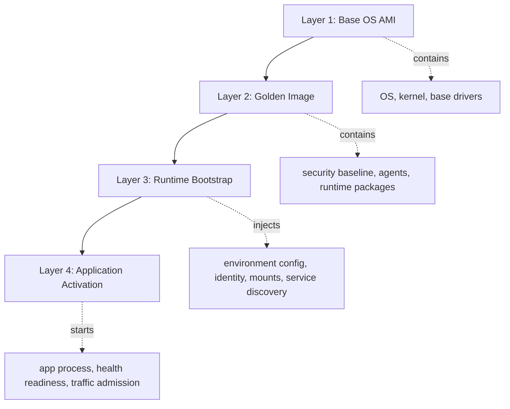
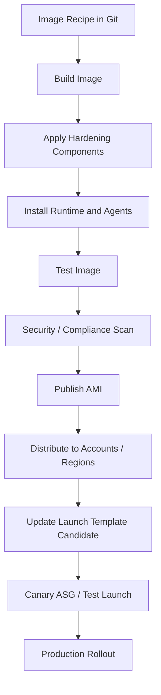
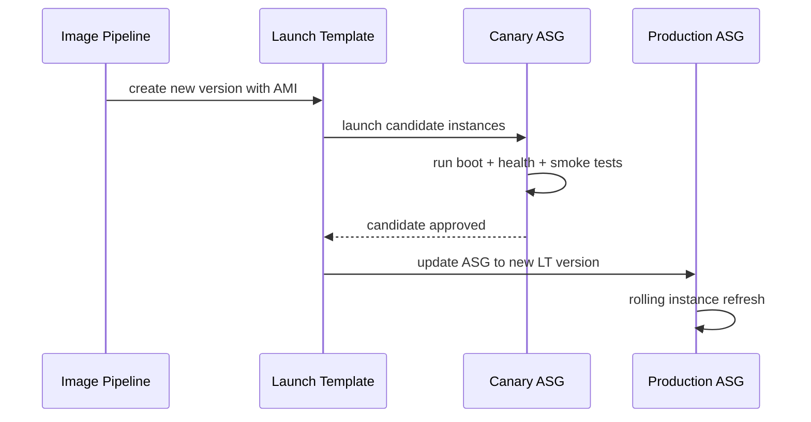
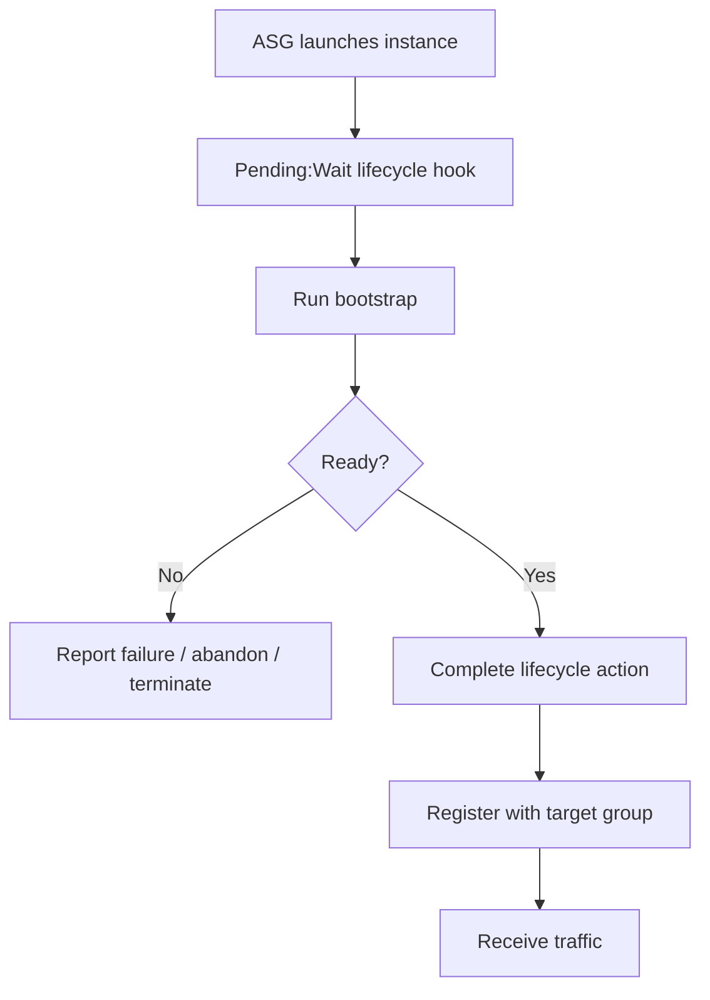

# Part 012 — AMI, Golden Image, and Bootstrapping

An EC2 instance is not production-ready because it launched.

It is production-ready only when its boot process reliably creates a node that satisfies the runtime contract:

```txt
correct OS
correct kernel and packages
correct security baseline
correct agents
correct application runtime
correct configuration
correct identity
correct storage mounts
correct health behavior
correct rollback path
```

This part is about treating AMIs and bootstrapping as deployable infrastructure artifacts, not manual server setup.

Bad mental model:

```txt
An AMI is a server snapshot.
```

Better mental model:

```txt
An AMI is a versioned machine artifact that defines the deterministic base state of a rebuildable compute cell.
```

Bad bootstrapping:

```txt
Launch instance, run a giant script, hope the app starts.
```

Production bootstrapping:

```txt
Launch immutable image, apply minimal runtime configuration, verify readiness, join service safely.
```

---

## 1. Problem yang Diselesaikan

EC2 gives you a machine. Production needs a repeatable node.

Without a disciplined AMI and bootstrap model, you get:

| Failure | Symptom |
|---|---|
| Manual server drift | same ASG has different behavior per instance |
| Slow bootstrap | scaling cannot react fast enough |
| Non-idempotent user data | reboot/retry corrupts node state |
| Package install at boot | dependency outage blocks scale-out |
| Secrets baked into AMI | credential leak and rotation nightmare |
| App baked incorrectly | rollback requires rebuilding infrastructure manually |
| Health check too early | cold node receives traffic before ready |
| No image provenance | cannot answer what code/package/kernel is running |
| Broken AMI rollout | Auto Scaling replaces good nodes with bad nodes |
| Patch chaos | urgent security update becomes risky manual operation |

A production-grade EC2 platform must answer:

```txt
Can we rebuild every instance from scratch?
Can we prove what is inside the image?
Can we roll forward and backward safely?
Can we launch during dependency outage?
Can we prevent unready nodes from receiving traffic?
Can we detect image drift and bootstrap failure?
```

---

## 2. Mental Model: Four Layers of Instance Construction

Think of EC2 instance construction as four layers.



### Layer 1 — Base OS AMI

This is the upstream OS image:

- Amazon Linux
- Ubuntu
- RHEL
- Windows
- custom enterprise base

It provides:

- kernel
- bootloader
- base filesystem
- package manager
- OS defaults
- cloud-init/EC2Launch behavior depending on OS

### Layer 2 — Golden Image

The golden image is your organization-approved machine baseline.

It usually includes:

- patched OS packages
- security hardening
- logging agent
- metrics agent
- SSM agent
- runtime dependencies
- common libraries
- filesystem layout
- baseline users/groups
- certificate trust roots
- kernel/sysctl settings
- EBS mount helpers if needed
- app runtime such as JDK, .NET runtime, Node.js, Go binary support

It should not include:

- long-lived secrets
- environment-specific config
- tenant data
- mutable database data
- one-off debugging tools unless approved
- unknown manual changes

### Layer 3 — Runtime Bootstrap

Bootstrap configures what cannot be safely baked:

- environment name
- region/AZ awareness
- instance identity
- app config pointer
- secret retrieval
- service registration
- EBS/EFS mount activation
- feature flags
- runtime parameter store values
- final app artifact selection if app is not baked

### Layer 4 — Application Activation

Activation starts the service and controls readiness:

- validate config
- verify dependencies
- warm cache if needed
- run migrations only if explicitly designed
- start process
- expose liveness
- expose readiness
- join load balancer after warmup
- emit boot success marker

The main rule:

```txt
Bake slow, stable things.
Bootstrap fast, environment-specific things.
Activate only after verification.
```

---

## 3. AMI as Production Artifact

An AMI is the base deployment unit for EC2 instances.

Treat it like a release artifact.

It needs:

- version
- owner
- source recipe
- build timestamp
- base image lineage
- package manifest
- vulnerability scan
- test evidence
- launch template compatibility
- rollback target
- deprecation policy
- distribution policy

### 3.1 AMI Artifact Metadata

A production AMI should be discoverable by tags:

```txt
Name                  = platform-api-al2023-2026-07-06-001
series                = learn-aws-compute-storage
image-family          = platform-api
os                    = amazon-linux-2023
runtime               = java-25
build-id              = 20260706.001
git-sha               = <recipe commit sha>
source-base-ami       = <base ami id>
compliance-profile    = standard-linux-baseline
owner-team            = platform-engineering
created-by            = image-pipeline
```

Do not rely on AMI name alone. Names are human-friendly. Tags and pipeline metadata are machine-operable.

### 3.2 AMI Immutability

Once an AMI is published for production use:

```txt
Do not mutate the artifact.
```

Create a new AMI for changes.

Bad:

```txt
Patch running instances manually.
Create no new image.
Forget what changed.
```

Good:

```txt
Update image recipe.
Build new AMI.
Test it.
Update launch template version.
Roll out gradually.
Keep rollback version.
```

---

## 4. Golden Image Strategy

There are three common strategies.

### 4.1 Thin Golden Image

Contains:

- OS baseline
- security agents
- monitoring agents
- package repositories
- minimal runtime

App artifact is pulled during bootstrap.

Benefits:

- fewer image builds
- app release independent from AMI release
- smaller image matrix

Costs:

- slower bootstrap
- dependency on artifact repository during scale-out
- more moving parts at boot
- higher bootstrap failure risk

Good fit:

- many apps sharing base platform
- frequent app releases
- controlled artifact repository
- acceptable boot time

### 4.2 Thick Golden Image

Contains:

- OS baseline
- agents
- runtime
- application artifact
- static assets

Runtime bootstrap only injects config and starts service.

Benefits:

- faster boot
- fewer runtime dependencies
- better rollback artifact integrity
- easier forensic provenance

Costs:

- more image builds
- image sprawl
- slower release pipeline
- environment variation can become painful

Good fit:

- latency-sensitive scaling
- regulated systems
- incident-critical services
- immutable deployment discipline

### 4.3 Hybrid Image

Contains:

- base platform
- runtime
- common dependencies

Pulls:

- small environment-specific app bundle
- config

Benefits:

- balance between boot speed and release flexibility

Costs:

- must define boundary carefully

Most serious platforms eventually choose hybrid or thick images for critical services and thin images for less critical internal workloads.

---

## 5. Bootstrapping Principle: Deterministic, Idempotent, Minimal

A bootstrap script should be:

```txt
deterministic: same inputs produce same node
idempotent: safe to retry
minimal: does not rebuild the world at boot
observable: emits progress and failure reason
bounded: has timeouts
safe: does not expose secrets in logs
```

### 5.1 Bad User Data

```bash
#!/bin/bash
yum update -y
curl https://somewhere/install.sh | bash
aws s3 cp s3://bucket/app.jar /app/app.jar
java -jar /app/app.jar
```

Problems:

- unpinned dependencies
- no retry policy
- no checksum
- no failure marker
- no structured logging
- app starts outside process manager
- package update at boot makes launch nondeterministic
- no health/readiness integration
- secrets may leak through shell logs

### 5.2 Better User Data Shape

```bash
#!/bin/bash
set -euo pipefail

BOOT_LOG=/var/log/bootstrap.log
exec > >(tee -a "$BOOT_LOG") 2>&1

mark() {
  echo "$(date -Iseconds) $1"
}

fail() {
  mark "BOOTSTRAP_FAILED: $1"
  /opt/platform/bin/report-boot-failure "$1" || true
  exit 1
}

mark "BOOTSTRAP_STARTED"

/opt/platform/bin/validate-imds || fail "imds validation failed"
/opt/platform/bin/render-config || fail "config rendering failed"
/opt/platform/bin/mount-volumes || fail "volume mount failed"
/opt/platform/bin/fetch-runtime-secrets || fail "secret retrieval failed"
/opt/platform/bin/start-service || fail "service start failed"
/opt/platform/bin/wait-readiness --timeout 180 || fail "readiness failed"
/opt/platform/bin/signal-ready || fail "ready signal failed"

mark "BOOTSTRAP_SUCCEEDED"
```

Better still: keep user data small and call versioned scripts already baked into the AMI.

```txt
user data = entrypoint + parameters
AMI       = implementation
```

---

## 6. User Data Contract

User data is useful for automated configuration at launch time.

But user data should not become your platform.

A good user data contract includes:

```txt
environment
service name
config version
app artifact version if needed
region
expected role
bootstrap mode
feature flags
```

Example:

```yaml
service: payment-api
environment: production
config_version: 2026-07-06.001
artifact_version: 1.48.2
bootstrap_mode: normal
requires_efs: false
requires_ebs_data_volume: false
readiness_timeout_seconds: 180
```

The AMI should parse this contract and reject invalid values.

### 6.1 User Data Anti-Patterns

Avoid:

- giant shell scripts embedded in Terraform
- installing half the system at boot
- unpinned `latest` downloads
- secrets in plain text
- long-running migrations at boot
- dependency on public internet without fallback
- no timeout
- no rollback path
- no signal to Auto Scaling lifecycle hook
- no structured boot log

### 6.2 User Data and Reboots

Some user data mechanisms run only on first boot by default depending on OS tooling and configuration.

Do not rely on reboot behavior implicitly.

Explicitly separate:

```txt
first boot initialization
regular service start
reboot recovery
instance replacement
```

Systemd should own recurring service lifecycle.
User data should initialize the node.

---

## 7. Cloud-Init and Systemd Boundary

On many Linux EC2 images, cloud-init handles initialization tasks using instance metadata and user data.

A clean boundary:

```txt
cloud-init/user data:
  - render machine-specific config
  - prepare mounts
  - enable/start platform bootstrap service

systemd:
  - own long-running service lifecycle
  - restart application
  - enforce dependencies
  - define readiness helper
  - collect logs
```

Example systemd unit:

```ini
[Unit]
Description=Payment API
After=network-online.target
Wants=network-online.target

[Service]
User=app
Group=app
WorkingDirectory=/opt/payment-api
EnvironmentFile=/etc/payment-api/env
ExecStart=/usr/bin/java -jar /opt/payment-api/app.jar
Restart=on-failure
RestartSec=5
LimitNOFILE=65535
TimeoutStartSec=180

[Install]
WantedBy=multi-user.target
```

Do not run your production service as a background process from a shell script if systemd should supervise it.

---

## 8. EC2 Image Builder Pipeline Model

A serious AMI process should be automated.

A typical pipeline:



EC2 Image Builder can automate creation, management, and deployment of customized AMIs and container images.

The important engineering point is not the product name. It is the pipeline invariant:

```txt
No manually crafted production images.
```

### 8.1 Image Recipe

The image recipe should define:

- base image
- components
- package versions
- hardening steps
- runtime versions
- test commands
- output AMI metadata

Keep the recipe versioned.

```txt
image recipe in Git > tribal knowledge in a wiki
```

### 8.2 Components

Separate components by responsibility:

```txt
base-os-hardening
cloudwatch-agent
ssm-agent-validation
java-runtime
filesystem-layout
app-user
security-baseline
bootstrap-entrypoint
```

This makes changes reviewable.

### 8.3 Image Tests

Do not publish an AMI just because it built.

Test:

- boot success
- SSM reachability
- CloudWatch agent starts
- app user exists
- required packages installed
- forbidden packages absent
- kernel/sysctl values set
- file permissions correct
- service can start
- health endpoint works
- no secret material baked
- disk layout correct

---

## 9. Launch Template Versioning

AMI rollout usually flows through Launch Templates.

A launch template version should bind:

- AMI ID
- instance type defaults
- block device mapping
- metadata options
- IAM instance profile
- security groups
- user data
- tags

Production rule:

```txt
Never update launch behavior invisibly.
Use versioned launch templates.
Roll forward intentionally.
Keep rollback version known.
```

### 9.1 Rollout Shape



### 9.2 Avoid `$Latest` Surprise

Using `$Latest` blindly can make production behavior change unexpectedly when a new launch template version is created.

Safer pattern:

```txt
candidate version -> canary -> approved version -> production rollout
```

Make production reference explicit versions where possible.

---

## 10. Bootstrap and Auto Scaling Lifecycle Hooks

Bootstrap and Auto Scaling must cooperate.

An instance should not receive production traffic until:

- OS is initialized
- config is rendered
- storage is mounted
- service is running
- dependencies are reachable or degraded mode is explicit
- readiness endpoint is healthy
- warmup completed if needed

A typical flow:



This prevents half-booted nodes from joining the load balancer.

### 10.1 Health Checks

Separate:

| Check | Meaning |
|---|---|
| process liveness | process is running |
| instance health | EC2/system status ok |
| target health | load balancer can reach service |
| readiness | app is safe to receive traffic |
| deep dependency health | dependencies are healthy enough for full function |

Do not make the load balancer health check depend on every downstream dependency unless you intend dependency failure to remove all nodes.

---

## 11. Configuration Strategy

Never bake environment-specific config deeply into an AMI unless you intentionally create one AMI per environment.

A common boundary:

| Item | Bake into AMI? | Reason |
|---|---:|---|
| OS packages | yes | slow/stable/security-reviewed |
| runtime | usually yes | slow and testable |
| observability agents | yes | baseline requirement |
| app binary | maybe | depends on release model |
| environment name | no | runtime-specific |
| secrets | no | rotation and leakage risk |
| feature flags | no | runtime change |
| tenant data | no | state, not image |
| database migration | no | must be controlled separately |

### 11.1 Config Source

Possible config sources:

- AWS Systems Manager Parameter Store
- AWS Secrets Manager
- S3 config object with versioning
- AppConfig
- internal config service
- baked config template + runtime variables

The key is not the specific service. The key is versioned, auditable, recoverable config.

### 11.2 Config Validation

Bootstrap should fail closed on invalid config.

Example validation:

```txt
required environment variables present
required files readable
secrets fetched successfully
KMS decrypt works
config schema valid
region/AZ allowed
dependency endpoints parseable
feature flags valid
```

Bad:

```txt
Start with default config because prod config failed to fetch.
```

Unless degraded mode is explicitly designed, this creates silent corruption.

---

## 12. Secret Handling

Secrets should not be baked into AMIs or embedded in user data.

Reasons:

- AMIs can be copied/shared
- snapshots may persist longer than expected
- user data may be visible to privileged users/tools
- rotation becomes hard
- incident scope expands

Better pattern:

```txt
instance role -> fetch secret at runtime -> keep in memory or protected file -> rotate by version
```

### 12.1 Secret Bootstrap Rules

- fetch with instance role
- restrict IAM permissions to required secrets
- do not echo secrets
- avoid shell tracing around secret commands
- set file permissions strictly
- support secret version rotation
- fail if required secret cannot be fetched
- emit failure reason without secret value

Example:

```bash
set +x
aws secretsmanager get-secret-value \
  --secret-id /prod/payment-api/db \
  --query SecretString \
  --output text > /run/payment-api/db.secret
chmod 0400 /run/payment-api/db.secret
chown app:app /run/payment-api/db.secret
set -x
```

Even this should be handled carefully because shell history/logging/process arguments can leak data if not controlled.

---

## 13. Storage Bootstrapping

Compute-storage systems often fail during boot because storage assumptions are implicit.

You must explicitly handle:

- root volume size
- additional EBS volume attachment
- filesystem creation
- mount point
- fstab behavior
- EFS mount target reachability
- FSx mount requirements
- permissions
- retry and timeout
- corrupted or missing volume
- device name differences
- AZ-local attachment constraints

### 13.1 EBS Data Volume Pattern

Stateful EC2 with EBS needs a clear ownership model.

Questions:

```txt
Is the volume created per instance?
Is it restored from snapshot?
Is it reattached after replacement?
Is it disposable cache?
Who owns formatting?
Who owns fsck?
What happens if mount fails?
```

Bootstrap should not blindly format a volume that might contain data.

Bad:

```bash
mkfs.ext4 /dev/nvme1n1
mount /dev/nvme1n1 /data
```

Safer pattern:

```txt
inspect volume label/UUID
validate expected metadata
format only if explicitly marked new
mount by UUID or label
fail if existing volume is unexpected
```

### 13.2 EFS/FSx Mount Pattern

For shared file storage, bootstrap must handle:

- DNS availability
- mount helper/package availability
- network path
- security group/NACL dependency
- directory permissions
- UID/GID alignment
- timeout behavior

Do not let a blocked network file mount hang boot forever without an alarm.

---

## 14. Patch Management and Image Freshness

There are two broad patching models.

### 14.1 Patch In Place

Running instances are patched directly.

Benefits:

- sometimes faster for emergency patch
- useful for long-lived stateful hosts

Costs:

- drift risk
- rollback hard
- inconsistent fleet
- unknown boot reproducibility
- hidden dependency on manual process

### 14.2 Rebuild and Replace

Build new AMI, roll fleet.

Benefits:

- immutable infrastructure
- consistent fleet
- rollback to previous AMI
- auditable artifact
- proves rebuildability

Costs:

- requires mature pipeline
- rollout may take time
- stateful workloads need careful handling

For stateless fleets, prefer rebuild and replace.

For stateful fleets, still prefer image pipeline for base state, but replacement and data handling must be designed carefully.

### 14.3 Image Freshness SLO

Define image freshness explicitly:

```txt
critical patch: image built and rolled within X hours/days
high patch:     within Y days
routine patch:  weekly/monthly cadence
base image age: alert after N days
```

An old AMI is operational debt.

---

## 15. Drift Control

Drift means running instances no longer match the intended artifact.

Sources of drift:

- manual SSH changes
- emergency package install
- config edits
- runtime patching
- failed partial bootstrap
- mutable app artifact download
- log/temp file growth
- agent auto-update

### 15.1 Drift Detection

Possible signals:

- AMI ID per instance
- launch template version per instance
- package manifest hash
- config version marker
- app version endpoint
- bootstrap success marker
- file integrity monitoring
- SSM inventory
- expected tag set

### 15.2 Drift Response

For stateless nodes:

```txt
replace, do not repair
```

For stateful nodes:

```txt
cordon/drain -> snapshot/backup -> repair or replace with data migration path
```

Never normalize silent drift as acceptable production behavior.

---

## 16. Rollback Strategy

Rollback must be designed before rollout.

For AMI rollout, rollback means:

```txt
point launch template / ASG back to previous known-good image version
replace bad instances safely
preserve evidence from failed nodes
```

### 16.1 Rollback Requirements

- previous AMI still available
- previous launch template version known
- previous config version compatible
- app data schema compatible
- health checks valid
- scaling policy still safe
- deployment tool supports controlled rollback

### 16.2 Rollback Trap: Data Migration

If the new AMI runs app code that migrates data forward, AMI rollback may not be enough.

Rule:

```txt
AMI rollback is only safe if runtime state remains backward compatible.
```

For systems with schema/state changes, use expand-contract migration strategy and independent migration controls.

---

## 17. Broken AMI Failure Mode

A broken AMI can become a fleet-wide incident if Auto Scaling keeps replacing healthy instances with bad ones.

Example:

```txt
1. New AMI published.
2. Launch template updated.
3. ASG instance refresh starts.
4. New instances fail bootstrap.
5. Old instances terminate too quickly.
6. Capacity drops.
7. Autoscaling launches more bad instances.
8. Incident escalates.
```

### 17.1 Guardrails

- canary ASG
- one-instance test launch
- boot success alarm
- instance refresh checkpoints
- minimum healthy percentage
- lifecycle hooks
- rollback automation
- deployment pause on alarm
- health check grace period tuned to real boot time
- previous launch template version retained

### 17.2 Bad AMI Runbook

1. Stop rollout / cancel instance refresh.
2. Pin ASG back to previous launch template version.
3. Increase desired capacity if needed using known-good version.
4. Preserve failed instance logs if possible.
5. Inspect `/var/log/cloud-init*`, bootstrap logs, systemd journal.
6. Identify image vs config vs dependency failure.
7. Fix recipe or bootstrap.
8. Rebuild new AMI.
9. Canary again.

---

## 18. Bootstrap Observability

A node that fails to boot silently is operationally expensive.

Bootstrap should emit:

- start timestamp
- stage transitions
- success marker
- failure marker
- failure reason
- image ID
- launch template version
- config version
- app version
- readiness duration
- dependency fetch duration
- storage mount duration

### 18.1 Boot Log Structure

Example:

```json
{"stage":"bootstrap_started","ts":"2026-07-06T01:00:00Z","ami":"ami-...","lt_version":"42"}
{"stage":"config_rendered","duration_ms":1200}
{"stage":"secrets_fetched","duration_ms":800}
{"stage":"service_started","duration_ms":3500}
{"stage":"readiness_succeeded","duration_ms":42000}
{"stage":"bootstrap_succeeded","total_duration_ms":59000}
```

This lets you answer:

```txt
Are new instances slow because image boot is slow, dependency fetch is slow, or app warmup is slow?
```

---

## 19. Production Bootstrap Checklist

### Image

- [ ] Image recipe versioned in Git?
- [ ] Base AMI lineage known?
- [ ] Packages pinned or controlled?
- [ ] Security baseline applied?
- [ ] Runtime installed?
- [ ] Agents installed and tested?
- [ ] No secrets baked?
- [ ] Image tagged with owner/build metadata?
- [ ] AMI copied to required accounts/Regions if needed?

### Bootstrap

- [ ] User data minimal?
- [ ] Bootstrap idempotent?
- [ ] Timeouts defined?
- [ ] Retry policy bounded?
- [ ] Failure marker emitted?
- [ ] Logs available after failure?
- [ ] Config schema validated?
- [ ] Secrets handled safely?
- [ ] Storage mounts validated?
- [ ] Health/readiness gate explicit?

### Rollout

- [ ] Launch template versioned?
- [ ] Canary launch tested?
- [ ] Instance refresh guardrails set?
- [ ] Rollback version known?
- [ ] Minimum healthy percentage safe?
- [ ] Health check grace period realistic?
- [ ] Alarms can pause rollout?

### Operations

- [ ] Image freshness policy exists?
- [ ] Drift detection exists?
- [ ] Bad AMI runbook exists?
- [ ] Boot time dashboard exists?
- [ ] Failed bootstrap alert exists?
- [ ] Previous AMIs retained long enough?

---

## 20. Implementation Pattern: Minimal User Data + Baked Bootstrap

A strong pattern:

```txt
AMI contains /opt/platform/bootstrap
user data passes only environment-specific inputs
systemd owns app process
ASG lifecycle hook gates traffic
```

### 20.1 User Data

```bash
#!/bin/bash
set -euo pipefail

cat >/etc/platform/bootstrap.yaml <<'YAML'
service: payment-api
environment: production
config_version: 2026-07-06.001
artifact_version: 1.48.2
readiness_timeout_seconds: 180
YAML

/opt/platform/bootstrap/bin/bootstrap-node --config /etc/platform/bootstrap.yaml
```

### 20.2 Bootstrap Script Responsibilities

```txt
validate instance metadata
validate IAM identity
fetch config
fetch secrets
prepare storage
render environment file
start systemd service
wait readiness
signal lifecycle hook complete
```

### 20.3 App Service

```ini
[Unit]
Description=Payment API
After=network-online.target
Wants=network-online.target

[Service]
User=app
EnvironmentFile=/etc/payment-api/env
ExecStart=/usr/bin/java -XX:MaxRAMPercentage=70 -jar /opt/payment-api/app.jar
Restart=on-failure
RestartSec=5
TimeoutStartSec=180

[Install]
WantedBy=multi-user.target
```

---

## 21. Terraform Shape

Illustrative only.

```hcl
resource "aws_launch_template" "api" {
  name_prefix   = "payment-api-"
  image_id      = var.ami_id
  instance_type = var.instance_type

  iam_instance_profile {
    name = aws_iam_instance_profile.api.name
  }

  metadata_options {
    http_tokens                 = "required"
    http_endpoint               = "enabled"
    http_put_response_hop_limit = 1
  }

  user_data = base64encode(templatefile("${path.module}/user-data.sh", {
    service          = "payment-api"
    environment      = var.environment
    config_version   = var.config_version
    artifact_version = var.artifact_version
  }))

  block_device_mappings {
    device_name = "/dev/xvda"

    ebs {
      volume_size           = 40
      volume_type           = "gp3"
      encrypted             = true
      delete_on_termination = true
    }
  }

  tag_specifications {
    resource_type = "instance"

    tags = {
      Service       = "payment-api"
      Environment   = var.environment
      ImageFamily   = "payment-api"
      ConfigVersion = var.config_version
    }
  }
}
```

Important points:

- IMDSv2 required
- image version passed explicitly
- config version visible
- root volume encrypted
- launch template versioned by AWS

---

## 22. Mini Case Study: Scaling Failure Caused by Bootstrap

### Context

A stateless API runs in an Auto Scaling Group.

During traffic spike, ASG launches 20 new instances.

Symptoms:

```txt
Instances launched:      yes
Instances in service:    low
Bootstrap duration:      12-18 minutes
ALB healthy targets:     unstable
CPU on old nodes:        95%
Error rate:              high
```

Investigation:

```txt
user data runs yum update
user data downloads JDK
user data downloads app artifact
artifact repository throttles
some instances fail mid-bootstrap
health check grace period too short
```

Root cause:

```txt
Capacity existed at EC2 level, but not at service-ready level.
```

Fix:

```txt
1. Bake JDK and app dependencies into AMI.
2. Keep user data minimal.
3. Add bootstrap stage logging.
4. Add ASG lifecycle hook.
5. Increase health check grace based on measured boot time.
6. Canary AMI before rollout.
7. Add boot failure alarm.
```

Lesson:

```txt
Autoscaling speed is limited by time-to-ready, not time-to-launch.
```

---

## 23. Failure Modes

### 23.1 Package Repository Outage Blocks Scale-Out

Cause:

```txt
Boot installs packages from external repo.
```

Fix:

```txt
Bake packages into AMI or use controlled internal mirror.
```

### 23.2 Secret Printed in Logs

Cause:

```txt
Shell tracing, echo, failed command output, or careless env dump.
```

Fix:

```txt
Disable tracing around secrets, restrict logs, use safe secret readers.
```

### 23.3 Node Joins Too Early

Cause:

```txt
Health check only verifies port open.
```

Fix:

```txt
Readiness endpoint verifies app initialized and warm enough.
Lifecycle hook gates registration.
```

### 23.4 Bootstrap Is Not Idempotent

Cause:

```txt
Script appends config repeatedly, reformats volumes, duplicates users, reruns migrations.
```

Fix:

```txt
Use marker files, state checks, schema validation, and explicit one-time operations.
```

### 23.5 AMI Drift

Cause:

```txt
Manual changes on running instances.
```

Fix:

```txt
Replace stateless instances. Rebuild AMI through pipeline.
```

### 23.6 Bad AMI Rolls Across Fleet

Cause:

```txt
No canary or instance refresh checkpoint.
```

Fix:

```txt
Canary, staged rollout, minimum healthy percentage, alarms, rollback version.
```

---

## 24. Common Mistakes

1. Treating AMI as a manual snapshot instead of a versioned artifact.
2. Baking secrets into an image.
3. Putting giant scripts inside user data.
4. Installing packages from the internet during production boot.
5. Not pinning runtime versions.
6. Starting app directly from user data instead of systemd.
7. Not making bootstrap idempotent.
8. Not emitting bootstrap logs and failure reasons.
9. Letting nodes receive traffic before warmup.
10. Using `$Latest` launch template behavior carelessly.
11. Not retaining rollback AMIs.
12. Not testing AMI launch before production rollout.
13. Not measuring time-to-ready.
14. Running database migrations from every instance boot.
15. Manually patching stateless fleets instead of rebuilding images.

---

## 25. Summary

An EC2 production node is created by a chain:

```txt
base AMI -> golden image -> runtime bootstrap -> application readiness -> traffic admission
```

A strong AMI/bootstrap design has these properties:

```txt
versioned
rebuildable
deterministic
idempotent
observable
minimal at boot
safe with secrets
explicit with storage
integrated with lifecycle hooks
rollback-ready
```

The most important rule:

```txt
Bake stable, slow, security-sensitive dependencies.
Bootstrap only fast, environment-specific state.
Gate traffic on real readiness.
```

When you get this right, EC2 stops being a collection of fragile servers and becomes a replaceable compute substrate.

That is the difference between running instances and operating a production platform.

---

## References

- AWS Documentation — Run commands when you launch an EC2 instance with user data input: https://docs.aws.amazon.com/AWSEC2/latest/UserGuide/user-data.html
- AWS Documentation — What is EC2 Image Builder?: https://docs.aws.amazon.com/imagebuilder/latest/userguide/what-is-image-builder.html
- AWS Documentation — Create custom images with EC2 Image Builder: https://docs.aws.amazon.com/imagebuilder/latest/userguide/create-images.html
- AWS Documentation — Amazon Machine Images in Amazon EC2: https://docs.aws.amazon.com/AWSEC2/latest/UserGuide/AMIs.html
- AWS Documentation — Launch templates for Amazon EC2 instances: https://docs.aws.amazon.com/AWSEC2/latest/UserGuide/ec2-launch-templates.html
