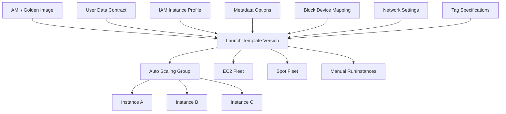
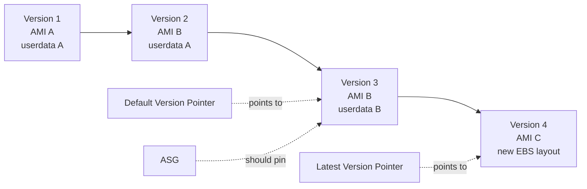
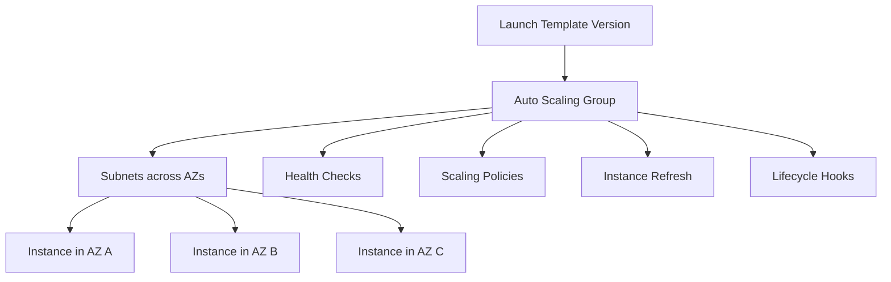
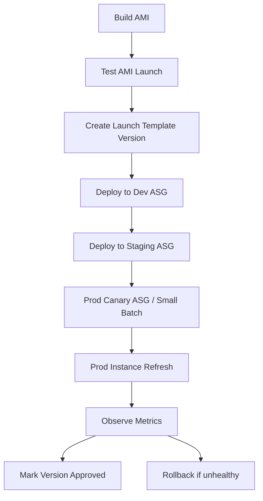
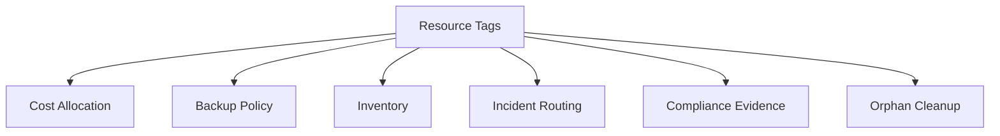

# Part 013 — Launch Templates and Instance Fleet Design

A production EC2 fleet should not be created from memory, console clicks, or tribal knowledge.

It needs a versioned launch contract.

In AWS, that contract is usually an **EC2 Launch Template**.

Bad mental model:

```txt
A launch template is a convenient form that stores EC2 launch options.
```

Better mental model:

```txt
A launch template is a versioned machine creation contract used by fleets, Auto Scaling Groups, EC2 Fleet, Spot Fleet, and deployment automation.
```

A single EC2 instance is easy to launch.

A safe fleet is harder because every instance must be created with the same rules:

```txt
same AMI lineage
same bootstrap contract
same IAM boundary
same metadata posture
same storage mapping
same tagging contract
same security group shape
same observability baseline
same termination semantics
same rollback path
```

This part teaches Launch Templates as the boundary between **image construction** and **fleet operation**.

Part 012 covered:

```txt
How do we build the machine artifact?
```

This part covers:

```txt
How do we repeatedly launch that artifact as a safe production fleet?
```

---

## 1. Problem yang Diselesaikan

Without a Launch Template discipline, EC2 fleets drift in invisible ways.

Common failure patterns:

| Failure | Production Symptom |
|---|---|
| Console-launched instances | no reproducible launch contract |
| Mutable `$Latest` usage | unexpected rollout after template edit |
| Unpinned AMI | new node boots unknown image |
| Missing IMDSv2 enforcement | metadata exposure risk |
| Inconsistent tags | cost, ownership, backup, and incident routing fail |
| Inconsistent block device mapping | some nodes lose data, some leak volumes |
| Incorrect delete-on-termination | orphaned EBS volumes create cost and compliance issues |
| IAM instance profile mismatch | bootstrap succeeds in staging, fails in production |
| Network settings embedded casually | subnet/AZ placement becomes accidental |
| User data too large or mutable | boot behavior cannot be reasoned about |
| No version promotion path | rollback requires manual console edits |
| No instance refresh discipline | ASG contains old and new node shapes indefinitely |

The production question is not:

```txt
Can we launch an EC2 instance?
```

The production question is:

```txt
Can we launch, replace, scale, roll back, audit, and debug every instance in this fleet using an explicit immutable contract?
```

---

## 2. Core Mental Model

A Launch Template is not the fleet itself.

It is the **definition** that a fleet uses to create instances.



There are three different objects you must not confuse:

| Object | Meaning |
|---|---|
| AMI | base machine artifact |
| Launch Template Version | machine launch contract |
| Auto Scaling Group / EC2 Fleet | fleet control loop that uses the contract |

The AMI answers:

```txt
What is inside the machine?
```

The Launch Template answers:

```txt
How should the machine be launched?
```

The fleet controller answers:

```txt
How many machines should exist, where, and when should they be replaced?
```

---

## 3. Why Launch Templates Matter More Than They Look

A Launch Template can store parameters such as:

- AMI ID
- instance type
- key pair
- security groups
- network interfaces
- IAM instance profile
- block device mapping
- EBS optimization
- monitoring
- shutdown behavior
- instance market options
- placement configuration
- user data
- tag specifications
- metadata options
- capacity reservation preference
- CPU options
- enclave options
- hibernation options

That looks like a configuration list.

In production it is an invariant list.

Example:

```txt
MetadataOptions.HttpTokens = required
```

This is not merely an option. It is a fleet security invariant.

Example:

```txt
BlockDeviceMappings.Ebs.DeleteOnTermination = true
```

This is not merely a storage option. It is a lifecycle cost invariant.

Example:

```txt
TagSpecifications includes owner, service, environment, data-classification
```

This is not merely metadata. It is the basis for cost allocation, automation, backup policy, incident routing, and compliance evidence.

---

## 4. Launch Template as a Contract

A good Launch Template defines a contract between platform and workload.

```txt
Given this template version,
AWS can create an instance that belongs to this workload,
in this environment,
with this image,
with this identity,
with this storage layout,
with this metadata posture,
and with tags that make it governable.
```

### 4.1 Contract Dimensions

| Dimension | Contract Question |
|---|---|
| Image | Which AMI lineage and version boots? |
| Runtime | What user data/bootstrap behavior is allowed? |
| Identity | Which IAM instance profile does the node receive? |
| Network | Which subnet/security group/ENI pattern is used? |
| Storage | Which root/data volumes exist and how are they destroyed? |
| Metadata | Is IMDSv2 required? Are instance tags exposed? |
| Observability | Are detailed monitoring and agents expected? |
| Tags | Can automation identify service/env/owner/data class? |
| Lifecycle | What happens on shutdown and termination? |
| Capacity | Is On-Demand, Spot, or mixed capacity expected? |

---

## 5. Versioning Model

Launch Templates are versioned.

This is powerful and dangerous.



The trap:

```txt
Using $Latest or mutable default version casually.
```

The safe principle:

```txt
Production fleets should generally consume an explicitly selected template version, not an accidental moving pointer.
```

### 5.1 Version Types

| Reference | Meaning | Production Risk |
|---|---|---|
| explicit version number | exact launch contract | safest for rollout/rollback |
| `$Default` | pointer to chosen default | acceptable only with disciplined promotion |
| `$Latest` | newest created version | dangerous for production ASG unless controlled |

### 5.2 Release Manifest Pattern

Treat the fleet release as a manifest:

```yaml
service: payment-api
environment: production
ami_id: ami-0abc123...
launch_template_id: lt-012345...
launch_template_version: 42
asg_name: payment-api-prod-a
release_id: payment-api-2026-07-06-001
```

This makes rollback explicit:

```txt
rollback = set ASG to previous launch_template_version and run controlled instance refresh
```

Not:

```txt
open console, guess old AMI, edit random settings
```

---

## 6. What Belongs in a Launch Template

### 6.1 AMI ID

The AMI ID defines the base artifact.

Good:

```txt
AMI is produced by image pipeline.
AMI is tagged with source commit/build/kernel/package baseline.
AMI is promoted from dev -> staging -> prod.
Launch Template version references a concrete AMI ID.
```

Bad:

```txt
AMI copied from an old instance.
AMI name pattern is used loosely.
Launch Template uses whichever AMI looks newest.
```

### 6.2 Instance Type

For simple workloads, the template may specify one instance type.

For resilient fleets, the Launch Template can be combined with ASG mixed instance policy.

Decision:

```txt
Stable capacity shape? specify instance type directly.
Need Spot/capacity diversification? use Launch Template + mixed instance overrides.
```

### 6.3 IAM Instance Profile

The instance profile is the machine identity.

It should contain only the permissions needed for:

- bootstrap
- configuration retrieval
- secrets retrieval
- log/metric publishing
- SSM access
- application AWS calls
- storage access if the app uses S3/EFS/FSx/EBS APIs

Anti-pattern:

```txt
One giant EC2 role for all instances.
```

Better:

```txt
One role per workload boundary.
```

Even better:

```txt
Separate platform bootstrap permissions from application permissions where possible.
```

### 6.4 Metadata Options

Metadata options should be treated as security and operational invariants.

Recommended baseline for most production fleets:

```txt
HttpTokens = required
HttpEndpoint = enabled
HttpPutResponseHopLimit = 1 or carefully justified higher value
InstanceMetadataTags = disabled unless explicitly needed
```

Why this matters:

- user data may use metadata to discover instance identity
- agents may use metadata for region/instance details
- overly permissive metadata access can increase blast radius
- containerized workloads may require careful hop-limit reasoning

### 6.5 User Data

User data should be:

```txt
small
idempotent
observable
bounded in time
safe to retry
free of long-lived secrets
used to start controlled bootstrap, not contain the whole platform
```

Recommended pattern:

```bash
#!/bin/bash
set -euo pipefail

exec > >(tee -a /var/log/bootstrap.log | logger -t user-data -s 2>/dev/console) 2>&1

echo "bootstrap started at $(date -Is)"
/opt/platform/bin/bootstrap-node --environment prod --service payment-api
echo "bootstrap finished at $(date -Is)"
```

Do not put a 900-line deployment script in the template.

Use user data as the entry point into a versioned bootstrap tool.

### 6.6 Block Device Mapping

Block device mapping defines root and additional volumes at launch.

It answers:

```txt
What disks exist when the instance starts?
What type are they?
Are they encrypted?
Are they deleted on termination?
What size and performance do they have?
```

Example decisions:

| Volume | Setting |
|---|---|
| root | small, encrypted, delete-on-termination true |
| app log volume | often avoid; ship logs instead |
| data volume | only if workload intentionally uses local block state |
| cache volume | delete-on-termination true |
| database volume | explicit backup/snapshot lifecycle required |

### 6.7 Tag Specifications

Tags must be applied to all relevant resource types:

- instance
- volume
- network interface
- spot instance request if applicable

Minimum useful tags:

```yaml
Service: payment-api
Environment: prod
Owner: payments-platform
CostCenter: fintech-core
DataClassification: internal
ManagedBy: terraform
Runbook: https://internal/runbooks/payment-api
BackupPolicy: none-or-policy-name
```

Bad pattern:

```txt
Only tagging the instance.
```

Because orphaned volumes and ENIs need tags too.

### 6.8 Security Groups and Network Interfaces

For simple ASG fleets, specify security groups and let ASG place instances into subnets.

For advanced cases, network interface configuration may be explicit.

Be careful:

```txt
If you over-specify network interfaces, you may accidentally constrain subnet/AZ placement.
```

Network belongs partly to template and partly to fleet placement.

The Launch Template should define:

```txt
security posture
metadata posture
ENI behavior if required
```

The ASG should define:

```txt
which subnets/AZs the fleet spans
```

---

## 7. What Should Not Belong in a Launch Template

Do not put these in a Launch Template unless there is a strong reason:

| Item | Why |
|---|---|
| long-lived secrets | template is not a secret store |
| environment-specific huge scripts | hard to review, diff, test, rollback |
| per-instance unique config | template should be fleet-level contract |
| manual SSH keys for production | prefer SSM/session workflows where possible |
| unbounded package installation | boot now depends on external package repos |
| data migration commands | every new instance might repeat migration |
| hard-coded subnet for ASG fleet | may collapse AZ diversity |
| hard-coded private IP for scalable fleet | prevents elastic replacement |

---

## 8. Fleet Design: Template Is Not Enough

A Launch Template becomes useful when attached to a fleet controller.



The Launch Template defines node shape.

The Auto Scaling Group defines fleet behavior:

- desired capacity
- min/max capacity
- subnet/AZ placement
- health check type
- replacement behavior
- mixed instance strategy
- lifecycle hooks
- instance refresh
- termination policy
- warm pool

Production design requires both.

---

## 9. Fleet Contract Layers

Think of fleet configuration as layered contracts.

```txt
Image Contract
  AMI, OS, packages, runtime

Launch Contract
  launch template version, metadata, identity, storage, tags

Placement Contract
  ASG subnets, AZ spread, placement group if needed

Capacity Contract
  min, max, desired, scaling policy, mixed instance policy

Traffic Contract
  target group registration, readiness, deregistration delay

Termination Contract
  lifecycle hook, drain, log flush, volume handling
```

A production incident often happens because one layer is correct and another is implicit.

Example:

```txt
AMI is good.
Launch Template is good.
ASG uses only one subnet.
AZ outage takes down the fleet.
```

Example:

```txt
ASG spans three AZs.
Launch Template uses EBS data volume pattern that assumes fixed AZ-local state.
Replacement cannot recover state in another AZ.
```

---

## 10. Launch Template Design Patterns

### 10.1 One Template per Workload per Environment

```txt
payment-api-prod-lt
payment-api-staging-lt
ledger-worker-prod-lt
ledger-worker-staging-lt
```

Good when:

- different environments need different roles/tags/settings
- promotion is controlled
- compliance requires separation

Trade-off:

- more templates
- more lifecycle management

### 10.2 One Template per Workload, Environment via Version/Variables

Good when:

- platform is simple
- environments are very similar
- automation is mature

Risk:

- environment-specific drift hides in variables
- wrong version may be promoted to wrong environment

### 10.3 Base Template + ASG Overrides

Good for mixed instance fleets.

```txt
Launch Template defines common contract.
ASG mixed instance policy overrides instance types.
```

Example:

```txt
Base: m7i.large
Overrides: m7i.large, m7a.large, m6i.large, m6a.large
```

Use this when capacity availability matters more than a single exact hardware family.

### 10.4 Immutable Template Version per Release

Recommended for serious production.

```txt
Every release creates a new Launch Template version.
ASG points to explicit version.
Instance refresh rolls it out.
Rollback points to previous version.
```

This makes infrastructure deploys auditable.

### 10.5 Shared Platform Template with Workload Bootstrap

Sometimes a platform team provides a common hardened template and workloads inject only a bootstrap argument.

This works if the boundary is clear:

```txt
platform owns OS, agents, metadata, base IAM, storage defaults
workload owns app artifact and runtime config
```

Risk:

```txt
platform template becomes too generic and over-permissive
```

---

## 11. Launch Template Version Promotion Flow

A safe promotion flow:



Minimum checks before production:

```txt
AMI boots
cloud-init/user-data succeeds
SSM available
metrics/logging available
app reaches readiness
EBS mounts are correct
metadata posture is correct
tags are present on instance and volumes
health check passes after warmup
termination behavior is safe
```

---

## 12. Implementation: Terraform Launch Template

Example skeleton:

```hcl
resource "aws_launch_template" "payment_api" {
  name_prefix   = "payment-api-prod-"
  image_id      = var.ami_id
  instance_type = "m7i.large"

  iam_instance_profile {
    name = aws_iam_instance_profile.payment_api.name
  }

  metadata_options {
    http_endpoint               = "enabled"
    http_tokens                 = "required"
    http_put_response_hop_limit = 1
    instance_metadata_tags      = "disabled"
  }

  monitoring {
    enabled = true
  }

  user_data = base64encode(templatefile("${path.module}/user-data.sh", {
    service     = "payment-api"
    environment = "prod"
  }))

  block_device_mappings {
    device_name = "/dev/xvda"

    ebs {
      volume_size           = 30
      volume_type           = "gp3"
      encrypted             = true
      delete_on_termination = true
    }
  }

  tag_specifications {
    resource_type = "instance"

    tags = {
      Service            = "payment-api"
      Environment        = "prod"
      Owner              = "payments-platform"
      ManagedBy          = "terraform"
      DataClassification = "internal"
    }
  }

  tag_specifications {
    resource_type = "volume"

    tags = {
      Service            = "payment-api"
      Environment        = "prod"
      Owner              = "payments-platform"
      ManagedBy          = "terraform"
      DataClassification = "internal"
    }
  }

  lifecycle {
    create_before_destroy = true
  }
}
```

Key points:

```txt
AMI is passed as an explicit variable from image pipeline.
IMDSv2 is required.
Root volume is encrypted and deleted on termination.
Tags are applied to both instance and volume.
User data is rendered from a small template.
```

---

## 13. Implementation: ASG Consuming Explicit Version

```hcl
resource "aws_autoscaling_group" "payment_api" {
  name                = "payment-api-prod"
  min_size            = 6
  max_size            = 30
  desired_capacity    = 9
  vpc_zone_identifier = var.private_subnet_ids

  health_check_type         = "ELB"
  health_check_grace_period = 300

  launch_template {
    id      = aws_launch_template.payment_api.id
    version = aws_launch_template.payment_api.latest_version
  }

  target_group_arns = [aws_lb_target_group.payment_api.arn]

  instance_refresh {
    strategy = "Rolling"

    preferences {
      min_healthy_percentage = 90
      instance_warmup        = 300
    }
  }

  tag {
    key                 = "Service"
    value               = "payment-api"
    propagate_at_launch = true
  }

  tag {
    key                 = "Environment"
    value               = "prod"
    propagate_at_launch = true
  }
}
```

Be careful with this line:

```hcl
version = aws_launch_template.payment_api.latest_version
```

In simple Terraform workflows this may be fine because Terraform controls the version.

In stricter production workflows, prefer passing a promoted explicit version:

```hcl
version = var.launch_template_version
```

That prevents accidental rollout when a template version is created but not approved.

---

## 14. Implementation: Mixed Instance Policy

Mixed instance policy separates:

```txt
common launch contract
from
capacity diversification
```

Example:

```hcl
resource "aws_autoscaling_group" "worker" {
  name                = "ledger-worker-prod"
  min_size            = 20
  max_size            = 200
  desired_capacity    = 40
  vpc_zone_identifier = var.private_subnet_ids

  mixed_instances_policy {
    instances_distribution {
      on_demand_base_capacity                  = 10
      on_demand_percentage_above_base_capacity = 30
      spot_allocation_strategy                 = "price-capacity-optimized"
    }

    launch_template {
      launch_template_specification {
        launch_template_id = aws_launch_template.worker.id
        version            = var.launch_template_version
      }

      override {
        instance_type = "m7i.large"
      }

      override {
        instance_type = "m7a.large"
      }

      override {
        instance_type = "m6i.large"
      }

      override {
        instance_type = "m6a.large"
      }
    }
  }
}
```

Use this for:

- queue workers
- stateless APIs with enough horizontal capacity
- batch processors
- event consumers
- workloads tolerant of instance replacement

Be cautious for:

- strict performance workloads
- licensed software pinned to CPU type
- workloads sensitive to CPU architecture
- JVM workloads not tested across architectures/families

---

## 15. Metadata Options: Production Baseline

A safe default:

```hcl
metadata_options {
  http_endpoint               = "enabled"
  http_tokens                 = "required"
  http_put_response_hop_limit = 1
  instance_metadata_tags      = "disabled"
}
```

### 15.1 HttpTokens

```txt
required = IMDSv2 token required
optional = IMDSv1 still allowed
```

Use `required` unless you have a specific legacy dependency.

### 15.2 HttpPutResponseHopLimit

This controls metadata response hop limit.

Common reasoning:

| Workload | Typical Setting |
|---|---|
| app directly on EC2 host | 1 |
| containers needing host metadata | may require >1, justify carefully |
| hardened platform | 1 with explicit metadata proxy/agent design |

Do not set it higher just because something failed.

Find which component needs metadata and why.

### 15.3 Instance Metadata Tags

Exposing tags through metadata can simplify bootstrap.

But it also means any process able to access metadata can read tags.

Use only if:

```txt
tags do not contain sensitive information
bootstrap truly needs them
access boundary is understood
```

---

## 16. Storage Contract in Launch Template

Root volume baseline:

```hcl
block_device_mappings {
  device_name = "/dev/xvda"

  ebs {
    volume_size           = 30
    volume_type           = "gp3"
    encrypted             = true
    delete_on_termination = true
  }
}
```

Questions to ask:

```txt
Does this instance need only root volume?
Does app write data locally?
Is local data recoverable?
Should the data volume survive termination?
Who snapshots it?
What is the filesystem mount path?
How is device naming handled on Nitro/NVMe?
```

### 16.1 Stateless API

Usually:

```txt
root volume only
logs shipped out
delete root volume on termination
no data volume
```

### 16.2 Worker with Scratch Disk

Possible:

```txt
root volume + scratch EBS or instance store
scratch is disposable
delete-on-termination true
job retry handles loss
```

### 16.3 Stateful EC2 Workload

Requires strict design:

```txt
root volume separate from data volume
data volume lifecycle explicit
snapshot policy explicit
restore path tested
AZ locality understood
termination protection considered
```

---

## 17. User Data Contract

A Launch Template should not hide complex behavior in user data.

Use this pattern:

```txt
Launch Template user data starts bootstrap.
Bootstrap tool is versioned and tested.
Bootstrap emits status.
Systemd owns long-running process.
Health check waits for readiness.
```

Example user data:

```bash
#!/bin/bash
set -euo pipefail

LOG=/var/log/platform-bootstrap.log
exec > >(tee -a "$LOG" | logger -t platform-bootstrap -s 2>/dev/console) 2>&1

echo "starting bootstrap"

/opt/platform/bin/bootstrap \
  --service payment-api \
  --environment prod \
  --region "$(curl -sS -H "X-aws-ec2-metadata-token: $(curl -sS -X PUT http://169.254.169.254/latest/api/token -H 'X-aws-ec2-metadata-token-ttl-seconds: 21600')" http://169.254.169.254/latest/meta-data/placement/region)"

systemctl enable payment-api
systemctl start payment-api

echo "bootstrap complete"
```

In real systems, avoid duplicating metadata token logic everywhere.

Prefer a small, well-tested helper.

---

## 18. Tagging Contract

Tags are not decoration.

They are input to production systems.



Minimum contract:

| Tag | Why |
|---|---|
| Service | workload ownership |
| Environment | blast-radius and policy separation |
| Owner | escalation path |
| ManagedBy | console/manual drift detection |
| DataClassification | policy and audit |
| CostCenter | financial ownership |
| BackupPolicy | backup automation |
| Runbook | incident response |

Important:

```txt
Tag the instance, volume, and network interface where possible.
```

---

## 19. Security Group Placement Pattern

Launch Template can reference security groups.

But subnet placement usually belongs to ASG.

Good separation:

```txt
Launch Template:
  security groups
  metadata options
  IAM profile
  storage mapping

ASG:
  subnet IDs
  AZ spread
  desired/min/max
  health checks
```

Why?

Because the same node shape can be placed across multiple private subnets/AZs.

Over-specifying a network interface in the Launch Template can make the fleet less elastic.

---

## 20. Shutdown and Termination Behavior

Instances can stop, terminate, reboot, or be replaced.

Launch Template and ASG behavior must align.

Important questions:

```txt
If the OS shuts down, should the instance stop or terminate?
Should root volume be deleted?
Should data volume survive?
Should lifecycle hook drain traffic first?
Should app flush buffers?
Should queue worker release leases?
```

For stateless fleets:

```txt
termination is normal
root volume delete-on-termination true
node can be recreated from template
```

For stateful fleets:

```txt
termination is data-sensitive
volume lifecycle must be explicit
snapshot/restore must be tested
```

---

## 21. Launch Template and Instance Refresh

Changing a Launch Template version does not magically replace every running instance unless your fleet controller performs replacement.

For ASG:

```txt
New launches use the configured template version.
Existing instances remain until replaced or refreshed.
```

Use Instance Refresh to roll the version across the fleet.

Safe rollout pattern:

```txt
create new LT version
point ASG to new version
start instance refresh
respect min healthy percentage
wait for warmup
watch alarms
rollback if unhealthy
```

### 21.1 Canary First

For critical fleets:

```txt
1. launch one instance from new template
2. validate bootstrap
3. route small traffic or run synthetic check
4. update ASG
5. instance refresh gradually
```

### 21.2 Rollback

Rollback means:

```txt
set ASG back to known-good launch template version
start new instance refresh
```

Not:

```txt
SSH into broken nodes and patch them manually
```

---

## 22. Fleet Homogeneity vs Heterogeneity

Production fleets need a controlled level of sameness.

Too homogeneous:

```txt
one instance type, one AZ, one capacity pool
```

Risk:

```txt
capacity unavailable, hardware-specific failure, AZ blast radius
```

Too heterogeneous:

```txt
many instance families, architectures, AMI variants, disk layouts
```

Risk:

```txt
unpredictable performance, hard debugging, hidden compatibility bugs
```

Good fleet design:

```txt
same launch contract
small set of compatible instance types
explicit architecture boundary
measured performance envelope
clear rollback path
```

---

## 23. Capacity-Aware Template Design

A template can accidentally make capacity harder.

Examples:

| Template Choice | Capacity Effect |
|---|---|
| one rare instance type | scale-out fails during regional pressure |
| huge EBS throughput requirement | instance choices limited |
| GPU instance hardcoded | expensive and scarce capacity |
| single architecture without fallback | less diversification |
| placement group requirement | stronger placement constraints |
| specific AZ-local dependency | less mobility |

Ask:

```txt
If this instance type is unavailable, what compatible alternatives exist?
If this AZ has pressure, can the fleet launch elsewhere?
If Spot is interrupted, can On-Demand absorb baseline?
If AMI is architecture-specific, did we separate arm64 and x86 templates?
```

---

## 24. Multi-Architecture Fleet Strategy

Do not casually mix `x86_64` and `arm64` in the same Launch Template unless your artifact pipeline supports it.

Better:

```txt
payment-api-prod-x86-lt
payment-api-prod-arm64-lt
```

or explicit manifest:

```yaml
architectures:
  x86_64:
    ami: ami-x86...
    instance_types:
      - m7i.large
      - m6i.large
  arm64:
    ami: ami-arm...
    instance_types:
      - m7g.large
      - m6g.large
```

For Java workloads, test:

- JDK version
- native libraries
- container images if used
- JNI dependencies
- crypto provider behavior
- memory profile
- GC behavior
- performance per core

---

## 25. Production Checklist for Launch Templates

Before using a Launch Template in production:

```txt
[ ] AMI ID is explicit and produced by image pipeline
[ ] template version is explicit and auditable
[ ] user data is small and idempotent
[ ] IAM instance profile is least-privilege per workload
[ ] IMDSv2 is required
[ ] metadata hop limit is justified
[ ] root volume is encrypted
[ ] delete-on-termination is intentionally set
[ ] data volumes have explicit lifecycle policy
[ ] tags apply to instances and volumes
[ ] detailed monitoring decision is explicit
[ ] security groups are correct for workload boundary
[ ] subnet/AZ placement is controlled by ASG/fleet
[ ] SSM or break-glass access is available if needed
[ ] bootstrap logs are available
[ ] health check grace period matches startup time
[ ] rollback launch template version is known
[ ] instance refresh strategy is defined
[ ] capacity fallback is defined
[ ] quotas are checked for expected scale
```

---

## 26. Common Failure Modes

### 26.1 ASG Uses Unexpected Template Version

Symptom:

```txt
new instances behave differently than expected
```

Cause:

```txt
ASG uses $Latest or default pointer changed without rollout discipline
```

Fix:

```txt
pin explicit version; use release manifest; require approval for promotion
```

---

### 26.2 Broken AMI in New Template Version

Symptom:

```txt
instance refresh replaces healthy nodes with unhealthy nodes
```

Cause:

```txt
Launch Template version points to AMI not validated in production-like environment
```

Fix:

```txt
preflight launch, canary, staged refresh, alarm rollback
```

---

### 26.3 User Data Fails Silently

Symptom:

```txt
instance is running but app never becomes ready
```

Cause:

```txt
user data not logged, script not idempotent, cloud-init failure ignored
```

Fix:

```txt
log to /var/log/bootstrap.log and console; fail explicitly; expose readiness
```

---

### 26.4 IAM Profile Too Weak

Symptom:

```txt
bootstrap cannot fetch config/secrets or app cannot access required storage
```

Cause:

```txt
wrong instance profile attached in Launch Template
```

Fix:

```txt
role per workload; integration test bootstrap with production-like role
```

---

### 26.5 IAM Profile Too Broad

Symptom:

```txt
incident blast radius larger than expected
```

Cause:

```txt
shared admin-like EC2 role
```

Fix:

```txt
least privilege; split roles; monitor credential usage
```

---

### 26.6 Orphaned Volumes

Symptom:

```txt
EBS cost rises after instance replacement
```

Cause:

```txt
delete_on_termination false accidentally or volume not tagged
```

Fix:

```txt
explicit delete-on-termination; tag volumes; orphan cleanup report
```

---

### 26.7 Metadata Access Breaks After Hardening

Symptom:

```txt
app/agent cannot discover region, credentials, or instance identity
```

Cause:

```txt
IMDSv2 enforced but legacy script still uses IMDSv1
```

Fix:

```txt
update bootstrap helpers and agents; test IMDSv2 path before enforcing
```

---

### 26.8 ASG Cannot Launch Capacity

Symptom:

```txt
scale-out requested but instances do not launch
```

Possible causes:

```txt
instance type unavailable
subnet lacks IPs
quota exceeded
invalid AMI
bad launch template parameter
capacity reservation mismatch
security group or IAM issue
```

Fix:

```txt
inspect ASG activity history; diversify instance types; monitor subnet IPs and quotas
```

---

## 27. Debugging Runbook

When a new EC2 fleet deployment fails:

### Step 1 — Identify Template Version

```bash
aws autoscaling describe-auto-scaling-groups \
  --auto-scaling-group-names payment-api-prod \
  --query 'AutoScalingGroups[0].LaunchTemplate'
```

Confirm:

```txt
LaunchTemplateId
Version
```

### Step 2 — Inspect Launch Template Data

```bash
aws ec2 describe-launch-template-versions \
  --launch-template-id lt-0123456789abcdef0 \
  --versions 42
```

Check:

```txt
ImageId
InstanceType
IamInstanceProfile
MetadataOptions
BlockDeviceMappings
SecurityGroupIds
UserData
```

### Step 3 — Inspect ASG Activity

```bash
aws autoscaling describe-scaling-activities \
  --auto-scaling-group-name payment-api-prod \
  --max-items 20
```

Look for:

```txt
failed launch
capacity errors
invalid AMI
security group issues
instance profile issues
subnet IP exhaustion
```

### Step 4 — Inspect Instance Console Output

```bash
aws ec2 get-console-output \
  --instance-id i-0123456789abcdef0 \
  --latest
```

Useful for:

- cloud-init failure
- kernel panic
- disk mount failure
- early bootstrap failure

### Step 5 — Inspect Bootstrap Logs

If SSM works:

```bash
sudo journalctl -u cloud-init -n 200 --no-pager
sudo cat /var/log/cloud-init-output.log
sudo cat /var/log/platform-bootstrap.log
sudo systemctl status payment-api
```

### Step 6 — Roll Back if Fleet Health Is Degrading

```txt
point ASG to previous known-good launch template version
start instance refresh
monitor target group health and error rate
```

Do not debug forever while the rollout is actively damaging production.

---

## 28. Anti-Patterns

### 28.1 The Console Snowflake

```txt
Launch some instances by hand.
Change settings until it works.
Create AMI from it.
Use it in prod.
```

Result:

```txt
No reproducibility. No provenance. No safe rollback.
```

### 28.2 The Giant User Data Script

```txt
User data installs everything, fetches app, migrates DB, edits config, starts service.
```

Result:

```txt
Boot is slow, fragile, hard to observe, hard to test.
```

### 28.3 The Moving `$Latest` Fleet

```txt
ASG always uses the latest template version.
```

Result:

```txt
Creating a template version becomes an implicit production rollout.
```

### 28.4 Untagged Volumes

```txt
Only instances are tagged.
```

Result:

```txt
Detached volumes become invisible cost and compliance risk.
```

### 28.5 One Template for Everything

```txt
All EC2 workloads use one generic template and a huge role.
```

Result:

```txt
Poor least privilege, hard audit, hidden coupling, broad blast radius.
```

---

## 29. Mini Case Study: Payment API Fleet Rollout

A payment API runs on EC2 behind an ALB.

Old setup:

```txt
ASG uses launch configuration
AMI changed manually
user data installs app from S3
root volumes not consistently encrypted
tags only on instances
rollback means editing ASG manually
```

Incident:

```txt
new AMI has bad JVM flag
instance refresh replaces 50% fleet
latency spikes
rollback takes 45 minutes because old version is unclear
```

New design:

```txt
Image pipeline builds AMI.
Launch Template version created per release.
ASG pins explicit template version.
Instance Refresh uses min healthy 95%.
Synthetic canary validates one node first.
Root volume encrypted/delete-on-termination.
Tags applied to instance and volume.
IMDSv2 required.
Rollback version stored in release manifest.
```

New failure behavior:

```txt
bad JVM flag found during canary
ASG not refreshed
rollback is not needed because release never reached fleet
```

The improvement is not a feature.

It is a contract.

---

## 30. Summary

A Launch Template is the production launch contract for EC2 machines.

It must define:

```txt
image
identity
metadata posture
storage mapping
bootstrap entrypoint
tagging contract
network/security posture
lifecycle defaults
```

A safe fleet design separates:

```txt
AMI = what is inside the machine
Launch Template Version = how the machine is launched
ASG/Fleet = how machines are placed, scaled, refreshed, and terminated
```

The most important production rules:

```txt
Use explicit versioning.
Avoid accidental $Latest rollouts.
Keep user data small.
Require IMDSv2.
Tag instances and volumes.
Make storage lifecycle explicit.
Use canary and instance refresh.
Keep rollback version known.
```

When Launch Templates are treated as contracts, EC2 becomes manageable at fleet scale.

When they are treated as convenience forms, fleets slowly become snowflakes.

---

## References

- AWS Documentation — Store instance launch parameters in Amazon EC2 launch templates: https://docs.aws.amazon.com/AWSEC2/latest/UserGuide/ec2-launch-templates.html
- AWS Documentation — Create an Amazon EC2 launch template: https://docs.aws.amazon.com/AWSEC2/latest/UserGuide/create-launch-template.html
- AWS Documentation — Auto Scaling launch templates: https://docs.aws.amazon.com/autoscaling/ec2/userguide/launch-templates.html
- AWS Documentation — AWS::EC2::LaunchTemplate: https://docs.aws.amazon.com/AWSCloudFormation/latest/TemplateReference/aws-resource-ec2-launchtemplate.html
- AWS Documentation — Use Amazon EC2 launch templates to control launching instances: https://docs.aws.amazon.com/AWSEC2/latest/UserGuide/use-launch-templates-to-control-launching-instances.html
- AWS Documentation — Block device mappings for volumes on Amazon EC2 instances: https://docs.aws.amazon.com/AWSEC2/latest/UserGuide/block-device-mapping-concepts.html
- AWS Documentation — Instance metadata and user data: https://docs.aws.amazon.com/AWSEC2/latest/UserGuide/ec2-instance-metadata.html
