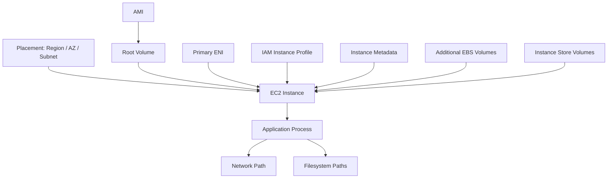
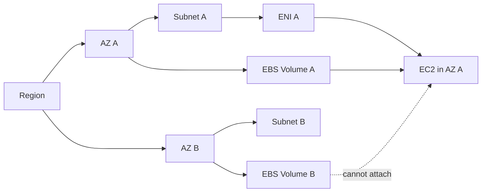
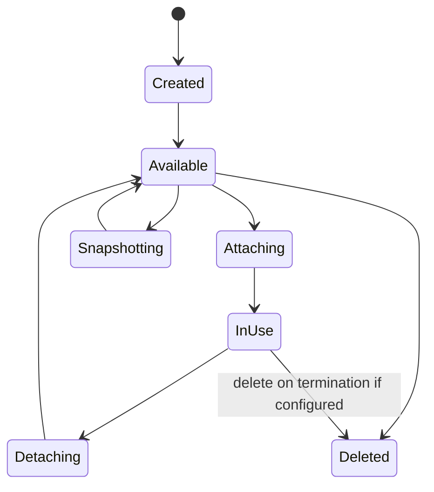
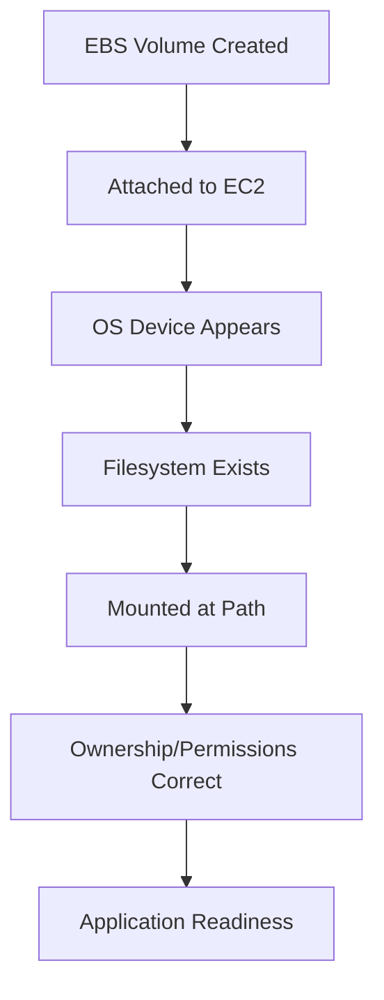
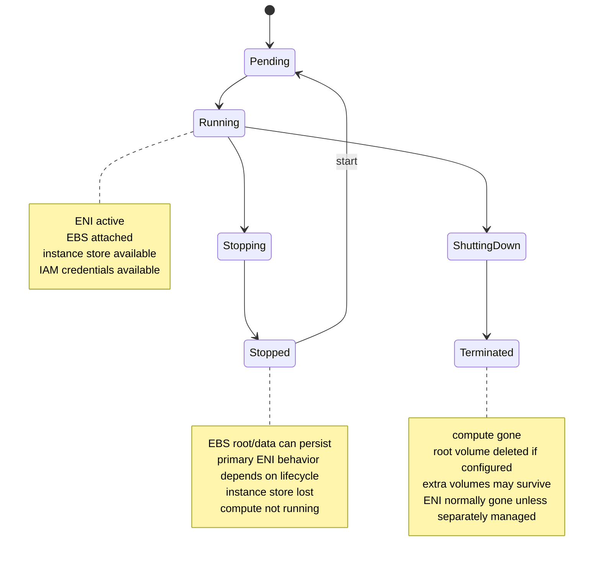
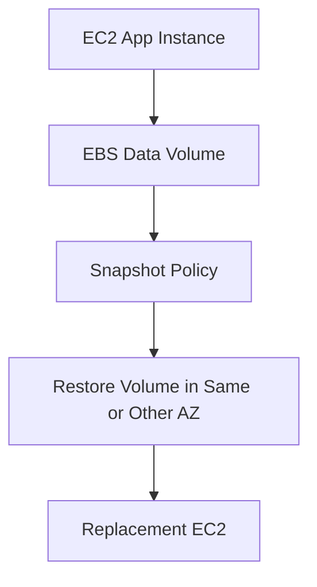

# Part 014 — EC2 Network and Storage Attachment Model

An EC2 instance is not just “a server”.

It is a composition of attached resources:

```txt
compute lifecycle
network identity
block storage
ephemeral local storage
IAM identity
metadata endpoint
placement boundary
```

Bad mental model:

```txt
EC2 instance = virtual machine
```

Better mental model:

```txt
EC2 instance = compute cell assembled from attachable identities and storage devices inside a placement boundary.
```

This distinction matters because many production incidents are attachment incidents disguised as compute incidents.

Examples:

```txt
Instance is running, but ENI is wrong.
Instance is healthy, but EBS volume is in another AZ.
Instance booted, but device name changed.
ASG replaced node, but orphaned data volume remained.
Worker restarted, but instance-store scratch data disappeared.
Security group changed, but wrong ENI received it.
```

This part teaches the EC2 attachment model so you can reason about what moves, what persists, what is AZ-local, what is destroyed, and what must be rebuilt.

---

## 1. Problem yang Diselesaikan

EC2 production bugs often happen at resource boundaries.

| Symptom | Actual Boundary Problem |
|---|---|
| app cannot receive traffic | ENI/security group/subnet/routing issue |
| app cannot reach dependency | subnet, route table, endpoint, SG/NACL, DNS, NAT issue |
| data volume cannot attach | EBS and instance are in different AZs |
| mount path changed after reboot | unstable device naming or missing fstab UUID |
| scale-out fails | subnet IP exhaustion or ENI limit |
| replacement node has no data | data lived on old local disk |
| ASG termination leaks cost | EBS delete-on-termination false or detached volume orphaned |
| stateful failover fails | storage is zonal but recovery assumed regional |
| node drains but jobs fail | local scratch storage lost without checkpoint |
| multi-attach corrupts data | multiple writers without cluster-aware filesystem/application |

The main production question:

```txt
Which parts of this EC2 node are replaceable, which are durable, which are movable, and which are tied to an AZ?
```

---

## 2. EC2 as an Assembly

A launched EC2 instance is assembled from multiple contracts.



Key principle:

```txt
The EC2 instance lifecycle is not identical to the lifecycle of every attached resource.
```

Some resources are destroyed with the instance.

Some survive.

Some can be detached.

Some cannot.

Some are AZ-local.

Some are regional.

Some are recreated by the fleet controller.

Some require explicit cleanup.

---

## 3. Attachment Matrix

| Resource | Scope | Can Detach? | Survives Instance Termination? | Important Constraint |
|---|---|---:|---:|---|
| Primary ENI | subnet/AZ | no while instance exists | no by default | tied to instance primary network identity |
| Secondary ENI | subnet/AZ | yes | yes if not deleted | attach only within same AZ |
| Private IP | ENI/subnet | moves with ENI | yes if ENI survives | subnet-local address |
| Elastic IP | Region | remap yes | yes until released | IPv4 only, account-owned allocation |
| Root EBS volume | AZ | detach after stop/termination depending state | depends delete-on-termination | boot device |
| Additional EBS volume | AZ | yes | yes unless configured otherwise | attach only to same AZ instance |
| Instance store | physical host/instance | no | no | ephemeral, tied to instance lifetime |
| IAM instance profile | instance association | can replace association | external role survives | credentials delivered through metadata |
| Security group | ENI/VPC | modify association | yes | attached to ENI, not “inside” OS |
| User data | instance launch | no normal re-run guarantee | no | launch-time bootstrap input |
| AMI | Region | not attached after launch | yes | used to create root volume |

This table should become part of your production instinct.

---

## 4. Placement Comes First

Before discussing ENI or EBS, define placement.

```txt
Region -> Availability Zone -> VPC subnet -> EC2 instance
```

Subnet is AZ-bound.

That means launching into a subnet implicitly selects an AZ.

Attachment consequences:

```txt
ENI is created in a subnet, therefore in one AZ.
EBS volume is created in one AZ.
Instance store is tied to the physical host of the instance.
Instance can attach EBS volumes only in same AZ.
Secondary ENI can attach only to instances in same AZ.
```

This is why placement is not an afterthought.



---

## 5. Elastic Network Interface Mental Model

An Elastic Network Interface is a virtual network card in a VPC.

It carries network identity:

- subnet
- private IPv4 address
- IPv6 addresses if configured
- MAC address
- security groups
- source/destination check setting
- attachment to an instance
- description and tags

Bad mental model:

```txt
The instance owns the IP.
```

Better mental model:

```txt
The ENI owns the network identity, and the instance uses the attached ENI.
```

### 5.1 Primary ENI

Every instance has a primary ENI.

Properties:

```txt
created at launch
cannot be detached while instance exists
represents primary network identity
usually deleted with instance
```

For Auto Scaling fleets, the primary ENI is normally ephemeral.

Do not build stable identity around it unless you have a clear reason.

### 5.2 Secondary ENI

Secondary ENIs are detachable.

They can support patterns such as:

- management network separation
- appliance-style failover
- static private IP movement within an AZ
- dual-homed instances
- traffic separation
- specialized security group boundary

But they add lifecycle complexity.

Rules of thumb:

```txt
Use secondary ENIs for network identity patterns, not because routing is poorly understood.
Do not use secondary ENIs as a default app deployment pattern.
Automate attachment/detachment and failover completely if you use them.
```

### 5.3 ENI AZ Constraint

A network interface is created in a subnet.

A subnet is in one AZ.

Therefore:

```txt
A secondary ENI can only move among instances in the same AZ.
```

This is a major limitation for failover designs.

If your recovery plan assumes cross-AZ movement of an ENI, the plan is wrong.

---

## 6. Security Groups Attach to ENIs

Security groups are associated with network interfaces.

This distinction matters.

```txt
An instance with multiple ENIs may have different security group behavior per ENI.
```

Example:

```txt
eth0: app traffic SG
eth1: management traffic SG
```

During incident debugging, ask:

```txt
Which ENI is the traffic using?
Which security groups are attached to that ENI?
Is the route table associated with that ENI's subnet correct?
Does the OS route traffic out the expected interface?
```

Security group correctness is not only “does the instance have the right SG”.

It is:

```txt
Does the network interface used by this flow have the correct SG, route, source address, and OS route?
```

---

## 7. ENI Failure Modes

### 7.1 Subnet IP Exhaustion

Symptom:

```txt
ASG cannot launch new instances
```

Cause:

```txt
subnet has no available private IPv4 addresses
```

Fix:

```txt
monitor available IPs
use larger subnets
spread across subnets
avoid leaking ENIs
```

### 7.2 Orphaned ENI

Symptom:

```txt
subnet IPs consumed even though instances are gone
```

Cause:

```txt
secondary ENIs or service-created ENIs not cleaned up
```

Fix:

```txt
tag ENIs
build orphan cleanup reports
understand service ownership before deleting
```

### 7.3 Wrong Security Group on Wrong ENI

Symptom:

```txt
one traffic path works, another fails
```

Cause:

```txt
multi-ENI instance with SG attached to different interface than expected
```

Fix:

```txt
map packet path to interface; inspect ENI SGs; inspect OS routes
```

### 7.4 Source/Destination Check on Appliance

Symptom:

```txt
NAT/router/appliance instance does not forward traffic
```

Cause:

```txt
source/destination check still enabled
```

Fix:

```txt
disable source/destination check only for appliance-style instances that need forwarding
```

---

## 8. EBS Attachment Mental Model

Amazon EBS is network-attached block storage.

Bad mental model:

```txt
EBS is a folder on the EC2 server.
```

Better mental model:

```txt
EBS is an AZ-scoped block device attached to an EC2 instance and exposed to the OS as a disk.
```

Important:

```txt
EBS is not regional.
EBS is not automatically mounted because it is attached.
EBS is not safe for multi-writer access unless the application/filesystem is designed for it.
```

### 8.1 EBS Lifecycle



EBS attachment is not the same as filesystem availability.

There are layers:

```txt
EBS volume exists
EBS volume attached
OS sees block device
filesystem exists
filesystem mounted
application can read/write expected path
```

Every layer can fail independently.

---

## 9. EBS AZ Constraint

EBS volumes and EC2 instances must be in the same Availability Zone to attach.

This matters for stateful design.

Bad assumption:

```txt
If AZ A fails, attach the volume to an instance in AZ B.
```

Wrong.

Better plan:

```txt
snapshot volume
restore snapshot into AZ B
launch replacement instance in AZ B
mount restored volume
recover application
```

Or design the application so the durable state is replicated above EBS.

Example:

```txt
single EC2 + EBS = zonal stateful system
multi-AZ database replication = application-level regional availability pattern
S3 = regional object durability boundary
```

---

## 10. Root Volume vs Data Volume

Separate root from data in your mind.

| Volume | Purpose | Lifecycle |
|---|---|---|
| root volume | boot OS from AMI | usually delete with instance |
| data volume | application data | explicit backup/restore lifecycle |
| scratch volume | temporary processing | disposable |
| log volume | local logs if used | usually avoid; ship logs externally |

### 10.1 Root Volume

Root volume is created from the AMI at launch.

For stateless fleets:

```txt
root volume should usually be encrypted and deleted on termination
```

Because the instance is rebuildable.

### 10.2 Data Volume

Data volume must have a recovery contract:

```txt
who creates it
who attaches it
who mounts it
who snapshots it
who restores it
who deletes it
what happens if the instance dies
what happens if the AZ fails
```

If you cannot answer these, the data volume is unmanaged state.

### 10.3 Scratch Volume

Scratch volume can be EBS or instance store.

It is acceptable only if the application can tolerate loss:

```txt
job can retry
cache can rebuild
intermediate file can be recomputed
checkpoint exists elsewhere
```

---

## 11. Block Device Mapping

Block device mapping defines which block devices are attached at launch.

It can come from:

- AMI
- Launch Template
- RunInstances request
- Auto Scaling configuration

Mental model:

```txt
AMI says default boot/storage layout.
Launch Template can override or extend it.
Runtime OS must still format/mount correctly.
```

Example:

```hcl
block_device_mappings {
  device_name = "/dev/xvda"

  ebs {
    volume_size           = 30
    volume_type           = "gp3"
    encrypted             = true
    delete_on_termination = true
  }
}

block_device_mappings {
  device_name = "/dev/sdf"

  ebs {
    volume_size           = 200
    volume_type           = "gp3"
    encrypted             = true
    delete_on_termination = true
  }
}
```

Danger:

```txt
Declaring a device does not guarantee your application sees the expected mounted filesystem path.
```

You still need:

```txt
stable device discovery
filesystem creation if new
mount path
fstab/systemd mount
permissions
readiness check
```

---

## 12. Device Naming on Nitro/NVMe

Modern EC2 Nitro-based instances often expose EBS volumes as NVMe devices.

This can surprise engineers who expect `/dev/sdf` to remain the OS-level name.

Bad mount pattern:

```bash
mount /dev/sdf /data
```

Better mount pattern:

```bash
mount UUID=<filesystem-uuid> /data
```

Or use stable symlinks exposed by the OS/tooling when available.

Production rule:

```txt
Mount filesystems by UUID, label, or stable volume identifier, not by fragile enumeration order.
```

### 12.1 Example Discovery

```bash
lsblk -f
sudo blkid
sudo nvme list
```

Typical mount flow:

```bash
sudo file -s /dev/nvme1n1
sudo mkfs.xfs /dev/nvme1n1
sudo mkdir -p /data
sudo blkid /dev/nvme1n1
```

Then `/etc/fstab`:

```txt
UUID=<uuid> /data xfs defaults,nofail 0 2
```

Use `nofail` carefully.

It prevents boot failure, but it can hide data-volume absence unless your app readiness checks verify the mount.

---

## 13. Attach Does Not Mean Mount

Many incidents come from this confusion.

```txt
Attach = AWS control plane attaches a block device to the instance.
Mount = OS makes a filesystem available at a path.
```

The full chain:



Runbook checks:

```bash
aws ec2 describe-volumes --volume-ids vol-abc
lsblk
blkid
mount | grep /data
findmnt /data
df -h /data
sudo journalctl -b | grep -i mount
```

Readiness check should include:

```txt
expected mount path exists
path is on expected device/filesystem
path is writable if needed
free space above threshold
ownership/permissions correct
```

---

## 14. Delete-on-Termination

Delete-on-termination controls whether an EBS volume is deleted when the instance is terminated.

This setting is not a minor detail.

It defines lifecycle ownership.

### 14.1 Stateless Root Volume

Usually:

```txt
delete-on-termination = true
```

Reason:

```txt
node is rebuildable
root volume contains no unique durable data
```

### 14.2 Data Volume

It depends.

If it is true durable state:

```txt
delete-on-termination = false
snapshot policy required
reattach/recovery workflow required
orphan detection required
```

If it is cache/scratch:

```txt
delete-on-termination = true
job/cache rebuilds elsewhere
```

### 14.3 Dangerous Middle

Worst pattern:

```txt
delete-on-termination = false
no tags
no snapshot policy
no owner
no restore process
```

This creates invisible abandoned data.

---

## 15. EBS Multi-Attach

EBS Multi-Attach allows certain EBS volumes to be attached to multiple instances in the same AZ.

This does not magically make a normal filesystem safe for multiple writers.

Bad mental model:

```txt
Multi-Attach lets two servers share a disk like a shared folder.
```

Better mental model:

```txt
Multi-Attach exposes the same block device to multiple instances; the application or cluster filesystem must coordinate concurrent access.
```

Use only when you understand:

- volume type support
- same-AZ constraint
- fencing
- write coordination
- cluster-aware filesystem or application behavior
- recovery after partial writer failure

For most application teams, EFS/FSx or application-level replication is safer than raw block multi-writer design.

---

## 16. Instance Store Attachment Model

Instance store is local ephemeral block storage physically attached to the host.

Bad mental model:

```txt
Instance store is cheap EBS.
```

Better mental model:

```txt
Instance store is high-locality ephemeral storage tied to the lifetime and placement of the instance.
```

Use it for:

- cache
- scratch files
- temporary sort/shuffle
- build cache
- ML preprocessing staging
- high-throughput disposable data
- replicated storage systems that understand node loss

Do not use it for:

- unique durable data
- uncheckpointed job output
- compliance records
- single-copy database data
- uploads not yet persisted elsewhere

### 16.1 Instance Store Lifecycle

Instance store can survive reboot.

But it is lost on events such as:

```txt
instance stop
instance termination
host retirement or underlying disk failure
some instance lifecycle transitions
```

Production rule:

```txt
Anything on instance store must be either recomputable, replicated, or checkpointed elsewhere.
```

---

## 17. EBS vs Instance Store

| Dimension | EBS | Instance Store |
|---|---|---|
| Scope | AZ | physical host / instance |
| Persistence | survives instance stop/terminate if configured | ephemeral |
| Attach/detach | attachable within same AZ | only available to instance at launch |
| Snapshot | yes | no direct durable snapshot model |
| Performance | network-attached, provisioned by type | local, often very high throughput/low latency |
| Use case | durable block storage | disposable high-locality storage |
| Failure model | volume impairment/AZ dependency | instance/host lifecycle loss |

Design heuristic:

```txt
If losing the disk is an incident, use EBS or higher-level durable storage.
If losing the disk is just cache invalidation or job retry, instance store may be excellent.
```

---

## 18. IAM Instance Profile as Attachment

The IAM instance profile is attached to the EC2 instance.

The application receives temporary credentials through instance metadata.

Mental model:

```txt
IAM role is not inside the AMI.
It is attached at launch/runtime through the instance profile.
```

Implication:

```txt
Same AMI can run with different permissions depending on Launch Template / instance profile.
```

This is useful and dangerous.

Useful:

```txt
same hardened image can run different workloads
```

Dangerous:

```txt
wrong role turns a safe image into an over-permissive node
```

Production checks:

```bash
aws sts get-caller-identity
curl -sS -H "X-aws-ec2-metadata-token: $TOKEN" \
  http://169.254.169.254/latest/meta-data/iam/security-credentials/
```

Never bake AWS long-lived credentials into AMIs or user data.

---

## 19. Attachment and Auto Scaling

Auto Scaling assumes instances are replaceable.

This assumption is valid only if attachments are designed for replacement.

### 19.1 Stateless ASG

Good shape:

```txt
primary ENI ephemeral
root EBS delete-on-termination
logs shipped out
state externalized
bootstrap idempotent
```

Replacement is easy.

### 19.2 ASG with Data Volumes

Danger shape:

```txt
ASG terminates instance
volume survives
new instance launches with fresh empty volume
old data volume orphaned
app state lost from active node
```

If you use ASG for stateful EC2, you need a controller pattern:

```txt
identify volume
attach to replacement in same AZ
mount by UUID
ensure single writer
coordinate health/traffic
snapshot/restore on AZ loss
```

At that point, ask whether the workload should use:

- managed database
- EFS/FSx
- S3
- EKS StatefulSet with CSI and correct constraints
- application-level replication

instead of hand-rolled stateful EC2.

---

## 20. Attachment State Machine

EC2 lifecycle and attachment lifecycle interact.



Production design must specify behavior for:

```txt
reboot
stop/start
terminate
replace
AZ loss
host retirement
volume impairment
ENI leak
```

---

## 21. Stateful EC2 Attachment Pattern

A minimal stateful EC2 pattern:



Contract:

```txt
single writer
volume in same AZ
mount by UUID
application stops cleanly before detach
snapshot policy exists
restore procedure tested
AZ failure handled by snapshot restore, not direct attach
```

Runbook:

```txt
1. stop application
2. flush filesystem/application state
3. unmount volume
4. detach volume
5. attach to replacement in same AZ
6. mount by UUID
7. verify data integrity
8. start application
9. run readiness checks
10. admit traffic
```

If any of these steps are manual and undocumented, your stateful EC2 design is not production-grade.

---

## 22. Disposable Worker Attachment Pattern

For queue workers:

```txt
root EBS: delete-on-termination true
scratch: instance store or disposable EBS
job input: S3/SQS/database
job output: durable store
checkpoint: external
```

Failure behavior:

```txt
instance dies -> job visibility timeout expires or checkpoint resumes -> replacement worker retries
scratch data loss is acceptable
```

Do not acknowledge a job as complete before durable output is written.

---

## 23. Cache Node Attachment Pattern

For cache-heavy EC2:

```txt
local disk can be instance store
cache is rebuildable
warmup is measured
load balancer/service discovery gates readiness
cache poisoning detection exists
```

Failure behavior:

```txt
node dies -> cache capacity drops -> replacement warms -> traffic gradually returns
```

Risk:

```txt
If all cache nodes restart together, backend storage can be overwhelmed.
```

Mitigation:

```txt
stagger replacement
warm pools
preload critical keys
rate-limit cache fill
protect origin with backpressure
```

---

## 24. Network Appliance Attachment Pattern

For EC2 acting as a network appliance:

- NAT instance
- firewall appliance
- router
- proxy
- packet inspection node

Attachment rules become stricter:

```txt
secondary ENIs may represent traffic planes
source/destination check may need to be disabled
routes point to ENI or instance depending design
failover must move route targets or ENI within constraints
```

Do not treat appliance EC2 like normal stateless app EC2.

Its network identity is part of the product.

---

## 25. Debugging Attachment Incidents

### 25.1 Instance Running but Not Reachable

Check:

```bash
aws ec2 describe-instances --instance-ids i-abc
aws ec2 describe-network-interfaces --filters Name=attachment.instance-id,Values=i-abc
```

Questions:

```txt
Which subnet?
Which private IP?
Which security groups?
Public IP or private-only?
Route table correct?
NACL blocking?
OS firewall?
Service listening on expected interface?
```

### 25.2 Volume Attached but App Cannot See Data

Check:

```bash
lsblk -f
blkid
findmnt /data
df -h /data
sudo journalctl -b | grep -i mount
```

Questions:

```txt
Is filesystem mounted?
Is it mounted at expected path?
Did device name change?
Is fstab using UUID?
Are permissions correct?
Is app running before mount completed?
```

### 25.3 Replacement Instance Has Empty Data

Questions:

```txt
Was old data on root volume?
Was data on instance store?
Did ASG create a new EBS volume from template?
Was old data volume orphaned?
Was restore from snapshot expected but not automated?
```

### 25.4 Scale-Out Fails

Check:

```txt
ASG activity history
subnet available IPs
EC2 service quotas
instance type capacity
launch template validity
IAM instance profile
security group existence
AMI availability
```

### 25.5 Multi-ENI Traffic Broken

Check:

```bash
ip addr
ip route
ip rule
ss -lntup
```

Questions:

```txt
Which interface owns the source IP?
Which route is selected?
Does return traffic go out the same path?
Is SG attached to that ENI?
Is source/destination check relevant?
```

---

## 26. Production Readiness Checklist

For every EC2 workload, answer:

```txt
[ ] Which subnet/AZ does each instance use?
[ ] Does the fleet span enough AZs for its availability target?
[ ] Are subnet IPs monitored?
[ ] Are ENIs tagged and owned?
[ ] Are security groups attached to the correct ENI?
[ ] Is source/destination check correct for the workload?
[ ] Is root volume encrypted?
[ ] Is root delete-on-termination correct?
[ ] Are data volumes separate from root if durable state exists?
[ ] Are data volumes snapshotted?
[ ] Is EBS AZ-locality reflected in recovery plan?
[ ] Are volumes mounted by UUID/label/stable identifier?
[ ] Does readiness check verify mounts?
[ ] Is instance store used only for disposable data?
[ ] Is IAM instance profile workload-specific?
[ ] Is metadata access IMDSv2-compatible?
[ ] Does ASG replacement preserve intended behavior?
[ ] Are orphaned ENIs and volumes detectable?
[ ] Is AZ-loss recovery tested, not assumed?
```

---

## 27. Common Mistakes

1. Assuming EBS can attach across AZs.
2. Treating attach and mount as the same operation.
3. Mounting by `/dev/sdf` instead of UUID/stable identity.
4. Storing durable data on instance store.
5. Letting ASG terminate instances with unmanaged data volumes.
6. Forgetting delete-on-termination on scratch/root volumes.
7. Forgetting to tag volumes and ENIs.
8. Assuming private IP belongs to instance rather than ENI.
9. Using secondary ENIs without automated failover.
10. Attaching security groups to the wrong network path.
11. Ignoring subnet IP exhaustion.
12. Assuming Multi-Attach solves shared filesystem semantics.
13. Baking IAM assumptions into AMI instead of Launch Template/profile.
14. Letting app start before data mount is ready.
15. Treating AZ-local state as regionally available.

---

## 28. Mini Case Study: Stateful Report Generator

A reporting service runs on EC2.

Original design:

```txt
ASG min=1 max=1
root volume has app and report cache
instance store used for temporary files and final output staging
ALB health check only checks process port
```

Incident:

```txt
instance replaced by ASG after host issue
new instance boots cleanly
report output from previous run is gone
some jobs were marked complete before upload to S3
customers see missing reports
```

Root cause:

```txt
attachment model was implicit
local storage was treated as durable workflow state
health check did not verify storage contract
job completion happened before durable write
```

Improved design:

```txt
input queue in SQS
intermediate scratch on instance store
periodic checkpoints to S3
final report written to S3 before job ack
root volume disposable
delete-on-termination true
ASG replacement safe
readiness verifies scratch mount exists and S3 access works
```

New failure behavior:

```txt
instance dies -> scratch lost -> job retries from checkpoint/input -> final output remains durable only after S3 write
```

The architecture did not become safer because EC2 changed.

It became safer because the attachment contract became explicit.

---

## 29. Summary

EC2 is an assembled compute cell, not a monolithic server.

Its important attachments are:

```txt
ENI for network identity
EBS for durable AZ-scoped block storage
instance store for ephemeral local storage
IAM instance profile for AWS identity
metadata endpoint for runtime discovery
security groups for ENI-level traffic boundary
```

The most important rules:

```txt
Placement comes first.
Subnets imply AZ.
EBS is AZ-scoped.
ENIs are subnet/AZ-scoped.
Attach is not mount.
Root and data volume lifecycles are different.
Instance store is disposable.
ASG replacement is safe only when attachment lifecycles are explicit.
```

A senior engineer does not ask only:

```txt
Is the instance running?
```

They ask:

```txt
Is the right network identity attached?
Is the right storage attached and mounted?
Is the lifecycle behavior correct?
Can this node be replaced without losing state?
Can recovery work across the actual placement boundaries?
```

That is the difference between operating EC2 instances and operating EC2-based systems.

---

## References

- AWS Documentation — Elastic network interfaces: https://docs.aws.amazon.com/AWSEC2/latest/UserGuide/using-eni.html
- AWS Documentation — Create a network interface for your EC2 instance: https://docs.aws.amazon.com/AWSEC2/latest/UserGuide/create-network-interface.html
- AWS Documentation — Networking in Amazon EC2: https://docs.aws.amazon.com/AWSEC2/latest/UserGuide/ec2-networking.html
- AWS Documentation — Attach an Amazon EBS volume to an Amazon EC2 instance: https://docs.aws.amazon.com/ebs/latest/userguide/ebs-attaching-volume.html
- AWS Documentation — Amazon EBS volumes: https://docs.aws.amazon.com/ebs/latest/userguide/ebs-volumes.html
- AWS Documentation — Make an Amazon EBS volume available for use: https://docs.aws.amazon.com/ebs/latest/userguide/ebs-using-volumes.html
- AWS Documentation — Block device mappings for volumes on Amazon EC2 instances: https://docs.aws.amazon.com/AWSEC2/latest/UserGuide/block-device-mapping-concepts.html
- AWS Documentation — Amazon EBS volume limits for Amazon EC2 instances: https://docs.aws.amazon.com/AWSEC2/latest/UserGuide/volume_limits.html
- AWS Documentation — Instance store temporary block storage for EC2 instances: https://docs.aws.amazon.com/AWSEC2/latest/UserGuide/InstanceStorage.html
