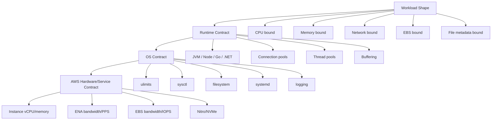
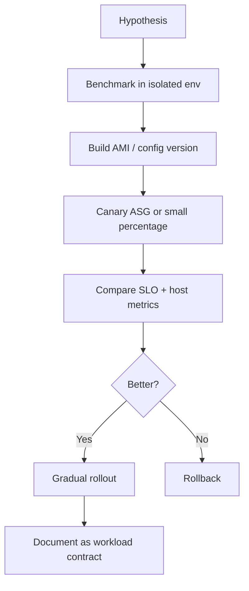

# Part 015 — EC2 Operating System Tuning

Most EC2 performance problems are not solved by changing one kernel parameter.

They are solved by understanding the path of work through the machine:

```txt
request -> kernel -> scheduler -> process -> heap/native memory -> socket -> ENA -> VPC
       -> syscall -> page cache -> filesystem -> block queue -> NVMe/EBS driver -> EBS service
```

A production EC2 instance is not just an instance type. It is a stack:

```txt
AMI
kernel
systemd
runtime
application
filesystem
block device
network adapter
instance limits
AWS service limits
```

Bad tuning is usually global, copied, and irreversible.

Good tuning is workload-specific, measured, versioned, reversible, and encoded into the machine image or bootstrap process.

This part is not a random list of Linux knobs. It is a practical model for deciding **what to tune, why to tune it, how to verify it, and when to leave it alone**.

---

## 1. Problem yang Diselesaikan

EC2 incidents often look like “AWS is slow”, but the actual failure is lower and more specific.

| Symptom | Possible OS-Level Cause |
|---|---|
| API p99 latency jumps | CPU run queue, GC pause, socket backlog, EBS latency, DNS stall, connection pool starvation |
| app cannot open new files | `ulimit -n`, systemd `LimitNOFILE`, kernel file-max |
| app cannot create threads | process limit, memory pressure, stack size, cgroup limit |
| EBS throughput below expectation | instance EBS bandwidth limit, volume limit, queue depth too low, filesystem mount issue |
| network throughput below expectation | instance network baseline/burst, ENA driver, PPS limit, conntrack pressure |
| node OOMs under load | heap/native/page-cache pressure, swap behavior, memory overcommit, container limit mismatch |
| disk full despite cleanup | deleted-but-open files, journald growth, container layers, temp files, logs |
| boot is slow | cloud-init scripts, package install during boot, DNS dependency, yum/apt mirror issue |
| shutdown loses work | no graceful SIGTERM handling, systemd timeout, lifecycle hook missing |
| CPU is high but throughput is flat | lock contention, context switching, softirq, syscall overhead, GC, kernel network processing |

The goal is not to create a magic tuned AMI.

The goal is to create an operating-system contract:

```txt
for this workload class,
with this instance family,
with this storage mode,
under this traffic shape,
these OS settings are intentional,
observable,
and safe to roll back.
```

---

## 2. Mental Model

Think of EC2 OS tuning as four layers.



The mistake is tuning from the bottom up:

```txt
change sysctl -> hope app improves
```

The production approach is top down:

```txt
identify workload bottleneck
measure path saturation
change the smallest relevant setting
verify with load test and production telemetry
encode into AMI/bootstrap
roll out gradually
```

---

## 3. Tuning Philosophy

### 3.1 Tuning Is a Contract, Not a Ritual

A setting is only valid when you can answer:

```txt
What workload needs it?
What failure does it prevent?
What metric proves it works?
What metric proves it made things worse?
Where is it encoded?
How is it rolled back?
```

Example:

```txt
Setting: LimitNOFILE=1048576
Reason: API gateway keeps many outbound sockets during peak.
Proof: open file descriptor count approaches old limit during load test.
Risk: masking connection leak.
Rollback: systemd drop-in versioned in AMI pipeline.
```

### 3.2 Prefer Removing Bottlenecks Before Increasing Limits

Increasing a limit can hide a leak.

For example:

```txt
Too many open files
```

can mean:

```txt
valid high connection count
connection leak
unclosed file handles
log rotation bug
stuck client sockets
bad retry storm
```

Do not tune until you distinguish expected pressure from broken behavior.

### 3.3 Avoid Cargo-Cult `sysctl.conf`

Dangerous tuning pattern:

```bash
net.ipv4.tcp_tw_reuse=1
net.core.somaxconn=65535
vm.swappiness=1
fs.file-max=1000000
```

Those may be valid in some contexts, but as a copied block they are weak engineering.

Better pattern:

```txt
one workload class -> one measured bottleneck -> one setting group -> one benchmark -> one rollout plan
```

---

## 4. Baseline Before Tuning

Before changing the OS, collect a baseline.

### 4.1 Host-Level Baseline

Collect:

```bash
uname -a
cat /etc/os-release
uptime
lscpu
free -m
lsblk -o NAME,SIZE,TYPE,FSTYPE,MOUNTPOINT,MODEL
mount
ip addr
ip route
ss -s
df -hT
df -ih
systemctl --failed
journalctl -p warning --since "1 hour ago"
```

### 4.2 Runtime Baseline

For a JVM service:

```bash
ps -eo pid,ppid,cmd,%cpu,%mem --sort=-%cpu | head
jcmd <pid> VM.flags
jcmd <pid> VM.native_memory summary
jcmd <pid> GC.heap_info
jstat -gcutil <pid> 1000 10
```

For any service:

```bash
pidstat -p <pid> 1
pidstat -d -p <pid> 1
pidstat -w -p <pid> 1
cat /proc/<pid>/limits
ls /proc/<pid>/fd | wc -l
```

### 4.3 I/O Baseline

```bash
iostat -xz 1
sudo nvme list || true
sudo blockdev --getra /dev/nvme0n1
cat /sys/block/nvme0n1/queue/scheduler
cat /sys/block/nvme0n1/queue/nr_requests
```

Interpretation guide:

| Signal | Meaning |
|---|---|
| high `%util` with high await | device/path saturated or slow |
| high `aqu-sz` | queue building up |
| low throughput but high latency | small random I/O, queue bottleneck, app sync writes |
| high read/write merge | filesystem/block coalescing behavior |
| low device utilization but app slow | bottleneck elsewhere |

### 4.4 Network Baseline

```bash
ss -tan state established | wc -l
ss -tan state time-wait | wc -l
ss -s
nstat -az | egrep 'Tcp|Ip|Udp' | head -100
ip -s link
ethtool -i ens5 || true
ethtool -S ens5 | head -100 || true
```

Watch for:

```txt
TCP retransmits
packet drops
socket backlog overflow
TIME_WAIT explosion
conntrack pressure
interface errors
driver mismatch
```

### 4.5 Cloud Baseline

At AWS level, correlate host metrics with:

```txt
EC2 CPUUtilization
EC2 NetworkIn/NetworkOut
EC2 NetworkPacketsIn/NetworkPacketsOut
EBS VolumeReadOps/VolumeWriteOps
EBS VolumeReadBytes/VolumeWriteBytes
EBS VolumeQueueLength
EBS BurstBalance where applicable
StatusCheckFailed_Instance
StatusCheckFailed_System
```

The critical skill is correlation:

```txt
host iostat says block queue is high
CloudWatch says EBS queue/latency is high
app says p99 write latency is high
```

That is a storage-path bottleneck.

If only the app says p99 is high, the OS may not be the problem.

---

## 5. CPU and Scheduler Tuning

### 5.1 CPU Saturation Is Not Just CPUUtilization

High CPU is not automatically bad.

Bad CPU state is:

```txt
CPU high
throughput flat or falling
latency rising
run queue high
context switches high
GC or kernel softirq high
```

Useful commands:

```bash
mpstat -P ALL 1
vmstat 1
pidstat -u -p ALL 1
pidstat -w -p ALL 1
top -H -p <pid>
```

Interpretation:

| Signal | Meaning |
|---|---|
| high `%usr` | app/userland CPU |
| high `%sys` | kernel/syscall/network/storage overhead |
| high `%iowait` | CPU waiting on I/O, often storage path |
| high `%soft` | network softirq or packet processing pressure |
| high context switches | excessive threading, lock contention, syscall churn |
| high run queue | more runnable work than CPU capacity |

### 5.2 CPU Pinning and NUMA

Most common EC2 applications should not start with CPU pinning.

Consider CPU pinning only for:

```txt
low-latency trading-like workloads
HPC
packet processing
JVM workloads with proven scheduler interference
benchmark-sensitive systems
```

Check NUMA topology:

```bash
lscpu | egrep 'NUMA|Socket|CPU\(s\)'
numactl --hardware || true
```

For ordinary services, the first-order tuning is usually:

```txt
right-size instance
right-size thread pools
reduce blocking
avoid CPU steal from noisy application threads
keep GC predictable
```

### 5.3 Thread Pool Sizing

A common anti-pattern:

```txt
vCPU = 8
application worker threads = 500
DB pool = 200
HTTP client max connections = 1000
```

The OS will schedule it, but not efficiently.

A simple starting model:

```txt
CPU-bound pool ~= number of vCPUs
I/O-bound pool ~= concurrency needed to cover wait time, but bounded by downstream capacity
```

Little's Law shape:

```txt
concurrency ~= arrival_rate * service_time
```

If a service handles 500 requests/second and average service time is 80ms:

```txt
needed in-flight concurrency ~= 500 * 0.08 = 40
```

You do not need 1000 application threads for that path unless there is hidden blocking or slow downstream.

### 5.4 CPU Tuning Checklist

```txt
[ ] Is CPU high on all cores or a few hot cores?
[ ] Is p99 latency rising with CPU?
[ ] Is run queue greater than vCPU count?
[ ] Is system CPU high?
[ ] Is softirq high?
[ ] Is GC consuming a large CPU share?
[ ] Is thread count rational for vCPU count?
[ ] Is the workload CPU-bound or blocked on I/O?
[ ] Would a larger instance help, or would it hide lock contention?
```

---

## 6. Memory Tuning

### 6.1 Memory Is Shared by More Than the Heap

A Java service on EC2 uses memory for:

```txt
JVM heap
metaspace
thread stacks
direct buffers
JIT/code cache
native libraries
TLS buffers
page cache
kernel memory
agent processes
sidecars
logs/buffers
```

Bad sizing:

```txt
instance memory = 8 GiB
Xmx = 7.5 GiB
```

This leaves too little room for native memory, page cache, and the OS.

Better model:

```txt
instance memory
- OS reserve
- agents/logging reserve
- native/runtime reserve
- page cache reserve
= safe application heap/container limit
```

### 6.2 Page Cache Is Not Wasted Memory

Linux uses free memory as page cache.

This is normal:

```bash
free -h
```

Look at:

```txt
available memory
swap in/out
OOM events
major page faults
reclaim pressure
```

Commands:

```bash
vmstat 1
sar -B 1
cat /proc/meminfo | head -40
journalctl -k | grep -i -E 'oom|out of memory|killed process'
```

### 6.3 Swap on EC2

Swap is a policy choice.

For latency-sensitive services, swap can turn a memory problem into a latency outage.

For batch or non-latency-critical workloads, small swap can prevent abrupt failure and allow graceful degradation.

Common production stance:

```txt
latency-sensitive API: avoid or minimize swap, alert on any swap activity
batch worker: controlled swap may be acceptable
stateful DB: follow DB vendor guidance; avoid surprise swap storms
```

If swap exists, alert on:

```txt
si/so in vmstat
swap used growth
major page faults
p99 latency increase
```

### 6.4 Overcommit

Memory overcommit controls how Linux permits allocation promises.

Danger:

```txt
allocation succeeds
actual use later triggers OOM
wrong process dies
```

Do not change overcommit globally without understanding the runtime.

For JVM services, prefer explicit memory sizing and headroom over aggressive overcommit tuning.

### 6.5 Memory Tuning Checklist

```txt
[ ] Is memory pressure real or only page cache usage?
[ ] Are there OOM kills in kernel logs?
[ ] Is swap activity non-zero during peak?
[ ] Are major page faults rising?
[ ] Is JVM heap leaving enough native headroom?
[ ] Is thread stack count excessive?
[ ] Are agents or sidecars included in sizing?
[ ] Is the process inside a cgroup/container limit?
[ ] Is memory pressure correlated with latency?
```

---

## 7. File Descriptor and Process Limits

### 7.1 The `ulimit` Trap

Many engineers set:

```bash
ulimit -n 1048576
```

and think the problem is solved.

But a production service launched by systemd may ignore your interactive shell limit.

Check process limits directly:

```bash
cat /proc/<pid>/limits
```

Systemd service override:

```ini
# /etc/systemd/system/myapp.service.d/limits.conf
[Service]
LimitNOFILE=1048576
LimitNPROC=65535
```

Apply:

```bash
sudo systemctl daemon-reload
sudo systemctl restart myapp
```

Verify:

```bash
cat /proc/$(pidof myapp)/limits
```

### 7.2 File Descriptors Include Sockets

Open file descriptors include:

```txt
regular files
TCP sockets
Unix sockets
eventfd
epoll descriptors
pipes
logs
JARs/shared libraries
```

Inspect:

```bash
ls -l /proc/<pid>/fd | head
ls /proc/<pid>/fd | wc -l
lsof -p <pid> | awk '{print $5}' | sort | uniq -c | sort -nr | head
```

If socket count grows forever, the fix may be connection lifecycle, not higher limits.

### 7.3 Kernel-Wide File Limit

Check:

```bash
cat /proc/sys/fs/file-max
cat /proc/sys/fs/file-nr
```

But for most application incidents, the process/systemd limit is the first bottleneck.

### 7.4 Production Rule

For every high file descriptor setting, define an expected envelope:

```txt
max inbound connections
+ max outbound connections
+ log/files overhead
+ safety margin
```

Example:

```txt
ALB keep-alive inbound: 20,000
HTTP client pool: 5,000
DB pool: 200
Kafka connections: 300
logs/files/misc: 1,000
safety margin: 2x
LimitNOFILE: 60,000
```

A value of one million is not wrong, but it should not be the substitute for sizing.

---

## 8. Network Tuning on EC2

### 8.1 Start With Instance Network Shape

Network performance is capped by instance type and size.

OS tuning cannot exceed the instance's network envelope.

Key dimensions:

```txt
baseline bandwidth
burst bandwidth
packets per second
connections
ENA driver support
placement proximity
cross-AZ path
NAT/endpoint path
TLS overhead
```

Useful commands:

```bash
ethtool -i ens5
ethtool -S ens5 | egrep 'drop|timeout|bw|pps|conntrack|queue' || true
ip -s link show ens5
ss -s
nstat -az | egrep 'TcpRetrans|TcpTimeout|Listen|InErr|OutErr'
```

### 8.2 ENA Matters

Enhanced Networking with ENA provides higher bandwidth, higher packet-per-second performance, and lower latency on supported instance types.

Validate driver:

```bash
ethtool -i ens5
```

Look for:

```txt
driver: ena
version: ...
```

If the AMI lacks the required driver or the driver is old, the instance can underperform or behave inconsistently.

### 8.3 Socket Backlog

Symptoms:

```txt
connection refused under burst
ALB target shows intermittent failure
application is up but cannot accept fast enough
```

Relevant layers:

```txt
kernel listen backlog
application server accept queue
load balancer health check
thread/event loop availability
```

Commands:

```bash
ss -ltn
nstat -az | egrep 'ListenOverflows|ListenDrops'
```

Potential settings:

```conf
net.core.somaxconn = 4096
net.ipv4.tcp_max_syn_backlog = 8192
```

But these only help if the application also configures its accept backlog and has enough workers/event loop capacity.

### 8.4 Ephemeral Ports

Outbound-heavy services can exhaust ephemeral ports.

Symptoms:

```txt
connect: cannot assign requested address
intermittent outbound failures
high TIME_WAIT count
```

Check:

```bash
cat /proc/sys/net/ipv4/ip_local_port_range
ss -tan state time-wait | wc -l
ss -tan state established | wc -l
```

Potential setting:

```conf
net.ipv4.ip_local_port_range = 10240 65535
```

But first ask:

```txt
Are we opening too many short-lived connections?
Should connection pooling be fixed?
Is NAT gateway involved?
Is destination tuple diversity low?
Is retry storm creating port churn?
```

### 8.5 TCP Keepalive

Idle connections through load balancers, NAT, firewalls, and proxies can die silently.

Kernel keepalive settings can help, but application/runtime settings often matter more.

Example:

```conf
net.ipv4.tcp_keepalive_time = 300
net.ipv4.tcp_keepalive_intvl = 30
net.ipv4.tcp_keepalive_probes = 5
```

Use this only when it matches the network path and application connection pooling behavior.

### 8.6 Network Tuning Checklist

```txt
[ ] Is the instance type large enough for required bandwidth/PPS?
[ ] Is ENA enabled and using the expected driver?
[ ] Are retransmits increasing?
[ ] Are listen drops/overflows increasing?
[ ] Is TIME_WAIT count expected for traffic shape?
[ ] Is ephemeral port range sufficient?
[ ] Is connection pooling working?
[ ] Are retries amplifying traffic?
[ ] Is cross-AZ or NAT path adding bottleneck/cost?
[ ] Is packet processing visible as high softirq CPU?
```

---

## 9. EBS and Filesystem Tuning

### 9.1 EBS Path Has Two Limits

EBS performance is bounded by at least two things:

```txt
EBS volume limits
EC2 instance EBS bandwidth/IOPS limits
```

Increasing gp3 IOPS does not help if the instance's EBS bandwidth is saturated.

Changing instance type does not help if the volume itself is undersized.


### 9.2 Device Naming on Nitro

On Nitro-based instances, EBS volumes appear as NVMe devices.

Avoid hardcoding unstable device names.

Use filesystem UUIDs or labels in `/etc/fstab`:

```bash
sudo blkid
```

Example `/etc/fstab`:

```fstab
UUID=11111111-2222-3333-4444-555555555555 /data xfs defaults,nofail 0 2
```

Why `nofail`?

```txt
If a non-critical data volume is missing, the instance can still boot.
Your bootstrap/service logic can then fail explicitly with a clear error.
```

For critical data volumes, you may intentionally fail boot, but make that choice explicit.

### 9.3 Filesystem Choice

Common choices:

| Filesystem | Common Fit |
|---|---|
| XFS | large files, high throughput, common for data volumes |
| ext4 | general-purpose, broad familiarity |
| tmpfs | memory-backed temporary data |

Do not choose filesystem based only on popularity.

Choose based on:

```txt
file size distribution
metadata operations
snapshot behavior
application requirements
resize workflow
operational familiarity
```

### 9.4 Mount Options

Mount options can change performance and failure behavior.

Common example:

```fstab
UUID=<uuid> /data xfs defaults,noatime,nofail 0 2
```

`noatime` can reduce metadata writes for read-heavy workloads.

But do not apply blindly if software depends on access time.

### 9.5 Read Ahead

For sequential read-heavy workloads, read-ahead can matter.

Check:

```bash
sudo blockdev --getra /dev/nvme1n1
```

Set:

```bash
sudo blockdev --setra 4096 /dev/nvme1n1
```

Make persistent through udev/systemd, not a manual command.

Avoid increasing read-ahead for random I/O workloads without testing.

### 9.6 Queue Depth

EBS can need enough outstanding I/O to reach provisioned performance.

But too much queueing increases latency.

Rule of thumb:

```txt
throughput workloads tolerate deeper queues
latency-sensitive workloads need bounded queues
```

Observe:

```bash
iostat -xz 1
```

Watch:

```txt
r/s, w/s
rkB/s, wkB/s
await
aqu-sz
%util
```

### 9.7 Deleted But Open Files

Disk full even after deleting logs?

Check:

```bash
sudo lsof +L1
```

This finds deleted files still held open by a process.

Fix pattern:

```txt
rotate logs correctly
signal/restart process
avoid writing large logs to root volume
ship logs off-node
```

### 9.8 EBS Tuning Checklist

```txt
[ ] Is the volume type appropriate for workload?
[ ] Are volume IOPS and throughput provisioned correctly?
[ ] Is the instance EBS bandwidth sufficient?
[ ] Is EBS optimization enabled/default for the instance type?
[ ] Is filesystem mounted by UUID/label?
[ ] Is `/etc/fstab` safe for boot behavior?
[ ] Is queue depth enough but not causing latency bloat?
[ ] Are CloudWatch EBS metrics correlated with host iostat?
[ ] Are snapshots/restores tested under real mount behavior?
[ ] Is root volume protected from app logs/temp files?
```

---

## 10. Instance Store and Temporary Storage Tuning

Instance store is local and ephemeral.

It is useful for:

```txt
scratch space
cache
build artifacts
shuffle/intermediate data
temporary decompression
high-throughput local reads/writes
```

It is dangerous for:

```txt
primary data
uncheckpointed jobs
audit records
anything requiring durable recovery
```

Production rule:

```txt
Every byte on instance store must be either reproducible, disposable, or checkpointed elsewhere.
```

Operational checklist:

```txt
[ ] Is instance store mounted at boot predictably?
[ ] Is the application aware data disappears on stop/terminate?
[ ] Is cache warmup controlled?
[ ] Is scratch space cleaned between jobs?
[ ] Is disk pressure monitored?
[ ] Is fallback behavior safe when local disk is unavailable?
```

---

## 11. Systemd as Production Boundary

A service is not production-ready until systemd behavior is intentional.

Example service:

```ini
[Unit]
Description=Example API Service
After=network-online.target
Wants=network-online.target

[Service]
User=app
Group=app
WorkingDirectory=/opt/app
ExecStart=/usr/bin/java -jar /opt/app/app.jar
Restart=on-failure
RestartSec=5
TimeoutStartSec=120
TimeoutStopSec=45
KillSignal=SIGTERM
LimitNOFILE=1048576
EnvironmentFile=/etc/app/app.env

[Install]
WantedBy=multi-user.target
```

Important fields:

| Setting | Why it matters |
|---|---|
| `Restart=on-failure` | recovers from process crash |
| `TimeoutStartSec` | prevents endless startup hang |
| `TimeoutStopSec` | gives app time to drain |
| `KillSignal=SIGTERM` | enables graceful shutdown |
| `LimitNOFILE` | real process FD limit |
| `EnvironmentFile` | explicit runtime config boundary |

### 11.1 Startup Readiness

Do not mark the instance healthy just because systemd started the process.

Health should mean:

```txt
process started
config loaded
dependencies reachable or degraded intentionally
migrations complete if required
listener open
readiness endpoint successful
```

### 11.2 Shutdown Contract

On termination:

```txt
stop accepting new work
finish or checkpoint current work
deregister from load balancer
flush logs/metrics
release leases/locks
exit before timeout
```

This OS-level behavior connects directly to Auto Scaling lifecycle hooks.

---

## 12. Logging and Disk Pressure

### 12.1 The Root Volume Must Not Be a Trash Can

Root volume incidents are common:

```txt
/var/log fills up
journald grows indefinitely
Docker/container layers fill disk
application writes temp files to /tmp
package cache grows
core dumps accumulate
```

Basic checks:

```bash
df -h
du -xh /var | sort -h | tail -30
journalctl --disk-usage
sudo lsof +L1
```

### 12.2 Journald Policy

Example:

```ini
# /etc/systemd/journald.conf.d/size.conf
[Journal]
SystemMaxUse=1G
SystemKeepFree=2G
MaxRetentionSec=7day
```

Restart:

```bash
sudo systemctl restart systemd-journald
```

### 12.3 Application Logging Contract

Production logging rules:

```txt
write structured logs
avoid unbounded local retention
ship logs off-node
limit debug bursts
separate app logs from root-critical paths
alert on disk usage and inode usage
```

Disk full should be treated as a reliability failure, not a cleanup chore.

---

## 13. Kernel Parameters: A Safe Pattern

### 13.1 Use Scoped Drop-In Files

Instead of dumping everything into `/etc/sysctl.conf`, use named files:

```bash
/etc/sysctl.d/10-base.conf
/etc/sysctl.d/30-network-api.conf
/etc/sysctl.d/40-storage-throughput.conf
```

Apply:

```bash
sudo sysctl --system
```

Version them in AMI build or configuration management.

### 13.2 Example: API Server Network Envelope

```conf
# /etc/sysctl.d/30-api-network.conf
net.core.somaxconn = 4096
net.ipv4.tcp_max_syn_backlog = 8192
net.ipv4.ip_local_port_range = 10240 65535
net.ipv4.tcp_keepalive_time = 300
net.ipv4.tcp_keepalive_intvl = 30
net.ipv4.tcp_keepalive_probes = 5
```

Valid only if:

```txt
the app has high legitimate socket concurrency
the app accept backlog is configured
connection pooling is healthy
retransmits and listen drops were observed or load-tested
```

### 13.3 Example: File Descriptor Envelope

```ini
# /etc/systemd/system/myapp.service.d/limits.conf
[Service]
LimitNOFILE=200000
```

Plus:

```conf
# /etc/sysctl.d/20-files.conf
fs.file-max = 1000000
```

Validate with:

```bash
cat /proc/$(pidof myapp)/limits
cat /proc/sys/fs/file-nr
```

---

## 14. JVM-Specific EC2 Tuning Notes

Because many production EC2 workloads are Java services, the OS contract must line up with JVM behavior.

### 14.1 Heap Is Not Total Memory

Do not set `-Xmx` as if the JVM is the only consumer.

Safer model:

```txt
Xmx <= instance memory
       - OS reserve
       - page cache reserve
       - native memory reserve
       - agents/sidecars reserve
       - failure headroom
```

### 14.2 Thread Count Becomes Native Memory

Each Java thread has stack memory.

Too many threads creates:

```txt
native memory pressure
scheduler overhead
context switching
higher latency
harder debugging
```

Inspect:

```bash
jcmd <pid> Thread.print | grep 'java.lang.Thread.State' | wc -l
ps -L -p <pid> | wc -l
```

### 14.3 Direct Buffers and Networking

Netty, async HTTP clients, Kafka clients, and database drivers may use direct/native buffers.

Watch:

```bash
jcmd <pid> VM.native_memory summary
```

If native memory grows while heap is stable, do not blame heap first.

### 14.4 GC and CPU

GC tuning is not the topic of this AWS series, but the EC2 angle matters:

```txt
vCPU count changes GC parallelism
memory size changes heap behavior
CPU steal/saturation changes pause behavior
thread oversubscription increases tail latency
```

When changing EC2 instance family or size, re-check GC behavior.

---

## 15. Containers on EC2: Host vs Cgroup Boundary

When ECS/EKS runs on EC2, there are two operating systems to reason about:

```txt
host OS
container cgroup namespace
```

Common mistake:

```txt
host has 64 GiB memory
container limit is 4 GiB
JVM sees wrong boundary or is configured incorrectly
```

Check:

```bash
cat /sys/fs/cgroup/memory.max 2>/dev/null || true
cat /sys/fs/cgroup/memory/memory.limit_in_bytes 2>/dev/null || true
```

Disk pressure also has two layers:

```txt
host root volume
container writable layer
mounted EBS/EFS/FSx volume
```

If containers fill host disk, the node becomes unhealthy even if each app believes it wrote only local temp data.

---

## 16. Safe Rollout Model

OS tuning changes can break fleets.

Use this rollout pattern:



### 16.1 Never Manually Tune a Production Box and Forget It

Manual tuning creates drift.

Acceptable manual action during incident:

```txt
temporary mitigation
recorded in incident timeline
converted into code or reverted
```

Not acceptable:

```txt
SSH into five instances
edit sysctl
forget exact change
bake unknown state into production behavior
```

### 16.2 Encode Tuning in One of These Places

| Method | Fit |
|---|---|
| AMI build | stable fleet-wide OS/runtime baseline |
| cloud-init/user-data | environment-specific last mile |
| SSM State Manager | managed config enforcement |
| Ansible/Chef/Puppet | config-managed fleet |
| container image | app-level runtime defaults |
| Kubernetes DaemonSet | node-level settings, with caution |

For EC2 ASG workloads, AMI + Launch Template versioning is usually the cleanest baseline.

---

## 17. Implementation Pattern: EC2 OS Baseline Pack

A pragmatic production baseline can be structured like this:

```txt
/etc/sysctl.d/
  10-base.conf
  20-files.conf
  30-network-api.conf
/etc/systemd/system/myapp.service.d/
  limits.conf
  shutdown.conf
/etc/systemd/journald.conf.d/
  size.conf
/etc/fstab
/opt/node-baseline/
  validate.sh
  collect-debug.sh
```

### 17.1 Example `validate.sh`

```bash
#!/usr/bin/env bash
set -euo pipefail

fail() { echo "FAIL: $*" >&2; exit 1; }
info() { echo "INFO: $*"; }

info "Checking ENA driver"
ethtool -i ens5 2>/dev/null | grep -q '^driver: ena' || fail "ENA driver not detected on ens5"

info "Checking failed systemd units"
failed=$(systemctl --failed --no-legend | wc -l)
[ "$failed" -eq 0 ] || fail "systemd has failed units"

info "Checking root disk usage"
root_use=$(df --output=pcent / | tail -1 | tr -dc '0-9')
[ "$root_use" -lt 80 ] || fail "root disk usage is ${root_use}%"

info "Checking myapp file descriptor limit"
pid=$(pidof myapp || true)
if [ -n "$pid" ]; then
  nofile=$(awk '/Max open files/ {print $4}' /proc/$pid/limits)
  [ "$nofile" -ge 200000 ] || fail "myapp LimitNOFILE too low: $nofile"
fi

info "OK"
```

Use this in:

```txt
AMI validation
launch lifecycle hook
SSM command
incident debugging
```

---

## 18. Failure Modes

### 18.1 Tuning Makes Benchmark Better but Production Worse

Cause:

```txt
benchmark did not match production traffic shape
only throughput measured, not p99 latency
cache warm state hidden
cross-AZ dependency ignored
```

Fix:

```txt
benchmark with realistic concurrency, payload, I/O mix, dependency behavior, and failure injection
```

### 18.2 Raising Limits Masks a Leak

Cause:

```txt
FD/thread/connection count grows unbounded
limit increase delays failure but increases blast radius
```

Fix:

```txt
track count slope, not only current value
alert on unexpected growth
fix lifecycle leak
```

### 18.3 Disk Full Kills Otherwise Healthy Node

Cause:

```txt
logs/temp/container layers/core dumps fill root volume
```

Fix:

```txt
ship logs
cap journald
separate data/temp volumes
monitor inode and byte usage
make root volume expendable
```

### 18.4 EBS Latency Misdiagnosed as CPU Problem

Cause:

```txt
CPU iowait visible as poor app throughput
scaling compute does not fix storage bottleneck
```

Fix:

```txt
correlate iostat, EBS metrics, app latency, and instance EBS bandwidth
```

### 18.5 Boot Fails Because Mount Is Too Strict

Cause:

```txt
fstab requires missing/non-critical volume
node cannot boot to self-heal
```

Fix:

```txt
use UUIDs, nofail where appropriate, explicit app readiness checks
```

### 18.6 Network Tuning Ignores App-Level Limits

Cause:

```txt
somaxconn raised but app backlog still low
kernel keepalive set but HTTP client pool broken
```

Fix:

```txt
align kernel, runtime, and application server config
```

---

## 19. Operational Runbook

### 19.1 API Latency Spike on EC2

```txt
1. Check app p50/p95/p99 and error rate.
2. Check CPU: mpstat, pidstat, run queue.
3. Check memory: free, vmstat, OOM logs.
4. Check network: ss, retransmits, listen drops, ENA stats.
5. Check storage: iostat, df, EBS CloudWatch metrics.
6. Check runtime: thread count, GC, connection pools.
7. Check recent deploy/AMI/config changes.
8. Decide: rollback, scale out, drain node, or fix dependency.
```

### 19.2 Disk Full

```bash
df -hT
df -ih
du -xh /var | sort -h | tail -50
journalctl --disk-usage
sudo lsof +L1
```

Decision:

```txt
root disk full -> protect node; drain/replace if possible
app data disk full -> stop writers or increase/clean based on contract
deleted open file -> restart or signal owning process
inode exhaustion -> too many small files; cleanup strategy differs from byte cleanup
```

### 19.3 Cannot Open Files / Connections

```bash
cat /proc/<pid>/limits
ls /proc/<pid>/fd | wc -l
ss -s
lsof -p <pid> | awk '{print $5}' | sort | uniq -c | sort -nr | head
```

Decision:

```txt
legitimate high concurrency -> increase process/system limits through code
leak -> fix app lifecycle
retry storm -> reduce traffic amplification
```

### 19.4 EBS Throughput Low

```bash
iostat -xz 1
lsblk
nvme list || true
cat /sys/block/nvme1n1/queue/scheduler
```

Also check:

```txt
volume type
provisioned IOPS/throughput
instance EBS bandwidth
queue depth
block size
read/write mix
filesystem mount options
```

---

## 20. Common Mistakes

| Mistake | Why It Hurts |
|---|---|
| copying sysctl from the internet | may optimize for a different kernel/workload |
| tuning without baseline | no proof of improvement |
| ignoring systemd limits | shell `ulimit` does not affect service |
| setting huge heap | starves native memory/page cache |
| treating page cache as wasted memory | misdiagnoses normal Linux behavior |
| ignoring instance EBS/network caps | OS cannot exceed AWS resource envelope |
| logging endlessly to root disk | creates avoidable node failure |
| hardcoding `/dev/nvme1n1` | device naming can change |
| tuning only average throughput | p99 latency may get worse |
| manual SSH fixes | creates drift and unreproducible fleet behavior |

---

## 21. Checklist

### EC2 OS Tuning Readiness

```txt
[ ] Workload class is defined.
[ ] Bottleneck is measured, not guessed.
[ ] Host, app, and CloudWatch metrics are correlated.
[ ] Tuning change has a hypothesis.
[ ] Rollback path exists.
[ ] Change is encoded in AMI/bootstrap/config management.
[ ] Canary rollout is planned.
[ ] SLO impact is measured.
[ ] p99 latency is measured, not only throughput.
[ ] Drift detection exists.
```

### Production Baseline Checklist

```txt
[ ] ENA driver verified.
[ ] EBS optimization and instance EBS bandwidth understood.
[ ] Filesystems mounted by UUID/label.
[ ] `/etc/fstab` boot behavior intentional.
[ ] systemd service has restart and shutdown policy.
[ ] LimitNOFILE/LimitNPROC are set where needed.
[ ] journald and app logs have retention limits.
[ ] root disk, data disk, and inode usage are monitored.
[ ] OOM, failed units, and status checks are alarmed.
[ ] debug collection script exists.
```

---

## 22. Mini Case Study: Java API With EBS-Backed Cache

### Context

A Java API runs on `m7i.large` with one gp3 data volume.

Symptoms during peak:

```txt
p99 latency rises from 120ms to 2.5s
CPU is only 55%
GC is normal
EBS VolumeQueueLength rises
host iostat await rises
```

Bad response:

```txt
Increase JVM heap.
Double thread pool.
Add more CPU.
```

Better analysis:

```txt
CPU is not saturated.
GC is not root cause.
Storage queue is rising.
Application threads block on synchronous disk path.
EBS volume or instance EBS path is limiting.
```

Fix options:

```txt
increase gp3 throughput/IOPS if volume-limited
move to larger instance if instance EBS bandwidth-limited
reduce sync writes
batch cache writes
move cache to instance store if disposable
externalize cache to service if shared/durable behavior is required
```

Production lesson:

```txt
OS tuning starts by identifying the actual path of waiting.
```

---

## 23. Summary

EC2 OS tuning is production engineering at the boundary between application behavior and AWS resource limits.

The key ideas:

```txt
Tune from workload signal, not from folklore.
Measure before changing.
Separate CPU, memory, network, and storage bottlenecks.
Remember that systemd limits are the real service limits.
Treat filesystem and mount behavior as part of boot reliability.
Correlate host tools with CloudWatch metrics.
Encode tuning in AMI/bootstrap, not manual SSH drift.
Roll out tuning like code.
```

A good EC2 fleet is not a set of individually tuned pets.

It is a reproducible machine class with a clear OS contract.

---

## 24. References

- Amazon EC2 User Guide — Instance types: https://docs.aws.amazon.com/AWSEC2/latest/UserGuide/instance-types.html
- Amazon EC2 User Guide — Enhanced networking: https://docs.aws.amazon.com/AWSEC2/latest/UserGuide/enhanced-networking.html
- Amazon EC2 User Guide — Monitor network performance for ENA: https://docs.aws.amazon.com/AWSEC2/latest/UserGuide/monitoring-network-performance-ena.html
- Amazon EBS User Guide — EBS performance: https://docs.aws.amazon.com/ebs/latest/userguide/ebs-performance.html
- Amazon EBS User Guide — EBS optimization: https://docs.aws.amazon.com/ebs/latest/userguide/ebs-optimization.html
- Amazon EC2 User Guide — EBS-optimized instances: https://docs.aws.amazon.com/AWSEC2/latest/UserGuide/ebs-optimized.html
- Amazon EC2 User Guide — Status checks: https://docs.aws.amazon.com/AWSEC2/latest/UserGuide/monitoring-system-instance-status-check.html
- Amazon EC2 Auto Scaling User Guide — Lifecycle hooks: https://docs.aws.amazon.com/autoscaling/ec2/userguide/lifecycle-hooks.html
