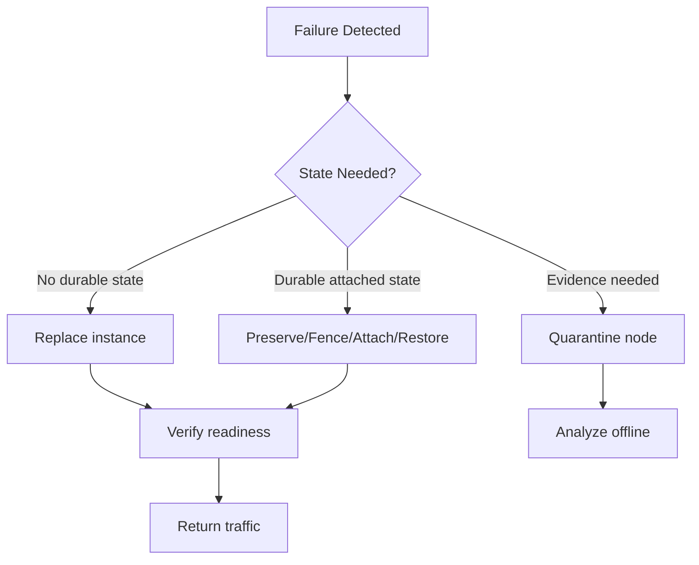
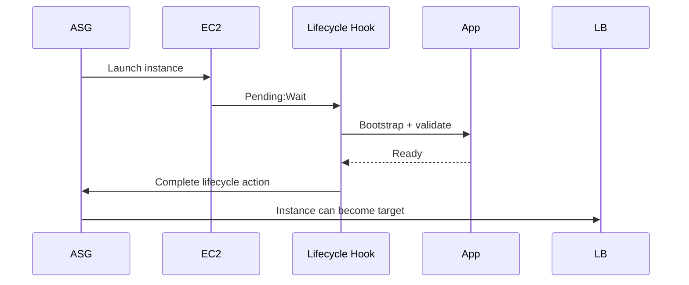
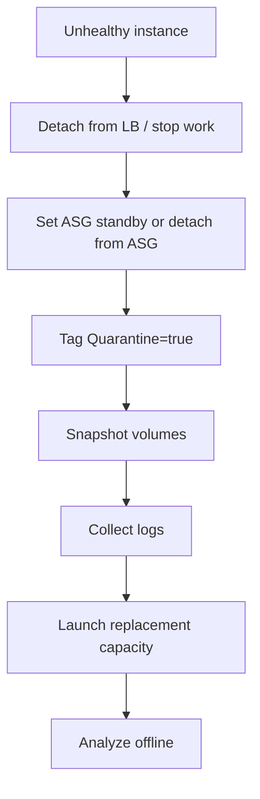
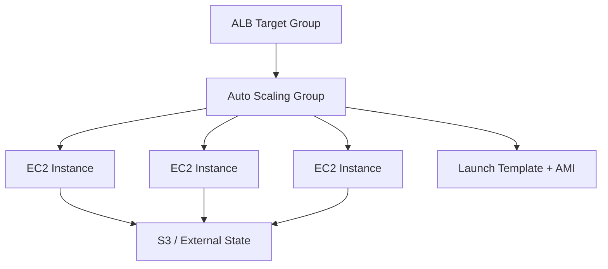
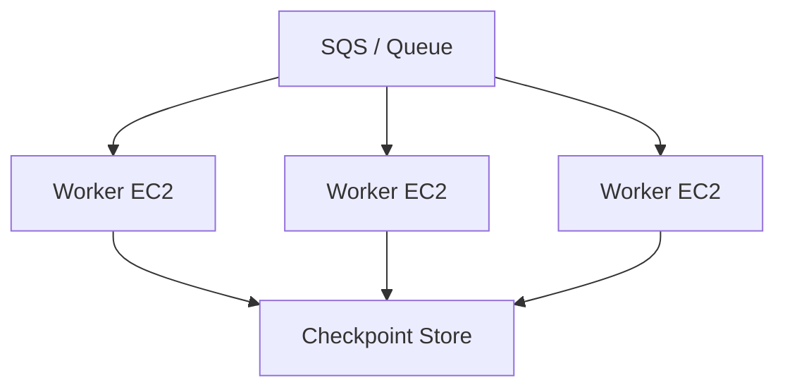
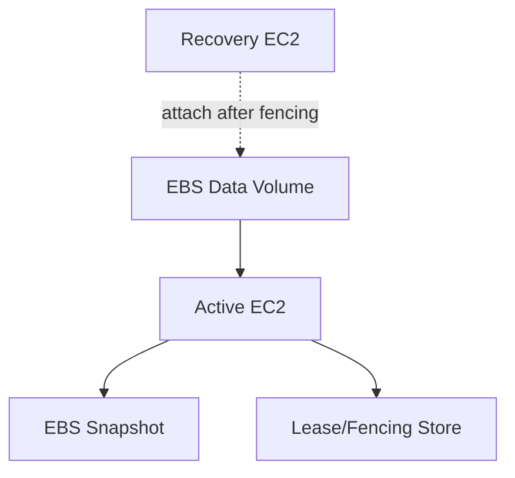

# Part 016 — EC2 Failure Recovery and Rebuildability

A production EC2 instance should be important while serving traffic and disposable when unhealthy.

That sentence is easy to say and hard to implement.

Because real fleets accumulate hidden state:

```txt
local logs
temporary files
manual patches
attached EBS volumes
cached credentials
runtime-generated config
warm caches
worker checkpoints
leader locks
in-flight requests
```

If your recovery strategy depends on fixing one broken machine by hand, you do not have an EC2 fleet. You have distributed pets.

This part teaches the production recovery model:

```txt
detect failure quickly
remove bad node from service
preserve only state that is intentionally durable
replace compute from known artifact
verify readiness before traffic
quarantine evidence when needed
make the fleet converge automatically
```

---

## 1. Problem yang Diselesaikan

EC2 failure recovery is not only about restarting instances.

It is about preserving service invariants under node loss.

| Failure | Bad Recovery | Production Recovery |
|---|---|---|
| app process dies | SSH and restart manually | systemd restart, health check, ASG replacement if needed |
| instance status check fails | wait and hope | alarm, reboot/recover/replace based on failure type |
| system status check fails | debug OS first | recover or replace, preserve evidence if needed |
| root volume corrupted | manually repair in place | replace from AMI, restore data only if contract requires |
| bad AMI rollout | patch nodes manually | rollback launch template and instance refresh |
| EBS data volume stuck | force attach blindly | follow ownership/fencing/recovery workflow |
| one AZ impaired | keep replacing in bad zone | shift traffic/capacity policy, preserve regional invariants |
| bootstrapping fails | rerun scripts manually | fail fast, terminate, fix image/config, relaunch |
| queue worker killed | lose in-flight job | visibility timeout/idempotent job/checkpoint |

The design target:

```txt
A single EC2 instance can disappear without requiring human creativity.
```

---

## 2. Mental Model

### 2.1 Replace Over Repair

For most stateless and horizontally scaled workloads:

```txt
repair instance < replace instance
```

Repair has problems:

```txt
slow
manual
non-repeatable
creates drift
keeps unknown state alive
hard to audit
```

Replacement is better when:

```txt
AMI is known
bootstrap is deterministic
state is externalized
health checks are correct
capacity exists
rollback is versioned
```

### 2.2 Recovery Has Three Paths



Most EC2 recovery mistakes happen when engineers confuse these paths.

Example:

```txt
A stateless API node fails.
```

Correct:

```txt
terminate and replace.
```

Wrong:

```txt
spend 90 minutes repairing one node while capacity is degraded.
```

Example:

```txt
A stateful node owns a data volume.
```

Correct:

```txt
fence old owner, preserve volume, attach to recovery node, verify application-level consistency.
```

Wrong:

```txt
ASG terminates node and deletes the only copy of state.
```

### 2.3 Instance Failure Is Multi-Layered

```txt
AWS physical host
Nitro/hypervisor path
EC2 instance lifecycle
OS/kernel
systemd
application process
runtime dependency
network attachment
storage attachment
application readiness
```

A useful recovery system identifies the layer quickly.

---

## 3. EC2 Status Checks

EC2 status checks are foundational because they separate some infrastructure failures from instance-level failures.

Conceptually:

| Check | Meaning |
|---|---|
| System status check | AWS infrastructure hosting the instance may have a problem |
| Instance status check | instance/OS configuration or software may have a problem |

Practical interpretation:

```txt
System status failed -> host/network/power/hardware-like issue; recovery/replacement often appropriate.
Instance status failed -> OS/kernel/network config/boot/app-level issue; reboot may help, but replacement may still be better for fleets.
```

Do not treat all failed checks the same.

### 3.1 Recovery Action Matrix

| Condition | Typical First Action | Fleet Strategy |
|---|---|---|
| app health fails, EC2 checks pass | remove from LB, restart app or replace | ASG/target group health replacement |
| instance status check fails | reboot or replace | replace if stateless; quarantine if evidence needed |
| system status check fails | recover/stop-start/replace | replace or EC2 automatic recovery if singleton-like |
| both fail | preserve evidence only if needed, otherwise replace | ASG replacement |
| boot loop after rollout | rollback launch template/AMI | stop rollout, replace bad version |
| repeated failures across AZ | suspect AZ dependency/capacity | shift/limit placement, investigate regional pattern |

---

## 4. Health Checks: Infrastructure vs Application

EC2 status checks are not enough.

A node can pass EC2 checks while the application is broken.

Application health must test the service contract:

```txt
process alive
listening socket open
critical config loaded
dependencies reachable or intentionally degraded
storage mounted
thread pools not exhausted
readiness endpoint responds within threshold
```

### 4.1 Liveness vs Readiness

Bad health check:

```http
GET /health -> 200 if process is alive
```

Better split:

```txt
/livez    -> process can answer simple request
/readyz   -> safe to receive production traffic
/startupz -> bootstrap completed
```

For EC2 behind ALB, target group health should reflect readiness, not mere liveness.

### 4.2 Stateful Health

If the app depends on a mounted data volume:

```txt
health should fail if volume is missing or mounted read-only unexpectedly
```

If the app depends on local scratch only:

```txt
health may pass after scratch is recreated
```

The health check must understand the storage contract.

---

## 5. Auto Scaling Group Replacement Model

Auto Scaling Groups are the main EC2 fleet recovery primitive.

Important behavior:

```txt
ASG maintains desired capacity.
If an InService instance is unhealthy, ASG can terminate and replace it.
New instances launch from current ASG/Launch Template settings.
```

### 5.1 Desired Capacity Is a Reliability Contract

If desired capacity is 6, the fleet controller tries to keep 6 instances.

But this only works if:

```txt
subnets have IP capacity
quotas allow new instances
launch template works
AMI boots
user data succeeds
target group health is correct
capacity is available for selected instance types
```

Otherwise replacement loops fail.

### 5.2 ASG Is Not a Stateful Failover System by Default

ASG can replace compute.

It does not automatically understand:

```txt
which EBS data volume belongs to which logical shard
whether old owner is fenced
whether the application data is consistent
which node should become leader
```

If you run stateful EC2, you must add state ownership logic.

### 5.3 Health Check Grace Period

Grace period prevents premature replacement while instances initialize.

Too short:

```txt
healthy-but-slow-booting nodes killed repeatedly
```

Too long:

```txt
bad nodes stay in service too long
```

Better approach:

```txt
use lifecycle hooks for initialization
mark instance InService only when bootstrap/readiness is complete
keep health grace period tight and intentional
```

---

## 6. Lifecycle Hooks for Recovery Safety

Lifecycle hooks allow custom action during launch or termination.

### 6.1 Launch Hook

Launch hook can perform:

```txt
config fetch
volume attach/mount
warm cache
register with service discovery
run validation script
only then continue lifecycle
```



### 6.2 Termination Hook

Termination hook can perform:

```txt
drain load balancer
stop accepting new work
checkpoint worker state
flush logs/metrics
detach or snapshot data volume
notify cluster membership
```

For stateless API nodes, termination hook may be simple.

For queue workers or stateful nodes, termination hook is often mandatory.

### 6.3 Timeout Discipline

A lifecycle hook is not an infinite grace period.

If shutdown cannot complete within the hook timeout, the workload's state model is incomplete.

---

## 7. Boot Failure Recovery

Boot failure is a common EC2 recovery problem.

Causes:

```txt
bad AMI
broken kernel/initramfs
bad fstab entry
missing EBS volume
cloud-init/user data hang
network dependency during boot
package repo unavailable
IAM role permission failure
wrong architecture image
bad systemd unit dependency
full root volume
```

### 7.1 Boot Contract

Every EC2 workload should define:

```txt
what must happen before service starts
what may happen after service starts
what external systems are allowed during boot
what timeout fails the node
what logs prove bootstrap progress
```

Bad boot contract:

```txt
install packages from internet during production boot
run database migrations during every node boot
fetch secret without timeout
silently continue after mount failure
```

Better boot contract:

```txt
AMI contains heavy dependencies
user data only binds environment-specific config
mounts are explicit
bootstrap is idempotent
timeouts are bounded
failure terminates/replaces node
```

### 7.2 Debug Boot Failure

Commands and evidence:

```txt
EC2 system log
console screenshot
cloud-init logs
serial console if enabled
/var/log/messages or journal
systemd failed units
```

On a reachable node:

```bash
sudo cloud-init status --long
sudo journalctl -b -p warning
sudo systemctl --failed
sudo journalctl -u cloud-final --no-pager
```

If unreachable:

```txt
stop instance
detach root volume
attach to rescue instance
inspect logs and fstab
fix or snapshot for forensic analysis
replace production node from known good AMI
```

For fleets, debugging should happen on a quarantined copy, not by keeping bad nodes in service.

---

## 8. Node Quarantine

Sometimes you should not immediately terminate.

Quarantine is useful when:

```txt
security investigation required
unknown data corruption
kernel panic evidence needed
rare bug reproducibility
incident root-cause requires local logs
stateful recovery requires volume preservation
```

Quarantine means:

```txt
remove from traffic
prevent new work
preserve instance/volume/snapshot/logs
block accidental termination
capture evidence
replace capacity separately
```

### 8.1 Quarantine Pattern



### 8.2 Tagging

Use explicit tags:

```txt
Quarantine=true
IncidentId=INC-2026-07-06-001
DoNotTerminateUntil=2026-07-08
Owner=platform
Reason=kernel-panic-investigation
```

Do not rely on chat messages or tribal memory.

### 8.3 ASG Interaction

If an instance remains in an ASG and unhealthy, ASG may terminate it.

Options:

```txt
put instance in Standby
remove from load balancer
detach from ASG with or without decrementing desired capacity
increase desired capacity to launch replacement first
```

Choose based on capacity and evidence requirements.

---

## 9. Rebuildability Design

An instance is rebuildable when no required state exists only on that instance.

### 9.1 Rebuildability Checklist

```txt
[ ] AMI is versioned and reproducible.
[ ] Launch Template version is tracked.
[ ] User data is idempotent.
[ ] Secrets are fetched from managed source, not stored manually.
[ ] Config is environment-scoped and versioned.
[ ] App artifact is immutable.
[ ] Local data is disposable or checkpointed.
[ ] Logs are shipped off-node.
[ ] Metrics/traces are shipped off-node.
[ ] Health checks prove readiness.
[ ] Replacement capacity can launch under quota/capacity constraints.
[ ] Rollback path exists.
```

### 9.2 Rebuild Time Budget

Define an explicit rebuild SLO:

```txt
Instance launch to ready: <= 5 minutes
ASG replacement after unhealthy: <= 8 minutes
Full AZ capacity restoration: <= 20 minutes
```

Measure:

```txt
launch time
cloud-init time
artifact download time
dependency initialization time
target group healthy time
warmup time
```

If boot takes 30 minutes because it compiles assets or downloads large datasets, you do not have elastic compute. You have slow provisioning.

---

## 10. Stateful EC2 Recovery

Stateful EC2 is sometimes valid.

Examples:

```txt
self-managed database
legacy application with local data
single-writer volume processing
licensed software tied to host/volume
low-level storage appliance
```

But it requires explicit ownership.

### 10.1 State Ownership Contract

For every durable volume:

```txt
logical owner
current attached instance
AZ
filesystem/application consistency model
snapshot policy
restore policy
failover policy
fencing mechanism
delete-on-termination setting
```

Bad stateful design:

```txt
ASG node has EBS data volume.
No one knows if delete-on-termination is false.
No fencing.
No snapshot restore test.
```

Better design:

```txt
logical node identity is separate from EC2 instance identity.
Data volume has tags and backup policy.
Old owner is fenced before attach.
New node validates data before serving.
```

### 10.2 Fencing

Before attaching a data volume to a new instance, ensure old writer cannot still write.

Fencing options:

```txt
terminate old instance
stop old instance
detach volume only after old instance is unreachable and ownership is clear
application-level lease with timeout
cluster manager fencing mechanism
```

Without fencing, you risk split brain or filesystem corruption.

### 10.3 Snapshot Before Risky Recovery

Before repairing a damaged stateful volume:

```txt
snapshot first
copy evidence
then attempt repair
```

Never make the only copy worse.

---

## 11. Bad AMI and Bad Launch Template Recovery

Bad rollout pattern:

```txt
new Launch Template version points to bad AMI
ASG instance refresh starts
new instances fail health
old instances are terminated too aggressively
capacity drops
```

### 11.1 Preventive Controls

```txt
bake AMI with tests
launch canary ASG
validate systemd, mounts, app readiness
use instance refresh with minimum healthy percentage
keep previous Launch Template version
alarm on replacement failures
```

### 11.2 Recovery Steps

```txt
1. Pause instance refresh if active.
2. Set ASG Launch Template version back to last known good.
3. Ensure desired capacity and min healthy capacity are safe.
4. Terminate bad new instances gradually or start rollback refresh.
5. Preserve one bad node for evidence if needed.
6. Fix AMI pipeline or bootstrap config.
7. Re-run canary before retrying rollout.
```

### 11.3 Bad User Data

Bad user data can be worse than bad AMI because it can break only one environment.

Examples:

```txt
wrong S3 path
missing IAM permission
region-specific package mirror
secret name mismatch
mount target DNS failure
```

Recovery:

```txt
fix Launch Template user data/config
create new version
replace failed nodes
avoid manually editing user data on instances
```

---

## 12. Automatic Instance Recovery vs ASG Replacement

EC2 automatic recovery can restore an impaired instance when underlying hardware/software failures occur.

This is useful for:

```txt
singleton-like instances
stateful instances where preserving instance identity matters
legacy workloads not yet rebuildable
```

But for horizontally scaled stateless fleets, ASG replacement is often cleaner.

| Pattern | Best Fit |
|---|---|
| EC2 automatic recovery | singleton/stateful/identity-sensitive instance |
| ASG replacement | stateless fleet, replaceable compute |
| reboot alarm | instance status/software-like failure where reboot is acceptable |
| stop/start | manual recovery or host migration for EBS-backed instance |
| terminate/replace | default for rebuildable fleet nodes |

Production stance:

```txt
Prefer replacement for fleets.
Use automatic recovery deliberately for instances whose identity/state must survive.
```

---

## 13. Incident Runbooks

### 13.1 Stateless API Instance Unhealthy

```txt
Goal: restore capacity, not save the node.
```

Steps:

```txt
1. Confirm fleet has enough healthy capacity.
2. Remove instance from traffic or let target group mark unhealthy.
3. Check if issue is isolated or fleet-wide.
4. If isolated, terminate/replace instance.
5. If fleet-wide, stop rollout and inspect recent AMI/config/deploy.
6. Preserve one node only if root cause evidence is needed.
7. Verify ASG launches replacement and target becomes healthy.
8. Document cause and add detection/prevention.
```

### 13.2 Instance Status Check Failed

```txt
1. Check whether this is isolated or many nodes.
2. Retrieve system log/console evidence if needed.
3. For stateless node: replace.
4. For singleton: reboot or recover based on policy.
5. For stateful node: snapshot/preserve volumes before repair.
6. Verify replacement or recovery through readiness check.
```

### 13.3 System Status Check Failed

```txt
1. Treat as infrastructure/host-level impairment.
2. For fleet node: replace.
3. For singleton: use recover/stop-start if supported and safe.
4. Preserve EBS-backed data as required.
5. Check whether AZ or instance family pattern exists.
```

### 13.4 Boot Loop After Deployment

```txt
1. Stop rollout/instance refresh.
2. Roll ASG back to previous Launch Template version.
3. Launch one test instance with bad version in isolated subnet if needed.
4. Inspect cloud-init, systemd, fstab, app logs.
5. Fix image/config pipeline.
6. Re-run canary.
```

### 13.5 Data Volume Attach Failure

```txt
1. Confirm volume and target instance are in same AZ.
2. Confirm volume state is available/in-use as expected.
3. Confirm old owner is stopped/terminated/fenced.
4. Snapshot before repair if data integrity is uncertain.
5. Attach using known device mapping.
6. Mount by UUID/label.
7. Run application-level consistency check.
8. Only then serve traffic.
```

### 13.6 Root Volume Full

```txt
1. Remove from traffic if service is degraded.
2. Identify top disk consumers.
3. Check deleted-but-open files.
4. Free minimal space for safe operation.
5. Replace node if stateless.
6. Fix logging/temp/cache policy in AMI/config.
7. Add disk/inode alarms if missing.
```

---

## 14. Recovery Architecture Patterns

### 14.1 Stateless Web/API Fleet



Recovery invariant:

```txt
any instance can be terminated at any time
```

Required:

```txt
external sessions/state
idempotent startup
readiness health
logs/metrics off-node
capacity headroom
```

### 14.2 Queue Worker Fleet



Recovery invariant:

```txt
job can be retried safely
```

Required:

```txt
visibility timeout > max processing window or heartbeat extension
idempotent writes
partial progress checkpoints
termination drain
DLQ/poison handling
```

### 14.3 Stateful Single-Writer Node



Recovery invariant:

```txt
only one writer owns the volume
```

Required:

```txt
fencing
snapshot
AZ-aware recovery
application consistency check
manual or automated runbook
```

---

## 15. Capacity During Recovery

Replacement only works if capacity is available.

Failure modes:

```txt
subnet IP exhaustion
EC2 quota reached
Spot capacity unavailable
single instance type unavailable
Launch Template invalid
IAM instance profile broken
security group rule missing
AMI deleted/deprecated
KMS key denied for encrypted EBS
```

Recovery capacity checklist:

```txt
[ ] ASG spans multiple subnets/AZs where appropriate.
[ ] Mixed instance policy exists for flexible fleets.
[ ] Quotas cover failure replacement and deployments.
[ ] Subnet free IP addresses are monitored.
[ ] AMI/KMS/IAM dependencies are validated.
[ ] On-Demand fallback exists for critical workloads.
[ ] Warm pool or pre-baked AMI exists if startup is slow.
```

A fleet that cannot launch replacements during an incident is not resilient, even if its runbook is perfect.

---

## 16. Rebuildability Testing

Do not assume rebuildability. Test it.

### 16.1 Game Day Scenarios

```txt
terminate one random instance
terminate 30% of fleet
break one AZ subnet path
roll out bad AMI to canary
fill root disk
detach non-critical data volume
simulate slow boot dependency
revoke temporary IAM permission in test
interrupt Spot instances
```

### 16.2 Success Criteria

```txt
service remains within SLO or degrades predictably
replacement launches automatically
bad nodes leave traffic
alerts fire once with useful context
runbook steps are clear
no manual SSH required for stateless fleet
stateful recovery does not corrupt data
```

### 16.3 Measure Recovery

```txt
MTTD: time to detect
MTTA: time to acknowledge
MTTR: time to restore
launch-to-ready time
unhealthy-to-removed time
removed-to-replaced time
capacity deficit duration
customer-visible error budget impact
```

---

## 17. Terraform Skeleton: Rebuildable ASG

This is intentionally incomplete but shows the shape.

```hcl
resource "aws_launch_template" "api" {
  name_prefix   = "api-"
  image_id      = var.ami_id
  instance_type = var.instance_type

  iam_instance_profile {
    name = aws_iam_instance_profile.api.name
  }

  metadata_options {
    http_endpoint               = "enabled"
    http_tokens                 = "required"
    http_put_response_hop_limit = 1
  }

  user_data = base64encode(templatefile("${path.module}/user-data.sh", {
    environment = var.environment
    app_version = var.app_version
  }))

  block_device_mappings {
    device_name = "/dev/xvda"
    ebs {
      volume_size           = 30
      volume_type           = "gp3"
      encrypted             = true
      delete_on_termination = true
    }
  }

  tag_specifications {
    resource_type = "instance"
    tags = {
      Service = "api"
      Managed = "terraform"
    }
  }
}

resource "aws_autoscaling_group" "api" {
  name                = "api-${var.environment}"
  min_size            = 3
  max_size            = 12
  desired_capacity    = 3
  vpc_zone_identifier = var.private_subnet_ids
  health_check_type   = "ELB"
  health_check_grace_period = 120

  launch_template {
    id      = aws_launch_template.api.id
    version = aws_launch_template.api.latest_version
  }

  target_group_arns = [aws_lb_target_group.api.arn]

  tag {
    key                 = "Service"
    value               = "api"
    propagate_at_launch = true
  }
}
```

Important omissions to add in real production:

```txt
mixed instance policy
instance refresh policy
lifecycle hooks
CloudWatch alarms
capacity rebalance for Spot
SSM access
IAM least privilege
KMS key policy
subnet IP monitoring
```

---

## 18. Common Mistakes

| Mistake | Why It Hurts |
|---|---|
| repairing stateless nodes by SSH | slow, drift-prone, distracts from fleet recovery |
| no clear state ownership | replacement can destroy or orphan data |
| health checks test only process alive | broken nodes keep serving traffic |
| health grace period too long | bad nodes remain too long |
| health grace period too short | slow but healthy nodes get killed |
| no previous Launch Template rollback | bad AMI rollout becomes prolonged outage |
| deleting quarantined evidence | root cause becomes guesswork |
| assuming ASG handles state | ASG replaces compute, not application ownership |
| untested snapshot restore | backup exists but recovery is unknown |
| no capacity fallback | replacement fails during real incident |
| root volume stores important data | replacement loses hidden state |
| manual hotfixes not baked into AMI | next replacement reintroduces old bug |

---

## 19. Production Checklist

### Fleet Rebuildability

```txt
[ ] Instance can be terminated safely.
[ ] AMI is reproducible.
[ ] Launch Template is versioned.
[ ] User data is idempotent.
[ ] Health checks represent readiness.
[ ] Logs and metrics are off-node.
[ ] Secrets are not stored manually on disk.
[ ] Root volume contains no required state.
[ ] Data volume lifecycle is explicit.
[ ] ASG replacement has been tested.
```

### Recovery Control

```txt
[ ] Status check alarms exist.
[ ] Target group health alarms exist.
[ ] ASG failed launch alarms exist.
[ ] Instance refresh rollback process exists.
[ ] Quarantine process exists.
[ ] Stateful fencing process exists if needed.
[ ] Snapshot-before-repair rule is documented.
[ ] Subnet IP and EC2 quota headroom are monitored.
[ ] On-call can distinguish repair/replace/quarantine paths.
```

### Incident Evidence

```txt
[ ] cloud-init logs preserved.
[ ] systemd journal accessible.
[ ] application logs shipped.
[ ] kernel/OOM/panic logs captured.
[ ] EBS snapshots tagged with incident ID.
[ ] instance metadata tags include service/version/owner.
```

---

## 20. Mini Case Study: Bad AMI Rollout

### Context

A service runs on an ASG with 12 instances behind an ALB.

A new AMI is released with a systemd dependency bug.

Symptoms:

```txt
new instances launch
app never starts
target group health fails
ASG keeps replacing nodes
capacity drops from 12 healthy to 7 healthy
p99 latency rises
```

### Weak Response

```txt
SSH into failed instances.
Try restarting services.
Patch systemd unit manually.
Let ASG continue replacing.
```

This is weak because the fleet controller keeps launching the bad version.

### Strong Response

```txt
1. Pause instance refresh.
2. Roll Launch Template to previous known-good version.
3. Ensure desired capacity remains safe.
4. Replace failed nodes from known-good AMI.
5. Quarantine one failed node for evidence.
6. Inspect cloud-init/systemd logs offline.
7. Fix AMI pipeline test to catch missing dependency.
8. Re-run canary before broad rollout.
```

### Lesson

The root control point was not the broken node.

The root control point was the versioned launch contract.

---

## 21. Mini Case Study: Stateful Worker With EBS Data Volume

### Context

A worker processes large files on an attached EBS volume.

The instance becomes unreachable.

The volume contains partial output and checkpoint state.

### Bad Recovery

```txt
Force detach volume.
Attach to new instance.
Start worker immediately.
```

Risk:

```txt
old node may still write
filesystem may be inconsistent
partial checkpoint may be corrupt
duplicate output may be produced
```

### Better Recovery

```txt
1. Stop or terminate old instance if possible.
2. Confirm old writer is fenced.
3. Snapshot the data volume.
4. Attach to recovery instance in same AZ.
5. Mount safely.
6. Run filesystem/application consistency checks.
7. Resume from checkpoint only if valid.
8. Write idempotently to final output store.
```

### Lesson

Stateful recovery is not instance recovery.

It is ownership recovery.

---

## 22. Summary

EC2 failure recovery is a design discipline.

The core principles:

```txt
Prefer replace over repair for stateless fleets.
Separate repair, replacement, and quarantine paths.
Treat health checks as service contracts.
Use ASG to converge capacity, not to magically understand application state.
Use lifecycle hooks to make launch and termination safe.
Make boot deterministic and bounded.
Version AMI and Launch Template changes.
Fence stateful ownership before moving volumes.
Test rebuildability with game days.
```

A mature EC2 platform does not avoid instance failure.

It makes instance failure boring.

---

## 23. References

- Amazon EC2 User Guide — Status checks for instances: https://docs.aws.amazon.com/AWSEC2/latest/UserGuide/monitoring-system-instance-status-check.html
- Amazon EC2 User Guide — Troubleshoot instances with failed status checks: https://docs.aws.amazon.com/AWSEC2/latest/UserGuide/TroubleshootingInstances.html
- Amazon EC2 User Guide — Automatic instance recovery: https://docs.aws.amazon.com/AWSEC2/latest/UserGuide/ec2-instance-recover.html
- Amazon EC2 User Guide — Alarm actions to stop, terminate, reboot, or recover an instance: https://docs.aws.amazon.com/AWSEC2/latest/UserGuide/UsingAlarmActions.html
- Amazon EC2 Auto Scaling User Guide — What is Amazon EC2 Auto Scaling: https://docs.aws.amazon.com/autoscaling/ec2/userguide/what-is-amazon-ec2-auto-scaling.html
- Amazon EC2 Auto Scaling User Guide — Health checks for instances in an Auto Scaling group: https://docs.aws.amazon.com/autoscaling/ec2/userguide/ec2-auto-scaling-health-checks.html
- Amazon EC2 Auto Scaling User Guide — Lifecycle hooks: https://docs.aws.amazon.com/autoscaling/ec2/userguide/lifecycle-hooks.html
- Amazon EC2 Auto Scaling User Guide — Replace unhealthy instances: https://docs.aws.amazon.com/autoscaling/ec2/userguide/replace-unhealthy-instance.html
- Amazon EC2 Auto Scaling User Guide — Instance lifecycle: https://docs.aws.amazon.com/autoscaling/ec2/userguide/ec2-auto-scaling-lifecycle.html
