# Part 017 — EC2 Stateful vs Stateless Patterns

> Most EC2 incidents become hard not because EC2 failed, but because the application was unclear about where state lives.

A production EC2 design starts with one question:

> **If this instance disappears right now, what exactly is lost?**

If the answer is "nothing important", you have a stateless instance.

If the answer is "a queue item, cache entry, in-memory session, local file, database page, partially uploaded document, leader lease, or transaction log", you have state. That is not automatically wrong. It only means the state needs a contract.

This part is about designing that contract.

AWS EC2 gives you several storage and lifecycle primitives:

- EC2 instances provide scalable virtual compute.
- Amazon EBS provides durable block volumes that can persist independently from an EC2 instance.
- Instance store provides temporary local block storage physically attached to the host.
- Auto Scaling groups replace instances according to health, capacity, and lifecycle state.
- Lifecycle hooks can pause instance launch or termination so custom actions can run.
- EBS root/data volumes, snapshots, AMIs, and block device mappings define how much state is coupled to instance lifecycle.

The trap is to treat all EC2 instances like "servers". In cloud production engineering, an EC2 instance is better treated as a **replaceable execution slot**. Whether that slot is stateless or stateful must be explicit.

---

## 1. Problem yang Diselesaikan

A common failure in EC2 systems is accidental statefulness.

Examples:

- API service stores user sessions on local disk.
- Background worker downloads a large file to `/tmp` and dies mid-processing.
- Application writes business files into the root volume.
- Single EC2 instance runs a critical scheduler without leader election.
- Auto Scaling Group terminates a node that still owns work.
- Spot instance is used for a stateful workload without checkpointing.
- EBS volume is marked `DeleteOnTermination = true` accidentally.
- "Temporary" local cache becomes part of correctness.
- Ops team snapshots volumes but never tests application-consistent restore.
- Instance replacement succeeds, but the service starts with empty local state.

The result is usually one of these production failures:

1. data loss,
2. duplicate processing,
3. stuck workflow,
4. slow recovery,
5. manual snowflake repair,
6. hidden dependency on one host,
7. unsafe autoscaling,
8. false confidence from backups.

This part gives a practical model for deciding:

- when EC2 should be stateless,
- when stateful EC2 is acceptable,
- how to attach state safely,
- how to recover state after instance replacement,
- how to avoid "almost stateless" systems,
- how to design runbooks around lifecycle events.

---

## 2. Mental Model

An EC2 instance can be modeled as:

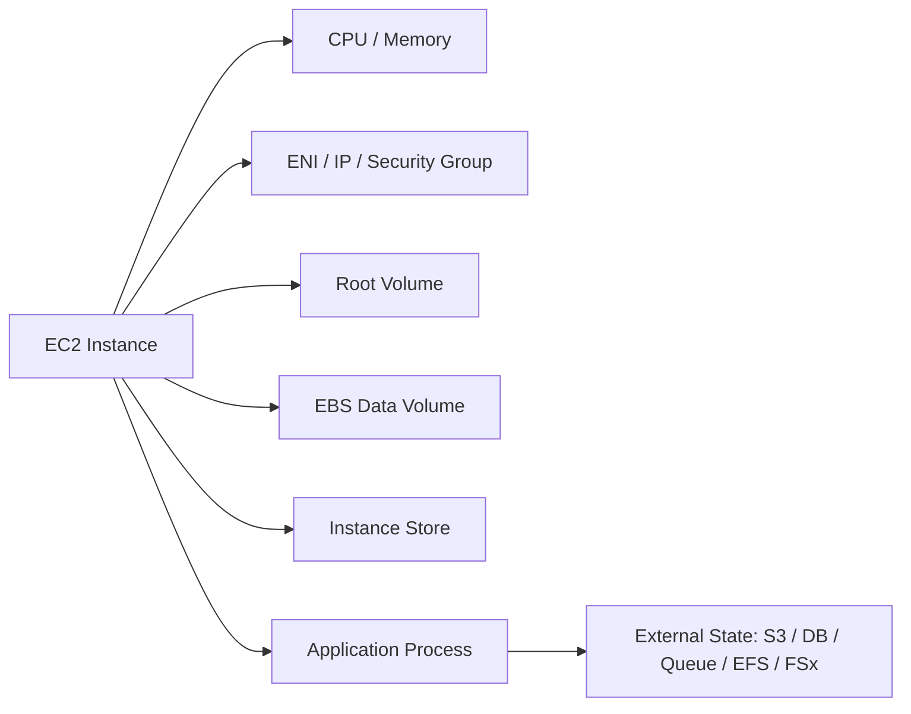

But production ownership is not about the diagram. It is about **what must survive replacement**.

Use this model:

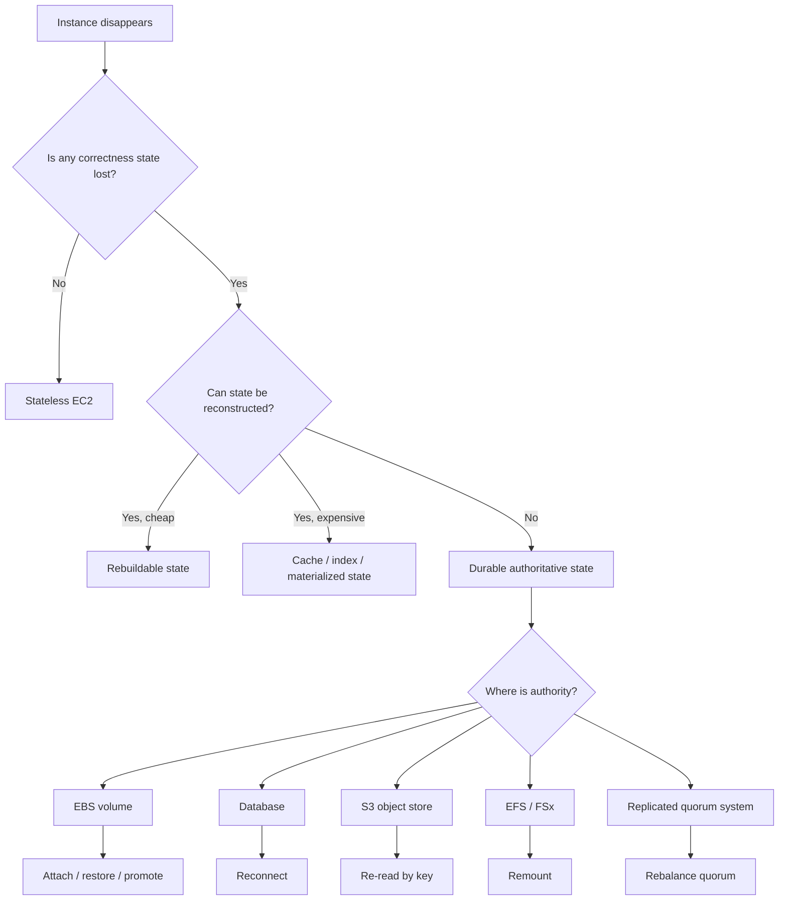

The key distinction:

| Type | Meaning | Recovery expectation |
|---|---|---|
| Stateless | Instance owns no correctness state | Replace freely |
| Rebuildable state | State can be regenerated from source of truth | Replace, then rebuild |
| Cached state | State improves performance but is not authoritative | Replace, warm cache |
| Ephemeral processing state | In-flight work exists but can be retried | Replace, retry idempotently |
| Durable local state | Instance owns authoritative state | Replace requires state transfer/reattach/restore |
| Replicated state | Instance owns a shard/replica/partition | Replace requires membership/rebalance/quorum logic |

The mistake is to call something stateless because "we do not store a database there", while still depending on local files, memory, cache, locks, or unfinished jobs.

---

## 3. Core Concepts

### 3.1 Stateless EC2

A stateless EC2 instance has these properties:

- It can be terminated without data loss.
- It can be replaced by an instance launched from the same Launch Template.
- It does not require manual recovery.
- It can serve traffic after bootstrapping.
- Local memory/disk contents are not part of correctness.
- User identity/session state is externalized.
- In-flight requests can retry safely.
- Deployment can roll forward or back through fleet replacement.

Typical examples:

- API server behind ALB/NLB.
- Web server serving immutable assets from S3 or artifact store.
- Stateless microservice using RDS/DynamoDB/S3/SQS externally.
- Worker consuming queue messages with visibility timeout and idempotency.
- ECS/EKS worker node without local persistent workload state.
- Batch runner that checkpoints to S3/EFS/DB.

Stateless does **not** mean "no disk writes". It means local disk writes are not authoritative.

A stateless instance may still write:

- logs before shipping,
- temp files,
- local cache,
- decompressed artifacts,
- package manager cache,
- JIT/compiler cache,
- short-lived working files.

The contract is:

> If it disappears, correctness is preserved.

---

### 3.2 Stateful EC2

A stateful EC2 instance owns state that matters.

Examples:

- single-node database,
- legacy application with local file repository,
- queue broker with local durable log,
- search node with shard data,
- distributed storage node,
- build cache node where loss is expensive,
- scheduler/leader with local checkpoint,
- on-prem migrated server pattern,
- commercial software tied to local block device,
- low-latency service using local NVMe plus replication.

Stateful EC2 is not forbidden. It is just more expensive operationally.

You need explicit answers to:

- What is the source of truth?
- Is the state zonal, regional, or global?
- Is the state stored on EBS, instance store, S3, EFS, FSx, or remote DB?
- How is state backed up?
- How is state restored?
- Can another instance attach the data?
- Is the attachment safe while the old instance might still be running?
- What happens if the instance is terminated by Auto Scaling?
- What happens during AZ failure?
- What is RPO?
- What is RTO?
- What is the split-brain prevention mechanism?
- What is the application-consistency point?

The stateful EC2 invariant:

> Compute can be replaced, but state ownership must be transferred deliberately.

---

## 4. Storage Lifecycle Matrix

| Storage location | Survives reboot | Survives stop/start | Survives termination | Typical use |
|---|---:|---:|---:|---|
| Memory | No | No | No | runtime state only |
| Root EBS with delete on termination | Yes | Yes | No | OS/application image |
| Root EBS retained | Yes | Yes | Yes, if configured | forensic recovery, snowflake risk |
| Data EBS retained | Yes | Yes | Yes | durable block state |
| Instance store | Usually survives reboot, but not stop/terminate/host failure | No | No | cache, scratch, replicated temp |
| S3 | Yes | Yes | Yes | object/source-of-truth data |
| EFS/FSx | Yes | Yes | Yes | shared file state |
| External DB | Yes | Yes | Yes | authoritative records |

Important: instance store is excellent for temporary high-performance local storage, but it is not durable state. If an instance stops, terminates, or the underlying disk fails, data can be lost. Use it for cache, scratch, replicated temp data, or rebuildable data — not as a sole source of truth.

---

## 5. Pattern 1 — Pure Stateless Fleet

Use this for web/API services where all durable state is external.

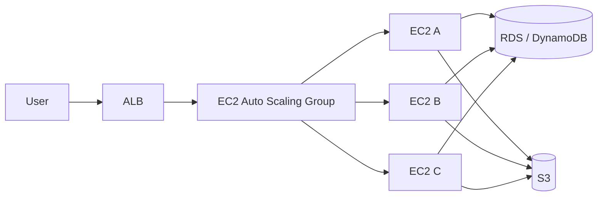

### Design contract

- Root volume is disposable.
- Application config comes from parameter store/config service/environment.
- Session state is externalized.
- Logs/metrics/traces are shipped out.
- In-flight requests can retry.
- Deployment uses Launch Template version and ASG Instance Refresh.
- ALB health checks gate traffic.
- No instance is special.

### Implementation pattern

1. Build immutable AMI.
2. Launch via Launch Template.
3. Use ASG across at least two AZs.
4. Register with load balancer target group.
5. Use health checks.
6. On termination, deregister/drain.
7. Ship logs before shutdown if possible.
8. Recreate capacity through ASG.

### What can still go wrong

| Failure | Cause | Fix |
|---|---|---|
| Sticky local session | session stored in memory or local disk | move session to external store or make tokens stateless |
| Local file dependency | uploads written to root volume | write uploads to S3/EFS/FSx |
| Slow replacement | heavy bootstrapping | pre-bake AMI or use warm pools |
| Duplicate request side effect | retry without idempotency key | introduce idempotency store |
| Log loss | only local logs | ship logs continuously |
| Config drift | manual change on instance | immutable AMI + config source |

---

## 6. Pattern 2 — Stateless Compute with Ephemeral Work

This is common for background workers.

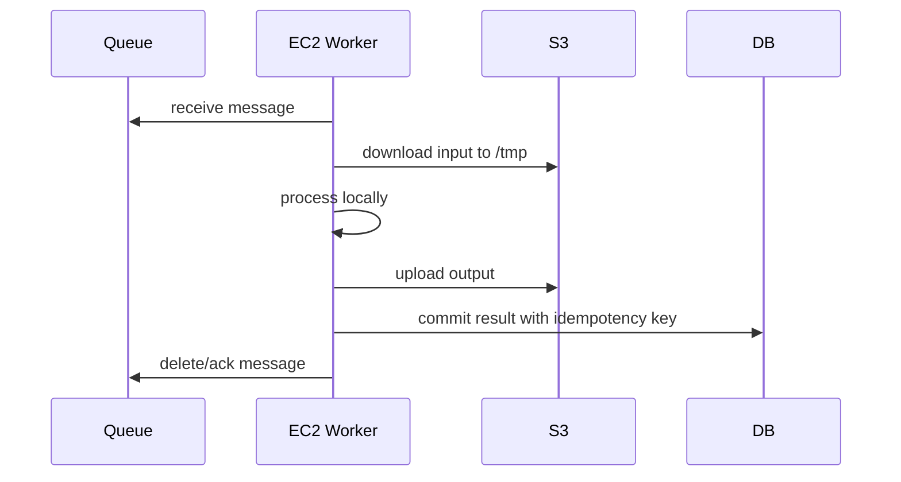

The instance uses local disk, but the authoritative state is external.

### Required invariants

- Queue visibility timeout exceeds processing attempt or is extended.
- Message processing is idempotent.
- Output write is atomic from application perspective.
- Partial output has temporary key/prefix.
- Completion marker is written last.
- Failed worker leaves work retryable.
- Local temp files are not authoritative.

### Safe object output pattern

Bad:

```text
s3://bucket/output/customer-123/report.csv
```

Worker writes directly to the final key. If it dies halfway, consumers may see partial output depending on write path and client behavior.

Better:

```text
s3://bucket/output/_tmp/job-789/report.csv
s3://bucket/output/customer-123/report.csv
s3://bucket/output/customer-123/_SUCCESS
```

The completion marker or manifest defines visibility.

### Worker shutdown contract

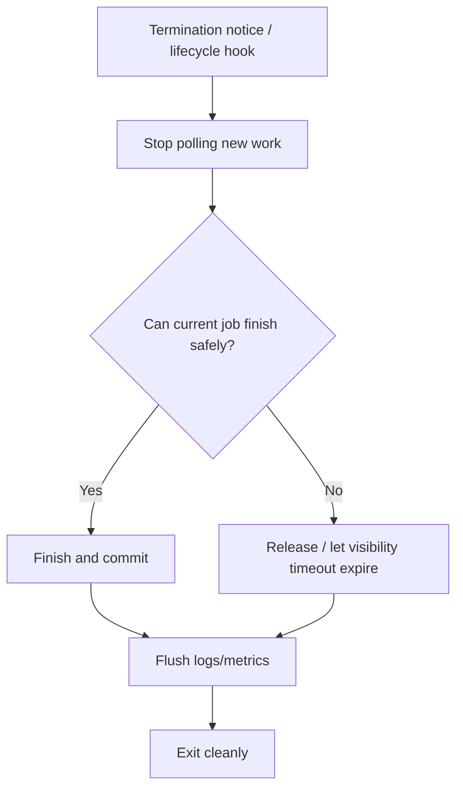

---

## 7. Pattern 3 — Stateful EC2 with EBS Data Volume

Use this for legacy or single-node stateful apps when managed alternatives are not yet possible.

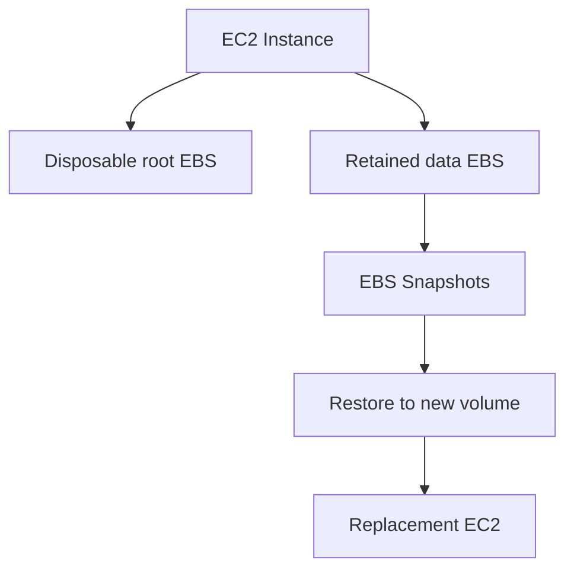

### Design contract

- Root volume is disposable.
- Data volume is separate.
- Data volume has `DeleteOnTermination = false`.
- Data volume is tagged with owner/application/environment.
- Snapshots are scheduled and restore-tested.
- Application flush/stop procedure is known.
- Only one writer attaches the volume unless the application explicitly supports multi-writer semantics.
- Recovery runbook knows how to detach/attach/mount/check filesystem.
- AZ dependency is explicit: EBS volume is zonal.

### Example block device mapping logic

| Volume | Delete on termination | Purpose |
|---|---:|---|
| root `/` | true | OS and application artifact |
| `/data` | false | application data |
| `/logs` | optional | local logs if required |
| `/backup-staging` | true | temp backup area |

### Terraform skeleton

```hcl
resource "aws_ebs_volume" "app_data" {
  availability_zone = var.az
  size              = 500
  type              = "gp3"
  encrypted         = true

  tags = {
    Name        = "ledger-app-data"
    Application = "ledger"
    Role        = "authoritative-data"
    Environment = var.environment
    ManagedBy   = "terraform"
  }
}

resource "aws_volume_attachment" "app_data" {
  device_name = "/dev/sdf"
  volume_id   = aws_ebs_volume.app_data.id
  instance_id = aws_instance.app.id
}

resource "aws_instance" "app" {
  ami                         = var.ami_id
  instance_type               = "m7i.large"
  subnet_id                   = var.subnet_id
  iam_instance_profile        = aws_iam_instance_profile.app.name
  associate_public_ip_address = false

  root_block_device {
    volume_type           = "gp3"
    volume_size           = 50
    encrypted             = true
    delete_on_termination = true
  }

  metadata_options {
    http_tokens = "required"
  }

  user_data = file("${path.module}/bootstrap.sh")

  tags = {
    Name        = "ledger-app"
    Application = "ledger"
    StateModel  = "stateful-ebs"
  }
}
```

### Mount script pattern

```bash
#!/usr/bin/env bash
set -euo pipefail

DEVICE="/dev/nvme1n1"
MOUNT="/data"

mkdir -p "$MOUNT"

if ! blkid "$DEVICE"; then
  echo "No filesystem found on $DEVICE; refusing to format automatically"
  exit 1
fi

grep -q "$MOUNT" /etc/fstab || \
  echo "UUID=$(blkid -s UUID -o value "$DEVICE") $MOUNT xfs defaults,nofail 0 2" >> /etc/fstab

mount "$MOUNT"

chown app:app "$MOUNT"
systemctl start ledger-app
```

Notice the script refuses to auto-format an unknown data disk. Auto-format is fine for scratch disks. It is dangerous for authoritative volumes.

---

## 8. Pattern 4 — Stateful EC2 with ASG and Volume Handoff

This is harder. Use it only when there is a good reason.

Problem: Auto Scaling Groups are designed to replace instances. EBS volumes are zonal and can be attached to only compatible instances in the same AZ. A naive ASG replacement may terminate the instance and delete/abandon state incorrectly.

A safer model:

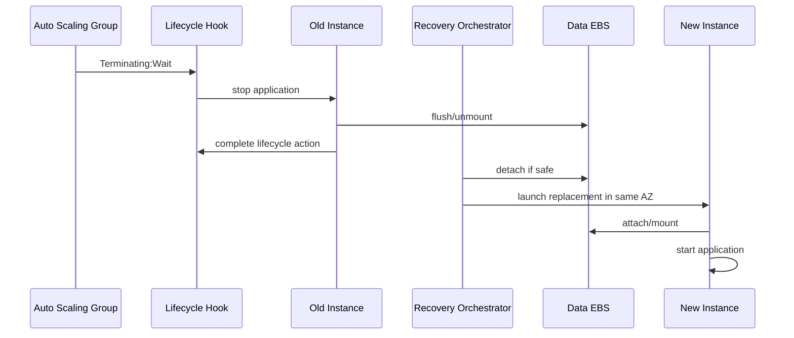

### Required components

- Lifecycle hook for termination.
- Lifecycle hook or boot gate for launch.
- Orchestrator Lambda/Step Function/SSM Automation.
- Volume ownership record.
- Fencing mechanism.
- Attach/mount validation.
- Application-level lock or lease.
- Snapshot/restore fallback.
- Manual break-glass runbook.

### Ownership record example

Use DynamoDB or a small control table:

| Key | Value |
|---|---|
| service | `ledger` |
| volume_id | `vol-...` |
| owner_instance_id | `i-...` |
| owner_az | `ap-southeast-1a` |
| generation | `42` |
| state | `attached` |
| last_heartbeat | timestamp |

The generation number prevents stale owners from reacquiring state.

### Fencing principle

Never rely only on "I think the old instance died".

Before attaching state to a replacement:

1. verify old instance is stopped/terminated or application stopped,
2. verify volume attachment state,
3. verify lease generation,
4. ensure old process cannot write,
5. mount filesystem safely,
6. run application recovery,
7. advertise readiness.

Without fencing, a network partition or stuck process can cause split brain.

---

## 9. Pattern 5 — Replicated Stateful Fleet

Many systems are stateful but not single-node:

- Kafka brokers,
- OpenSearch nodes,
- Cassandra nodes,
- Elasticsearch/OpenSearch data nodes,
- RabbitMQ cluster,
- Consul/etcd/ZooKeeper,
- distributed cache,
- custom sharded workers,
- storage engines,
- search/index workers.

In these systems, state is distributed.

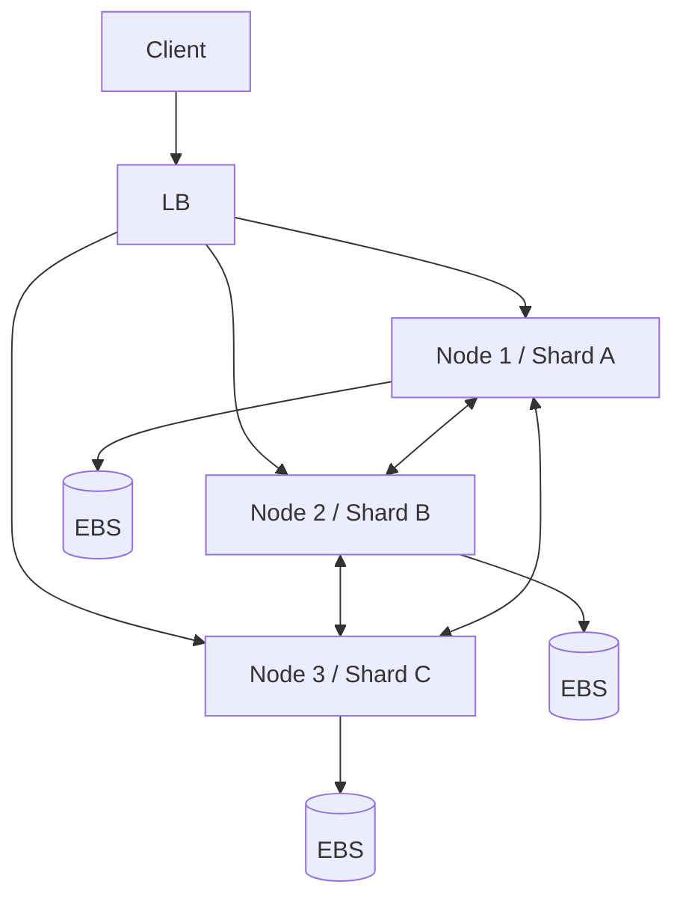

### Design questions

- Is data replicated across AZs?
- What is the replication factor?
- Can the cluster tolerate one node loss?
- Can it tolerate one AZ loss?
- Is rebalancing automatic?
- Is rebalancing too expensive during peak?
- Is node identity stable?
- Does the node need the same EBS volume on restart?
- Is bootstrap join safe?
- What prevents accidental double membership?
- How are snapshots taken?
- How is quorum maintained?

### Stateful fleet invariants

- Do not replace too many nodes at once.
- Do not mix scale-in with shard rebalancing blindly.
- Do not terminate a node before decommissioning if the system requires it.
- Do not use an ALB health check as the only cluster health signal.
- Do not treat "instance healthy" as "cluster safe".
- Use lifecycle hooks to drain/decommission.
- Use placement/partition strategy intentionally.
- Design for slow repair, not instant magic recovery.

---

## 10. Pattern 6 — Cache with Warm Rebuild

Cache is allowed to be local. But cache must not become hidden authority.

Examples:

- NGINX cache,
- package cache,
- CDN origin cache,
- search read-through cache,
- model cache,
- metadata cache,
- image transformation cache,
- build artifact cache,
- local RocksDB cache backed by S3.

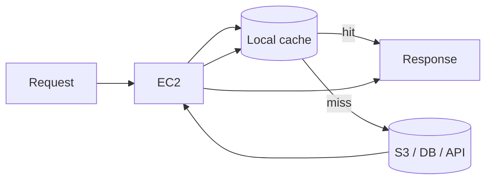

### Cache contract

- Source of truth is external.
- Cache can be deleted.
- Cache versioning is explicit.
- Cache poisoning is detectable.
- Cache warming is optional, not required for correctness.
- Cache miss path is protected by rate limits/backpressure.
- Cache rebuild storm is expected during fleet replacement.

### Failure mode: cache stampede

If 100 replacement instances all warm a 50 GB cache from S3 at once, the source system may become the bottleneck.

Mitigations:

- lazy warm,
- staggered instance refresh,
- warm pools,
- per-key lock,
- request coalescing,
- CDN/object store in front,
- precomputed artifact,
- smaller cache scope,
- backpressure.

---

## 11. Pattern 7 — Instance Store as Scratch / Replicated Temp

Instance store is useful when workload needs very fast local temporary storage.

Good use cases:

- sort/shuffle scratch,
- video transcoding temp,
- ML preprocessing,
- build workspace,
- decompression staging,
- local cache,
- replicated data node where cluster has redundancy,
- ephemeral queue spill with external checkpoint.

Bad use cases:

- sole copy of uploaded files,
- sole database volume,
- only copy of transaction log,
- unreplicated queue,
- regulatory record store,
- anything with non-zero RPO unless replicated externally.

### Scratch pattern

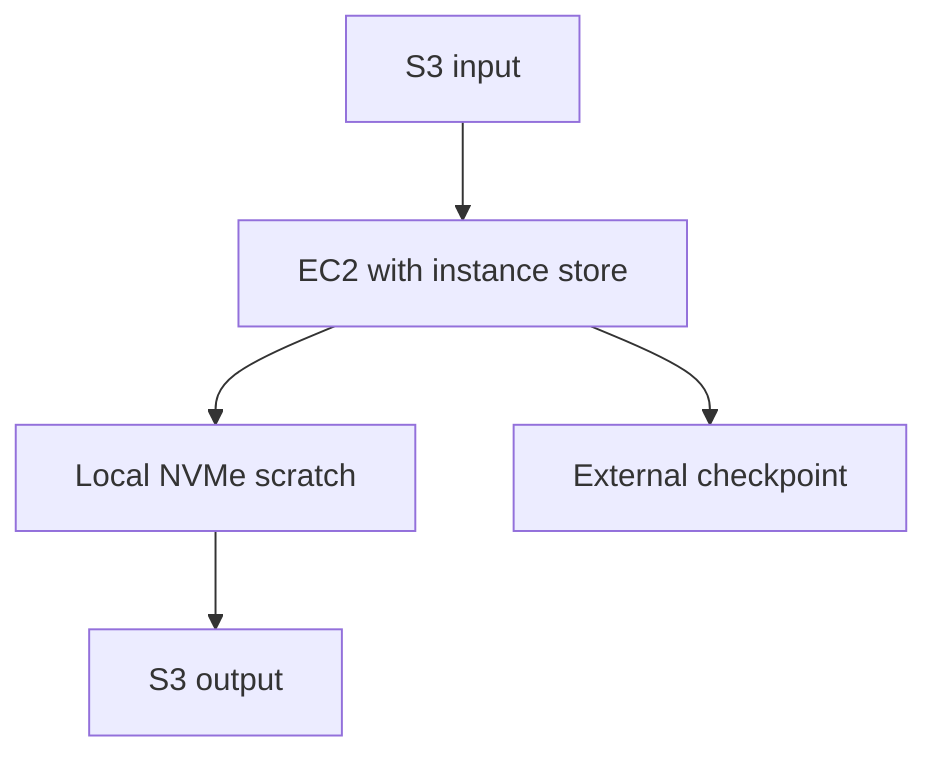

### Rule

> Use instance store when losing the disk means recomputation, not business loss.

---

## 12. Anti-Patterns

### 12.1 Snowflake Server

Symptoms:

- manually configured instance,
- unknown packages,
- local data in root volume,
- SSH changes,
- no rebuild script,
- no AMI pipeline,
- no snapshot schedule,
- no owner tags,
- no restore test.

Fix:

- externalize state,
- bake AMI,
- define data volumes,
- add snapshots,
- test rebuild,
- remove manual drift.

---

### 12.2 ASG Around a Stateful Singleton

Symptoms:

- ASG desired capacity = 1,
- app writes local disk,
- replacement creates empty instance,
- old EBS data abandoned,
- health check only checks port.

Fix:

- either make it stateless,
- or manage EBS handoff deliberately,
- or migrate to managed stateful service,
- or remove ASG and use explicit recovery automation.

---

### 12.3 Root Volume as Data Volume

Symptoms:

- app writes business data under `/var/lib/app`,
- root volume is deleted on termination,
- AMI rebuild destroys data,
- disk full breaks OS and app together.

Fix:

- separate root and data volumes,
- mount `/data`,
- tag data volume,
- snapshot data volume,
- alert separately.

---

### 12.4 Local Queue Without External Recovery

Symptoms:

- worker persists tasks locally,
- instance terminates,
- tasks vanish,
- no dedupe or replay.

Fix:

- use SQS/Kinesis/MSK/managed queue,
- externalize offset/checkpoint,
- write idempotent consumers.

---

### 12.5 "It Has Backups" Without Restore Semantics

Symptoms:

- snapshots exist,
- no application quiesce,
- no restore test,
- no dependency ordering,
- no RPO/RTO proof.

Fix:

- test restore,
- document application consistency,
- define recovery order,
- use backup plan and restore rehearsal.

---

## 13. Decision Framework

Use this table before choosing a pattern.

| Question | If yes | If no |
|---|---|---|
| Can the instance be terminated without correctness loss? | Stateless | Continue |
| Can the state be regenerated cheaply? | Cache/rebuildable state | Continue |
| Is state already externally authoritative? | Stateless compute with external state | Continue |
| Does the app require local block semantics? | EBS data volume | Use S3/EFS/FSx/DB |
| Can another node safely attach state? | Stateful handoff pattern | Need restore or manual recovery |
| Is there a fencing mechanism? | Safer state transfer | Split-brain risk |
| Can AZ loss be tolerated? | Replicate across AZs | Zonal failure risk |
| Is state distributed with quorum? | Stateful fleet | Singleton risk |
| Can lifecycle events be handled? | ASG possible | Avoid blind ASG replacement |
| Is RPO/RTO defined and tested? | Production-ready | Not production-ready |

---

## 14. Implementation Patterns by Workload

### 14.1 Stateless Java API

Recommended:

- EC2 ASG across multiple AZs.
- ALB target group.
- AMI baked with JDK/runtime.
- External config.
- RDS/DynamoDB for state.
- S3 for object data.
- CloudWatch/OpenTelemetry logs/metrics/traces.
- ASG Instance Refresh.
- Root volume disposable.

Avoid:

- local session,
- file uploads to root disk,
- manual SSH change,
- sticky node affinity unless required.

---

### 14.2 Legacy File-Based App

Recommended transitional design:

- EC2 instance or small fleet.
- EBS data volume or EFS/FSx depending on semantics.
- Root/data separation.
- Snapshot schedule.
- restore test.
- deployment script that never formats data volume.
- explicit RPO/RTO.
- migration plan to object/file managed service if possible.

Avoid:

- data on root volume,
- ASG replacement without volume handoff,
- using instance store,
- snapshot without application consistency.

---

### 14.3 Queue Worker

Recommended:

- EC2 ASG.
- SQS/Kinesis/MSK external queue.
- local temp only.
- idempotency key.
- checkpoint/ack after commit.
- lifecycle hook or graceful shutdown.
- Spot allowed if interruption-safe.

Avoid:

- local durable queue,
- delete queue message before output commit,
- no dedupe,
- long job without checkpoint.

---

### 14.4 Search/Data Node

Recommended:

- EBS data volumes.
- node decommission lifecycle.
- cluster-aware health check.
- slow rolling replacement.
- placement strategy aligned with shard/replica model.
- snapshots to S3-compatible repository if supported.
- capacity headroom for rebuild.

Avoid:

- replacing many nodes at once,
- using instance health only,
- same AZ for all replicas,
- no snapshot,
- scale-in during rebalance.

---

## 15. Operational Runbook

### 15.1 Classify state during incident

Ask:

```text
1. What instance is unhealthy?
2. What role does it have?
3. Does it own authoritative state?
4. Where is the state stored?
5. Is there a recent snapshot/backup?
6. Is the state replicated?
7. Can the instance be terminated safely?
8. Does the app need graceful drain?
9. Is there a lock/leader/lease?
10. What is the safest replacement path?
```

### 15.2 Stateless instance failure

```text
1. Confirm load balancer removed instance from service.
2. Confirm ASG launched replacement.
3. Check boot/user-data logs on replacement.
4. Confirm application health.
5. Confirm error rate and latency recover.
6. Terminate/quarantine old instance.
7. Review root cause later, not during recovery.
```

### 15.3 Stateful EBS instance failure

```text
1. Stop write traffic if needed.
2. Determine whether old instance is still writing.
3. Fence old instance.
4. Snapshot the data volume before risky operations.
5. Detach volume if safe.
6. Launch replacement in same AZ.
7. Attach volume.
8. Mount read-only first if corruption suspected.
9. Run filesystem/application recovery.
10. Start app.
11. Validate business-level correctness.
12. Resume traffic.
```

### 15.4 Instance store loss

```text
1. Confirm data was non-authoritative.
2. Stop node from serving stale/partial output.
3. Rebuild from source of truth.
4. Rejoin cluster or resume processing.
5. Check source system load during rebuild.
6. Add guardrail if data was accidentally authoritative.
```

### 15.5 Accidental data on root volume

```text
1. Stop instance if still available.
2. Create snapshot of root volume.
3. Attach snapshot/volume to rescue instance.
4. Extract data.
5. Move data to proper data volume/S3/EFS/DB.
6. Update app path.
7. Add alert/policy preventing recurrence.
```

---

## 16. Observability

A state-aware EC2 design should expose these signals.

### Instance-level

- CPU utilization
- memory pressure
- disk usage by mount
- disk inode usage
- EBS queue length
- EBS latency
- EBS throughput
- network throughput/PPS
- status checks
- reboot/termination events

### State-level

- last successful snapshot
- restore test status
- replication lag
- queue depth
- checkpoint age
- cache hit ratio
- local temp disk pressure
- leader/lease owner
- data volume attachment owner
- cluster membership

### Lifecycle-level

- ASG desired/in-service/pending/terminating
- lifecycle hook wait time
- failed bootstrap count
- deregistration delay
- graceful shutdown duration
- replacement duration
- manual intervention count

### Business-level

- duplicate job count
- lost job count
- delayed workflow count
- successful restore verification
- RPO/RTO observed during tests

---

## 17. Guardrails

### 17.1 Tag state explicitly

Every volume should have tags like:

```text
Application = ledger
Environment = prod
StateRole = authoritative | cache | scratch | root
DeletePolicy = retain | disposable
BackupPolicy = hourly | daily | none
Owner = team-name
```

### 17.2 Prevent accidental deletion

Use:

- `DeleteOnTermination = false` for authoritative data volumes.
- AWS Backup or Data Lifecycle Manager policies.
- IAM restrictions around deleting tagged stateful volumes.
- AWS Config/custom checks.
- Terraform policy-as-code.
- Snapshot before destructive change.

### 17.3 Make boot fail closed

A stateful app should not start if:

- expected data volume is missing,
- mounted path is empty unexpectedly,
- filesystem is wrong,
- ownership record points elsewhere,
- generation/lease is stale,
- previous recovery incomplete.

Failing to boot is better than corrupting state.

---

## 18. Mini Case Study — Enforcement Case File Processor

Imagine a regulatory case management system.

Workload:

- users upload evidence documents,
- background workers classify and transform documents,
- API serves case status,
- local processing may need large temp space,
- final documents must be retained,
- duplicate processing is tolerable only if final writes are idempotent.

### Bad design

```mermaid
flowchart TD
    API[EC2 API] --> Root[/var/app/uploads on root volume]
    Worker[EC2 Worker] --> Local[/tmp processing]
    Local --> Root
```

Problems:

- uploaded documents are on root volume,
- ASG replacement loses data,
- workers can leave partial files,
- no durable completion marker,
- no recovery model.

### Better design

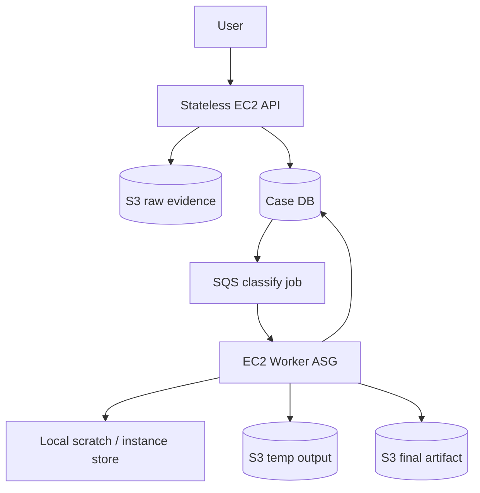

Contract:

- raw evidence goes directly to S3,
- metadata goes to DB,
- worker local disk is scratch,
- final output is written with idempotency key,
- completion is recorded after output is durable,
- failed worker causes retry,
- instance replacement is safe.

This is stateless compute with ephemeral work, not stateful EC2.

---

## 19. Checklist

Before approving an EC2 design, answer:

- [ ] Can each instance be terminated safely?
- [ ] Is all authoritative state identified?
- [ ] Is state location explicit?
- [ ] Is root volume disposable?
- [ ] Are data volumes separate from root?
- [ ] Is `DeleteOnTermination` correct?
- [ ] Are snapshots configured where needed?
- [ ] Has restore been tested?
- [ ] Does termination drain work safely?
- [ ] Are queue workers idempotent?
- [ ] Are local files cache/scratch only?
- [ ] Is instance store used only for rebuildable data?
- [ ] Is there a fencing mechanism for state transfer?
- [ ] Is AZ dependency explicit?
- [ ] Can the workload survive one instance failure?
- [ ] Can the workload survive one AZ failure if required?
- [ ] Are lifecycle hooks needed?
- [ ] Is cluster health different from instance health?
- [ ] Are stateful volumes tagged?
- [ ] Are manual recovery steps documented?

---

## 20. Summary

Stateless EC2 is the default production target because it gives you simple replacement, scaling, deployment, and recovery.

Stateful EC2 is valid when the workload genuinely needs local/block semantics or when you are migrating legacy systems. But it must come with explicit ownership, backup, restore, lifecycle, fencing, and operational runbooks.

The most important design rule:

> **Do not ask Auto Scaling to manage state unless you have taught the system how state moves.**

In the next part, we move from state ownership to physical placement: cluster, spread, and partition placement groups, and how they reshape performance and blast radius.

---

## References

- [Amazon EC2 concepts](https://docs.aws.amazon.com/AWSEC2/latest/UserGuide/concepts.html)
- [Storage options for Amazon EC2 instances](https://docs.aws.amazon.com/AWSEC2/latest/UserGuide/Storage.html)
- [Amazon EBS overview](https://docs.aws.amazon.com/ebs/latest/userguide/what-is-ebs.html)
- [Instance store temporary block storage](https://docs.aws.amazon.com/AWSEC2/latest/UserGuide/InstanceStorage.html)
- [Data persistence for EC2 instance store volumes](https://docs.aws.amazon.com/AWSEC2/latest/UserGuide/instance-store-lifetime.html)
- [Amazon EC2 Auto Scaling instance lifecycle](https://docs.aws.amazon.com/autoscaling/ec2/userguide/ec2-auto-scaling-lifecycle.html)
- [Amazon EC2 Auto Scaling lifecycle hooks](https://docs.aws.amazon.com/autoscaling/ec2/userguide/lifecycle-hooks.html)
- [Gracefully handle instance termination](https://docs.aws.amazon.com/autoscaling/ec2/userguide/gracefully-handle-instance-termination.html)
- [Amazon EC2 Spot best practices](https://docs.aws.amazon.com/AWSEC2/latest/UserGuide/spot-best-practices.html)
