# Part 018 — EC2 Placement Groups and Performance Shape

> Placement is architecture. It decides whether your fleet behaves like one fast machine, many isolated machines, or a rack-aware distributed system.

Most teams learn EC2 instance types first: `m`, `c`, `r`, `i`, `g`, `p`, `trn`, `inf`, and so on.

Advanced teams learn that **where those instances are placed** can be just as important as what type they are.

Amazon EC2 placement groups let you influence instance placement for workloads that need low latency, high network throughput, hardware isolation, or partition-aware failure boundaries.

AWS provides three placement strategies:

| Strategy | Primary purpose |
|---|---|
| Cluster | Pack instances close together for low latency and high network throughput |
| Spread | Place instances on distinct hardware to reduce correlated failure |
| Partition | Divide instances into logical partitions so groups do not share underlying hardware |

This part explains how to reason about placement groups as a performance and failure-shaping tool.

---

## 1. Problem yang Diselesaikan

Without placement strategy, EC2 placement is optimized by AWS for general capacity, availability, and infrastructure management. That is usually correct.

But some workloads need more control:

- tightly coupled HPC nodes,
- distributed training,
- low-latency trading/market systems,
- high-throughput replicated services,
- storage clusters,
- Kafka/Cassandra/OpenSearch/HDFS-like partitioned systems,
- quorum systems,
- high availability control-plane nodes,
- small critical fleets where correlated host failure matters,
- network-intensive east-west services,
- large distributed batch jobs with shuffle traffic.

The wrong placement can cause:

- high tail latency,
- insufficient per-flow throughput,
- noisy cross-AZ traffic,
- correlated failure,
- placement/capacity errors,
- expensive data transfer,
- excessive replication lag,
- bad shard distribution,
- cluster bootstrap failure,
- over-concentrated quorum members,
- hidden single-rack assumptions.

Placement groups are not "more availability" by default. Each strategy trades something.

The job is to choose the placement shape that matches the workload's communication and failure model.

---

## 2. Mental Model

Think of placement as choosing the **physical topology bias** for your instances.

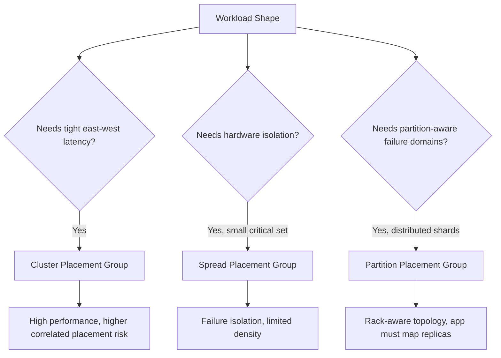

The core idea:

> Placement groups do not make a bad distributed system good. They expose a topology primitive your application must use correctly.

---

## 3. Placement Strategy Overview

### 3.1 Cluster Placement Group

A cluster placement group is a logical grouping of instances within a single Availability Zone. Instances in the same cluster placement group benefit from low network latency and high network throughput.

Use cluster placement when nodes talk to each other heavily and synchronously.

Good fit:

- HPC MPI workloads,
- distributed ML training,
- high-throughput analytics shuffle,
- tightly coupled compute,
- replicated storage needing fast sync,
- low-latency micro-batch processing,
- performance test clusters,
- cache cluster where inter-node speed matters.

Trade-offs:

- single-AZ placement,
- capacity can be harder to acquire,
- correlated infrastructure risk may be higher than spreading,
- not ideal for high-availability quorum across AZs,
- best launched together or with capacity planning.

Mental image:

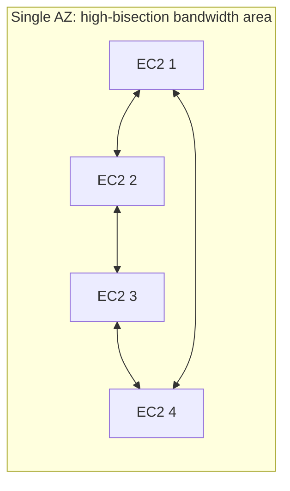

---

### 3.2 Spread Placement Group

A spread placement group places instances on distinct hardware. It is used when each instance must be isolated from failures of the others.

Good fit:

- small quorum cluster,
- active/passive pair,
- critical control plane nodes,
- domain controllers,
- license servers,
- bastion alternatives,
- small fleet where each node is important,
- leader/elector systems.

Trade-offs:

- limited number of running instances per AZ for spread placement groups,
- not for large fleets,
- not for high-density scaling,
- does not optimize network latency like cluster,
- application still needs multi-AZ design if AZ failure matters.

Mental image:

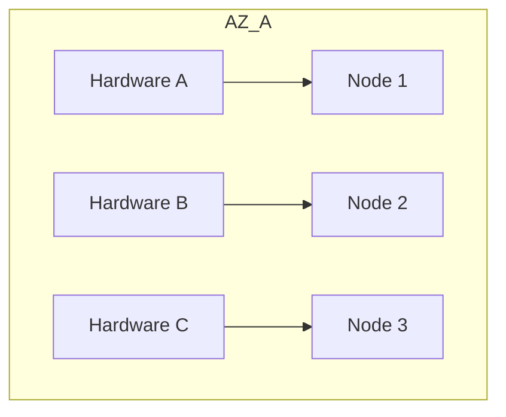

Spread answers:

> "Please do not put these critical instances on the same underlying hardware."

It does not answer:

> "Please make these instances communicate faster."

---

### 3.3 Partition Placement Group

A partition placement group divides instances into logical partitions. Instances in one partition do not share the same underlying hardware with instances in another partition.

Good fit:

- Kafka brokers,
- Cassandra nodes,
- HDFS/DataNode-like systems,
- distributed storage,
- large replicated stateful clusters,
- shard/replica-aware systems,
- systems where application can place replicas across partitions.

Trade-offs:

- application must understand partition mapping,
- incorrect replica placement wastes the benefit,
- more complex operational model,
- not a generic high-availability switch,
- topology must be integrated with cluster membership.

Mental image:

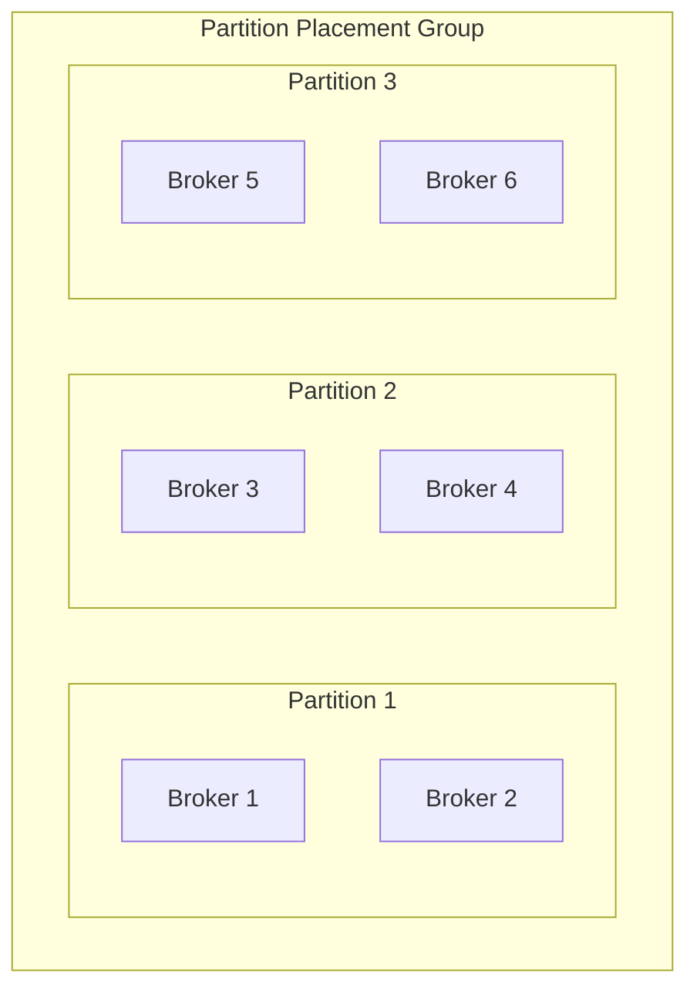

The application should avoid putting all replicas of the same shard/partition on the same placement partition.

---

## 4. Decision Map

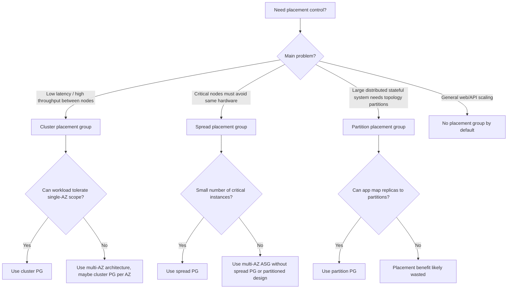

---

## 5. Cluster Placement Group Deep Dive

### 5.1 What it optimizes

Cluster placement groups are about **network shape**.

They aim to reduce network distance and improve high-throughput communication between instances.

This matters when the workload has:

- high east-west traffic,
- synchronous node-to-node communication,
- low-latency barrier synchronization,
- all-reduce operations,
- distributed locks with tight timing,
- storage replication,
- shuffle-heavy jobs,
- high per-flow throughput requirements.

### 5.2 What it does not solve

Cluster placement does not solve:

- application-level contention,
- inefficient protocol,
- single-thread bottleneck,
- kernel/socket buffer limits,
- bad instance type,
- EBS bottleneck,
- overloaded NIC,
- cross-AZ data transfer,
- poor serialization,
- garbage collection pause,
- queueing delay,
- quota/capacity issues.

A placement group can expose the next bottleneck. It does not remove all bottlenecks.

### 5.3 Example: HPC / MPI

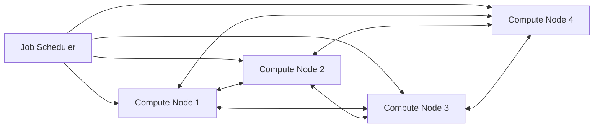

In a tightly coupled job, one slow node can hold back all nodes.

Use:

- cluster placement group,
- same instance type/generation where possible,
- launch all nodes together,
- capacity reservation if availability is critical,
- EFA where workload needs supported high-performance networking,
- instance types with sufficient network and EBS bandwidth,
- benchmark before production.

### 5.4 Example Terraform

```hcl
resource "aws_placement_group" "hpc" {
  name     = "hpc-cluster-prod"
  strategy = "cluster"
}

resource "aws_launch_template" "hpc" {
  name_prefix   = "hpc-"
  image_id      = var.ami_id
  instance_type = "c7i.4xlarge"

  placement {
    group_name = aws_placement_group.hpc.name
  }

  metadata_options {
    http_tokens = "required"
  }

  tag_specifications {
    resource_type = "instance"

    tags = {
      Application = "hpc"
      Placement   = "cluster"
    }
  }
}
```

### 5.5 Operational warning

Cluster placement groups can fail to launch if the requested capacity is not available. Large clusters should be launched together, use supported instance families, and may need capacity reservations or fallback planning.

Do not design the system so that an emergency scale-out requires a large cluster placement allocation that might not be available.

---

## 6. Spread Placement Group Deep Dive

### 6.1 What it optimizes

Spread placement optimizes failure isolation at hardware level.

Use spread when every instance is important and you want to reduce the chance that multiple critical instances are affected by the same underlying hardware failure.

### 6.2 Example: quorum control plane

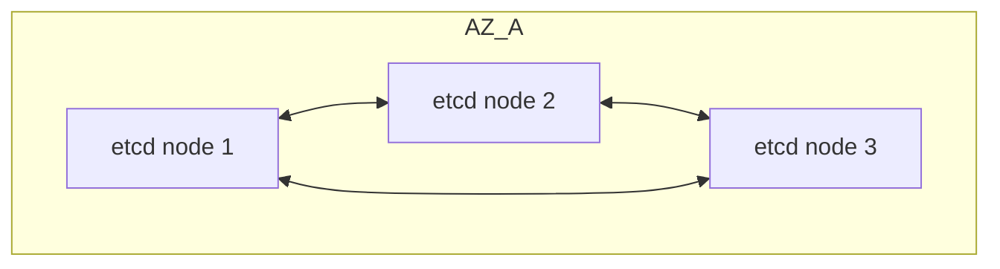

A three-node quorum cluster can lose one node. If two nodes share a failure domain, one hardware event can break quorum. Spread placement reduces that risk inside an AZ.

However, for true AZ resilience, you need multi-AZ topology. Spread within one AZ is not a replacement for multi-AZ design.

### 6.3 Example Terraform

```hcl
resource "aws_placement_group" "control_plane" {
  name     = "control-plane-spread-prod"
  strategy = "spread"
}

resource "aws_instance" "control_plane" {
  count         = 3
  ami           = var.ami_id
  instance_type = "m7i.large"
  subnet_id     = var.subnet_id

  placement_group = aws_placement_group.control_plane.name

  metadata_options {
    http_tokens = "required"
  }

  tags = {
    Application = "control-plane"
    Placement   = "spread"
    NodeIndex   = tostring(count.index)
  }
}
```

### 6.4 When not to use spread

Do not use spread for:

- large web fleets,
- horizontally scalable stateless services,
- thousands of workers,
- batch fleets,
- cache fleets where individual loss is acceptable,
- workloads needing low latency more than isolation.

Spread is for a small number of important nodes, not general scaling.

---

## 7. Partition Placement Group Deep Dive

### 7.1 What it optimizes

Partition placement groups help large distributed systems reason about correlated hardware failure.

Each partition is a separate failure group. The application can place replicas/shards across partitions.

### 7.2 Example: Kafka-like broker fleet

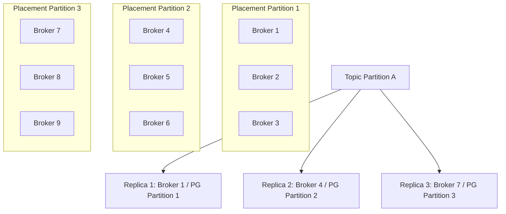

The point is not merely to create partitions. The point is to map application replicas so that one partition failure does not remove all replicas of the same data.

### 7.3 Required application behavior

The application or deployment system must know:

- node ID,
- placement partition,
- shard assignment,
- replica placement,
- rack/partition awareness setting,
- replacement behavior,
- rebalance procedure.

Without this, partition placement is mostly decorative.

### 7.4 Terraform skeleton

```hcl
resource "aws_placement_group" "kafka" {
  name             = "kafka-partition-prod"
  strategy         = "partition"
  partition_count  = 3
}

resource "aws_instance" "broker" {
  count         = 9
  ami           = var.ami_id
  instance_type = "i4i.2xlarge"
  subnet_id     = element(var.subnet_ids, count.index % length(var.subnet_ids))

  placement_group      = aws_placement_group.kafka.name
  placement_partition_number = count.index % 3

  root_block_device {
    volume_type           = "gp3"
    volume_size           = 80
    delete_on_termination = true
    encrypted             = true
  }

  tags = {
    Application       = "kafka"
    BrokerIndex       = tostring(count.index)
    Placement         = "partition"
    PlacementPartition = tostring(count.index % 3)
  }
}
```

Provider/API support for explicit partition assignment depends on the resource and tooling version. Validate against your current Terraform AWS provider and AWS API behavior before standardizing this pattern.

---

## 8. Placement Group and AZ Scope

Placement strategy interacts with Availability Zones.

| Strategy | Common AZ behavior | Design implication |
|---|---|---|
| Cluster | Single AZ logical grouping | best for performance, not AZ resilience |
| Spread | can be used to separate hardware; limits apply | good for small critical sets |
| Partition | partitions can be used for distributed systems | useful for topology-aware replicas |

### Multi-AZ cluster pattern

For a workload that needs both low latency within a cell and regional availability:

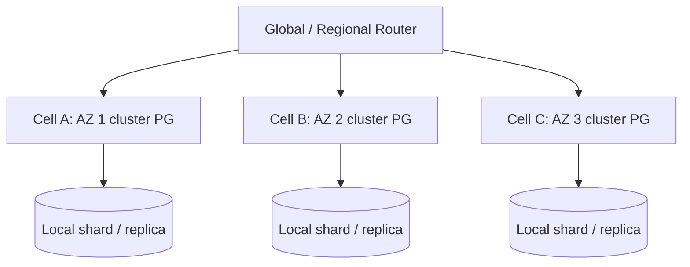

Each AZ has its own performance-optimized cell. The system handles failover or replication at a higher layer.

This is usually better than pretending one placement group gives both maximum performance and maximum resilience.

---

## 9. Performance Shape

Placement is one axis. Performance depends on several axes.

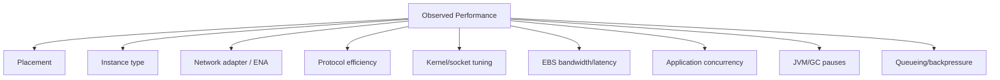

### 9.1 Latency

Latency-sensitive workloads need to inspect:

- p50/p95/p99/p999 latency,
- intra-node vs inter-node latency,
- cross-AZ calls,
- TLS overhead,
- connection pooling,
- thread scheduling,
- GC pauses,
- retransmits,
- interrupt pressure,
- CPU steal/noisy neighbor symptoms,
- packet-per-second limits.

Cluster placement may improve network distance, but application latency can still be dominated by locks, GC, serialization, or synchronous disk flush.

### 9.2 Throughput

Throughput-sensitive workloads need:

- network bandwidth,
- per-flow throughput,
- number of parallel flows,
- EBS throughput,
- CPU cycles per byte,
- compression/encryption overhead,
- disk queue depth,
- buffer sizes,
- backpressure,
- consumer speed.

### 9.3 Tail latency

Tail latency can worsen because of:

- one slow node,
- overloaded EBS volume,
- noisy JVM pause,
- TCP retransmission,
- placement/capacity imbalance,
- uneven shard allocation,
- cross-AZ dependency,
- synchronized checkpoint,
- cache miss storm.

Do not average away placement problems. Always inspect tail behavior.

---

## 10. Benchmarking Methodology

A placement group should be justified with measurement.

### 10.1 Baseline matrix

Test at least:

| Scenario | Purpose |
|---|---|
| no placement group | baseline |
| cluster placement group | latency/throughput improvement |
| spread placement group | isolation behavior, if relevant |
| partition placement group | topology-aware replica behavior |
| different instance size | instance bottleneck check |
| same instance type, different AZ | AZ capacity/perf variance check |
| with real storage path | avoid network-only fake benchmark |
| with app protocol | avoid iperf-only confidence |

### 10.2 Measure

- one-way/two-way latency if applicable,
- p50/p95/p99/p999,
- throughput per flow,
- aggregate throughput,
- CPU utilization,
- network packets/sec,
- retransmits,
- EBS latency,
- EBS queue depth,
- application-level throughput,
- error rate,
- GC pause,
- queue time.

### 10.3 Tools

Depending on workload:

- `iperf3` for network throughput baseline,
- `ping`/`hping3` only as rough signal,
- `fio` for disk/EBS tests,
- application load test,
- distributed benchmark tool for actual system,
- CloudWatch metrics,
- OS metrics,
- application tracing.

### 10.4 Benchmark trap

Do not benchmark only empty instances and assume the app will behave the same.

Real workload adds:

- TLS,
- auth,
- serialization,
- disk flush,
- memory allocation,
- GC,
- locks,
- kernel buffers,
- retries,
- queueing,
- logging,
- sidecars/agents.

---

## 11. Capacity Engineering with Placement Groups

Placement groups introduce capacity risk.

### 11.1 Cluster capacity risk

Cluster placement requires AWS to place requested instances close enough together. Large requests or uncommon instance types may fail due to insufficient capacity.

Mitigation:

- launch all required instances together,
- use fewer/larger instances if appropriate,
- use supported instance families and sizes consistently,
- create capacity reservations for critical workloads,
- design fallback instance families,
- pre-scale before peak,
- avoid emergency scale-out as the first time capacity is requested,
- test launch in target Region/AZ,
- use multiple cells instead of one huge cell.

### 11.2 Spread density limit

Spread placement is not for large fleets. If you need hundreds of instances, use normal multi-AZ ASG or partition placement instead.

### 11.3 Partition operational complexity

Partition placement requires your system to map replicas correctly. If your app cannot use topology metadata, partition placement may not help.

---

## 12. Auto Scaling Group Integration

Placement groups can be used with Auto Scaling, but the scaling behavior must match the strategy.

### 12.1 ASG + cluster placement

Good for:

- fixed-size HPC cluster,
- high-throughput worker cell,
- low-latency service cell.

Watch out for:

- scale-out failure due to capacity,
- replacing instances one by one changing performance,
- mixed instance policies reducing homogeneity,
- rolling updates breaking job coordination.

Pattern:

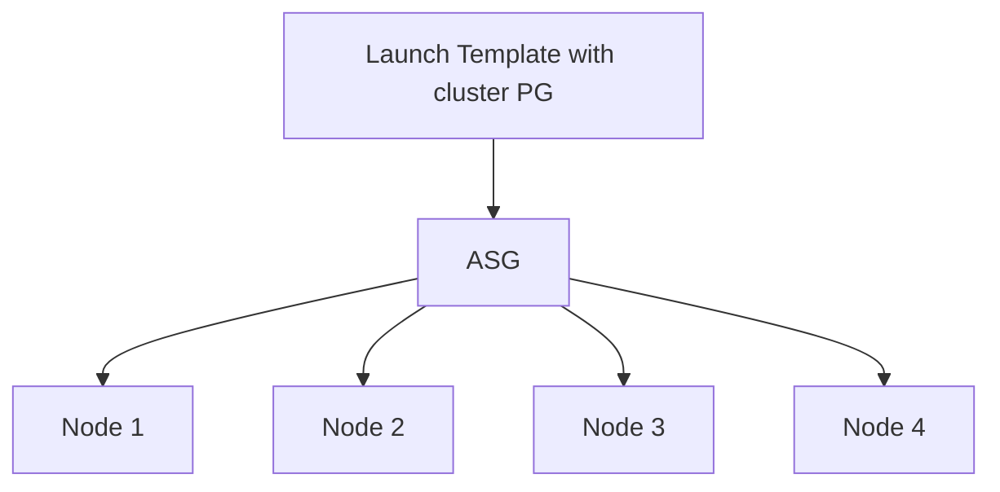

Use capacity reservations where missed capacity means incident.

### 12.2 ASG + spread placement

Good for:

- small fixed set,
- critical nodes,
- control plane.

Watch out for:

- spread limits,
- scale-out beyond intended size,
- application quorum not aligned with ASG replacement.

### 12.3 ASG + partition placement

Good for:

- distributed storage/broker fleet,
- topology-aware replacement.

Watch out for:

- replacement preserving partition distribution,
- scale-in choosing the wrong node,
- rebalancing before termination,
- application membership cleanup.

### 12.4 Lifecycle hooks

For stateful fleets, combine placement with lifecycle hooks:

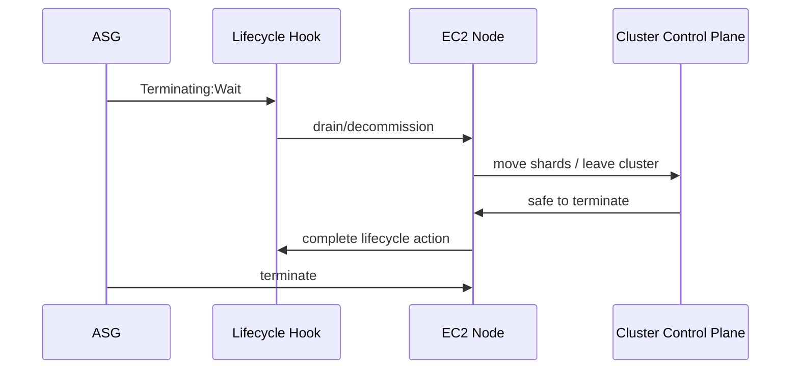

Placement controls where nodes live. Lifecycle controls how they leave.

You need both for stateful production systems.

---

## 13. Pattern Catalog

### 13.1 Low-Latency Compute Cell

Use when:

- nodes talk constantly,
- latency matters more than independent hardware isolation,
- workload can tolerate cell-level failure or has multiple cells.

Pattern:

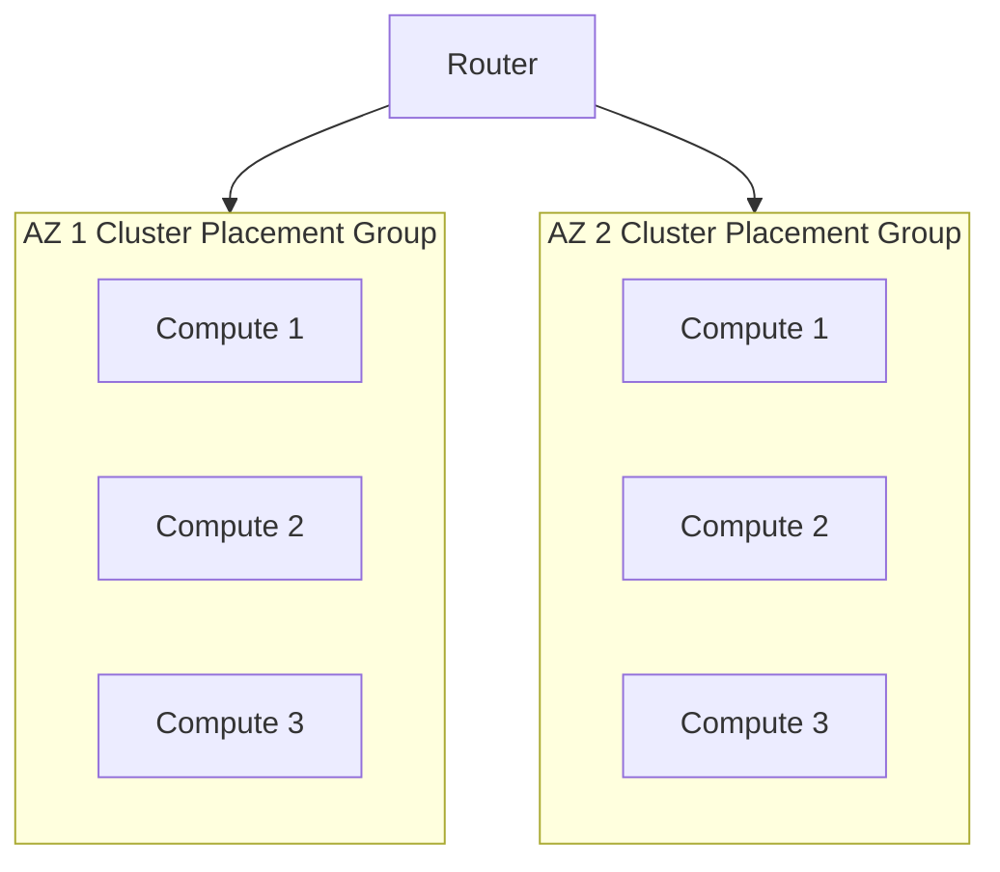

Use for:

- low-latency service cell,
- distributed training,
- HPC.

---

### 13.2 Critical Quorum Set

Use when:

- few nodes,
- each node matters,
- correlated host failure is unacceptable.

Pattern:

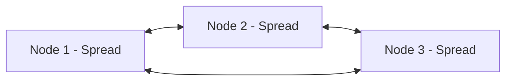

Use for:

- etcd-like control plane,
- small consensus systems,
- critical coordination nodes.

---

### 13.3 Rack-Aware Stateful Cluster

Use when:

- state is sharded/replicated,
- app can place replicas using topology,
- large fleet,
- correlated hardware failure matters.

Pattern:

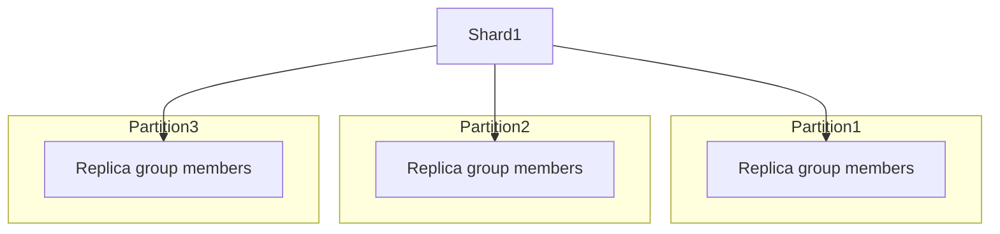

Use for:

- Kafka-like clusters,
- Cassandra-like clusters,
- distributed file systems.

---

### 13.4 No Placement Group by Default

Most web/API services do not need placement groups.

Use:

- multi-AZ ASG,
- ALB/NLB,
- stateless compute,
- external state,
- normal EC2 placement.

Why:

- simpler capacity,
- better general availability,
- fewer constraints,
- easier scaling,
- less topology coupling.

---

## 14. Failure Modes

### 14.1 Cluster placement capacity failure

Symptoms:

- instances fail to launch,
- ASG cannot reach desired capacity,
- insufficient capacity errors,
- rollout stuck.

Response:

```text
1. Stop rolling deployment if capacity is required.
2. Check ASG activity history.
3. Check instance type/AZ/placement group capacity.
4. Try smaller batch replacement.
5. Use fallback instance type if performance contract allows.
6. Use another AZ/cell if architecture supports it.
7. Consider capacity reservation for future.
```

### 14.2 Spread placement overuse

Symptoms:

- scaling fails at low instance count,
- architecture expects large fleet,
- spread limits reached.

Response:

```text
1. Confirm whether spread is actually required.
2. Move general fleet to normal ASG.
3. Keep spread only for critical nodes.
4. Use partition placement for large stateful topology if needed.
```

### 14.3 Partition mapping bug

Symptoms:

- all replicas of a shard placed in same partition,
- one partition event causes data unavailability,
- cluster reports healthy before topology check.

Response:

```text
1. Query placement partition for each node.
2. Query application replica assignment.
3. Compare replica set against placement partition.
4. Move replicas gradually.
5. Add admission check preventing bad placement.
```

### 14.4 Performance not improved

Symptoms:

- cluster PG deployed,
- latency unchanged,
- throughput unchanged,
- p99 still high.

Possible causes:

- app bottleneck,
- CPU saturation,
- GC pauses,
- EBS bottleneck,
- single TCP flow limit,
- poor parallelism,
- cross-AZ dependency remains,
- downstream service slow.

Response:

```text
1. Compare network benchmark and app benchmark.
2. Check CPU, network, EBS, memory, GC.
3. Trace end-to-end request path.
4. Remove cross-AZ calls from hot path.
5. Tune app concurrency and protocol.
6. Re-evaluate instance type.
```

### 14.5 Correlated failure from wrong strategy

Symptoms:

- critical quorum nodes lost together,
- all replicas on same hardware/AZ,
- cluster unavailable after one failure domain event.

Response:

```text
1. Stop automation that replaces more nodes.
2. Preserve remaining quorum.
3. Recover nodes in safe order.
4. Re-map topology.
5. Introduce spread/partition/multi-AZ rule.
```

---

## 15. Observability

Placement group itself is not enough. Observe the workload effect.

### 15.1 Network metrics

- network in/out,
- packets per second,
- retransmits,
- connection errors,
- p99 inter-node latency,
- per-flow throughput,
- aggregate throughput.

### 15.2 Compute metrics

- CPU utilization,
- CPU saturation,
- steal time if visible,
- load average,
- run queue,
- interrupt pressure,
- memory pressure,
- GC pause.

### 15.3 Storage metrics

- EBS read/write latency,
- EBS queue length,
- EBS throughput,
- instance store saturation,
- filesystem wait,
- flush latency.

### 15.4 Application metrics

- replication lag,
- consensus commit latency,
- shard movement duration,
- rebalance time,
- cache hit ratio,
- request p99/p999,
- job barrier wait,
- failed node replacement time.

### 15.5 Placement metadata

Record for each node:

- instance ID,
- AZ,
- placement group,
- placement strategy,
- placement partition if applicable,
- shard/replica assignment,
- node role,
- generation.

This metadata should be visible in dashboards and incident tooling.

---

## 16. Topology-Aware Health Checks

A normal health check answers:

> Is this process responding?

A topology-aware health check answers:

> Is the system safe if this node is added, removed, or replaced?

For stateful placement-aware systems, check:

- replica diversity,
- quorum margin,
- partition distribution,
- rebalance status,
- under-replicated shards,
- leader distribution,
- AZ distribution,
- placement partition distribution,
- data durability level.

Example health gate:

```text
Allow node termination only if:
- no under-replicated partition exists,
- cluster has quorum after removal,
- replacement capacity exists,
- node is not current sole leader for critical partition,
- replication lag below threshold,
- decommission completed.
```

---

## 17. Cost Trade-Offs

Placement groups themselves do not usually appear as a separate line item, but they influence cost indirectly.

### 17.1 Cluster cost effects

- May require larger instances.
- May require capacity reservations.
- May reduce job duration.
- May reduce cross-node wait time.
- May concentrate traffic inside one AZ.
- May require multi-cell redundancy for availability.

### 17.2 Spread cost effects

- May limit packing/scaling efficiency.
- May require more deliberate sizing.
- Can reduce incident cost for critical nodes.

### 17.3 Partition cost effects

- Operational complexity cost.
- Better failure containment can reduce data loss/unavailability.
- Incorrect mapping gives complexity without benefit.

Cost question:

> Does this placement strategy reduce the cost per successful unit of work, or only make the architecture look more advanced?

---

## 18. Production Design Examples

### 18.1 Java API Fleet

Recommendation:

- no placement group by default,
- multi-AZ ASG,
- ALB,
- external state,
- autoscaling by request/CPU/latency,
- focus on statelessness and lifecycle.

Reason:

- API fleet benefits more from AZ diversity and simple capacity than physical co-location.

---

### 18.2 Low-Latency Matching Engine Cell

Recommendation:

- cluster placement group per AZ/cell,
- fixed-size capacity,
- capacity reservation,
- strict versioned deployment,
- warm standby cell,
- explicit failover,
- p99/p999 latency monitoring.

Reason:

- workload depends on tight network behavior.

---

### 18.3 Kafka-like Broker Cluster

Recommendation:

- partition placement group,
- replica assignment across placement partitions and AZs where applicable,
- EBS or instance store depending on durability/replication design,
- lifecycle hooks for decommission,
- topology-aware health checks.

Reason:

- correlated failure matters at shard/replica level.

---

### 18.4 Three-Node Coordination Cluster

Recommendation:

- spread placement group if inside one AZ,
- preferably multi-AZ if latency/quorum allows,
- avoid cluster placement unless latency dominates and correlated hardware risk is acceptable.

Reason:

- each node is individually important.

---

### 18.5 Batch Shuffle Job

Recommendation:

- cluster placement group for tightly coupled shuffle-heavy job,
- instance store for scratch,
- S3 for input/output,
- launch full job capacity together,
- checkpoint externally.

Reason:

- job speed depends on east-west throughput and local scratch.

---

## 19. Runbook

### 19.1 Before using placement groups

```text
1. Define workload communication pattern.
2. Define failure model.
3. Decide whether latency, isolation, or partition topology is primary.
4. Benchmark baseline without placement group.
5. Benchmark with candidate placement strategy.
6. Validate capacity availability.
7. Validate autoscaling behavior.
8. Define fallback plan.
9. Add topology metadata to observability.
10. Document operational limits.
```

### 19.2 When launch fails

```text
1. Check ASG activity or EC2 RunInstances error.
2. Confirm placement group strategy.
3. Confirm requested instance type and AZ.
4. Try smaller batch.
5. Try alternate compatible instance type.
6. Try alternate AZ/cell if architecture supports it.
7. Use Capacity Reservation for predictable future capacity.
8. Avoid repeated blind retries during incident.
```

### 19.3 When performance regresses

```text
1. Confirm instances are actually in expected placement group.
2. Compare network baseline.
3. Compare application p99/p999.
4. Check CPU, memory, EBS, network, retransmits.
5. Check cross-AZ or external dependency.
6. Check recent instance replacement or mixed family change.
7. Check protocol-level bottleneck.
8. Roll back placement/instance/deployment change if needed.
```

### 19.4 When topology is unsafe

```text
1. Freeze scale-in and rolling deployment.
2. Inspect placement partition/spread distribution.
3. Inspect application replica/shard distribution.
4. Move replicas safely.
5. Restore quorum/replication margin.
6. Add automated validation before future changes.
```

---

## 20. Checklist

- [ ] Is a placement group actually needed?
- [ ] Is the primary goal latency, throughput, isolation, or partition topology?
- [ ] Is the selected strategy aligned with that goal?
- [ ] Has baseline performance been measured without placement group?
- [ ] Has performance been measured with placement group?
- [ ] Is capacity availability tested?
- [ ] Is there a fallback if launch fails?
- [ ] Is ASG behavior compatible with the strategy?
- [ ] Are lifecycle hooks needed?
- [ ] Is stateful node termination cluster-aware?
- [ ] Is placement metadata visible?
- [ ] Is shard/replica placement topology-aware?
- [ ] Are p99/p999 metrics monitored?
- [ ] Are EBS and network metrics monitored?
- [ ] Is a capacity reservation needed?
- [ ] Is multi-AZ resilience handled outside cluster placement?
- [ ] Are spread limits understood?
- [ ] Are partition mappings validated?
- [ ] Is rollback documented?
- [ ] Has a game day tested replacement and capacity failure?

---

## 21. Common Mistakes

### Mistake 1 — Using cluster placement for availability

Cluster placement is primarily a performance tool, not a high-availability pattern.

### Mistake 2 — Using spread for a normal web fleet

A web fleet usually needs multi-AZ scaling and stateless design, not spread hardware isolation.

### Mistake 3 — Creating partition placement but ignoring it

If the application does not map replicas/shards to placement partitions, the topology benefit is wasted.

### Mistake 4 — Forgetting capacity risk

Placement constraints make capacity less flexible. This matters during scale-out and replacement.

### Mistake 5 — Benchmarking the network but not the application

Network improvement does not guarantee application improvement.

### Mistake 6 — Mixing too many instance types in a performance-sensitive cluster

Mixed instance types can make the slowest nodes dominate barrier-based workloads.

---

## 22. Mini Case Study — Real-Time Enforcement Scoring Cluster

Imagine a regulatory enforcement platform that scores high-volume events.

Requirements:

- scoring nodes exchange features in near real time,
- p99 latency matters,
- state is replicated to external durable storage,
- batch recomputation exists,
- service must survive AZ failure by shifting to another cell.

### Bad design

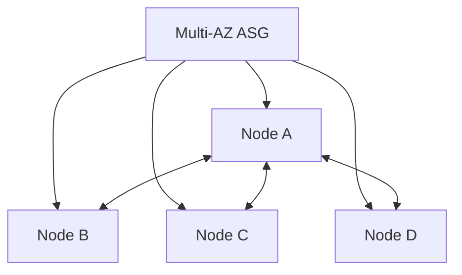

Problem:

- nodes are spread across AZs,
- east-west calls pay cross-AZ latency,
- p99 is unstable,
- data transfer cost increases,
- failure behavior is unclear.

### Better design

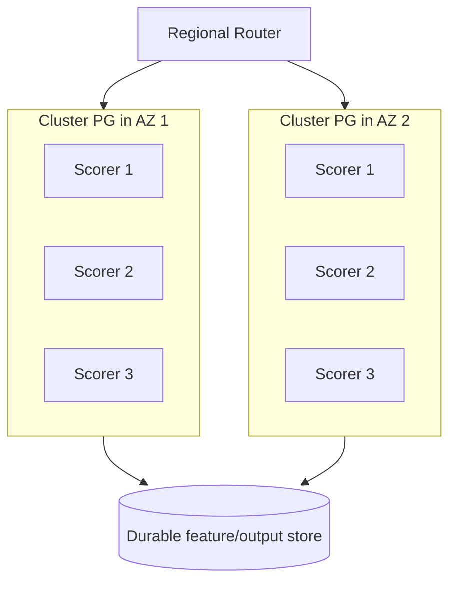

Design:

- each cell is performance-optimized,
- cells are isolated by AZ,
- regional router handles failover,
- state is externalized,
- capacity is pre-reserved for critical windows,
- p99 is monitored per cell.

This separates two concerns:

- cluster placement for intra-cell performance,
- multi-cell design for availability.

---

## 23. Summary

Placement groups are a topology tool.

Use:

- **cluster** when communication performance dominates,
- **spread** when small critical nodes need hardware isolation,
- **partition** when distributed state needs topology-aware failure domains,
- **no placement group** when ordinary stateless scaling is enough.

The best engineers do not add placement groups because they sound advanced. They add them when the workload's communication graph or failure graph requires a specific physical shape.

The next part moves into EC2 commercial/capacity strategy: Spot, On-Demand, Reserved Instances, Savings Plans, interruption handling, and capacity risk.

---

## References

- [Placement groups for Amazon EC2 instances](https://docs.aws.amazon.com/AWSEC2/latest/UserGuide/placement-groups.html)
- [Placement strategies for placement groups](https://docs.aws.amazon.com/AWSEC2/latest/UserGuide/placement-strategies.html)
- [Create a placement group](https://docs.aws.amazon.com/AWSEC2/latest/UserGuide/create-placement-group.html)
- [AWS::EC2::PlacementGroup CloudFormation reference](https://docs.aws.amazon.com/AWSCloudFormation/latest/TemplateReference/aws-resource-ec2-placementgroup.html)
- [CreatePlacementGroup API reference](https://docs.aws.amazon.com/AWSEC2/latest/APIReference/API_CreatePlacementGroup.html)
- [Use Capacity Reservations with placement groups](https://docs.aws.amazon.com/AWSEC2/latest/UserGuide/cr-cpg.html)
- [Amazon EC2 Auto Scaling lifecycle hooks](https://docs.aws.amazon.com/autoscaling/ec2/userguide/lifecycle-hooks.html)
- [Gracefully handle instance termination](https://docs.aws.amazon.com/autoscaling/ec2/userguide/gracefully-handle-instance-termination.html)
