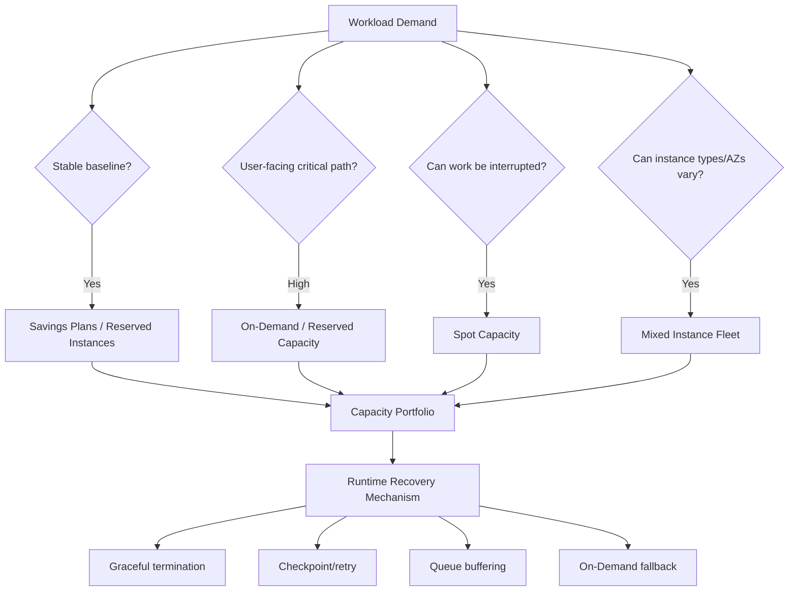
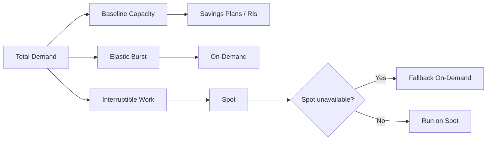
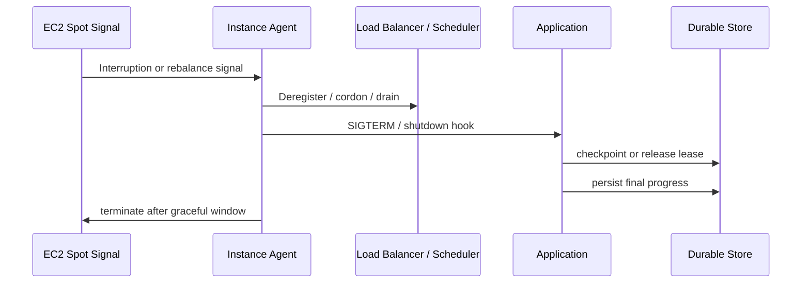
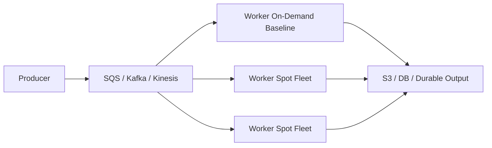
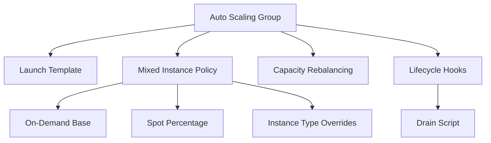

# Part 019 — EC2 Spot, On-Demand, and Capacity Risk

> Cheap capacity is not free capacity. Every discount is a contract about interruption, commitment, placement, flexibility, or operational burden.

Most engineers learn EC2 purchasing options as billing categories:

- On-Demand,
- Spot,
- Reserved Instances,
- Savings Plans,
- Dedicated Hosts,
- Capacity Reservations.

That framing is useful for finance, but insufficient for production engineering.

For engineering, the better question is:

> What kind of capacity failure am I willing to absorb, and where is the recovery mechanism implemented?

This part teaches EC2 capacity as a **risk-management problem**. You will learn when to use On-Demand, Spot, Reserved Instances, Savings Plans, mixed fleets, Capacity Rebalancing, diversification, checkpointing, and graceful termination.

The goal is not to always minimize EC2 price. The goal is to minimize **cost per reliable unit of useful work**.

---

## 1. Problem yang Diselesaikan

EC2 gives you flexible compute, but capacity is not one-dimensional.

A production fleet needs to answer:

- Can I tolerate interruption?
- Can I tolerate delayed capacity acquisition?
- Can I tolerate AZ-specific capacity shortage?
- Can I tolerate instance-family shortage?
- Can I tolerate instance replacement during peak traffic?
- Can I tolerate slower startup because images are large?
- Can I use multiple instance families?
- Can my workload checkpoint progress?
- Can my queue absorb lost workers?
- Can my service degrade gracefully?
- Can I commit to baseline usage for 1 or 3 years?
- Can my organization separate financial commitment from technical scheduling?

Bad EC2 capacity strategy causes:

- Spot interruption storms,
- failed scale-out during traffic spikes,
- rollout stuck due to unavailable capacity,
- queue backlog amplification,
- expensive On-Demand overprovisioning,
- underutilized Reserved Instances,
- Savings Plans mismatch,
- AZ imbalance,
- noisy failover,
- broken graceful shutdown,
- lost in-flight work,
- cascading downstream pressure,
- hidden dependency on one instance type,
- false sense of reliability because the fleet had worked during normal days.

A top-tier engineer does not ask only:

> Which purchasing option is cheapest?

They ask:

> Which capacity contract matches this workload's failure model?

---

## 2. Mental Model

Think of EC2 capacity as a portfolio.



Each option moves risk to a different layer.

| Option | What you gain | What you accept |
|---|---|---|
| On-Demand | Maximum flexibility, low operational complexity | Higher unit cost, no long-term discount |
| Spot | Large discount potential | Interruption and availability risk |
| Savings Plans | Discount for committed compute spend | Financial commitment, forecasting risk |
| Reserved Instances | Discount tied to instance configuration/region/scope | Less flexibility than Savings Plans |
| Capacity Reservation | Capacity assurance | Pay for reserved capacity whether used or not |
| Mixed Instance Fleet | Better capacity availability and cost shape | More testing and workload compatibility work |

The invariant:

> Capacity strategy is part of architecture, not procurement.

---

## 3. Purchasing Options as Engineering Contracts

### 3.1 On-Demand Instances

On-Demand is the default EC2 model: launch instances when needed and pay for what you use.

Engineering meaning:

- good for unpredictable workloads,
- good for critical capacity fallback,
- good for new services without known baseline,
- good for experiments,
- good for emergency scaling,
- good for stateful systems where interruption is expensive.

Hidden problem:

> On-Demand does not mean infinite capacity.

You still have:

- service quotas,
- AZ capacity constraints,
- instance type availability limits,
- launch rate limits,
- AMI boot time,
- dependency startup bottlenecks.

Use On-Demand when failure to acquire capacity is less acceptable than paying more.

---

### 3.2 Spot Instances

Spot uses spare EC2 capacity. The discount exists because AWS can reclaim that capacity.

Engineering meaning:

- excellent for interruptible work,
- good for queue workers,
- good for batch jobs,
- good for CI/CD runners,
- good for image/video processing,
- good for stateless horizontally scaled services with fallback,
- dangerous for non-replicated stateful systems,
- dangerous for critical singleton workloads,
- dangerous when graceful shutdown is not implemented.

Spot is not merely cheaper On-Demand.

Spot is a different availability contract.

A Spot-compatible workload must have at least one of these:

- retryable work unit,
- checkpointed progress,
- redundant replicas,
- graceful drain,
- queue-based dispatch,
- On-Demand fallback,
- fast replacement,
- capacity diversification.

---

### 3.3 Reserved Instances

Reserved Instances can reduce cost for known EC2 usage, but they are more configuration-bound than Savings Plans.

Engineering meaning:

- works for stable, predictable EC2 usage,
- requires forecasting,
- can be useful where instance family and region are stable,
- can become waste when architecture changes.

Risk:

- workload migrates to Graviton,
- service moves to Fargate or Lambda,
- instance family changes,
- region changes,
- utilization drops,
- organization commits to the wrong shape.

Reserved Instances are not a runtime scheduling mechanism. They are a billing discount instrument.

---

### 3.4 Savings Plans

Savings Plans provide discounts in exchange for committed usage spend.

Engineering meaning:

- better fit for flexible compute portfolios,
- can cover EC2, Fargate, and Lambda depending on plan type,
- less tightly coupled to one exact instance shape than traditional RIs,
- useful when you know baseline spend but expect technical evolution.

Practical rule:

> Commit to the boring baseline, not the speculative peak.

Do not cover peak traffic with long-term commitment unless the peak is truly predictable.

---

### 3.5 Capacity Reservations

Capacity Reservations reserve EC2 capacity in a specific AZ for specific instance attributes.

Engineering meaning:

- useful for critical failover capacity,
- useful for regulated workloads with strict recovery objectives,
- useful before large migrations or launches,
- useful when capacity acquisition failure is unacceptable.

Cost implication:

- you pay for capacity whether used or not,
- this is reliability spend, not ordinary cost optimization.

Use Capacity Reservation when the business risk of not launching is greater than the cost of idle reserved capacity.

---

## 4. Workload Compatibility Matrix

| Workload | On-Demand | Spot | Savings Plans | Capacity Reservation | Notes |
|---|---:|---:|---:|---:|---|
| User-facing API | High | Medium with fallback | High for baseline | Medium for critical events | Spot only if stateless, diversified, and protected |
| Queue workers | Medium | High | Medium | Low | Best Spot candidate if idempotent |
| Batch jobs | Medium | High | Medium | Low | Needs retry/checkpoint |
| CI/CD runners | Medium | High | Low/Medium | Low | Great Spot fit |
| Stateful primary DB | High | Very low | High if EC2-hosted | Medium | Spot usually wrong |
| Replicated storage cluster | Medium | Low/Medium | Medium | Medium | Only with topology/failure-aware design |
| ML training | Medium | Medium/High | Medium | Low | Checkpointing is mandatory |
| HPC tightly coupled | Medium | Low/Medium | Medium | Medium | Capacity and placement matter |
| Cache fleet | Medium | Medium/High | Medium | Low | Accept cache loss and warmup cost |
| Control plane nodes | High | Low | Medium | Medium/High | Prefer stable capacity |

The important part is not the table. The important part is the **reason** behind the table.

Spot is strong when work is:

- divisible,
- retryable,
- idempotent,
- checkpointable,
- not a single source of truth,
- not blocking user response directly,
- buffered by a queue,
- diversified across instance pools.

Spot is weak when work is:

- long-running without checkpoint,
- single-primary stateful,
- tied to local disk state,
- impossible to retry safely,
- latency critical,
- hard to drain,
- sensitive to correlated interruption.

---

## 5. The Capacity Portfolio Pattern

A mature EC2 architecture often uses a blended portfolio:



Example:

| Capacity slice | Purchasing model | Workload |
|---|---|---|
| 60% baseline API capacity | Savings Plans | predictable minimum load |
| 20% burst API capacity | On-Demand | peak traffic and rollout headroom |
| 20% async worker capacity | Spot | queue-drain acceleration |

This avoids both extremes:

- all On-Demand: operationally simple but expensive,
- all Spot: cheap until interruption causes real business failure,
- all committed: efficient until demand or architecture changes.

---

## 6. Mixed Instance Policy

The most common Spot mistake is using only one instance type.

Example bad pattern:

```text
ASG = c7i.large only, Spot only, one AZ
```

This makes your availability dependent on one pool.

Better:

```text
ASG = c7i.large, c7a.large, c6i.large, c6a.large, m7i.large, m7a.large
AZs = at least 2, preferably 3+
Purchase = mixed On-Demand + Spot
Allocation = capacity-aware
```

A Spot capacity pool is effectively a combination of:

```text
instance type + Availability Zone + purchasing option
```

More compatible pools usually mean better capacity resilience.

---

## 7. Allocation Strategy

Allocation strategy determines how Auto Scaling or EC2 Fleet chooses capacity across possible pools.

Common strategies:

| Strategy | Engineering meaning |
|---|---|
| capacity-optimized | Prefer pools with better available Spot capacity |
| price-capacity-optimized | Balance capacity availability and price |
| lowest-price | Prefer cheapest pools, can increase interruption risk |
| prioritized | Follow your explicit order, useful for On-Demand preference |

For production Spot, prefer capacity-aware strategies over pure lowest-price.

Why?

Because the cheapest capacity is often cheap for a reason: less available, more interruptible, or more constrained.

---

## 8. Spot Interruption Handling

A Spot interruption is not an exceptional event. It is part of the contract.

Your application should expect:

- interruption notice,
- rebalance recommendation,
- termination,
- stop,
- hibernate depending on configuration,
- replacement launch attempts,
- possible capacity failure during replacement.

A good interruption handler does five things:

1. Stop accepting new work.
2. Mark the node as draining.
3. Release or checkpoint current work.
4. Flush telemetry and logs.
5. Exit before forced termination.



---

## 9. Rebalance Recommendation

A rebalance recommendation is a signal that a Spot Instance has elevated interruption risk.

It can arrive before the two-minute interruption notice.

Design implication:

> Treat rebalance as an early drain signal, not as trivia.

For Auto Scaling groups, Capacity Rebalancing can proactively launch a replacement Spot Instance before terminating an at-risk instance, subject to capacity and configuration.

Recommended behavior:

- new work stops immediately,
- long work checkpoints at nearest safe boundary,
- service deregisters from load balancer,
- worker releases queue leases,
- scheduler prefers replacement capacity,
- telemetry tags the termination as capacity-risk-driven.

---

## 10. Graceful Termination Pattern

A production EC2 app must behave correctly when terminated.

For a Linux service:

```ini
# /etc/systemd/system/app.service
[Unit]
Description=Application Service
After=network-online.target
Wants=network-online.target

[Service]
ExecStart=/opt/app/bin/start
ExecStop=/opt/app/bin/stop-gracefully
TimeoutStopSec=90
Restart=on-failure
KillSignal=SIGTERM
SuccessExitStatus=143

[Install]
WantedBy=multi-user.target
```

Application contract:

```text
SIGTERM means:
1. stop accepting new requests/work,
2. finish bounded in-flight work,
3. checkpoint or release unbounded work,
4. flush logs/metrics,
5. exit cleanly.
```

Bad app behavior:

- ignores SIGTERM,
- accepts new work while draining,
- has no max drain time,
- holds queue message until visibility timeout expires,
- writes partial output without idempotency key,
- loses local-only progress,
- depends on shutdown hook longer than allowed interruption window.

---

## 11. Queue Worker Pattern with Spot

Spot works well when workers consume durable queue messages.



Core invariants:

- message processing is idempotent,
- visibility timeout exceeds normal processing time,
- long tasks extend lease/visibility,
- partial output is not visible as final output,
- worker can release or allow retry,
- output commit is atomic or effectively atomic,
- poison messages are isolated,
- backlog controls scaling.

Spot does not make the system unreliable if the queue owns the work and the output commit is safe.

---

## 12. Checkpointing for Long Jobs

Long-running jobs need checkpointing.

Without checkpointing, one interruption can waste hours.

Checkpoint design:

| Design point | Recommendation |
|---|---|
| Checkpoint location | durable storage, usually S3/EBS/EFS/FSx depending workload |
| Frequency | based on lost-work tolerance and write overhead |
| Identity | job ID + attempt ID + monotonic step/offset |
| Commit | write temp object, validate, then publish final marker |
| Resume | discover latest valid checkpoint, not latest written bytes |
| Cleanup | lifecycle old checkpoints |

Do not confuse checkpoint with logs.

Logs explain what happened. Checkpoints allow work to continue.

---

## 13. Stateful EC2 and Spot

Spot and stateful EC2 are dangerous together unless the state is replicated or recoverable.

Avoid Spot for:

- single primary database,
- unique local disk state,
- manually maintained server,
- non-replicated queue broker,
- control-plane singleton,
- license server,
- uncheckpointed long-running state machine.

Potentially acceptable:

- read replica,
- cache node,
- shard with replicas and rebalancing,
- stateless app with session externalized,
- storage cluster with explicit partition/rebalancing policy,
- local scratch node for replaceable data.

Rule:

> If losing the instance means losing the only valid copy of state, do not use Spot.

---

## 14. Storage Implications

Capacity interruption and storage are tightly connected.

### 14.1 EBS Root Volume

If the instance terminates, delete-on-termination behavior decides whether the root volume is removed.

For replaceable compute, delete root volumes.

For investigation or stateful workflows, intentionally preserve or snapshot.

### 14.2 EBS Data Volume

For stateful EC2:

- understand AZ affinity,
- detach safely,
- fence writers,
- attach to replacement in same AZ,
- verify filesystem consistency,
- automate recovery carefully.

Spot termination can make this workflow too fragile unless interruption handling is mature.

### 14.3 Instance Store

Instance store disappears when the instance is stopped/terminated or underlying disk is lost.

Use it for:

- cache,
- scratch,
- temp files,
- rebuildable indexes,
- shuffle,
- checkpoint staging before durable commit.

Do not use it for authoritative state.

### 14.4 S3 Output

S3 is usually a good durable output target for Spot workers.

Use:

- idempotency key,
- temp prefix,
- final marker,
- checksum,
- retry-safe write,
- lifecycle cleanup for abandoned multipart uploads/temp objects.

---

## 15. Auto Scaling Group Pattern

A robust mixed ASG separates baseline and opportunistic capacity.



Recommended design:

- use launch template versioning,
- diversify instance types,
- use multiple AZs,
- keep On-Demand baseline for critical capacity,
- enable Capacity Rebalancing when using Spot,
- implement lifecycle hooks,
- drain app before termination,
- benchmark every allowed instance type,
- avoid instance types with incompatible CPU architecture unless image supports them,
- avoid mixing wildly different memory/CPU ratios unless app tolerates it.

---

## 16. Terraform Skeleton

This is a simplified shape, not a copy-paste complete module.

```hcl
resource "aws_launch_template" "app" {
  name_prefix   = "app-"
  image_id      = var.ami_id
  instance_type = "m7i.large"

  iam_instance_profile {
    name = aws_iam_instance_profile.app.name
  }

  metadata_options {
    http_tokens = "required"
  }

  user_data = base64encode(templatefile("${path.module}/user-data.sh", {
    environment = var.environment
  }))

  block_device_mappings {
    device_name = "/dev/xvda"

    ebs {
      volume_size           = 30
      volume_type           = "gp3"
      encrypted             = true
      delete_on_termination = true
    }
  }

  tag_specifications {
    resource_type = "instance"

    tags = {
      Service     = "app"
      Environment = var.environment
      Capacity    = "mixed"
    }
  }
}

resource "aws_autoscaling_group" "app" {
  name                = "app-${var.environment}"
  min_size            = 6
  max_size            = 60
  desired_capacity    = 12
  vpc_zone_identifier = var.private_subnet_ids

  capacity_rebalance = true

  mixed_instances_policy {
    instances_distribution {
      on_demand_base_capacity                  = 6
      on_demand_percentage_above_base_capacity = 40
      spot_allocation_strategy                 = "price-capacity-optimized"
    }

    launch_template {
      launch_template_specification {
        launch_template_id = aws_launch_template.app.id
        version            = "$Latest"
      }

      override { instance_type = "m7i.large" }
      override { instance_type = "m7a.large" }
      override { instance_type = "m6i.large" }
      override { instance_type = "m6a.large" }
      override { instance_type = "c7i.large" }
      override { instance_type = "c7a.large" }
    }
  }

  tag {
    key                 = "Service"
    value               = "app"
    propagate_at_launch = true
  }
}
```

Design notes:

- `on_demand_base_capacity` protects minimum stable fleet capacity.
- `on_demand_percentage_above_base_capacity` avoids all-Spot burst.
- `price-capacity-optimized` avoids pure cheapest-pool behavior.
- `capacity_rebalance` gives proactive replacement behavior when possible.
- instance overrides should be workload-compatible, not random.

---

## 17. Application Design for Mixed Capacity

Your app must not assume all instances are identical.

A mixed fleet may include:

- different CPU models,
- different memory bandwidth,
- different network bandwidth,
- different EBS throughput,
- different architecture if you allow both x86 and ARM,
- different local disk availability,
- different performance-per-core.

Application-level protections:

- expose real capacity to scheduler,
- scale by measured throughput not instance count,
- avoid hard-coded worker concurrency,
- set concurrency based on CPU/memory/disk signal,
- use health checks based on readiness not process existence,
- tag capacity source for observability,
- compare p95/p99 latency by instance type,
- validate JVM options across architectures.

For Java services:

- check JIT warmup behavior,
- validate native libraries on Graviton/x86 separately,
- validate container image multi-arch support,
- avoid assuming CPU count equals available useful throughput,
- size heap by memory class, not fixed across every instance type,
- test GC behavior on each allowed family.

---

## 18. Observability Model

Minimum capacity dashboard:

| Signal | Why it matters |
|---|---|
| desired / in-service / pending / terminating capacity | detects launch or replacement lag |
| Spot interruption count | measures capacity volatility |
| rebalance recommendation count | early risk indicator |
| On-Demand vs Spot ratio | shows portfolio shape |
| capacity acquisition failures | detects constrained pools |
| queue backlog | measures demand not served |
| per-instance-type latency/throughput | identifies weak overrides |
| ASG activity failures | shows launch/health issues |
| lifecycle hook timeout | indicates broken draining |
| warmup time | affects replacement speed |
| EBS/network saturation by type | detects shape mismatch |

Tag every instance with:

- service,
- environment,
- launch template version,
- AMI version,
- capacity type,
- instance type,
- AZ,
- ASG name,
- deployment version.

Without these tags, incident analysis becomes guesswork.

---

## 19. Failure Modes

### 19.1 Spot Interruption Storm

Symptoms:

- many Spot nodes terminate close together,
- queue backlog rises,
- ASG launches replacements slowly,
- application latency rises,
- On-Demand fallback not enough,
- capacity pool errors appear.

Likely causes:

- too few instance types,
- one AZ dependency,
- lowest-price allocation,
- no On-Demand baseline,
- no Capacity Rebalancing,
- slow AMI boot,
- scaling based on CPU instead of backlog.

Response:

1. Increase On-Demand percentage temporarily.
2. Add compatible instance types.
3. Add AZs if architecture supports it.
4. Reduce work admission rate.
5. Increase queue visibility timeout if retries storm.
6. Validate lifecycle hook/drain logs.
7. Review interruption/rebalance events.

---

### 19.2 Failed Scale-Out During Peak

Symptoms:

- desired capacity increases,
- pending capacity stays low or fails,
- ASG activity has capacity errors,
- user traffic gets throttled,
- queue backlog increases.

Causes:

- quota exhausted,
- AZ-specific capacity shortage,
- instance family shortage,
- launch template error,
- AMI unavailable,
- subnet IP exhaustion,
- insufficient IAM/KMS permissions,
- bad user data,
- slow bootstrap.

Response:

- check ASG activity history,
- check EC2 launch errors,
- check service quotas,
- check subnet free IPs,
- diversify instance types,
- fallback to larger/smaller compatible types,
- temporarily increase On-Demand base,
- roll back launch template if recent change.

---

### 19.3 Savings Plan Overcommit

Symptoms:

- committed spend exceeds actual usage,
- architecture migrated but commitment remains,
- teams avoid right-sizing because commitment exists,
- cost reports show low effective utilization.

Causes:

- commitment based on peak not baseline,
- no architectural roadmap alignment,
- no ownership between engineering and finance,
- buying commitment before workload stabilizes.

Response:

- measure stable baseline over enough time,
- separate baseline from peak,
- prefer flexible plans where architecture may change,
- review commitment before large migrations,
- treat commitment as portfolio governance.

---

### 19.4 Bad Mixed Fleet Override

Symptoms:

- only some instance types show high latency,
- OOM only on smaller memory family,
- network throttling on one family,
- EBS latency on one family,
- JVM performance inconsistent,
- autoscaling uses instance count but throughput differs.

Response:

- split metrics by instance type,
- remove bad override,
- benchmark candidates,
- use weighted capacity when types differ materially,
- align heap/concurrency per instance shape,
- do not mix families with incompatible bottleneck profiles.

---

## 20. Runbook: Spot Interruption Handling

When interruption/rebalance events spike:

```text
1. Identify affected ASG/service.
2. Count current On-Demand vs Spot capacity.
3. Check ASG desired/in-service/pending/terminating counts.
4. Check ASG activity failures.
5. Check instance type and AZ distribution.
6. Check queue backlog or user-facing latency.
7. Temporarily increase On-Demand base or percentage.
8. Add compatible instance type overrides.
9. Verify lifecycle hooks are completing.
10. Verify workers are releasing/checkpointing work.
11. Confirm replacement capacity becomes healthy.
12. Post-incident: update diversification and scaling policy.
```

Emergency levers:

| Lever | Effect | Risk |
|---|---|---|
| Increase On-Demand percentage | more stable capacity | higher cost |
| Add instance types | more capacity pools | compatibility risk |
| Add AZs | more capacity pools | data locality/network risk |
| Lower admission rate | protects downstream | slower processing |
| Increase backlog threshold | prevents thrash | delayed scale-out |
| Roll back launch template | fixes bad bootstrap | may revert other fixes |
| Use Capacity Reservation | assures critical capacity | cost |

---

## 21. Common Mistakes

### Mistake 1: Treating Spot as Cheaper On-Demand

Spot has a different failure contract. If the app cannot absorb interruption, Spot savings are fake.

### Mistake 2: One Instance Type Only

A single instance type makes your capacity fragile.

### Mistake 3: Lowest Price Allocation Everywhere

Lowest price can increase interruption and capacity risk. Production workloads usually prefer capacity-aware strategies.

### Mistake 4: No On-Demand Baseline

All-Spot user-facing fleets can collapse during interruption or unavailable Spot pools.

### Mistake 5: No Interruption Test

If you have never simulated interruption, your shutdown path probably does not work.

### Mistake 6: Scaling on CPU for Queue Workers

Queue workers should often scale on backlog, age of oldest message, or work throughput, not CPU alone.

### Mistake 7: Savings Commitment Before Workload Stabilizes

A financial commitment can become architecture drag.

### Mistake 8: Ignoring Subnet IP Capacity

Scale-out can fail even when EC2 capacity exists if the subnet lacks free IPs.

### Mistake 9: Mixing ARM and x86 Accidentally

Graviton can be excellent, but only if AMI, packages, native dependencies, and performance tests support it.

### Mistake 10: No Per-Capacity-Type Observability

If you cannot distinguish Spot and On-Demand behavior, you cannot debug the capacity portfolio.

---

## 22. Mini Case Study: Async Document Processing Platform

A platform processes uploaded documents:

- API receives upload metadata,
- S3 stores source documents,
- SQS queues processing jobs,
- EC2 workers extract text and generate artifacts,
- output goes back to S3,
- metadata DB tracks status.

Initial design:

```text
20 On-Demand c6i.xlarge workers
scale on CPU > 70%
no checkpoint
write output directly to final S3 prefix
```

Problems:

- expensive during idle periods,
- CPU is not reliable backlog signal,
- retry duplicates output,
- no partial output cleanup,
- no interruption handling.

Improved design:

```text
6 On-Demand baseline workers
0-80 Spot workers
mixed instance types across 3 AZs
scale on queue backlog age
write to temp S3 prefix
commit final marker after checksum validation
worker catches SIGTERM and releases message/checkpoint
Capacity Rebalancing enabled
```

Resulting properties:

- stable baseline capacity,
- cheap burst capacity,
- interruption-tolerant work,
- retry-safe output,
- better incident visibility,
- no dependency on one Spot pool.

---

## 23. Production Checklist

Before using Spot:

- [ ] Work is idempotent or deduplicated.
- [ ] Work can be retried safely.
- [ ] In-flight work can be checkpointed or released.
- [ ] Application handles SIGTERM.
- [ ] Drain path is tested.
- [ ] Fleet has On-Demand baseline if user-facing.
- [ ] Fleet uses multiple instance types.
- [ ] Fleet uses multiple AZs where valid.
- [ ] Capacity Rebalancing is enabled where appropriate.
- [ ] Allocation strategy is capacity-aware.
- [ ] Metrics are split by capacity type and instance type.
- [ ] ASG activity failures are alerted.
- [ ] Service quotas are known.
- [ ] Subnet IP capacity is known.
- [ ] AMI boot time is measured.
- [ ] Output storage is retry-safe.
- [ ] Cost report separates baseline, burst, and opportunistic capacity.

Before buying Savings Plans/RIs:

- [ ] Baseline usage is measured.
- [ ] Peak usage is not blindly committed.
- [ ] Architecture roadmap is considered.
- [ ] Migration to different compute model is considered.
- [ ] Ownership between engineering and finance is explicit.
- [ ] Utilization review process exists.

---

## 24. Summary

EC2 capacity strategy is architecture.

On-Demand is flexible and operationally simple, but expensive. Spot is powerful for interruptible work, but requires graceful termination, retry, checkpointing, and diversification. Reserved Instances and Savings Plans are financial commitments that should cover stable baseline usage, not speculative peaks. Capacity Reservations are reliability tools when launch failure is unacceptable.

The mature pattern is a portfolio:

- committed baseline for predictable usage,
- On-Demand for critical elasticity,
- Spot for interruptible work,
- mixed instance pools for capacity resilience,
- explicit runtime recovery for termination and interruption.

The question is never only:

> How do we make EC2 cheaper?

The real question is:

> Which capacity failure can this workload absorb, and where is that absorption implemented?

---

## 25. References

- AWS Documentation — Amazon EC2 billing and purchasing options
- AWS Documentation — Spot Instance interruptions
- AWS Documentation — Spot Instance interruption notices
- AWS Documentation — EC2 instance rebalance recommendations
- AWS Documentation — EC2 Auto Scaling mixed instances groups
- AWS Documentation — Allocation strategies for multiple instance types
- AWS Documentation — Savings Plans and Reserved Instances
