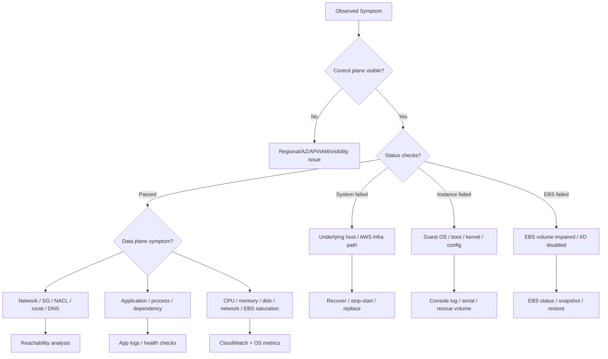
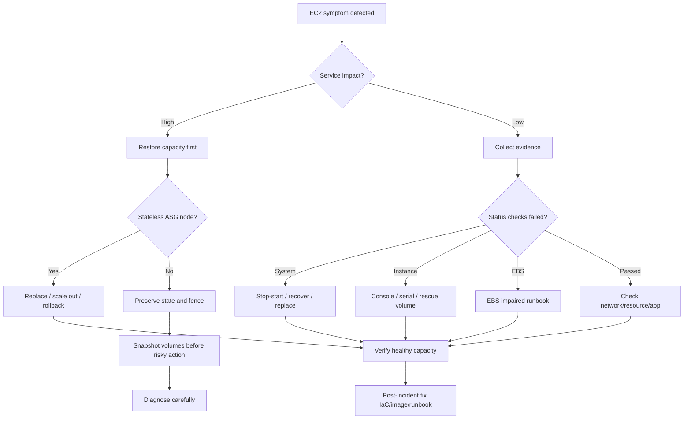

# Part 020 — EC2 Production Runbook and Debugging

> Debugging EC2 is not about knowing one magic command. It is about separating control plane, data plane, operating system, network, storage, and application failure quickly.

EC2 incidents are often misdiagnosed because teams jump directly to SSH.

That is a weak debugging model.

SSH is only one path into the machine. If SSH fails, the instance may still be healthy, the application may still be serving, or the root disk may be gone, or the security group may have changed, or the instance may be failing system status checks.

A production engineer needs a structured runbook.

This part covers:

- EC2 status checks,
- system vs instance vs attached EBS failures,
- boot failure,
- SSH/SSM loss,
- disk full,
- EBS latency,
- network reachability,
- CPU steal/saturation,
- memory pressure,
- kernel panic,
- ASG health replacement,
- safe recovery using stop/start, reboot, rescue volume, snapshot, AMI rollback, and replacement.

The goal is not to repair every machine manually. The goal is to restore service while preserving enough evidence to understand the failure.

---

## 1. Problem yang Diselesaikan

When an EC2 instance misbehaves, symptoms can be misleading.

Example symptoms:

- SSH timeout,
- application 5xx,
- instance status check failed,
- system status check failed,
- attached EBS status check failed,
- high EBS latency,
- disk full,
- CPU 100%,
- load average high but CPU low,
- kernel panic,
- boot loop,
- CloudWatch agent stopped,
- ASG replaces instance repeatedly,
- ALB marks target unhealthy,
- app process up but readiness fails,
- SSM connection unavailable,
- instance launches but never becomes healthy.

A weak response is:

```text
Try SSH. If it fails, reboot.
```

A strong response is:

```text
1. Classify the failure domain.
2. Stabilize service capacity.
3. Preserve evidence if useful.
4. Recover using the least destructive safe action.
5. Replace the node if it is rebuildable.
6. Fix the underlying image/config/storage/capacity problem.
```

---

## 2. Mental Model

Separate EC2 debugging into layers.



The key invariant:

> Do not treat every EC2 problem as an application problem. Do not treat every application symptom as an EC2 problem.

---

## 3. EC2 Status Checks

EC2 status checks are the first classification primitive.

There are three important classes:

| Check | Meaning | Typical recovery |
|---|---|---|
| System status check | underlying AWS infrastructure problem affecting the instance | stop/start, recover, or replace |
| Instance status check | guest OS or instance configuration problem | reboot, console logs, serial console, rescue volume, replace |
| Attached EBS status check | EBS volume attachment or volume health issue | inspect EBS status, enable I/O only with care, snapshot/restore, filesystem check |

Important distinction:

- **System check failed**: the host/infrastructure path is suspect.
- **Instance check failed**: the guest OS is suspect.
- **All checks passed**: network/app/resource saturation may still be broken.

Do not stop at status checks. They classify; they do not fully diagnose.

---

## 4. First Five Minutes of an EC2 Incident

Use a disciplined sequence.

```text
1. Is user-facing service degraded?
2. Is this one instance, one ASG, one AZ, one instance type, or many services?
3. Are EC2 status checks failing?
4. Is Auto Scaling replacing or stuck?
5. Is enough capacity healthy behind the load balancer?
6. Is the issue recent deployment/config/image related?
7. Is storage/network/resource saturation visible?
8. Should the instance be quarantined, replaced, or debugged live?
```

If the service is degraded, prioritize restoring capacity before deep forensics.

For rebuildable stateless instances:

```text
replace first, investigate from logs/snapshots later
```

For stateful instances:

```text
preserve state, fence writers, snapshot before risky repair
```

---

## 5. Evidence Collection

Before rebooting, stopping, or terminating, capture evidence when possible.

Useful evidence:

- instance ID,
- AMI ID,
- launch template version,
- instance type,
- AZ,
- subnet,
- capacity type,
- lifecycle state,
- status checks,
- system log,
- console screenshot,
- CloudWatch metrics,
- ASG activity history,
- ALB target health reason,
- recent deployment/config changes,
- EBS volume IDs and status,
- kernel logs,
- app logs,
- memory/disk state,
- process list,
- network connections.

Useful commands if shell access exists:

```bash
hostnamectl
uptime
who -b
systemctl --failed
journalctl -p warning..alert --since "2 hours ago"
dmesg -T | tail -200
df -h
findmnt
lsblk
free -m
vmstat 1 5
iostat -xz 1 5
sar -n DEV 1 5
ss -s
ss -lntp
ps aux --sort=-%mem | head
ps aux --sort=-%cpu | head
```

If shell access does not exist, use:

- EC2 console output,
- EC2 serial console if enabled,
- SSM Session Manager if available,
- CloudWatch logs,
- CloudWatch metrics,
- ASG activity history,
- ALB/NLB target health,
- VPC Flow Logs if enabled,
- EBS volume status,
- snapshot + rescue instance.

---

## 6. SSH Loss Runbook

SSH failure does not necessarily mean instance failure.

### 6.1 Classify the Failure

```text
Can EC2 control plane see instance? yes/no
Are status checks passing? yes/no
Can SSM connect? yes/no
Is application serving? yes/no
Did security group/NACL/route change? yes/no
Did disk fill? yes/no
Did sshd fail? yes/no
Did CPU/memory saturate? yes/no
```

### 6.2 Common Causes

| Cause | Signal |
|---|---|
| security group change | port 22 blocked |
| route/NACL issue | timeout, no flow logs return path |
| wrong key/user | permission denied |
| `sshd` down | app may still serve, SSM may work |
| disk full | login fails, sshd unstable |
| CPU starvation | connection slow/timeouts |
| memory pressure/OOM | sshd killed or shell cannot spawn |
| host/system issue | system status failed |
| guest OS issue | instance status failed |
| boot failure | no login, console log errors |

### 6.3 Recovery Order

Prefer least destructive actions:

1. Check status checks and target health.
2. Try SSM Session Manager if configured.
3. Check console output.
4. Check recent SG/NACL/route/IAM changes.
5. If app is healthy, avoid unnecessary reboot.
6. If non-stateful and unhealthy, replace via ASG.
7. If stateful, snapshot volumes before repair.
8. Use rescue volume if boot/config/disk issue.

---

## 7. Boot Failure Runbook

Boot failures often come from:

- bad AMI,
- broken kernel/initramfs,
- invalid `/etc/fstab`,
- corrupted filesystem,
- full root disk,
- cloud-init/user data hang,
- missing ENA/NVMe driver on older images,
- wrong architecture AMI for instance type,
- bad systemd dependency,
- KMS permission problem for encrypted volume,
- invalid launch template block device mapping.

### 7.1 First Checks

```text
1. Get system log / console output.
2. Check instance status check.
3. Check boot volume attachment.
4. Check recent AMI / launch template change.
5. Check KMS key access if encrypted.
6. Check user data logs if accessible.
7. Compare with last known good AMI.
```

### 7.2 Common Console Log Clues

| Clue | Likely issue |
|---|---|
| kernel panic | kernel/module/filesystem/driver issue |
| emergency mode | `/etc/fstab` or filesystem problem |
| cannot mount root | root volume mapping/driver/filesystem issue |
| cloud-init stuck | user data or metadata/dependency issue |
| permission denied KMS | encrypted volume/key/IAM path |
| no space left | root disk full |
| architecture mismatch | wrong AMI for instance architecture |

### 7.3 Rescue Volume Pattern

For stateful or evidence-preserving repair:

```text
1. Stop affected instance if safe.
2. Detach root volume.
3. Attach root volume to rescue instance in same AZ.
4. Mount volume read-only first if corruption suspected.
5. Inspect logs/config/filesystem.
6. Fix known issue or copy data.
7. Detach and reattach as root to original instance.
8. Start and validate.
```

Example commands on rescue instance:

```bash
lsblk
sudo mkdir -p /mnt/rescue
sudo mount -o ro,noload /dev/nvme1n1p1 /mnt/rescue
sudo less /mnt/rescue/var/log/cloud-init-output.log
sudo less /mnt/rescue/var/log/messages
sudo less /mnt/rescue/etc/fstab
```

If repair is risky, snapshot before modification.

---

## 8. Disk Full Runbook

Disk full is one of the most common EC2 incidents.

Symptoms:

- SSH login fails,
- app cannot write logs/temp files,
- package manager fails,
- database refuses writes,
- systemd services fail,
- CloudWatch agent stops,
- journald consumes root disk,
- Docker/container overlay fills disk.

### 8.1 Immediate Commands

```bash
df -h
df -ih
lsblk
sudo du -xh / --max-depth=1 2>/dev/null | sort -h
sudo journalctl --disk-usage
sudo docker system df 2>/dev/null || true
```

Check inode exhaustion separately:

```bash
df -ih
```

A disk can have free bytes but no free inodes.

### 8.2 Safe Cleanup Order

1. Remove known temporary files.
2. Rotate/compress logs.
3. Clean package cache.
4. Clean old container images if applicable.
5. Move large artifacts to durable storage.
6. Increase EBS volume size if growth is legitimate.
7. Expand filesystem.
8. Add alerting to prevent recurrence.

Avoid deleting unknown files during incident without understanding ownership.

### 8.3 Expanding EBS-backed Root Volume

High-level flow:

```text
1. Modify EBS volume size.
2. Wait for volume modification state.
3. Extend partition if needed.
4. Grow filesystem.
5. Validate df -h.
6. Update IaC/launch template so replacement instances match.
```

Linux examples:

```bash
lsblk
sudo growpart /dev/nvme0n1 1
sudo xfs_growfs -d /
# or for ext4
sudo resize2fs /dev/nvme0n1p1
```

Do not fix only the live instance. Fix the image, launch template, or volume mapping.

---

## 9. EBS Latency Runbook

EBS latency can come from the volume, the instance, the filesystem, or the application.

Symptoms:

- high application latency,
- high database commit latency,
- blocked I/O,
- high load average with low CPU,
- `iowait` high,
- EBS queue length high,
- volume throughput/IOPS at limit,
- instance EBS bandwidth at limit,
- filesystem journal stalls,
- snapshots/restores affecting read behavior if not warmed where relevant.

### 9.1 Initial Checks

```bash
iostat -xz 1 10
vmstat 1 10
pidstat -d 1 10
lsblk -o NAME,TYPE,SIZE,MOUNTPOINT,FSTYPE
```

Look for:

- high `await`,
- high `%util`,
- high queue depth,
- low throughput but high latency,
- one process dominating writes,
- write amplification,
- filesystem full or nearly full.

### 9.2 CloudWatch Metrics

Check:

- VolumeReadOps / VolumeWriteOps,
- VolumeReadBytes / VolumeWriteBytes,
- VolumeQueueLength,
- BurstBalance where applicable,
- VolumeThroughputPercentage where available,
- VolumeConsumedReadWriteOps where applicable,
- EC2 instance EBS bandwidth limits,
- instance-level network if EBS shares path constraints.

### 9.3 Common Causes

| Cause | Signal | Fix |
|---|---|---|
| volume IOPS limit | ops at provisioned limit | use gp3/io2/provision more IOPS |
| volume throughput limit | MB/s at limit | provision throughput or change type |
| instance EBS limit | all volumes slow on instance | larger instance / EBS-optimized capacity |
| small random writes | high ops, low MB/s | batching, WAL tuning, io2/gp3 sizing |
| filesystem full | latency spikes, write errors | cleanup/resize |
| noisy compaction | background process dominates I/O | schedule/limit compaction |
| bad volume type | workload mismatch | change volume type |
| impaired volume | EBS status check | EBS recovery path |

Do not upgrade volume type blindly. First identify whether the bottleneck is volume-level or instance-level.

---

## 10. CPU Saturation and CPU Steal

Symptoms:

- high CPU utilization,
- high run queue,
- request latency rises,
- GC time increases,
- app health checks timeout,
- low throughput despite high CPU,
- burstable instances lose credits.

Commands:

```bash
uptime
mpstat -P ALL 1 5
vmstat 1 5
pidstat -u 1 5
ps aux --sort=-%cpu | head -20
```

Look at:

- user CPU,
- system CPU,
- iowait,
- steal,
- run queue,
- per-core imbalance,
- CPU credits for burstable instances.

### CPU Steal

CPU steal means the guest wanted CPU but the hypervisor scheduled something else. On modern EC2 this is generally not the first suspect, but it can appear depending on instance class and virtualization conditions.

For burstable instances, CPU credit depletion is often a more direct explanation.

Production fixes:

- move off burstable for sustained CPU,
- use larger instance,
- reduce app concurrency,
- optimize hot path,
- adjust autoscaling target,
- split background tasks,
- pre-warm JVM/service,
- avoid noisy compaction during peak.

---

## 11. Memory Pressure and OOM

Symptoms:

- SSH slow/fails,
- app process killed,
- kernel OOM messages,
- high swap usage,
- GC thrashing,
- instance check may fail,
- health checks fail intermittently.

Commands:

```bash
free -m
vmstat 1 5
sudo dmesg -T | grep -i -E 'out of memory|oom|killed process'
ps aux --sort=-%mem | head -20
cat /proc/meminfo | head -40
```

For Java:

```bash
jcmd <pid> VM.native_memory summary
jcmd <pid> GC.heap_info
jstat -gcutil <pid> 1000 10
```

Common causes:

- heap too large for instance,
- native memory leak,
- direct buffer leak,
- too many threads,
- container memory limit mismatch,
- file cache pressure,
- log burst,
- batch job co-located with API,
- bad deployment increased memory footprint.

Recovery:

1. Restore capacity by replacing or scaling out.
2. Capture OOM evidence.
3. Reduce traffic or concurrency.
4. Roll back bad deployment.
5. Resize instance or tune memory.
6. Add memory alerting before OOM.

---

## 12. Network Reachability Runbook

Network issues often appear as app or SSH issues.

Check layers:

```text
Instance ENI -> security group -> NACL -> subnet route table -> IGW/NAT/TGW/VPC endpoint -> DNS -> peer service
```

Commands on instance:

```bash
ip addr
ip route
resolvectl status 2>/dev/null || cat /etc/resolv.conf
ss -lntp
curl -v http://169.254.169.254/latest/meta-data/instance-id
curl -v http://localhost:<port>/health
```

Questions:

- Is the app listening on the expected port?
- Is it bound to `127.0.0.1` instead of `0.0.0.0`?
- Did security group change?
- Did route table change?
- Did DNS resolution change?
- Is NAT gateway saturated or unavailable?
- Is a VPC endpoint policy blocking access?
- Did the instance lose source/destination checks relevance?
- Is ephemeral port exhaustion happening?

For load-balanced apps, check ALB target health reason.

A target can be unhealthy because:

- wrong health check path,
- app slow during startup,
- security group blocks ALB,
- app binds wrong interface,
- TLS mismatch,
- dependency failure causes readiness failure,
- instance overloaded.

---

## 13. Kernel Panic and Instance Crash

Symptoms:

- instance unreachable,
- instance status check failed,
- console output shows panic,
- sudden reboot,
- app logs stop abruptly,
- no graceful shutdown logs.

Possible causes:

- kernel bug,
- driver issue,
- filesystem corruption,
- memory corruption,
- incompatible AMI/kernel with instance type,
- bad kernel module,
- aggressive sysctl tuning,
- low-level storage issue,
- panic-on-OOM configuration.

Response:

1. Capture console output.
2. Preserve AMI/kernel version.
3. Identify recent OS/kernel changes.
4. Replace instance to restore service.
5. If repeated, roll back AMI or kernel.
6. Use crash dump infrastructure if required.
7. Remove unsafe kernel modules/tuning.

If an ASG replaces the instance, ensure logs are shipped off-instance before crash or via persistent logging.

---

## 14. ASG Health and Replacement Debugging

When instances repeatedly launch and terminate, debug the fleet contract.

Check:

- ASG activity history,
- launch template version,
- AMI ID,
- IAM instance profile,
- user data exit behavior,
- security group,
- target group health reason,
- lifecycle hook state,
- instance warmup,
- health check grace period,
- subnet IP capacity,
- KMS permissions,
- EBS mapping,
- service quotas,
- capacity errors,
- instance architecture mismatch.

Common loop:

```text
Launch -> boot slowly -> ALB health fails -> ASG terminates -> replacement launches -> repeats
```

Fixes:

- increase health check grace period if startup is valid but slow,
- fix readiness endpoint if it depends on optional dependencies,
- use lifecycle hook to complete bootstrap before registration,
- reduce AMI/user-data startup time,
- roll back launch template,
- check target group matcher/path/port.

Do not disable health checks permanently. Fix the contract.

---

## 15. Replace vs Repair Decision

Use this decision table.

| Situation | Prefer replace | Prefer repair/investigate |
|---|---:|---:|
| Stateless ASG node unhealthy | Yes | Only after replacement if recurring |
| Bad AMI rollout | Roll back + replace | Inspect sample instance |
| Full root disk on one node | Usually | If recurring, fix image/logging |
| Stateful EBS node | No, not blindly | Yes, preserve/snapshot/fence |
| Kernel panic across fleet | Replace to restore | Investigate AMI/kernel immediately |
| SSH lost but app healthy | No | Investigate non-disruptively |
| System status failed | Often stop/start or replace | Preserve if stateful |
| EBS impaired | No blind termination | Snapshot/restore/fix I/O carefully |

Guiding rule:

> Rebuildable compute should be replaced quickly. Authoritative state should be preserved carefully.

---

## 16. Safe Recovery Patterns

### 16.1 Reboot

Good for:

- transient guest OS issues,
- stuck process/systemd state,
- kernel/resource weirdness where state is externalized.

Risk:

- loses volatile evidence,
- may not fix boot issue,
- may make broken instance unavailable longer.

### 16.2 Stop/Start

Good for:

- moving instance to new underlying host,
- system status issue,
- some network/host-level anomalies.

Risk:

- public IP changes unless Elastic IP,
- instance store data lost,
- downtime,
- not possible for some instance states/configs.

### 16.3 Terminate/Replace

Good for:

- stateless ASG nodes,
- immutable infrastructure,
- bad individual node,
- fast service restoration.

Risk:

- evidence loss,
- local state loss,
- bad launch template may recreate same failure.

### 16.4 Snapshot and Restore

Good for:

- stateful EBS recovery,
- forensic preservation,
- filesystem repair safety,
- volume migration.

Risk:

- crash-consistent unless app-consistent procedure used,
- restore time/performance considerations,
- KMS/key permissions.

### 16.5 Rescue Instance

Good for:

- boot failure,
- bad fstab,
- disk full preventing boot,
- sshd config broken,
- filesystem inspection.

Risk:

- accidental writes to damaged filesystem,
- wrong device mounted,
- data corruption if original writer still active.

---

## 17. Incident Decision Tree



---

## 18. Production Runbook Templates

### 18.1 Instance Unreachable

```text
Trigger:
- SSH/SSM/app unreachable or status check failed.

Immediate actions:
1. Record instance ID, AZ, instance type, AMI, launch template version.
2. Check EC2 system/instance/EBS status checks.
3. Check ASG/target group health.
4. Determine if user-facing capacity is below safe threshold.
5. If stateless and capacity degraded, replace/scale out.
6. If stateful, snapshot/fence before destructive actions.
7. Pull console output and recent CloudWatch metrics.
8. Check recent deployments/config/security group changes.
9. Choose recovery path: reboot, stop/start, rescue, replace.
10. Update incident notes with root cause hypothesis.
```

### 18.2 Disk Full

```text
Trigger:
- disk usage > 90%, write errors, ssh/login/app failure.

Actions:
1. Check df -h and df -ih.
2. Identify large directories with du.
3. Check journald/container/log growth.
4. Free safe temporary space.
5. Resize EBS if growth is legitimate.
6. Grow partition/filesystem.
7. Fix log rotation/lifecycle.
8. Update launch template/AMI sizing.
9. Add alert before 80/90/95% thresholds.
```

### 18.3 EBS Latency

```text
Trigger:
- high disk latency, database commit latency, iowait, queue depth.

Actions:
1. Check iostat/vmstat/pidstat.
2. Check EBS CloudWatch metrics.
3. Determine volume limit vs instance limit.
4. Check filesystem fullness and noisy processes.
5. Temporarily reduce workload if needed.
6. Increase gp3 IOPS/throughput or move to io2 if justified.
7. Move to larger instance if instance EBS bandwidth is limiting.
8. Review application write amplification.
9. Add dashboard by volume and instance.
```

### 18.4 Bad Launch Template or AMI

```text
Trigger:
- new instances fail health after rollout/instance refresh.

Actions:
1. Stop rollout/instance refresh.
2. Compare old vs new launch template version.
3. Check ASG activity errors.
4. Get console output from failed node.
5. Validate AMI architecture, KMS, user data, IAM profile.
6. Roll back to last known good launch template.
7. Replace failed nodes.
8. Fix image pipeline validation.
```

---

## 19. Common Mistakes

### Mistake 1: SSH-First Debugging

SSH is useful, but not the first truth source. Start with impact, status checks, ASG/target health, metrics, and recent changes.

### Mistake 2: Rebooting Before Capturing Evidence

Reboot may erase volatile evidence and hide root cause.

### Mistake 3: Repairing Stateless Nodes by Hand

Manual repair creates drift. Replace stateless nodes and fix the image/config.

### Mistake 4: Terminating Stateful Nodes Too Quickly

Stateful nodes require fencing, snapshotting, and ownership clarity.

### Mistake 5: Ignoring ASG Activity History

ASG activity often explains failed launches, health failures, and capacity errors.

### Mistake 6: Treating Disk Full as One-Time Cleanup

Disk full is a capacity contract failure. Fix log rotation, volume size, lifecycle, or application behavior.

### Mistake 7: Upgrading EBS Without Finding the Bottleneck

If the instance EBS bandwidth is saturated, changing volume type may not fix the issue.

### Mistake 8: No Off-Instance Logs

If logs live only on the failed instance, every incident becomes partially blind.

### Mistake 9: Bad Health Check Grace Period

Too short causes replacement loops. Too long hides broken deployments.

### Mistake 10: No Known-Good Rollback

Every launch template and AMI rollout needs a known-good previous version.

---

## 20. Mini Case Study: Replacement Loop After AMI Rollout

A team rolls out a new AMI to an Auto Scaling group.

Symptoms:

- new instances launch,
- instances pass EC2 system checks,
- ALB marks them unhealthy,
- ASG terminates them,
- desired capacity never stabilizes,
- deployment pipeline retries.

Initial wrong response:

```text
Increase max capacity and retry.
```

Actual investigation:

- ASG activity says target group health check failed.
- Console output shows app started late because migration script ran during boot.
- Health check grace period was 120 seconds.
- New AMI boot time is 7 minutes.
- Readiness endpoint returns failure while optional dependency cache warms.

Correct fixes:

- roll back launch template to last known good AMI,
- move migration out of instance boot,
- separate liveness from readiness,
- adjust lifecycle hook/bootstrap completion,
- measure AMI boot time in image pipeline,
- set realistic health check grace period,
- add canary ASG before fleet-wide refresh.

Lesson:

> EC2 passed. The application readiness contract failed.

---

## 21. Debugging Checklist

For every EC2 incident, check:

- [ ] User-facing impact.
- [ ] Instance ID, AZ, instance type, AMI, launch template version.
- [ ] System status check.
- [ ] Instance status check.
- [ ] Attached EBS status check.
- [ ] ASG lifecycle/activity state.
- [ ] Target group health reason.
- [ ] Recent deploy/config/IAM/KMS/security group changes.
- [ ] CPU/memory/disk/network/EBS metrics.
- [ ] Console output/system log.
- [ ] SSM availability.
- [ ] Off-instance logs.
- [ ] EBS volume status and attachment.
- [ ] Subnet IP capacity if launch failures.
- [ ] Service quota if scale-out failures.
- [ ] Recovery path chosen and reason documented.
- [ ] Post-incident IaC/image/runbook fix.

---

## 22. Summary

EC2 debugging is a classification problem.

Do not start with assumptions. Start with layers:

- control plane,
- status checks,
- Auto Scaling and target health,
- network reachability,
- storage health,
- resource saturation,
- guest OS,
- application readiness.

For stateless instances, prefer replacement over manual repair. For stateful instances, preserve state before destructive action. For recurring failures, fix the launch template, AMI, user data, storage sizing, health checks, or scaling policy.

The strongest EC2 runbook is not a list of commands. It is a decision system that answers:

> Is this node worth saving, or should the system safely rebuild it?

---

## 23. References

- AWS Documentation — Status checks for Amazon EC2 instances
- AWS Documentation — Troubleshoot EC2 Linux instances with failed status checks
- AWS Documentation — Troubleshoot an unreachable Amazon EC2 instance
- AWS Documentation — EC2 Serial Console
- AWS Documentation — Amazon EBS volume status checks
- AWS Documentation — Work with an impaired Amazon EBS volume
- AWS Documentation — Troubleshoot unhealthy instances in Amazon EC2 Auto Scaling
