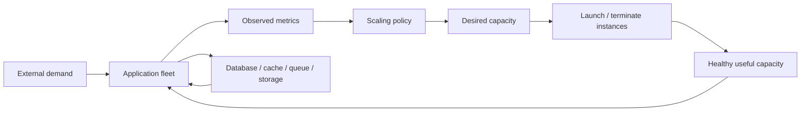
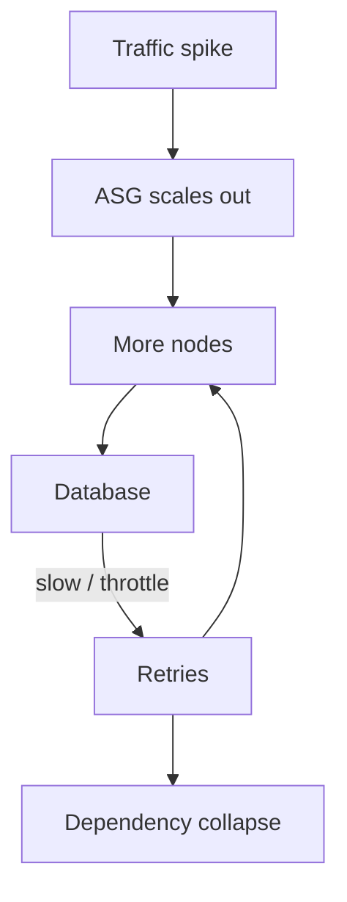
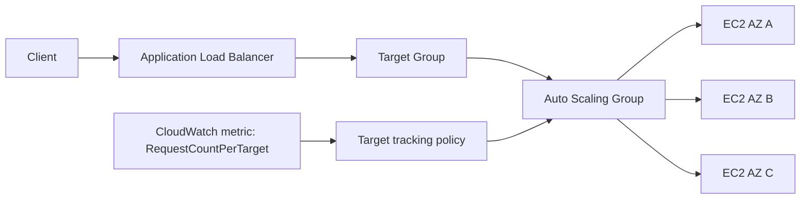
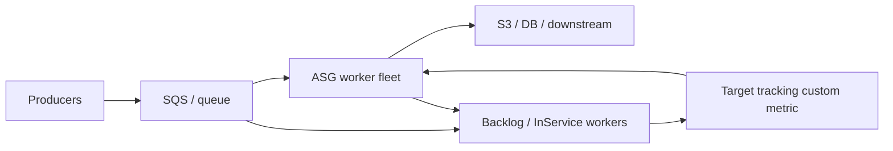

# Part 021 — Auto Scaling Control Loop

> Auto Scaling is not magic elasticity. It is a delayed feedback controller. If the signal is bad, the actuator is slow, or the plant has hidden saturation, the system oscillates or fails while looking “configured correctly”.

Most teams learn EC2 Auto Scaling as a feature:

- create Auto Scaling Group,
- attach Launch Template,
- set min/max/desired,
- add CPU scaling policy,
- done.

That is enough for demos.

It is not enough for production.

In production, Auto Scaling is a control system. It watches some signal, decides whether capacity is wrong, launches or terminates instances, waits for instances to become useful, and repeats. Every part of that loop can lie.

This part builds the mental model needed before designing Auto Scaling Groups in detail.

We will cover:

- demand, capacity, and saturation,
- desired capacity as controller output,
- scaling policies as feedback rules,
- warmup, cooldown, and measurement delay,
- metric selection,
- queue-based scaling,
- backpressure,
- oscillation,
- scale-out vs scale-in asymmetry,
- production runbooks.

---

## 1. Problem yang Diselesaikan

The real problem is not “how to autoscale EC2”.

The real problem is:

> How do we keep enough healthy compute capacity online under changing load without overpaying, oscillating, or damaging downstream systems?

That problem has several hard properties.

First, demand changes faster than capacity can appear. An HTTP spike arrives immediately. A new EC2 instance may need time to launch, boot, run user data, pull configuration, register to the load balancer, warm caches, pass health checks, and start accepting traffic.

Second, metrics are delayed and aggregated. CloudWatch metrics have periods. Application metrics may be pushed late. Load balancer target metrics lag behind reality. By the time a policy reacts, the demand may already be different.

Third, more instances do not always mean more throughput. You may hit database connections, EBS throughput, S3 request amplification, NAT gateway limits, external API quotas, lock contention, JVM GC pressure, or queue partition bottlenecks.

Fourth, scale-in is dangerous. Scaling out usually costs money. Scaling in can drop in-flight work, destroy warm caches, detach state, interrupt batch jobs, or create a second incident while recovering from the first.

A naïve configuration looks like this:

```text
If CPU > 70%, add instances.
If CPU < 30%, remove instances.
```

That looks reasonable, but it fails for many real workloads:

- CPU may be low because threads are blocked on I/O.
- CPU may be high because downstream is slow and retries amplify work.
- CPU average may hide one hot shard.
- CPU may rise after traffic has already exceeded queue capacity.
- CPU may fall during an outage because all requests fail fast.
- CPU may remain high during scale-out because new nodes are not ready yet.
- CPU may drop after over-scaling, causing aggressive scale-in and oscillation.

The production skill is to identify the correct control signal and shape the loop.

---

## 2. Mental Model: Auto Scaling as Feedback Control

Think of an Auto Scaling system like this:



The loop has six important concepts.

### 2.1 Plant

The plant is the thing being controlled: your application fleet.

In AWS EC2 Auto Scaling, the plant is usually:

- an Auto Scaling Group behind an ALB/NLB,
- an ASG running workers from a queue,
- a node pool for ECS/EKS capacity,
- a service-specific compute pool,
- a stateful fleet with careful restrictions.

The plant has a capacity curve.

```text
throughput = f(instance_count, instance_type, app_efficiency, downstream_capacity)
```

The dangerous assumption is that this curve is linear.

It rarely is.

Adding instances helps until something else saturates.

### 2.2 Sensor

The sensor is the metric used by the policy.

Examples:

- average CPU utilization,
- ALB request count per target,
- target response time,
- queue backlog per instance,
- custom application saturation,
- memory pressure,
- active connections,
- p95/p99 latency,
- outstanding work units,
- downstream error rate.

Bad sensor = bad scaling.

A scaling metric should ideally satisfy this property:

> If capacity doubles while demand stays constant, the metric should roughly halve.

This is why **request count per target** can be better than raw request count for web fleets, and **backlog per worker** can be better than raw queue size for worker fleets.

### 2.3 Controller

The controller is the scaling policy.

It answers:

```text
Given observed metric M, what should desired capacity become?
```

Common controller types:

- target tracking,
- step scaling,
- simple scaling,
- scheduled scaling,
- predictive scaling,
- manual desired capacity changes,
- custom controller via EventBridge/Lambda/SDK.

Target tracking is generally the best default for proportional metrics. Step scaling is useful when you need explicit jumps for known thresholds. Scheduled scaling is useful when demand is predictable by calendar. Custom controllers are useful when workload semantics are richer than one metric.

### 2.4 Actuator

The actuator is the thing that changes capacity:

- EC2 launch,
- EC2 termination,
- lifecycle hook wait,
- health check replacement,
- instance refresh,
- mixed instance allocation,
- Spot interruption replacement,
- warm pool promotion.

The actuator is slow compared to traffic.

That delay matters.

### 2.5 Delay

Every feedback loop has delay:

- metric collection period,
- CloudWatch alarm evaluation,
- ASG scaling activity,
- EC2 launch time,
- AMI boot time,
- user data execution,
- dependency readiness,
- ALB target registration,
- health check grace period,
- cache warmup,
- JVM warmup,
- application readiness.

Delay creates overshoot.

If the controller reacts aggressively to stale metrics, it launches too much. If it scales in aggressively after the spike passes, it removes too much.

### 2.6 Saturation

Saturation is where additional demand hurts the system faster than capacity can catch up.

Examples:

- worker queue grows faster than workers can drain it,
- ALB targets are all at max concurrency,
- JVM heap enters GC collapse,
- database connection pool exhausted,
- EBS queue length rises,
- downstream API throttles,
- NAT or ephemeral ports become bottleneck,
- S3 prefix/object layout causes request amplification,
- one shard is hot while fleet average looks healthy.

Autoscaling cannot fix an unbounded saturation chain by itself. It must be paired with backpressure.

---

## 3. Core AWS Concepts

Amazon EC2 Auto Scaling automatically launches or terminates EC2 instances based on policies, health status checks, and schedules. It also monitors instance health and can replace terminated or impaired instances to maintain desired capacity.

The key objects are:

| Concept | Meaning | Production question |
|---|---|---|
| Auto Scaling Group | Fleet boundary | What unit is being controlled? |
| Desired capacity | Number or capacity units wanted | Is desired capacity safe under current demand? |
| Minimum capacity | Lower bound | Can the service survive at this floor? |
| Maximum capacity | Upper bound | Is this quota/cost/downstream-safe? |
| Launch Template | Instance launch contract | Is launch reproducible and versioned? |
| Scaling policy | Control rule | What metric drives capacity changes? |
| Health check | Replacement signal | Does health represent usefulness? |
| Warmup | Time before new capacity influences scaling math | Is this close to real readiness? |
| Cooldown | Pause after simple scaling | Are we preventing oscillation or hiding failure? |
| Lifecycle hook | Pause at launch/terminate | Can we prepare/drain safely? |
| Termination policy | Scale-in victim selection | Are we killing the right instances? |

Important distinction:

```text
Launched != Ready != Useful != Warm
```

An EC2 instance is not useful just because the EC2 API says it is running.

A production instance is useful when:

- OS booted,
- app dependencies loaded,
- config fetched,
- secrets loaded,
- process started,
- health checks passed,
- target registered,
- caches warmed enough,
- telemetry emitting,
- it can serve real traffic within SLO.

Your scaling configuration should be built around useful capacity, not launched capacity.

---

## 4. Scaling Policy Types

### 4.1 Target Tracking

Target tracking tries to keep a metric near a target value.

Example:

```text
Keep average CPU around 55%.
Keep ALB request count per target around 1,000 requests/minute.
Keep queue backlog per instance around 500 messages.
```

This is usually the best first policy when the metric is proportional to capacity.

Good target tracking metrics:

- average CPU for CPU-bound stateless service,
- ALBRequestCountPerTarget for request-driven web service,
- custom backlog per worker for queue workers,
- custom active sessions per node if sessions distribute evenly.

Bad target tracking metrics:

- raw request count,
- raw queue depth,
- p99 latency alone,
- error rate alone,
- memory used when memory does not fall after scaling,
- downstream saturation metric that more app nodes can worsen.

Target tracking is not a replacement for understanding the workload. It needs a metric that moves predictably when capacity changes.

### 4.2 Step Scaling

Step scaling changes capacity in predefined increments based on alarm breach size.

Example:

```text
CPU 70-80%  => add 2 instances
CPU 80-90%  => add 5 instances
CPU > 90%   => add 10 instances
```

This is useful when you know the workload has nonlinear thresholds.

It is also useful when you want conservative scale-in but aggressive scale-out.

### 4.3 Simple Scaling

Simple scaling is older and uses cooldown more directly.

It can work for simple systems, but target tracking or step scaling usually gives better control.

### 4.4 Scheduled Scaling

Scheduled scaling sets capacity at known times.

Use it when demand is calendar-shaped:

- business hours,
- batch windows,
- trading hours,
- monthly reporting,
- public campaign launch,
- school schedule,
- planned traffic events.

Scheduled scaling is not a replacement for reactive scaling. It is a pre-warming mechanism.

### 4.5 Predictive Scaling

Predictive scaling forecasts demand from historical patterns.

Use it when demand is periodic and stable enough to forecast. Do not rely on it alone for unexpected spikes.

### 4.6 Custom Controller

Sometimes a single metric is insufficient.

A custom controller may compute desired capacity from multiple signals:

```text
desired_workers = ceil(
  visible_backlog / target_messages_per_worker
)
```

or:

```text
desired_capacity = max(
  capacity_from_request_rate,
  capacity_from_latency_guardrail,
  capacity_from_queue_backlog,
  minimum_safe_capacity
)
```

Use custom controllers carefully. You are building an operational subsystem, not a clever script.

---

## 5. Metric Selection: The Most Important Decision

A scaling policy is only as good as its metric.

### 5.1 Metric Categories

| Metric category | Example | Scaling usefulness |
|---|---|---|
| Load | request count, queue depth | Good if normalized by capacity |
| Utilization | CPU, network, disk I/O | Good when bottleneck is that resource |
| Saturation | queue wait, thread pool queue, backlog per worker | Very useful |
| Errors | 5xx, timeout, throttling | Guardrail, not usually primary scaler |
| Latency | p95/p99 | Guardrail, not always primary scaler |
| Cost | spend/hour | Policy constraint, not primary scaler |
| Downstream pressure | DB connections, throttling | Guardrail/backpressure signal |

### 5.2 Good Metric Test

Ask five questions.

1. Does the metric rise when demand rises?
2. Does the metric fall when capacity rises?
3. Does the metric represent useful work, not noise?
4. Is the metric available quickly enough?
5. Can the metric be gamed by failure?

Example: CPU for web API.

CPU is good when requests are CPU-bound. CPU is bad when the app is I/O-bound and spends most time waiting on database, Redis, S3, or remote APIs.

Example: p99 latency.

Latency is important, but as a primary scaling signal it can be noisy. Latency may rise because downstream is failing. Adding instances may amplify retries and make it worse.

Example: queue depth.

Raw queue depth is incomplete. 10,000 messages is large for 2 workers but small for 2,000 workers. Use backlog per worker or age of oldest message.

### 5.3 Recommended Metrics by Workload

| Workload | Primary scaling signal | Guardrail signals |
|---|---|---|
| CPU-bound HTTP API | CPU utilization or request count per target | latency, 5xx, DB pool saturation |
| I/O-bound HTTP API | request count per target + app concurrency | latency, downstream timeout, connection pool |
| Queue worker | backlog per worker or oldest message age | retry count, DLQ growth, downstream throttle |
| Batch processor | job queue depth + job runtime | Spot interruption rate, checkpoint age |
| WebSocket/session service | active connections per node | memory, network, reconnect storm |
| Cache fleet | memory pressure + request rate | eviction rate, hot key, network |
| JVM service | request rate per target + CPU | GC time, heap pressure, thread pool queue |
| Image/video processing | job backlog + CPU/GPU utilization | local disk pressure, object store error |
| Stateful shard nodes | usually manual/custom | replication lag, shard ownership, quorum |

---

## 6. Warmup, Cooldown, and Readiness

### 6.1 Instance Warmup

Instance warmup tells Auto Scaling how long a newly launched instance needs before it should be considered in certain scaling calculations.

Warmup should approximate useful readiness.

Bad warmup:

```text
30 seconds, because EC2 is running by then.
```

Better warmup:

```text
Boot + user data + app start + target registration + first stable readiness window.
```

If warmup is too short, the controller assumes new capacity is useful too early and may under-scale during a spike.

If warmup is too long, the controller may over-scale because it ignores capacity that is already serving.

### 6.2 Cooldown

Cooldown is mainly relevant to simple scaling. It prevents repeated scaling actions too quickly.

Cooldown is not a substitute for good metrics.

If cooldown is too short:

- oscillation increases,
- duplicate scale-out can happen,
- scale-in may happen before load stabilizes.

If cooldown is too long:

- the fleet reacts slowly,
- backlog grows,
- manual intervention becomes common.

### 6.3 Health Check Grace Period

Health check grace period gives new instances time before health checks can cause replacement.

This is different from warmup.

| Mechanism | Purpose |
|---|---|
| Warmup | Scaling math and capacity estimation |
| Health check grace period | Prevent premature replacement |
| Cooldown | Pause simple scaling reactions |
| Lifecycle hook | Execute custom launch/termination action |
| ALB deregistration delay | Drain connections before target removal |

Confusing these mechanisms creates subtle production failures.

---

## 7. Scale-Out and Scale-In Are Not Symmetric

Scale-out and scale-in have different risk profiles.

### 7.1 Scale-Out Risk

Scale-out risks:

- cost spike,
- downstream overload,
- quota exhaustion,
- IP exhaustion,
- bad AMI launch storm,
- secret/config fetch storm,
- image pull storm,
- database connection storm,
- cache cold-start storm.

### 7.2 Scale-In Risk

Scale-in risks:

- terminating active requests,
- killing queue workers mid-job,
- losing ephemeral state,
- increasing latency by removing warm cache,
- reducing capacity during partial outage,
- causing shard movement,
- creating repeat scale-out immediately after.

Therefore, production scaling is usually:

```text
Scale out fast enough.
Scale in slowly and safely.
```

For HTTP services, use deregistration delay and connection draining.

For workers, use termination lifecycle hooks and checkpointing.

For stateful nodes, use explicit evacuation and fencing. Often, do not use ordinary ASG scale-in for state ownership.

---

## 8. Queue-Based Scaling

Queue workloads need a different model.

A queue creates elasticity buffer. The fleet does not need to match instantaneous arrival rate; it needs to control backlog age.

Core variables:

```text
arrival_rate = messages_per_second_in
service_rate_per_worker = messages_per_second_per_instance
worker_count = number_of_healthy_workers
drain_rate = worker_count * service_rate_per_worker
backlog = visible_messages + in_flight_messages
backlog_age = age_of_oldest_message
```

A useful target can be:

```text
target_backlog_per_worker = acceptable_latency_seconds * service_rate_per_worker
```

Then:

```text
desired_workers = ceil(backlog / target_backlog_per_worker)
```

Example:

```text
Average worker processes 5 messages/second.
SLO allows 120 seconds of queue wait.
Target backlog per worker = 5 * 120 = 600 messages.
Current backlog = 24,000 messages.
Desired workers = ceil(24000 / 600) = 40 workers.
```

But this formula assumes stable service rate. If downstream throttles, service rate falls. Scaling more workers may worsen throttling.

So add guardrails:

```text
if downstream_throttle_rate > threshold:
    freeze_scale_out_or_reduce_concurrency
```

Backpressure is part of capacity control.

---

## 9. Backpressure and Downstream Protection

Autoscaling only controls compute count. It does not automatically protect dependencies.

Common downstream dependencies:

- RDS/Aurora,
- DynamoDB,
- OpenSearch,
- Redis/ElastiCache,
- S3,
- external APIs,
- payment providers,
- identity providers,
- internal services,
- Kafka/Kinesis/SQS.

A safe scaling design includes:

- connection pool limits,
- concurrency limits,
- request timeouts,
- circuit breakers,
- retry budgets,
- queue visibility timeout aligned with job duration,
- DLQ handling,
- rate-limited worker loops,
- per-tenant fairness,
- load shedding for non-critical work.

Without these, Auto Scaling can amplify incidents.



Good elasticity is bounded elasticity.

---

## 10. Implementation Pattern: HTTP Service with ALBRequestCountPerTarget

For a stateless HTTP service, a common pattern is:

- ASG across at least two AZs,
- Launch Template with immutable AMI,
- ALB target group health check,
- target tracking on ALB request count per target,
- CPU as guardrail,
- min capacity for static stability,
- conservative scale-in cooldown or disable scale-in for target tracking if needed,
- lifecycle hook for termination drain if app needs extra cleanup.



Pseudo Terraform skeleton:

```hcl
resource "aws_autoscaling_group" "api" {
  name                      = "api-prod"
  min_size                  = 6
  max_size                  = 60
  desired_capacity          = 9
  health_check_type         = "ELB"
  health_check_grace_period = 300

  vpc_zone_identifier = var.private_subnet_ids
  target_group_arns   = [aws_lb_target_group.api.arn]

  launch_template {
    id      = aws_launch_template.api.id
    version = aws_launch_template.api.latest_version
  }

  instance_refresh {
    strategy = "Rolling"
    preferences {
      min_healthy_percentage = 90
      instance_warmup        = 300
    }
  }

  tag {
    key                 = "Service"
    value               = "api"
    propagate_at_launch = true
  }
}

resource "aws_autoscaling_policy" "api_req_per_target" {
  name                   = "api-request-count-per-target"
  autoscaling_group_name = aws_autoscaling_group.api.name
  policy_type            = "TargetTrackingScaling"

  target_tracking_configuration {
    predefined_metric_specification {
      predefined_metric_type = "ALBRequestCountPerTarget"
      resource_label         = "${aws_lb.api.arn_suffix}/${aws_lb_target_group.api.arn_suffix}"
    }

    target_value     = 1000
    disable_scale_in = false
  }
}
```

The exact numbers are not reusable. The pattern is reusable.

You must benchmark:

- request rate per instance at acceptable latency,
- CPU at that request rate,
- memory at that request rate,
- downstream connections,
- startup time,
- warmup time,
- degradation point.

---

## 11. Implementation Pattern: Queue Workers with Custom Backlog Per Instance

Queue workers often need custom metrics.



Custom metric calculation:

```text
backlog_per_instance = approximate_visible_messages / max(in_service_worker_count, 1)
```

Better metric:

```text
work_seconds_per_instance = backlog * avg_processing_seconds / max(in_service_worker_count, 1)
```

Scale based on the amount of time required to drain work, not just message count.

Worker termination behavior:

```text
on SIGTERM:
  stop polling new messages
  finish current message if safe
  checkpoint if long-running
  release lease / extend visibility timeout carefully
  publish shutdown heartbeat
  exit before lifecycle timeout
```

For queue workers, scale-in safety is more important than scale-in speed.

---

## 12. Capacity Math

A practical starting model:

```text
required_instances = ceil(peak_demand / safe_per_instance_capacity)
```

Where:

```text
safe_per_instance_capacity = measured_capacity_at_slo * safety_factor
```

Example:

```text
Measured c7g.large API instance:
  400 RPS at p95 < 120ms
  CPU around 62%
  DB pool stable
  error rate normal

Safety factor:
  0.65

Safe capacity:
  400 * 0.65 = 260 RPS

Peak target:
  5,000 RPS

Required instances:
  ceil(5000 / 260) = 20
```

Then decide:

```text
min_size      = static stability floor
max_size      = downstream-safe ceiling
desired       = normal baseline
scale_target  = metric value that keeps SLO
warmup        = real useful readiness time
```

Do not set `max_size` based only on budget. Set it based on:

- account quota,
- subnet IP capacity,
- downstream safe concurrency,
- deployment blast radius,
- emergency headroom,
- cost guardrail.

---

## 13. Failure Modes

### 13.1 Metric Does Not Represent Bottleneck

Symptom:

- CPU low,
- latency high,
- scaling does not happen.

Cause:

- app is blocked on DB or remote API,
- threads exhausted,
- connection pool waiting,
- EBS or network saturated.

Fix:

- expose app saturation metric,
- scale on request count per target or concurrency,
- add downstream guardrail,
- reduce timeout/retry amplification.

### 13.2 Scaling Oscillation

Symptom:

- ASG repeatedly scales out and in,
- cost spikes,
- latency unstable.

Cause:

- aggressive thresholds,
- metric delay,
- warmup too short,
- scale-in too fast,
- bursty traffic.

Fix:

- increase warmup accuracy,
- use target tracking,
- slow scale-in,
- add minimum capacity,
- use scheduled pre-warm for known spikes.

### 13.3 Launch Storm Hits Dependency

Symptom:

- new instances launch,
- config/secrets/DB/cache calls spike,
- dependency throttles,
- new instances fail health checks.

Cause:

- all nodes bootstrap at once,
- no jitter,
- no local cache,
- dependency quota too low.

Fix:

- add bootstrap jitter,
- use warm pools where appropriate,
- cache immutable artifacts,
- limit concurrent instance refresh,
- pre-provision dependency limits.

### 13.4 Max Capacity Ceiling Hit

Symptom:

- desired capacity reaches max,
- metric remains above target,
- backlog grows.

Cause:

- max size too low,
- quota/subnet/capacity constraints,
- downstream limit intentionally caps fleet.

Fix:

- know whether this is safety or misconfiguration,
- raise max only if downstream can handle it,
- shed low-priority load,
- add queue/backpressure,
- request quota increase if needed.

### 13.5 Scale-In Kills Useful Work

Symptom:

- jobs restart,
- duplicate work,
- partial writes,
- latency spikes after scale-in.

Cause:

- no termination drain,
- worker does not handle SIGTERM,
- lifecycle hook missing,
- visibility timeout misaligned.

Fix:

- implement graceful termination,
- use lifecycle hooks,
- checkpoint long jobs,
- disable or slow scale-in during critical windows.

---

## 14. Operational Runbook

### Situation A — Traffic Spike, Latency Rising

1. Check if ASG desired capacity is increasing.
2. Check if new instances are launching successfully.
3. Check `InService` vs `Pending` vs `Terminating`.
4. Check ALB healthy host count.
5. Check target response time and 5xx.
6. Check dependency saturation: DB, cache, downstream APIs.
7. Check whether max capacity or quota was hit.
8. Decide whether to temporarily increase desired/min/max.
9. If dependency is saturated, prefer backpressure/load shedding over blind scale-out.

### Situation B — ASG Scales Out but Latency Does Not Improve

1. Confirm new instances are receiving traffic.
2. Check app readiness vs ALB health.
3. Compare per-instance request count distribution.
4. Check downstream connection pool and timeout metrics.
5. Check CPU, memory, network, EBS.
6. Check if one shard/tenant/key is hot.
7. Check whether instances are cold and still warming.
8. Shift metric from CPU to request/concurrency/saturation if needed.

### Situation C — ASG Oscillates

1. Inspect scaling activity history.
2. Compare metric period with warmup and traffic burst duration.
3. Check scale-in aggressiveness.
4. Check whether metric falls too sharply after scale-out.
5. Increase minimum capacity if baseline is too low.
6. Disable scale-in temporarily during incident if needed.
7. Replace brittle step thresholds with target tracking where appropriate.

### Situation D — Queue Backlog Exploding

1. Measure arrival rate.
2. Measure processing rate per worker.
3. Calculate required workers.
4. Check worker error/retry rate.
5. Check downstream throttling.
6. Check visibility timeout and DLQ growth.
7. Increase workers only if downstream can absorb work.
8. Otherwise throttle producers or reduce concurrency.

---

## 15. Checklist

Before enabling autoscaling:

- [ ] Workload type is clear: request, queue, batch, session, stateful, mixed.
- [ ] Primary scaling metric is proportional to capacity.
- [ ] Guardrail metrics exist for downstream saturation.
- [ ] Min capacity supports static stability assumptions.
- [ ] Max capacity is downstream-safe and quota-safe.
- [ ] Instance warmup reflects real readiness.
- [ ] Health check grace period prevents premature replacement.
- [ ] Scale-in behavior is safe for in-flight work.
- [ ] Lifecycle hooks exist where launch/termination requires custom action.
- [ ] Application handles SIGTERM or shutdown signal correctly.
- [ ] Dashboards show desired, in-service, pending, terminating, healthy hosts.
- [ ] Scaling activity history is reviewed during incidents.
- [ ] Quotas and subnet IP capacity are known.
- [ ] Load test validates scaling behavior, not only single-instance capacity.

---

## 16. Mini Case Study: The CPU Policy That Failed

A team runs a Java API on EC2 behind ALB.

Initial configuration:

```text
min = 4
max = 20
target tracking CPU = 60%
```

During a campaign, latency rises to 3 seconds. CPU remains around 35%. ASG does not scale.

The team manually doubles desired capacity. Latency improves slightly but remains high.

Investigation:

- threads are blocked waiting for DB connections,
- DB connection pool is capped at 40 per node,
- each node has too much concurrency,
- retries amplify load,
- CPU is low because requests wait,
- ALB request count per target is high,
- p99 latency is high,
- DB CPU is high.

Fix:

- primary scaling metric changed to ALB request count per target,
- per-node concurrency reduced,
- DB pool right-sized,
- retry budget added,
- circuit breaker added,
- min capacity increased before campaigns,
- scheduled scaling added for known launch windows,
- max capacity tied to DB safe concurrency.

Result:

- fleet scales before CPU becomes the bottleneck,
- DB is protected,
- latency no longer hides behind low CPU,
- scale-out is useful rather than harmful.

Lesson:

> CPU is not a universal load signal. It is only valid when CPU is the limiting resource.

---

## 17. Summary

Auto Scaling is a feedback loop.

To design it well, think in terms of:

- demand,
- useful capacity,
- metric correctness,
- controller behavior,
- actuator delay,
- warmup,
- health,
- scale-in safety,
- downstream protection,
- failure modes.

The central invariant is:

> Auto Scaling should control useful capacity, not merely instance count.

A good Auto Scaling design does not blindly chase CPU. It chooses a metric that represents workload pressure, scales out quickly enough, scales in safely, and protects dependencies from amplified failure.

In the next part, we go deeper into the Auto Scaling Group itself: min/max/desired, health checks, lifecycle hooks, termination policy, launch template versioning, instance refresh, and production fleet design.

---

## References

- AWS Documentation — What is Amazon EC2 Auto Scaling?: https://docs.aws.amazon.com/autoscaling/ec2/userguide/what-is-amazon-ec2-auto-scaling.html
- AWS Documentation — Target tracking scaling policies for Amazon EC2 Auto Scaling: https://docs.aws.amazon.com/autoscaling/ec2/userguide/as-scaling-target-tracking.html
- AWS Documentation — Step and simple scaling policies for Amazon EC2 Auto Scaling: https://docs.aws.amazon.com/autoscaling/ec2/userguide/as-scaling-simple-step.html
- AWS Documentation — Set the default instance warmup for an Auto Scaling group: https://docs.aws.amazon.com/autoscaling/ec2/userguide/ec2-auto-scaling-default-instance-warmup.html
- AWS Documentation — Scaling cooldowns for Amazon EC2 Auto Scaling: https://docs.aws.amazon.com/autoscaling/ec2/userguide/ec2-auto-scaling-scaling-cooldowns.html
- AWS Documentation — Amazon EC2 Auto Scaling lifecycle hooks: https://docs.aws.amazon.com/autoscaling/ec2/userguide/lifecycle-hooks.html
