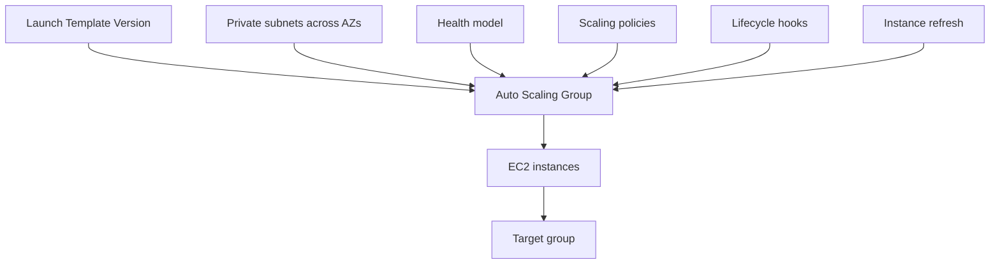
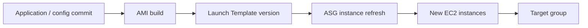
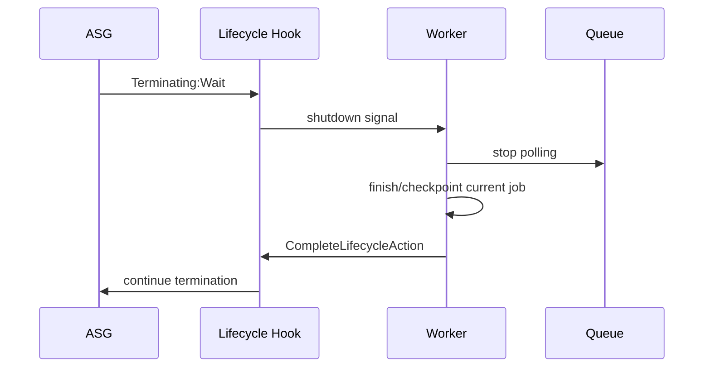
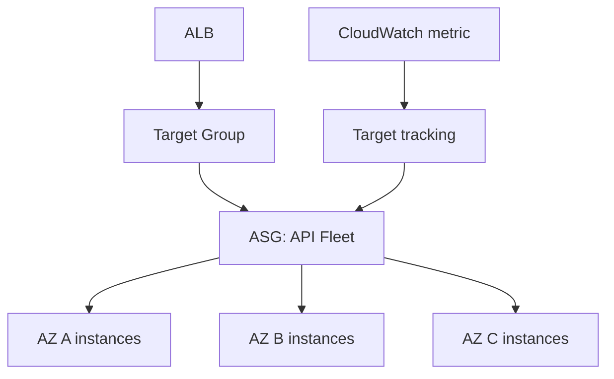

# Part 022 — Auto Scaling Group Design

> An Auto Scaling Group is not just “a group of instances”. It is a production boundary: a launch contract, capacity envelope, health model, replacement policy, rollout mechanism, and failure isolation unit.

After understanding Auto Scaling as a control loop, we can design the object that executes the loop: the Auto Scaling Group, or ASG.

A weak ASG design says:

```text
Put instances in an ASG so they restart if they die.
```

A production ASG design says:

```text
Define a reproducible fleet that can launch, become healthy, serve traffic, drain safely, roll forward, roll back, and survive partial infrastructure failure within known capacity boundaries.
```

This part covers:

- ASG design goals,
- min/max/desired capacity,
- Launch Template versioning,
- multi-AZ subnet placement,
- health check type and grace period,
- lifecycle hooks,
- termination policies,
- scale-in protection,
- standby/detach patterns,
- instance refresh,
- mixed capacity boundaries,
- production runbooks.

---

## 1. Problem yang Diselesaikan

An ASG solves three related problems.

### 1.1 Fleet Reproducibility

Every instance should be launched from the same explicit contract:

- AMI,
- instance type or allowed instance types,
- IAM instance profile,
- block device mapping,
- network interfaces/security groups,
- user data,
- metadata options,
- tags,
- monitoring settings.

If an instance cannot be recreated automatically, it is not a proper fleet member. It is a pet disguised as cattle.

### 1.2 Fleet Availability

The ASG should maintain enough useful instances:

- across AZs,
- behind the correct target group,
- passing health checks,
- not stuck in bootstrap,
- not over-terminated during deployment,
- not all dependent on one capacity pool.

### 1.3 Fleet Evolution

The ASG should allow safe change:

- new AMI,
- new user data,
- new instance type,
- new configuration,
- dependency endpoint migration,
- security patch,
- rollback.

If changing a fleet requires manual SSH, the ASG is not doing its job.

---

## 2. Mental Model: ASG as a Managed Cell

A good ASG is a managed compute cell.



The ASG owns the fleet lifecycle:

```text
launch -> bootstrap -> health check -> serve -> drain -> terminate -> replace
```

Design mistake:

```text
Treat ASG as a restart button.
```

Better model:

```text
Treat ASG as the authoritative fleet state machine.
```

---

## 3. Capacity Envelope: Min, Max, Desired

### 3.1 Desired Capacity

Desired capacity is the current amount of capacity the ASG tries to maintain.

If actual capacity is below desired, ASG launches.

If actual capacity is above desired, ASG terminates.

Desired capacity can be changed by:

- manual update,
- scaling policy,
- scheduled action,
- predictive scaling,
- instance refresh behavior,
- external automation.

Production rule:

> Desired capacity should be treated as controller output, not manually edited during normal operation except during incident response or planned operations.

### 3.2 Minimum Capacity

Minimum capacity is not “lowest cost”.

It is the smallest safe fleet size.

For stateless services, min size should consider:

- static stability under one AZ impairment,
- baseline traffic,
- deployment availability,
- monitoring/health sampling,
- warm cache requirement,
- burst absorption before scale-out completes.

Bad min size:

```text
min = 1 because it is cheaper.
```

Better min size:

```text
min = capacity needed to survive normal baseline plus one-node loss, distributed across at least two AZs.
```

For a critical API, a min size of 2 can still be weak if both instances land in different AZs but one AZ loss leaves only one instance with insufficient capacity.

### 3.3 Maximum Capacity

Maximum capacity is a safety ceiling.

It protects:

- cost,
- subnet IP capacity,
- service quotas,
- database connections,
- external API quotas,
- shared dependencies,
- accidental infinite scale-out,
- runaway retry storms.

Bad max size:

```text
max = 1000 because cloud is elastic.
```

Better max size:

```text
max = min(account quota, subnet capacity, downstream-safe concurrency, emergency cost boundary)
```

If max is reached during an incident, you need to know whether that means:

- the cap is intentionally protecting dependencies,
- the cap is too low,
- a quota needs raising,
- the workload should shed load,
- a bottleneck moved elsewhere.

---

## 4. Launch Template as Fleet Contract

An ASG should use a Launch Template, not hidden instance configuration.

The Launch Template defines the launch shape:

- AMI ID,
- instance type or base type,
- key pair if required,
- IAM instance profile,
- security groups,
- block devices,
- EBS encryption,
- user data,
- IMDSv2 requirement,
- detailed monitoring,
- tags.

The Launch Template is not the whole deployment. It is the machine creation contract.



Production rules:

- Pin ASG to a specific Launch Template version during controlled rollout.
- Avoid unreviewed `$Latest` in production unless your pipeline controls it strictly.
- Tag instances with image version, service version, environment, owner, and rollout id.
- Make user data idempotent.
- Require IMDSv2 unless you have a measured exception.
- Keep secrets out of user data and AMI.
- Make bootstrap failures visible.

---

## 5. Placement Across Subnets and AZs

An ASG launches instances into configured subnets.

Those subnets define the placement envelope.

For production stateless services, prefer:

- private subnets,
- at least two AZs,
- enough IP space per subnet,
- route/NAT/endpoint capacity sized for bootstrap and runtime,
- target group configured for the same AZ pattern.

Common mistake:

```text
ASG has three subnets but one subnet has almost no free IPs.
```

Result:

- launch failures in one AZ,
- imbalance,
- scaling activities stuck,
- unexpected capacity concentration.

Another mistake:

```text
ASG spans AZs, but stateful EBS volume assumption is single-AZ.
```

Result:

- replacement launches in another AZ,
- EBS volume cannot attach,
- application cannot recover.

For stateless services, multi-AZ is usually good.

For stateful EBS-bound workloads, AZ placement must be explicit and storage ownership must be modeled.

---

## 6. Health Model

ASG health is not one thing.

Possible health signals:

- EC2 status checks,
- Elastic Load Balancing health checks,
- VPC Lattice health checks,
- custom health checks via `SetInstanceHealth`,
- application readiness checks,
- external monitoring automation.

AWS EC2 Auto Scaling continuously monitors instance health and maintains desired capacity. It can use EC2 status checks by default and optional ELB/VPC Lattice/custom checks depending on configuration.

### 6.1 EC2 Health Check

EC2 health checks answer:

```text
Is the infrastructure/instance basically alive?
```

They do not prove the app is ready.

### 6.2 ELB Health Check

ELB health checks answer:

```text
Can the load balancer route traffic to this target successfully?
```

For web services behind ALB/NLB, ASG health check type often should include ELB.

### 6.3 Application Readiness

Readiness should prove the instance can do useful work.

Bad readiness:

```text
GET /health returns 200 if process is alive.
```

Better readiness:

```text
GET /ready returns 200 only if:
  app initialized,
  config loaded,
  critical dependencies reachable or degraded mode explicit,
  migrations not running dangerously,
  thread pools ready,
  local disk not full,
  target can serve real requests.
```

But readiness must not be too strict. If readiness fails because one optional dependency is down, the ASG may replace healthy instances endlessly.

### 6.4 Health Check Grace Period

New instances need time before health failures trigger replacement.

Set grace period based on actual launch readiness timing:

```text
grace_period >= boot + user_data + app_start + dependency_init + readiness_margin
```

Too short creates launch-replace loops.

Too long delays replacement of truly bad instances.

---

## 7. Lifecycle Hooks

Lifecycle hooks let you pause instance transitions and run custom actions.

Important transitions:

- launching,
- terminating.

### 7.1 Launch Hook

Use launch hooks when the instance must complete external registration before serving.

Examples:

- pre-warm application cache,
- register in service registry,
- attach/prepare secondary storage,
- run smoke checks,
- fetch large model/data artifact,
- publish readiness event,
- wait for sidecar/agent.

Launch hook anti-pattern:

```text
Use hook to hide a slow, fragile bootstrap forever.
```

The hook should make launch safer, not make bootstrap unobservable.

### 7.2 Termination Hook

Use termination hooks to drain safely.

Examples:

- stop accepting new queue messages,
- finish or checkpoint current job,
- deregister from service registry,
- flush telemetry,
- release lease,
- detach data volume carefully,
- upload local artifacts.

For workers, termination hook is often non-negotiable.



### 7.3 Hook Timeout

Lifecycle hooks have a timeout. If the action does not complete, ASG continues according to the default result.

Production rules:

- Always define timeout intentionally.
- Always emit metrics for hook duration and failure.
- Always define what happens if hook automation fails.
- Keep termination hook shorter than operational patience.
- Do not rely on humans completing hooks during normal operation.

---

## 8. Termination Policies and Scale-In Victims

When ASG scales in, it must choose which instance to terminate.

Termination policy matters.

Common production concerns:

- terminate oldest Launch Template version first,
- preserve AZ balance,
- avoid killing newest warm instance,
- avoid terminating protected/active worker,
- avoid terminating instances with attached state,
- remove Spot at-risk instances when appropriate,
- coordinate with instance refresh.

Default termination behavior may be acceptable for stateless web fleets. It is often not enough for workers or semi-stateful nodes.

### 8.1 Scale-In Protection

Instance scale-in protection prevents ASG from terminating protected instances during scale-in.

Use it for:

- workers processing long tasks,
- manual investigation instances,
- temporary state handoff,
- controlled experiments.

Do not use it as permanent drift.

Protected instances can prevent the ASG from reducing capacity, increasing cost or blocking operations.

### 8.2 Standby

Standby lets you remove an instance from service while keeping it in the ASG.

Use it for:

- debugging,
- safe investigation,
- manual patch validation,
- targeted drain.

But standby is operational debt if forgotten.

Every standby instance needs an owner and expiration.

### 8.3 Detach

Detach removes instance ownership from ASG.

Use rarely.

Valid cases:

- forensic capture,
- emergency state rescue,
- migration from ASG ownership,
- one-off debugging.

Detached instances are no longer governed by ASG desired state. They can become unmanaged pets quickly.

---

## 9. Instance Refresh

Instance refresh is the ASG-native rolling update mechanism.

It replaces instances according to preferences such as minimum healthy percentage and warmup.

Use it for:

- new AMI rollout,
- Launch Template update,
- instance type change,
- OS patch rollout,
- bootstrap contract change.

A safe instance refresh defines:

- minimum healthy percentage,
- instance warmup,
- checkpoints if needed,
- rollback behavior,
- alarm-based abort if supported by your pipeline,
- clear mapping from image version to deployed instances.

Bad rollout:

```text
Update Launch Template to latest and hope ASG eventually replaces nodes.
```

Better rollout:

```text
Build AMI -> create LT version -> start instance refresh -> monitor health/error/latency -> pause/rollback on alarm.
```

Important: instance refresh is not a substitute for application-level deployment safety. It should be integrated with health checks, metrics, and rollback criteria.

---

## 10. ASG Design Patterns

### 10.1 Stateless HTTP Service

Recommended baseline:

- ASG across private subnets in 2-3 AZs,
- ALB target group,
- ELB health checks enabled,
- min capacity sized for static stability,
- target tracking on ALB request count per target or CPU,
- Launch Template pinned to version,
- instance refresh for rollout,
- termination drain via ALB deregistration delay,
- app handles SIGTERM gracefully.



### 10.2 Queue Worker Fleet

Recommended baseline:

- ASG in private subnets,
- no ALB required,
- scaling on backlog per instance or oldest message age,
- termination lifecycle hook,
- workers stop polling before shutdown,
- checkpointing for long jobs,
- DLQ alarm,
- downstream throttle guardrail.

### 10.3 ECS/EKS Node Capacity Pool

When ASG backs container nodes:

- the scheduler, not ASG, owns task/pod placement,
- ASG should not kill nodes without draining,
- capacity provider / cluster autoscaler / Karpenter-like controller must coordinate,
- node termination handler may be required,
- storage volumes can bind pods to AZs.

ASG is only the node lifecycle manager, not the application scheduler.

### 10.4 Semi-Stateful EC2 Fleet

Use with caution.

Examples:

- shard workers,
- cache nodes,
- replicated brokers,
- EBS-attached application nodes.

Requirements:

- explicit ownership protocol,
- fencing,
- lifecycle hooks,
- AZ-aware replacement,
- backup/restore path,
- no blind scale-in,
- custom health and evacuation logic.

---

## 11. Terraform Skeleton

This is a simplified skeleton, not a copy-paste production module.

```hcl
resource "aws_launch_template" "service" {
  name_prefix   = "orders-api-"
  image_id      = var.ami_id
  instance_type = "m7g.large"

  iam_instance_profile {
    name = aws_iam_instance_profile.service.name
  }

  metadata_options {
    http_endpoint               = "enabled"
    http_tokens                 = "required"
    http_put_response_hop_limit = 1
  }

  block_device_mappings {
    device_name = "/dev/xvda"

    ebs {
      volume_size           = 30
      volume_type           = "gp3"
      encrypted             = true
      delete_on_termination = true
    }
  }

  user_data = base64encode(templatefile("${path.module}/user-data.sh", {
    service_name = "orders-api"
    environment  = var.environment
  }))

  tag_specifications {
    resource_type = "instance"

    tags = {
      Service     = "orders-api"
      Environment = var.environment
      ManagedBy   = "asg"
    }
  }
}

resource "aws_autoscaling_group" "service" {
  name                      = "orders-api-${var.environment}"
  min_size                  = 6
  max_size                  = 60
  desired_capacity          = 9
  health_check_type         = "ELB"
  health_check_grace_period = 300

  vpc_zone_identifier = var.private_subnet_ids
  target_group_arns   = [aws_lb_target_group.service.arn]

  launch_template {
    id      = aws_launch_template.service.id
    version = aws_launch_template.service.latest_version
  }

  instance_refresh {
    strategy = "Rolling"

    preferences {
      min_healthy_percentage = 90
      instance_warmup        = 300
    }
  }

  termination_policies = [
    "OldestLaunchTemplate",
    "Default"
  ]

  tag {
    key                 = "Service"
    value               = "orders-api"
    propagate_at_launch = true
  }
}

resource "aws_autoscaling_lifecycle_hook" "terminate" {
  name                   = "orders-api-terminate-drain"
  autoscaling_group_name = aws_autoscaling_group.service.name
  lifecycle_transition   = "autoscaling:EC2_INSTANCE_TERMINATING"
  heartbeat_timeout      = 300
  default_result         = "CONTINUE"
}
```

Key design point:

```text
The ASG definition should encode operational intent, not just launch instances.
```

---

## 12. Failure Modes

### 12.1 Launch Loop

Symptoms:

- instances launch and terminate repeatedly,
- desired capacity never stabilizes,
- ALB healthy host count low,
- ASG activity history shows health replacement.

Common causes:

- bad AMI,
- user data failure,
- health check grace period too short,
- readiness endpoint too strict,
- missing IAM permission,
- secret/config unavailable,
- security group blocks health check,
- app binds wrong port.

Runbook:

1. Check ASG activity history.
2. Inspect EC2 console output/system log.
3. Check target group health reason.
4. Check cloud-init/user data logs.
5. Verify IAM role and network access.
6. Temporarily suspend replacement only if needed for investigation.
7. Roll back Launch Template/AMI.

### 12.2 Max Capacity Reached

Symptoms:

- desired=max,
- scaling policy still wants more,
- latency/backlog rising.

Causes:

- max too low,
- quota too low,
- subnet out of IPs,
- downstream cap intentionally limiting,
- capacity unavailable for selected instance types.

Runbook:

1. Check scaling policy alarms.
2. Check ASG activity failure messages.
3. Check EC2 service quotas.
4. Check subnet free IPs.
5. Check downstream saturation.
6. Decide whether to raise max or shed load.

### 12.3 Health Check Mismatch

Symptoms:

- ALB says unhealthy,
- instance app logs look healthy,
- or ASG thinks healthy while app serves 5xx.

Causes:

- wrong path,
- wrong port,
- security group mismatch,
- readiness endpoint too shallow,
- health check timeout too low,
- dependency readiness model wrong.

Runbook:

1. Query health endpoint from inside VPC.
2. Compare ALB target health reason.
3. Verify security group ingress from ALB.
4. Check application port binding.
5. Separate liveness and readiness semantics.

### 12.4 Scale-In Kills Active Work

Symptoms:

- duplicate jobs,
- partial writes,
- long tasks restart,
- DLQ grows after scale-in.

Causes:

- missing lifecycle hook,
- worker ignores termination,
- no checkpoint,
- visibility timeout too short,
- scale-in protection not used for long jobs.

Runbook:

1. Disable scale-in temporarily.
2. Add termination lifecycle hook.
3. Implement drain protocol.
4. Align visibility timeout and job runtime.
5. Add checkpoint/idempotency.

### 12.5 Bad Instance Refresh

Symptoms:

- new version gradually replaces healthy nodes,
- error rate rises,
- refresh continues,
- rollback unclear.

Causes:

- no alarm-based abort,
- health check too shallow,
- min healthy percentage too low,
- new AMI passes boot but app fails under load.

Runbook:

1. Pause/cancel instance refresh.
2. Roll back Launch Template version.
3. Start reverse refresh if needed.
4. Compare old/new instance metrics.
5. Fix health/readiness and rollout guardrails.

### 12.6 Forgotten Manual Drift

Symptoms:

- one instance behaves differently,
- manual patch/config exists,
- replacement loses the change,
- incident repeats.

Causes:

- SSH edits,
- detached/standby instance forgotten,
- local config not encoded in AMI/user data/IaC.

Runbook:

1. Identify drift.
2. Decide whether change is valid.
3. Encode change in image/bootstrap/config repo.
4. Replace instance.
5. Add drift detection if necessary.

---

## 13. Operational Dashboards

Minimum ASG dashboard:

- desired capacity,
- min/max capacity,
- in-service instances,
- pending instances,
- terminating instances,
- standby/protected instances,
- scaling activities,
- launch failures,
- target group healthy/unhealthy host count,
- target response time,
- 5xx,
- CPU/memory/application saturation,
- queue backlog if worker fleet,
- instance refresh status,
- Spot interruption/rebalance if using Spot,
- subnet available IPs,
- relevant quota usage.

A good dashboard separates:

```text
Wanted capacity
Actual launched capacity
Healthy capacity
Useful capacity
Saturated capacity
```

These are not the same during incidents.

---

## 14. Production Checklist

Before shipping an ASG-backed service:

- [ ] Launch Template is versioned and reviewed.
- [ ] ASG is attached to at least two suitable private subnets unless intentionally zonal.
- [ ] Subnet IP capacity is enough for max scale plus deployments.
- [ ] Min capacity is based on static stability, not just cost.
- [ ] Max capacity is downstream-safe and quota-safe.
- [ ] Health check type matches routing model.
- [ ] Health check grace period matches bootstrap time.
- [ ] Readiness endpoint represents useful work.
- [ ] Lifecycle hooks exist for required launch/termination actions.
- [ ] Termination behavior is safe for in-flight requests/jobs.
- [ ] Termination policy matches rollout and scale-in intent.
- [ ] Scale-in protection is used only with clear ownership and expiry.
- [ ] Instance refresh is configured with minimum healthy percentage and warmup.
- [ ] Rollback path is tested.
- [ ] ASG activity history is monitored.
- [ ] Launch failures alert quickly.
- [ ] Manual SSH changes are considered drift and not relied upon.

---

## 15. Mini Case Study: The ASG That Replaced Every Good Instance

A team deploys a new AMI to a payment API fleet.

Configuration:

```text
min = 4
max = 20
desired = 8
health_check_type = ELB
health_check_grace_period = 60 seconds
instance_refresh min_healthy = 75%
```

New AMI boot time changed from 45 seconds to 180 seconds because it now downloads a large fraud model at startup.

During instance refresh:

- new instances launch,
- ALB health checks start before app is ready,
- ASG marks them unhealthy,
- ASG terminates and relaunches,
- refresh continues to remove old healthy instances,
- healthy host count drops,
- API error rate rises.

Root causes:

- health check grace period no longer matched bootstrap time,
- model artifact download was part of critical boot path,
- readiness endpoint did not distinguish starting vs broken,
- instance refresh was not guarded by error-rate alarm,
- AMI pipeline did not measure boot-to-ready time.

Fix:

- move model into AMI build or cache artifact closer,
- increase health check grace period and instance warmup based on measured readiness,
- add launch hook only if external readiness action is required,
- add instance refresh rollback criteria,
- expose `boot_to_ready_seconds`,
- test refresh in staging with production-like artifact size.

Lesson:

> An ASG is only as safe as its lifecycle assumptions. If boot time changes, scaling and rollout behavior change.

---

## 16. Summary

An Auto Scaling Group is a production cell.

It defines:

- how instances are launched,
- where they can run,
- how many should exist,
- how health is judged,
- how replacement happens,
- how termination is chosen,
- how rollout proceeds,
- how the fleet recovers.

The strongest design rule is:

> Make the ASG own reproducible fleet state, and make every exception explicit, temporary, observable, and reversible.

A good ASG design avoids manual repair as the primary recovery method. It makes replacement safe, rollout controlled, scale-in graceful, and failure diagnosable.

In the next part, we will go deeper into scaling policies and metric selection: target tracking, step scaling, scheduled scaling, predictive scaling, and the traps that make autoscaling look correct while the service fails.

---

## References

- AWS Documentation — What is Amazon EC2 Auto Scaling?: https://docs.aws.amazon.com/autoscaling/ec2/userguide/what-is-amazon-ec2-auto-scaling.html
- AWS Documentation — Health checks for instances in an Auto Scaling group: https://docs.aws.amazon.com/autoscaling/ec2/userguide/ec2-auto-scaling-health-checks.html
- AWS Documentation — About health checks for your Auto Scaling group: https://docs.aws.amazon.com/autoscaling/ec2/userguide/health-checks-overview.html
- AWS Documentation — Amazon EC2 Auto Scaling lifecycle hooks: https://docs.aws.amazon.com/autoscaling/ec2/userguide/lifecycle-hooks.html
- AWS Documentation — How lifecycle hooks work in Auto Scaling groups: https://docs.aws.amazon.com/autoscaling/ec2/userguide/lifecycle-hooks-overview.html
- AWS Documentation — Use an instance refresh to update instances in an Auto Scaling group: https://docs.aws.amazon.com/autoscaling/ec2/userguide/asg-instance-refresh.html
- AWS Documentation — How an instance refresh works in an Auto Scaling group: https://docs.aws.amazon.com/autoscaling/ec2/userguide/instance-refresh-overview.html
