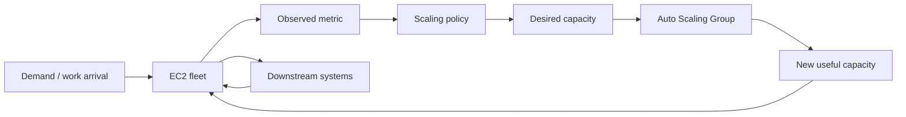
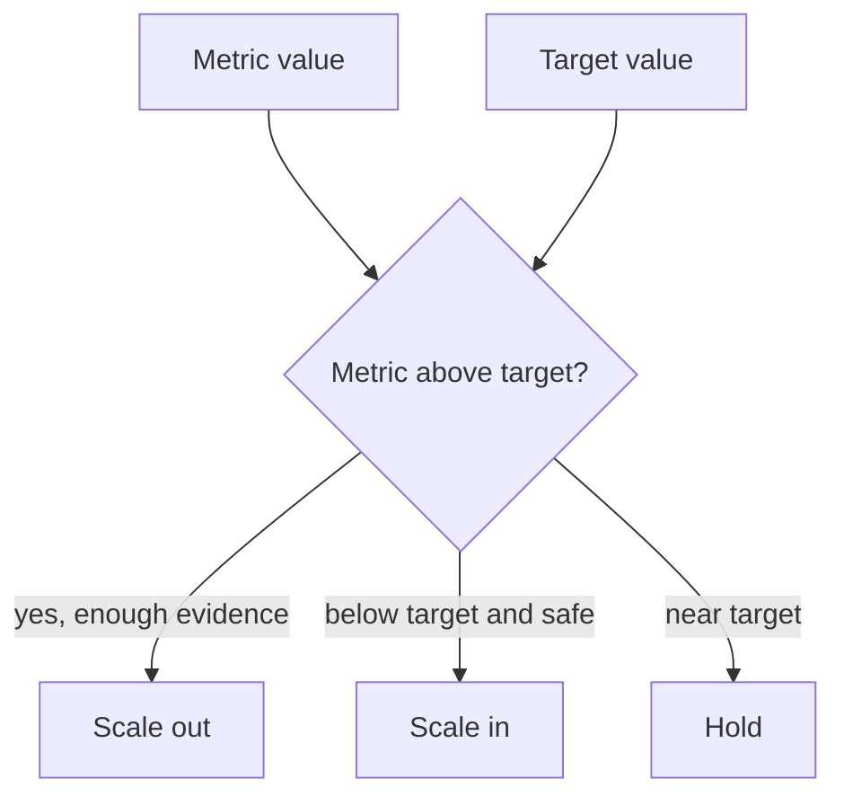
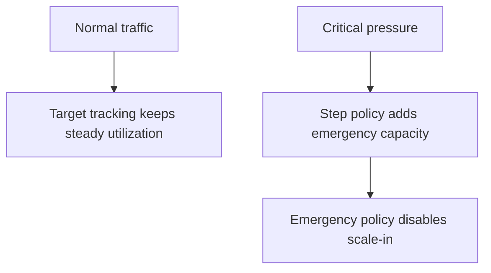
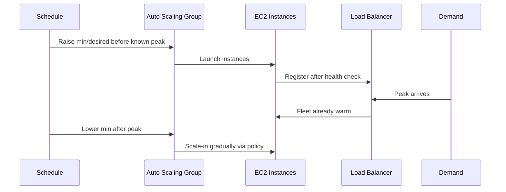
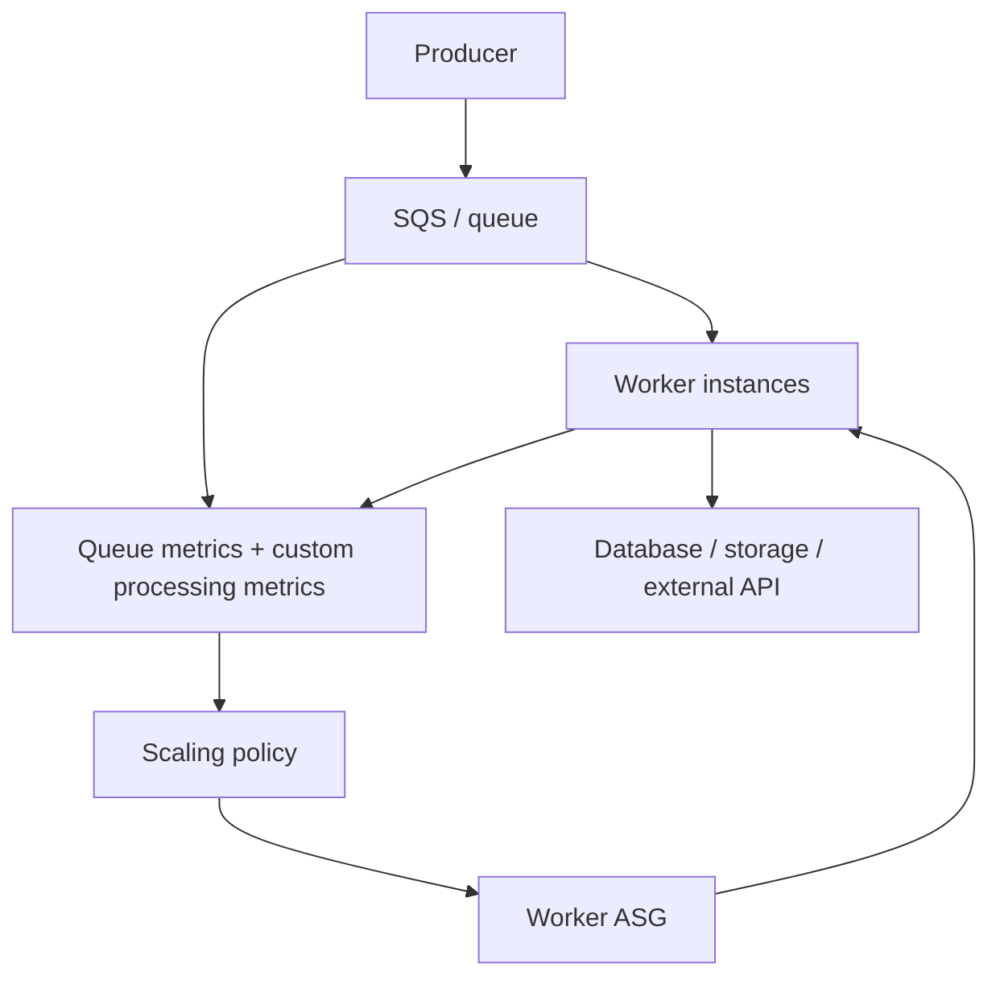
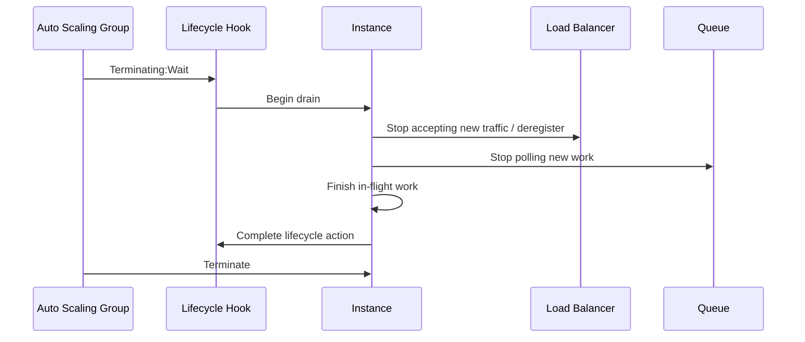

# Part 023 — Scaling Policies and Metric Selection

> A scaling policy is only as good as the signal it follows. In production, bad metrics do not merely waste money. They create outages that look like healthy automation.

In the previous parts, we modeled Auto Scaling as a feedback loop and designed the Auto Scaling Group as a production unit. Now we go deeper into the controller itself.

This part answers a practical question:

> Which scaling policy should this fleet use, and what metric should it trust?

That question is harder than it looks because most metrics are not capacity signals.

CPU is not always demand.

Latency is not always capacity shortage.

Queue depth is not always bad.

Memory usage is not always leak.

Request count is not always work.

Error rate is not always overload.

A strong engineer does not add scaling policies by habit. They model the workload, identify the bottleneck, select a stable metric, define guardrails, and test the loop under failure.

We will cover:

- scaling policy types,
- target tracking,
- step and simple scaling,
- scheduled scaling,
- predictive scaling,
- custom metrics and metric math,
- queue-based scaling,
- memory and storage-driven workloads,
- multiple policy composition,
- bad metric traps,
- Terraform implementation,
- failure modes,
- runbooks and checklist.

Official AWS references used while writing this part:

- [Amazon EC2 Auto Scaling dynamic scaling](https://docs.aws.amazon.com/autoscaling/ec2/userguide/as-scale-based-on-demand.html)
- [Target tracking scaling policies for Amazon EC2 Auto Scaling](https://docs.aws.amazon.com/autoscaling/ec2/userguide/as-scaling-target-tracking.html)
- [Step and simple scaling policies for Amazon EC2 Auto Scaling](https://docs.aws.amazon.com/autoscaling/ec2/userguide/as-scaling-simple-step.html)
- [Scheduled scaling for Amazon EC2 Auto Scaling](https://docs.aws.amazon.com/autoscaling/ec2/userguide/ec2-auto-scaling-scheduled-scaling.html)
- [Predictive scaling for Amazon EC2 Auto Scaling](https://docs.aws.amazon.com/autoscaling/ec2/userguide/ec2-auto-scaling-predictive-scaling.html)
- [Default instance warmup](https://docs.aws.amazon.com/autoscaling/ec2/userguide/ec2-auto-scaling-default-instance-warmup.html)
- [CloudWatch metrics for Auto Scaling Groups](https://docs.aws.amazon.com/autoscaling/ec2/userguide/ec2-auto-scaling-metrics.html)

---

## 1. Problem yang Diselesaikan

The naïve question is:

```text
What metric should trigger autoscaling?
```

The better question is:

```text
What observable signal tells us that useful capacity is lower or higher than current demand, and can we safely act on it with delay?
```

A scaling policy has three jobs.

First, it must **add capacity early enough** that user-facing or worker-facing SLOs are protected.

Second, it must **avoid over-scaling** when the signal is temporary, misleading, or caused by another failing dependency.

Third, it must **remove capacity slowly and safely** without destroying useful work, cache warmth, availability, or recovery margin.

This is why metric selection matters more than policy syntax.

A scaling policy is not a button.

It is a production control contract.

---

## 2. Mental Model: Metric, Policy, Actuation, Stabilization

A scaling policy is a mapping from an observed condition to a desired capacity adjustment.



The important delay is not only EC2 launch time.

The total reaction time is:

```text
reaction_time = metric_period
              + metric_ingestion_delay
              + alarm_evaluation_time
              + scaling_decision_time
              + instance_launch_time
              + boot_time
              + app_start_time
              + registration_time
              + warmup_time
              + cache_warm_time
```

If the workload can saturate faster than this reaction time, autoscaling alone cannot save it.

You need one or more of:

- higher baseline capacity,
- scheduled or predictive pre-scale,
- queue buffering,
- admission control,
- rate limiting,
- static stability,
- smaller boot path,
- warm pools,
- cached artifacts,
- faster health registration,
- downstream protection.

### 2.1 The capacity signal property

A good autoscaling metric usually has this property:

```text
When demand stays constant and capacity doubles,
the metric should move toward half.
```

Examples:

| Workload | Better signal | Why |
|---|---|---|
| HTTP service behind ALB | RequestCountPerTarget | Divides work by healthy target count |
| CPU-bound service | Average CPU utilization | Can approximate saturation when CPU is the bottleneck |
| Queue worker | Backlog per worker | Measures work pressure relative to consumers |
| Batch fleet | Runnable jobs per vCPU / worker slot | Measures schedulable work relative to capacity |
| Memory-bound service | Memory pressure + restart/error signal | Memory alone does not halve with capacity unless workload is spread |
| Storage-heavy service | I/O queue depth, latency, throughput per node | Scaling compute may not fix storage bottleneck |
| Downstream-limited service | Downstream saturation/error budget | More compute may amplify failure |

Raw request count usually fails the property.

Raw queue depth usually fails the property.

p99 latency often fails the property.

Total CPU across fleet can fail the property.

A metric that does not respond predictably to capacity changes makes the controller unstable.

---

## 3. Scaling Policy Types

Amazon EC2 Auto Scaling supports several practical scaling mechanisms.

For production design, think of them as different control strategies.

| Policy | Best for | Risk |
|---|---|---|
| Target tracking | Maintain utilization/work-per-capacity near a target | Bad metric causes wrong capacity |
| Step scaling | Explicit reaction bands for known thresholds | Hard to tune; can be brittle |
| Simple scaling | Legacy/simple threshold reaction | Coarse behavior; cooldown traps |
| Scheduled scaling | Known predictable traffic windows | Wrong calendar/time zone assumptions |
| Predictive scaling | Daily/weekly patterns with historical signal | Bad for irregular spikes; needs history |
| Manual scaling | Incident response or planned event | Human error; not closed-loop |
| Queue-based custom scaling | Async worker capacity | Needs correct backlog math and processing time |

A mature system often combines more than one.

Example:

```text
baseline capacity: min_size = 6
scheduled scaling: increase min_size before business hours
target tracking: keep ALB RequestCountPerTarget around N
step scaling: emergency scale-out when p95 latency crosses critical threshold
manual override: incident commander can pin desired capacity
```

The trick is to avoid policies fighting each other.

---

## 4. Target Tracking Scaling

Target tracking is the default policy for most production fleets.

The policy says:

```text
Keep metric X close to target value T.
```

It is similar to thermostat behavior.



AWS target tracking automatically adjusts capacity to maintain the target metric value. It works best when the metric describes average utilization or average work per capacity unit.

### 4.1 Good target tracking metrics

#### ALB RequestCountPerTarget

For HTTP services behind an Application Load Balancer, `ALBRequestCountPerTarget` is often stronger than average CPU.

Why?

Because it represents load per healthy target.

```text
request_count_per_target = total_requests / healthy_targets
```

When capacity doubles and demand is stable, the metric should roughly halve.

Use this when:

- request cost is reasonably uniform,
- load balancer distribution is healthy,
- each request maps to similar compute effort,
- you care about request throughput more than CPU utilization.

Do not use it blindly when:

- some endpoints are much heavier than others,
- long-running requests dominate capacity,
- WebSocket/long connections dominate,
- background work is hidden from ALB,
- downstream system is the bottleneck.

#### Average CPU utilization

CPU can be good when the application is genuinely CPU-bound.

Use this when:

- request processing mostly consumes CPU,
- CPU correlates strongly with latency/saturation,
- no major I/O wait or lock contention hides pressure,
- each instance receives roughly equal work.

Avoid this when:

- threads block on database calls,
- workload is memory-bound,
- workload is network-bound,
- CPU is high due to retry storm,
- CPU is low because the service is failing fast,
- JVM GC is the actual bottleneck.

#### Custom backlog per worker

For queue workers, target tracking should not usually use raw queue depth.

Use backlog per capacity unit.

```text
backlog_per_instance = visible_messages / in_service_worker_instances
```

Better:

```text
seconds_of_work_per_instance = visible_messages * average_processing_seconds / worker_instances
```

Even better:

```text
required_workers = ceil((arrival_rate * average_processing_seconds) / target_utilization)
```

Use this when:

- work is buffered in SQS/Kafka/Kinesis/custom queue,
- worker processing time is measurable,
- workers are horizontally scalable,
- work items are idempotent,
- downstream systems can absorb more workers.

### 4.2 Choosing target value

A target value is not a moral statement like “70% CPU is good”.

It is a buffer decision.

```text
target = utilization at which the fleet still has enough headroom for variance, failures, warmup delay, GC, retries, and AZ impairment
```

For HTTP service CPU target:

| Fleet behavior | Example target |
|---|---:|
| Fast boot, cheap scale-out, stable downstream | 60–70% CPU |
| JVM service with GC spikes | 45–60% CPU |
| Latency-sensitive API | 35–55% CPU |
| Burst-heavy traffic | Lower target or scheduled pre-scale |
| Batch worker, cost-sensitive | 70–85% if queue delay is acceptable |

The exact number must be validated by load testing.

A target value without load test evidence is a guess.

### 4.3 Scale-out and scale-in asymmetry

Scale-out and scale-in are not symmetric.

Scale-out protects availability.

Scale-in saves money.

Production systems should usually scale out faster than they scale in.

This means:

- conservative target value,
- adequate default instance warmup,
- disable scale-in for emergency policies,
- longer stabilization window for scale-in,
- lifecycle hook for graceful termination,
- connection draining,
- queue worker stop-drain protocol.

### 4.4 Target tracking Terraform skeleton

```hcl
resource "aws_autoscaling_policy" "api_requests_per_target" {
  name                   = "api-request-count-per-target"
  autoscaling_group_name = aws_autoscaling_group.api.name
  policy_type            = "TargetTrackingScaling"

  target_tracking_configuration {
    predefined_metric_specification {
      predefined_metric_type = "ALBRequestCountPerTarget"
      resource_label = "${aws_lb.app.arn_suffix}/${aws_lb_target_group.api.arn_suffix}"
    }

    target_value     = 800
    disable_scale_in = false
  }
}
```

For CPU-bound service:

```hcl
resource "aws_autoscaling_policy" "api_cpu" {
  name                   = "api-cpu-target"
  autoscaling_group_name = aws_autoscaling_group.api.name
  policy_type            = "TargetTrackingScaling"

  target_tracking_configuration {
    predefined_metric_specification {
      predefined_metric_type = "ASGAverageCPUUtilization"
    }

    target_value     = 55
    disable_scale_in = false
  }
}
```

---

## 5. Step Scaling

Step scaling uses CloudWatch alarms and capacity adjustment bands.

The policy says:

```text
If metric exceeds threshold by this much, add this much capacity.
```

Example:

| CPU | Action |
|---:|---:|
| 70–80% | add 1 instance |
| 80–90% | add 2 instances |
| >90% | add 4 instances |

Step scaling is useful when you know the response curve and want explicit behavior.

Use it when:

- target tracking is too slow or too smooth,
- you need emergency scale-out,
- you have nonlinear capacity behavior,
- you want separate policies for different thresholds,
- you need to react to queue age/backlog bands,
- you want no scale-in from this policy.

Avoid it when:

- no one owns the threshold math,
- alarms are noisy,
- the workload shape changes frequently,
- scaling increments are arbitrary,
- the policy has not been load tested.

### 5.1 Emergency scale-out pattern

Target tracking handles normal traffic.

Step scaling handles abnormal pressure.



Example:

```text
Target tracking:
- Keep RequestCountPerTarget at 800.

Emergency step scaling:
- If p95 latency > 750ms for 3 periods, add 25% capacity.
- If p95 latency > 1500ms for 2 periods, add 50% capacity.
- Disable scale-in for emergency policy.
```

This can work, but latency is dangerous as the primary control signal because latency can rise from downstream failure. Emergency scale-out must be paired with downstream saturation checks.

### 5.2 Step scaling Terraform skeleton

```hcl
resource "aws_cloudwatch_metric_alarm" "api_high_latency" {
  alarm_name          = "api-p95-latency-high"
  comparison_operator = "GreaterThanThreshold"
  evaluation_periods  = 3
  metric_name         = "TargetResponseTime"
  namespace           = "AWS/ApplicationELB"
  period              = 60
  statistic           = "Average"
  threshold           = 0.75

  dimensions = {
    LoadBalancer = aws_lb.app.arn_suffix
    TargetGroup  = aws_lb_target_group.api.arn_suffix
  }
}

resource "aws_autoscaling_policy" "api_latency_step_out" {
  name                   = "api-latency-step-out"
  autoscaling_group_name = aws_autoscaling_group.api.name
  policy_type            = "StepScaling"
  adjustment_type        = "PercentChangeInCapacity"
  estimated_instance_warmup = 180

  step_adjustment {
    metric_interval_lower_bound = 0
    metric_interval_upper_bound = 0.75
    scaling_adjustment          = 25
  }

  step_adjustment {
    metric_interval_lower_bound = 0.75
    scaling_adjustment          = 50
  }
}
```

The exact syntax and dimensions depend on your ALB and Terraform provider version. Treat this as an implementation skeleton, not a copy-paste production module.

---

## 6. Simple Scaling

Simple scaling is the old blunt instrument.

It says:

```text
When alarm fires, adjust capacity, then wait for cooldown.
```

Use it rarely.

Simple scaling can be acceptable for:

- small internal tools,
- non-critical workloads,
- coarse one-direction actions,
- legacy systems being migrated.

For serious production systems, prefer target tracking or step scaling.

Why?

Because cooldown-based behavior is easy to misunderstand.

A cooldown can hide continued pressure. A short cooldown can overreact. A long cooldown can underreact.

Target tracking and step scaling use instance warmup concepts that usually map better to real capacity stabilization.

---

## 7. Scheduled Scaling

Scheduled scaling is not “manual scaling in advance”.

It is a way to encode predictable demand into capacity.

Use it when traffic has known calendar shape:

- business hours,
- daily login wave,
- weekly batch,
- monthly billing run,
- campaign launch,
- regulatory filing deadline,
- market open/close,
- school/work schedule,
- nightly ETL.

Scheduled scaling changes min, max, or desired capacity at a time.

The most useful scheduled action is often raising **minimum capacity**, not only desired capacity.

```text
Before peak:
  min_size: 6 -> 20
  desired_capacity: 20

After peak:
  min_size: 6
  target tracking scales down gradually
```

This avoids a target tracking policy fighting a too-low minimum baseline.

### 7.1 Scheduled scaling pattern



### 7.2 Scheduled scaling Terraform skeleton

```hcl
resource "aws_autoscaling_schedule" "weekday_morning_prescale" {
  scheduled_action_name  = "weekday-morning-prescale"
  autoscaling_group_name = aws_autoscaling_group.api.name

  min_size         = 20
  desired_capacity = 20
  max_size         = 80

  recurrence = "0 1 * * MON-FRI" # UTC cron; map carefully from local business time
}

resource "aws_autoscaling_schedule" "weekday_evening_baseline" {
  scheduled_action_name  = "weekday-evening-baseline"
  autoscaling_group_name = aws_autoscaling_group.api.name

  min_size = 6
  max_size = 80

  recurrence = "0 11 * * MON-FRI"
}
```

Time zones are a common failure mode. Do not encode business time casually.

---

## 8. Predictive Scaling

Predictive scaling uses historical load to forecast future capacity needs.

It is useful when:

- traffic has daily or weekly seasonality,
- history is representative,
- pre-scaling matters,
- boot/warmup is non-trivial,
- demand does not arrive as random one-off spikes.

It is weak when:

- traffic is campaign-driven and irregular,
- system has just launched,
- product behavior changed,
- seasonality changed,
- incident traffic looks like real demand,
- historical data is missing or misleading.

Predictive scaling should usually complement dynamic scaling.

```text
Predictive scaling: prepare expected capacity.
Target tracking: correct real-time deviation.
Step scaling: handle emergency pressure.
```

### 8.1 Forecast-only before enforce

Production rollout should start in forecast-only mode if available in your setup.

Run it like this:

```text
Week 1:
- collect forecast,
- compare forecast with actual capacity needed,
- do not let it change capacity.

Week 2:
- enable conservative predictive scale-out,
- keep dynamic scaling active,
- monitor over/under prediction.

Week 3+:
- tune buffer and max capacity guardrails.
```

### 8.2 Predictive scaling anti-patterns

Do not use predictive scaling as:

- replacement for load testing,
- replacement for min capacity,
- answer to random flash sale traffic,
- fix for slow boot path,
- hidden way to ignore downstream capacity,
- way to overfit a traffic pattern that no longer exists.

---

## 9. Queue-Based Scaling

Queue-based scaling deserves special treatment.

A queue is a buffer between demand arrival and compute capacity.

That buffer changes the scaling problem.

For synchronous HTTP, users feel latency immediately.

For async workers, users or downstream systems feel delay through backlog age, processing latency, and completion time.

### 9.1 Raw queue depth is not enough

Raw queue depth says:

```text
There are 100,000 messages.
```

That means little unless you know:

- processing time per message,
- number of workers,
- concurrency per worker,
- retry rate,
- poison message behavior,
- visibility timeout,
- arrival rate,
- downstream capacity,
- SLO for completion.

A better signal:

```text
backlog_seconds = visible_messages * average_processing_seconds / active_worker_concurrency
```

Another useful signal:

```text
oldest_message_age
```

But oldest age can be distorted by poison messages and stuck retries.

### 9.2 Backlog-per-instance target

For EC2 workers:

```text
messages_per_instance = visible_messages / in_service_instances
```

If one instance can safely process 500 messages per minute and you want backlog drained within 10 minutes, your target backlog per instance is:

```text
target_backlog_per_instance = 500 * 10 = 5000 messages
```

But this assumes average message cost is stable.

If work item cost varies, scale on estimated seconds of work, not count.

### 9.3 Queue worker scaling diagram



### 9.4 Queue scaling guardrails

For worker fleets, guardrails matter more than aggressive scale-out.

Define:

- maximum worker count based on downstream capacity,
- maximum DB connection budget,
- maximum external API request rate,
- maximum EBS/S3/EFS throughput budget,
- per-worker concurrency,
- retry backoff,
- poison message isolation,
- circuit breaker when downstream fails,
- scale-in drain protocol.

The worst queue autoscaling failure is this:

```text
Queue grows because database is slow.
Autoscaling adds workers.
More workers overload the database harder.
Retries increase.
Queue grows faster.
Incident becomes self-amplifying.
```

---

## 10. Metric Selection Framework

Use this framework before choosing a metric.

### 10.1 Question 1: What resource saturates first?

Candidate answers:

- CPU,
- memory,
- network,
- EBS IOPS,
- EBS throughput,
- disk queue,
- database connections,
- lock contention,
- thread pool,
- garbage collector,
- ALB targets,
- queue consumers,
- downstream API quota,
- cache hit ratio,
- partition/shard hotness.

A metric that does not observe the first saturation point may be late or wrong.

### 10.2 Question 2: Does more EC2 capacity reduce the metric?

If not, do not scale on it.

| Metric | Does more EC2 reduce it? | Use as primary scaling metric? |
|---|---:|---:|
| RequestCountPerTarget | Usually yes | Often yes |
| Average CPU | If CPU-bound | Sometimes |
| p99 latency | Not always | Rarely as primary |
| Error rate | Not reliably | Usually no |
| Raw request count | No | No |
| Raw queue depth | Not proportionally | Usually no |
| Backlog per worker | Yes | Often yes |
| DB CPU | No, more EC2 may worsen | No |
| EBS volume queue depth | Maybe, depends on layout | Caution |
| Memory utilization | Often no | Caution |

### 10.3 Question 3: Is the metric averaged across hidden hotspots?

Average CPU across 20 instances can look safe while one shard burns.

Example:

```text
19 instances at 20% CPU
1 instance at 100% CPU
average = 24%
```

No scale-out happens.

But one user cohort or partition is failing.

Scaling policy did not see the hotspot.

You need:

- per-instance dashboards,
- max metric alarms,
- shard-level metrics,
- partition-aware balancing,
- load balancer distribution analysis.

### 10.4 Question 4: Is the metric delayed?

Delayed metrics create late scaling.

For each scaling metric, document:

```text
metric_period = ?
publication_delay = ?
evaluation_periods = ?
instance_warmup = ?
app_warmup = ?
```

Then compare with:

```text
time_to_saturation_under_peak = ?
```

If saturation time is shorter, pre-scale or buffer.

### 10.5 Question 5: Can this metric be gamed by failure?

Examples:

| Failure | Misleading metric |
|---|---|
| Service fails fast | CPU drops, latency drops |
| Downstream times out | CPU may fall but latency rises |
| Retry storm | CPU rises but demand is not real user demand |
| Queue poison message | Oldest message age rises forever |
| Load balancer target unhealthy | Request per target rises on fewer nodes |
| App deadlocked | CPU may be low, request latency high |
| GC thrash | CPU high, useful throughput low |

A production scaling metric must be interpreted with health and error context.

---

## 11. Common Metric Patterns

### 11.1 Synchronous HTTP API

Primary candidates:

- `ALBRequestCountPerTarget`,
- average CPU,
- custom in-flight requests per instance,
- thread pool queue depth,
- request cost weighted metric.

Secondary guardrails:

- p95/p99 latency,
- 5xx rate,
- target connection errors,
- downstream latency,
- database connection saturation,
- JVM GC pause,
- memory pressure.

Recommended starting point:

```text
Use RequestCountPerTarget if request cost is relatively uniform.
Use CPU if CPU is proven to correlate with saturation.
Use custom weighted-request metric if endpoints vary heavily.
```

### 11.2 CPU-bound processor

Primary candidates:

- average CPU,
- queue seconds of work per instance,
- runnable job slots.

Guardrails:

- throttling,
- memory pressure,
- disk spill,
- checkpoint rate,
- failure/retry rate.

### 11.3 I/O-bound worker

Primary candidates:

- backlog seconds per worker,
- active worker concurrency,
- downstream quota utilization.

Guardrails:

- DB CPU/connections,
- EBS volume queue length,
- network throughput,
- NAT gateway/error metrics,
- external API throttling.

Do not scale purely on CPU.

CPU may stay low while throughput is limited by I/O.

### 11.4 Memory-bound service

Memory is difficult.

Memory utilization does not necessarily halve when you add instances if each instance has fixed baseline heap/cache usage.

Use memory for alarms and replacement triggers, but be careful using it as primary scaling signal.

Better:

- heap occupancy after GC,
- allocation rate,
- request concurrency,
- cache size pressure,
- OOM/restart count,
- application queue depth,
- useful throughput per instance.

### 11.5 Storage-bound service

Compute scaling may not fix storage bottlenecks.

Examples:

- all nodes write to same EBS-backed database,
- shared EFS metadata bottleneck,
- S3 prefix/request amplification,
- local disk spill saturated,
- one hot object/key/partition,
- log volume full.

Before scaling EC2, ask:

```text
Will more instances reduce storage pressure, or increase it?
```

If more instances increase storage pressure, protect downstream first.

---

## 12. Multiple Scaling Policies

EC2 Auto Scaling can use multiple dynamic scaling policies.

This is powerful and dangerous.

A good composition has clear ownership.

```text
Policy A: normal proportional scaling.
Policy B: emergency scale-out only.
Policy C: scheduled baseline.
Policy D: manual incident override.
```

A bad composition has competing policies.

```text
Policy A: CPU target 50%, scale-in enabled.
Policy B: request count target, scale-in enabled.
Policy C: latency step out.
Policy D: scheduled desired capacity down during active incident.
```

The result may be hard to reason about.

### 12.1 Composition rules

Use these rules:

1. Only one policy should own normal scale-in unless there is a strong reason.
2. Emergency policies should usually disable scale-in.
3. Scheduled scaling should raise minimum before peaks, not fight target tracking.
4. Predictive scaling should complement real-time dynamic scaling.
5. Manual incident overrides must be visible and reversible.
6. Every policy must have a named owner and documented intent.
7. CloudWatch alarms should distinguish scaling triggers from paging alerts.

### 12.2 Policy inventory table

Every production ASG should have a table like this:

| Policy | Direction | Metric | Purpose | Scale-in? | Owner |
|---|---|---|---|---:|---|
| `api-requests-target` | out/in | RequestCountPerTarget | normal traffic | yes | platform |
| `api-latency-emergency` | out | p95 latency | emergency pressure | no | platform |
| `weekday-prescale` | baseline | time | known morning peak | n/a | SRE |
| `incident-manual-pin` | manual | n/a | temporary override | n/a | incident commander |

Without this inventory, scaling behavior becomes folklore.

---

## 13. Warmup, Cooldown, and Stabilization

A common bug is treating launched instances as useful immediately.

They are not.

Instance warmup should include enough time for:

- EC2 launch,
- OS boot,
- user data,
- application start,
- dependency initialization,
- ALB target health,
- JVM warmup,
- cache fill,
- connection pool stabilization,
- metric stabilization.

AWS recommends choosing default instance warmup based on how long instances need to initialize and for resource consumption to stabilize after reaching `InService`.

### 13.1 Warmup too short

Symptoms:

- scale-out happens repeatedly,
- new instances are counted before useful,
- CPU stays high,
- ASG overshoots capacity,
- later scale-in removes recently useful nodes,
- latency oscillates.

### 13.2 Warmup too long

Symptoms:

- scaling reacts too slowly after a real scale-out,
- cost increases,
- target tracking under-corrects,
- capacity stays high after traffic drops.

### 13.3 Stabilization checklist

Measure actual warmup:

```text
T0 = EC2 launch requested
T1 = instance running
T2 = user data completed
T3 = app process listening
T4 = health endpoint ready
T5 = ALB target healthy
T6 = first successful real request
T7 = resource metrics stable
T8 = cache warm enough
```

Set warmup based on T7/T8, not T1.

---

## 14. Scale-In Design

Scale-in is where many systems lose correctness.

Before allowing scale-in, answer:

- Can this instance be killed without losing user-visible work?
- Does it hold local state?
- Does it own queue messages?
- Does it own shard/partition leadership?
- Does it have open long-lived connections?
- Does it have local cache that matters?
- Does termination cause retry storms?
- Does ALB deregistration delay exceed request duration?
- Does worker drain fit within lifecycle hook timeout?

### 14.1 Safe scale-in protocol



Do not rely only on SIGTERM if your app needs coordinated drain.

---

## 15. Implementation Pattern: HTTP API Fleet

### 15.1 Workload

- Java API behind ALB.
- Mostly stateless.
- Request cost moderately uniform.
- PostgreSQL downstream.
- JVM warmup 4 minutes.
- ALB health check 30–90 seconds.
- Morning traffic spike at 09:00 local time.

### 15.2 Policy set

```text
min_size = 6
max_size = 80
normal policy = target tracking ALBRequestCountPerTarget = 700
emergency policy = step scale-out on sustained p95 latency
scheduled action = raise min_size to 20 at 08:45 local-equivalent UTC
scale-in = enabled only in target policy
warmup = 420 seconds
```

### 15.3 Guardrail alarms

- DB CPU > 80%.
- DB connection saturation.
- ALB 5xx > threshold.
- TargetResponseTime p95 high.
- unhealthy target count > 0.
- ASG failed launches.
- warmup time regression.
- scale-out activity failed.

### 15.4 Why not CPU-only?

Because CPU may be low when PostgreSQL is slow.

Because CPU may be high during retry storm.

Because request count per target maps better to user traffic when request cost is relatively stable.

CPU remains an alarm and dashboard signal, not necessarily the primary controller.

---

## 16. Implementation Pattern: Queue Worker Fleet

### 16.1 Workload

- EC2 workers consume SQS messages.
- Average processing time: 2 seconds.
- Each instance runs 20 concurrent workers.
- Target backlog drain window: 5 minutes.

Capacity per instance per 5 minutes:

```text
20 workers * (300 seconds / 2 seconds) = 3000 messages
```

Starting target:

```text
target_backlog_per_instance = 3000 visible messages
```

But only if downstream can handle it.

### 16.2 Custom metric

Publish:

```text
BacklogPerInstance = ApproximateNumberOfMessagesVisible / InServiceInstanceCount
```

Better, publish:

```text
EstimatedBacklogSecondsPerInstance = VisibleMessages * AverageProcessingSeconds / ActiveWorkerConcurrency
```

### 16.3 Worker guardrails

- maximum worker instances based on DB quota,
- per-instance concurrency limit,
- circuit breaker when downstream latency rises,
- DLQ for poison messages,
- visibility timeout calibrated to processing time,
- graceful shutdown drain,
- scale-in protection for long job workers if needed.

---

## 17. Failure Modes

### 17.1 CPU trap

Symptom:

```text
CPU target tracking says fleet is fine, but users see high latency.
```

Cause:

- blocked on database,
- thread pool exhausted,
- lock contention,
- EBS latency,
- downstream timeout,
- low CPU due to failing fast.

Fix:

- identify bottleneck,
- use request-per-target or app saturation metric,
- add downstream guardrails,
- avoid scaling into dependency failure.

### 17.2 Latency trap

Symptom:

```text
Latency rises, step scaling adds many instances, incident worsens.
```

Cause:

- latency caused by database or external API,
- more instances increase downstream pressure,
- retry amplification.

Fix:

- pair latency scaling with downstream health,
- add circuit breaker,
- limit max capacity,
- reduce concurrency per instance,
- use emergency scale-out carefully.

### 17.3 Average hides hotspot

Symptom:

```text
Average metric is normal; one shard/customer/instance is burning.
```

Cause:

- hot partition,
- sticky sessions,
- uneven load balancer distribution,
- skewed queue partition,
- noisy tenant.

Fix:

- add max and percentile metrics,
- shard-level dashboards,
- tenant-level protection,
- rebalance partitions,
- avoid global averages as only signal.

### 17.4 Warmup underestimation

Symptom:

```text
ASG launches too many instances, then scales in aggressively later.
```

Cause:

- instances counted before useful,
- JVM/caches not warm,
- health check passes too early,
- metrics unstable after boot.

Fix:

- measure real warmup timeline,
- adjust default instance warmup,
- improve readiness endpoint,
- reduce boot path,
- consider warm pools.

### 17.5 Scale-in kills work

Symptom:

```text
Queue duplicates, partial jobs, failed requests, user-visible errors after scale-in.
```

Cause:

- no drain protocol,
- short lifecycle hook timeout,
- ALB deregistration too short,
- workers keep accepting work during termination.

Fix:

- lifecycle hook,
- stop polling,
- complete in-flight work,
- heartbeat lifecycle action if needed,
- idempotent job processing.

### 17.6 Scheduled action fights incident

Symptom:

```text
During an incident, scheduled action lowers min capacity.
```

Cause:

- calendar automation unaware of incident,
- manual override not encoded,
- no freeze switch.

Fix:

- incident pinning mechanism,
- scheduled actions modify min only with guardrail,
- runbook step to suspend scheduled scaling if needed.

### 17.7 Predictive scaling overfits history

Symptom:

```text
Fleet pre-scales for traffic that no longer exists, or misses new event traffic.
```

Cause:

- historical pattern changed,
- product launch/campaign changed behavior,
- holiday/regulatory calendar not represented.

Fix:

- monitor forecast vs actual,
- keep dynamic scaling,
- use scheduled overrides for known events,
- tune or disable predictive policy.

---

## 18. Operational Runbook

### 18.1 When fleet is overloaded but no scale-out happens

Check:

1. Is the ASG at max size?
2. Is scaling policy enabled?
3. Is CloudWatch alarm in alarm state?
4. Is metric being published?
5. Is metric dimension correct?
6. Is default instance warmup suppressing additional scale-out?
7. Is cooldown relevant?
8. Are launch failures occurring?
9. Are account/service quotas hit?
10. Are instances failing health checks and cycling?
11. Is the metric actually below threshold because it is wrong?

Immediate actions:

```text
- manually raise desired capacity if safe,
- raise max_size if quota and downstream allow,
- reduce incoming traffic if downstream is saturated,
- disable scale-in during active recovery,
- inspect scaling activities,
- inspect failed instance launch reason.
```

### 18.2 When ASG over-scales

Check:

1. Is warmup too short?
2. Is metric noisy?
3. Are evaluation periods too aggressive?
4. Did multiple policies scale out together?
5. Did emergency step scaling fire repeatedly?
6. Is traffic real or retry-amplified?
7. Is scheduled scaling raising desired too high?
8. Is predictive scaling over-forecasting?

Immediate actions:

```text
- do not blindly lower capacity if incident is ongoing,
- identify if extra capacity is protecting recovery,
- disable emergency policy if it is self-amplifying,
- lower desired gradually,
- keep min capacity sufficient until backlog clears.
```

### 18.3 When scale-in causes errors

Check:

1. Is lifecycle hook configured?
2. Does app stop accepting new work before termination?
3. Is ALB deregistration delay long enough?
4. Are queue messages visibility-timeout safe?
5. Are long jobs protected?
6. Are local state/cache assumptions broken?
7. Are target health checks too permissive?

Immediate actions:

```text
- suspend scale-in process temporarily,
- increase lifecycle hook timeout,
- disable scale-in on target policy if needed,
- patch app drain protocol,
- replay failed work idempotently.
```

### 18.4 When scaling worsens downstream outage

Check:

1. Is downstream the bottleneck?
2. Are more instances increasing connections?
3. Are retries multiplying load?
4. Is queue backlog due to downstream latency?
5. Is circuit breaker open?
6. Is per-instance concurrency too high?

Immediate actions:

```text
- cap desired capacity,
- reduce worker concurrency,
- open circuit breaker,
- slow consumers,
- shed non-critical traffic,
- protect downstream recovery.
```

---

## 19. Production Checklist

### 19.1 Metric checklist

- [ ] Primary metric reduces when useful capacity increases.
- [ ] Metric correlates with user/work SLO.
- [ ] Metric is not raw global demand unless transformed per capacity.
- [ ] Metric delay is known.
- [ ] Metric dimensions are correct.
- [ ] Metric publication failure is alarmed.
- [ ] Average metrics are complemented by max/percentile/hotspot views.
- [ ] Downstream bottleneck metrics are visible.
- [ ] Retry traffic is distinguishable from original demand.
- [ ] Custom metrics have owner, unit, and dashboard.

### 19.2 Policy checklist

- [ ] Normal scaling policy has clear intent.
- [ ] Emergency scaling policy, if any, disables scale-in.
- [ ] Scale-in has drain protocol.
- [ ] Scheduled scaling uses correct time zone mapping.
- [ ] Predictive scaling is monitored against actuals.
- [ ] Default instance warmup is measured, not guessed.
- [ ] Max capacity protects downstream systems.
- [ ] Min capacity protects static stability.
- [ ] Manual override process exists.
- [ ] Scaling policies are documented in a policy inventory table.

### 19.3 Testing checklist

- [ ] Load test validates target metric behavior.
- [ ] Sudden spike test validates reaction time.
- [ ] Slow ramp test validates steady-state scaling.
- [ ] Scale-in test validates drain.
- [ ] Downstream degradation test validates guardrails.
- [ ] Bad metric / missing metric test validates alarms.
- [ ] AZ impairment simulation validates baseline capacity.
- [ ] Deployment during scaling is tested.
- [ ] Scheduled action dry-run is verified before production date.

---

## 20. Mini Case Study: Regulatory Case Intake API

Imagine a regulatory case management platform.

Users upload complaint documents and create enforcement case records during business hours. The API is Java on EC2 behind ALB. Some requests are lightweight. Some trigger document metadata extraction and write to a relational database. Documents are stored in S3, but metadata is written synchronously to PostgreSQL.

Initial autoscaling policy:

```text
Scale on average CPU at 70%.
```

Incident:

- 09:00 morning spike begins.
- Database connection pool saturates.
- API threads block waiting for DB.
- CPU remains around 35%.
- Autoscaling does not happen.
- Users see high latency and 5xx.
- Retries increase DB pressure.

The team changes policy to:

```text
Scale on ALBRequestCountPerTarget.
```

This helps normal traffic but creates a second failure during DB slowness. More instances open more DB connections.

The production-grade design becomes:

```text
Normal scaling:
- ALBRequestCountPerTarget target tracking.

Guardrails:
- DB connection pool saturation alarm.
- DB CPU and latency alarm.
- Max ASG size based on DB connection budget.
- Per-instance DB connection cap.

Scheduled scaling:
- Raise min capacity before business hours.

Application protection:
- Admission control for expensive operations.
- Queue async metadata enrichment where possible.
- Circuit breaker for non-critical downstream calls.

Scale-in:
- Lifecycle hook + ALB drain.
```

The lesson:

> The correct scaling metric is not independent from downstream capacity. Autoscaling the API is safe only when the database, storage path, and retry behavior are part of the design.

---

## 21. Summary

Scaling policy design is not about selecting “CPU or request count”.

It is about building a stable control loop.

Key takeaways:

- Target tracking is the default production starting point when the metric has good per-capacity behavior.
- Step scaling is useful for emergency or nonlinear response, but it must be tested carefully.
- Scheduled scaling is the right tool for known calendar-driven demand.
- Predictive scaling helps with repeating daily/weekly patterns, but it must complement dynamic scaling.
- Queue workers should scale on backlog relative to processing capacity, not raw queue depth.
- CPU is useful only when CPU is the real bottleneck.
- Latency and error rate are usually guardrails, not primary scaling metrics.
- Warmup and scale-in safety are core correctness concerns.
- Multiple policies require explicit ownership and composition rules.

In the next part, we move from policy behavior to fleet supply strategy:

> How do we run an Auto Scaling Group across multiple instance types, purchase options, and capacity pools without turning cost optimization into capacity risk?
