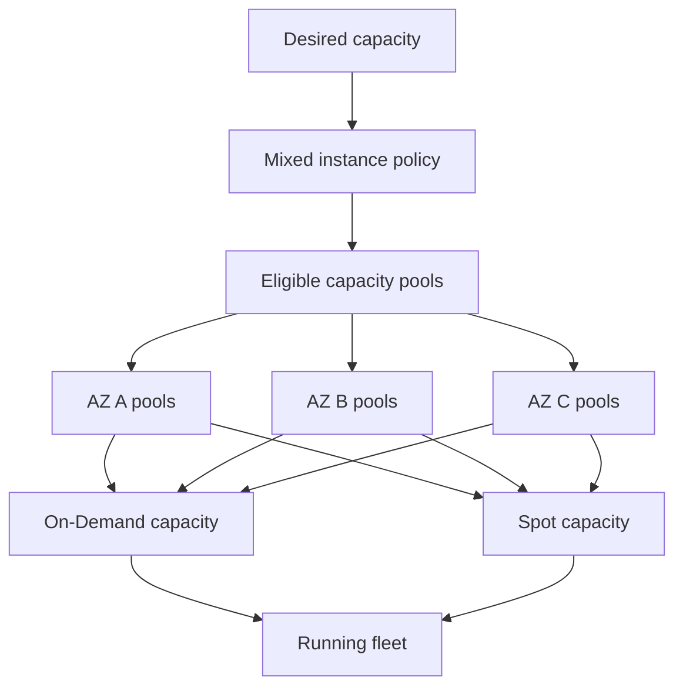
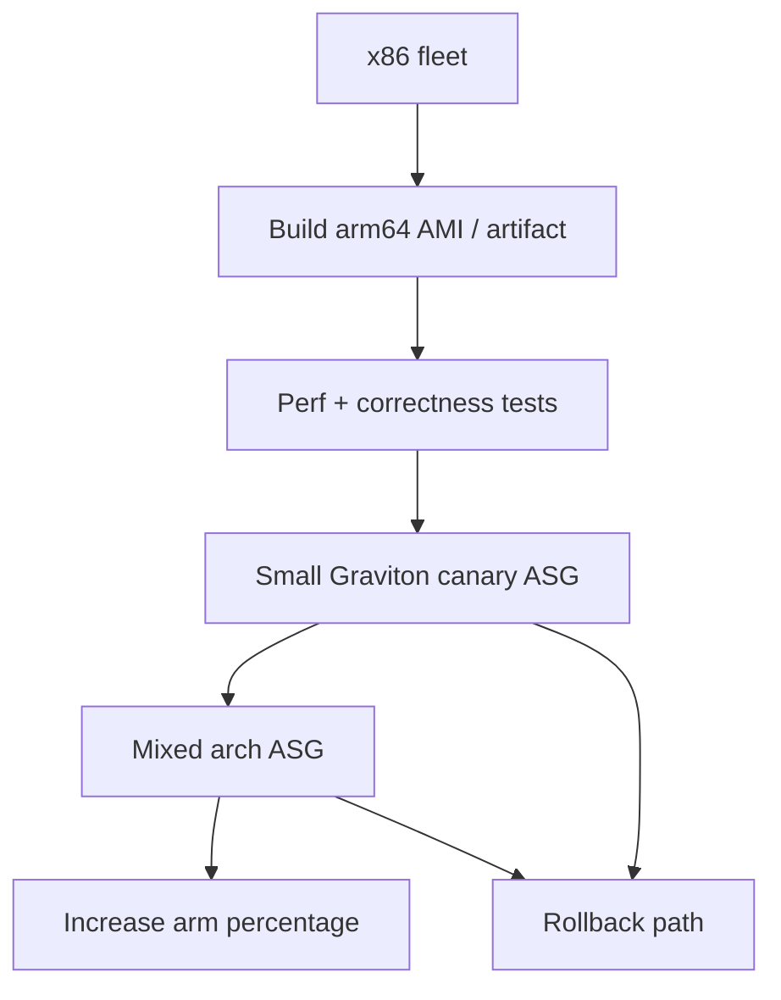
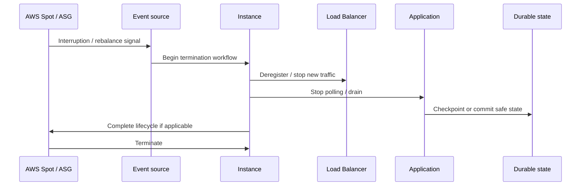

# Part 024 — Mixed Instance Policy and Capacity Diversification

> A fleet that depends on one exact instance type in one exact market is not elastic. It is a hidden capacity bet.

Auto Scaling policies decide **when** capacity should change.

Mixed instance policy decides **where that capacity can come from**.

This part is about supply-side engineering.

When an Auto Scaling Group scales out, AWS must find EC2 capacity. If your ASG says:

```text
Give me only c7i.4xlarge in these two Availability Zones.
```

then your system has a narrow supply surface.

If that exact capacity is unavailable, expensive, or interrupted, scaling fails even though the architecture “uses Auto Scaling”.

A production fleet should usually express capacity as a set of acceptable shapes, not one sacred SKU.

We will cover:

- capacity pools,
- On-Demand and Spot blending,
- MixedInstancesPolicy,
- allocation strategies,
- capacity diversification,
- weighted capacity,
- instance requirements,
- architecture compatibility,
- storage/network compatibility,
- Spot interruption and Capacity Rebalancing,
- Terraform implementation,
- failure modes,
- checklist and runbooks.

Official AWS references used while writing this part:

- [Auto Scaling groups with multiple instance types and purchase options](https://docs.aws.amazon.com/autoscaling/ec2/userguide/ec2-auto-scaling-mixed-instances-groups.html)
- [Allocation strategies for multiple instance types](https://docs.aws.amazon.com/autoscaling/ec2/userguide/allocation-strategies.html)
- [MixedInstancesPolicy API reference](https://docs.aws.amazon.com/autoscaling/ec2/APIReference/API_MixedInstancesPolicy.html)
- [InstancesDistribution API reference](https://docs.aws.amazon.com/autoscaling/ec2/APIReference/API_InstancesDistribution.html)
- [Spot Instance interruption notices](https://docs.aws.amazon.com/AWSEC2/latest/UserGuide/spot-instance-termination-notices.html)
- [Amazon EC2 Auto Scaling Capacity Rebalancing](https://docs.aws.amazon.com/autoscaling/ec2/userguide/ec2-auto-scaling-capacity-rebalancing.html)
- [Attribute-based instance type selection](https://docs.aws.amazon.com/autoscaling/ec2/userguide/create-mixed-instances-group-attribute-based-instance-type-selection.html)

---

## 1. Problem yang Diselesaikan

The naïve question is:

```text
Which EC2 instance type should this ASG use?
```

The production question is:

```text
What set of instance types, sizes, architectures, purchase options, and Availability Zones can safely provide equivalent useful capacity for this workload?
```

This matters because capacity is not abstract.

EC2 capacity exists in pools.

A practical pool is roughly:

```text
Availability Zone + instance type + purchase option
```

For Spot, the pool concept is even more important because interruption risk and availability differ by pool.

If your fleet accepts more compatible pools, it has more ways to satisfy desired capacity.

If your fleet accepts fewer pools, it has more deterministic performance but higher capacity risk.

This is the central trade-off.

```text
homogeneity -> easier performance reasoning, higher supply risk
heterogeneity -> better supply flexibility, harder performance reasoning
```

A top-tier engineer makes that trade-off explicit.

---

## 2. Mental Model: Capacity as Portfolio

Think of EC2 capacity like a portfolio.



A Mixed Instance Policy answers:

1. Which launch template is the base contract?
2. Which instance types or requirements are allowed?
3. How should On-Demand capacity be allocated?
4. How should Spot capacity be allocated?
5. What portion should be On-Demand vs Spot?
6. Do instance types have weights?
7. Can Auto Scaling rebalance risky Spot instances?
8. Are different architectures allowed?
9. Are storage/network constraints compatible?

The goal is not “use Spot everywhere”.

The goal is:

> Use the cheapest reliable capacity portfolio that preserves workload correctness and recovery behavior.

---

## 3. MixedInstancesPolicy Anatomy

At a high level, an Auto Scaling Group with mixed instances contains:

```text
AutoScalingGroup
  MixedInstancesPolicy
    LaunchTemplate
      LaunchTemplateSpecification
      Overrides
        instance_type or instance_requirements
        weighted_capacity
    InstancesDistribution
      on_demand_base_capacity
      on_demand_percentage_above_base_capacity
      spot_allocation_strategy
      on_demand_allocation_strategy
      spot_instance_pools
      spot_max_price
```

### 3.1 Launch Template as base contract

The Launch Template still defines common machine identity:

- AMI,
- user data,
- IAM instance profile,
- security groups,
- metadata options,
- block device mapping,
- monitoring,
- tags.

Overrides define what changes per capacity option.

Most commonly:

- instance type,
- weighted capacity,
- launch template override,
- instance requirements.

### 3.2 Overrides

Overrides specify acceptable capacity shapes.

Example:

```text
c7i.2xlarge
c7a.2xlarge
m7i.2xlarge
m7a.2xlarge
m6i.4xlarge with weight 2
```

This says:

```text
These are acceptable substitutes for the workload, with different capacity weights if needed.
```

Do not include an instance type unless the application can actually run correctly on it.

### 3.3 InstancesDistribution

InstancesDistribution controls purchase strategy.

Important knobs:

| Field | Meaning |
|---|---|
| `on_demand_base_capacity` | Minimum capacity fulfilled by On-Demand before Spot is used |
| `on_demand_percentage_above_base_capacity` | Percentage of capacity above base that should be On-Demand |
| `spot_allocation_strategy` | How Spot pools are selected |
| `on_demand_allocation_strategy` | How On-Demand types are selected |
| `spot_instance_pools` | Pool count for lowest-price style strategies |
| `spot_max_price` | Optional max Spot price; usually avoid unless necessary |

A simple resilient pattern:

```text
Base On-Demand capacity covers minimum static stability.
Additional burst capacity uses diversified Spot.
```

---

## 4. On-Demand vs Spot as Reliability Contract

### 4.1 On-Demand

On-Demand capacity has no long-term commitment and no Spot-style interruption. It is appropriate for:

- baseline capacity,
- stateful systems,
- quorum members,
- control plane components,
- latency-critical core traffic,
- services without safe interruption handling,
- workloads with hard availability SLOs.

But On-Demand is not infinite.

You can still hit:

- instance type capacity shortage,
- AZ-specific shortage,
- account quota,
- launch template error,
- subnet IP exhaustion,
- service limits.

On-Demand does not remove capacity engineering.

### 4.2 Spot

Spot capacity can be interrupted. AWS provides interruption notices for many interruption actions, commonly giving a short warning window before termination/stop/hibernate depending on the action.

Spot is appropriate for:

- stateless web/API burst nodes,
- queue workers,
- batch jobs,
- analytics workers,
- CI/build fleets,
- cacheable compute,
- systems with checkpointing,
- fleets with enough On-Demand baseline.

Spot is risky for:

- single-instance workloads,
- stateful primary nodes,
- databases,
- quorum-critical members,
- workloads that cannot checkpoint,
- jobs that lose hours of work on interruption,
- systems without drain and idempotency.

### 4.3 Base capacity pattern

Use On-Demand to cover the part of capacity that must exist for static stability.

Example:

```text
Normal steady state: 20 instances
One-AZ impairment budget: still serve critical traffic
Spot allowed for burst: yes

on_demand_base_capacity = 12
on_demand_percentage_above_base_capacity = 30
```

Meaning:

- first 12 capacity units are On-Demand,
- capacity above that is blended,
- Spot can reduce cost for elasticity,
- core service does not collapse if Spot drains.

---

## 5. Allocation Strategies

Allocation strategy is how AWS chooses among eligible pools.

### 5.1 Spot allocation strategies

Common Spot strategies include:

| Strategy | Mental model | Use when |
|---|---|---|
| `capacity-optimized` | Prefer pools with available capacity | Reliability over absolute lowest price |
| `price-capacity-optimized` | Balance lower price and available capacity | General production default candidate |
| `lowest-price` | Prefer cheapest pools | Cost experiments, non-critical work |
| `capacity-optimized-prioritized` | Capacity optimized but respect priority where possible | You need partial type preference |

For production, avoid “cheapest at all costs” thinking.

A low Spot price can indicate good supply, but interruption risk is not solved by price alone.

For many production workloads, `price-capacity-optimized` or `capacity-optimized` is a stronger starting point than `lowest-price`.

### 5.2 On-Demand allocation strategies

On-Demand allocation can also be strategy-driven.

You may prefer:

- prioritized instance list,
- lowest price compatible types,
- attribute-based selection.

For strict performance workloads, prioritize known-good types.

For elastic stateless fleets, allow broader compatible types.

### 5.3 Priority is not compatibility

If you specify priorities, that does not mean lower-priority types are bad.

It means:

```text
Prefer this order when multiple compatible options exist.
```

Never put incompatible types in the list and hope priority saves you.

During shortage, fallback may happen.

---

## 6. Capacity Diversification

Capacity diversification increases the number of pools that can satisfy scale-out.

Diversify across:

- instance families,
- instance generations,
- instance sizes,
- CPU vendors,
- Availability Zones,
- purchase options,
- architectures if application supports it,
- storage/no-storage variants if safe,
- network capability classes if equivalent.

### 6.1 Good diversification

Good diversification means instances are meaningfully substitutable.

Example for stateless Java API:

```text
m7i.2xlarge
m7a.2xlarge
m6i.2xlarge
m6a.2xlarge
c7i.4xlarge with weight 2
c7a.4xlarge with weight 2
```

This may work if:

- CPU architecture is same,
- AMI supports all types,
- memory per capacity unit is sufficient,
- EBS/network bandwidth is sufficient,
- JVM settings adapt to vCPU/memory,
- performance is normalized with weights.

### 6.2 Bad diversification

Bad diversification is random substitution.

Example:

```text
t3.medium
m7i.4xlarge
r7g.2xlarge
i4i.2xlarge
p5.48xlarge
```

This is not diversification.

It is chaos.

Problems:

- different CPU architecture,
- different memory shape,
- different local storage assumptions,
- different network/EBS bandwidth,
- different price order of magnitude,
- different AMI compatibility,
- different performance envelope.

### 6.3 Diversification envelope

Define an envelope:

```yaml
allowed_architecture: x86_64
min_vcpu: 8
max_vcpu: 32
min_memory_gib_per_vcpu: 3.5
min_ebs_bandwidth_mbps: 5000
min_network_bandwidth: adequate for p99 load
local_nvme_required: false
burstable_allowed: false
accelerator_required: false
```

Everything inside the envelope is eligible.

Everything outside is rejected.

---

## 7. Weighted Capacity

Weighted capacity lets different instance sizes count differently toward desired capacity.

Example:

```text
m7i.2xlarge = 1 capacity unit
m7i.4xlarge = 2 capacity units
m7i.8xlarge = 4 capacity units
```

If desired capacity is 10 units, AWS may launch:

```text
10 x m7i.2xlarge
5 x m7i.4xlarge
2 x m7i.8xlarge + 1 x m7i.4xlarge
```

Weighted capacity is useful when:

- allowed instance sizes differ,
- workload scales roughly by vCPU/memory,
- per-instance overhead is not dominant,
- load balancing handles unequal instance sizes,
- application concurrency adapts per node.

It is dangerous when:

- every instance gets equal traffic regardless of size,
- ALB distributes requests equally but capacity differs greatly,
- per-node connection limits are fixed,
- software is configured with static worker count,
- memory/cpu ratio differs significantly,
- p99 latency is affected by smaller nodes.

### 7.1 Weighted capacity must match useful capacity

Do not weight only by vCPU if memory is bottleneck.

Do not weight only by memory if CPU is bottleneck.

Do not weight by price.

Weight by useful capacity for the workload.

```text
useful_capacity = min(
  cpu_capacity / cpu_per_request,
  memory_capacity / memory_per_request,
  network_capacity / network_per_request,
  ebs_capacity / ebs_per_request,
  app_concurrency_limit
)
```

A simple benchmark is usually needed.

---

## 8. Attribute-Based Instance Type Selection

Instead of enumerating instance types manually, you can define requirements.

Example requirements:

- vCPU range,
- memory range,
- CPU manufacturer,
- burstable excluded,
- local storage required/excluded,
- accelerator excluded,
- allowed instance generations,
- bare metal excluded,
- architecture constraints.

This is powerful because AWS can select from newer compatible instance types without you constantly updating the list.

It is also dangerous if the requirements are too loose.

### 8.1 Good use case

Stateless API with flexible compute shape:

```text
8–16 vCPU
32–64 GiB memory
x86_64
no accelerator
no local disk required
current generation preferred
burstable excluded
```

### 8.2 Bad use case

Stateful system needing local NVMe and exact storage layout:

```text
any 8–64 vCPU instance
any memory
local storage optional
```

This can place the workload on an instance that violates assumptions.

### 8.3 Attribute-based selection rule

Only use attribute-based selection after documenting:

- AMI architecture compatibility,
- OS driver compatibility,
- JVM/runtime tuning compatibility,
- EBS/network minimums,
- local storage expectations,
- memory/vCPU ratio,
- performance benchmark envelope,
- cost guardrail,
- excluded families.

---

## 9. Architecture Compatibility: x86, Arm, Graviton

Mixing x86 and Arm can be excellent.

It can also break production instantly.

A mixed architecture fleet requires:

- multi-architecture AMI strategy,
- package compatibility,
- runtime compatibility,
- native library compatibility,
- container image multi-arch support if containers run on EC2,
- JVM flags validated on both architectures,
- monitoring agent compatibility,
- security agent compatibility,
- performance benchmarks per architecture.

### 9.1 Safe migration pattern



Do not mix architectures in the same ASG until rollback is boring.

### 9.2 Java-specific concerns

For Java workloads:

- validate JDK distribution supports architecture,
- validate JNI/native libraries,
- validate compression/crypto libraries,
- check GC behavior,
- check CPU flags and vectorization assumptions,
- benchmark warmup and p99 latency,
- verify container images if using ECS/EKS on EC2.

Java bytecode portability does not automatically mean production equivalence.

---

## 10. Storage and Network Compatibility

This is a compute-storage series, so we must be strict here.

Not all instance types are equivalent for storage and network behavior.

### 10.1 EBS bandwidth

Two instance types with same vCPU can have different EBS bandwidth and IOPS capability.

If the workload is EBS-heavy, include minimum EBS bandwidth in your selection logic.

Bad pattern:

```text
Allow any 8 vCPU instance for a database-adjacent worker that writes heavy logs and local indexes.
```

Better:

```text
Allow only types with enough EBS-optimized bandwidth for peak write path.
```

### 10.2 Network bandwidth

Network bandwidth matters for:

- ALB traffic,
- service-to-service calls,
- S3 transfer,
- EFS/FSx mounts,
- replication,
- log shipping,
- data pipeline shuffle,
- large response payloads.

If smaller instance types have lower baseline network performance, weighted capacity must reflect that.

### 10.3 Instance store

If the workload depends on local NVMe instance store, do not diversify into types without it.

If local storage is only cache/scratch, ensure bootstrapping formats and mounts it conditionally.

```bash
if lsblk | grep -q nvme1n1; then
  mkfs.xfs -f /dev/nvme1n1
  mkdir -p /mnt/scratch
  mount /dev/nvme1n1 /mnt/scratch
else
  mkdir -p /mnt/scratch
  mount -t tmpfs -o size=4g tmpfs /mnt/scratch
fi
```

This script is simplified. Production scripts need idempotency, device discovery safety, and mount validation.

### 10.4 EBS root volume assumptions

Different instance types can expose devices differently.

Use stable device handling and avoid brittle hardcoded paths.

Validate:

- NVMe naming,
- root device mapping,
- data volume attachment,
- filesystem UUIDs,
- mount units,
- timeout behavior,
- rescue procedure.

---

## 11. Terraform Implementation Skeleton

### 11.1 Mixed instance ASG with explicit overrides

```hcl
resource "aws_autoscaling_group" "api" {
  name                = "api-prod"
  min_size            = 6
  max_size            = 80
  desired_capacity    = 12
  vpc_zone_identifier = var.private_subnet_ids

  health_check_type         = "ELB"
  health_check_grace_period = 300

  mixed_instances_policy {
    launch_template {
      launch_template_specification {
        launch_template_id = aws_launch_template.api.id
        version            = "$Latest"
      }

      override {
        instance_type     = "m7i.2xlarge"
        weighted_capacity = "1"
      }

      override {
        instance_type     = "m7a.2xlarge"
        weighted_capacity = "1"
      }

      override {
        instance_type     = "m6i.2xlarge"
        weighted_capacity = "1"
      }

      override {
        instance_type     = "m6a.2xlarge"
        weighted_capacity = "1"
      }

      override {
        instance_type     = "m7i.4xlarge"
        weighted_capacity = "2"
      }
    }

    instances_distribution {
      on_demand_base_capacity                  = 6
      on_demand_percentage_above_base_capacity = 40
      on_demand_allocation_strategy            = "prioritized"
      spot_allocation_strategy                 = "price-capacity-optimized"
    }
  }

  tag {
    key                 = "Service"
    value               = "api"
    propagate_at_launch = true
  }
}
```

This is a skeleton. Production modules need lifecycle hooks, target group attachment, instance refresh, monitoring, alarms, and guardrails.

### 11.2 Attribute-based instance selection sketch

Terraform provider syntax may vary by version. Conceptually:

```hcl
override {
  instance_requirements {
    vcpu_count {
      min = 8
      max = 16
    }

    memory_mib {
      min = 32768
      max = 65536
    }

    cpu_manufacturers = ["intel", "amd"]

    burstable_performance = "excluded"

    accelerator_count {
      max = 0
    }

    local_storage = "excluded"
  }
}
```

The real contract is not the Terraform block.

The real contract is the documented compatibility envelope.

### 11.3 Capacity Rebalancing

Capacity Rebalancing lets Auto Scaling respond when Spot instances are at elevated interruption risk.

Conceptual Terraform:

```hcl
resource "aws_autoscaling_group" "workers" {
  # ...

  capacity_rebalance = true

  mixed_instances_policy {
    # ...
  }
}
```

Use it with proper drain handling. Rebalancing gives the fleet a chance to replace risky capacity, but your application must still tolerate interruption.

---

## 12. Application Requirements Before Using Spot

Before using Spot in a production fleet, answer yes to these.

### 12.1 Stateless API

- [ ] Node can be terminated without data loss.
- [ ] ALB deregistration delay is configured.
- [ ] App handles SIGTERM or shutdown notice.
- [ ] No local-only session state.
- [ ] In-flight request behavior is acceptable.
- [ ] Minimum On-Demand baseline exists.
- [ ] Spot interruption event is monitored.
- [ ] Scale-in and interruption use same drain path.

### 12.2 Queue worker

- [ ] Work items are idempotent.
- [ ] Visibility timeout exceeds max processing or is extended.
- [ ] Partial work can be retried.
- [ ] Long jobs checkpoint.
- [ ] Worker stops polling before termination.
- [ ] Downstream quotas are protected.
- [ ] DLQ exists.
- [ ] Max Spot loss scenario is modeled.

### 12.3 Batch jobs

- [ ] Job checkpointing exists or job duration is short.
- [ ] Retry policy is configured.
- [ ] Spot interruption notice is consumed if useful.
- [ ] Intermediate data is durable enough.
- [ ] Output commit is atomic/idempotent.
- [ ] Cost saving exceeds recomputation cost.

### 12.4 Stateful workloads

Default answer: no.

Only use Spot if the stateful system is explicitly designed for member loss, replication, quorum safety, and interruption handling.

---

## 13. Interruption Handling

Spot interruptions should not be special snowflakes.

Treat them like another termination path.



### 13.1 Handling channels

Common signal sources:

- Instance metadata interruption notice,
- EventBridge events,
- Auto Scaling lifecycle hooks,
- Capacity Rebalancing events,
- OS signals during shutdown,
- application-level drain endpoint.

Do not depend on only one signal if correctness requires drain.

### 13.2 Graceful interruption pattern

For API instance:

```text
1. Mark local app as draining.
2. Fail readiness endpoint or deregister from ALB.
3. Stop accepting new requests.
4. Complete in-flight requests up to deadline.
5. Flush logs/metrics.
6. Exit.
```

For worker instance:

```text
1. Stop polling new messages.
2. Extend visibility timeout for active work if supported.
3. Complete short tasks.
4. Checkpoint long tasks.
5. Release leases.
6. Exit.
```

---

## 14. Capacity Risk Modeling

A mixed fleet should have an explicit capacity risk model.

### 14.1 Supply surface

Document:

```text
eligible_instance_types = ?
eligible_AZs = ?
eligible_purchase_options = ?
allowed_architectures = ?
min_capacity_units = ?
max_capacity_units = ?
on_demand_baseline = ?
spot_percentage = ?
```

Then calculate:

```text
pool_count = instance_types * AZs * purchase_options
```

This is simplified, but useful.

More pools usually means better supply flexibility.

### 14.2 Static stability under Spot loss

Ask:

```text
If all Spot capacity disappeared quickly, what happens?
```

Possible answers:

| Workload | Acceptable result |
|---|---|
| User-facing core API | Service remains degraded but available |
| Queue workers | Backlog grows but no data loss |
| Batch jobs | Jobs retry/checkpoint; deadline still acceptable |
| CI fleet | Builds slow down |
| Cache fleet | Hit rate drops but origin survives |
| Stateful DB | Usually unacceptable |

If total Spot loss causes user-visible total outage, your On-Demand baseline is too low or the workload is not suitable for that Spot ratio.

### 14.3 AZ impairment and mixed policy

Do not confuse mixed instance diversification with AZ fault tolerance.

You need both:

```text
instance diversification: many compatible types
AZ diversification: capacity across failure domains
purchase diversification: On-Demand + Spot where safe
```

A fleet with 20 instance types in one AZ is still one-AZ fragile.

---

## 15. Performance Normalization

Heterogeneous fleets complicate performance.

### 15.1 Equal traffic, unequal nodes

Load balancers commonly distribute traffic across targets without knowing your custom capacity weights.

If one target is half as powerful, it may receive similar request count and become the p99 tail.

Solutions:

- keep instance sizes close,
- use weighted target groups only if architecture supports it,
- tune application concurrency based on node capacity,
- expose per-node saturation metrics,
- avoid mixing very small and very large nodes in one target group,
- split ASGs by capacity class if needed.

### 15.2 JVM and container sizing

If instances differ, runtime sizing must adapt.

For Java:

```text
heap = function(memory)
worker_threads = function(vcpu)
connection_pool = bounded function(vcpu) but capped by downstream budget
GC settings = validated per class
```

Avoid static settings like:

```text
-Xmx24g on every node
worker_threads=256 on every node
max_db_connections=200 on every node
```

Those settings may be safe on one type and catastrophic on another.

### 15.3 Benchmark per capacity unit

For each candidate type, measure:

- throughput at target latency,
- p95/p99 latency,
- CPU saturation point,
- memory headroom,
- network throughput,
- EBS throughput/latency,
- startup/warmup time,
- cost per useful request/job,
- failure behavior under load.

Then define allowed types.

Do not let procurement logic decide production compatibility alone.

---

## 16. Failure Modes

### 16.1 Capacity shortage despite Auto Scaling

Symptom:

```text
Desired capacity increases, but instances do not launch.
```

Causes:

- too few instance types,
- too few AZs,
- On-Demand shortage,
- Spot pools unavailable,
- account quota,
- subnet IP exhaustion,
- invalid launch template,
- incompatible AMI/architecture,
- EBS volume or KMS issue.

Fix:

- inspect scaling activities,
- broaden instance type list,
- add compatible AZs,
- increase quotas,
- add On-Demand baseline,
- validate launch template,
- preflight capacity-critical deployments.

### 16.2 Architecture mismatch

Symptom:

```text
Instances launch but app fails at boot.
```

Causes:

- arm64 instance with x86 AMI,
- native dependency mismatch,
- agent unsupported on architecture,
- container image not multi-arch.

Fix:

- separate launch templates per architecture,
- validate AMI build matrix,
- canary new architecture,
- use explicit architecture constraints.

### 16.3 Performance tail due to heterogeneous sizes

Symptom:

```text
Fleet average is healthy, but p99 latency worsens after diversification.
```

Causes:

- smaller nodes receive same traffic,
- static thread/heap settings,
- lower EBS/network bandwidth,
- CPU generation differences,
- uneven warmup.

Fix:

- reduce heterogeneity range,
- normalize capacity with weights,
- split target groups,
- tune per-instance capacity,
- exclude weak types.

### 16.4 Spot interruption storm

Symptom:

```text
Many Spot instances terminate close together.
```

Causes:

- too much capacity in few pools,
- lowest-price concentration,
- no Capacity Rebalancing,
- low On-Demand baseline,
- poor drain handling.

Fix:

- use capacity-aware allocation strategy,
- diversify more pools,
- raise On-Demand baseline,
- enable Capacity Rebalancing,
- improve drain/checkpoint.

### 16.5 Cost surprise

Symptom:

```text
Fleet scales successfully but cost explodes.
```

Causes:

- allowed instance range too broad,
- large fallback types,
- weighted capacity wrong,
- On-Demand percentage too high,
- scheduled desired capacity not lowered,
- predictive over-scaling,
- price guardrails missing.

Fix:

- constrain allowed types,
- review cost per useful unit,
- set budgets and anomaly detection,
- tune base and percentage,
- verify scheduled actions,
- separate emergency capacity from normal fleet.

### 16.6 Storage assumption break

Symptom:

```text
New instances launch but workload fails due to missing disk or lower I/O.
```

Causes:

- diversified into no-instance-store type,
- EBS bandwidth too low,
- device naming differs,
- root/data volume mapping invalid,
- filesystem mount script not idempotent.

Fix:

- encode local storage requirement,
- set minimum EBS/network capability,
- make boot scripts device-safe,
- load test storage path per type.

### 16.7 Quota hidden as capacity issue

Symptom:

```text
Scale-out fails only during peak.
```

Causes:

- vCPU quota exhausted,
- Spot quota exhausted,
- Elastic IP/NAT/subnet IP constraints,
- ENI limits,
- target group registration limits,
- KMS/API throttling in boot path.

Fix:

- monitor service quotas,
- request quota increases before event,
- reduce boot-time API calls,
- pre-scale earlier,
- maintain capacity buffer.

---

## 17. Operational Runbook

### 17.1 Scale-out cannot launch enough instances

Do this:

1. Inspect ASG scaling activities.
2. Identify whether failure is capacity, quota, launch template, subnet, health check, or lifecycle.
3. Check current desired vs in-service vs pending vs unhealthy.
4. Check instance type and AZ distribution.
5. Check On-Demand/Spot ratio.
6. Broaden capacity pools if safe.
7. Temporarily raise On-Demand percentage if Spot unavailable.
8. Temporarily use known compatible fallback family.
9. Raise quota if quota-bound.
10. Protect downstream before forcing large scale-out.

### 17.2 Spot interruption storm

Do this:

1. Confirm interruption/rebalance events.
2. Freeze scale-in if recovery is unstable.
3. Increase On-Demand percentage temporarily.
4. Confirm lifecycle/drain is working.
5. Reduce worker concurrency if downstream is stressed.
6. Let queue backlog absorb if async workload.
7. Broaden pools after compatibility check.
8. Review allocation strategy after incident.

### 17.3 Heterogeneous fleet causes p99 regression

Do this:

1. Break metrics down by instance type.
2. Compare latency, CPU, memory, network, EBS by type.
3. Check if smaller types receive equal request load.
4. Check JVM/app config per node.
5. Remove underperforming type from overrides.
6. Re-run benchmark.
7. Adjust weights or split fleets.

### 17.4 Cost spike after mixed policy rollout

Do this:

1. Compare instance distribution before/after.
2. Check On-Demand percentage.
3. Check if large weighted types dominate.
4. Check scheduled/predictive scaling actions.
5. Check if Spot fallback shifted to On-Demand.
6. Check cost per useful unit, not just hourly cost.
7. Tighten requirements and max sizes.

---

## 18. Production Checklist

### 18.1 Compatibility checklist

- [ ] All allowed instance types support the AMI architecture.
- [ ] Application dependencies work on each architecture.
- [ ] Runtime settings adapt to vCPU/memory.
- [ ] Minimum memory per capacity unit is satisfied.
- [ ] Minimum network bandwidth is satisfied.
- [ ] Minimum EBS bandwidth/IOPS path is satisfied.
- [ ] Local storage assumptions are explicit.
- [ ] Burstable instances are included only intentionally.
- [ ] Accelerated/GPU/bare-metal types are excluded unless required.
- [ ] Monitoring/security agents run on all allowed types.

### 18.2 Capacity checklist

- [ ] Fleet spans enough Availability Zones.
- [ ] Fleet has enough compatible instance pools.
- [ ] On-Demand baseline covers static stability.
- [ ] Spot percentage is safe for interruption scenario.
- [ ] Capacity Rebalancing is considered for Spot-heavy fleets.
- [ ] Max capacity is safe for downstream systems.
- [ ] Quotas are sufficient for peak and failover.
- [ ] Subnet IP capacity is sufficient.
- [ ] Scale-out failure alarms exist.

### 18.3 Cost checklist

- [ ] Cost per useful capacity unit is benchmarked.
- [ ] Large fallback types are intentional.
- [ ] Weighted capacity matches real capacity.
- [ ] Savings Plans/Reserved Instances align with On-Demand baseline.
- [ ] Spot savings exceed recomputation/interruption cost.
- [ ] Budgets and anomaly detection are configured.
- [ ] Emergency scaling has review process.

### 18.4 Operational checklist

- [ ] Spot interruption handling is tested.
- [ ] Lifecycle drain works for all termination paths.
- [ ] Instance distribution dashboard exists.
- [ ] Per-instance-type performance dashboard exists.
- [ ] ASG scaling activities are monitored.
- [ ] Launch failures page the right team.
- [ ] Rollback removes bad instance type quickly.
- [ ] Incident commander can temporarily pin On-Demand ratio.

---

## 19. Mini Case Study: Case Processing Worker Fleet

A regulatory platform has a document processing worker fleet.

Each worker:

- downloads files from S3,
- extracts metadata,
- writes results to PostgreSQL,
- stores generated artifacts back to S3,
- handles idempotent job IDs.

Initial fleet:

```text
ASG: c6i.4xlarge only
purchase: On-Demand only
min: 10
max: 100
```

Problem:

- monthly filing deadline creates 8x backlog,
- On-Demand capacity for exact type becomes constrained in one AZ,
- scale-out is slow,
- cost is high during burst.

Naïve fix:

```text
Use 100% Spot, lowest-price.
```

New problem:

- interruption storm kills long jobs,
- retries amplify database writes,
- p99 completion time worsens,
- some pools have weaker EBS/network performance.

Production design:

```text
On-Demand baseline:
- 20 capacity units, enough for steady-state and recovery.

Spot burst:
- 60% of capacity above baseline.
- price-capacity-optimized allocation.
- Capacity Rebalancing enabled.

Allowed types:
- c7i.4xlarge, c7a.4xlarge, c6i.4xlarge, c6a.4xlarge.
- m7i.4xlarge only if memory pressure requires.
- no burstable.
- no local storage requirement.

Worker behavior:
- checkpoint every document phase.
- stop polling on drain.
- idempotent output commit.
- DB connection cap per worker.

Scaling metric:
- estimated backlog seconds per capacity unit.

Guardrails:
- DB CPU and connection saturation cap scale-out.
- S3 error/throttle metrics monitored.
- cost anomaly alert.
```

Result:

- burst cost drops,
- capacity risk decreases due to more pools,
- interruption is absorbed by idempotent retry,
- database is protected by worker concurrency cap,
- scale-out no longer depends on one exact instance type.

The key insight:

> Mixed instances are not a cost trick. They are capacity resilience, but only when compatibility and interruption semantics are engineered.

---

## 20. Summary

Mixed instance policy turns an Auto Scaling Group from a single-SKU fleet into a capacity portfolio.

Key takeaways:

- One exact instance type is a hidden capacity risk.
- Diversification must stay inside a documented compatibility envelope.
- On-Demand baseline protects static stability.
- Spot is excellent for interruptible or drainable workloads, not for accidental stateful systems.
- Allocation strategy determines whether you chase low price, capacity availability, or both.
- Weighted capacity must reflect useful workload capacity, not merely vCPU count.
- Attribute-based selection is powerful but dangerous when requirements are loose.
- Heterogeneous fleets need per-type performance visibility.
- Storage and network compatibility are first-class constraints.
- Interruption handling must share the same safe termination path as scale-in.

In the next part, we will reduce the time between desired capacity and useful capacity:

> Warm pools and fast recovery — how to pre-initialize capacity without accidentally paying for idle complexity.
