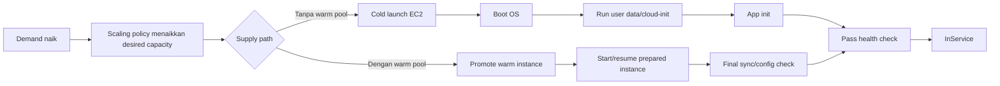
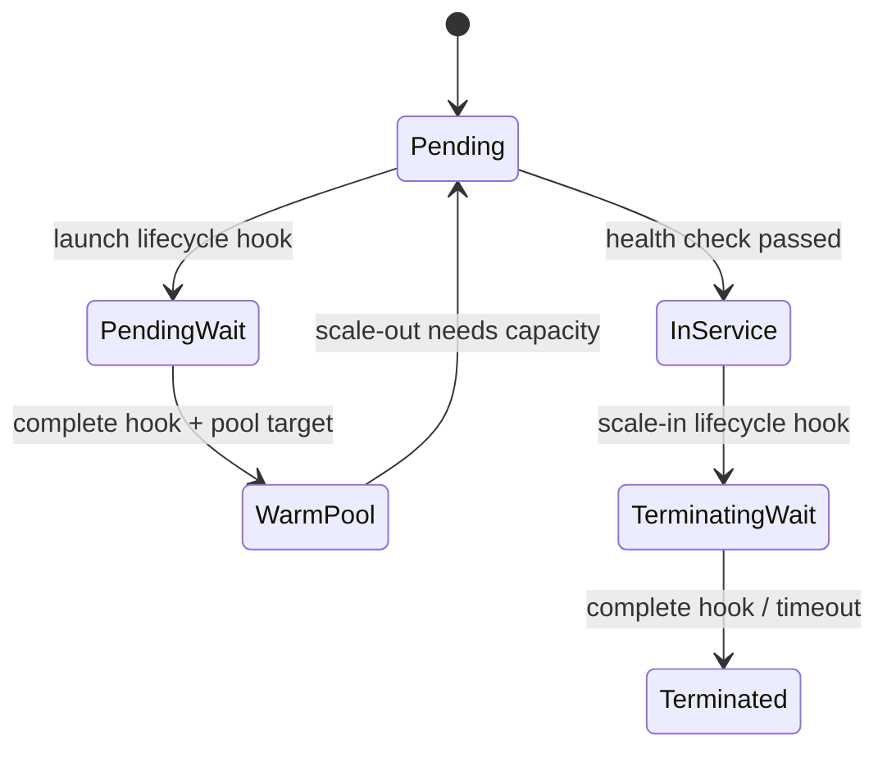
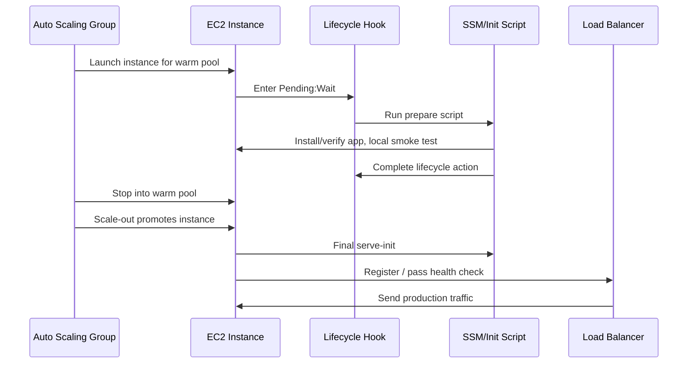
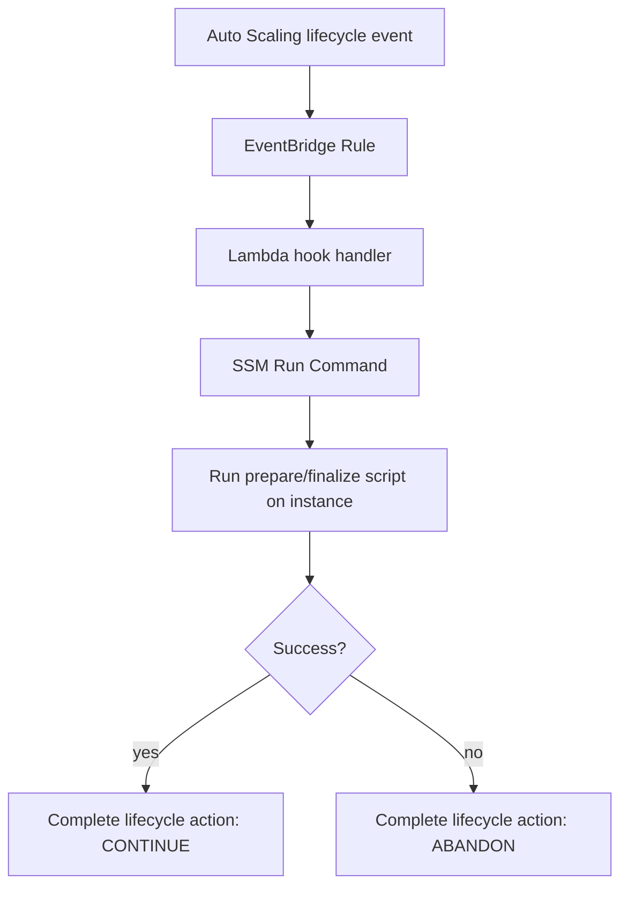

# Part 025 — Warm Pools and Fast Recovery

## 1. Problem yang Diselesaikan

Pada part sebelumnya kita sudah melihat Auto Scaling sebagai control loop. Masalahnya: control loop yang benar belum tentu cukup cepat.

Banyak sistem production gagal bukan karena tidak bisa scale out, tetapi karena **kapasitas tambahan datang terlambat**.

Contoh klasik:

- instance butuh 4 menit untuk boot OS;
- user data butuh 2 menit untuk install/configure dependency;
- aplikasi Java butuh 90 detik untuk start, load class, warm JIT, dan establish connection pool;
- cache lokal/model ML/rule engine butuh 3 menit untuk preload;
- health check baru healthy setelah semua siap.

Totalnya bisa 8–12 menit sebelum instance benar-benar berguna. Untuk traffic spike yang naik dalam 2 menit, Auto Scaling sudah benar secara konfigurasi tetapi tetap kalah secara waktu.

**Warm pool** menyelesaikan sebagian masalah ini dengan menyiapkan instance sebelum dibutuhkan. Instance tidak langsung melayani traffic, tetapi sudah melewati sebagian fase initialization. Ketika scale-out terjadi, Auto Scaling mengambil instance dari pool yang sudah warm, bukan membuat instance benar-benar cold dari nol.

Mental model paling penting:

> Warm pool bukan pengganti Auto Scaling. Warm pool adalah staging buffer untuk mengurangi latency supply kapasitas.

Jika Auto Scaling menjawab “berapa banyak kapasitas yang dibutuhkan?”, warm pool menjawab “seberapa cepat kapasitas itu bisa tersedia?”.

---

## 2. Mental Model

Bayangkan fleet EC2 sebagai pipa kapasitas.



Tanpa warm pool, scale-out latency kira-kira:

```text
scale_out_latency = cloud_capacity_acquisition
                  + instance_boot
                  + os_init
                  + dependency_init
                  + application_init
                  + health_check_convergence
                  + load_balancer_registration
```

Dengan warm pool, sebagian fase dipindahkan ke waktu sebelum spike:

```text
scale_out_latency_with_warm_pool = promote_or_start_warm_instance
                                 + finalization
                                 + health_check_convergence
                                 + load_balancer_registration
```

Warm pool membuat supply path lebih pendek. Tetapi ia tidak membuat supply path gratis. Anda tetap membayar sebagian resource, tetap punya lifecycle state, tetap punya drift risk, dan tetap harus mendesain initialization dengan benar.

---

## 3. Core Concepts

### 3.1 Active capacity vs prepared capacity

Dalam Auto Scaling Group biasa, kapasitas utama adalah instance `InService`.

Dengan warm pool, ada dua lapis kapasitas:

| Kapasitas | Arti |
|---|---|
| Active capacity | Instance yang berada di ASG utama dan melayani workload |
| Prepared capacity | Instance yang berada di warm pool, belum melayani traffic, tetapi sudah disiapkan |

Warm pool tidak boleh dipikirkan sebagai “idle production node”. Ia adalah **candidate capacity**.

Candidate capacity harus memenuhi syarat:

- bootable;
- configuration valid;
- dependency dasar tersedia;
- application binary benar;
- observability agent hidup;
- secret/config refresh path aman;
- storage attachment/mount behavior jelas;
- bisa dipromosikan tanpa manual step.

### 3.2 Warm pool state

Auto Scaling warm pool mendukung beberapa state untuk prepared instance, tergantung konfigurasi dan support instance:

| State | Karakter | Cocok untuk |
|---|---|---|
| `Stopped` | Instance sudah dibuat lalu dihentikan; start lebih cepat dari launch baru, tetapi runtime memory hilang | Banyak aplikasi umum dengan init OS/app mahal tetapi tidak perlu memory preserved |
| `Running` | Instance tetap running di warm pool | Scale-out tercepat, tetapi biaya lebih tinggi |
| `Hibernated` | Memory state dipertahankan jika didukung | Workload dengan initialization memory mahal, tetapi support dan caveat lebih banyak |

Default yang sering masuk akal adalah `Stopped`: lebih murah daripada running, tetapi tetap menghemat sebagian waktu launch. Untuk latency kritis, `Running` bisa dipilih, tetapi itu mendekati overprovisioning.

### 3.3 Warm pool bukan health check utama

Ada jebakan umum: instance di warm pool dianggap “siap” padahal hanya “pernah berhasil boot”.

Production readiness harus dibagi menjadi dua:

```text
prepared_ready  = cukup siap untuk disimpan di warm pool
serving_ready   = cukup siap untuk menerima traffic production
```

`prepared_ready` boleh lebih ringan. `serving_ready` harus ketat.

Contoh:

- prepared ready: binary terinstall, service bisa start, agent jalan;
- serving ready: config terbaru ditarik, secret valid, DB connection pool valid, target group healthy, cache minimal siap, dependency downstream reachable.

### 3.4 Lifecycle hooks sebagai state machine

Warm pool menjadi kuat ketika dikombinasikan dengan lifecycle hooks.

Lifecycle hooks memungkinkan aksi custom saat instance masuk fase tertentu, misalnya:

- instance sedang launch;
- instance masuk warm pool;
- instance keluar warm pool menuju `InService`;
- instance akan terminate.

Diagram sederhananya:



Lifecycle hook bukan sekadar tempat menjalankan script. Ia adalah **barrier**. Auto Scaling menunggu sampai custom action selesai atau timeout.

### 3.5 Default instance warmup vs warm pool

`default instance warmup` dan `warm pool` sering tertukar.

| Konsep | Fungsi |
|---|---|
| Warm pool | Menyiapkan instance sebelum dibutuhkan untuk mengurangi supply latency |
| Default instance warmup | Memberi waktu agar instance baru stabil sebelum metriknya dipakai penuh dalam scaling decision |
| Health check grace period | Memberi waktu sebelum health check failure dianggap valid setelah launch |
| Cooldown | Mencegah scaling action tertentu terjadi terlalu rapat dalam policy tertentu |

Warm pool mempercepat supply. Instance warmup memperbaiki interpretasi metric. Health check grace period menghindari premature replacement. Cooldown mengurangi oscillation.

Jangan gunakan salah satu untuk menggantikan yang lain.

---

## 4. Kapan Warm Pool Layak Dipakai

Warm pool bukan default untuk semua fleet. Gunakan jika ada bukti bahwa cold start capacity adalah bottleneck.

### 4.1 Sinyal bahwa warm pool dibutuhkan

Warm pool layak dipertimbangkan jika:

- scale-out terjadi benar, tetapi latency/error tetap naik sebelum instance baru siap;
- boot + application readiness lebih lama daripada waktu kenaikan demand;
- workload punya spike pendek dan tajam;
- scheduled scaling masih kurang karena spike tidak selalu presisi;
- dependency initialization mahal, misalnya JVM warmup, model loading, large ruleset, sidecar registration;
- fleet menggunakan Spot/mixed capacity dan ingin mempercepat replacement path;
- recovery setelah instance refresh/bad node terlalu lambat.

### 4.2 Sinyal bahwa warm pool tidak dibutuhkan

Warm pool mungkin tidak layak jika:

- aplikasi boot di bawah 30–60 detik;
- workload queue-based dan toleran delay;
- demand pattern sangat predictable dan scheduled scaling cukup;
- overprovisioning kecil lebih murah daripada complexity warm pool;
- aplikasi selalu butuh state terbaru yang tidak aman disiapkan jauh sebelumnya;
- initialization bottleneck sebenarnya ada di dependency downstream, bukan EC2 launch;
- warm instances sering stale dan perlu reinitialize penuh.

### 4.3 Decision table

| Problem | Pilihan awal | Jika tidak cukup |
|---|---|---|
| Spike predictable setiap hari | Scheduled scaling | Warm pool + scheduled scaling |
| Cold start app sangat mahal | Optimize AMI/user data | Warm pool |
| Dependency overload saat scale-out | Staggered startup | Warm pool + rate-limited initialization |
| Spot interruption replacement lambat | Capacity Rebalancing + mixed pools | Warm pool untuk replacement faster path |
| Java service cold p99 tinggi | Class data sharing/JIT tuning | Warm pool running/hibernated untuk kasus tertentu |
| Queue workers terlambat mengejar backlog | Queue-based scaling | Warm pool + higher max capacity |

---

## 5. Production Design

### 5.1 Pisahkan boot initialization dan serve initialization

Jangan jadikan user data melakukan semua hal sekaligus tanpa boundary. Pisahkan fase:

```text
machine_init:
  - OS package already baked or installed
  - agent installed
  - filesystem mounted
  - base service configured

prepared_init:
  - binary verified
  - service can start
  - dependency clients configured
  - smoke test local passes

serve_init:
  - fetch latest config
  - validate secrets
  - register/discover dependencies
  - warm minimal cache
  - pass production health check
```

Warm pool idealnya menyelesaikan `machine_init` dan sebagian `prepared_init`. Saat instance dipromosikan, ia menjalankan `serve_init`.

Kenapa tidak semua dilakukan di warm pool?

Karena data bisa stale:

- secret rotate;
- config berubah;
- feature flag berubah;
- DNS/cache stale;
- certificate mendekati expiry;
- model/ruleset sudah diganti;
- downstream connection dari sebelum stop tidak valid.

### 5.2 Treat warm instance as “not yet trusted”

Instance dari warm pool tidak otomatis dipercaya. Ia harus melewati final validation.

Minimal final validation:

- instance identity valid;
- AMI/launch template version sesuai expected version;
- clock sync sehat;
- root disk tidak hampir penuh;
- config generation terbaru;
- secret bisa diambil ulang;
- app process running;
- readiness endpoint healthy;
- target group health healthy jika melayani HTTP;
- log/metrics agent hidup;
- no stale lock dari previous lifecycle.

### 5.3 Warm pool size

Warm pool size harus berasal dari demand model.

Sederhana:

```text
required_warm_capacity = peak_capacity_needed_within_reaction_window
                       - active_capacity_already_available
```

Contoh:

- current active = 20 instance;
- spike bisa membutuhkan +12 instance dalam 3 menit;
- cold launch readiness = 8 menit;
- warm promote readiness = 90 detik;
- maka warm pool minimal perlu menutup sebagian besar +12 tersebut.

Tetapi jangan set warm pool sebesar seluruh max capacity tanpa alasan. Itu memindahkan cost ke idle prepared capacity.

### 5.4 Warm pool as latency budget control

Tentukan SLO scale-out internal:

```text
When demand exceeds current useful capacity by N units,
we must add M useful instances within T seconds.
```

Contoh:

```text
When request load exceeds active capacity by 25%,
we must add 10 useful instances within 180 seconds,
without p99 latency exceeding 500ms for more than 2 minutes.
```

Dari sini baru pilih:

- warm pool stopped;
- warm pool running;
- scheduled pre-fill;
- overprovisioning;
- app startup optimization;
- queue-based buffering.

### 5.5 Jangan membuat warm pool menyembunyikan startup buruk

Warm pool sering dipakai sebagai plaster untuk startup yang buruk.

Sebelum warm pool, ukur:

```text
T0 = EC2 launch request accepted
T1 = instance running
T2 = cloud-init complete
T3 = app process started
T4 = local readiness healthy
T5 = target group healthy
T6 = useful traffic processed
```

Jika T2–T3 lambat karena download package besar setiap boot, solusinya mungkin AMI baking. Jika T4–T5 lambat karena readiness endpoint buruk, solusinya health contract. Jika T5–T6 lambat karena connection pool storm, solusinya staggered readiness/backpressure.

Warm pool membantu, tetapi root cause tetap harus terlihat.

---

## 6. Implementation Pattern

### 6.1 Pattern A — Warm pool stopped untuk stateless API fleet

Cocok untuk:

- HTTP API stateless;
- binary besar;
- boot sedang-lama;
- initialization cukup aman dilakukan sebelum serve;
- traffic spike butuh response cepat.



Key rule:

> Anything stale-sensitive must run after promotion, not only before warm pool entry.

### 6.2 Pattern B — Warm pool running untuk ultra-fast failover

Cocok untuk:

- latency-sensitive service;
- initialization sangat mahal;
- cost idle masih dapat diterima;
- downtime/scale lag jauh lebih mahal daripada cost.

Trade-off:

- biaya hampir seperti overprovisioning;
- harus mencegah instance menerima traffic sebelum waktunya;
- stale connection/cache risk lebih tinggi;
- observability noise dari non-serving nodes harus difilter.

### 6.3 Pattern C — Warm pool + scheduled scaling

Cocok untuk pattern yang predictable tetapi tidak ingin semua kapasitas aktif terlalu cepat.

Contoh:

- traffic tinggi mulai jam 08:00;
- active capacity dinaikkan jam 07:55;
- warm pool diisi sebelum jam 07:45;
- saat spike lebih tinggi dari forecast, warm pool masih punya buffer cepat.

Ini lebih hemat daripada menaikkan semua active instance jauh sebelum traffic datang.

### 6.4 Pattern D — Warm pool + mixed instance policy

Cocok untuk fleet yang memakai Spot dan On-Demand campuran.

Tujuannya:

- menyiapkan kapasitas dari beberapa pool;
- mengurangi replacement lag;
- memitigasi kapasitas unavailable di satu instance type;
- tetap punya On-Demand base capacity.

Caveat:

- prepared capacity harus kompatibel secara performance;
- warm pool bisa terisi instance family yang tidak ideal jika allocation strategy terlalu longgar;
- benchmark harus berdasarkan weighted capacity, bukan jumlah instance.

### 6.5 Pattern E — Warm pool untuk ECS container instances

Warm pool bisa dipakai untuk EC2 yang menjadi ECS container instance.

Namun ada perbedaan besar:

- instance siap belum berarti container capacity siap;
- ECS agent harus register dengan cluster;
- container image pull bisa menjadi bottleneck;
- task placement baru terjadi setelah instance available;
- draining saat scale-in tetap wajib.

Untuk ECS, warm pool harus memperhatikan:

- ECS agent state setelah stop/start;
- container image cache apakah masih valid;
- capacity provider behavior;
- managed instance draining;
- target tracking metric berdasarkan service/task capacity, bukan hanya EC2 CPU.

---

## 7. Terraform Skeleton

Contoh berikut bukan template final. Ini skeleton untuk menunjukkan boundary resource.

```hcl
resource "aws_launch_template" "api" {
  name_prefix   = "api-"
  image_id      = var.ami_id
  instance_type = "m7i.large"

  iam_instance_profile {
    name = aws_iam_instance_profile.ec2.name
  }

  metadata_options {
    http_tokens   = "required"
    http_endpoint = "enabled"
  }

  user_data = base64encode(templatefile("${path.module}/user-data.sh", {
    app_name = "api"
  }))

  tag_specifications {
    resource_type = "instance"
    tags = {
      Service = "api"
      Fleet   = "api-asg"
    }
  }
}

resource "aws_autoscaling_group" "api" {
  name                = "api-asg"
  min_size            = 4
  max_size            = 30
  desired_capacity    = 6
  vpc_zone_identifier = var.private_subnet_ids

  health_check_type         = "ELB"
  health_check_grace_period = 300
  default_instance_warmup   = 180

  launch_template {
    id      = aws_launch_template.api.id
    version = aws_launch_template.api.latest_version
  }

  target_group_arns = [aws_lb_target_group.api.arn]

  warm_pool {
    pool_state                  = "Stopped"
    min_size                    = 4
    max_group_prepared_capacity = 12

    instance_reuse_policy {
      reuse_on_scale_in = true
    }
  }

  tag {
    key                 = "Service"
    value               = "api"
    propagate_at_launch = true
  }
}

resource "aws_autoscaling_lifecycle_hook" "prepare" {
  name                   = "api-prepare-before-service"
  autoscaling_group_name = aws_autoscaling_group.api.name
  lifecycle_transition   = "autoscaling:EC2_INSTANCE_LAUNCHING"
  heartbeat_timeout      = 900
  default_result         = "ABANDON"
}
```

Notes:

- `default_result = "ABANDON"` saat prepare gagal dapat mencegah instance buruk masuk serving path.
- `heartbeat_timeout` harus lebih besar dari worst-case prepare script, tetapi tidak terlalu besar hingga instance stuck lama.
- `max_group_prepared_capacity` harus dihitung dari kebutuhan latency, bukan asal besar.
- `reuse_on_scale_in` berguna tetapi harus diuji untuk stale state.

---

## 8. Lifecycle Hook Implementation

### 8.1 Event-driven hook handler

Salah satu pola umum:



Lambda tidak perlu menjalankan semua logic. Ia bisa menjadi coordinator:

- parse event;
- identify instance;
- send SSM command;
- wait/poll command result or continue asynchronously;
- complete lifecycle action;
- publish metric/log.

### 8.2 Instance-local prepare script

Contoh pseudo-script:

```bash
#!/usr/bin/env bash
set -euo pipefail

APP="api"
MARKER="/var/lib/${APP}/prepared.ok"

log() { echo "[$(date --iso-8601=seconds)] $*"; }

log "starting prepare phase"

df -h /
test -d /opt/${APP}
sha256sum -c /opt/${APP}/artifact.sha256

systemctl daemon-reload
systemctl start ${APP}.service

for i in {1..60}; do
  if curl -fsS http://127.0.0.1:8080/internal/ready-local; then
    touch "$MARKER"
    log "prepare successful"
    exit 0
  fi
  sleep 5
done

log "prepare failed"
exit 1
```

Untuk warm pool stopped, service mungkin dihentikan sebelum instance masuk pool, tergantung desain. Saat promotion, final script bisa menjalankan:

```bash
#!/usr/bin/env bash
set -euo pipefail

APP="api"

/opt/${APP}/bin/fetch-config --expected-generation latest
/opt/${APP}/bin/refresh-secrets
/opt/${APP}/bin/validate-clock

systemctl restart ${APP}.service

for i in {1..60}; do
  if curl -fsS http://127.0.0.1:8080/ready; then
    exit 0
  fi
  sleep 2
done

exit 1
```

### 8.3 Idempotency

Lifecycle scripts harus idempotent.

Kenapa?

- hook handler bisa retry;
- SSM command bisa dijalankan ulang;
- instance bisa start ulang;
- partial prepare bisa meninggalkan file;
- warm instance bisa reuse setelah scale-in.

Rule:

```text
Running prepare N times must produce the same safe final state as running it once.
```

Anti-pattern:

```bash
# Bad: append terus setiap retry
echo "export ENV=prod" >> /etc/profile
```

Lebih baik:

```bash
# Better: write managed file atomically
cat > /etc/profile.d/app-env.sh.tmp <<'CONFIG'
export ENV=prod
CONFIG
mv /etc/profile.d/app-env.sh.tmp /etc/profile.d/app-env.sh
```

---

## 9. Failure Modes

### 9.1 Warm pool berisi instance stale

Gejala:

- instance promoted tetapi gagal health check;
- config version lama;
- secret expired;
- certificate stale;
- app binary tidak sesuai launch template terbaru.

Penyebab:

- warm instance terlalu lama hidup di pool;
- final serve-init tidak refresh config;
- instance reuse tidak membersihkan state;
- instance refresh tidak mencakup warm pool seperti yang diharapkan;
- AMI/launch template update tidak memaksa replacement prepared capacity.

Mitigasi:

- final validation wajib;
- tag config generation saat prepare;
- reject instance jika launch template version tidak expected;
- lakukan instance refresh yang mencakup fleet secara eksplisit;
- set max age operational untuk warm capacity.

### 9.2 Lifecycle hook stuck

Gejala:

- instance berada di `Pending:Wait` terlalu lama;
- warm pool tidak terisi;
- scale-out tidak mendapat prepared capacity;
- ASG activity menunjukkan lifecycle action timeout.

Penyebab:

- Lambda/SSM handler gagal;
- instance role tidak punya permission;
- SSM agent tidak running;
- script hanging;
- heartbeat timeout terlalu pendek/panjang;
- default result tidak sesuai.

Mitigasi:

- publish metric `LifecycleHookDuration`;
- log correlation berdasarkan instance id;
- hard timeout di script;
- fail closed untuk serving readiness;
- alarm untuk `Pending:Wait` age.

### 9.3 Warm pool terlalu kecil

Gejala:

- spike masih mengalami cold launch;
- p99 latency naik walaupun warm pool ada;
- ASG activity menunjukkan sebagian instance launched cold.

Penyebab:

- sizing berdasarkan rata-rata, bukan burst;
- max prepared capacity terlalu rendah;
- warm pool refill kalah cepat;
- scale-in menguras pool;
- capacity unavailable.

Mitigasi:

- hitung berdasarkan reaction window;
- scheduled pre-fill sebelum event besar;
- diversifikasi instance type;
- monitor warm capacity available;
- gunakan active headroom untuk lapisan pertama spike.

### 9.4 Warm pool terlalu mahal

Gejala:

- EC2 cost naik tetapi SLO tidak membaik signifikan;
- warm running instances idle lama;
- overprovisioning dan warm pool dipakai bersamaan tanpa alasan.

Penyebab:

- pool size terlalu besar;
- memilih `Running` padahal `Stopped` cukup;
- startup sebenarnya sudah cepat;
- demand pattern bisa diselesaikan scheduled scaling;
- tidak ada cost attribution untuk prepared capacity.

Mitigasi:

- ukur benefit `cold_ready_time - warm_ready_time`;
- hitung cost per second latency saved;
- gunakan `Stopped` jika cukup;
- jadwalkan pool size berbeda per jam;
- hapus warm pool untuk fleet kecil/low-criticality.

### 9.5 Prepared instance tidak sama dengan serving instance

Gejala:

- semua prepare check hijau, tetapi traffic error setelah promotion;
- masalah baru muncul setelah target group healthy;
- app menerima traffic sebelum dependency siap.

Penyebab:

- readiness endpoint terlalu dangkal;
- local smoke test tidak mewakili production dependency;
- ALB health check path berbeda dari app readiness;
- final init tidak blocking;
- deployment agent menandai ready terlalu dini.

Mitigasi:

- readiness harus mencerminkan serving contract;
- bedakan liveness dan readiness;
- final init harus selesai sebelum target registration/healthy;
- gunakan canary traffic jika memungkinkan.

---

## 10. Performance and Cost Trade-off

### 10.1 Hitung cold-start decomposition

Jangan hanya bilang “boot lama”. Pecah waktunya.

| Segment | Pertanyaan |
|---|---|
| EC2 acquisition | Apakah capacity pool lambat atau unavailable? |
| Boot OS | Apakah AMI terlalu berat? |
| User data | Apakah install package/download artifact terjadi saat boot? |
| App init | Apakah JVM/model/cache/ruleset terlalu mahal? |
| Dependency init | Apakah connection pool membuat downstream overload? |
| Health convergence | Apakah health check terlalu lambat atau salah path? |
| LB registration | Apakah deregistration/registration delay salah disetel? |

Warm pool paling membantu jika segment mahal bisa dipindahkan sebelum demand datang.

### 10.2 Cost model sederhana

```text
warm_pool_cost = prepared_instance_count
               * instance_hourly_cost_adjusted_by_state
               * hours_prepared
               + storage_cost
               + operational_complexity_cost
```

Untuk `Stopped`, Anda tetap membayar EBS dan resource terkait, tetapi tidak membayar compute running seperti instance aktif. Untuk `Running`, Anda membayar compute seperti instance berjalan. Untuk `Hibernated`, ada biaya penyimpanan state/memory di EBS dan batasan support.

### 10.3 Bandingkan alternatif

| Alternatif | Kapan lebih baik dari warm pool |
|---|---|
| AMI baking | Jika user data terlalu lama karena install dependency |
| Scheduled scaling | Jika demand predictable |
| Higher min capacity | Jika traffic selalu tinggi atau latency sangat kritis |
| Queue buffering | Jika workload async dan latency toleran |
| App startup optimization | Jika cold start buruk karena desain aplikasi |
| Provisioned capacity/reservation | Jika masalahnya capacity availability, bukan initialization |

### 10.4 Warm pool + storage

Warm pool bukan hanya compute topic. Storage ikut menentukan readiness.

Pertanyaan wajib:

- Apakah root EBS volume sudah cukup besar untuk lifecycle panjang?
- Apakah cache lokal aman hilang saat stop?
- Apakah file lock stale setelah stop/start?
- Apakah EFS mount recovery aman?
- Apakah instance store dipakai? Jika ya, data hilang saat stop/terminate.
- Apakah app menganggap local disk persistent padahal instance lifecycle berubah?

Jika instance memakai instance store, warm pool `Stopped` tidak cocok karena instance store data hilang saat instance stop. Untuk cache/scratch, ini mungkin aman. Untuk state penting, fatal.

---

## 11. Operational Runbook

### 11.1 Scale-out masih lambat walaupun warm pool aktif

Check sequence:

1. Lihat ASG activity history.
2. Apakah instance diambil dari warm pool atau cold launch?
3. Lihat warm pool available capacity sebelum spike.
4. Lihat lifecycle hook duration.
5. Lihat waktu dari promotion ke target group healthy.
6. Lihat app final init log.
7. Bandingkan launch template version antara active dan warm instances.
8. Lihat apakah instance stuck di `Pending:Wait`.
9. Lihat target group health reason.
10. Lihat dependency error saat final init.

Decision:

- Jika pool kosong: sizing/refill problem.
- Jika hook lambat: prepare/finalize problem.
- Jika target group lambat: readiness/LB problem.
- Jika app error: stale config/secret/dependency problem.

### 11.2 Warm pool cost naik

Check:

- berapa prepared instance count rata-rata;
- state pool `Running`/`Stopped`/`Hibernated`;
- apakah pool size berubah karena max group prepared capacity;
- apakah scale-in reuse membuat instance tertahan;
- apakah scheduled scaling meninggalkan pool besar setelah event;
- apakah cost tag membedakan active vs warm.

Action:

- turunkan pool state ke `Stopped` jika memungkinkan;
- kurangi min warm capacity;
- jadwalkan capacity window;
- optimasi AMI/app startup agar warm pool tidak perlu besar;
- hapus warm pool untuk fleet non-critical.

### 11.3 Instance warm pool stale setelah deploy

Check:

- apakah instance refresh mengganti warm pool instances;
- apakah warm instances masih launch template version lama;
- apakah artifact/config generation lama;
- apakah final validation menolak version mismatch.

Action:

- lakukan instance refresh/replacement;
- kosongkan warm pool jika perlu;
- enforce expected launch template version di final init;
- tambahkan metric `WarmInstanceAge`.

### 11.4 Lifecycle hook timeout

Check:

- EventBridge event terkirim atau tidak;
- Lambda error/throttle;
- SSM command status;
- SSM agent running di instance;
- IAM permission;
- script timeout/hang;
- network endpoint ke SSM tersedia.

Action:

- complete lifecycle action manually hanya jika aman;
- abandon instance buruk;
- perbaiki handler;
- tambahkan heartbeat jika proses legitimate lama;
- alarm untuk lifecycle wait age.

---

## 12. Common Mistakes

### Mistake 1 — Menganggap warm pool otomatis membuat instance siap traffic

Warm pool hanya mempersingkat supply path. Serving readiness tetap harus dibuktikan.

### Mistake 2 — Menaruh secret/config final hanya di prepare phase

Secret dan config bisa berubah saat instance berada di pool. Final phase harus refresh.

### Mistake 3 — Menggunakan warm pool untuk menutupi AMI buruk

Jika boot lambat karena install package saat launch, baking AMI sering lebih sederhana dan murah.

### Mistake 4 — Tidak mengukur warm pool hit rate

Warm pool berguna jika scale-out benar-benar mengambil prepared capacity. Jika selalu cold launch, pool size/refill salah.

### Mistake 5 — Tidak membedakan liveness dan readiness

Liveness menjawab “process hidup?”. Readiness menjawab “boleh menerima traffic?”. Warm pool butuh keduanya pada fase berbeda.

### Mistake 6 — Mengaktifkan reuse tanpa cleanup

Instance reuse pada scale-in bisa membawa state lama. Pastikan cleanup, final validation, dan max age.

### Mistake 7 — Pool state tidak cocok dengan storage

Jika aplikasi bergantung pada instance store, `Stopped` dapat menghapus local data. Jangan simpan state penting di local disk.

---

## 13. Checklist

### Design checklist

- [ ] Ada bukti cold-start capacity adalah bottleneck.
- [ ] Cold-start time sudah didekomposisi per segment.
- [ ] Warm pool size dihitung dari reaction window.
- [ ] Pool state dipilih berdasarkan latency-cost trade-off.
- [ ] Prepared readiness dan serving readiness dipisahkan.
- [ ] Final serve-init selalu refresh config/secret.
- [ ] Lifecycle hook punya timeout dan observability.
- [ ] Warm instances punya age/version guard.
- [ ] Launch template version drift terdeteksi.
- [ ] Warm pool behavior diuji saat deploy/instance refresh.

### Operational checklist

- [ ] Alarm untuk warm pool capacity rendah.
- [ ] Alarm untuk lifecycle hook wait terlalu lama.
- [ ] Dashboard membedakan active vs warm capacity.
- [ ] Metric waktu `launch -> warm ready` tersedia.
- [ ] Metric waktu `promote -> serving ready` tersedia.
- [ ] Runbook manual complete/abandon lifecycle action tersedia.
- [ ] Cost tag membedakan fleet/service/environment.
- [ ] Game day mencakup spike saat warm pool kosong.
- [ ] Game day mencakup stale warm instance setelah deploy.

---

## 14. Mini Case Study

### Context

Sebuah API Java melayani regulasi dokumen. Traffic normal 2.000 RPS. Pada jam tertentu bisa naik ke 5.000 RPS dalam 3 menit karena batch submission dari client enterprise.

Current fleet:

- ASG min 8, desired 10, max 40;
- instance `m7i.large`;
- app boot sampai target group healthy: 7 menit;
- p99 latency SLO: 400 ms;
- autoscaling target CPU 55%;
- saat spike, desired naik benar, tetapi instance baru useful setelah spike sudah membuat backlog/error.

### Measurement

Cold path:

```text
EC2 launch -> running: 75s
cloud-init: 90s
artifact/config: 45s
JVM/app init: 150s
dependency pool warmup: 45s
ALB healthy: 60s
Total: 465s
```

Optimization dilakukan dulu:

- package dipindahkan ke AMI;
- artifact sudah baked sebagai symlink release;
- user data dipangkas;
- app init turun sedikit.

New cold path masih 300s. Spike reaction window butuh <180s.

### Design

Warm pool:

- `pool_state = Stopped`;
- `min_size = 6`;
- `max_group_prepared_capacity = 16`;
- final serve-init refresh config/secrets;
- launch lifecycle hook prepare local smoke test;
- target group readiness ketat;
- scheduled pre-fill 15 menit sebelum known high-volume window.

### Result

Warm promote path:

```text
start warm instance: 45s
final config/secret refresh: 15s
app restart/ready: 40s
ALB healthy: 45s
Total: 145s
```

SLO membaik karena kapasitas useful muncul sebelum backlog besar. Cost naik karena EBS root volumes dan beberapa prepared instances, tetapi lebih rendah daripada menaikkan min capacity sepanjang hari.

### Lesson

Warm pool berhasil bukan karena “fitur AWS aktif”, tetapi karena:

- bottleneck diukur;
- readiness contract dipisahkan;
- stale config dicegah;
- pool size berdasarkan reaction window;
- cost dibandingkan dengan alternatif.

---

## 15. Summary

Warm pool adalah mekanisme untuk mempercepat supply capacity pada EC2 Auto Scaling. Ia paling berguna ketika cold-start time lebih lama daripada reaction window workload.

Inti desainnya:

- warm pool adalah prepared capacity, bukan serving capacity;
- lifecycle hooks membuat initialization eksplisit;
- readiness harus dibagi menjadi prepared dan serving;
- stale config/secret harus dicegah saat promotion;
- pool size harus dihitung dari demand spike, bukan feeling;
- cost harus dibandingkan dengan AMI optimization, scheduled scaling, queue buffering, dan overprovisioning.

Production rule:

> Do not use warm pools to hide unknown startup behavior. Use them after startup behavior is measured and controlled.

Part berikutnya membahas terminasi aman: bagaimana mengeluarkan instance dari fleet tanpa membunuh request, job, task, atau state yang sedang berjalan.

---

## References

- AWS Documentation — Warm pools for Amazon EC2 Auto Scaling: https://docs.aws.amazon.com/autoscaling/ec2/userguide/ec2-auto-scaling-warm-pools.html
- AWS Documentation — Create a warm pool for an Auto Scaling group: https://docs.aws.amazon.com/autoscaling/ec2/userguide/create-warm-pool.html
- AWS Documentation — Use lifecycle hooks with a warm pool: https://docs.aws.amazon.com/autoscaling/ec2/userguide/warm-pool-instance-lifecycle.html
- AWS Documentation — Amazon EC2 Auto Scaling lifecycle hooks: https://docs.aws.amazon.com/autoscaling/ec2/userguide/lifecycle-hooks.html
- AWS Documentation — Default instance warmup: https://docs.aws.amazon.com/autoscaling/ec2/userguide/ec2-auto-scaling-default-instance-warmup.html
