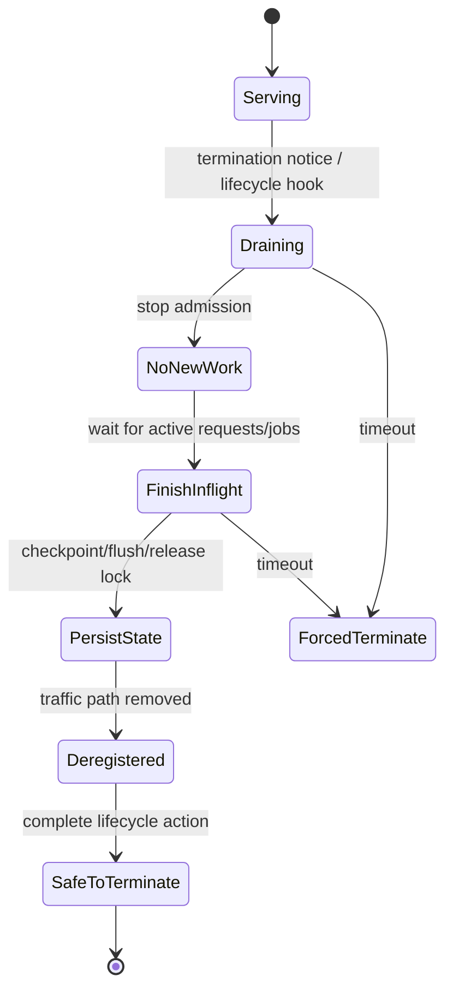
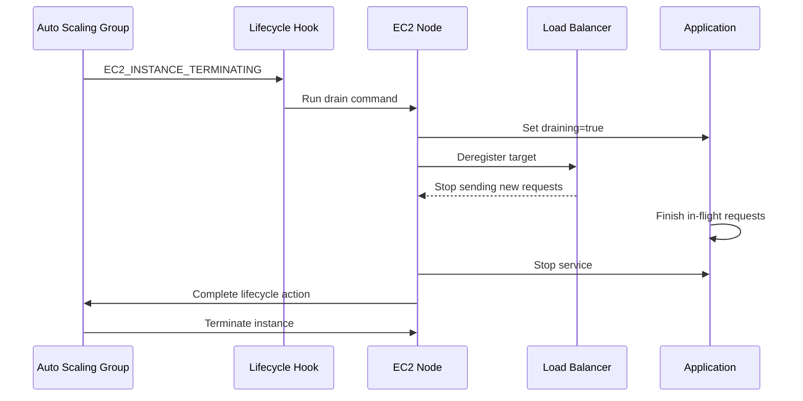
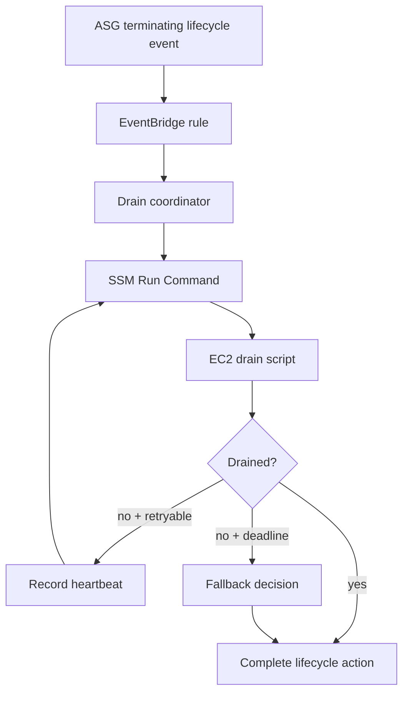

# Part 026 — Node Draining and Graceful Termination

## 1. Problem yang Diselesaikan

Scale-out berbicara tentang menambah kapasitas. Scale-in berbicara tentang menghilangkan kapasitas. Keduanya sama-sama berisiko, tetapi scale-in sering lebih berbahaya karena ia terjadi saat sistem sedang hidup.

Jika instance dihentikan begitu saja, hal berikut bisa terjadi:

- request HTTP yang sedang berjalan terputus;
- background job selesai setengah jalan;
- file upload tertinggal sebagai partial object;
- lock tidak dilepas;
- message queue diproses dua kali tanpa idempotency;
- batch checkpoint hilang;
- node container dibunuh saat masih menjalankan task;
- EBS volume stateful dilepas tanpa fencing;
- target load balancer masih mengirim traffic ke node yang sedang mati.

Graceful termination adalah protokol untuk mengeluarkan node dari fleet tanpa merusak workload.

Mental model utama:

> Termination is not an event. Termination is a protocol.

Protocol itu minimal berisi:

1. stop admission — jangan terima pekerjaan baru;
2. drain in-flight work — selesaikan atau pindahkan pekerjaan yang sedang berjalan;
3. persist/checkpoint state — jangan hilangkan progress penting;
4. deregister from traffic path — load balancer/service discovery tidak lagi mengirim traffic;
5. signal completion — beri tahu Auto Scaling bahwa instance aman diterminasi;
6. fallback on timeout — jika gagal, sistem tetap punya keputusan aman.

---

## 2. Mental Model

Node dalam fleet punya dua status berbeda:

| Status | Pertanyaan |
|---|---|
| Infrastructure lifecycle | Apakah EC2 instance launching, InService, terminating, atau terminated? |
| Application lifecycle | Apakah aplikasi menerima request, draining, idle, checkpointing, atau stopped? |

Bug paling umum terjadi ketika infrastructure lifecycle bergerak lebih cepat daripada application lifecycle.



Tujuan graceful termination bukan membuat semua termination sukses sempurna. Tujuannya membuat termination punya **bounded, observable, and safe behavior**.

Jika node tidak bisa drain dalam batas waktu, sistem harus tahu apakah harus:

- abandon dan terminate;
- retain instance untuk investigasi;
- extend heartbeat;
- fail workload ke retry path;
- stop scale-in sementara.

---

## 3. Core Concepts

### 3.1 Auto Scaling lifecycle hook

Auto Scaling lifecycle hook memberi kesempatan menjalankan custom action saat instance masuk transisi tertentu, termasuk saat terminating.

Untuk termination, lifecycle hook membuat instance masuk state seperti `Terminating:Wait`. Selama wait state, Anda bisa menjalankan drain script. Setelah drain selesai, Anda memanggil `CompleteLifecycleAction` agar Auto Scaling melanjutkan terminasi.

Important rule:

> Lifecycle hook is a deadline, not a guarantee.

Jika hook timeout atau action di-abandon, Auto Scaling tetap dapat melanjutkan termination. Karena itu drain protocol harus punya timeout, retry, dan fallback.

### 3.2 Load balancer deregistration delay

Jika instance menerima traffic dari ALB/NLB, ia harus dikeluarkan dari target group sebelum process dihentikan.

Konsepnya:

```text
stop new traffic -> wait existing connections/requests -> stop app
```

Untuk ALB target group, deregistration delay mengontrol berapa lama load balancer menunggu sebelum menyelesaikan deregistration. Default umum untuk Elastic Load Balancing adalah 300 detik.

Deregistration delay harus selaras dengan:

- maximum request duration;
- application graceful shutdown timeout;
- lifecycle hook heartbeat timeout;
- deployment/scale-in SLO;
- client retry behavior.

Jika lifecycle hook 120 detik tetapi deregistration delay 300 detik, instance bisa dipaksa terminate sebelum drain selesai. Jika deregistration delay terlalu panjang, scale-in menjadi lambat.

### 3.3 Application graceful shutdown

Aplikasi harus merespons signal termination.

Pada Linux/systemd, termination sering berarti:

- systemd mengirim signal stop ke service;
- process menerima `SIGTERM`;
- aplikasi berhenti menerima pekerjaan baru;
- aplikasi menunggu in-flight work sampai timeout;
- aplikasi flush log/metric/state;
- process exit;
- jika timeout habis, systemd bisa mengirim kill.

Graceful shutdown bukan hanya infrastruktur. Kode aplikasi harus mendukungnya.

Untuk HTTP service:

- readiness berubah menjadi false;
- listener berhenti menerima request baru atau LB deregister dulu;
- in-flight request diberi waktu selesai;
- long polling/streaming punya batas;
- connection pool ditutup setelah work selesai.

Untuk queue worker:

- polling message baru dihentikan;
- active message diselesaikan atau checkpoint;
- visibility timeout diperpanjang jika perlu;
- partial progress harus idempotent;
- worker exit hanya setelah safe point.

Untuk stateful service:

- leader step down;
- lock/fence token dilepas atau expired safely;
- WAL/checkpoint flush;
- volume detach hanya setelah fs/app clean.

### 3.4 Draining vs stopping

Draining dan stopping bukan hal yang sama.

| Aksi | Arti |
|---|---|
| Stop | Process dimatikan |
| Drain | Process berhenti menerima work baru dan menyelesaikan work lama |
| Deregister | Node dihapus dari traffic routing |
| Cordon | Scheduler tidak boleh menaruh work baru di node |
| Checkpoint | Progress disimpan agar bisa dilanjutkan |
| Fence | Node lama dicegah melakukan write setelah ownership pindah |

Production shutdown biasanya butuh kombinasi semuanya.

---

## 4. Termination Protocol by Workload Type

### 4.1 Stateless HTTP service behind ALB

Protocol:

1. lifecycle hook menangkap termination;
2. instance menandai dirinya draining;
3. readiness endpoint mulai return not ready;
4. target group deregistration dimulai;
5. aplikasi menyelesaikan in-flight request;
6. process stop;
7. lifecycle action complete.

Diagram:



Key invariant:

```text
No app process should be killed before traffic path is closed or in-flight deadline expires.
```

### 4.2 Queue worker

Queue worker lebih sulit karena tidak ada load balancer yang bisa “deregister”. Admission control ada di worker polling loop.

Protocol:

1. lifecycle hook menerima termination;
2. worker diberi signal `draining=true`;
3. worker berhenti mengambil message baru;
4. active message diselesaikan;
5. jika work terlalu lama, checkpoint dan release/retry;
6. worker exit;
7. lifecycle action complete.

Pseudo flow:

```text
while running:
  if draining:
    stop polling new messages
    wait active_jobs <= 0 or deadline reached
    exit safe
  else:
    poll queue
    process message idempotently
```

Untuk SQS-style processing, desain harus memperhatikan:

- visibility timeout;
- idempotency key;
- partial failure;
- dead-letter queue;
- duplicate delivery;
- checkpoint location.

### 4.3 Batch worker

Batch job bisa berjalan lebih lama dari lifecycle hook. Untuk workload ini, strategi perlu dipilih eksplisit.

| Strategy | Cocok untuk |
|---|---|
| Finish within hook | Job pendek dan bounded |
| Checkpoint then exit | Job panjang tapi bisa resume |
| Requeue from scratch | Job idempotent dan murah diulang |
| Scale-in protection | Job tidak boleh diinterupsi selama aktif |
| Dedicated Batch scheduler | Workload batch kompleks yang butuh scheduler-aware termination |

Jangan berharap lifecycle hook 5–15 menit menyelesaikan job 2 jam tanpa checkpoint.

### 4.4 ECS container instance

Untuk ECS di EC2, instance dapat di-drain sehingga ECS tidak menjadwalkan task baru pada container instance tersebut dan mengganti task service ke instance lain bila memungkinkan.

Protocol umum:

1. ASG termination lifecycle hook aktif;
2. container instance diset `DRAINING`;
3. ECS menghentikan placement task baru;
4. service tasks dipindah sesuai deployment/service config;
5. hook menunggu task aktif selesai atau timeout;
6. lifecycle complete.

Managed instance draining pada ECS capacity provider dapat menyederhanakan workflow ini. Namun konsep safety tetap sama: kapasitas pengganti harus tersedia, task harus punya stop timeout, dan workload harus tahan retry.

### 4.5 EKS/Kubernetes node

Untuk EKS node di EC2, istilahnya biasanya:

- cordon: node tidak menerima pod baru;
- drain: pod dieviction dari node;
- pod termination grace period: waktu untuk container shutdown;
- PodDisruptionBudget: batas disruption aplikasi;
- PVC/EBS AZ binding: pod stateful mungkin tidak bisa pindah AZ sembarangan.

Protocol:

1. ASG/Karpenter/node termination signal;
2. node cordon;
3. pod drain dengan respect PDB;
4. wait sampai workload pindah atau safe timeout;
5. complete lifecycle/terminate node.

Caveat:

- drain bisa blocked oleh PDB;
- DaemonSet tidak pindah seperti workload biasa;
- pod dengan local ephemeral state bisa kehilangan data;
- PVC EBS zonal membuat reschedule hanya valid di AZ sama;
- termination grace period harus lebih kecil dari node termination budget.

Seri ini tidak akan mengulang Kubernetes/EKS secara penuh, tetapi compute-storage invariant tetap penting: scheduler-level drain harus cocok dengan storage attachment boundary.

### 4.6 Stateful EC2 with EBS

Untuk EC2 stateful yang memiliki EBS data volume, termination perlu lebih hati-hati.

Protocol:

1. stop admission;
2. step down leadership jika ada;
3. stop write path;
4. flush/checkpoint;
5. release distributed lock/fence token;
6. unmount filesystem jika perlu;
7. detach or snapshot volume sesuai policy;
8. attach ke replacement hanya setelah old owner fenced;
9. complete lifecycle action.

Anti-pattern:

```text
ASG terminates old owner and replacement attaches volume without fencing.
```

Ini bisa menyebabkan split brain atau filesystem corruption jika old node belum benar-benar berhenti menulis.

---

## 5. Production Design

### 5.1 Define a shutdown budget

Graceful termination butuh budget.

Contoh:

```text
Total termination budget: 600s
- receive lifecycle event: 10s
- stop admission/readiness false: 10s
- load balancer deregistration: 120s
- in-flight request drain: 180s
- state flush/log flush: 30s
- safety buffer: 60s
- complete lifecycle action/retry: 30s
```

Budget ini harus lebih kecil dari lifecycle hook heartbeat timeout atau heartbeat harus diperpanjang secara sengaja.

### 5.2 Use explicit drain state

Aplikasi harus punya drain state eksplisit.

Minimal:

```text
SERVING -> DRAINING -> STOPPED
```

Readiness behavior:

| State | Liveness | Readiness | Accept new work |
|---|---:|---:|---:|
| SERVING | true | true | true |
| DRAINING | true | false | false |
| STOPPED | false | false | false |

Liveness tetap true saat draining agar platform tidak salah mengira aplikasi crash. Readiness false agar traffic baru berhenti.

### 5.3 Make drain idempotent

Drain command bisa dipanggil lebih dari sekali.

Contoh idempotent contract:

```bash
appctl drain --deadline-seconds 300
```

Jika sudah draining, command tidak gagal. Ia mengembalikan status current drain.

Bad behavior:

- drain kedua membatalkan drain pertama;
- drain command menghapus state penting;
- script membuat duplicate deregistration error fatal;
- completion action dipanggil sebelum drain benar-benar selesai.

### 5.4 Separate infrastructure drain and application drain

Jangan gabungkan semua logic menjadi satu shell script opaque.

Lebih baik:

```text
asg-hook-handler
  -> mark-node-draining
  -> deregister-traffic-target
  -> app-drain-command
  -> verify-no-active-work
  -> stop-service
  -> complete-lifecycle-action
```

Masing-masing step punya log, metric, timeout, dan failure behavior.

### 5.5 Decide default result deliberately

Lifecycle hook punya default result saat timeout. Ini harus dipilih sadar.

| Default behavior | Konsekuensi |
|---|---|
| Continue | Instance tetap terminate walau drain script gagal/timeout |
| Abandon | Launch hook biasanya membatalkan instance; termination hook dapat tetap menuju termination tergantung konteks dan policy |
| Retain policy | Dapat menahan instance untuk investigasi jika graceful shutdown gagal |

Untuk stateless fleet, timeout lalu continue mungkin acceptable jika retry aman. Untuk stateful owner, retain/fencing lebih aman.

---

## 6. Implementation Pattern

### 6.1 ASG termination lifecycle hook

Terraform skeleton:

```hcl
resource "aws_autoscaling_lifecycle_hook" "terminate" {
  name                   = "api-graceful-terminate"
  autoscaling_group_name = aws_autoscaling_group.api.name
  lifecycle_transition   = "autoscaling:EC2_INSTANCE_TERMINATING"
  heartbeat_timeout      = 600
  default_result         = "CONTINUE"
}
```

EventBridge/Lambda/SSM pattern:



### 6.2 Instance drain script for HTTP service

Example structure:

```bash
#!/usr/bin/env bash
set -euo pipefail

APP="api"
DEADLINE_SECONDS="${1:-300}"
DRAIN_MARKER="/run/${APP}.draining"
START_TS=$(date +%s)

log() { echo "[$(date --iso-8601=seconds)] $*"; }
remaining() { echo $(( DEADLINE_SECONDS - ($(date +%s) - START_TS) )); }

log "entering drain mode"
touch "$DRAIN_MARKER"

curl -fsS -X POST http://127.0.0.1:8080/internal/drain || true

log "waiting for active requests to reach zero"
while true; do
  left=$(remaining)
  if [ "$left" -le 0 ]; then
    log "drain deadline reached"
    break
  fi

  active=$(curl -fsS http://127.0.0.1:8080/internal/active-requests || echo "unknown")
  log "active_requests=${active}, remaining=${left}s"

  if [ "$active" = "0" ]; then
    log "no active requests"
    break
  fi

  sleep 5
done

log "stopping service"
systemctl stop ${APP}.service

log "drain script complete"
```

Important:

- script should not blindly sleep for fixed time;
- app must expose active work count or equivalent;
- deadline is mandatory;
- logs must be shipped before termination if possible.

### 6.3 systemd service config

Example:

```ini
[Unit]
Description=API Service
After=network-online.target
Wants=network-online.target

[Service]
Type=simple
User=app
WorkingDirectory=/opt/api
ExecStart=/opt/api/bin/server
ExecStop=/opt/api/bin/graceful-stop --timeout 240
TimeoutStopSec=270
KillSignal=SIGTERM
Restart=on-failure

[Install]
WantedBy=multi-user.target
```

Rules:

- `TimeoutStopSec` must be greater than application graceful stop time;
- app must handle `SIGTERM`;
- `ExecStop` must not hang forever;
- systemd timeout must fit within lifecycle hook timeout;
- process should exit non-zero only when truly unsafe.

### 6.4 Load balancer deregistration

A robust drain workflow usually does both:

1. application readiness false;
2. target group deregistration.

Readiness false alone may not immediately stop ALB traffic if target health takes time. Deregistration alone may not stop internal callers that bypass LB. Use both where relevant.

AWS CLI shape:

```bash
aws elbv2 deregister-targets \
  --target-group-arn "$TARGET_GROUP_ARN" \
  --targets Id="$INSTANCE_ID"
```

Then poll target health until unused/draining complete or deadline.

### 6.5 Complete lifecycle action

At the end:

```bash
aws autoscaling complete-lifecycle-action \
  --lifecycle-hook-name "$LIFECYCLE_HOOK_NAME" \
  --auto-scaling-group-name "$ASG_NAME" \
  --lifecycle-action-token "$LIFECYCLE_ACTION_TOKEN" \
  --lifecycle-action-result CONTINUE
```

Operational note:

- token is usually from lifecycle event;
- if completing from instance, you need a way to pass hook metadata securely;
- coordinator Lambda often has cleaner context;
- instance role needs least privilege if it completes its own hook.

### 6.6 Heartbeat for long drain

If drain can exceed heartbeat timeout, coordinator can record heartbeat:

```bash
aws autoscaling record-lifecycle-action-heartbeat \
  --lifecycle-hook-name "$LIFECYCLE_HOOK_NAME" \
  --auto-scaling-group-name "$ASG_NAME" \
  --lifecycle-action-token "$LIFECYCLE_ACTION_TOKEN"
```

But do not heartbeat forever. Define max attempts.

---

## 7. Graceful Shutdown in Application Code

### 7.1 HTTP server pseudocode

```java
class GracefulServer {
    private final AtomicBoolean draining = new AtomicBoolean(false);
    private final AtomicInteger activeRequests = new AtomicInteger(0);

    boolean readiness() {
        return !draining.get() && dependenciesHealthy();
    }

    Response handle(Request request) {
        if (draining.get()) {
            return Response.status(503)
                .header("Retry-After", "5")
                .build();
        }

        activeRequests.incrementAndGet();
        try {
            return process(request);
        } finally {
            activeRequests.decrementAndGet();
        }
    }

    void startDrain() {
        draining.set(true);
    }

    boolean waitUntilIdle(Duration timeout) {
        Deadline deadline = Deadline.after(timeout);
        while (!deadline.expired()) {
            if (activeRequests.get() == 0) return true;
            sleep(100);
        }
        return activeRequests.get() == 0;
    }
}
```

Real frameworks punya mekanisme sendiri. Yang penting adalah invariant:

```text
readiness false precedes process death.
```

### 7.2 Queue worker pseudocode

```java
class WorkerLoop {
    private volatile boolean draining = false;
    private final Set<JobId> activeJobs = ConcurrentHashMap.newKeySet();

    void drain() {
        draining = true;
    }

    void run() {
        while (true) {
            if (draining) {
                waitForActiveJobsOrCheckpoint();
                return;
            }

            Message msg = queue.poll(Duration.ofSeconds(10));
            if (msg == null) continue;

            activeJobs.add(msg.id());
            try {
                processIdempotently(msg);
                queue.ack(msg);
            } catch (RetryableException e) {
                queue.release(msg);
            } finally {
                activeJobs.remove(msg.id());
            }
        }
    }
}
```

Queue workers must not accept new messages after drain begins. If active job cannot finish, it must checkpoint or be safely retried.

### 7.3 Long request policy

Some requests cannot drain forever.

| Request type | Max drain behavior |
|---|---|
| Short API call | Wait until complete within deadline |
| Upload/download | Stop accepting new; existing allowed up to max duration |
| Streaming | Send server shutdown signal or close at deadline |
| Long report generation | Convert to async job/checkpoint |
| Transactional write | Finish or rollback atomically |

If a request can exceed termination budget, it should not be a synchronous request tied to a node lifetime.

---

## 8. Failure Modes

### 8.1 Instance still receives traffic while draining

Symptoms:

- request count remains non-zero after drain starts;
- ALB target health still healthy;
- readiness false but traffic continues;
- internal clients bypass load balancer.

Causes:

- target deregistration not called;
- health check interval too slow;
- deregistration delay misunderstood;
- readiness endpoint not used by traffic source;
- service discovery still includes node;
- keep-alive/long-lived connections continue.

Mitigations:

- explicit deregister target;
- app-level admission guard;
- close keep-alive after drain begins;
- internal service discovery deregistration;
- metric active requests by node.

### 8.2 Lifecycle hook times out

Symptoms:

- ASG activity shows lifecycle hook timeout;
- instance terminates while work still active;
- drain coordinator logs incomplete;
- duplicate jobs or client errors spike.

Causes:

- heartbeat timeout too short;
- drain script hung;
- active request/job exceeded budget;
- SSM/Lambda failed;
- lifecycle action never completed;
- IAM permission missing.

Mitigations:

- hard deadline in script;
- max active work duration;
- heartbeat only for known safe progress;
- alert before timeout;
- fallback retry/checkpoint;
- least privilege permission tested in game day.

### 8.3 Scale-in becomes too slow

Symptoms:

- ASG stuck with too many instances;
- cost remains high after traffic drops;
- instance refresh/deploy takes too long;
- capacity rebalancing delayed.

Causes:

- deregistration delay terlalu tinggi;
- termination hook heartbeat terlalu tinggi;
- long-running work on nodes selected for termination;
- no scale-in protection strategy;
- PDB blocks Kubernetes drain;
- ECS cannot place replacement tasks.

Mitigations:

- bound request/job duration;
- use scale-in protection for active long jobs;
- use smaller work units;
- tune deregistration delay;
- ensure spare capacity for rescheduling;
- avoid selecting busy nodes if possible.

### 8.4 Queue messages processed twice

Symptoms:

- duplicate side effects;
- records inserted twice;
- payment/notification duplicate;
- job status inconsistent.

Causes:

- worker killed after side effect before ack;
- visibility timeout expired during drain;
- no idempotency key;
- checkpoint not atomic;
- ack happens before durable state.

Mitigations:

- idempotent processing;
- ack after durable commit;
- extend visibility timeout for active work;
- checkpoint progress;
- use deduplication/unique constraints.

### 8.5 Stateful volume corruption or split brain

Symptoms:

- filesystem recovery required;
- DB corruption;
- two nodes believe they own same volume/state;
- replacement starts before old owner fully stopped.

Causes:

- no fencing;
- forced termination during write;
- volume detach/attach automated without ownership protocol;
- lock stored only in local memory;
- lifecycle hook timeout ignored.

Mitigations:

- distributed lock with fencing token;
- stop write path before detach;
- clean unmount;
- attach only after old owner terminated/fenced;
- snapshot before risky migration;
- prefer managed database/storage where possible.

### 8.6 ECS/EKS drain blocked by insufficient capacity

Symptoms:

- tasks/pods stuck pending;
- drain never completes;
- deployment violates availability;
- lifecycle hook times out.

Causes:

- no spare capacity;
- too strict placement constraints;
- PDB prevents eviction;
- AZ-specific storage prevents reschedule;
- image pull slow;
- capacity provider scaling lag.

Mitigations:

- add surge/spare capacity before drain;
- relax placement where safe;
- tune PDB;
- account for EBS zonal PVC;
- pre-pull images or warm nodes;
- coordinate ASG scale-in with scheduler drain.

---

## 9. Observability

You cannot trust graceful termination unless you can see it.

### 9.1 Required metrics

| Metric | Why |
|---|---|
| `DrainStarted` | Count termination events entering drain |
| `DrainDuration` | Time from drain start to safe termination |
| `DrainTimeout` | Count failed/forced drains |
| `ActiveRequestsAtDrainStart` | Risk level at termination |
| `ActiveJobsAtDrainStart` | Queue/batch risk |
| `LifecycleHookWaitAge` | Detect stuck hooks |
| `TargetDeregistrationDuration` | LB drain health |
| `ForcedKillCount` | App shutdown failure |
| `DuplicateJobDetected` | Data correctness signal |

### 9.2 Required logs

Every drain should log:

```text
instance_id
asg_name
lifecycle_hook_name
lifecycle_action_token or correlation id
app_version
launch_template_version
start_time
traffic_deregister_start/end
active_work_count over time
stop_result
complete_lifecycle_action_result
```

### 9.3 Dashboards

Dashboard should answer:

- how many nodes are draining now?
- average/p95 drain duration?
- how many drains timeout?
- are draining nodes still receiving traffic?
- are queue duplicates increasing after scale-in?
- are ECS/EKS drains blocked by placement/capacity?
- did instance refresh increase termination errors?

---

## 10. Runbooks

### 10.1 ASG stuck in `Terminating:Wait`

Check:

1. ASG activity history.
2. Lifecycle hook name and heartbeat timeout.
3. EventBridge delivery.
4. Lambda/SSM drain handler logs.
5. Instance SSM online status.
6. Drain script logs.
7. Active request/job count.
8. IAM permission for complete lifecycle action.
9. Whether heartbeat is being extended.

Decision:

- If app drained and only completion failed: complete lifecycle action manually.
- If app not drained but work retry-safe: complete/continue may be acceptable.
- If stateful unsafe: retain/quarantine if lifecycle policy supports it, or stop scale-in and investigate.

### 10.2 Terminating instance still receiving traffic

Check:

1. Target group health state.
2. Deregistration timestamp.
3. ALB request count per target.
4. App readiness response.
5. Internal clients/service discovery path.
6. Keep-alive/connection duration.
7. Whether multiple target groups exist.

Action:

- force readiness false;
- deregister from all target groups;
- remove from service discovery;
- lower keep-alive where appropriate;
- only stop app after active work drains or deadline hits.

### 10.3 Queue duplicates after scale-in

Check:

1. Worker shutdown logs.
2. Message visibility timeout.
3. Whether ack occurred after durable commit.
4. Idempotency key behavior.
5. Active job count at drain deadline.
6. DLQ/retry spikes.

Action:

- extend visibility for active work;
- make side effect idempotent;
- checkpoint before exit;
- reduce max job duration;
- use scale-in protection for non-interruptible workers.

### 10.4 Instance refresh causes errors

Check:

1. Instance refresh batch size/min healthy percentage.
2. Termination hook duration.
3. ALB deregistration delay.
4. App graceful stop timeout.
5. Replacement capacity readiness.
6. Whether old nodes killed before new nodes healthy.

Action:

- pause/cancel instance refresh;
- reduce batch size;
- increase min healthy percentage;
- fix drain hook;
- validate readiness of replacement before continuing.

---

## 11. Common Mistakes

### Mistake 1 — Mengandalkan `SIGTERM` saja

`SIGTERM` penting, tetapi belum cukup. Traffic source harus berhenti mengirim work baru.

### Mistake 2 — Readiness tetap true saat draining

Jika readiness true, scheduler/load balancer tetap menganggap node boleh menerima traffic.

### Mistake 3 — Tidak punya active work counter

Tanpa active request/job count, drain hanya sleep dan berharap.

### Mistake 4 — Lifecycle hook timeout tidak cocok dengan app timeout

Jika app butuh 5 menit drain tetapi hook 2 menit, termination akan memotong proses.

### Mistake 5 — Queue worker ack terlalu awal

Ack sebelum durable commit membuat data hilang jika node mati.

### Mistake 6 — Queue worker ack terlalu akhir tanpa idempotency

Ack setelah side effect tanpa idempotency membuat duplicate side effect saat retry.

### Mistake 7 — Scale-in tanpa spare capacity

Draining ECS/EKS task/pod butuh tempat baru. Tanpa spare capacity, drain macet.

### Mistake 8 — Stateful EC2 tanpa fencing

Stateful owner harus punya protokol ownership. Stop/terminate bukan fencing yang cukup.

### Mistake 9 — Drain tidak diuji

Graceful termination yang tidak pernah diuji biasanya gagal saat deploy, scale-in, atau Spot interruption.

---

## 12. Checklist

### Design checklist

- [ ] Setiap service punya drain state eksplisit.
- [ ] Readiness false saat draining.
- [ ] Liveness tetap true selama drain sehat.
- [ ] Traffic target deregister sebelum process stop.
- [ ] Active work count bisa diamati.
- [ ] Drain punya deadline.
- [ ] Lifecycle hook timeout lebih besar dari drain budget.
- [ ] App graceful shutdown timeout cocok dengan systemd/container timeout.
- [ ] Queue worker berhenti polling message baru saat drain.
- [ ] Work processing idempotent atau checkpointable.
- [ ] Stateful node punya fencing/ownership protocol.
- [ ] ECS/EKS drain punya spare capacity dan PDB/storage awareness.

### Operational checklist

- [ ] Alarm untuk lifecycle hook stuck.
- [ ] Alarm untuk drain timeout.
- [ ] Dashboard active draining nodes.
- [ ] Metric active requests/jobs during drain.
- [ ] Runbook manual lifecycle completion tersedia.
- [ ] Game day scale-in saat traffic tinggi.
- [ ] Game day instance refresh rollback.
- [ ] Game day queue worker termination.
- [ ] Game day stateful owner replacement.

---

## 13. Mini Case Study

### Context

Sebuah service document-processing berjalan di EC2 ASG. Ada dua tipe node:

- API node di belakang ALB;
- worker node yang mengambil message dari queue dan menulis hasil ke S3 + database.

Masalah terjadi saat scale-in malam hari:

- beberapa API request 502;
- beberapa document job diproses dua kali;
- ASG activity normal;
- tidak ada error jelas di deployment pipeline.

### Investigation

Ditemukan:

- ASG termination langsung stop instance setelah health check deregistration;
- app menerima `SIGTERM` tetapi shutdown timeout hanya 30 detik;
- ALB deregistration delay 300 detik, tetapi lifecycle hook tidak ada;
- worker masih polling message baru sampai process mati;
- job side effect tidak idempotent;
- visibility timeout 60 detik, sementara job bisa 4 menit.

### Fix

API nodes:

- termination lifecycle hook 600 detik;
- drain coordinator via EventBridge + SSM;
- readiness false saat drain;
- deregister target group;
- wait active requests sampai 0 atau 180 detik;
- systemd `TimeoutStopSec=240`;
- complete lifecycle action setelah safe.

Worker nodes:

- drain flag menghentikan polling;
- active jobs diselesaikan atau checkpoint;
- visibility timeout disesuaikan;
- idempotency key ditambahkan untuk output write;
- scale-in protection untuk job non-interruptible;
- metric duplicate job ditambahkan.

### Result

Scale-in lebih lambat, tetapi error hilang. Cost sedikit naik karena instance bertahan beberapa menit lebih lama saat drain, tetapi jauh lebih murah daripada data correction dan retry manual.

### Lesson

Graceful termination adalah bagian dari correctness, bukan nice-to-have. Cloud dapat membuang node kapan saja: scale-in, deploy, health replacement, Spot interruption, instance refresh, maintenance. Workload yang tidak punya drain protocol belum production-ready.

---

## 14. Summary

Node draining adalah protokol untuk mengeluarkan instance dari fleet tanpa merusak request, job, task, atau state.

Prinsipnya:

- stop new work before stopping process;
- readiness false before death;
- deregister traffic path;
- finish or checkpoint in-flight work;
- use lifecycle hooks as deadline barrier;
- make drain idempotent and observable;
- align ALB deregistration, app shutdown, systemd/container timeout, and lifecycle hook timeout;
- treat queue and stateful workloads as correctness problems, not just shutdown problems.

Production rule:

> A fleet that can scale in safely is more mature than a fleet that can only scale out quickly.

Part berikutnya masuk ke capacity planning dan load shape: bagaimana menghitung kapasitas dari p50/p95/p99, burst, queue depth, concurrency envelope, dan seasonal behavior.

---

## References

- AWS Documentation — Amazon EC2 Auto Scaling lifecycle hooks: https://docs.aws.amazon.com/autoscaling/ec2/userguide/lifecycle-hooks.html
- AWS Documentation — Amazon EC2 Auto Scaling instance lifecycle: https://docs.aws.amazon.com/autoscaling/ec2/userguide/ec2-auto-scaling-lifecycle.html
- AWS Documentation — Scaling cooldowns and load balancer deregistration behavior: https://docs.aws.amazon.com/autoscaling/ec2/userguide/ec2-auto-scaling-scaling-cooldowns.html
- AWS Documentation — Draining Amazon ECS container instances: https://docs.aws.amazon.com/AmazonECS/latest/developerguide/container-instance-draining.html
- AWS Documentation — Managed instance draining for Amazon ECS: https://docs.aws.amazon.com/AmazonECS/latest/developerguide/managed-instance-draining.html
- AWS Documentation — Control instance retention with instance lifecycle policies: https://docs.aws.amazon.com/autoscaling/ec2/userguide/instance-lifecycle-policy.html
