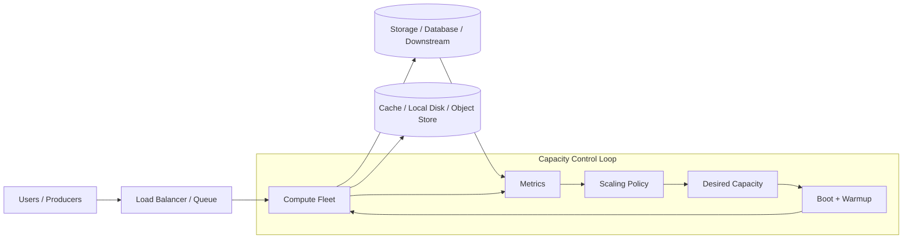
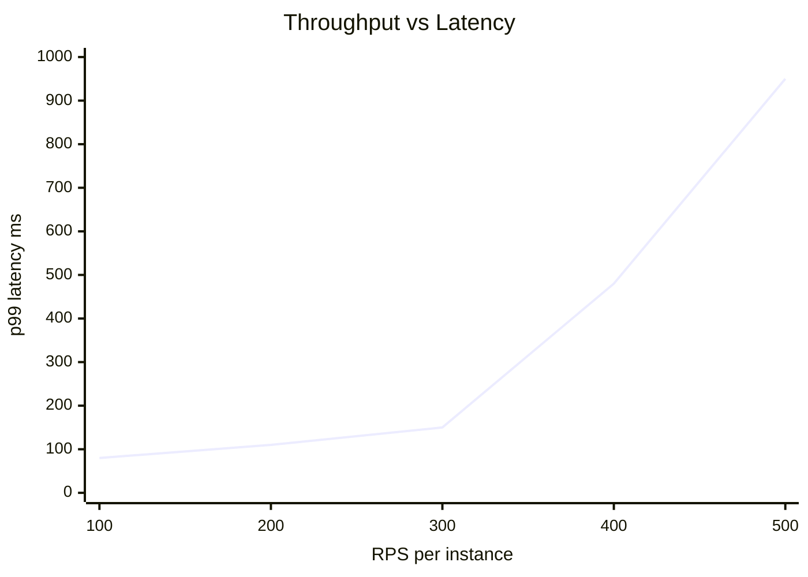
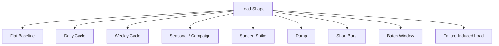
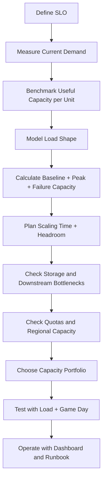
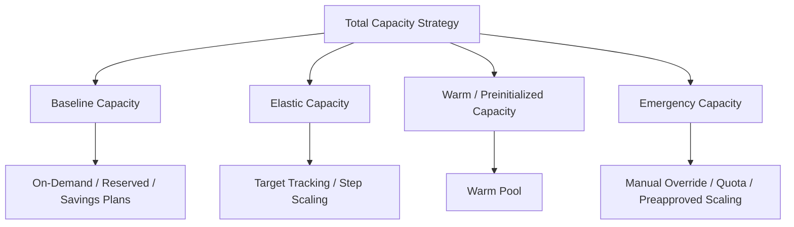
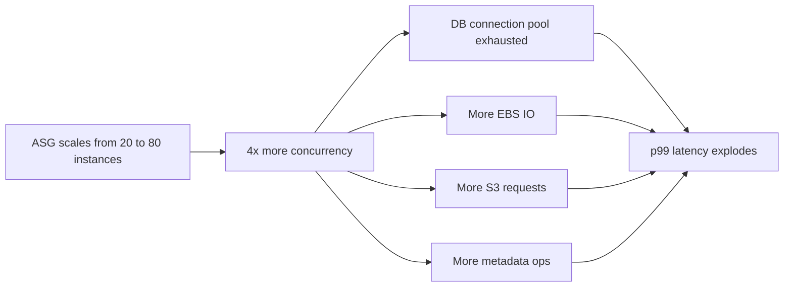

# Part 027 — Capacity Planning and Load Shape

Capacity planning bukan kegiatan menebak “butuh berapa instance”. Capacity planning adalah proses membuat **kontrak antara demand, latency SLO, failure tolerance, quota, dan cost**.

Pada AWS, Auto Scaling membuat fleet elastis. Tetapi elastis tidak berarti infinite, instantaneous, atau gratis. Instance butuh waktu untuk launch, boot, pull artifact, warm cache, masuk target group, dan benar-benar melayani traffic. Storage juga punya batas: EBS throughput, queue depth, S3 request rate per access pattern, EFS throughput mode, FSx metadata throughput, network bandwidth, dan service quota.

Jadi pertanyaan production bukan:

> “Berapa besar instance yang dibutuhkan?”

Pertanyaan yang lebih benar:

> “Dengan load shape ini, SLO ini, failure assumption ini, bootstrap time ini, dan quota ini, berapa kapasitas minimum yang harus sudah tersedia, berapa yang boleh elastis, dan bagaimana sistem menolak/mengantri load ketika kapasitas tidak cukup?”

AWS EC2 Auto Scaling membantu menjaga jumlah instance yang benar untuk menangani load aplikasi melalui Auto Scaling group, minimum capacity, maximum capacity, desired capacity, health checks, dan scaling policies. Tetapi AWS juga punya service quotas yang bersifat regional dan beberapa bisa perlu dinaikkan eksplisit sebelum traffic production berjalan. Karena itu, capacity planning harus mencakup ASG policy dan quota planning, bukan hanya instance sizing. Referensi utama: [What is Amazon EC2 Auto Scaling](https://docs.aws.amazon.com/autoscaling/ec2/userguide/what-is-amazon-ec2-auto-scaling.html), [Service quotas](https://docs.aws.amazon.com/general/latest/gr/aws_service_limits.html), dan [Quotas for Auto Scaling resources and groups](https://docs.aws.amazon.com/autoscaling/ec2/userguide/ec2-auto-scaling-quotas.html).

---

## 1. Problem yang Diselesaikan

Capacity planning menjawab beberapa problem nyata:

1. **Normal load**: berapa kapasitas baseline untuk traffic harian?
2. **Peak load**: berapa kapasitas saat traffic puncak yang predictable?
3. **Burst load**: bagaimana sistem bertahan saat spike mendadak?
4. **Failure load**: apakah fleet tetap cukup jika satu AZ, satu Spot pool, atau satu deployment wave gagal?
5. **Scaling delay**: apakah Auto Scaling cukup cepat dibanding kecepatan naiknya traffic?
6. **Storage bottleneck**: apakah compute bertambah tapi EBS, database, EFS, atau downstream tetap menjadi bottleneck?
7. **Quota boundary**: apakah account/region/subnet/IP/ASG/ELB/instance-type quota cukup?
8. **Cost envelope**: kapasitas mana yang harus reserved, on-demand, spot, warm, atau scheduled?

Tanpa capacity planning, autoscaling sering diperlakukan sebagai magic. Hasilnya biasanya salah satu dari dua ekstrem:

- fleet terlalu kecil, scaling terlambat, p99 naik, timeout meningkat, retry storm terjadi;
- fleet terlalu besar, cost tinggi, tetapi bottleneck sebenarnya ada di storage/downstream sehingga tambahan instance tidak menaikkan throughput.

Capacity planning yang baik tidak menghilangkan risiko. Ia membuat risiko menjadi eksplisit, terukur, dan bisa diuji.

---

## 2. Mental Model

Bayangkan satu service sebagai pipeline:



Ada dua path berbeda:

1. **Data path**: user request, queue message, batch job, file processing, DB query.
2. **Control path**: metric emission, alarm evaluation, scaling decision, instance launch, bootstrap, readiness.

Kegagalan capacity sering terjadi ketika control path lebih lambat dari perubahan data path.

Contoh sederhana:

- Traffic naik dari 1.000 RPS ke 5.000 RPS dalam 2 menit.
- Instance baru butuh 7 menit untuk siap.
- Target tracking baru bereaksi setelah metric sudah naik.
- Fleet overload selama minimal 5–10 menit.
- Request retry memperburuk load.

Autoscaling tidak bisa memperbaiki spike yang lebih cepat daripada waktu provisioning. Di kasus ini, solusi bukan hanya menurunkan threshold. Solusi bisa berupa:

- baseline capacity lebih tinggi;
- scheduled scaling sebelum event;
- predictive scaling untuk pattern harian/mingguan;
- queue buffering;
- backpressure;
- warm pool;
- cache warming;
- rate limiting;
- pre-provisioned storage throughput;
- quota increase sebelum event.

AWS predictive scaling menganalisis historical load untuk mendeteksi pola harian/mingguan dan memproaktifkan kapasitas sebelum load datang. Scheduled scaling cocok untuk perubahan load yang predictable pada waktu tertentu. Referensi: [Predictive scaling for Amazon EC2 Auto Scaling](https://docs.aws.amazon.com/autoscaling/ec2/userguide/ec2-auto-scaling-predictive-scaling.html) dan [Scheduled scaling for Amazon EC2 Auto Scaling](https://docs.aws.amazon.com/autoscaling/ec2/userguide/ec2-auto-scaling-scheduled-scaling.html).

---

## 3. Core Concepts

### 3.1 Demand Signal

Demand signal adalah representasi beban eksternal yang sebaiknya tidak berubah hanya karena jumlah instance berubah.

Contoh demand signal yang baik:

- total requests per second;
- queue backlog;
- queue age;
- total jobs submitted per minute;
- bytes ingested per minute;
- files uploaded per minute;
- active sessions;
- scheduled event count;
- batch input size.

Contoh signal yang sering menipu:

- average CPU across fleet tanpa melihat latency;
- average memory tanpa melihat GC atau OOM;
- average request latency tanpa memisahkan upstream/downstream;
- request count per instance tanpa total load;
- disk utilization tanpa write latency;
- queue depth tanpa processing rate.

Metric yang baik untuk capacity planning memiliki tiga sifat:

1. **Mewakili demand eksternal**.
2. **Berkorelasi dengan resource yang bottleneck**.
3. **Bisa diprediksi atau dikendalikan**.

Untuk autoscaling, metric ideal biasanya berbentuk:

```text
load_per_capacity_unit = total_load / effective_capacity_units
```

Contoh:

```text
requests_per_instance = total_rps / healthy_instance_count
messages_per_worker = queue_backlog / active_worker_count
cpu_per_vcpu = total_cpu_work / total_vcpu
bytes_per_second_per_node = total_ingest_bps / active_node_count
```

Tetapi metric ini tetap harus divalidasi terhadap SLO. CPU 55% tidak berarti sehat kalau p99 latency sudah melewati batas.

---

### 3.2 Useful Capacity

Kapasitas bukan jumlah instance. Kapasitas adalah output yang bisa digunakan dengan kualitas yang masih memenuhi SLO.

```text
useful_capacity = throughput_at_slo * availability_factor * efficiency_factor
```

Contoh:

- satu instance bisa memproses 300 RPS pada p99 < 150 ms;
- setelah 300 RPS, CPU masih 70%, tetapi p99 naik ke 500 ms karena DB connection pool penuh;
- useful capacity instance itu bukan 500 RPS, melainkan 300 RPS.

Kapasitas harus diukur pada titik SLO, bukan titik crash.



Titik kapasitas aman berada sebelum latency curve naik tajam. Capacity planning yang hanya melihat CPU sering melewati titik ini.

---

### 3.3 Load Shape

Load shape adalah bentuk perubahan demand terhadap waktu.



Setiap shape butuh strategy berbeda.

| Load Shape | Contoh | Strategy Utama |
|---|---|---|
| Flat baseline | internal API stabil | target tracking + baseline min capacity |
| Daily cycle | traffic naik siang/malam | scheduled/predictive scaling |
| Weekly cycle | payroll, reporting Jumat | scheduled scaling + pre-test |
| Campaign spike | promo, public launch | pre-scale + quota + war room |
| Sudden spike | viral event | queue, rate limit, warm pool, headroom |
| Ramp | traffic naik bertahap | target tracking cukup jika warmup sesuai |
| Short burst | upload burst, webhook storm | buffer, burst budget, async processing |
| Batch window | ETL malam | Batch/ASG schedule + storage throughput plan |
| Failure-induced load | retry storm, AZ loss | backpressure + static stability |

Load shape menentukan apakah reactive scaling cukup.

Reactive scaling cocok untuk ramp pelan. Ia buruk untuk sudden spike yang lebih cepat daripada boot time.

---

### 3.4 Headroom

Headroom adalah kapasitas kosong yang sengaja disediakan agar sistem punya waktu bereaksi.

```text
headroom_percent = (safe_capacity - current_load) / safe_capacity
```

Jika fleet safe capacity 10.000 RPS dan current load 7.000 RPS:

```text
headroom = (10.000 - 7.000) / 10.000 = 30%
```

Headroom dibutuhkan untuk:

- scaling delay;
- GC pause;
- noisy neighbor;
- cache miss;
- AZ impairment;
- downstream latency;
- deploy rollout;
- retry amplification;
- unknown unknowns.

Tidak semua workload butuh headroom sama.

| Workload | Headroom Umum | Alasan |
|---|---:|---|
| latency-sensitive API | tinggi | p99 cepat rusak saat saturasi |
| queue worker idempotent | sedang | backlog bisa menyerap burst |
| offline batch | rendah-sedang | deadline lebih penting dari latency |
| real-time stream | tinggi | lag bisa snowball |
| cache tier | tinggi | miss storm berbahaya |
| stateful DB-adjacent service | tinggi | bottleneck sering downstream |

Headroom bukan pemborosan kalau ia membeli waktu untuk recovery.

---

### 3.5 Static Stability

Static stability berarti sistem masih bisa berjalan pada kondisi failure tertentu **tanpa harus berhasil scale out saat failure sedang terjadi**.

Contoh target:

> Jika satu AZ hilang, dua AZ tersisa masih dapat melayani peak traffic normal tanpa menunggu instance baru launch.

Mengapa ini penting?

Saat AZ impairment terjadi, control plane, capacity pool, subnet IP, load balancer health, dependency, dan human response semuanya bisa ikut terganggu. Mengandalkan scale-out saat failure bisa berbahaya.

AWS Fault Isolation Boundaries menjelaskan bahwa Availability Zones dirancang sebagai fault-isolation boundary yang independen secara fisik dalam satu Region. Arsitektur production harus memperlakukan AZ sebagai boundary nyata, bukan sekadar label subnet. Referensi: [Availability Zones - AWS Fault Isolation Boundaries](https://docs.aws.amazon.com/whitepapers/latest/aws-fault-isolation-boundaries/availability-zones.html).

Formula sederhana untuk N AZ:

```text
required_capacity_per_az = peak_load / (number_of_az - tolerated_az_failures)
```

Jika workload harus survive 1 AZ loss dalam 3 AZ:

```text
required_capacity_per_az = peak_load / 2
```

Artinya total provisioned capacity saat normal adalah:

```text
total_capacity = required_capacity_per_az * 3 = 1.5 * peak_load
```

Ini tampak mahal, tetapi itulah harga static stability untuk AZ-loss tolerance.

---

### 3.6 Scaling Time Budget

Scaling time budget adalah waktu dari overload mulai terdeteksi sampai kapasitas baru benar-benar useful.

```text
scaling_time = metric_delay
             + alarm_evaluation
             + scaling_decision
             + instance_launch
             + bootstrap
             + app_start
             + dependency_warmup
             + readiness
             + load_balancer_registration
             + cache_warmup
```

Contoh:

| Step | Duration |
|---|---:|
| CloudWatch metric delay/evaluation | 1–3 min |
| ASG scaling decision | seconds-minutes |
| EC2 launch | 1–3 min |
| bootstrap/user data | 2–8 min |
| app start | 30 sec–3 min |
| target registration/readiness | 30 sec–2 min |
| cache warmup | 2–20 min |

Jika total 12 menit, maka headroom harus cukup untuk menahan load selama 12 menit.

```text
required_headroom >= load_growth_rate_per_minute * scaling_time_minutes
```

Jika traffic bisa naik 5% per menit dan scaling time 12 menit:

```text
minimum_headroom ≈ 60%
```

Atau gunakan scheduled/predictive scaling/warm pool agar scaling time efektif turun.

---

### 3.7 Queueing and Backlog

Untuk async workload, capacity planning lebih mudah karena queue dapat menyerap burst. Tetapi queue juga bisa menyembunyikan kegagalan.

Metric penting:

```text
arrival_rate = messages_added_per_second
service_rate = messages_processed_per_second
backlog = visible_messages + inflight_messages
oldest_age = age_of_oldest_message
```

Jika:

```text
arrival_rate > service_rate
```

maka backlog akan naik.

Jika backlog naik sedikit tapi oldest age tetap aman, sistem mungkin sehat. Jika oldest age naik terus, sistem gagal memenuhi deadline.

Untuk queue worker, scaling metric yang lebih berguna biasanya:

```text
backlog_per_worker = queue_backlog / active_workers
```

Tetapi untuk deadline-based jobs, metric yang lebih kuat adalah:

```text
time_to_drain = backlog / processing_rate
```

Jika SLA job adalah selesai dalam 15 menit, maka:

```text
time_to_drain <= 15 minutes
```

Queue-based capacity planning harus mempertimbangkan:

- max receive count;
- visibility timeout;
- retry delay;
- DLQ rate;
- poison message;
- downstream throttle;
- idempotency;
- duplicate processing;
- storage write amplification.

---

## 4. Capacity Planning Framework

Gunakan framework berikut sebelum menentukan ASG min/max atau instance count.



---

### 4.1 Define SLO First

Capacity without SLO is meaningless.

Define:

```yaml
service: payment-api
availability: 99.95%
latency:
  p50: 50ms
  p95: 120ms
  p99: 250ms
error_rate: <0.1%
timeout_budget: 2s
max_queue_age: n/a
```

For async worker:

```yaml
service: invoice-renderer
availability: 99.9%
job_deadline:
  p95: 5m
  p99: 15m
retry_budget: 3
max_dlq_rate: 0.01%
```

For batch:

```yaml
service: nightly-risk-batch
window_start: 01:00
window_end: 04:00
deadline: 03:30
max_failure_rerun_time: 30m
checkpoint_required: true
```

SLO menentukan apa arti “cukup kapasitas”.

---

### 4.2 Measure Demand

Ambil minimal 30 hari data untuk pola harian/mingguan. Untuk bisnis seasonal, ambil periode lebih panjang dan event historis.

Metric minimum untuk synchronous API:

```yaml
load:
  - total_rps
  - rps_by_endpoint
  - payload_size_distribution
  - concurrent_requests
  - active_connections
  - retry_rate
  - 4xx/5xx rate
latency:
  - p50
  - p90
  - p95
  - p99
  - p999 if critical
compute:
  - healthy_instances
  - cpu_utilization
  - memory_utilization_custom
  - network_in_out
  - disk_read_write_ops
  - disk_read_write_bytes
  - ebs_volume_queue_length
  - ebs_read_write_latency
```

Metric minimum untuk worker:

```yaml
queue:
  - messages_visible
  - messages_inflight
  - age_of_oldest_message
  - arrival_rate
  - processing_rate
  - retries
  - dlq_count
workers:
  - active_workers
  - messages_per_worker
  - processing_duration_p50_p95_p99
  - downstream_error_rate
```

Metric minimum untuk storage-heavy workload:

```yaml
storage:
  - read_iops
  - write_iops
  - read_throughput
  - write_throughput
  - read_latency
  - write_latency
  - queue_depth
  - error/throttle rate
  - request count
  - object/file size distribution
```

Jangan melakukan planning hanya dari average. Puncak capacity problem biasanya hidup di percentile, burst, dan tail behavior.

---

### 4.3 Benchmark Useful Capacity per Unit

Benchmark harus menjawab:

> “Satu capacity unit sehat bisa melayani berapa load pada SLO?”

Capacity unit bisa:

- satu EC2 instance;
- satu vCPU;
- satu ECS task;
- satu EKS pod;
- satu Lambda concurrency slot;
- satu Batch vCPU;
- satu shard/partition;
- satu worker thread;
- satu EBS volume layout.

Contoh hasil benchmark:

```yaml
instance_type: m7g.large
app_version: 2026.07.06-1
ami: ami-...
java: temurin-21
heap: 1.5g
safe_capacity:
  rps_at_p99_250ms: 280
  cpu_at_safe_capacity: 62%
  memory_rss: 1.9g
  network_out: 80Mbps
  db_connections: 24
bottleneck_at_next_level:
  rps: 350
  cause: db connection wait + GC pressure
```

Catat juga hasil buruk:

```yaml
not_safe:
  rps: 400
  p99: 900ms
  cpu: 78%
  error_rate: 0.4%
  symptom: downstream timeout and retry amplification
```

Kapasitas yang dipakai untuk planning adalah safe capacity, bukan max capacity.

---

### 4.4 Model Baseline, Peak, and Burst

Gunakan data historis:

```text
baseline_load = median load during normal hours
peak_load = p95 or p99 load over planning window
burst_load = max short-window load over N minutes
forecast_peak = projected growth-adjusted peak
```

Contoh:

```yaml
baseline_rps: 1200
p95_daily_peak_rps: 4200
p99_daily_peak_rps: 5100
campaign_expected_peak_rps: 9000
historical_5min_burst_rps: 7000
growth_factor_3_months: 1.25
```

Maka planning load:

```text
planning_peak = max(p99_daily_peak * growth_factor, campaign_expected_peak)
planning_peak = max(5100 * 1.25, 9000)
planning_peak = 9000 RPS
```

Jika satu instance safe capacity 280 RPS:

```text
base_instance_count = ceil(9000 / 280) = 33
```

Tambahkan failure tolerance.

Jika survive 1 AZ loss dari 3 AZ:

```text
instances_per_surviving_az = ceil(9000 / 2 / 280) = 17
normal_total = 17 * 3 = 51
```

Jadi walaupun peak butuh 33 instance, static-stable 3-AZ design butuh sekitar 51 instance jika ingin survive 1 AZ loss tanpa scaling.

---

### 4.5 Separate Baseline, Elastic, and Emergency Capacity

Jangan campur semua kapasitas dalam satu angka.



| Capacity Type | Purpose | Common Mechanism |
|---|---|---|
| Baseline | always-needed traffic | ASG min, On-Demand, Savings Plans |
| Elastic | normal variation | target tracking, step scaling |
| Scheduled | known event/time | scheduled scaling |
| Predictive | recurring pattern | predictive scaling |
| Warm | fast recovery | warm pool, pre-pulled image/cache |
| Emergency | rare incident | manual desired capacity override, quota pre-approval |

This gives operators control.

If you only set `max_capacity = 200`, you have no operating model. If you define baseline/elastic/emergency explicitly, you know which capacity is expected, which is temporary, and which is incident-only.

---

### 4.6 Plan Storage with Compute

Adding compute can overload storage.

Common failure:



Before increasing max capacity, check:

- database connection limit;
- database CPU/IOPS;
- EBS volume throughput and IOPS;
- EBS queue length;
- EFS throughput mode and metadata load;
- S3 request and lifecycle cost;
- NAT gateway throughput/cost if traffic leaves private subnet;
- load balancer target capacity;
- downstream API rate limits;
- thread pools and connection pools;
- object/file size distribution;
- cache hit ratio.

Capacity is end-to-end. Compute-only planning is usually wrong for storage-heavy services.

---

### 4.7 Plan Quotas and Scarcity

Quota failure is a production failure.

Check before launch:

```yaml
quota_check:
  ec2:
    - running_on_demand_instances_by_family
    - spot_instance_requests
    - launch_templates
    - security_groups
    - elastic_ips_if_used
  autoscaling:
    - auto_scaling_groups_per_region
    - launch_configurations_if_legacy
  load_balancing:
    - target_groups
    - targets_per_target_group
    - listeners/rules
  networking:
    - subnet_available_ip_addresses
    - eni_per_instance
    - nat_gateway_capacity/cost
  storage:
    - ebs_volume_count
    - ebs_snapshot_limits
    - provisioned_iops_budget
    - efs/FSx throughput/capacity settings
```

AWS service quotas are generally Region-specific unless documented otherwise, and some quotas can be increased while others cannot. Capacity planning must include lead time for quota increase requests. Reference: [AWS service quotas](https://docs.aws.amazon.com/general/latest/gr/aws_service_limits.html).

Also distinguish:

1. **Service quota** — account limit.
2. **Regional capacity availability** — capacity may not be available for a specific instance type/AZ at the moment.
3. **Subnet IP exhaustion** — your VPC design can block scale-out even if EC2 quota is fine.
4. **Downstream quota** — database, API, third-party service, or KMS may throttle.

---

## 5. Implementation Pattern

### 5.1 Capacity Planning Worksheet

Use a plain YAML-like worksheet. It forces explicit assumptions.

```yaml
service: customer-profile-api
region: ap-southeast-1
availability_target: 99.95
az_count: 3
tolerated_az_failures: 1
slo:
  p99_latency_ms: 250
  error_rate_percent: 0.1
load:
  baseline_rps: 1200
  p99_peak_rps: 5100
  campaign_peak_rps: 9000
  growth_factor: 1.25
capacity_unit:
  type: ec2-instance
  instance_type: m7g.large
  safe_rps_at_slo: 280
  bootstrap_time_minutes: 8
  cache_warmup_minutes: 5
scaling:
  reactive_policy: target-tracking
  target_metric: ALBRequestCountPerTarget
  target_value: 180
  scheduled_scaling: true
  predictive_scaling: candidate
  warm_pool: 10
failure:
  static_stable_for_1_az_loss: true
storage:
  database_connections_per_instance: 24
  max_database_connections: 2000
  ebs_required: false
quota:
  ec2_family_quota_checked: true
  subnet_ip_headroom_checked: true
  asg_max_capacity: 120
```

Then derive:

```text
planning_peak = max(p99_peak_rps * growth_factor, campaign_peak_rps)
planning_peak = 9000

capacity_needed_without_az_loss = ceil(9000 / 280) = 33
capacity_per_az_for_1az_loss = ceil(9000 / (3 - 1) / 280) = 17
normal_static_stable_capacity = 17 * 3 = 51
```

Now check database connections:

```text
db_connections = 51 * 24 = 1224
```

If DB max safe connections is 2000, OK. But if ASG max is 120:

```text
max_db_connections = 120 * 24 = 2880
```

That can overload DB during runaway scale-out. So configure pool caps, scale max, or DB proxy before increasing max.

---

### 5.2 Terraform Skeleton

This is not a complete production module. It shows where capacity assumptions become infrastructure.

```hcl
variable "min_size" {
  type    = number
  default = 51
}

variable "max_size" {
  type    = number
  default = 120
}

variable "desired_capacity" {
  type    = number
  default = 51
}

resource "aws_autoscaling_group" "api" {
  name                      = "customer-profile-api"
  min_size                  = var.min_size
  max_size                  = var.max_size
  desired_capacity          = var.desired_capacity
  vpc_zone_identifier       = var.private_subnet_ids
  health_check_type         = "ELB"
  health_check_grace_period = 300

  launch_template {
    id      = aws_launch_template.api.id
    version = aws_launch_template.api.latest_version
  }

  target_group_arns = [aws_lb_target_group.api.arn]

  instance_refresh {
    strategy = "Rolling"
    preferences {
      min_healthy_percentage = 90
      instance_warmup        = 300
    }
  }

  tag {
    key                 = "capacity-plan"
    value               = "customer-profile-api-2026-q3"
    propagate_at_launch = true
  }
}

resource "aws_autoscaling_policy" "request_count" {
  name                   = "target-request-count-per-target"
  autoscaling_group_name = aws_autoscaling_group.api.name
  policy_type            = "TargetTrackingScaling"

  target_tracking_configuration {
    predefined_metric_specification {
      predefined_metric_type = "ALBRequestCountPerTarget"
      resource_label         = var.alb_resource_label
    }

    target_value     = 180
    disable_scale_in = false
  }
}

resource "aws_autoscaling_schedule" "campaign_prescale" {
  scheduled_action_name  = "campaign-prescale"
  autoscaling_group_name = aws_autoscaling_group.api.name
  min_size               = 80
  desired_capacity       = 80
  max_size               = 120
  recurrence             = "0 1 * * *"
}
```

Key point: numbers should come from capacity worksheet, not random defaults.

---

### 5.3 Dashboard Contract

A capacity dashboard must show demand, useful capacity, saturation, and control-loop behavior together.

```yaml
dashboard:
  demand:
    - total_rps
    - request_count_per_target
    - queue_backlog_if_any
  slo:
    - p50_latency
    - p95_latency
    - p99_latency
    - 5xx_rate
  fleet:
    - desired_capacity
    - in_service_instances
    - pending_instances
    - terminating_instances
    - unhealthy_instances
  scaling:
    - scaling_activities
    - cooldown/warmup status
    - target_tracking_metric
  resource:
    - cpu
    - memory_custom
    - network_in_out
    - ebs_latency
    - ebs_queue_length
  downstream:
    - db_cpu
    - db_connections
    - db_latency
    - cache_hit_ratio
  quota:
    - subnet_available_ips
    - asg_max_vs_current
```

Without desired/in-service/pending side by side, you cannot see whether scaling is stuck, slow, or insufficient.

---

## 6. Failure Modes

### 6.1 Scaling Lag

Symptom:

- desired capacity increases;
- pending instances rise;
- p99 latency still rises;
- new instances enter service too late.

Likely causes:

- bootstrap too slow;
- AMI too thin;
- artifact download slow;
- target group health check too strict or too slow;
- cache warmup not counted;
- metric/alarm delay;
- reactive policy used for sudden spike.

Fixes:

- warm pool;
- thicker AMI;
- scheduled scaling;
- predictive scaling;
- pre-warm cache;
- lower per-instance target load;
- increase baseline headroom;
- queue/rate-limit before overload.

---

### 6.2 Scale-Out Does Not Improve Latency

Symptom:

- instance count increases;
- CPU per instance decreases;
- latency remains bad.

Likely causes:

- DB bottleneck;
- EBS latency;
- EFS metadata bottleneck;
- external API throttle;
- lock contention;
- connection pool saturation;
- cache miss storm;
- global synchronized retry.

Fixes:

- identify bottleneck with distributed tracing;
- cap concurrency;
- add backpressure;
- optimize downstream;
- batch writes;
- use cache carefully;
- reduce retry amplification;
- separate read/write paths.

---

### 6.3 Runaway Scale-Out

Symptom:

- ASG keeps adding instances;
- latency/error metric does not recover;
- downstream becomes worse;
- cost increases quickly.

Cause:

- scaling metric reflects failure, not useful load;
- bad deployment causes high CPU;
- downstream slowness causes request time to increase, inflating concurrency;
- retry storm increases apparent demand.

Fixes:

- cap max capacity intentionally;
- use rollback automation;
- scale on demand metric, not only resource symptom;
- circuit breaker downstream;
- rate limit clients;
- separate deployment alarms from capacity alarms.

---

### 6.4 AZ Rebalance Surprise

Symptom:

- capacity exists overall but unevenly distributed;
- one AZ overloaded;
- scale-in removes useful instance;
- AZ loss test fails.

Causes:

- subnets lack IPs;
- instance type unavailable in one AZ;
- ASG rebalancing behavior misunderstood;
- stateful attachment pins workload;
- target group health differs per AZ.

Fixes:

- monitor per-AZ capacity;
- reserve subnet IP headroom;
- diversify instance types;
- test AZ evacuation;
- avoid stateful singleton per AZ unless explicitly designed.

---

### 6.5 Quota Exhaustion

Symptom:

- ASG wants to scale but launch fails;
- events show limit exceeded or insufficient capacity;
- desired > in-service for long period.

Fixes:

- preflight quota checks;
- request quota increases;
- diversify instance family;
- pre-create capacity reservation if appropriate;
- maintain emergency region/AZ plan;
- alert on failed scaling activities.

---

## 7. Performance and Cost Trade-off

### 7.1 The Three Costs of Capacity

There are three costs:

1. **Provisioned cost** — capacity already running.
2. **Delay cost** — user impact while waiting for capacity.
3. **Failure cost** — incident impact when scaling does not happen.

Cheap systems often optimize only provisioned cost. Reliable systems optimize total cost.

```text
total_capacity_cost = provisioned_cost + expected_delay_cost + expected_failure_cost
```

For high-value transaction APIs, provisioned headroom is often cheaper than degraded checkout/payment.

For offline analytics, aggressive scaling down may be fine because delay cost is lower.

---

### 7.2 Reserved vs Elastic Capacity

| Capacity | Good Fit | Poor Fit |
|---|---|---|
| Savings Plans / Reserved | stable baseline | unpredictable burst only |
| On-Demand | critical elastic capacity | very large cheap batch |
| Spot | interruptible workers, batch, stateless compute | singleton, non-checkpointed state |
| Warm pool | slow bootstrap, fast spike | rarely used fleet with high cost sensitivity |
| Scheduled | predictable daily/weekly peaks | random viral spikes |
| Predictive | recurring patterns | no history, irregular events |

Part 019 covered purchasing options deeply. Here the key is: purchasing strategy must match load shape.

---

### 7.3 Overprovisioning Can Be Rational

Overprovisioning is not automatically waste.

It is rational when:

- latency SLO is strict;
- failure cost is high;
- boot time is long;
- traffic spike is faster than scaling;
- quota/capacity scarcity is likely;
- workload must survive AZ loss statically;
- downstream cannot tolerate retry storms.

It is wasteful when:

- workload is async and deadline is loose;
- queue absorbs burst safely;
- Spot interruption is acceptable;
- load is highly predictable and scheduled scaling is unused;
- bottleneck is elsewhere.

---

## 8. Operational Runbook

### 8.1 When Traffic Is Rising Faster Than Scaling

1. Check `desired`, `pending`, `in-service`, and `unhealthy` instance counts.
2. Check ASG scaling activities for failed launches.
3. Check EC2 quota, subnet IP availability, instance type capacity errors.
4. Check bootstrapping duration and target group health failures.
5. Temporarily raise desired capacity if quota allows.
6. Activate pre-approved emergency scaling schedule if available.
7. Apply rate limiting/backpressure before downstream fails.
8. Disable non-critical workloads competing for capacity.
9. Increase queue consumers only if downstream capacity is safe.
10. After incident, update scaling time budget and headroom assumptions.

---

### 8.2 When Queue Backlog Is Growing

1. Compare arrival rate and processing rate.
2. Calculate time to drain.
3. Check worker error/retry/DLQ rate.
4. Check downstream latency/throttle.
5. Scale workers only if downstream has capacity.
6. Increase visibility timeout if jobs are timing out but still making progress.
7. Pause low-priority producers if backlog threatens SLA.
8. Add temporary batch capacity.
9. After recovery, inspect poison messages and retry amplification.

---

### 8.3 Before a Known Event

Checklist:

```yaml
known_event_capacity_check:
  load_forecast_reviewed: true
  desired_capacity_pre_scaled: true
  quota_checked: true
  subnet_ip_headroom_checked: true
  downstream_capacity_checked: true
  storage_throughput_checked: true
  warm_pool_validated: true
  rollback_plan_ready: true
  rate_limit_config_ready: true
  dashboards_open: true
  oncall_roles_assigned: true
  game_day_completed: true
```

---

## 9. Common Mistakes

### Mistake 1 — Planning by Average CPU

Average CPU hides tail latency, per-endpoint hotspots, GC, lock contention, and downstream waiting.

Better:

- plan by useful throughput at SLO;
- observe p95/p99 latency;
- include downstream metrics;
- measure per-AZ and per-instance distribution.

---

### Mistake 2 — Treating Max Capacity as Safety

A high `max_size` does not guarantee safety. It can amplify downstream failure and cost.

Better:

- define max based on downstream capacity;
- use backpressure;
- keep emergency override documented;
- alarm on scaling activities and failed launches.

---

### Mistake 3 — Ignoring Bootstrap Time

If instance startup takes 15 minutes, reactive scaling cannot save a 5-minute spike.

Better:

- measure scaling time end-to-end;
- reduce bootstrap;
- use warm pools;
- schedule/predict known peaks;
- increase baseline headroom.

---

### Mistake 4 — Compute Planning Without Storage Planning

Compute fleet scales; storage bottleneck does not.

Better:

- test storage under scaled concurrency;
- cap connection pools;
- monitor EBS/EFS/S3/database metrics;
- tune batching and caching.

---

### Mistake 5 — Forgetting Quotas Until Incident

Quota increase during an incident may be too late.

Better:

- treat quota as architecture artifact;
- review before traffic events;
- alert on launch failures;
- keep spare subnet IPs.

---

## 10. Checklist

### Design Checklist

- [ ] SLO defined before capacity numbers.
- [ ] Demand signal separated from resource symptom.
- [ ] Useful capacity measured at SLO, not crash point.
- [ ] Load shape classified: flat, ramp, spike, seasonal, batch, failure-induced.
- [ ] Scaling time budget measured end-to-end.
- [ ] Headroom derived from load growth and scaling delay.
- [ ] Static stability target explicit.
- [ ] Per-AZ capacity checked.
- [ ] Storage/downstream capacity checked.
- [ ] Quota and subnet IP headroom checked.
- [ ] Baseline/elastic/warm/emergency capacity separated.
- [ ] Dashboard shows demand, SLO, fleet, scaling, resource, downstream.
- [ ] Runbook exists for scale lag, quota exhaustion, backlog growth.

### Review Questions

1. What is the safe RPS per instance at p99 SLO?
2. How long until new capacity becomes useful?
3. What happens if one AZ disappears at peak?
4. What is the first downstream dependency to fail when fleet doubles?
5. What quota prevents scale-out first?
6. How much traffic can be rejected or queued safely?
7. What is the max desired capacity before we harm the database?
8. How do we know scaling is stuck?
9. How do we know scale-out is not helping?
10. What is the emergency manual action?

---

## 11. Mini Case Study

### Scenario

A regulatory case-management platform has three workloads:

1. `case-api`: synchronous API for officers and external integrations.
2. `document-worker`: async worker generating PDFs and storing them in S3.
3. `evidence-ingest`: file upload processor writing metadata to database and objects to S3.

Traffic pattern:

- weekdays 08:00–18:00 high usage;
- Monday morning spike;
- end-of-month report spike;
- occasional bulk evidence upload from agencies;
- strict audit trail requirement;
- p99 API latency target 300 ms.

### Wrong Plan

```yaml
case-api:
  asg_min: 3
  asg_max: 100
  metric: average_cpu_70
```

Problems:

- no per-AZ failure target;
- CPU ignores DB wait and audit log writes;
- Monday spike may arrive before scale-out;
- max 100 may overload DB connection limit;
- document workers can compete with API database/storage;
- no quota check;
- no backlog deadline.

### Better Plan

```yaml
case-api:
  az_count: 3
  tolerated_az_failures: 1
  safe_rps_per_instance: 220
  planning_peak_rps: 3600
  static_stable_capacity: 51
  scaling_metric: ALBRequestCountPerTarget
  scheduled_scaling:
    weekdays_0730: desired=51
    weekdays_1900: desired=24
  max_capacity: 75
  db_pool_per_instance: 16
  max_possible_db_connections: 1200

document-worker:
  scaling_metric: backlog_age
  max_workers: based_on_s3_and_db_capacity
  spot_allowed: true
  checkpoint: true
  dlq: true

evidence-ingest:
  upload_path: direct-to-s3-presigned
  processor_scaling: queue_age
  backpressure: agency_rate_limit
  storage: s3_versioned_bucket
```

The improved plan separates synchronous user latency from async bulk processing. It plans static stability for API, queue-based scaling for workers, and rate limits bulk ingestion before it damages core user flows.

---

## 12. Summary

Capacity planning is not instance counting. It is the engineering of useful capacity under time, failure, quota, storage, and cost constraints.

The key model:

```text
capacity_plan = SLO
              + demand_signal
              + useful_capacity_per_unit
              + load_shape
              + scaling_time_budget
              + failure_tolerance
              + storage/downstream constraints
              + quota boundary
              + cost envelope
```

A mature AWS engineer does not ask only “can Auto Scaling add instances?” They ask:

- Will added instances become useful before users are harmed?
- Will the fleet remain stable if an AZ fails?
- Will storage and downstream survive scale-out?
- Will quotas and subnet IPs allow the plan?
- Is the scaling metric measuring demand or failure?
- Do we know when to queue, reject, or degrade?

Part 028 will turn this capacity plan into a testable reliability practice through **fleet chaos and capacity game days**.

---

## References

- [What is Amazon EC2 Auto Scaling?](https://docs.aws.amazon.com/autoscaling/ec2/userguide/what-is-amazon-ec2-auto-scaling.html)
- [Target tracking scaling policies for Amazon EC2 Auto Scaling](https://docs.aws.amazon.com/autoscaling/ec2/userguide/as-scaling-target-tracking.html)
- [Scheduled scaling for Amazon EC2 Auto Scaling](https://docs.aws.amazon.com/autoscaling/ec2/userguide/ec2-auto-scaling-scheduled-scaling.html)
- [Predictive scaling for Amazon EC2 Auto Scaling](https://docs.aws.amazon.com/autoscaling/ec2/userguide/ec2-auto-scaling-predictive-scaling.html)
- [Quotas for Auto Scaling resources and groups](https://docs.aws.amazon.com/autoscaling/ec2/userguide/ec2-auto-scaling-quotas.html)
- [AWS service quotas](https://docs.aws.amazon.com/general/latest/gr/aws_service_limits.html)
- [Availability Zones - AWS Fault Isolation Boundaries](https://docs.aws.amazon.com/whitepapers/latest/aws-fault-isolation-boundaries/availability-zones.html)
